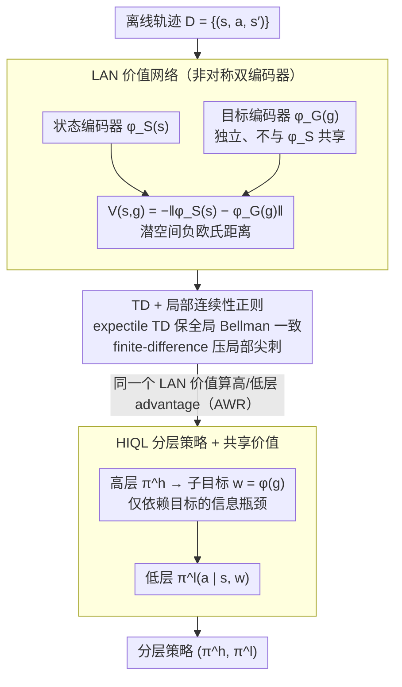

# Latent Representation Alignment for Offline Goal-Conditioned Reinforcement Learning

**会议**: ICML 2026  
**arXiv**: [2605.25740](https://arxiv.org/abs/2605.25740)  
**代码**: https://github.com/oh-lab/LAVL.git (有)  
**领域**: 强化学习 / 离线目标条件 RL / 表示学习  
**关键词**: 离线 GCRL, 价值函数架构, 潜表示对齐, 准度量, 分层策略

## 一句话总结
通过把 goal-conditioned 价值函数显式参数化为 **非对称潜空间中的负欧氏距离** $V(s,g)=-\|\varphi_S(s)-\varphi_G(g)\|_2$ 并配合连续性正则与 HIQL 分层结构，LAVL 在 OGBench 22 个数据集里拿下 20 个 SOTA，把 giant 迷宫和 stitch 数据集这类长程任务的成功率从基线的几乎为零拉到 80%+。

## 研究背景与动机

**领域现状**：离线 goal-conditioned RL (GCRL) 想从固定轨迹数据里学会"任意指定一个目标都能到达"的策略，主流路线之一是先学一个 goal-conditioned 价值函数 $V(s,g)$，再用 advantage-weighted regression 或 quasimetric constrained optimization 提取策略。HIQL、GCIVL、QRL、CGCIVL、OTA 等近期工作都围绕"价值函数怎么估"展开。

**现有痛点**：在长程稀疏奖励场景下，TD 学到的价值函数极不可靠：(i) horizon 一拉长（如 antmaze-giant、humanoidmaze-giant）成功率断崖下跌；(ii) stitch 类数据集（只有短轨迹片段、必须拼接传播奖励）尤其难；(iii) 部分方案要额外学一个 high-level 价值网络，多算多调。

**核心矛盾**：作者把"为什么 V 学不好"具体定位到一种叫 **overgeneralization（过度泛化）** 的失败模式——MLP 参数化的 $V(s,g)$ 倾向于把欧氏距离上接近 $g$ 的状态都赋予高价值，于是"墙的另一侧"明明 temporal distance 很大却被赋了高价值，价值"穿墙泄漏"。问题的根源是**价值函数架构的归纳偏置**，不是学习目标本身。已有的 quasimetric 架构（MRN、IQE）部分缓解了这点，但在 robotic manipulation 上反而崩盘，行为高度不稳定。

**本文目标**：找一种既能抑制 overgeneralization、又能在 maze 和 manipulation 两类截然不同任务上都稳的价值函数架构，并把它无缝塞进分层策略里以处理长 horizon。

**切入角度**：通过可视化和"GCIVL × IQE / QRL × MLP"的交叉消融，作者把"性能差异"归因于架构而非目标；进一步发现 quasimetric 的严格度量约束本身就是过强的归纳偏置，会损害 manipulation 这种几何结构不一致的任务。一个**弱化的、可学的**潜空间距离应该比硬性 quasimetric 更普适。

**核心 idea**：把 $V(s,g)$ 写成"状态嵌入到目标嵌入的潜空间欧氏距离"，但**故意让状态编码器和目标编码器不共享**——用非对称性打破严格 metric，换来跨任务的稳定性。

## 方法详解

### 整体框架
LAVL 是一个 IVL（implicit V-learning）风格的离线 GCRL 算法，由三块拼成：(1) 价值网络 LAN，把 $V(s,g)$ 参数化成两个非对称编码器输出之间的负欧氏距离；(2) TD + 局部连续性正则的联合损失，用来在长 horizon 下既保证全局 Bellman 一致又抑制局部振荡；(3) HIQL 风格的分层策略，但子目标表示只依赖目标本身 $w=\phi(g)$，并复用同一个 LAN 价值函数为高/低层策略提供 advantage，无需额外的 high-level value head。整套 pipeline 输入是离线轨迹 $\mathcal{D}=\{(s_t,a_t,s_{t+1})\}$，输出是 hierarchical 策略对 $(\pi^h,\pi^l)$。

### 关键设计

**1. Latent Alignment Network（LAN）：用非对称双编码器从架构上堵住 overgeneralization**

前面把"价值学不好"定位到了架构层面的过度泛化——MLP 参数化的 $V(s,g)$ 会按原始状态空间欧氏距离泛化，于是"墙另一侧"的状态明明 temporal distance 很大却被赋高价值、价值穿墙泄漏。LAN 的对策是换一种泛化方式：用两个**独立、不共享**的网络 $\varphi_S:\mathcal{S}\to\mathbb{R}^d$ 和 $\varphi_G:\mathcal{G}\to\mathbb{R}^d$ 分别嵌入状态和目标，再把价值定义成潜空间负欧氏距离

$$V(s,g)=-\|\varphi_S(s)-\varphi_G(g)\|_2.$$

价值不再沿原始几何扩散，而是沿"潜空间对齐"泛化。为什么故意不共享编码器、不要求严格 metric？因为纯 MLP 会穿墙泄漏，而严格 quasimetric（MRN/IQE）虽满足三角不等式、在 maze 上漂亮，却在几何结构不一致的 manipulation 上崩盘。非对称双编码器是个折中——保留"由 latent 距离来 induct"的好处，又不硬加三角不等式，于是 maze 和 manipulation 两类任务都能稳（消融里 GCIVL+LAN 全面优于或持平 MLP/MRN/IQE/Hilbert 四种参数化）。

**2. TD + 局部连续性正则：在长 horizon 下既保全局一致又压住局部尖刺**

LAN 解决了泛化方式，但稀疏奖励 + 长 horizon 下 Bellman 项对局部几何欠约束，价值仍会出现尖锐震荡。TD 部分用 expectile 损失 $\mathcal{L}_{TD}(V)=\mathbb{E}[\ell_2^\kappa(r(s,g)+\gamma\tilde V(s',g)-V(s,g))]$ 保证全局 Bellman 一致，再叠一项 finite-difference 正则

$$\mathcal{L}_{Reg}(V)=\mathbb{E}\big[\big((V(s,g)-V(s',g))^2-\delta^2\big)_+\big],$$

只在邻接状态间的价值差**超过阈值** $\delta$ 时才惩罚（阈值自适应取 $\delta=1+(1-\gamma)|\bar V|$），总损失 $\mathcal{L}(V)=\mathcal{L}_{TD}+w_c\mathcal{L}_{Reg}$。相比 Giammarino et al. 2025 用梯度范数正则得算 $\nabla_s V$，finite-difference 几乎零额外开销却效果惊人——消融显示它单独一项就把 pointmaze-giant 成功率从 35% 拉到 95%，是个可迁移到任何 TD 学习场景的长 horizon 稳定器。

**3. HIQL 分层 + 目标驱动子目标 + 共享价值：接入分层框架还省掉额外的高层 value head**

要处理长 horizon 得上分层策略。高层 $\pi^h(w|s,g)$ 产生子目标表示 $w=\phi(g)$（**只依赖目标**，而非 HIQL 原实现里的 $\phi([g,s])$，相当于在 goal 端再插一个信息瓶颈），低层 $\pi^l(a|s,w)$ 执行动作，两层都用 AWR 训练。关键是 advantage 全部从**同一个** LAN 价值算出：$A^h=V(s_{t+k},g)-V(s_t,g)$、$A^l=V(s_{t+1},s_{t+k})-V(s_t,s_{t+k})$，不再单独训一个 high-level value head。消融（Figure 7）显示，光把高层换成独立 value（LAVL-HV）就已经能把 HIQL 从 0% 拉到 80%+，而统一 value 还更好——说明只要 LAN 本身足够 informative，让它同时承担"高层信号"和"低层与子目标耦合"两件事反而占优，顺带省掉一个网络、减少调参成本。

### 损失函数 / 训练策略
价值阶段联合优化 $\mathcal{L}_{TD}+w_c\mathcal{L}_{Reg}$；策略阶段两层都用 AWR；潜维度全实验固定 $d=64$ 不调，$w_c$ 任务自适应；目标采样混合 future / random 两种分布。

## 实验关键数据

### 主实验
OGBench 22 个数据集，每任务 8 seeds 平均成功率（%）：

| 任务族 | 数据集 | HIQL | OTA | CGCIVL | QRL | **LAVL** |
|--------|--------|------|-----|--------|-----|----------|
| Pointmaze | giant-navigate | 46 | 72 | 65 | 68 | **91** |
| Antmaze | giant-stitch | 2 | 37 | 8 | 0 | **82** |
| Humanoidmaze | large-stitch | 28 | 57 | 20 | 3 | **72** |
| Cube | single-play | 15 | 9 | 23 | 5 | **83** |
| Scene | play | 38 | 30 | 56 | 5 | **88** |

LAVL 在 22 个数据集中拿下 20 个最佳；在 Cube/Scene 这类 manipulation 上对 HIQL 和 OTA 的优势尤为悬殊（83 vs 15、88 vs 30），印证 LAN 在 manipulation 上没有 quasimetric 那种"水土不服"。

### 消融实验

| 配置 | pointmaze-giant 成功率 | 说明 |
|------|-----------------------|------|
| LAVL 完整 | 95 | 完整模型 |
| LAVL w/o 连续性正则 | 35 | 长 horizon 价值震荡导致策略崩溃 |
| LAVL 换成 IQE 价值 | antmaze-giant 与 LAN 相近, scene <20 | 在 manipulation 上 IQE/MRN/Hilbert 全部 <20% |
| LAVL-HV（高低层独立 value） | maze 上 80+ 但弱于 LAVL | 验证统一 LAN value 更优 |

### 关键发现
- **架构是 bottleneck，不是目标**：GCIVL+IQE 缓解 overgeneralization，QRL+MLP 严重不稳；把 IQE/MRN/Hilbert/MLP 全替成 LAN 在 manipulation 上唯一一个不崩的（>80% vs <40%）
- **horizon 鲁棒性**：medium→giant 迷宫成功率相对下降 LAVL 仅 9.6%，OTA 23%、CGCIVL 58%、HIQL 75%
- **stitch 鲁棒性**：navigate→stitch 平均相对下降 LAVL 1.1%，OTA/CGCIVL/HIQL 都 18%+
- **超参不敏感**：潜维度 16→256 性能基本不变，固定 64 全程不调

## 亮点与洞察
- **"价值函数架构是 GCRL 的归纳偏置主战场"** 这个 framing 很有冲击力——多年来大家都在改 objective（TD vs contrastive vs constrained），这篇用交叉消融把锅扣在架构上
- **非对称双编码器** 是个简单到容易被忽略的设计：放弃 metric 性反而换来跨任务的稳健，挑战了"quasimetric 是最优价值函数的必要结构"这种直觉
- **finite-difference 局部正则** 比 Giammarino 的梯度范数正则计算便宜得多，pointmaze-giant 上 35%→95% 单点贡献巨大，可以迁移到任何 TD 学习场景作为长 horizon 稳定器
- **统一价值同时为高低层策略服务** 把 HIQL 系工作里 "high-level value 要不要独立"这个争论拉出明确结论：只要 value 本身足够 informative，统一反而更好

## 局限与展望
- 仅在 OGBench 仿真上验证，真实机器人控制和更复杂模拟未覆盖
- LAN 抛弃了 quasimetric 的理论保证，作者只给出经验性论证，最优 $V$ 的 quasimetric 性质和 LAN 表达力之间的差距没有形式刻画
- 长 horizon 高维动作空间下，分层 policy extraction 本身依然是瓶颈，作者明确点名 orthogonal future work
- 连续性正则的阈值 $\delta$ 用 batch mean 自适应，原理性较弱，在分布快速漂移的 online 设置可能失效

## 相关工作与启发
- **vs QRL (Wang+2023)**：QRL 靠 IQE 架构 + constrained optimization，在 maze 上强、在 manipulation 上崩；LAVL 表明 QRL 的优势全来自 IQE 而非 objective，LAN 用更弱的归纳偏置反而更普适
- **vs HIQL (Park+2023)**：相同分层骨架，把 MLP value 换成 LAN，把子目标表示从 $\phi([g,s])$ 改回 $\phi(g)$；giant-stitch 上从 2% 提到 82%+
- **vs OTA (Ahn+2025) / CGCIVL (Ke+2025)**：这两者用 option/conservatism 改进 value 估计，LAVL 的相对鲁棒性指标（giant drop 9.6% vs 23% / 58%）说明改架构比改 objective 受益更大
- **vs Hilbert 表示 (Park+2024)**：Hilbert 用单一 metric embedding 作下游表征；LAN 把"嵌入"直接定义为价值函数本身，且打破对称性

## 评分
- 新颖性: ⭐⭐⭐⭐ 非对称潜对齐架构和 framing 都有新意，但单看每个组件都不算颠覆
- 实验充分度: ⭐⭐⭐⭐⭐ 22 个数据集 + 4 种架构交叉消融 + 超参敏感性 + 分层 value 对比，覆盖很扎实
- 写作质量: ⭐⭐⭐⭐⭐ Section 4 用 Question 1/2 的推进 + 可视化引出，论证链非常清晰
- 价值: ⭐⭐⭐⭐⭐ 把"改架构"明确为 GCRL 的核心改进路径，对后续工作方向影响大

## 评分
- 新颖性: 待评
- 实验充分度: 待评
- 写作质量: 待评
- 价值: 待评

<!-- RELATED:START -->

## 相关论文

- [\[ICML 2026\] Compositional Transduction with Latent Analogies for Offline Goal-Conditioned Reinforcement Learning](compositional_transduction_with_latent_analogies_for_offline_goal-conditioned_re.md)
- [\[AAAI 2026\] First-Order Representation Languages for Goal-Conditioned RL](../../AAAI2026/reinforcement_learning/first-order_representation_languages_for_goal-conditioned_rl.md)
- [\[ICML 2026\] Offline Reinforcement Learning with Universal Horizon Models](offline_reinforcement_learning_with_universal_horizon_models.md)
- [\[ICML 2026\] Trajectory-Level Data Augmentation for Offline Reinforcement Learning](trajectory-level_data_augmentation_for_offline_reinforcement_learning.md)
- [\[ICML 2026\] Long-Horizon Model-Based Offline Reinforcement Learning Without Explicit Conservatism](long-horizon_model-based_offline_reinforcement_learning_without_explicit_conserv.md)

<!-- RELATED:END -->
