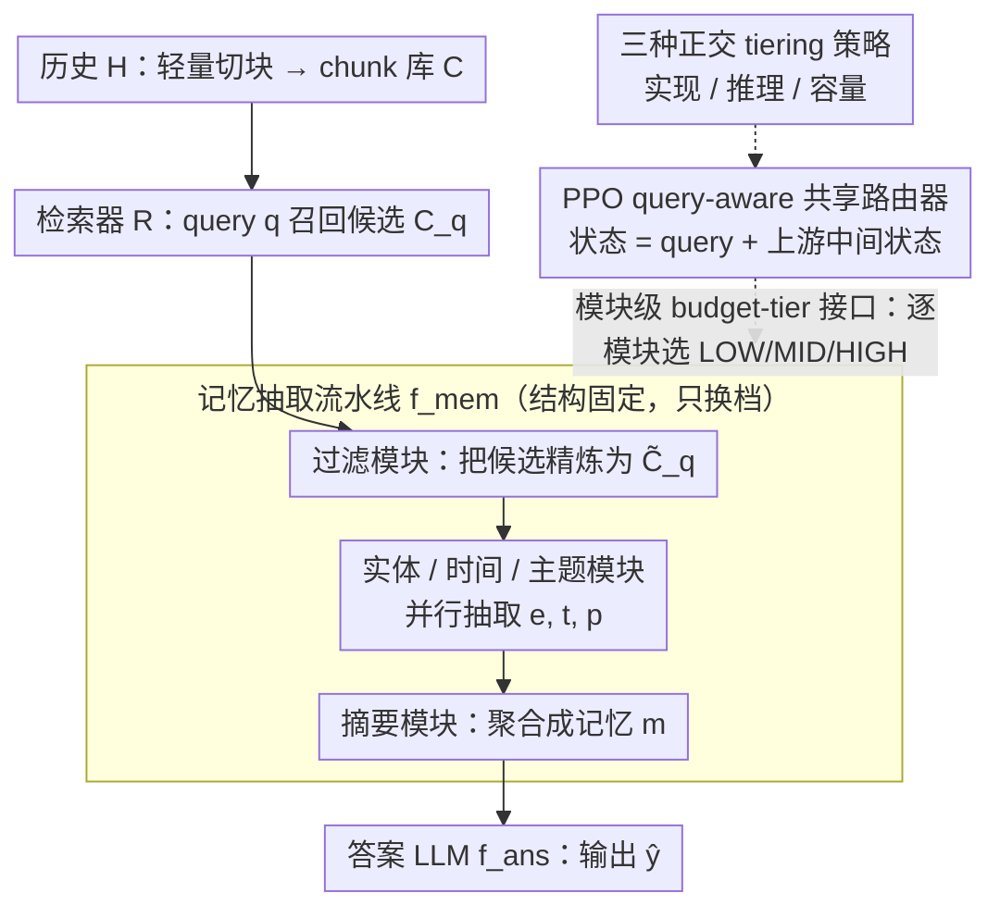

# Learning Query-Aware Budget-Tier Routing for Runtime Agent Memory

**会议**: ICML 2026  
**arXiv**: [2602.06025](https://arxiv.org/abs/2602.06025)  
**代码**: https://github.com/ViktorAxelsen/BudgetMem  
**领域**: LLM Agent / 长期记忆 / 推理时算力调度  
**关键词**: agent memory, runtime extraction, budget-tier routing, RL router, performance-cost trade-off  

## 一句话总结
BudgetMem 把"运行时智能体记忆抽取"重新组织成"过滤 → 实体/时间/主题并行 → 摘要"的模块化流水线，给每个模块挂上 LOW/MID/HIGH 三档预算接口，并用 PPO 训练一个共享的轻量路由器在 query 到来时为每个模块挑档位，从而在 LoCoMo、LongMemEval、HotpotQA 上同时改善了 F1/Judge 和单 query 平均成本。

## 研究背景与动机

**领域现状**：当前主流的 LLM agent 记忆系统几乎都走"离线、与 query 无关"的路线：聊天历史一旦产生就被预先压缩、摘要、写入向量库或知识图，例如 MemoryBank、Mem0、A-MEM 这类做法把"建索引"和"用记忆"完全解耦，问答时只需检索。

**现有痛点**：这种"build once, use always"范式与具体 query 没耦合，既浪费——预处理花的算力可能对当前 query 完全无用；又脆弱——离线时的摘要/压缩可能丢掉对某些 query 至关重要的细节。一个更自然的替代是"on-demand"：等 query 来了再去原始历史里抽。但这会把昂贵的 LLM 调用推到推理时，让成本和延迟变成一等公民，而现有运行时记忆系统（ReadAgent、LightMem 等）对成本-效果折中几乎没有显式控制旋钮。

**核心矛盾**：要可控地在运行时换取"质量-成本"曲线，需要回答两个被前人混在一起的子问题——预算应该加在 *哪里*（pipeline 的哪个粒度上），以及预算应该 *怎么实现*（同样省掉一倍 token，可以靠换实现、换推理方式、换模型大小这三种正交手段）。

**本文目标**：构造一个统一的运行时记忆框架，让"预算单位"显式到模块级、"预算实现方式"可被并列比较，且整体折中可以学出来而非靠人工调。

**切入角度**：把记忆抽取写成多阶段模块流水线，给每个模块强制实现一个相同的"budget-tier 接口"（同一份输入/输出契约下提供三个档位），路由决策就退化为"对每个模块在 3 个档位里选一个"的小规模序列决策问题。

**核心 idea**：用一个共享小路由器，以 query + 上一阶段中间状态为状态，用 PPO 在"任务奖励 + 成本惩罚"上学出 query-aware 的模块级档位选择，把成本控制从离线/人工"挪到"在线/可学。

## 方法详解

### 整体框架
给定历史 $H$，先做一次任务无关的轻量切块得到 chunk 库 $C=\{c_i\}_{i=1}^{N}$；query $q$ 到来后由检索器 $R$ 返回候选 $C_q = R(q, C)\subset C$。记忆抽取被定义为 $m = f_{mem}(q, C_q)$，最终答案 $\hat y = f_{ans}(q, m)$ 由一个固定的 LLM 给出。$f_{mem}$ 是一条固定结构的模块流水线：先用过滤模块 $M_{fil}$ 把 $C_q$ 精炼成 $\tilde C_q$，再让实体模块 $M_{ent}$、时间模块 $M_{tmp}$、主题模块 $M_{top}$ 并行抽取出 $e,t,p$，最后由摘要模块 $M_{sum}$ 聚合成 $m$。流水线结构始终不变，只在每个模块内部通过路由器换档。三者关系是：流水线给出固定骨架，**模块级 budget-tier 接口**让每个模块都暴露 LOW/MID/HIGH 三档，**三种正交 tiering 策略**定义这三档具体怎么实现，**PPO 共享路由器**则在 query 到来时为骨架上的每个模块挑一档。

### 关键设计

**1. 模块级 budget-tier 接口：把每个模块包装成同一套输入输出契约，但内部有 LOW/MID/HIGH 三档实现**

直接给答案 LLM 加 budget knob 是"事后补救"，看不见花在记忆抽取上的钱，所以 BudgetMem 把预算下沉到模块级。所有模块共用同一个抽象签名（输入 query + 上游中间状态，输出当前阶段的中间表示），三个档位对应不同的实现复杂度或推理代价。这样路由决策就退化成一个 3 选 1 的离散动作，不必重新设计 pipeline，又能精确知道某条 query 究竟在过滤、抽实体还是摘要上"过度消费"，从而对症下药。

**2. 三种正交的 tiering 策略：在统一框架下并列比较"换实现/换推理/换容量"三种把质量换成本的方式**

现实里 reasoning level 和 model size 经常被同时改动，难以判断真正起作用的是哪个旋钮，BudgetMem 把它们分到三条正交轴上。implementation tiering——LOW 用规则或模式匹配、MID 用 BERT 类小专家模型、HIGH 升级为 LLM；reasoning tiering——同一 backbone 下 LOW 直答、MID 走 CoT、HIGH 用多步/reflection；capacity tiering——同一算法用不同尺寸的 LM。分离这三轴就能告诉系统设计者"低预算下哪种策略最划算、高预算下又是谁封顶"——实验里 capacity tiering 上限最高，implementation tiering 在成本极紧的区段帕累托更优。

**3. PPO 训练的 query-aware 共享路由器：把路由建模成序列决策，端到端按"任务表现 + 抽取成本"奖励来训**

路径上含非可微的 LLM 调用，必须用 RL。在每个模块 invocation 步 $k$ 观察状态 $s_k$（由 query $q$、上游模块输出和"模块描述符"拼成的紧凑 embedding）、输出动作 $a_k\in\{\text{LOW},\text{MID},\text{HIGH}\}$，单个 query 跑完整条流水线算一个 episode。奖励 $r = r_{task} + \lambda\cdot\alpha\cdot r_{cost}$ 把任务侧 $r_{task}\in[0,1]$ 与抽取成本 $c_{raw}=\sum_k c(M_k, a_k)$（LLM 档按 token 价折算、非 LLM 档忽略）放一起，成本先做滑窗分位数归一化 $\tilde c = (\sqrt{c_{raw}}-Q_5)/(Q_{95}-Q_5)$、$r_{cost}=1-\mathrm{clip}(\tilde c,0,1)$，再乘一个方差对齐因子 $\alpha = \mathrm{std}(r_{task})/(\mathrm{std}(r_{cost})+\epsilon)$ 防止高方差项支配梯度。$\lambda$ 是部署期可调的偏好开关（performance-first 调低、tight-budget 调高），无需重训路由器；$\alpha$ 则专治"任务奖励 vs 成本奖励量纲不匹配"的训练不稳——消融里去掉它，路由器后期会被成本奖励主导、塌缩到全 LOW。

### 损失函数 / 训练策略
用 PPO 优化路由策略 $\pi_\theta$，每 query 一个 episode，奖励即 Eq. (7)。$\lambda$ 是部署期可调的偏好开关：performance-first 把 $\lambda$ 调低、tight-budget 把 $\lambda$ 调高，无需重训路由器（只是改奖励权重时的偏好曲线）。

## 实验关键数据

### 主实验
评测在 LoCoMo、LongMemEval、HotpotQA 三个长程记忆 / 长上下文 QA 基准上完成，指标包括 F1、LLM-as-a-Judge 和"单 query 平均成本"。下表汇总 LLaMA-3.3-70B-Instruct backbone 下 *performance-first* 设置的平均结果（数字摘自论文 Table 1，跨三个数据集求平均）。

| 方法 | Avg F1 | Avg Judge | Avg Cost ↓ |
|------|--------|-----------|------------|
| MemoryBank | 23.75 | 28.47 | 4.14 |
| A-MEM | 30.47 | 40.27 | 32.07 |
| Mem0 | 22.26 | 35.66 | 6.92 |
| MemoryOS | 26.03 | 37.14 | 18.04 |
| LightMem | 35.45 | 49.21 | 5.63 |
| **BudgetMem-IMP** | 41.84 | 57.36 | **1.29** |
| **BudgetMem-REA** | 44.19 | 57.39 | 1.52 |
| **BudgetMem-CAP** | **45.72** | **59.99** | 1.38 |

三种 tiering 策略都比 LightMem 这种强 runtime baseline 同时多出 6~10 个 F1 点并把平均成本压到原来的 1/4 以下；capacity tiering 在三轴里上限最高，implementation tiering 在低预算端最便宜。

### 消融实验
| 配置 | 关键现象 | 说明 |
|------|---------|------|
| 全 HIGH 档（无路由） | 性能略升，成本爆炸 | 印证"一刀切大模型"是常见但低效的默认做法 |
| 全 LOW 档（无路由） | 成本最低，但 F1 / Judge 显著掉 | query 不分难度地用规则/小模型，丢失关键细节 |
| 随机路由 + 固定预算 | 成本相近但分数低于 BudgetMem | 证明 query-aware 的学习路由不可替代 |
| 去掉 $\alpha$（不做方差对齐） | 训练后期成本奖励主导，路由器塌缩到全 LOW | 表明 reward-scale 对齐是稳定训练的关键 |

### 关键发现
- 同一份算力预算下，capacity tiering 通常带来最高的质量上限，但 implementation tiering 在"成本极紧"的区段帕累托更优——说明在不同预算区段最优 knob 不同。
- 路由器是共享且轻量的：所有模块共用一份小策略，仅靠模块描述符区分上下文，避免了"每模块一个路由器"带来的参数膨胀和数据稀疏。
- 经过滑窗归一化的 $r_{cost}$ 让不同数据集下的成本能放进同一个 $[0,1]$ 区间，是把 RL 路由跨数据集直接迁移的实践前提。

## 亮点与洞察
- "模块级 + 三档接口 + 共享小路由器"这套抽象非常干净：它把记忆系统的"预算控制问题"从一团粘连的工程参数显式成一个 3 选 1 的小 RL 问题，是其他 agent 子系统（工具调用、检索深度、reflection 步数）都能直接照搬的范式。
- 同时拆出 *implementation / reasoning / capacity* 三种 tiering 并放在同一 testbed 里比较，第一次给出了"低预算用换实现、高预算用换容量"这种实践口径的实证证据，对系统侧很有指导性。
- 成本侧用滑窗分位数 + 方差对齐解决"任务奖励 vs 成本奖励量纲打架"是个被很多 RL-for-LLM-routing 工作忽略的小细节，但实测对收敛稳定性影响很大，可直接复用到任何"质量 + 成本"双目标 RL 训练中。

## 局限与展望
- 当前 pipeline 形态是手工设计的 "filter → entity/temporal/topic → summary"，对其他领域（如代码 agent、视觉 agent）的最优模块切分仍需重做；框架本身虽然结构无关，但模块拆分本身没有被一同优化。
- 三档离散预算粒度足够实用但显然不够细，未来可以扩展为连续 budget 或更长的档位列表，对应也要换更细的探索策略。
- $\lambda$ 是部署期手调旋钮，作者没有给出"给定 SLA 自动反解 $\lambda$"的方法；在生产中往往需要按 latency/budget 配额自动选 $\lambda$。
- 成本只计 token 价格，没有把 GPU 时间、缓存、跨节点通信这些真实部署成本建模进来，工业落地时需要替换 $c(\cdot)$ 的定义。

## 相关工作与启发
- **vs LightMem / MemoryOS**：同样是 runtime 记忆，但 LightMem 把成本控制隐式塞进 pipeline 设计里，缺少显式 knob；BudgetMem 显式暴露模块级档位，能在同 backbone 下扫出整条 Pareto 曲线。
- **vs Mem0 / MemoryBank / A-MEM**：这些方法是 *offline* 记忆构建，做的是"建好再查"；BudgetMem 走 *on-demand* 路线，强调 query-aware 抽取，并通过路由器把推理成本压回到与离线方法相当甚至更低的水平。
- **vs LLM router（如 RouteLLM、LLM-Blender）**：经典 LLM 路由只在"答案 LLM 端"换模型；BudgetMem 把同样的路由思想下沉到记忆抽取的每个子模块，把"路由"从粗粒度推向 pipeline 内部，可视为 LLM routing 在 agent 内部的细粒度延伸。

## 评分
- 新颖性: 待评
- 实验充分度: 待评
- 写作质量: 待评
- 价值: 待评

<!-- RELATED:START -->

## 相关论文

- [\[ICML 2026\] Multi-Agent Decision-Focused Learning via Value-Aware Sequential Communication](multi-agent_decision-focused_learning_via_value-aware_sequential_communication.md)
- [\[ICML 2026\] Flow-Equivariant World Models: Memory for Partially Observed Dynamic Environments](flow_equivariant_world_models_memory_for_partially_observed_dynamic_environments.md)
- [\[ICML 2026\] Vulnerable Agent Identification in Large-Scale Multi-Agent Reinforcement Learning](vulnerable_agent_identification_in_large-scale_multi-agent_reinforcement_learnin.md)
- [\[ICLR 2026\] Routing, Cascades, and User Choice for LLMs](../../ICLR2026/reinforcement_learning/routing_cascades_and_user_choice_for_llms.md)
- [\[ICML 2026\] Learning to Bet for Horizon-Aware Anytime-Valid Testing](learning_to_bet_for_horizon-aware_anytime-valid_testing.md)

<!-- RELATED:END -->
