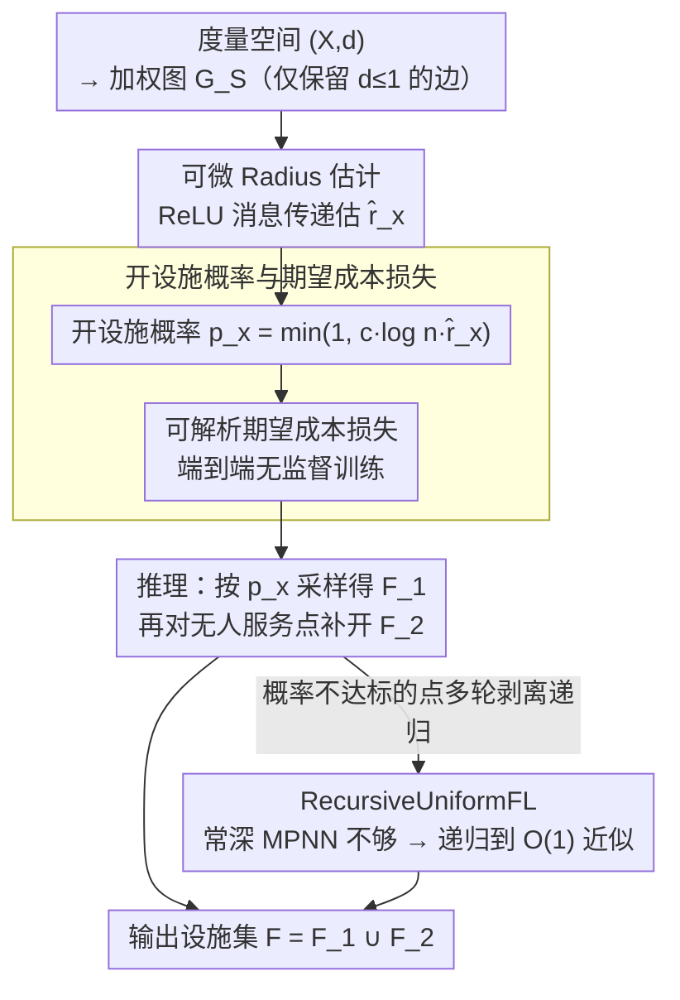

# Learning to Approximate Uniform Facility Location via Graph Neural Networks

**会议**: ICML 2026  
**arXiv**: [2602.13155](https://arxiv.org/abs/2602.13155)  
**代码**: 未提及  
**领域**: 神经组合优化 / MPNN / 学习型近似算法  
**关键词**: Uniform Facility Location, MPNN, approximation guarantee, unsupervised, JL-style 分析

## 一句话总结
本文为 Uniform Facility Location 设计了一个把经典近似算法 SimpleUniformFL 神经化的 MPNN，**既可用无监督期望成本损失端到端训练，也具备 $\mathcal{O}(\log n)$（递归版还能到 $\mathcal{O}(1)$）的可证明近似界**，实验上既打过 SimpleUniformFL 经典算法、也逼近 ILP 最优。

## 研究背景与动机
**领域现状**：近年很多用 MPNN 端到端学组合优化的工作（CO-with-GNN、neural CO、karalias22 等），主要分两派：(1) 把 MPNN 当 end-to-end 启发式；(2) 把 MPNN 塞进经典精确求解器（如 branch-and-cut）当 cut/variable selection 启发式。

**现有痛点**：(1) 监督学习需要昂贵的最优解标签；离散目标不可导又逼出 straight-through、Gumbel-softmax、I-MLE、SIMPLE 等代理梯度，**训练脆弱难调**。(2) end-to-end 神经方法**几乎全部缺乏解质量保证**——分布内表现好，OOD 立刻崩。(3) 经典近似算法虽有 worst-case 保证但 distribution-agnostic，不能利用真实数据中的结构规律。

**核心矛盾**：robust 但保守的近似算法 vs expressive 但脆弱（且无保证）的学习型求解器，二者优势难兼得。

**本文目标**：在 Uniform Facility Location (UniFL) 这个 NP-hard 但有清晰局部结构的经典问题上，做出一个**同时具备 (i) 全可微 (ii) 无监督 (iii) 可证近似界 (iv) 能挖数据结构**的 MPNN 架构。

**切入角度**：UniFL 有著名的 radius-based 局部结构（mettu2003online、Badoiu2005）——节点的 radius $r_x$（满足 $\sum_{y \in B(x, r_x)} (r_x - d(y,x)) = 1$）已知后简单按 $\min(1, c \cdot \ln n \cdot r_x)$ 开设施就得到 $\mathcal{O}(\log n)$ 近似。这种"局部计算 + 概率开设施"的结构天然适合 message passing。

**核心 idea**：**把 SimpleUniformFL 的 radius 计算和开设施概率都写成 ReLU MPNN 层；用一个可解析积分的期望成本作为无监督损失**，理论上证明存在参数使 MPNN 重现 $\mathcal{O}(\log n)$ 近似，递归版 RecursiveUniformFL 进一步达到 $\mathcal{O}(1)$ 近似。

## 方法详解

### 整体框架
UniFL 把度量空间 $(\mathcal{X}, d)$ 编码为加权图 $G_S$（只保留 $d(u,v) \leq 1$ 的边）。MPNN 工作流：(1) 每个点 $x$ 用本地消息传递估计 radius $\hat r_x$；(2) 用 FNN 把 $\hat r_x$ 映射成开设施概率 $p_x$；(3) 期望成本损失端到端无监督训练；(4) 推理时按 $p_x$ 独立采样得到 $F_1$，再对没人服务的点开设施得到 $F_2$，最终输出 $F = F_1 \cup F_2$。递归扩展版 RecursiveUniformFL 在概率不达标的点上多轮调用，达到常数因子近似。

### 关键设计

**1. 可微的 Radius 估计：把 UniFL 的关键量 radius 写成 ReLU 消息传递，让它能被反传**

UniFL 的近似算法核心是每个点的 radius $r_x$（满足 $\sum_{y\in B(x,r_x)}(r_x-d(y,x))=1$），但这个量是离散迭代算出来的、不可导。作者把 $(0,1]$ 离散成 $0=a_0<a_1<\cdots<a_k=1$，对每个 bin 算指示量 $t_x^{(i)}=\min\{1,\sum_{y\in N(x)}\text{reLU}(a_i-d(x,y))\}$，并改写成两层 ReLU FNN $t_x^{(i)}=\text{FNN}_{2,3}(\sum_y\text{FNN}_{1,3}(a_i,d(x,y)))$；若 $r_x\ge a_i$ 则 $t_x^{(i)}$ 应为 1，于是 radius 估计取 $\hat r_x=\sum_i a_i(t_x^{(i-1)}-t_x^{(i)})$。之所以能这么干，是因为 radius 的定义本身就是"在 ball 内累计 $r_x-d(y,x)=1$"，等价于一个 ReLU 求和——显式构造而非黑盒"希望网络学到"，这才让后面的近似界能严格推到 MPNN 上。

**2. 开设施概率与可解析的期望成本损失：把组合目标写成闭式可微，彻底绕开 STE/Gumbel 那套噪声梯度**

离散目标不可导，端到端 neural CO 普遍靠 straight-through、Gumbel-softmax 等代理梯度，训练脆弱难调。本文把开设施概率写成 $p_x=\min\{1,c\log(n)\cdot\hat r_x\}\equiv\text{FNN}_{2,3}(n,\hat r_x)$，再依据"$F_1$ 独立采样、$F_2$ 在无人服务时自动开"的算法逻辑，把期望成本写成完全解析的形式：

$$\mathbb{E}[\text{cost}]=\sum_f p_f+\sum_f\prod_{x:d(x,f)<1}(1-p_x)+\sum_x\sum_{f:d(x,f)<1}d(x,f)\cdot p_f\prod_{z:d(x,z)<d(x,f)}(1-p_z),$$

三项分别是"独立开设施"、"没人覆盖时强制开"、"被最近开放设施服务的期望距离"。所有 $\min,\prod,\sum$ 都对 $p_x$ 可微，绕开了离散 + STE 的不稳定训练，又因为利用 UniFL 的稀疏结构把复杂度压到 $\mathcal{O}(nd^2)$（$d$ 是最大度）；更关键的是它和 SimpleUniformFL 算法语义一一对应，方便后面证近似界。

**3. 从 $\mathcal{O}(\log n)$ 到 $\mathcal{O}(1)$ 的 RecursiveUniformFL：用递归剥离把 $\log n$ 因子改进成常数**

简单算法只有 $\mathcal{O}(\log n)$ 近似，而 Prop 4 给出下界——单独的常深 MPNN 即使最优参数也只能到 $\Omega(\log n/2)$，说明递归不可或缺。作者把概率改成 $\min\{1,c\cdot d(x,F),c\cdot r_x\}$，加进"与现有设施距离"项；每轮把已被某个 $f\in F$ 在 $6r_x$ 内服务的点 assign 掉，剩下的进下一轮递归应用同一架构。理论上 Prop 3 证明存在参数让 MPNN 重现 $\mathcal{O}(\log n)$ 界、递归后达 $\mathcal{O}(1)$，Prop 5 进一步证明从有限训练集 + 正则项学到的参数能泛化到任意大小 $n$ 的实例。这种"上界（能重现经典算法）+ 下界（常深 MPNN 不够）"的双证态度，给"为何要递归"提供了硬辩护。

### 损失函数 / 训练策略
损失就是上文期望成本解析式，纯无监督（不需要 ILP 最优解作监督）。训练时把 MPNN 当 $p_x$ 生成器，推理时按 SimpleUniformFL post-process（4-6 行）落地为离散解，并报告 1000 次采样平均成本。可改成 $k$-Means 目标只需把最后一项的 distance 换成平方欧氏距离。常数 $c$ 用 grid search 调。

## 实验关键数据

### 主实验

| 候选方法 | Geo-1000-2 (Open) | 评价 |
|---|---|---|
| ILP Solver（最优） | 366.302 | 上界对照 |
| SimpleUniformFL（基线） | 高于 MPNN | $\mathcal{O}(\log n)$ 经典算法 |
| $\mathcal{O}(1)$-UFL (Gehweiler et al.) | 居中 | tuning-free 基线 |
| **MPNN (本文)** | 接近 ILP | 显著好于 SimpleUniformFL，逼近 ILP |
| KMeans++ / KMedoids++（同 $k$） | 与 MPNN 相当或略差 | 公平对照 |

跨 2/5/10 维度、sparse/dense 几何图全部一致优势。

### 消融与泛化

| 设置 | 关键指标 | 说明 |
|---|---|---|
| 训练 1000 点 → 测试 2k-10k 点 | 近似比稳定 | 验证 Prop 5 的 size generalization |
| Geo-1000-10-sparse vs dense | 均稳健 | 不依赖特定 density |
| 真实城市道路图（4 个 metro） | 显著好于经典基线 | 即便边权违反三角不等式仍可用 |
| $k$-Means 变体 | 与 KMeans++ 相当 | 损失里换距离平方即可，框架可扩展 |

### 关键发现
- "MPNN 不仅能模拟 SimpleUniformFL 的 $\mathcal{O}(\log n)$ 界，还能在分布内通过训练**严格优于**它"——这是"approximation algorithm meets data distribution"的明确实证。
- size generalization 在 5-10 倍训练规模上仍稳，对应 Prop 5 的有限训练集理论保证。
- 即使在违反三角不等式的真实路网上仍 work，说明 radius 思路对一般非严格度量也有弹性。
- 经典 $\mathcal{O}(1)$-UFL 算法（Gehweiler）虽然界更好但缺解析期望，不能写成可微损失，**MPNN 选择从 SimpleUniformFL 出发正是为了可微性**。

## 亮点与洞察
- 把 SimpleUniformFL 全程"神经化"——radius、概率、损失三件全部写成 ReLU FNN 表达，**让经典近似算法成为神经网络的初始化**，训练只能让结果更好（不会更差）。
- 期望成本损失是完全闭式的，绕开了 STE / Gumbel 那种代理梯度的脆弱性；同时利用 UniFL 的稀疏结构把复杂度压到 $\mathcal{O}(nd^2)$。
- Prop 4 显式证明"常深 MPNN 的能力上限是 $\Omega(\log n)$"，为"为何要递归"提供了下界辩护，这种"上下界双证"的态度在 neural CO 文献里稀缺。
- 把 size generalization 用 Prop 5 的有限训练集结果一般化，缓解了 neural CO 一贯的 OOD 焦虑。

## 局限与展望
- 只针对 Uniform FL（统一开设施成本）；general FL、capacitated FL、 $k$-median 等需要重新推导期望成本。
- 期望成本里的 $\prod$ 项对 $n$ 大的输入数值上可能 underflow；可能需要 log-space 求和。
- 训练用合成 GMM 几何图，没有研究在更复杂的真实分布（如电商物流真实需求图）上的迁移。
- 推理仍需 SimpleUniformFL post-process 采样 1000 次，速度上比一次 forward 慢；可探索 deterministic rounding。

## 相关工作与启发
- **vs 端到端 neural CO（karalias22 等）**：他们没有近似界，OOD 不可控；本文给出 $\mathcal{O}(\log n)$ / 递归后 $\mathcal{O}(1)$ 界。
- **vs branch-and-cut + GNN（Gas+2019）**：那种方法每次训练都要跑成千上万次完整求解器，训练成本爆炸；本文完全无监督。
- **vs algorithms with predictions**：他们把 ML 当黑盒、不可微；本文 ML 和算法在同一个可微 pipeline 里。
- **vs $\mathcal{O}(1)$-UFL（Gehweiler 等）**：那个算法理论界更好但缺解析期望表达，无法直接训练；本文牺牲一点理论上限换可微性，再用递归补回常数因子。

## 评分
- 新颖性: ⭐⭐⭐⭐⭐ "用 MPNN 神经化经典近似算法 + 解析期望损失 + 严格上下界"的组合非常硬核
- 实验充分度: ⭐⭐⭐⭐ 合成 + 真实路网 + size generalization + $k$-means 变体覆盖到位
- 写作质量: ⭐⭐⭐⭐ 命题与算法对应清晰，公式标号紧凑
- 价值: ⭐⭐⭐⭐ 对 neural CO 社区给出一个"可证 + 可学 + 可推广"的 reference 样本，思路可迁移到其它有 radius / 局部结构的问题

<!-- RELATED:START -->

## 相关论文

- [\[ICML 2026\] Convergence of Steepest Descent and Adam under Non-Uniform Smoothness](convergence_of_steepest_descent_and_adam_under_non-uniform_smoothness.md)
- [\[ICML 2026\] ASAP: Exploiting the Satisficing Generalization Edge in Neural Combinatorial Optimization](asap_exploiting_the_satisficing_generalization_edge_in_neural_combinatorial_opti.md)
- [\[ICML 2026\] RL4RLA: Teaching ML to Discover Randomized Linear Algebra Algorithms Through Curriculum Design and Graph-Based Search](rl4rla_teaching_ml_to_discover_randomized_linear_algebra_algorithms_through_curr.md)
- [\[NeurIPS 2025\] Distribution Learning Meets Graph Structure Sampling](../../NeurIPS2025/reinforcement_learning/distribution_learning_meets_graph_structure_sampling.md)
- [\[NeurIPS 2025\] A Theory of Multi-Agent Generative Flow Networks](../../NeurIPS2025/reinforcement_learning/a_theory_of_multi-agent_generative_flow_networks.md)

<!-- RELATED:END -->
