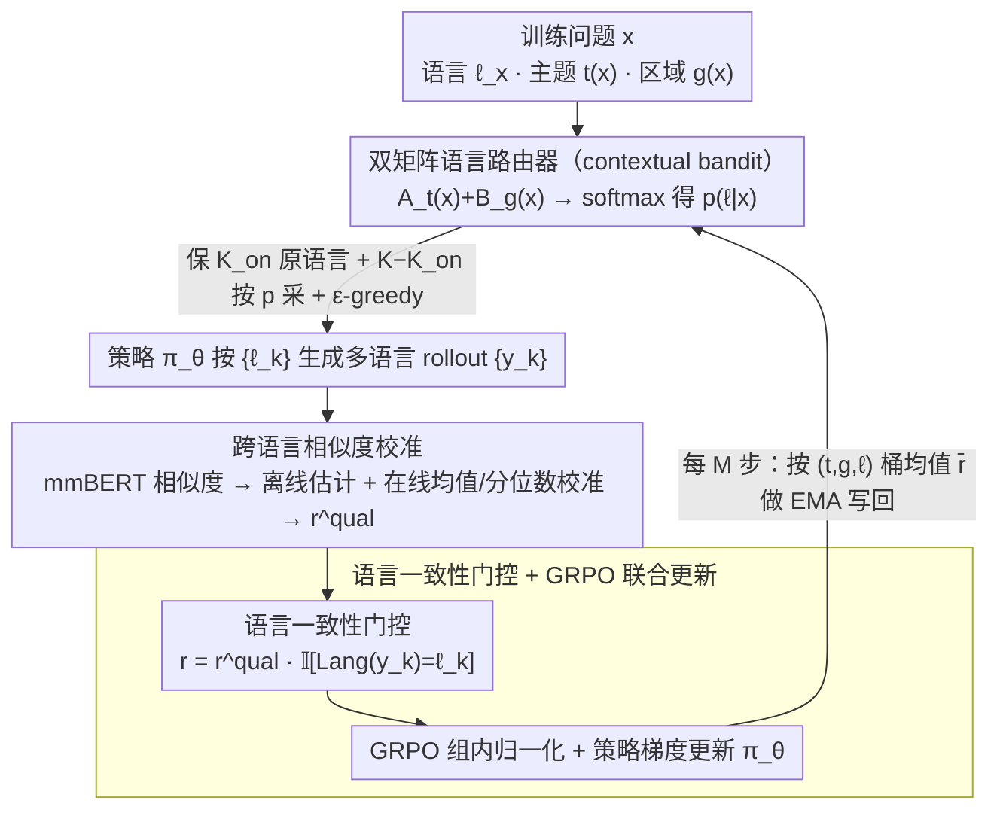

# Learning to Route Languages for Multilingual Policy Optimization

**会议**: ICML 2026  
**arXiv**: [2605.25360](https://arxiv.org/abs/2605.25360)  
**代码**: https://github.com/Guochry/LRPO (有)  
**领域**: 对齐RLHF / 多语言LLM / 在线策略优化  
**关键词**: 多语言 RL, GRPO, 语言路由器, 多臂老虎机, 跨语言奖励校准  

## 一句话总结
本文提出 LRPO（Language-Routed Policy Optimization），把"用哪个语言生成 rollout"当作可学习变量，用一个上下文 bandit 形式的语言路由器为每条训练样本在固定 rollout 预算下挑选最有信息量的语言组合，并通过离线估计 + 在线校准的跨语言相似度奖励把多语言 rollout 拉到同一个尺度上做 GRPO，在 Qwen/Llama/Gemma 三族骨干、五个多语言基准上稳定优于 GRPO 与各种 dominant-language 基线。

## 研究背景与动机
**领域现状**：现有把 LLM 推向多语言场景的 RL 流派主要有两条路线。一条是直接套用 GRPO（shao2024deepseekmath）：对每条训练问题在原语言里采样一组 rollout、用 reward 模型打分、组内归一化后做策略更新；另一条是显式构造跨语言偏好对（MAPO/LIDR/MPO），把英文（或其它"主导语言"）的回答当成天然更高质量的 anchor，让其他语言的回答去对齐它。

**现有痛点**：GRPO 路线把每个问题钉死在一种语言上，让"哪种语言能更准确地回答这个问题"完全交给模型内部的隐式机制，浪费了 LLM 在不同语言里编码的互补知识；主导语言路线则假设英文永远是更好的监督源，但这条假设在区域知识、文化语境强的问题上常常失效——比如关于"希腊礼节"的问题，阿拉伯语 rollout 反而比英文/中文 rollout 更接近正确答案。

**核心矛盾**：rollout 预算（每条问题 $K$ 条采样）有限的前提下，"用哪些语言来采"本身就是一个需要在线决策的探索-利用问题，但现有方法要么完全不决策（单语），要么用一个固定且常常错的先验（英文优先）。

**本文目标**：在固定 $K$ 个 rollout 的预算下，让模型自己学会"对哪种主题/区域的问题应该多采哪几种语言"，并把跨语言的 rollout 组合到同一个 GRPO 框架里做策略更新。

**切入角度**：把 "语言选择" 显式建模为一个 contextual multi-armed bandit——每条问题有它的主题 $t(x)$ 与可选区域 $g(x)$ 作为上下文，每种语言是一只 arm，arm 的回报就是该语言在该上下文下产生的平均 GRPO 奖励。同时，跨语言相似度作为 reward 信号本身需要先校准，否则不同语言对之间的 raw similarity 量纲不一致会把组内偏好搅乱。

**核心 idea**：用一个轻量的"主题×语言 + 区域×语言"双矩阵路由器在线学习语言选择策略，用离线统计 + 在线校准把多语言相似度 reward 拉到同一尺度，再喂回 GRPO 做联合优化。

## 方法详解
LRPO 把传统 GRPO 的 "采样 → 打分 → 更新" 三段式扩展成四段式：路由器先决定本轮要用哪些语言、策略按指定语言生成 rollout、跨语言校准 reward、最后 GRPO 更新策略并按 EMA 更新路由器。

### 整体框架
- **输入**：训练问题 $x$（原语言 $\ell_x$、主题 $t(x)$、可选区域 $g(x)$），策略 $\pi_\theta$，路由参数 $(\mathbf{A},\mathbf{B})$，rollout 预算 $K$，on-policy 配额 $K_{\text{on}}$。
- **路由阶段**：从主题矩阵 $\mathbf{A}_{t(x)}$ 与（若存在）区域矩阵 $\mathbf{B}_{g(x)}$ 合成 logits，经温度 $\tau$ softmax 得到语言分布 $p(\ell\mid x)$，先保留 $K_{\text{on}}$ 个在 $\ell_x$ 下采样（保 on-policy），剩余 $K-K_{\text{on}}$ 个按 $p$ 采样并叠加 $\epsilon$-greedy 保证最低探索。
- **rollout 阶段**：按采到的 $\{\ell_k\}$ 用语言 tag / target-language system prompt 引导 $\pi_\theta$ 生成 $\{y_k\}$。
- **奖励阶段**：用 mmBERT 算每个 rollout 与参考回答的跨语言语义相似度，再做语言对级别的均值或分位数校准，乘以"是否真的生成了目标语言"的指示器作为最终 reward。
- **更新阶段**：组内归一化后做 GRPO 梯度步；每 $M$ 步把按 $(t,g,\ell)$ 桶聚合的平均 reward 用 EMA 写回 $\mathbf{A},\mathbf{B}$。

### 关键设计

**1. 主题/区域双矩阵语言路由器（contextual bandit）：把"用哪种语言采"从隐式机制升级成可学习的探索-利用决策**

GRPO 把每个问题钉死在一种语言上，主导语言路线又默认英文永远更好，可"关于希腊礼节的问题阿拉伯语 rollout 反而更准"这类区域知识让英文优先假设频频失效。LRPO 用两个低秩 logits 矩阵把语言选择形式化为上下文 bandit—— $\mathbf{A}\in\mathbb{R}^{T\times L}$（主题×语言）和 $\mathbf{B}\in\mathbb{R}^{G\times L}$（区域×语言），分布 $p(\ell\mid x)\propto\exp\!\big((A_{t(x),\ell}+\mathbb{I}[g(x)\neq\varnothing]B_{g(x),\ell})/\tau\big)$。每条问题先保留 $K_{\text{on}}$ 个原语言 rollout 维持 on-policy，剩余位置按 $p$ 采样并叠 $\epsilon$-greedy 保最低探索；每 $M$ 步把按 $(t,g,\ell)$ 桶累计的平均 reward $\bar r_{t,g,\ell}$ 用 EMA 写回矩阵（$A_{t,\ell}\leftarrow(1-\alpha)A_{t,\ell}+\alpha\bar r_{t,g,\ell}$），同时对 $\epsilon,\tau$ 做 simulated annealing，前期重探索、后期重利用。区域 logits $\mathbf{B}$ 让"区域知识需要本地语言"这种结构能被显式建模，而不是被一个固定先验抹平。

**2. 跨语言相似度奖励的离线估计 + 在线校准：把不同语言对量纲不一的 raw similarity 拉到同一尺度**

mmBERT 的 raw similarity 在不同语言对上有系统偏差（中-英等价对均值约 0.85、中-阿约 0.65 是常态），不校准的话组内归一化会把低资源语言 rollout 永远压低，路由器学到的"语言效用"也被这种 measurement bias 污染、最终退化回单语 GRPO。LRPO 分两段处理：离线阶段对每对语言 $\langle\ell_i,\ell_j\rangle$ 收集语义等价对（上界对齐）、自然不匹配对、最难的硬负例，形成经验分布 $\mathcal{S}_{\ell_i,\ell_j}$；在线阶段对每个 rollout 算 $s=\mathrm{sim}(y,z)$ 后任选一种校准——均值校准 $r^{\text{qual}}=s-\lambda(\mu_{\ell_i,\ell_j}-\mu_{\text{ref}})$ 把每对语言的等价对均值拉到全局参考均值，或分位数校准 $r^{\text{qual}}=\mathcal{Q}_{\ell_i,\ell_j}(s)$ 把 raw 分数直接映射成跨语言可比的经验分位数。这样不同语言的 rollout 才能在 GRPO 组内被公平比较。

**3. 语言一致性门控 + GRPO 联合更新：用乘性硬约束逼策略真的按指定语言输出**

如果不加约束，策略很容易学会"不管让我用哪种语言我都回英文"，从而绕过路由器、让"语言通道"既不可观测也拿不到学习信号。LRPO 用语言识别器算 $r^{\text{lang}}(y_k)=\mathbb{I}[\mathrm{Lang}(y_k)=\ell_k]$，与 quality reward 相乘得到最终 reward $r_k=r^{\text{qual}}_k\cdot r^{\text{lang}}_k$——只要语言不对就清零，把"语言遵从"从软约束升级成硬约束。再用 GRPO 在多语言 rollout 组内做归一化与策略梯度更新；路由器更新延后 $M$ 步、用最近窗口的 reward 桶均值做 EMA，避免单步噪声把它打偏。乘性门控的另一个好处是让路由器看到的 $\bar r_{t,g,\ell}$ 真实反映了"在 $\ell$ 下生成对该主题的有用程度"，而不是混入语言识别误差。

### 损失函数 / 训练策略
策略侧沿用 GRPO 目标，在每个多语言 rollout 组内做 reward 归一化；路由侧不走梯度，按 EMA 更新 logits 矩阵，每 $M$ 个策略步触发一次。训练数据用 HelpSteer3 + CARE 共 4,885 样本、覆盖 14 种语言；主题用 gpt-oss-120b 自动归到 6 类（区域知识、通用知识、聊天、推理、安全、翻译），与人工标注一致率 98%。

## 实验关键数据

### 主实验
五个多语言基准（CARE / CARE-pro / mGSM-v2 / Global-MMLU-Lite / Include-Lite），三种骨干。下表是 Qwen2.5-1.5b-it 上的代表性结果（mGSM-v2 平均分 + 整体 Overall 平均分）。

| 方法 | mGSM-v2 Avg. | Overall Avg. |
|------|------|------|
| Vanilla | 24.87 | 28.64 |
| DPO | 27.02 | 29.33 |
| MAPO | 25.64 | 28.40 |
| MPO | 25.05 | 28.38 |
| GRPO | 32.33 | 30.42 |
| **LRPO (Ours)** | **38.25** | **32.15** |

在 Qwen2.5-1.5b 上 LRPO 把 mGSM-v2 从 24.87 推到 38.25（+13.38），Overall 比 GRPO 再提 +1.73；论文摘要给出的跨基准 seen-language 平均 LRPO 比 instruction-tuned 起点 +5.08、比 GRPO +2.85。在更强的 Gemma3-4b-it 上 Overall 仍能小幅领先（46.89 vs GRPO 46.67），说明改进不止来自小模型容易吃多语言信号。

### 消融实验

| 路由器变体 | mGSM-v2 Avg. | Overall Avg. | 说明 |
|------|------|------|------|
| Monolingual（只用原语言） | 32.33 | 30.42 | 退化为 GRPO |
| Input-dominant（强偏原语言） | 36.25 | 31.78 | 固定路由，偏 on-policy |
| EN-dominant（强偏英文） | 37.89 | — | 模拟 MAPO 风格的主导语言 |
| **LRPO（可学习路由 + 校准）** | **38.25** | **32.15** | 完整模型 |

固定路由（无论偏输入语言还是偏英文）都不如可学习路由，且偏英文的 EN-dominant 变体在 mGSM-v2 上虽然接近 LRPO，但在区域知识强的 CARE 系列上明显落后——印证了"主导语言假设"在 region-grounded 任务上的失效。

### 关键发现
- 路由器最大贡献：把每条问题从"单语"扩到"路由分配的几种语言"后，GRPO 组内对比能利用跨语言的互补知识，是 mGSM-v2 上 +5.92 提升（vs GRPO）的主要来源。
- 跨语言校准不可少：若直接用 raw mmBERT 相似度做 reward，组内归一化会被语言对偏差污染，路由器会逐渐塌缩到"和参考语言相同"的那种语言，退化成 Monolingual 变体。
- 区域矩阵 $\mathbf{B}$ 对 CARE / Include-Lite 类区域问题的增益显著大于 mGSM-v2 等纯推理任务，对应"区域知识应由本地语言承载"的先验。

## 亮点与洞察
- 把"语言选择"显式做成 contextual bandit 是个干净的形式化——传统多语言 RL 论文要么写死语言、要么默认英文优先，本文用 $\mathbf{A}+\mathbb{I}\cdot\mathbf{B}$ 的低秩参数化让"主题 × 语言"和"区域 × 语言"两套先验都能在线学，几乎零额外算力开销但效果显著。
- 跨语言相似度校准的离线 + 在线两段式很值得借鉴：任何用 embedding 相似度做 reward 的多模态/多语言 RLHF（图文、视频文本、跨域代码）都会撞到 raw similarity 量纲不一致的同一个问题，分位数校准 $\mathcal{Q}_{\ell_i,\ell_j}(s)$ 是一种不依赖参数化校准模型、可即插即用的解决方案。
- $r^{\text{qual}}\cdot r^{\text{lang}}$ 的乘性门控很简洁地处理了"指定语言但模型偷换"的退化解，本质是把"语言条件"从软约束升级成硬约束，对未来"指定风格 / 指定格式 / 指定工具"的 RLHF 同样有借鉴价值。

## 局限与展望
- 路由器是 tabular 的，主题数 $T$ 与区域数 $G$ 都靠粗分类（6 类主题）撑起来；当主题/区域更细粒度（数千类）时需要换成 embedding 参数化，否则数据稀疏会让 EMA 估计极不稳。
- 跨语言校准依赖 mmBERT，离线 $\mathcal{S}_{\ell_i,\ell_j}$ 的"语义等价对"质量直接决定校准上界；对于真正低资源、平行语料稀缺的语言对，校准本身就是一个 open problem。
- 实验只覆盖到 Qwen/Llama/Gemma 的 1B–4B 量级，未在 30B+ 规模上验证；规模更大时 GRPO 本身已经能学到不少 cross-lingual transfer，LRPO 的相对增益可能收窄。
- 训练数据仍是人工偏好集（HelpSteer3 + CARE），路由器学到的"语言效用"会被数据分布偏置——例如 CARE 中区域问题的语言覆盖直接决定 $\mathbf{B}$ 能学到的范围，部署到全新区域时需要冷启动机制。

## 相关工作与启发
- **vs MAPO / LIDR / MPO**：这几篇都假设英文 anchor 更可靠，用翻译或 log-odds 对齐把其他语言往英文上拉；LRPO 反过来——不预设主导语言，让数据告诉路由器哪种语言对哪类问题最有用，并通过校准 + 门控避免把"语言识别误差"和"内容质量误差"混在一个 reward 里。
- **vs GRPO**：本文是 GRPO 在多语言场景的扩展版，rollout 组从单语扩到多语、reward 加入跨语言校准、再额外学一个语言路由器；从工程角度看几乎完全兼容现有 GRPO infra，可以作为多语言 SFT/RL pipeline 的低成本升级方案。
- **vs CCL/CoT 等推理时跨语言**：那些方法在 inference 阶段做跨语言思维链拼接，本文则把跨语言信号下放到训练 reward，二者方向正交，理论上可以叠加。

<!-- RELATED:START -->

## 相关论文

- [\[ICML 2026\] Metis: Learning to Jailbreak LLMs via Self-Evolving Metacognitive Policy Optimization](metis_learning_to_jailbreak_llms_via_self-evolving_metacognitive_policy_optimiza.md)
- [\[ICML 2026\] EAPO: Enhancing Policy Optimization with On-Demand Expert Assistance](eapo_enhancing_policy_optimization_with_on-demand_expert_assistance.md)
- [\[ICML 2026\] Revisiting Regularized Policy Optimization for Stable and Efficient Reinforcement Learning in Two-Player Games](revisiting_regularized_policy_optimization_for_stable_and_efficient_reinforcemen.md)
- [\[ACL 2026\] Visually-Guided Policy Optimization for Multimodal Reasoning](../../ACL2026/reinforcement_learning/visually-guided_policy_optimization_for_multimodal_reasoning.md)
- [\[ACL 2026\] LANG: Reinforcement Learning for Multilingual Reasoning with Language-Adaptive Hint Guidance](../../ACL2026/reinforcement_learning/lang_reinforcement_learning_for_multilingual_reasoning_with_language-adaptive_hi.md)

<!-- RELATED:END -->
