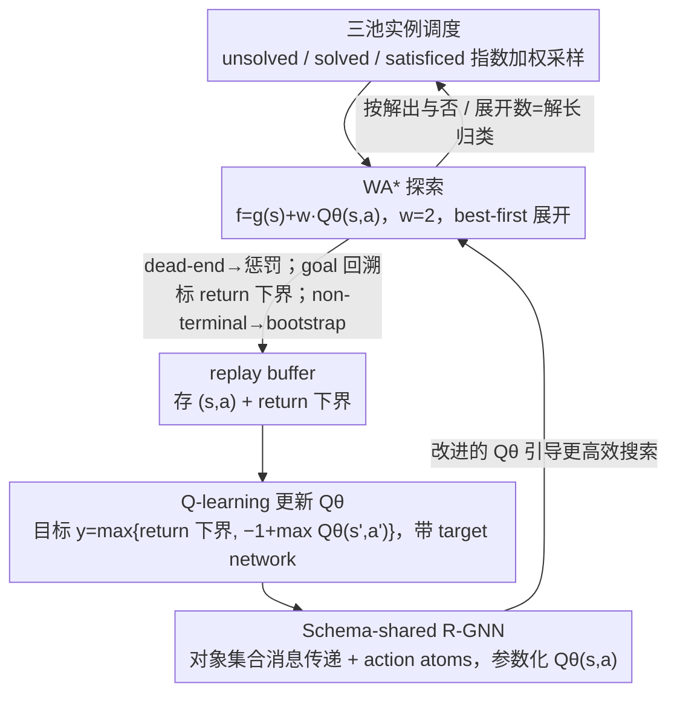

# Learning to Search and Searching to Learn for Generalization in Planning

**会议**: ICML 2026  
**arXiv**: [2605.25720](https://arxiv.org/abs/2605.25720)  
**代码**: https://github.com/maichmueller/generalized-search-for-planning  
**领域**: 强化学习 / 经典规划 / 关系 GNN  
**关键词**: 广义规划, WA* 搜索, Q-learning, R-GNN, 零样本规模泛化  

## 一句话总结
本文提出 GSP：一种把加权 A* 最佳优先搜索和 Q-learning 套在同一循环里、以关系图神经网络表达 $Q_\theta(s,a)$ 的"自改进广义规划器"，仅在小规模实例上训练就能零样本泛化到比训练时大十几倍的实例（如 Blocksworld 从 ≤30 块到 488 块），在多个 IPC 基准、Sokoban、PushWorld、The Witness 上同时刷新覆盖率并超越基于实时搜索的 DRL 基线。

## 研究背景与动机
**领域现状**：经典规划（PDDL）天然给出了"域—实例"分离的结构：域固定谓词与动作 schema，实例换初值、目标和对象数。这一干净的结构让它成为研究"组合泛化"的理想试验场，近年来已经有 Lifted HER、WL-features、Distincter 等工作尝试用 DRL/监督学习产生"广义策略"或"广义启发式"，让一个学到的网络去解任意大小的实例。

**现有痛点**：(1) DRL 路线（Rivlin 2020、Ståhlberg 2023a/2026 等）沿用实时搜索（agent-based search），在稀疏奖励、死路、长 horizon 的难题（Sokoban、Floortile）下探索极其低效；(2) 监督路线（WL-f、Horčik、Distincter）用最优规划器预生成 $h^\ast(s)$ 做 supervised regression，跳过了"搜索越好→训练样本越好→启发式越强"的自改进循环；(3) Hindsight Experience Replay 在子目标可拆分的域有效，但很多规划域目标无法被有意义地拆分，所以 HER 也救不了实时搜索。

**核心矛盾**：经典规划世界里模型完全已知，本来就该用 A*/WA*/GBFS 这类最佳优先搜索；但 DRL 受 RL 框架惯性影响硬塞实时搜索，等于自废武功。同时，"启发式越好搜索越快、搜索越快样本越优"的反馈环——LRTA*/RTDP 早就有，但都绑死在单一状态空间，没人把它推到"一族实例上同时泛化"的层面。

**本文目标**：构造一个自改进的搜索—学习循环，让一个未训练的 $Q_\theta$ 从小实例上的 WA* 搜索数据里学到能直接跨规模泛化的广义启发式；测试时既可以贪心当策略用，也可以再用同一个 WA* 加速搜索。

**切入角度**：既然模型已知，就把 best-first search 当成"探索器"，把 R-GNN 当成"跨规模迁移器"——R-GNN 在对象集合上做消息传递，天然支持训练 29 个 block、测试 488 个 block。

**核心 idea**：用 WA* 取代实时搜索做探索，用 Q-learning + 搜索发现的"return 下界"做监督，把整个循环建在一个 schema-shared 的 R-GNN 上，得到一个能跨实例泛化的 $Q_\theta(s,a)$。

## 方法详解

### 整体框架
GSP 维护一个由 R-GNN 参数化的 $Q_\theta(s,a)$ 和一个 replay buffer $\mathcal D$。每一轮：(1) 从训练池采样一个实例 $\mathcal E$；(2) 用 $f(s,a)=g(s)+w\,Q_\theta(s,a)$（$w=2$）跑 WA* 搜索，节点是状态—动作对 $(s,a)$；(3) 把展开过程中遇到的死路、目标路径上的样本以及 search-derived 的 return 下界 $\underline R$ 全部存进 buffer；(4) 异步从 buffer 采 mini-batch，对 $Q_\theta$ 跑 Q-learning（带 target network）；(5) 实例按"未解 / 已解（节点数=最优解长度）/ 已满足（找到解但非最优）"三池动态调度，权重指数递增，保证大部分算力花在"刚刚能解但还没解优"的中等难度实例上——这是真正提供学习信号的来源。整个循环是"搜索得到更好的数据→数据训出更强的 $Q_\theta$→更强的 $Q_\theta$ 引导更高效的搜索"的自改进闭环。

### 关键设计

**1. WA* 探索 + 搜索导出的 return 下界：把"成功的搜索"直接变成 $Q$ 的监督**

经典规划里模型完全已知，本来就该用 best-first 搜索，DRL 硬塞实时搜索等于自废武功——稀疏奖励下样本利用率极差。GSP 把这个常识带回 RL：奖励取单位步代价 $r=-1$ 不打折扣，节点累计回报 $g(s)$ 就是负深度，frontier 按 $f(s,a)=g(s)+w\,Q_\theta(s,a)$（$w=2$）的最大值展开。三种转移分别处理——dead-end 给固定惩罚 $R_\bot$，goal 路径回溯后把每个 $(s_t,a_t)$ 标上 actual return-to-go $\underline R$ 作为最优回报的下界，non-terminal 走标准 Q-learning bootstrap。最关键的训练目标是 $y=\max\{\underline R,\,\hat y(s,a)\}$，其中 $\hat y(s,a)=-1+\max_{a'}Q_\theta(s',a')$——这个 max 防止 bootstrap 把目标拉到比搜索已经找到的解更差的水平，是实验里最关键的稳定器之一。本质上，WA* 一次跑完一整条解路径后，整条路径"我已经走通过"的信息被显式灌回 $Q$，等于把每次成功的搜索免费变成监督数据。

**2. Schema-shared R-GNN with action atoms：让一个 readout 处理所有对象数和动作 schema**

传统 DRL/MLP 把动作空间硬编码进输出层，换个规模更大的实例就崩。GSP 用关系图神经网络在对象集合上做消息传递，天然支持训练 29 个 block、测试 488 个 block。具体地，每个状态—目标对编码成关系集 $\mathcal R_{s,g}=\{p(\bar o)\in s\cup g\}$；对每个 applicable grounded action $a=A(\bar o)$ 引入一个专属 action 对象 $o_a$ 与原子 $A(o_a,\bar o)$ 并入消息传递图。每个谓词 $p$ 有自己的 $\mathrm{Comb}_p$ MLP 把位置角色编进消息，object 端用 smoothmax 聚合、shared $\mathrm{Comb}_U$ 做带 residual 的更新，$L$ 层后用单个 schema-shared MLP 在 $[X_L(o_a)\|\bar X(s,g)]$ 上预测 $Q_\theta(s,a)$。关键在于 $\mathrm{MLP}_Q$ 在所有动作 schema 间共享，动作类型差异只通过消息传递和 $X_L(o_a)$ 表达，所以模型学到的是"打分原则"而非 schema 特定的打分器——这正是 488-block Blocksworld 也能零样本解出来的根本原因，因为它在对象集合层面是置换等变的。

**3. 三池实例调度（unsolved / solved / satisficed）：把算力砸在信息量最大的实例上**

均匀采样会浪费时间——已经完美解的实例贡献 zero gradient，完全不会解的实例提供 zero signal。GSP 按 WA* 的最近一次结果把每个训练实例归入三池：找到解但展开节点数 > 解长（satisficed）、找到解且展开节点数 = 解长（solved，启发式信心十足）、未找到解（unsolved）。采样权重按 satisficed → unsolved → solved 指数递增，意图是优先训练那些"启发式已经能找到解但还不够直击"的实例——它们提供的次优 vs 最优对比，正是 $Q$ 改进的最佳燃料。这是个很轻量但有效的 curriculum 技巧。

### 损失函数 / 训练策略
所有实验共享同一组超参：embedding 维度 $d=32$、smoothmax 聚合；R-GNN 学习率 $10^{-4}$，readout $10^{-3}$；1 个 learner + 5 个 search worker 并行，每条搜索 60 秒预算、worker batch 256；FIFO replay buffer 容量 40 batch；target network 每 10 次 replay-buffer 全量过完更新一次（Mnih et al. 2015 风格）。训练长度均为 12 小时，论文报告前 180 分钟的训练动态曲线。

## 实验关键数据

### 主实验（2023 IPC learning track 覆盖率与展开节点）
| 域（train→test 规模） | GSPπ (greedy) | GSP$_{\mathrm{WA^*}}$ | Lifted HER | LAMA | 备注 |
|--------|------|------|------|------|------|
| Blocksworld (29→488) | 强（跨规模成立） | 进一步提升 | 弱 | 域无关基线 | 仅训 ≤30 块，测 488 块 |
| Transport (34→453) | 强 | 强 | 较弱 | 中等 | 适合搜索类启发式 |
| Sokoban (11×11, b=3 → 99×99, b=79) | 仍能解大量 | 显著强于 greedy | 退化 | 受限 | 经典 PSPACE-hard 难题 |
| Spanner (28→833) | 高覆盖 | 接近 100% | 中等 | 中等 | 经典 schema 泛化基准 |
| Childsnack (51→1326) | 高 | 高 | 弱 | 受限 | 最难实例 4.67e7 个 applicable action |
| Satellite/Miconic/Ferry/Rovers | 普遍领先 | 普遍领先 | 部分域接近 | 中等 | 学到的启发式接管搜索 |
| Floortile | 一般 | 一般 | 弱 | 一般 | 训练循环未能解完所有训练实例，体现局限 |

> 注：表中粒度对应原文 Table 中 "Cov./Steps" 列的定性总结；GSP 在 GSPπ 与 GSP$_{\mathrm{WA^*}}$ 两种测试模式下相对所有 baseline 均取得不弱于或更优的覆盖率，并在 plan length 上保持竞争力。

### 消融 / 对比实验
| 对比项 | 结果 | 说明 |
|------|------|------|
| GSP$_{\mathrm{WA^*}}$ vs. GSPπ | WA* 模式在 Sokoban 等难题上显著更强 | 学到的 $Q$ 既能当策略又能当启发式 |
| GSP vs. AlphaZero ($\alpha_0$, 同 R-GNN) | GSP 全面更强 | MCTS 在单目标 pathfinding/稀疏奖励 puzzle 下不利 |
| GSP vs. Lifted HER | 在跨域多数 setting 显著领先 | best-first 探索 + return 下界优于实时搜索 + HER |
| GSP vs. WL-f / Horčik / Distincter | 竞争或更优，且无须最优 planner 预生成 $h^\ast$ | 自改进 vs. 监督 |
| 训练曲线：Blocks/Transport/Satellite vs. Floortile | 前者随时间展开节点数↓、解率↑；Floortile 卡在高展开 | 验证"搜索→学→更小搜索"的循环，也暴露失败案例 |
| 测试时 puzzle 域：PushWorld / The Witness | GSP 仍可解，DRL 基线大量失败 | 跨域可迁移 |

### 关键发现
- **零样本规模迁移**是最亮眼的事实：Blocksworld 只看过 ≤30 个 block 的实例，却能在 488 个 block 的实例上无搜索（greedy 策略）解出来；Sokoban 训于 11×11 测于 99×99；Ferry/Childsnack 等域也从几十对象扩到上千。
- **$y=\max\{\underline R,\hat y\}$ 是稳定器**：把"搜索找到的解长"作为 bootstrap 的硬下界，避免了 Q-learning 在大批次稀疏奖励下被低估目标拖垮。
- **R-GNN + action atoms** 让一个 readout 处理所有动作 schema，是泛化到陌生规模的关键。如果换 MLP/AR 输出头，扩规模时几乎不可避免要重训。
- **MCTS 在 generalized planning 里输给 WA***：AlphaZero 风格在双人零和或非常密集奖励里强，但面对单目标 pathfinding + 稀疏奖励 puzzle，MCTS 局部模拟不如全局最佳优先有方向感。
- **失败案例 Floortile**：训练循环未能跑通全部训练实例，展开数始终居高，提示当搜索本身在 12 小时内都找不到信号时，整个自改进环路就启动不了。

## 亮点与洞察
- **把 RL 与 search 的角色重新分工**：模型已知时不应再用实时搜索做探索，把 WA* 当 explorer、Q-learning 当 estimator，是一种比 "RL 拿 model 当 black-box" 干净得多的范式。这条原则可推广到任何 model-based RL 设定。
- **Search-derived lower bound 是几乎免费的标签**：每解开一条路径，整条路径上每个 $(s,a)$ 都获得 $\underline R$；这把"成功的搜索"直接变成监督数据，是把启发式做强的根因之一。
- **三池实例调度**是个值得抄走的工程小技巧：把训练样本按"难度—信息量"分层，可以让任何 curriculum-light 的训练设置免费提速。
- **R-GNN + action atoms** 提供了一种"对象置换等变 + schema 共享"的通用框架，凡是关系结构清晰的领域（化学反应、ECS 游戏、组合优化）都可以借鉴：用一类对象占据"动作位"，从而让单一 readout 评估异质动作。
- **测试时两种用法都保留**：训完同一个 $Q_\theta$ 既能当 greedy 策略（无搜索），又能当 WA* 的启发式（带搜索），等同于"训一次得到一对工具"，对在线推理预算可变的场景非常友好。
- **失败案例 Floortile 是个诚实的对照**：明确告诉读者"循环只在初始搜索能偶尔触底时才转得起来"，提示后续工作可以混入轻量监督预训或自适应搜索预算来 bootstrap 这类难域。

## 局限与展望
- **完全依赖模型已知**：随机/部分可观测/感知输入的环境无法直接套用，因为 WA* 需要明确的转移函数与 applicable action 集合。
- **训练循环对初始搜索可行性敏感**：Floortile 之类初始 60s 预算下搜索基本找不到 goal 的域，循环直接卡死。需要更聪明的 warm-start（如混合监督预训）或自适应预算。
- **乘性奖励/速度并未优化**：相比 RL for dLLM 等工作，GSP 没把"计算预算"也变成可优化目标，未来可以把节点展开数也纳入回报。
- **GNN 表达力上界**：基于 WL 等价类的关系 GNN 不能区分某些图同构对，对部分对称密集的域可能限制策略上限；Distincter 等工作中的对称剪枝可以与本框架互补。
- **训练时长仍较重**：12 小时 / 域 / 5 worker 仍是非小成本；推广到大规模域库需要更高效的 batch 与并行方案。

## 相关工作与启发
本工作沿 LRTA*/RTDP 这条"搜索—学习共生"的老传统，但把它扩展到了"在一族实例上同时学一个广义 Q"的新维度。与 Lifted HER (Ståhlberg & Geffner 2026) 相比，本质区别在于用 best-first 搜索取代实时搜索 + HER；与 AlphaZero 家族相比，去掉了对 MCTS 的依赖，更贴合单目标长 horizon puzzle 的结构；与 Chen 2025、Horčik 2025、Bai 2025 等监督式启发式学习路线相比，最大优势是不需要预先用最优 planner 算 $h^\ast(s)$ 作为标签，且具备自改进循环。它提示了一条统一的"模型已知 RL"路线：凡是模型完全已知的决策问题（手工建模的机器人任务、组合优化、形式化推理），都可以重新检视"用 best-first 搜索做探索 + 学一个跨实例的 $Q_\theta$"这种工作方式。

<!-- RELATED:START -->

## 相关论文

- [\[ICML 2026\] The Surprising Difficulty of Search in Model-Based Reinforcement Learning](the_surprising_difficulty_of_search_in_model-based_reinforcement_learning.md)
- [\[ICML 2026\] Laplacian Representations for Decision-Time Planning](laplacian_representations_for_decision-time_planning.md)
- [\[ICML 2026\] You Can Learn Tokenization End-to-End with Reinforcement Learning](you_can_learn_tokenization_end-to-end_with_reinforcement_learning.md)
- [\[ICML 2026\] Safety Generalization Under Distribution Shift in Safe Reinforcement Learning: A Diabetes Testbed](safety_generalization_under_distribution_shift_in_safe_reinforcement_learning_a_.md)
- [\[ICLR 2026\] On the Generalization of SFT: A Reinforcement Learning Perspective with Reward Rectification](../../ICLR2026/reinforcement_learning/on_the_generalization_of_sft_a_reinforcement_learning_perspective_with_reward_re.md)

<!-- RELATED:END -->
