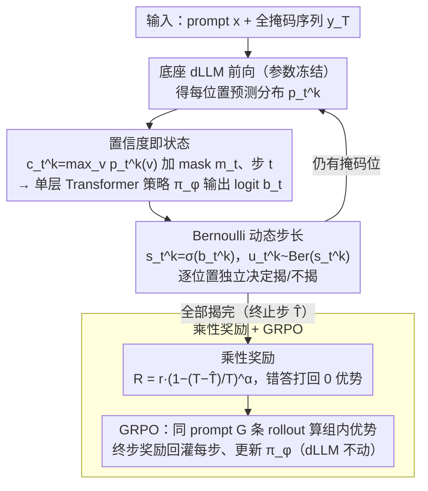

# Learning Unmasking Policies for Diffusion Language Models

**会议**: ICML 2026 Oral Spotlight  
**arXiv**: [2512.09106](https://arxiv.org/abs/2512.09106)  
**代码**: https://github.com/apple/ml-rl-dllm  
**领域**: 强化学习 / 扩散语言模型 / GRPO  
**关键词**: dLLM 采样, unmasking 策略, GRPO, 自适应计算, Bernoulli 策略  

## 一句话总结
本文把掩码扩散语言模型的解码过程显式建模为一个 MDP，用 GRPO 训练一个仅以 token 置信度为输入、参数量不到底座模型 0.01% 的单层 Transformer 策略，自适应地决定每一步要 unmask 哪些位置，在 semi-AR 设定下追平 Fast-dLLM 等手工启发式，在 full-diffusion 设定下显著反超并展现跨模型、跨任务、跨长度的迁移性。

## 研究背景与动机
**领域现状**：以 LLaDA、Dream 为代表的掩码扩散大语言模型（dLLM）已经在下游任务上追平同体量自回归模型，并因为支持一次并行 unmask 多个位置而被寄予更高吞吐的厚望；Fast-dLLM 等工作通过"置信度过阈值"这类启发式采样把推理速度推到了与 LLaMA 同档甚至更快。

**现有痛点**：手工启发式只在 semi-AR（小块顺序生成）配置下表现良好，一旦放开 block 限制走 full-diffusion，其效果反而劣于随机 unmask，且对置信度阈值 $\lambda$ 与 block 长度 $BL$ 极其敏感，需要逐数据集手调。

**核心矛盾**：unmasking 本质上是一个序贯决策问题——在哪一步、对哪些位置揭盖，会同时影响最终正确率和总步数 $T-\hat T$。手工规则只能用单个标量阈值近似这个高维策略，所以在不允许"先生成块内、再换块"的全并行设定下会崩。

**本文目标**：(i) 把 unmasking 形式化为 MDP；(ii) 学一个轻量策略来自动权衡正确率与步数；(iii) 验证策略可以跨模型/任务/长度迁移。

**切入角度**：既然底座 dLLM 已经会给每个位置预测分布 $p_t^k$，那么把它当成"环境"就免去了再训一个 world model，只需要在最大置信度向量 $c_t^k:=\max_v p_t^k(v)$ 上学一个非常小的"网关网络"，决策开销可忽略不计。

**核心 idea**：让 dLLM 当环境、小策略当 agent，用 GRPO 训练一个 Bernoulli 形式的 unmasking 策略，把"什么时候揭、揭多少"交给学习来回答。

## 方法详解

### 整体框架
管线分三块：(1) 把 dLLM 采样写成 MDP——状态是已解掩的序列 $(\bm x, \bm y_t)$，动作是 $\{0,1\}^L$ 的 unmask 指示向量 $\bm u_t$，转移由原 dLLM 完成，奖励只在所有位置揭完时给出；(2) 策略 $\pi_\phi$ 是一个单层 Transformer，输入 $(\bm c_t, \bm m_t, t)$ 输出每个位置的 logit $\bm b_t$，再过 sigmoid 得到 Bernoulli 参数 $s_t^k=\sigma(b_t^k)$，按位置独立采样要不要揭；(3) 训练用 GRPO：对同一 prompt 跑 $G$ 条 rollout，把 reward 减去组均值得到优势，反传到每一步的策略 likelihood。底座 dLLM 全程参数冻结。整条管线是一个"环境—策略"回环：dLLM 当环境吐出置信度，轻量策略据此采样 unmask 动作，反馈回 dLLM 推进解码，直到全部揭完才结算一次奖励、回灌训练策略。

### 关键设计

**1. 置信度即状态：把整段已部分解掩序列压成一个长度 $L$ 的实数向量喂给策略**

底座 dLLM 已经会给每个位置预测分布 $p_t^k$，把它当环境就免去再训一个 world model，策略只需要在一个极轻的"网关"上做决策。具体地，策略输入只用每个位置的最大 token 置信度 $c_t^k:=\max_v p_t^k(v)$，加一个二值 mask $\bm m_t$ 和时间步 $t$；网络是单层 Transformer + AdaLN，规模 $<0.01\%$ 底座参数。消融很关键地说明了"为什么只用 max 就够"：把 top-50 概率全喂进去并没有更好，用 hidden state 反而更差且训练不稳——真正承载"该不该揭"信号的就是 unembedding 矩阵投影后的 $c_t^k$。这条思路和 Fast-dLLM 等启发式同源（都看置信度），区别是把"怎么用置信度"交给学习，避免手工阈值又几乎不加计算开销。

**2. Bernoulli 动态步长：让每一步揭多少个位置变成可学量，而不是预设 $K$ 或固定阈值**

semi-AR 和 full-diffusion 在不同位置/时刻的最优揭码数完全不同，固定 $K$ 或固定阈值都无法兼顾。这里每个位置独立采样 $u_t^k\sim \mathrm{Ber}(s_t^k)$，策略 likelihood 解析可写为 $\pi_\phi(\bm u_t)=\prod_k (s_t^k)^{u_t^k}(1-s_t^k)^{1-u_t^k}$，免去 Plackett-Luce 之类的近似；推理时若 $\bm u_t=\bm 0$，回退到"只揭最大 $s_t^k$ 的那个位置"防止卡死；再引入策略温度 $\tau_\pi$ 把 $s_t^k$ 换成 $\sigma(b_t^k/\tau_\pi)$ 当测试时的"果断度"旋钮。相比 DCOLT/DiFFPO 的固定 $K$ 或阈值预测，Bernoulli 形式让步长真正逐位置、逐步骤自适应，又轻量、表达力足够。

**3. 乘性奖励 + GRPO：在同一个标量里同时编码"答得对"和"答得快"，并避免奖励黑客**

从头训策略时早期几乎全错，若用加性惩罚 $r-\alpha(T-\hat T)/T$，"更快的错答"会留正优势，策略会塌缩到"全部一次揭完、答错也不在乎"。作者改成乘性奖励，只在终止步 $\hat T$ 发放 $R = r(\bm y, \bm y_{\hat T})\cdot (1-(T-\hat T)/T)^\alpha$（$r$ 是任务正确性、$\alpha$ 越大越偏好少步数），把速度奖励乘上正确性掩码，"错答的快"直接打回 0 优势。训练用 GRPO：固定 dLLM 温度 $\tau=0$ 保证同组样本差异只来自策略，组内 $G$ 条轨迹算优势 $A_t^g=R^g-\frac{1}{G}\sum_i R^i$，再把终步奖励均匀回灌到每一步参与 PPO-style clip，从零训因此去掉 KL 正则。

### 损失函数 / 训练策略
GRPO 目标为带 clip 的 PPO-style 比值项 $\rho_t^g = \pi_\phi(\bm u_t^g)/\pi_{\phi_\text{old}}(\bm u_t^g)$，并在 likelihood 计算时跳过已揭位置。base dLLM 用 LLaDA-8B-Instruct 或 Dream-7B-Instruct；训练数据是 GSM8K + MATH 各采约 1.5 万样本，$BL=32$ 一轮，五个 $\alpha\in\{10,3,1,0.3,0\}$ 各自训练。为缓解 full-diffusion ($BL=L=256$) 下探索不足，作者引入 "expert steering"：用 Fast-dLLM 在 semi-AR 下产生的轨迹注入 rollout 池，引导策略走出局部最优。

## 实验关键数据

### 主实验
| 数据集/设置 | 指标 | 学到的策略 | Fast-dLLM | 高置信度采样 / 随机 |
|--------|------|------|------|------|
| GSM8K, $BL=32$ (semi-AR) | acc @ mid-NFE | 与 Fast-dLLM 持平，约 80% 量级 | 强基线 | 明显更差 |
| GSM8K, $BL=L=256$ (full-diff) | acc @ ~12 NFEs | ~50% | ≤30% | ≤30% |
| MATH-500, $BL=32$ | acc @ ~25 NFEs (β-scaled) | ~20% | ~10% | — |
| MATH-500, $BL=256$ | full-diff Pareto | 全程领先 | 大幅下滑 | 大幅下滑 |
| GSM8K, expert steering | acc @ mid-high NFE | ~80%（追平 semi-AR 最佳） | — | — |
| 模型迁移 LLaDA→Dream | GSM8K acc | 近似直接在 Dream 上训 | 基线 | — |
| 长度迁移 $L=256\to512$ | GSM8K acc | 几乎不掉点 | 基线明显下滑 | — |

### 消融实验
| 配置 | 关键现象 | 说明 |
|------|---------|------|
| Bernoulli vs. Dynamic Plackett-Luce | 性能相当 | 选 Bernoulli 因实现更简单、likelihood 闭式 |
| 输入 $c_t^k$ vs. top-50 概率 | $c_t^k$ 略好 | 更细粒度不确定性并未带来收益 |
| 输入 $c_t^k$ vs. 隐藏态 $\bm h_t^k$ | 隐藏态显著更差 + 不稳 | 关键信号在 unembedding 投影后的置信度 |
| 零化 $t$、零化 $\bm m_t$、两个都零化 | 准确率均下降，零化 mask 掉点最大 | 时间与掩码向量都对决策有贡献 |
| 乘性 vs. 加性奖励 ($\alpha=1$) | 加性塌缩到全步一次揭、错答 | 乘性奖励规避 reward hacking |
| 数学训→HumanEval/MBPP 迁移 | 显著掉点；在 KodCode-RL-10K 上重训可补回 | 跨域需要多样训练分布 |

### 关键发现
- **重新定义最优前沿**：在 semi-AR 下 Fast-dLLM 已接近最优，学到的策略只能持平；但一旦切换到 full-diffusion，启发式甚至不如随机，本方法是少数仍能利用更多 NFE 提升性能的方案。
- **策略行为可定性区分**：semi-AR 下 Fast-dLLM 倾向"前块多算、邻位连揭"，学到的策略则在块间更均匀分配算力，且在生成数字答案时"慢下来"；full-diffusion 下，加 expert steering 的策略学会了左→右生成，避免了 LLaDA padding token 置信度污染导致的"反向解码"病。
- **训练时 $\alpha$ 控制不平滑，测试时缩放更好用**：直接调 $\alpha$ 会导致多个值塌成同一个策略；推理时把 Bernoulli 参数缩放成 $\min(1, \beta s_t^k)$ 可以平滑遍历 accuracy-NFE 前沿。
- **$\alpha=10$ 训出的最快策略迁移性差**：在 LLaDA 上表现最佳，到 Dream 上塌回 Fast-dLLM 水平，说明过陡奖励会让策略过拟合特定模型的置信度模式。

## 亮点与洞察
- **把已学好的 dLLM 直接当环境**：相比把策略与底座 LM 合训的工作（d1、DCOLT、DiFFPO 等），本方法策略参数极小、底座不动、训练成本低，且发布后可以"即插即用"，特别适合给开源 dLLM 配一个轻量加速器。
- **乘性奖励的 reward hacking 防火墙**：在稀疏 0/1 奖励 + 速度奖励的组合下，"错答快"的陷阱很容易把策略带偏；把惩罚乘进正确性里是一招通用的小手术，可以借鉴到其他"答对+省算力"的 RL 任务（如 early-exit、自适应深度）。
- **"置信度足矣"是个普适经验**：早期 exit 研究已经发现 confidence-based 停止优于 hidden-state-based，本工作再次证实在 unmasking 任务上同样成立——投影到词表后的极大值已经把语义不确定性压得很紧。
- **Bernoulli + 回退最大值** 这个组合既保留闭式 likelihood，又规避"全 0 动作"导致的死循环，是个值得复用的工程 trick。
- **β 缩放作为测试时旋钮**：用 $\min(1,\beta s_t^k)$ 在推理时平滑滑动 accuracy-NFE 前沿，比训练时反复改 $\alpha$ 重训策略要省得多，是部署阶段非常实用的"一策略多档位"做法。
- **训练时强制 $\tau=0$ 而不是策略温度**：把所有组内方差全部归因于策略动作而不是 dLLM 自身随机，这一选择极大降低了 GRPO 的 credit assignment 噪声，是 RL 与扩散模型联训时一个常被忽视但很关键的工程决定。

## 局限与展望
- **训练时控制粒度差**：$\alpha$ 不平滑、加 expert steering 会进一步增加训练不稳定性，未来需要更好的 KL 控制或退火策略。
- **跨域不免费**：从数学迁移到代码任务（HumanEval、MBPP）会显著掉点，必须用代码语料再训；这意味着"通用策略"还远没达到。
- **只解决了 unmask 顺序**：remasking、动态生成长度、KV cache 等正交加速手段都没纳入，未来可以把这些也写进同一个 MDP。
- **策略可解释性有限**：尽管对比图揭示了某些定性差异（如均匀分配算力、左→右生成），但仍缺少形式化的"为什么这样揭更优"的解释。
- **依赖底座 dLLM 的置信度校准**：策略输入只有 $c_t^k$，因此底座如果存在 padding token 置信度污染（如 LLaDA）或长尾过自信，策略性能会随之被拉低；需要把这层耦合显式纳入未来设计。
- **从头训而非 fine-tune**：作者去掉了 KL 正则，意味着任何"先模仿 Fast-dLLM 再 RL"的两阶段方案都被规避了，但这也丧失了 warm-start 的潜在好处，值得未来对比。

## 相关工作与启发
启发式采样路线（Fast-dLLM 及其变体 Ben-Hamu、Kim、Wei 等）证明了"置信度信号"对加速 dLLM 至关重要；RL 后训练路线（d1、DiffuCoder、DiFFPO、DCOLT）大多把策略与底座绑定、目标在推理能力。本文与 Hong et al. 2025b 的同期工作并列：都用 GRPO 训单独的 unmask 策略，但本文的 Bernoulli 形式支持步长真正可变，而后者维持固定步长。
从更宏观的视角，这条线把"自适应计算"（Graves、Bengio 等）的思想扩展到了扩散语言模型，提示了下一步："学习推理路径"可以与"学习推理本身"解耦，从而获得通用、可迁移的加速器。
进一步看，本工作与 KV cache、speculative decoding、distilled decoder 等正交加速线路完全互补，未来把 RL 学到的 unmask 策略与这些工程优化叠加，应能再次推高 dLLM 的实际吞吐极限。

<!-- RELATED:START -->

## 相关论文

- [\[ICML 2026\] d2: Improving Reasoning in Diffusion Language Models via Trajectory Likelihood Estimation](d2_improving_reasoning_in_diffusion_language_models_via_trajectory_likelihood_es.md)
- [\[NeurIPS 2025\] Reinforcing the Diffusion Chain of Lateral Thought with Diffusion Language Models](../../NeurIPS2025/reinforcement_learning/reinforcing_the_diffusion_chain_of_lateral_thought_with_diffusion_language_model.md)
- [\[ACL 2026\] d-TreeRPO: Towards More Reliable Policy Optimization for Diffusion Language Models](../../ACL2026/reinforcement_learning/d-treerpo_towards_more_reliable_policy_optimization_for_diffusion_language_model.md)
- [\[ICML 2026\] Break the Block: Dynamic-size Reasoning Blocks for Diffusion Large Language Models via Monotonic Entropy Descent with Reinforcement Learning](break_the_block_dynamic-size_reasoning_blocks_for_diffusion_large_language_model.md)
- [\[NeurIPS 2025\] MMaDA: Multimodal Large Diffusion Language Models](../../NeurIPS2025/reinforcement_learning/mmada_multimodal_large_diffusion_language_models.md)

<!-- RELATED:END -->
