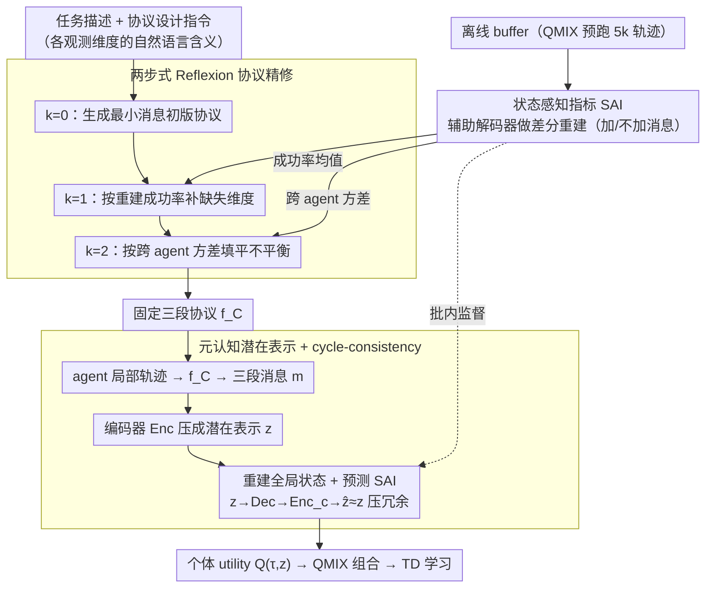

# LLM-Guided Communication for Cooperative Multi-Agent Reinforcement Learning

**会议**: ICML2026  
**arXiv**: [2605.18077](https://arxiv.org/abs/2605.18077)  
**代码**: https://saaangjun.github.io/LMAC/  
**领域**: reinforcement_learning  
**关键词**: 多智能体RL, 协作通信, LLM协议设计, CTDE, QMIX

## 一句话总结
本文提出 LMAC——用 LLM 离线为合作型 MARL 设计可执行的通信协议代码，依据"状态可重建性"指标做两轮反馈迭代（先提高重建准确度，再降低跨智能体的不平衡），在 SMAC-Comm、LBF、GRF、SMACv2 等基准上显著超过 TarMAC/SMS/T2MAC/MASIA 等通信基线，部分场景甚至超过把全局状态喂给所有智能体的 QMIX+State 上界。

## 研究背景与动机
**领域现状**：合作型 MARL 在 CTDE 框架下广泛用通信缓解部分可观测性。早期 CommNet 类做广播，TarMAC 用注意力加权，SMS 用 Shapley 值打分，T2MAC 用证据融合，MASIA 学一个"重建状态"的潜在表征做广播。

**现有痛点**：这些方法都隐含一个假设——"消息送到了就够"，但实际上很多消息既冗余又遗漏关键信息。论文用 SMAC 一个具体场景给出反例：一个 Overseer 直接观察到敌人位置，其他 Banelings 完全看不到。MASIA、FullComm 在 2M 步训练后，敌人位置的重建误差仍然偏大；不同智能体之间的重建误差方差也偏大，意味着有的智能体已经"知道"，有的还在猜。这导致 Banelings 各自估计的敌人位置散乱，无法同时炸点。

**核心矛盾**：要设计高效通信，必须知道"哪些观测维度对全局状态重建是关键的、哪些是冗余的"——这是一个语义级的任务理解问题，而梯度优化很难自动学会区分。另一方面，让 LLM 直接当 agent 在线生成消息（如 Li et al., 2024）每步都要调 LLM，token 成本高且只适合 text-world 接口。

**本文目标**：(i) 用 LLM 一次性把"通信协议"以可执行代码的形式生成出来，训练和执行阶段都不再调 LLM；(ii) 让 LLM 的迭代修正信号来自 RL 真实回放数据，而不是 LLM 自己幻想出的反馈；(iii) 把"协议好不好"量化成一个可微指标——状态可重建性——以驱动 Reflexion 风格的反馈循环。

**切入角度**：把 LLM 当成"协议设计师"而不是"在线消息生成器"。LLM 输入是任务描述 + 每个观测维度的自然语言含义，输出是把 $\tau_t^i$ 映射到消息 $m_t^i$ 的 Python 代码；好坏由一个辅助解码器在离线 buffer 上跑一遍来判定。

**核心 idea**：用"加上消息后状态重建是否变准、跨 agent 是否更均匀"这两个判据驱动 LLM 自我修正，把消息设计退化成一个可在两步内收敛的代码生成任务。

## 方法详解

### 整体框架
LMAC 把 MARL 训练拆成"协议设计"和"策略学习"两段：

1. **离线协议设计阶段**：用 QMIX 跑一段拿一个小 buffer $\mathcal{B}$（5k 条 trajectory），先用 LLM 配合任务描述 $\mathcal{I}_T$ 和协议设计指令 $\mathcal{I}_P$ 生成初始协议 $f_C^{(0)}$；然后训练辅助解码器 $D_\phi^{(k)}$ 用每个 agent 的轨迹（带或不带消息）尝试重建全局状态，按"重建是否落在阈值 $\alpha$ 之内"得到 SAI 指标，再把 SAI 转成两种语言反馈分别驱动 $f_C^{(1)}$（提高准确度）和 $f_C^{(2)}$（降低跨 agent 方差）。最终拿到三段协议 $f_C=(f_C^{(0)},f_C^{(1)},f_C^{(2)})$。
2. **在线 CTDE 训练阶段**：把 $f_C$ 当成固定函数运行——每个 agent 把自己的局部轨迹喂进去拿三段消息 $m_t^i=(m_t^{i,(0)},m_t^{i,(1)},m_t^{i,(2)})$，再过一个编码器 $\mathrm{Enc}_\psi$ 得到潜在表示 $z_t^i$，喂给个体 utility $Q^i(\tau_t^i,z_t^i)$，由 QMIX 组合成 $Q_{tot}$ 做 TD 学习。编码器-解码器同时被训去重建当前 batch 的全局状态、预测 SAI，并通过一个 cycle-consistency 正则压掉冗余特征。

下图把这两段流程串起来：SAI 是贯穿两段的"听诊器"——离线阶段它把重建结果转成反馈句驱动两步精修，在线阶段它又当成元认知表示的监督信号（对应下面三个关键设计）。

### 关键设计

**1. 状态感知指标（SAI）：用"加/不加消息的差分重建"给协议当听诊器**

要设计高效通信，必须知道哪些观测维度对全局状态重建是关键的、哪些是冗余的，但这是个语义级理解问题，梯度优化很难自动学会。LMAC 的解法是让 RL 回放数据反过来给协议打分，而不是让 LLM 评价自己的产物（那容易自洽幻觉）。对每个 agent $i$、状态维度 $d$、时刻 $t$，用辅助解码器分别在"喂消息"和"不喂消息"两种条件下重建状态——$\hat s_{1,d,t}^i=D_\phi^{(k)}(\tau_t^i, m_t^{i,(k)}, i)|_d$ 与 $\hat s_{0,d,t}^i=D_\phi^{(k)}(\tau_t^i,\mathbf 0, i)|_d$，再定义 $\chi_{l,d,t}^{i,(k)}=\mathbb I[\|\hat s_{l,d,t}^i - s_{d,t}\|^2\le\alpha]$。这个 0/1 信号有两种统计恰好对应两个正交目标：对 $t$ 求均值得到"agent $i$ 对维度 $d$ 的重建成功率"（协议准不准），对 $i$ 求方差得到"跨 agent 的知识不平衡"（协议齐不齐）。一个小解码器就替代了"每步调 LLM 检查"的昂贵接口，反馈既客观又便宜。

**2. 两步式 Reflexion 协议精修：把"先准、再齐"拆成两个互不冲突的目标**

原版 Reflexion 用一个固定不变的反馈指令，方向容易模糊。LMAC 把它改成每步一个明确目标的版本，反馈指令按步分工。$k=0$ 只用任务描述生成"最小消息"的初版；$k=1$ 用 $\mathbb E_t[\chi_{1,d,t}^{i,(0)}]$ 拼成反馈句，指出"哪个 agent 对哪个状态维度的重建仍不行"，让 LLM 在协议里补缺失维度；$k=2$ 用 $\mathrm{Var}_i[\chi_{1,d,t}^{i,(1)}]$ 拼成反馈句，指出"哪些维度跨 agent 仍不一致"，让 LLM 引入共享锚点或显式 ID 标签把不平衡填平。这条演化轨迹很直观：$k=0$ 只共享 Roach 相对偏移、$k=1$ 加入 Overseer 自身位置和历史、$k=2$ 引入固定锚点 + 显式 agent ID，对应胜率台阶式上涨。两步目标互不冲突——第一步管"对不对"、第二步管"齐不齐"，分离开能避免 LLM 在一次反馈里同时优化两个相互拉扯的目标；作者实验发现两步之后再迭代收益不显著，故硬截断在 $k=2$。

**3. 元认知潜在表示 + cycle-consistency 正则：在通信和决策之间插一个 SAI 监督的瓶颈**

LLM 设计的离线消息可能仍然冗余或带噪，直接喂个体 utility 既增加维度又带偏 $Q$。CTDE 训练阶段先用编码器 $z_t^i=\mathrm{Enc}_\psi(\tau_t^i, m_t^i)$ 把消息压成潜在特征，解码器 $\mathrm{Dec}_\psi$ 同时被训去重建全局状态 $s_t$ 并预测 SAI $\chi_{d,t}^i$——后者用训练时可见的真实状态作监督，所以表征是 *meta-cognitive* 的：不仅要"准"，还要"知道自己哪儿不准"。再加一个 cycle-consistency 损失，把 $z_t^i$ 解出来又用辅助编码器重编码回 $\hat z_t^i=\mathrm{Enc}_{c,\psi}(\mathrm{Dec}_\psi(z_t^i))$，要求 $\hat z_t^i\approx z_t^i$——能过得了"解码-再编码"闭环的特征只能是任务相关且不重复的。这等价于在通信和决策之间插入一个由 SAI 监督的瓶颈层，让"哪些通信内容值得用"和"哪些值得记住"用同一套标准学习。消融里去掉 cycle-consistency 直接掉到 66.5（比去 SAI 掉得还多），说明"压掉冗余"和"知道自己不准"同等关键。

### 损失函数 / 训练策略
QMIX 标准 TD 损失负责值函数，编码器-解码器额外加 (i) 全局状态重建损失、(ii) SAI 预测损失、(iii) cycle-consistency 损失三项联合训练。LLM 端 $k=0,1,2$ 三个协议各取最佳 $\alpha$ 阈值；论文默认主 LLM 是 gpt-4.1-2025-04-14，但 GPT-mini/GPT-o1-mini/Claude/Gemini 切换后性能波动 $\le 3$ 个点，鲁棒性不错。框架可平滑挂到 VDN、QPLEX 等其他 CTDE 价值分解骨干上。

## 实验关键数据

### 主实验
覆盖四套基准，每个任务都跑 5 个种子：SMAC-Comm（含大规模 `2o_20b_vs_2r`）、LBF（合作觅食）、GRF（合作足球）、SMACv2（每集随机 unit 组合，高随机性）。

| 基准 / 场景 | 指标 | LMAC (Ours) | 最强通信基线 | QMIX+State 上界 | 说明 |
|------------|------|-------------|--------------|-----------------|------|
| SMAC-Comm `bane_vs_hM` / `2o_20b_vs_2r` | 收敛速度 + 最终成功率 | 接近 QMIX+State | T2MAC/MASIA 等明显落后 | reference | 大规模与"难以重建"场景增益最显著 |
| LBF (2 种 setting) | 同上 | 接近 QMIX+State | 同上 | reference | 学习更快，最终也更高 |
| GRF (`3_vs_1_with_keeper` 等) | 最终成功率 | 超过 QMIX+State | 低于 | reference | 高维观测下，潜在压缩比直接喂状态更有利 |
| SMACv2 `terran_5_vs_5` | 测试胜率 | $67.87 \pm 2.77$ | MAIC $63.80\pm3.4$ | QMIX+State $64.77\pm2.79$ | 高随机性下也胜过上界 |
| SMACv2 `protoss_5_vs_5` | 测试胜率 | $57.96 \pm 4.02$ | MAIC $51.93\pm2.4$ | QMIX+State $56.40\pm2.33$ | 同上 |
| SMACv2 `zerg_5_vs_5` | 测试胜率 | $42.18 \pm 4.37$ | NDQ $38.75\pm2.9$ | QMIX+State $40.06\pm3.39$ | 同上 |

值得注意的是 FullComm / TarMAC / SMS / COLA 在 SMACv2 上塌得相当厉害（COLA 在 protoss/zerg 几乎归零），说明随机化打掉了"靠场景记忆"的协议，反衬出 LMAC 的鲁棒性。

### 消融实验
SMAC-Comm 平均胜率 (%)。

| 配置 | 平均胜率 | 说明 |
|------|---------|------|
| LMAC ($k=2$，完整) | $82.9 \pm 1.9$ | 两步精修 + cycle-consistency + SAI 监督 |
| $k=0$（只用初始协议） | $68.5 \pm 3.8$ | LLM 一次出，没有反馈 |
| $k=1$（仅准确度修正） | $77.8 \pm 2.2$ | 只跑第一步反馈 |
| w/o cycle-consistency | $66.5 \pm 2.1$ | 表征冗余被放进 $Q$，掉点最严重 |
| w/o SAI 监督 | $76.6 \pm 5.6$ | 表征不再"知道自己哪不准" |
| 阈值 $\alpha$ 扫描 ($\alpha=0.05$ 最优) | $77.2 \sim 82.9$ | 太松/太紧都让反馈信号失真 |
| LLM 切换（GPT-mini/o1-mini/Claude/Gemini） | $79.8 \sim 82.9$ | 不同模型差距 $\le 3$ 点，方法不依赖某一个 LLM |

### 关键发现
- 两步反馈不是冗余：从 $k=1$（77.8）到 $k=2$（82.9）的 5 个点提升说明"先准、再齐"两步分工有实际意义；额外迭代收益消失。
- cycle-consistency 是最关键的小组件——去掉它直接掉到 66.5，比去 SAI 掉得还多，说明"压掉冗余"在 LMAC 里和"知道自己不准"同等重要。
- 在 GRF 这种高维观测任务上，LMAC 反超 QMIX+State，提示"过滤后的通信"在某些场景下比"直接喂上帝视角"更利于学习——原始高维状态本身会拖慢收敛。
- 协议演化轨迹（论文 Fig. 8）很有说服力：$k=0$ 只共享 Roach 相对偏移、$k=1$ 加入 Overseer 自身位置和历史、$k=2$ 引入固定锚点 + 显式 agent ID，对应胜率台阶式上涨，可读性优于任何端到端通信网络。

## 亮点与洞察
- 把 LLM 从"在线决策器"降级为"离线协议设计器"，让训练和执行阶段都不再调 LLM——既省 token 又把 LLM 的不稳定性挡在 RL 训练之外。这种"LLM 出代码，RL 跑代码"的解耦范式可以推广到 reward shaping、curriculum、option discovery 等场景。
- SAI 这种"加/不加消息的差分重建"是一个极便宜但极有信息量的指标；它的两种统计（均值 + 跨 agent 方差）恰好对应"协议准不准 / 协议齐不齐"两个正交目标。
- 用 cycle-consistency 来约束多智能体通信表示，借自图像翻译（CycleGAN）思想；这条迁移路径值得在更广的多模态/多 agent 表征学习里复用。
- 由 LLM 直接生成可执行 Python 通信协议，最终协议人类可读、可审计、可手改——相比 attention-based 端到端通信网络是巨大的可解释性升级。

## 局限与展望
- 依赖较高质量的任务自然语言描述与观测维度语义说明；当观测维度本身是匿名嵌入（如 raw pixel）时，方法难以直接套用。
- 离线 buffer 由 QMIX 预跑收集（5k trajectory），若预跑策略覆盖度差，SAI 会被严重偏置，反馈方向可能误导 LLM。
- 协议是一次性离线设计的，环境/任务在训练中变化（如非平稳奖励、新加入的智能体）会让协议失效，需要重新触发 LLM 设计；论文没有讨论在线再设计的代价。
- LMAC 把通信视为"恢复全局状态"的代理，但在某些任务里全局状态并非最优通信目标（例如对手建模、意图推理）；现有判据可能不足以覆盖。

## 相关工作与启发
- **vs MASIA / FullComm**：都试图恢复状态，但前者靠广播 + latent 监督、后者直接全互发观测；LMAC 用 LLM 决定"谁该发什么"，做到只发关键差异维度，效率与准确度同步提升。
- **vs TarMAC / SMS / T2MAC**：基线侧重消息聚合（注意力、Shapley、证据融合），从未对"消息内容本身"做语义级设计；LMAC 直接在协议代码层重写消息内容。
- **vs Li et al., 2024（LLM 在线对话作为通信）**：前者每步调 LLM，token 成本高且依赖 text-world；LMAC 一次性离线生成协议代码，运行期零 LLM 调用，可在任意 MARL 环境上跑。
- **vs Reflexion / Reflexion-style 自修正**：原版用固定反馈指令；LMAC 把反馈指令按步分工，并用 RL 真实回放数据驱动反馈，避免 LLM 自我循环幻觉。

## 评分
- 新颖性: ⭐⭐⭐⭐⭐ "LLM 写通信代码 + SAI 离线反馈"在 MARL 通信领域是一个干净的新方向
- 实验充分度: ⭐⭐⭐⭐⭐ 四套基准 + 多 LLM 切换 + 三类消融 + 协议演化可视化，覆盖面齐全
- 写作质量: ⭐⭐⭐⭐ 结构清晰、图示得当；部分 LLM 反馈 prompt 的细节挪到 Appendix，正文略显概略
- 价值: ⭐⭐⭐⭐⭐ 把 LLM 的语义能力以最低成本方式接入 MARL，对实际部署友好且可解释

<!-- RELATED:START -->

## 相关论文

- [\[ICML 2026\] Multi-Agent Decision-Focused Learning via Value-Aware Sequential Communication](multi-agent_decision-focused_learning_via_value-aware_sequential_communication.md)
- [\[ICML 2026\] Interaction-Breaking Adversarial Learning Framework for Robust Multi-Agent Reinforcement Learning](interaction-breaking_adversarial_learning_framework_for_robust_multi-agent_reinf.md)
- [\[NeurIPS 2025\] Mean-Field Sampling for Cooperative Multi-Agent Reinforcement Learning](../../NeurIPS2025/reinforcement_learning/mean-field_sampling_for_cooperative_multi-agent_reinforcement_learning.md)
- [\[ICML 2026\] Vulnerable Agent Identification in Large-Scale Multi-Agent Reinforcement Learning](vulnerable_agent_identification_in_large-scale_multi-agent_reinforcement_learnin.md)
- [\[NeurIPS 2025\] Empirical Study on Robustness and Resilience in Cooperative Multi-Agent Reinforcement Learning](../../NeurIPS2025/reinforcement_learning/empirical_study_on_robustness_and_resilience_in_cooperative_multi-agent_reinforc.md)

<!-- RELATED:END -->
