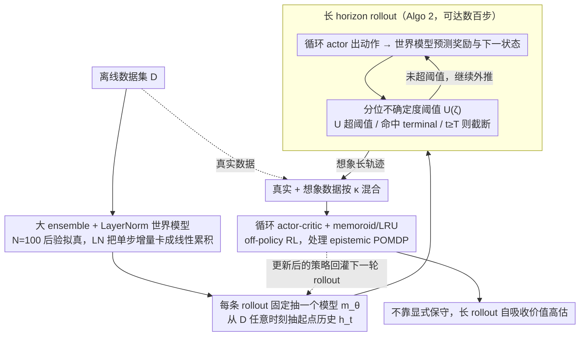

# Long-Horizon Model-Based Offline Reinforcement Learning Without Explicit Conservatism

**会议**: ICML 2026  
**arXiv**: [2512.04341](https://arxiv.org/abs/2512.04341)  
**代码**: https://github.com/twni2016/neubay (有)  
**领域**: 离线强化学习 / 基于模型的 RL / 贝叶斯 RL  
**关键词**: offline RL, model-based RL, Bayesian RL, long-horizon rollout, epistemic POMDP

## 一句话总结
本文挑战“离线 RL 必须显式保守”的主流共识，提出 Neubay：用贝叶斯视角看后验上的模型集合、用**长 horizon rollout（数百步）**自然吸收价值高估、用 layer norm 与不确定度阈值控制 compounding error，从而在 D4RL/NeoRL 共 33 个数据集上不靠悲观惩罚就追平 SOTA 保守算法，并在 7 个数据集上刷新纪录。

## 研究背景与动机

**领域现状**：主流离线 RL（CQL、IQL、EDAC、ReBRAC、MOPO、COMBO、MOBILE 等）都建立在“显式保守”原则上——对数据集外的状态-动作打惩罚，同时在 model-based 方法里只做 1–5 步短 horizon rollout，以同时压制价值高估和 compounding error。理论上对应 robust MDP $\max_\pi\min_{m\in\mathfrak{M}_\mathcal{D}}J(\pi,m)$。

**现有痛点**：保守原则减少了高估，但也压抑了 average-case 性能，特别是在低质量数据集上：行为策略本身就差时，保守训练只能死死围着差动作转，无法在测试时探索更好的未见动作。Ghosh 等的贝叶斯视角（epistemic POMDP）理论上能 test-time adapt，但实际算法（APE-V、MAPLE、CBOP、MoDAP）为了稳定**又重新加回了不确定度惩罚 + 短 horizon**，把贝叶斯精神稀释回保守路线。

**核心矛盾**：贝叶斯目标 $\max_\pi \mathbb{E}_{m\sim \mathbb{P}_\mathcal{D}}[J(\pi, m)]$ 在理论上要求对后验完整 rollout，但实际上 compounding error 与价值高估这两座大山一旦丢掉显式保守就压不住，造成贝叶斯路线长期“理论好看、实际拉胯”。

**本文目标**：(1) 实证证明纯贝叶斯路线（无任何不确定度惩罚）能在主流离线 RL 任务上 work；(2) 找出关键瓶颈并设计对应机制；(3) 给出何时该用贝叶斯、何时该用保守的清晰边界。

**切入角度**：作者用一个 two-armed bandit 极端例子说清楚——保守在 skewed 数据上**注定**死死押已观察过的次优臂；贝叶斯则能在测试时 adapt。从这一点出发，他们提出一个反直觉观察：**长 horizon rollout 本身可以替代显式保守来压制价值高估**，因为 $H$ 步 TD target $\sum_{j=0}^{H-1}\gamma^j \hat{r}_{t+j+1} + \gamma^H Q(\hat{h}_{t+H}, \pi(\hat{h}_{t+H}))$ 把高估严重的 bootstrap 项指数衰减 $\gamma^H$。

**核心 idea**：放弃显式保守，把贝叶斯精神坚持到底——后验上随机抽一个模型（每条 rollout 固定一个 model）、用自适应不确定度阈值决定何处截断、用 layer norm 把 compounding error 卡住、用循环 actor-critic 处理 epistemic POMDP 的部分可观，最终算出几百步的长 rollout。

## 方法详解

### 整体框架
Neubay 的训练循环（Algo. 1）非常 MBPO-like：(a) 先用 $\mathcal{D}$ 训一个 100 模型 ensemble $\mathbf{m}_{\boldsymbol{\theta}}$；(b) 每轮从 $\mathcal{D}$ 任意时刻 $t$ 采起点 $h_t = s_{0:t}$，从 ensemble 抽一个固定模型 $m_\theta$（注意：整条 rollout 都用这个模型，不在每步随机），跑 Algo. 2 的 Rollout 直到 (i) 命中 terminal，(ii) 不确定度 $U_{\boldsymbol{\theta}}(\hat s_t, \hat a_t) > \mathcal{U}(\zeta)$ 触发截断，或 (iii) 到了 episode 上限 $T$（最长可达 1000）；(c) 把真实数据 + imagined 数据按比例 $\kappa$ 混合，喂给一对带独立 LRU 编码器的循环 actor $\pi_\nu(a_t|h_t)$ 和 critic $Q_\omega(h_t, a_t)$ 做 off-policy RL。整条 pipeline 顺着「先用大 ensemble + LayerNorm 把世界模型训稳 → 再用分位不确定度阈值控制每条长 rollout 在哪停 → 最后用循环 actor-critic 从这些长轨迹里学策略」的顺序串起来，对应下图三个贡献环节，也对应下面的三个关键设计。

### 关键设计

**1. 大 ensemble（$N{=}100$）+ world model 内 LayerNorm：让长 rollout 真的可行**

要跑几百步 rollout，既要后验拟真、又不能让单步误差累积爆炸——这是图中「世界模型」一环要解决的问题。Neubay 把 world model 写成 delta 预测形式 $\mathbb{E}[\hat s'] = s + \mathbf{W}^\top \mathrm{ReLU}(\mathrm{LN}(\psi(s, a)))$，由于不带 affine 的 LN 满足 $\|\mathrm{LN}(x)\| = \sqrt{k}$ 恒等，单步增量被硬卡上界 $\|\mathbb{E}[\hat s'] - s\| \leq \sqrt{k}\|\mathbf{W}\|$，累积 $H$ 步后 $\|\mathbb{E}[\hat s_H] - s_0\| \leq H\sqrt{k}\|\mathbf{W}\|$ 是线性而非指数增长——compounding error 被几何边界压住了。同时把 ensemble 从 MBPO 默认的 5 提到 100：rollout 短时 posterior 不太重要，但跑 64–512 步时 posterior 必须更准，大集合才能弥补长 rollout 对后验保真度的放大。LN 这招借鉴自 Ball et al. 在 model-free RL 里抑制 Q 网络外推误差的做法，本文把它从"控制 Q 网络"迁移到"控制动力学网络"。

**2. 分位不确定度阈值 $\mathcal{U}(\zeta)$：用自适应开关决定 rollout 在哪停，而不是固定 horizon**

世界模型稳住之后，rollout 跑多长成了核心问题——可信区域要尽量跑长来吸收高估，不可信区域必须立刻截断防止瞎外推（对应图中 rollout 回环里的截断判断）。Neubay 先在数据集上对所有 $(s, a)$ 算 ensemble disagreement $U_{\boldsymbol{\theta}}(s, a) = \mathrm{std}(\{\mu_{\theta^n}(s, a)\}_{n=1}^N)$ 的分布，取 $\zeta$ 分位数作阈值 $\mathcal{U}(\zeta) := F_Y^{-1}(\zeta)$；rollout 期间一旦 $U_{\boldsymbol{\theta}}(\hat s_t, \hat a_t)$ 超过阈值就 truncate——只停止外推，不打任何惩罚。论文取 $\zeta = 1.0$（数据集内最大不确定度），鼓励尽可能长的 rollout。以往工作也用过不确定度阈值，但都搭配一个固定短 horizon cap；本文发现移除显式保守后，短 horizon 反而让 bootstrap 项主导、导致严重高估，所以必须把固定 cap 也去掉，让阈值自己决定能跑多长。分位形式还有个好处：不同数据集的不确定度量纲和长尾结构差异巨大（图 4），分位阈值能自动适配，比绝对阈值鲁棒得多。

**3. 循环 actor-critic + memoroid (LRU)：处理贝叶斯目标带来的 epistemic POMDP**

贝叶斯目标天然把环境变成 POMDP——agent 不知道这条 rollout 抽中了 ensemble 里哪个模型，必须靠历史推断，所以策略和 critic 都得吃 history。Neubay 给 actor 和 critic 各配一个独立 RNN 编码器（$\nu_\phi(h_t)$、$\omega_\phi(h_t)$），底层用 memoroid + LRU（线性循环单元）支持高达 1000 步的并行高效记忆。一个关键细节是 RNN 编码器的学习率 $\eta_\phi$ 取得远小于 MLP 头（论文扫 $3\text{e-}7$ 到 $1\text{e-}4$），因为长 history 下表征对参数极其敏感、稍大就指数发散。前作 CBOP/APE-V 要么用短上下文 GRU、要么干脆退回 model-free 来回避 POMDP；Neubay 直接把在线 POMDP 里验证过能处理千步级历史的 memoroid + LRU 引进来。此外为贴合 MBPO 风格的真实/想象数据混合，还引入混合比 $\kappa \in (0, 1)$，数据质量高时调大 $\kappa$。

### 损失函数 / 训练策略
RL loss 用标准 TD3+BC 风格的循环 off-policy actor-critic（细节在 Appendix E）。world model ensemble 用 MLE 训到收敛后冻结。关键超参：$\zeta$（截断阈值，默认 $1.0$）、$\kappa$（real data 比例，按数据集扫 $[0.05, 0.95]$）、$\eta_\phi$（RNN 学习率，按 benchmark 扫 $[3\text{e-}7, 1\text{e-}4]$）、$N=100$（ensemble 大小）。每条 rollout 用一个固定模型 $m_\theta \sim \mathbf{m}_{\boldsymbol{\theta}}$（**不** 每步随机），以严格符合贝叶斯目标 $\mathbb{E}_{m \sim \mathbb{P}_\mathcal{D}}[J(\pi, m)]$。

## 实验关键数据

### 主实验
D4RL locomotion（部分代表性结果，越高越好）：

| 数据集 | CQL | MOBILE | ReBRAC | CBOP（贝叶斯系） | **Neubay** |
|---|---|---|---|---|---|
| hp-random | 5.3 | 31.9 | — | 31.4 | 24.5 |
| wk-random | 5.4 | 17.9 | — | — | — |
| hc-random | 31.3 | 39.3 | 45.4 | 32.8 | 37.0 |

总体在 33 个数据集（D4RL locomotion 12 + Adroit 6 + AntMaze 6 + NeoRL 9）上：

| 类别 | 行为 |
|---|---|
| 与最佳保守算法（MOBILE/RAMBO/ARMOR/ReBRAC 类） | on par |
| 与已有贝叶斯算法（APE-V/MAPLE/CBOP/MoDAP） | 显著超过 |
| 新 SOTA | 7 个数据集 |
| 优势区间 | 低质量数据集 + 中等质量 + 中等 coverage |

### 消融实验

| 配置 | 行为 | 说明 |
|---|---|---|
| Full Neubay ($\zeta{=}1.0$，$H$ 适配可达 64–512) | 最优 | 长 horizon 实际中位数 64-512 步 |
| 短 horizon 变体（$\zeta{=}0.9$） | 严重崩 | bootstrap 主导，Q 值在数据集上估值飙升（图 1 中） |
| $\zeta=0.99/0.999$ | 中间档 | 性能与 Q 估值都介于中间 |
| 移除 LayerNorm | compounding error 爆炸 | 长 rollout 不可行 |
| ensemble $N{=}5$ vs $N{=}100$ | 小集合 posterior 失真 | 长 rollout 下放大 |

### 关键发现
- **长 horizon 主动压低估值**：图 1（中）显示，$\zeta$ 越大允许 rollout 越长，离线数据集上估出的 Q 值反而越低、性能越好——彻底反转“model-based RL 必须短 horizon”的教条。
- **何时贝叶斯优于保守**：在低质量数据集（如 random、低 coverage 的 NeoRL Low）以及最优动作稀缺的场景，贝叶斯能 test-time adapt 探索更好动作；在高质量数据集差距收窄。bandit 例子从理论上印证：保守在 skewed 数据上**注定**押已见的次优臂。
- **每条 rollout 固定一个模型**至关重要：MBPO 风格“每步随机抽模型”破坏后验语义，Neubay 必须做模型一致的 rollout 才符合贝叶斯期望目标。
- ablation 显示 LN + 大 ensemble + 长 horizon 三者**缺一不可**，移除任意一个都让长 rollout 路径走不通。

## 亮点与洞察
- **“长 horizon 自吸收高估”是反直觉但深刻的观察**：把 H-step TD target 拆成 $\sum \gamma^j \hat r$ (低偏置) + $\gamma^H Q$ (高偏置但指数衰减)，揭示横轴 H 不仅仅是误差累积，也是偏置项的衰减杠杆。这意味着 model-based RL 社区过去把 H=1-5 当“安全区”可能是个集体认知错误。
- **把不确定度从“惩罚”改成“开关”**：同样的 ensemble disagreement 在保守路线里是给 reward 的减项，本文当成 rollout 是否继续的二元开关——同一信息换个用法效果完全不同，是个可迁移的设计哲学。
- **LayerNorm 把单步几何边界从 $\|W\|\cdot\|\psi\|$ 收缩到 $\sqrt{k}\|W\|$ 的常数级**：这种用归一化层做 Lipschitz 控制的思路对所有 rollout-heavy 的 model-based / world model 工作都适用。
- **分位形式的不确定度阈值** $\mathcal{U}(\zeta) := F_Y^{-1}(\zeta)$：让阈值在不同数据集量纲上自动可比，比固定阈值 $u_0$ 鲁棒得多，可以借鉴到任何依赖 OOD-score 的截断/筛选系统。

## 局限与展望
- 算法需要按数据集扫 $\eta_\phi$ 和 $\kappa$ 两个超参，跟主流保守 model-based RL 工作（MOPO、RAMBO、MOBILE）保持同等调参成本但仍未达到“无调参”水准。
- 跑 $N{=}100$ 的 ensemble + 几百步 rollout + 千步级 RNN 上下文，单实验的 wall-clock 远高于 IQL/CQL 这类无 model 算法，对小算力实验室不友好。
- 优势区间是“低质量 + 中等 coverage”，对于高质量、低 coverage 的“专家近最优”数据集，贝叶斯优势不明显甚至略输保守算法——这并非 bug 而是 trade-off 边界。
- 当前贝叶斯后验只用 deep ensemble 近似，没有更精细的后验（如 SWAG、HMC），在小数据下后验保真度未必够，未来可以接更好的不确定度量化方法。

## 相关工作与启发
- **vs MOBILE / RAMBO / COMBO（保守 model-based RL）**：他们靠不确定度惩罚 + 短 horizon 双重压制高估；Neubay 完全摒弃惩罚、用长 horizon 自吸收，在 7 个数据集上反超并在低质量数据上结构性占优。
- **vs APE-V / MAPLE / CBOP / MoDAP（已有贝叶斯启发算法）**：他们都为稳定性又偷偷把保守加回来，沦为半保守；Neubay 是第一个把贝叶斯精神坚持到底且在主流 benchmark 上证明可行的工作。
- **vs MBPO**：MBPO 是 model-based RL 模板，但 H=1-5 短 horizon、$N=5$ 小集合、每步随机模型；Neubay 把这三点全部反转，并展示了它在离线场景下才是“正确做法”。
- **启发**：本文给所有“model-based + 高估”问题贡献了一个新视角——别急着加惩罚或缩 horizon，先想想能不能用 model rollout 自身的结构吸收偏置。这种“让算法机制自洽地解决问题”的思路对 RLHF、world model、长 reasoning 都有借鉴。

## 评分
- 新颖性: ⭐⭐⭐⭐⭐ 长 horizon 主动压高估的论断颠覆社区主流认知，bandit 极端例子的洞察也很漂亮
- 实验充分度: ⭐⭐⭐⭐⭐ 4 个 benchmark 共 33 个数据集 + 4 个 ablation 维度 + 数据质量/覆盖率的边界刻画
- 写作质量: ⭐⭐⭐⭐ 概念脉络清晰（bandit → 三大挑战 → 五个设计），但偶尔术语密度过高（POMDP / BAMDP / robust MDP 等需先备知识）
- 价值: ⭐⭐⭐⭐ 给离线 RL 社区开了一条“非保守”的可行路线，可能催生下一代 model-based offline RL 算法

<!-- RELATED:START -->

## 相关论文

- [\[ICML 2026\] Offline Reinforcement Learning with Universal Horizon Models](offline_reinforcement_learning_with_universal_horizon_models.md)
- [\[ACL 2026\] A Goal Without a Plan Is Just a Wish: Efficient and Effective Global Planner Training for Long-Horizon Agent Tasks (EAGLET)](../../ACL2026/reinforcement_learning/a_goal_without_a_plan_is_just_a_wish_efficient_and_effective_global_planner_trai.md)
- [\[ICML 2026\] InftyThink+: Effective and Efficient Infinite-Horizon Reasoning via Reinforcement Learning](inftythink_effective_and_efficient_infinite-horizon_reasoning_via_reinforcement_.md)
- [\[ICLR 2026\] Strict Subgoal Execution: Reliable Long-Horizon Planning in Hierarchical Reinforcement Learning](../../ICLR2026/reinforcement_learning/strict_subgoal_execution_reliable_long-horizon_planning_in_hierarchical_reinforc.md)
- [\[ICML 2026\] The Surprising Difficulty of Search in Model-Based Reinforcement Learning](the_surprising_difficulty_of_search_in_model-based_reinforcement_learning.md)

<!-- RELATED:END -->
