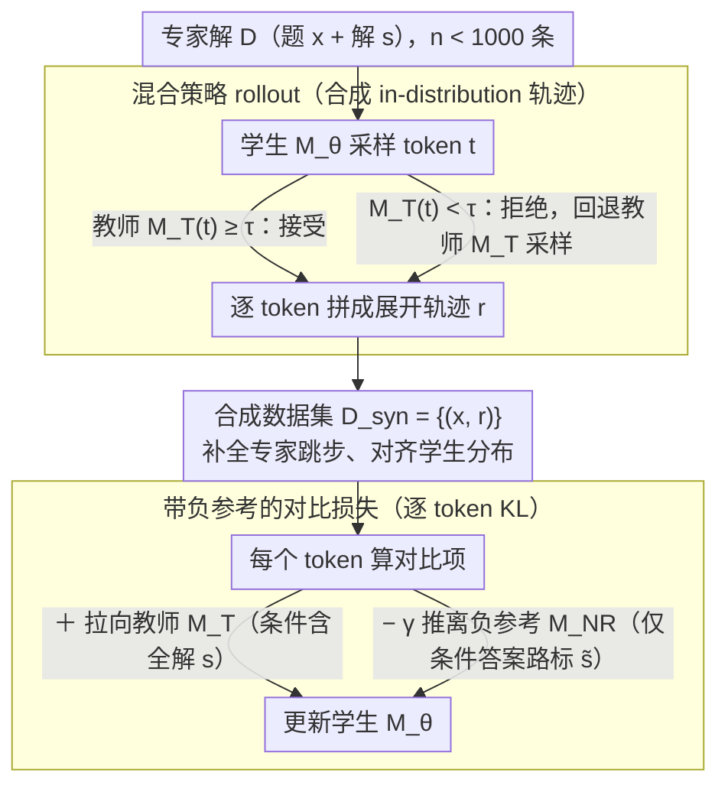

# Making Expert Reasoning Learnable with Self-Distillation

**会议**: ICML 2026  
**arXiv**: [2602.02405](https://arxiv.org/abs/2602.02405)  
**代码**: https://github.com/ethanm88/DAIL  
**领域**: LLM推理  
**关键词**: 专家轨迹, 自蒸馏, 对比学习, 分布对齐, 数学推理

## 一句话总结
DAIL 用一个"教师 = 看过专家解的自己 + 学生 = 没看过专家解的自己"的混合策略 rollout，把不到 1000 条专家解题轨迹改写成与学生策略分布一致的推理链，再用对比损失压低"只看中间答案的负参考模型"高概率的捷径 token，在 Qwen2.5-Instruct / Qwen3 上拿到最高 31% 的 pass@128 提升，并把所需推理 token 砍掉一半。

## 研究背景与动机

**领域现状**：当前提升 LLM 推理能力的两大主流路线是带可验证奖励的强化学习（RLVR，如 GRPO）和从更强教师模型蒸馏长 CoT。两者都假设训练信号"垂手可得"——要么模型自己能采到正确答案，要么存在比它更强的教师。

**现有痛点**：在 AIME / IMO 级别的硬题上，前沿模型自己采 32 次都全错，RLVR 的奖励、优势、梯度全为 0；而真正比它强的教师（人类数学奥赛选手）写出来的题解是给人看的，跳步、省略推导细节，直接 SFT 上去反而把模型 post-training 学到的推理过程打崩。

**核心矛盾**：专家解轨迹分布 $p_{\text{expert}}$ 与学生策略分布 $p_\theta$ 之间存在两类不对齐：(1) **didactic shortcuts**——专家为了简洁省掉了对学生必要的中间步骤；(2) 一旦让模型"补完"这些步骤又会引入 **rationalization shortcuts**——模型偷看到了答案，于是强行把推导掰向已知结果，而不是真的推出来。标准 NLL 对所有 token 一视同仁，会把这两类捷径一起内化。

**本文目标**：在专家解极少（$n < 1000$）且问题可能不可验证（开放式证明题）的条件下，把每条专家解最大化转化为可泛化的推理训练信号。

**切入角度**：作者把这件事拆成两阶段——先做**分布对齐的数据合成**（把 OOD 的专家解变成 in-distribution 的展开轨迹），再做**对捷径敏感的目标函数**（专门压低偷看答案才会高概率的那些 token）。

**核心 idea**：用"自蒸馏" $M_T = M_{\theta_{\text{ref}}}(\cdot | x, s)$ 当教师（同一个模型，只是 condition 上了专家解 $s$），让它和学生 $M_\theta(\cdot | x)$ 通过"投机解码式"的混合策略 rollout 协同生成轨迹；再构造一个只 condition 在专家解关键节点 $\tilde s$ 上的**负参考模型** $M_{NR}$，用 $\mathrm{KL}(M_\theta \| M_T) - \gamma \mathrm{KL}(M_\theta \| M_{NR})$ 这个对比损失训练学生。

## 方法详解

### 整体框架
DAIL 是一个两阶段 offline 训练方法，输入是 $n < 1000$ 条专家 (题目, 解答) 对 $\mathcal{D} = \{(x_i, s_i)\}$，输出是更新后的学生模型 $M_\theta$。流水线是：(1) **In-distribution 轨迹合成**——用 frozen 的初始权重 $\theta_{\text{ref}}$ 同时实例化"教师"（看专家解）和"学生"（不看专家解），通过混合策略解码生成展开后的推理轨迹 $r_i$，得到合成数据集 $\mathcal{D}_{\text{syn}} = \{(x_i, r_i)\}$；(2) **对比微调**——在 $\mathcal{D}_{\text{syn}}$ 上用对比损失训练 $M_\theta$，正项把它拉向看过专家解的教师，负项把它推离只看答案关键点的负参考。整套训练完全 offline，且因为教师 / 学生 / 负参考共享底座权重，可以用 LoRA 适配器加开关方式只存一份模型权重。

> 三个角色 $M_\theta$ / $M_T$ / $M_{NR}$ 共享同一份 frozen 底座，只靠 LoRA 开关切换（即设计 3），故全流程显存约等于单模型推理。

### 关键设计

**1. 混合策略 rollout：把专家解重写成"学生分布内、但锚定在专家路线上"的轨迹**

专家解直接拿来 SFT 会出两类问题：让看过答案的教师生成会照抄专家解、引入跳步；让学生自己生成又会跑偏。DAIL 用一套投机解码式的混合采样夹在中间——生成第 $i$ 个 token 时先从学生采样 $t \sim M_\theta(\cdot | x, r_{<i})$，再让教师做一票"接受/拒绝"：若 $M_T(t | r_{<i}) \geq \tau$ 就接受 $r_i := t$，否则回退到教师采样 $r_i \sim M_T(\cdot | r_{<i})$。目的和投机解码、DAgger 正好反过来：尽量让学生自己说话，只在它明显偏离专家路线时才让教师介入。这对长 CoT 推理模型（如 Qwen3-think）尤其重要——直接让教师采样会频繁触发"参考一下专家解"式的元评论、破坏自然的自我验证流，而混合 rollout 保留了学生原生的回溯/自我纠错节奏、又被专家解轻量锚定，避免分布漂移。对非反思模型（如 Qwen2.5-Instruct），prompt 工程下的 direct sampling 已经够用，所以这个组件主要为 LRM 设计。

**2. 带负参考的对比损失：专门压低"偷看答案才会高概率"的捷径 token**

把专家解补全成完整轨迹后，还要防止学生死记那些 rationalization shortcut——知道答案才会高概率、其实没真推出来的 token。DAIL 构造一个负参考 $M_{NR}(\cdot) = M_{\theta_{\text{ref}}}(\cdot | x, \tilde s)$，其中 $\tilde s$ 是用正则从 $s$ 自动抽出的"粗粒度答案路标"（数学场景就是中间数值/符号结果列表）；只 condition 在路标上的模型天然倾向于跳过逐步推导、在路标之间硬拼。损失写成

$$L(\theta) = \mathbb{E}_{(x,r) \sim \mathcal{D}_{\text{syn}}} \sum_{t=1}^{|r|} \left[ \mathrm{KL}(M_\theta(\cdot|x, r_{<t}) \| M_T(\cdot | r_{<t})) - \gamma\, \mathrm{KL}(M_\theta(\cdot|x, r_{<t}) \| M_{NR}(\cdot | r_{<t})) \right],$$

即"拉向看过全解的教师 + 推离只看路标的负参考"。理论上最大化负项是无界的，但学生从 $\theta_{\text{ref}}$ 初始化、又被正项强力锚住，实测训练稳定。和 Kumar et al. 2022 指出的 BC 在次优数据上的问题一致——标准 NLL 区分不了"有效推理"和"虚假捷径"，而 token 级 KL 对比能把惩罚精确加在两个条件分布出现差异的位置。

**3. 效率友好的训练框架：离线解耦 + 一份权重加 LoRA 开关**

RLVR 在硬题上要 1k GPU 小时才收敛，瓶颈是边采样边训练。DAIL 把"生成 + 优化"解耦成"先离线合成 $\mathcal{D}_{\text{syn}}$、再纯离线训练"——数据合成阶段可在分布式集群上大规模并行、与 GPU 优化阶段完全分离，数据还能复用、可缓存。更省的是三个角色 $\theta_{\text{ref}}$、$M_T$、$M_{NR}$ 共享底座参数，只有学生差一个 LoRA 适配器（Hu et al. 2022），于是三个前向都用同一份 frozen 权重、按需打开/关闭 LoRA 开关即可，显存基本等于单模型推理；叠加 LoRA 后小集群也能跑 14B 模型，让"为每个新难题数据集快速迭代"变得可行。

### 损失函数 / 训练策略
正式损失即上节给出的对比 KL，$\gamma$ 是负项权重的关键超参（消融见原文 Appendix C.8）。$\tilde s$ 的构造对数学场景用一个固定正则（保留 $\boxed{}$、关键等式右边等关键结果），无需额外标注。训练数据：在 Qwen2.5-7B-Instruct 上用 `e1-verifiable`（417 道 1985–2023 历年 AIME 题，且都是底模 32 次采样都做不出来的）；在 Qwen3-8B/14B (think) 上用作者新发布的 `e1-proof`（669 道 IMO 级开放式证明题，由 USA IMO 教练 Evan Chen 授权提供），用于演示 DAIL 能在**不可验证**的证明题上训练——这是 RLVR 在没有生成式奖励模型时做不到的。

## 实验关键数据

### 主实验

数学推理 pass@k（综合 AIME 2024/25、BeyondAIME、IMO-AnswerBench 三个数学 benchmark，Qwen2.5-7B-Instruct 在 `e1-verifiable` 上训练）：

| 方法 | 训练形态 | pass@128（相对底模） | 备注 |
|------|----------|----------------------|------|
| Qwen2.5-7B-Instruct（底模） | — | 基线 | post-trained 指令模型 |
| GRPO（在 `e1-verifiable`） | RLVR | **下降** | 硬题奖励稀疏，过拟合到少量随机正确 rollout |
| NuRL + GRPO | RLVR + hint | 低于 GRPO | 训练时依赖 hint，推理无 hint 后掉点 |
| GRPO（DeepScaleR，40K 题） | 大规模 RLVR | pass@1 微涨；pass@k 大 k 下跌 | 单纯堆可验证数据不足以解奥赛题 |
| Direct SFT 专家解 | 行为克隆 | 下降 | OOD 直接打崩 |
| STaR rationalization | 自合成 | 下降 | 模型自身能力不足以自生成有效推理链 |
| **DAIL (Ours)** | 自蒸馏 + 对比 | **+ 至多 31% pass@128** | 唯一稳定提升的方法 |

测试时 token 效率（Qwen3-8B/14B (think) 在 `e1-proof` 上训练，pass@128 vs token 预算）：在 512–4096 token 预算下 DAIL 全面超过未训练的 Qwen3，且用 **2× 更少的 token** 就能匹配未训练模型的最佳性能——专家轨迹的信息密度直接转化为推理效率。

OOD 泛化（GPQA-Diamond，物理/化学/生物研究生题，Qwen2.5 & Qwen3 在 4 种 token 预算下 pass@1 / pass@128 共 8 组）：

| 设置 | Base 平均 | DAIL 平均 | 结论 |
|------|-----------|-----------|------|
| Qwen2.5 pass@1 / pass@128 | 34.1 / 85.9 | **35.1** / 84.3 | 几乎持平，未灾难遗忘 |
| Qwen3 pass@128（512/1024/2048/4096） | 93.9 / 95.5 / 93.4 / 93.4 | **96.5 / 96.9 / 96.5 / 96.0** | 一致提升 ~3 个点 |

### 消融实验

| 配置 | 现象 | 说明 |
|------|------|------|
| 完整 DAIL（contrastive + mixed rollout） | 主结果 | 训练集 pass@k 反而**低于** NLL，但测试 OOD 最高 |
| 替换为 NLL 损失 | pass@1 / pass@128 全面下滑 | 没有 negative reference 时学生学到了 rationalization shortcut |
| Direct sampling vs Mixed rollout（Qwen3-think） | mixed 显著更好 | 反思型 LRM 下 direct 采样会引入"参考专家解"的元评论 |
| Direct sampling vs Mixed rollout（Qwen2.5-Instruct） | direct 略好 | 非反思模型用 prompt 控 shortcut 已足够 |
| 训练集 pass@k 对比 | NLL / RLVR 训练集高、测试集低 | 直接证据：他们学的是 shortcut，不是泛化推理 |

### 关键发现
- 对比损失的增益主要体现在 pass@1 上：在 direct sampling 数据上对 NLL 提升约 15–20%，因为这类数据 shortcut 更多，对比项的"过滤"价值更大；mixed rollout 数据 shortcut 本就少，对比项主要在 pass@128 体现稳定 ~1% 提升。
- DAIL 训练集分数低、测试集分数高，这种"反向 generalization gap"恰恰是 contrastive objective 真的在压制非鲁棒推理模式的直接证据。
- 难题 RLVR 失效的根因不是奖励完全为 0（实测仍有少量 stochastic 正确 rollout），而是模型对这些罕见随机成功**过拟合**，导致一般推理能力反而退化；DeepScaleR 大规模数据也无法救回奥赛级推理。
- DAIL 在参数（8B→14B）和 token 预算（512→4096）两条 axis 上都正向 scaling，说明它不是只对小模型有效的小聪明。

## 亮点与洞察
- **"教师 = 自己 + 答案" 的自蒸馏定位**很巧妙：传统蒸馏需要更强的外部教师，DAIL 把"看过答案的自己"当教师，绕开了"硬题上根本不存在更强模型"这一现实困境；同时因为底座完全一致，混合策略 rollout 的接受率自然很高，分布漂移很小。
- **负参考构造方式**值得迁移：不需要训练一个额外的"差模型"，只需要给同一个 frozen 模型 condition 上**信息残缺的上下文**（数学场景就是"只保留答案路标"），就自然产生了一个偏向 shortcut 行为的对照分布。这套思路完全可以搬到代码生成（残缺=只给函数签名+返回值）、定理证明（残缺=只给最终命题）等场景。
- **把不可验证证明题纳入训练**：`e1-proof` 这个数据集本身就是贡献——它打开了在"没有可执行 verifier、没有自动评分器"的开放式问题上做后训练的可能，是 RLVR 范式的有效补充。
- **训练集越差测试集越好**这个现象很反直觉但合理：当训练目标本身就是"减少 shortcut 模仿"时，训练 loss 自然包含一个"主动放弃部分训练分布拟合度"的项，把它当作正则项理解最干净。

## 局限与展望
- 负参考 $\tilde s$ 当前依赖正则表达式自动抽取关键节点，强绑数学题"$\boxed{}$ + 中间等式"的格式特征；迁到代码、法律推理等领域需要重新设计 $\tilde s$ 的提取规则，作者没给通用方案。
- 评估全在数学 + GPQA（科学多选），其它推理任务（代码、规划、定理证明 Lean）未验证；对开放式证明的"正确性"也只能用 IMO-AnswerBench 这种被改写成有标准答案的版本来度量，真正自由形式的证明评估仍未触及。
- $\gamma$（负项权重）和 $\tau$（接受阈值）两个超参的稳定区间没有给出系统扫描，对资源有限的复现者来说调参成本未知。
- 数据规模仍然只有几百条专家解；当专家数据进一步扩到几千、几万条时，对比项是否仍能稳住、是否会和正项产生张力，是值得进一步研究的开放问题。

## 相关工作与启发
- **vs On-policy distillation (Agarwal et al., 2024 / Lu & Lab 2025)**：他们让强教师在学生轨迹上做 token-level 监督，需要存两份模型且教师必须更强；DAIL 把教师改成"看过答案的同一个模型"，单模型即可，并且通过对比项处理"教师自己也可能 hallucinate"的问题。
- **vs RLVR / GRPO (Shao et al., 2024)**：RLVR 要求可验证 + 模型能采到正确答案，DAIL 两条假设都打破——既能用不可验证的证明题，又能从模型自己 32 次都做不出来的难题学到东西。
- **vs STaR rationalization (Zelikman et al., 2022)**：STaR 让模型自己给出"以答案为提示"的合理化解释，但难题上模型自身能力不够，自生成轨迹无效；DAIL 的混合策略 rollout 用专家解锚定生成路径，相当于给 STaR 加了一个"防止瞎编"的导航。
- **vs NuRL (Chen et al., 2025a)**：NuRL 在 RLVR 训练时注入提示缓解奖励稀疏，但训练-推理失配（推理无提示）导致小样本场景反而不如 GRPO；DAIL 完全 offline，不存在这种失配。
- **方法学启发**：可以把 DAIL 模板套到任何"专家轨迹稀缺 + 直接模仿失败 + 答案可结构化抽取"的场景——例如手术机器人示教数据、SQL 工程师的复杂查询日志、安全研究员的渗透测试 writeup 等，都可能复用"答案条件教师 + 关键路标负参考"这套架构。

## 评分
- 新颖性: ⭐⭐⭐⭐⭐ 把自蒸馏 + 投机解码 + 对比 RL 三条线索拼成一个干净的两阶段框架，且首次在"非可验证的奥赛证明题"上做出有效后训练。
- 实验充分度: ⭐⭐⭐⭐ 覆盖 3 个数学 benchmark + GPQA OOD + 两种底模 + 5 类 baseline + 多种消融，但缺少超参敏感性扫描和代码/规划等更多领域。
- 写作质量: ⭐⭐⭐⭐⭐ 动机递进清晰，把"didactic shortcut vs rationalization shortcut"这一对概念抽出来定义得很漂亮，图 1 一图说清整个 pipeline。
- 价值: ⭐⭐⭐⭐⭐ 提供了硬题后训练的新范式（< 1000 样本 + 离线 + LoRA-friendly），并公开了 `e1-proof` 数据集，对学界和开源社区都有直接价值。

<!-- RELATED:START -->

## 相关论文

- [\[ICML 2026\] EAPO: Enhancing Policy Optimization with On-Demand Expert Assistance](eapo_enhancing_policy_optimization_with_on-demand_expert_assistance.md)
- [\[ICML 2025\] The Challenge of Teaching Reasoning to LLMs Without RL or Distillation](../../ICML2025/reinforcement_learning/the_challenge_of_teaching_reasoning_to_llms_without_rl_or_distillation.md)
- [\[ICML 2026\] Metis: Learning to Jailbreak LLMs via Self-Evolving Metacognitive Policy Optimization](metis_learning_to_jailbreak_llms_via_self-evolving_metacognitive_policy_optimiza.md)
- [\[ICML 2026\] D$^2$Evo: Dual Difficulty-Aware Self-Evolution for Data-Efficient Reinforcement Learning](d2evo_dual_difficulty-aware_self-evolution_for_data-efficient_reinforcement_lear.md)
- [\[ICML 2026\] ORLoopBench: Solver-in-the-Loop Benchmarks for Self-Correction and Behavioral Rationality in Operations Research](orloopbench_solver-in-the-loop_benchmarks_for_self-correction_and_behavioral_rat.md)

<!-- RELATED:END -->
