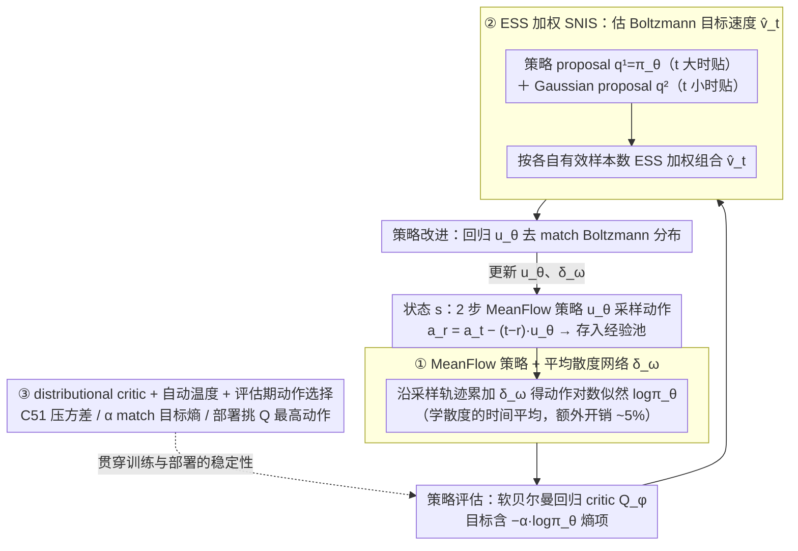

# MFPO: 用 Few-step MeanFlow Policy 把 MaxEnt RL 跑到接近 Gaussian policy 的速度

**会议**: ICML 2026  
**arXiv**: [2604.14698](https://arxiv.org/abs/2604.14698)  
**代码**: https://github.com/dongxiaoyi-xyz/MFPO  
**领域**: 强化学习 / 扩散策略 / 流匹配  
**关键词**: MeanFlow, MaxEnt RL, soft policy iteration, 平均散度网络, importance sampling

## 一句话总结
MFPO 用 MeanFlow models（学 average velocity 而非 instantaneous velocity）当 RL policy 把扩散策略采样步数从 20+ 降到 2 步，用 average divergence network 解决 action likelihood 计算、用 ESS-weighted SNIS 组合 Gaussian + policy proposal 解决 soft policy improvement，在 MuJoCo/DMC/HumanoidBench 上性能 ≥ diffusion baseline 且训练时间降 ~50%。

## 研究背景与动机

**领域现状**：在线 RL 在连续控制上 Gaussian/deterministic policy + noise 太单模态，复杂任务 reward landscape 多模态时容易陷局部最优。扩散/流匹配策略（DIPO、QVPO、DACER、DIME）通过 iterative generation 建模 multi-modal action 但 inference 10-20 步导致训练慢一两个数量级。

**现有痛点**：MaxEnt RL 平衡 explore/exploit 需要 action likelihood 评估 + soft policy improvement（match Boltzmann distribution）；对扩散策略都难——likelihood 需积分 instantaneous velocity divergence（intractable），soft improvement 需 Boltzmann 样本（不可用）。已有方法（DIME lower bound、MaxEntDP 数值积分、SAC-Flow GRU/Transformer）在 few-step 下 bound 松、ODE 离散化误差大。

**核心矛盾**：要 multi-modal 表达力就要扩散；要 RL 训练效率就要少步；少步会破坏 likelihood 精度和 policy improvement 准确性。

**本文目标**：在 2 步内做到 multi-modal policy + MaxEnt RL 的精确 likelihood + soft improvement，让扩散策略训练时间接近 Gaussian policy。

**切入角度**：MeanFlow models (Geng et al. 2025) 学 average velocity $\boldsymbol{u}(\boldsymbol{x}_t, r, t) = \frac{1}{t-r} \int_r^t \boldsymbol{v}(\boldsymbol{x}_\tau, \tau) d\tau$ 而非 instantaneous，精确学到后 2 步采样无 discretization error。但 MeanFlow 应用到 MaxEnt RL 仍要解决 likelihood 和 soft improvement 两个挑战。

**核心 idea**：(1) 模仿 MeanFlow 造 average divergence network $\delta_\omega$ 近似 $\frac{1}{t-r} \int_r^t \nabla \cdot \boldsymbol{v}_\theta d\tau$，复用 sampling pipeline 算 likelihood；(2) 用 SNIS 估 Boltzmann 的 marginal velocity，自适应组合 policy proposal + Gaussian proposal by ESS weighting；(3) MeanFlow policy 用 soft policy iteration 训练，配 distributional critic + auto temperature。

## 方法详解

### 整体框架

MFPO 维护两个网络：critic $Q_\phi$ 和 MeanFlow 策略 $\boldsymbol{u}_\theta$（外挂平均散度网络 ADN $\delta_\omega$），在最大熵 RL 的软策略迭代（soft policy iteration）框架下交替做**策略评估**（更新 $Q_\phi$）和**策略改进**（更新 $\boldsymbol{u}_\theta$）。难点在于这两步都依赖 MeanFlow 策略的动作 likelihood 和 Boltzmann 目标分布，而它们对 few-step 生成式策略本不可得——MFPO 用三个设计把缺口补齐：① **MeanFlow 策略 + 平均散度网络**解决 likelihood，② **ESS 加权 SNIS** 解决策略改进所需的目标速度估计，③ **distributional critic + 自动温度 + 评估期动作选择**把训练与部署的稳定性补齐。部署时只需 2 步采样：$\boldsymbol{a}_{t_{i-1}} = \boldsymbol{a}_{t_i} - \frac{1}{T} \boldsymbol{u}_\theta(\boldsymbol{s}, \boldsymbol{a}_{t_i}, t_{i-1}, t_i)$。



### 关键设计

**1. MeanFlow 策略 + 平均散度网络（average divergence network, ADN）：让 2 步采样也能精确算 action likelihood**

MaxEnt RL 要把熵塞进目标，就必须能算策略给某个动作的 log-likelihood，可扩散策略的 likelihood 要对瞬时速度场的散度沿时间积分，本身就 intractable，few-step 离散化又把误差放大。MFPO 的策略是 MeanFlow model，学的是平均速度 $\boldsymbol{u}(\boldsymbol{x}_t, r, t) = \frac{1}{t-r} \int_r^t \boldsymbol{v}\,d\tau$，采样写成 $\boldsymbol{a}_r = \boldsymbol{a}_t - (t-r)\boldsymbol{u}_\theta$，2 步就能从噪声走到动作且几乎无离散化误差。likelihood 这边作者照搬同一个"学平均量"的思路：再训一个 average divergence network $\delta_\omega(\boldsymbol{s}, \boldsymbol{a}_t, r, t) \approx \frac{1}{t-r} \int_r^t \nabla \cdot \boldsymbol{v}_\theta\,d\tau$，训练目标里用 Skilling-Hutchinson trace estimator $\widehat{\text{div}} = \frac{1}{N} \sum_i \boldsymbol{\epsilon}_i^\top \frac{\partial \boldsymbol{v}_\theta}{\partial \boldsymbol{a}_t} \boldsymbol{\epsilon}_i$ 避免对每一维都跑一次反向。推理时直接复用采样轨迹上的几个点把散度累起来 $\log \pi_\theta(\boldsymbol{a}_0|\boldsymbol{s}) = \log p_1(\boldsymbol{a}_1) + \frac{1}{T} \sum_i \delta_\omega(\boldsymbol{s}, \boldsymbol{a}_{t_i}, t_{i-1}, t_i)$，额外开销只有约 5%。ADN 之所以成立，正是因为它和 MeanFlow 同构——MeanFlow 学速度的时间平均，ADN 学散度的时间平均，既精确（trained to match）又便宜。

**2. ESS 加权 SNIS：没有 Boltzmann 样本也能做策略改进（soft policy improvement）**

soft policy improvement 要让策略去 match Boltzmann 分布 $\pi(\boldsymbol{a}_0|\boldsymbol{s}) \propto \exp(\frac{1}{\alpha} Q)$，但手里根本没有 Boltzmann 的样本，只能去估它的 marginal velocity field $\boldsymbol{v}_t(\boldsymbol{a}_t|\boldsymbol{s}) = \mathbb{E}_{\pi(\boldsymbol{a}_0|\boldsymbol{a}_t, \boldsymbol{s})}[\frac{\boldsymbol{a}_t - \boldsymbol{a}_0}{t}]$。已有方法（MaxEntDP/SDAC）用一个 Gaussian proposal $q^2(\boldsymbol{a}_0) = \mathcal{N}(\boldsymbol{a}_0|\frac{\boldsymbol{a}_t}{1-t}, (\frac{t}{1-t})^2 I)$ 做 self-normalized importance sampling，问题是 $t \to 1$ 时 target 由 $Q$ 主导、Gaussian 离它越来越远，有效样本数 ESS 急剧塌掉。MFPO 再加一个 policy proposal $q^1(\boldsymbol{a}_0) = \pi_\theta(\boldsymbol{a}_0|\boldsymbol{s})$（likelihood 正好由 ADN 给出），它在 $t$ 大时反而贴得紧；最后按各 proposal 的有效样本数加权组合 $\hat{\boldsymbol{v}}_t = \sum_k \frac{\text{ESS}_k}{\sum_l \text{ESS}_l} \hat{\boldsymbol{v}}_t^k$。这样 Gaussian 负责 $t$ 小的区间、policy 负责 $t$ 大的区间，谁的有效样本多谁说话，组合估计的方差比任何单一 proposal 都低——这不是手调，而是 ESS 自带的 variance reduction。

**3. distributional critic + 自动温度（auto temperature）+ 评估期动作选择：把训练和部署各自的稳定性补齐**

剩下三件配置让整套方法真正跑稳，针对的是"训练要探索、部署要确定"这对矛盾。critic 用 C51 把 Q 当 categorical 分布学、策略更新只取均值，沿用 diffusion RL 里已被验证有效的 distributional Q-learning 来压低值估计方差；温度 $\alpha$ 不写死，而是自动调到 match 目标熵 $\mathcal{H}_{\text{target}} = -\rho \cdot \dim(\mathcal{A})$（$\rho = 0.5$ 跨任务普适最佳），让方法对 reward scale 鲁棒；评估时不再随机采样，而是从策略采若干候选动作、挑 $Q$ 最高的那个确定性动作输出——训练期的随机性帮探索，部署期的确定性保表现。

### 算法

```
Initialize Q_φ, π_θ (MeanFlow), δ_ω, α
for each step:
    # Policy evaluation
    L(φ) = (Q_φ(s,a) - (r + γ(Q(s',a') - α log π(a'|s'))))²
    # Policy improvement  
    Estimate v̂_t via ESS-weighted SNIS combining q^1 = π_θ + q^2 = Gaussian
    L(θ) = ||u_θ - sg(u_tgt)||²
    # ADN update via Eq. 17
    L(ω) = ||δ_ω - sg(δ_tgt)||²
    # Auto temperature
    L(α) = α (H(π_θ) - H_target)
```

## 实验关键数据

### 主实验：MuJoCo（5 locomotion）

| Algorithm | Sampling Steps | Inference Time (ms) | Avg Performance |
|---|---|---|---|
| **MFPO (ours)** | **2** | **0.46** | best/tied |
| DIME | 16 | 0.97 | comparable |
| FlowRL | 11 | 0.42 | comparable |
| SAC-Flow | 4 | 0.96 | comparable |
| MaxEntDP | 20 | 1.56 | slightly lower |
| DACER | 20 | 1.06 | comparable |
| QVPO | 20 | 1.68 | slightly lower |
| TD3 (Gaussian) | 1 | 0.14 | lower（unimodal） |
| SAC (Gaussian) | 1 | 0.15 | lower（unimodal） |

MFPO 2 步采样 0.46ms inference time，比其他 diffusion methods 快 2-3.5×；性能 ≥ 所有 diffusion baseline。训练时间降 ~50%。

### 关键 ablation（HalfCheetah-v3）

| Ablation | 影响 |
|---|---|
| MeanFlow → Flow Matching policy | 性能下降，average velocity 在 few-step 必要 |
| Remove ADN | 性能下降，likelihood 估计的必要 |
| Only Gaussian proposal | $t \to 1$ ESS 低 |
| Only policy proposal | failed，proposal 不有效 |
| $K_1:K_2 = 1:2$（更多 Gaussian） | 最佳 |
| Fixed temperature | 比 auto 差 |
| $\rho = 0.5$ for target entropy | 最佳 |

### ESS 与方差分析

Figure 1：HalfCheetah-v3 训练 120k iter 后，Gaussian proposal $q^2$ 在 $t \to 1$ ESS 急剧下降；policy proposal $q^1$ 在 $t \to 1$ 仍高；组合后 estimation variance 比任一单 proposal 都低——验证 ESS-weighted SNIS 的核心动机。

### 关键发现

- **2 步采样达到 20 步 diffusion 性能**：MFPO 用 MeanFlow 2 步基本追上 MaxEntDP/QVPO 20 步，inference time 降 3-4×。
- **训练时间降 50%**：相比 DACER/DIME/MaxEntDP，训练时间几乎砍半。
- **ADN 5% overhead 给 accurate likelihood**：相比 naive 数值积分（每步 $d$ 次 backward），ADN 几乎免费。
- **Two-proposal SNIS 是关键**：组合后 variance 显著降低，是 policy update 稳定的关键。
- **HumanoidBench 也行**：高维任务（>50 dim action）上 MFPO 也 match SOTA，scale 到复杂控制。

## 亮点与洞察

- **MeanFlow + MaxEnt RL 是完美组合**：MeanFlow 解决"少步表达力"，MaxEnt 解决"探索"，组合后既快又稳。
- **ADN 是方法学层面的优雅类比**：把"MeanFlow 学 average velocity"的思想迁移到"学 average divergence"，方法学一致。
- **ESS-weighted SNIS 的工程价值**：不是 ad-hoc tuning，而是用 ESS 自动加权，理论有 variance reduction 保证。
- **训练速度降 50% 的实际意义**：让 diffusion-based RL 在工程项目中变可行——以前 20 步训练几天才出 SAC 几小时的结果，现在 2 步训练几小时就到 diffusion 性能。
- **MeanFlow 的复用**：把 generative modeling 的最新进展（average velocity）迁移到 RL，是跨子领域 cross-pollination 的典范。

## 局限与展望

- **2 步采样下表达力极限**：虽然 MeanFlow 减少 discretization error，但 2 步 vs 20 步 multi-modality 上仍有理论 gap，特别复杂任务可能 sweet spot 在 4-8 步。
- **ADN 训练稳定性**：ADN 训练目标依赖 stop-gradient + recursive structure，长时间训练是否漂移没充分验证。
- **两 proposal 的 ratio tuning**：$K_1:K_2 = 1:2$ 在 HalfCheetah 上最佳，跨任务是否需要调没系统消融。
- **Distributional critic 选择**：C51 是默认，QR-DQN / IQN 可能更稳；distributional choice 的影响没单独消融。
- **缺 sample efficiency 对比**：训练时间快但 sample efficiency（每多少环境 step 达到某性能）vs baseline 没明确对比。
- **没在 Atari / pixel-based 上验证**：所有实验 state-based MuJoCo/DMC/HumanoidBench，pixel observation 下 MeanFlow policy 是否仍有效未知。

## 相关工作与启发

- **vs DACER / DIME / MaxEntDP / SDAC**：他们用 diffusion + MaxEnt 但需要 10-20 步采样；MFPO 用 MeanFlow 把步数降到 2，同时方法学上保留 MaxEnt 的精确性。
- **vs FPMD / QVPO / FlowRL**：他们用 diffusion-based RL 但不是 MaxEnt 框架；MFPO 同时具备 multi-modal expressiveness 和 MaxEnt principled exploration。
- **vs SAC-Flow**：他们用 GRU/Transformer 实现 diffusion policy 训练稳定；MFPO 不依赖特殊架构，方法学更通用。
- **vs MeanFlow (Geng et al. 2025)**：generative modeling 原作，本文是 MeanFlow 在 RL 上的应用。
- **vs TD3+BC / Diffusion-QL**：offline RL 用 diffusion 类似但 online setting 不同；MFPO 专注 online 场景。
- **启发**：(1) 任何"diffusion model 在某领域因 sampling 慢而部署难"的场景都可试 MeanFlow；(2) MeanFlow 的"learn average via consistency"思想可推广到 divergence、Lyapunov function、value function 等其他需要时间积分的量；(3) SNIS 多 proposal 组合是处理 intractable distribution 的通用技巧，ESS-weighting 提供自适应性。

## 评分

- 新颖性: ⭐⭐⭐⭐⭐ MeanFlow + MaxEnt RL 组合 + ADN 类比 + ESS-weighted SNIS 三件创新组合，方法学全面。
- 实验充分度: ⭐⭐⭐⭐⭐ MuJoCo/DMC/HumanoidBench 三套 benchmark + 8 个 baseline + 4 维度 ablation + ESS/variance 可视化，证据链完整。
- 写作质量: ⭐⭐⭐⭐⭐ 数学推导清晰、ADN 类比直观、Figure 1 ESS 可视化直击 motivation，方法叙述非常工整。
- 价值: ⭐⭐⭐⭐⭐ 让 diffusion-based RL 在 inference 速度和训练成本上都接近 Gaussian policy，是 diffusion RL 实用化的关键一步；开源代码 + 普适性强。

<!-- RELATED:START -->

<div class="related-papers" markdown="1">

## 相关论文

- [\[AAAI 2026\] One-Step Generative Policies with Q-Learning: A Reformulation of MeanFlow](../../AAAI2026/reinforcement_learning/one-step_generative_policies_with_q-learning_a_reformulation_of_meanflow.md)
- [\[ICML 2026\] Learning to Route Languages for Multilingual Policy Optimization](learning_to_route_languages_for_multilingual_policy_optimization.md)
- [\[ICML 2026\] EAPO: Enhancing Policy Optimization with On-Demand Expert Assistance](eapo_enhancing_policy_optimization_with_on-demand_expert_assistance.md)
- [\[ICML 2026\] Metis: Learning to Jailbreak LLMs via Self-Evolving Metacognitive Policy Optimization](metis_learning_to_jailbreak_llms_via_self-evolving_metacognitive_policy_optimiza.md)
- [\[ACL 2026\] Bridging SFT and RL: Dynamic Policy Optimization for Robust Reasoning](../../ACL2026/reinforcement_learning/bridging_sft_and_rl_dynamic_policy_optimization_for_robust_reasoning.md)

</div>

<!-- RELATED:END -->
