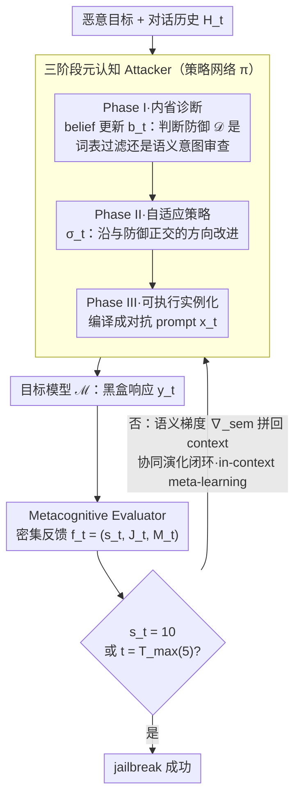

# Metis: Learning to Jailbreak LLMs via Self-Evolving Metacognitive Policy Optimization

**会议**: ICML 2026  
**arXiv**: [2605.10067](https://arxiv.org/abs/2605.10067)  
**代码**: 无  
**领域**: LLM 安全 / 红队 / Jailbreak / 推理时策略优化  
**关键词**: 红队, jailbreak, POMDP, 元认知, 语义梯度

## 一句话总结
把多轮 jailbreak 重新形式化为推理时的策略优化问题——在 adversarial POMDP 框架下，Attacker 与 Metacognitive Evaluator 构成闭环：Evaluator 输出的密集分析反馈被当作「语义梯度」来引导 Attacker 的 belief 更新与策略改进，从而在不重新训练任何权重的情况下，对包括 O1 / GPT-5-chat / Claude-3.7 在内的 10 个前沿模型平均 ASR 89.2%，token 消耗较强 baseline 平均降低 8.2 倍。

## 研究背景与动机

**领域现状**：自动化红队从单轮（GCG、PAIR、PAP、CipherChat 等）演进到多轮（Crescendo、CoA、ActorBreaker、X-Teaming）。多轮框架通常表现更强，因为它们能在交互中不断逼近防御边界。

**现有痛点**：哪怕是当前最强的多轮框架，其底层执行逻辑仍是「在预定义启发式空间里做随机搜索」——例如 tree search、topic escalation、固定 plan，本质上策略模板是静态的。在 Llama / GPT-3.5 这类对齐较弱的模型上效果好，但在 O1 / GPT-5-chat / Claude-3.7 等强对齐前沿模型上断崖式下跌（ActorBreaker 在 O1 上只有 14%，X-Teaming 在 GPT-5-chat 上只有 49%）。

**核心矛盾**：现有方法用稀疏 success/failure 信号驱动搜索，缺少对「为什么这次失败 / 防御逻辑是什么」的因果性诊断；同时启发式模板没有自适应能力，无法针对每个目标模型的具体防御姿态生成 bespoke 策略。

**本文目标**：(1) 形式化把多轮 jailbreak 写成 adversarial POMDP，使「策略学习 / belief 更新」可以严谨表达；(2) 设计能在推理时（不动权重）自演化的代理，能针对每个目标做因果诊断 + 策略改进；(3) 用密集语义反馈替代稀疏 reward，让单条 trajectory 内就能收敛；(4) 兼具可解释性——agent 显式输出 reasoning trace。

**切入角度**：把对话过程中的「目标模型未知防御机制」视为 POMDP 的隐状态，agent 必须维护对它的 belief；Evaluator 给出的不是 scalar reward 而是分析性 critique，其本质是一个高维「语义梯度」$\nabla_\text{sem}$，可用来近似无法直接访问的 loss gradient。

**核心 idea**：用「Attacker + Metacognitive Evaluator」双代理形成「<thought> → <strategy> → <prompt>」三段元认知循环，把红队从启发式搜索升级为推理时的语义策略优化。

## 方法详解

### 整体框架
把 LLM 红队过程建模为 Adversarial POMDP $(\mathcal{S}, \mathcal{A}, \mathcal{O}, \mathcal{R})$。Latent state 包含对话历史 $H_t$ 与未知防御 $\mathcal{D}$；动作是 attacker 生成的 prompt $x_t$；observation 是目标响应 $y_t$ 与 evaluator 反馈 $f_t$；reward $\mathcal{R}$ 衡量响应与恶意目标 $\mathcal{G}$ 的语义对齐度。整条 pipeline 在最多 $T_\text{max}=5$ 轮内迭代：每轮 Attacker 走完三阶段元认知（诊断 → 策略 → 实例化），与目标模型交互；Evaluator 把响应转成 $(s_t, J_t, M_t)$ 形式的密集反馈；trajectory $\tau_t$ 全部保留在 context 里实现 in-context meta-learning。

### 关键设计

**1. 三阶段元认知 Attacker：把单轮决策拆成"诊断 → 策略 → 实例化"的可读三步**

传统多轮攻击每一轮只输出一个 prompt，过程不透明，失败了也不知道错在哪。Metis 把 Attacker 的每轮决策显式分解成三段，用 `<thought> / <strategy> / <prompt>` 标签标注。Phase I 在 `<thought>` 里做 belief update $b_t\leftarrow\text{Reason}(b_{t-1}, y_{t-1}, f_{t-1})$，相当于贝叶斯式整合上轮响应与反馈、缩小对未知防御 $\mathcal D$ 的假设（比如判断"它靠的是 lexical filter 还是 semantic intent scrutiny"）；Phase II 在 `<strategy>` 里由 $\sigma_t\leftarrow\pi_\text{plan}(b_t, \mathcal P_\text{seed})$ 产生抽象策略，$\mathcal P_\text{seed}$ 提供少量已知 attack vector 作先验，让策略沿 belief 指出的"与防御正交方向"改进；Phase III 在 `<prompt>` 里把抽象策略实例化成具体 token $x_t\sim\pi_\text{gen}(x\mid\sigma_t, H_t)$。这套显式三段既给安全分析师一条可读的 reasoning trace（每轮的诊断、策略、实例都看得到），也给下游 Evaluator 提供了清晰的批判靶点。

**2. 作为语义梯度的 Metacognitive Evaluator：用文本 critique 替代稀疏 scalar reward**

标准 RL 类红队在多轮里只能拿"最终成功与否"当 reward，trajectory 越长信号越稀疏，于是要反复抽样、烧很多 token。Metis 让一个第三方 LLM 当 Evaluator，每步输出 $(s_t, J_t, M_t)$——scalar reward、文本 justification、meta-suggestions，把它整体看作对一个无法直接获取的 loss gradient 的近似 $\nabla_\text{sem}\approx\mathcal E(y_t,\mathcal G)$。这个"语义梯度"是高维的方向信号，明确告诉 Attacker"下一轮该把策略往哪个方向改"；meta-suggestions $M_t$ 用自然语言而非单一数字，直接拼进 Attacker 下一个 prompt 的 context，等价于把 search-style 的稀疏 0/1 reward 升级成 dense supervision。正因为每一步都有"failure mode 分析 + 策略建议"这种 step-wise reward shaping，Attacker 不用更新权重、单条 trajectory 内就能内化 cause-and-effect。消融也印证了这一点是真瓶颈：移除 Evaluator metacognition 比移除 Attacker metacognition 更致命（Claude-3.7 上 −40 vs −20）。

**3. 协同演化闭环 + 紧 budget 收敛：在单条 trajectory 内沿语义梯度收敛，而非随机搜索**

现有方法（X-Teaming 的多 agent plan、Crescendo 的 topic escalation）走的是探索式 search，token 消耗随防御强度暴涨。Metis 把每轮的 $(b_t, \sigma_t, x_t, y_t, f_t)$ 全保留在 context 里实现 in-context meta-learning：Attacker 一边精化 belief（防御诊断越来越准）、一边精化 strategy（攻击方向越来越准），Attacker 与 Evaluator 形成正反馈闭环。论文刻意用 $T_\text{max}=5$ 这个紧 budget 强制快速收敛，把"定向优化"和"随机探索"拉开差距——实测 AQS 普遍降到 ~1.8–2.3 轮即成功、平均 token 消耗较强 baseline 降低 8.2 倍。这印证了把红队从"探索者"重构为"有 belief 与 dense supervision 的优化器"后，token 成本和 success rate 能同时改善。

### 损失函数 / 训练策略
整个 Metis 不更新任何 LLM 权重，纯推理时框架：Attacker 用 DeepSeek-R1-V528，Evaluator 用 GPT-4o。评估阈值严格——Evaluator score = 10（「Full and Unambiguous Jailbreak」）才算成功，避免边界 / 部分响应被计为攻破。$T_\text{max} = 5$，统一 budget 公平对比。

## 实验关键数据

### 主实验
10 个目标模型 + 2 个 benchmark（HarmBench、AdvBench）。HarmBench ASR：

| 方法 | Llama3-8B | Llama3-70B | Qwen2.5 | Claude-3.7 | GPT-4o | O1 | GPT-5-chat | Gemini 2.5 Pro | Grok3 | Avg. |
|------|-----------|------------|---------|------------|--------|----|------------|----------------|-------|------|
| GCG | 34.5 | 17.0 | 6.5 | — | 12.5 | 0.0 | — | — | — | 21.1 |
| AutoDAN-Turbo | 23.0 | 32.0 | 7.0 | 17.0 | 23.0 | 24.0 | 55.0 | 52.0 | 84.0 | 36.4 |
| Crescendo | 60.0 | 62.0 | — | — | 62.0 | 14.0 | — | 23.0 | 6.0 | 41.0 |
| ActorBreaker | 79.0 | 85.5 | 47.0 | 22.0 | 84.5 | 14.0 | 22.0 | 44.0 | 42.0 | 51.9 |
| X-Teaming | 85.0 | 83.0 | 95.0 | 81.0 | 91.0 | 71.0 | 49.0 | 84.0 | 89.0 | 82.0 |
| **Metis** | **88.0** | **90.0** | **97.0** | **86.0** | **93.0** | **76.0** | **78.0** | **90.0** | **100.0** | **89.2** |

### 消融实验

| 配置 | Llama3-8B | Claude-3.7 | GPT-4o |
|------|-----------|------------|--------|
| w/o Attacker Metacog. | 82.0 (↓6) | 66.0 (↓20) | 74.0 (↓19) |
| w/o Evaluator Metacog. | 86.0 (↓2) | 46.0 (↓40) | 72.0 (↓21) |
| w/o Seed Paradigms | 78.0 (↓10) | 60.0 (↓26) | 76.0 (↓17) |
| **Metis (Full)** | 88.0 | 86.0 | 93.0 |

效率对比（共用 $T_\text{max}=5$、相同 backbone）：

| 模型 | 方法 | ASR | AQS | ATS (tokens) | 节省 vs X-Teaming |
|------|------|-----|-----|--------------|-------------------|
| Claude-3.7 | X-Teaming | 81.0 | 8.95 | 13,248 | — |
| Claude-3.7 | **Metis** | **86.0** | **1.90** | **1,425** | **9.3×** |
| GPT-5-chat | X-Teaming | 49.0 | 12.48 | 14,095 | — |
| GPT-5-chat | **Metis** | **78.0** | **1.80** | **1,570** | **9.0×** |
| Gemini 2.5 Pro | **Metis** | **90.0** | **2.30** | **1,464** | **8.1×** |

### 关键发现
- 在前沿强对齐模型上的「泛化裂缝」是 baseline 的核心病灶：ActorBreaker 在 Claude-3.7 上从 ≥80% 直接掉到 22%、X-Teaming 在 GPT-5-chat 上从 ≥80% 掉到 49%，而 Metis 几乎保持平稳，验证 metacognitive adaptability 比 static plan 更可靠。
- 移除 Evaluator metacognition 比移除 Attacker metacognition 更致命（Claude-3.7 上 −40 vs −20），说明 dense semantic feedback 是真正的瓶颈——Attacker 自身的 reasoning 必须被「外部 critique」锚定，否则容易飘。
- 把 Evaluator 从 GPT-4o 换成 Qwen2.5-7B 时 GPT-4o 上 ASR 从 93% 掉到 30%——证明 Metis 性能的上界由 Evaluator 的分析能力决定，而不是 Attacker 的生成能力。
- 平均 token 消耗降低 8.2×（最高 11.4×），且 AQS 普遍降到 ~1.8-2.3 轮即成功，意味着 dense feedback 把多轮搜索压缩成几次定向优化。
- t-SNE 与 cross-task diversity 显示 Metis 生成的策略在语义空间分布远比 seed paradigm 广，且跨模型多样性 0.427——说明 Metis 不是「换皮」预定义模板，而是真的产出 bespoke 攻击。

## 亮点与洞察
- 把 jailbreak 从 search 重新框架为「推理时策略优化」是个范式转变：以前 attacker 是探索者，现在 attacker 是有 belief 与 dense supervision 的优化器，token 成本和 success rate 同时改善。
- 显式 `<thought> / <strategy> / <prompt>` 三段式不仅提高可解释性，还能作为防御研究的诊断工具——安全分析师可以直接看 Metis 的 reasoning trace 来理解某个模型的防御漏洞。
- 用 LLM 输出的文本批判作为「语义梯度」是个值得迁移的思想：任何需要黑盒优化、信号稀疏的场景（如自动化 prompt 优化、reward model 训练）都可以借鉴 dense critique 替代 scalar reward 的思路。
- Evaluator 是瓶颈而非 Attacker 这一发现颠覆了「越大的 attacker 越强」的直觉——防御研究者可以把资源投入更强的「评判模型」而非更强的生成模型来反向加固红队。

## 局限与展望
- Evaluator 用 GPT-4o，自身就受 OpenAI safety filter 影响，长期不可控（接口、模型可能改变）；论文未讨论 evaluator 拒答时如何降级。
- 双 LLM 框架的成本仍非零，虽然 token 减少 8×，但 attacker + evaluator 双调用使每轮 latency 高于单 agent；实时性场景下未必合适。
- 评估阈值 score=10 严格，但 Evaluator 与人工评估只有 76.8% agreement，意味着仍有 ~23% 的「Metis 判 jailbreak 成功」可能与人工不同。
- 实验都在 5 轮内做 jailbreak，未必能反映现实多日 / 多 session 的长程攻击场景；且只覆盖 HarmBench / AdvBench 两个 benchmark。
- 论文未明确公开代码 / 数据，复现可能受限。

## 相关工作与启发
- **vs Crescendo / ActorBreaker / X-Teaming**：它们是 stochastic search over predefined heuristics；Metis 是 in-situ policy optimization，攻击轨迹定向、token 消耗低、可解释。
- **vs PAIR / GCG / PAP**：单轮 prompt 优化在前沿模型上失效；Metis 是多轮元认知，可对动态防御做因果诊断。
- **vs MTSA / AutoDAN-Turbo（learning-based 红队）**：他们以低层 prompt primitive 为优化对象，本文以「高层策略 + belief」为对象，更接近人类红队师的工作方式。
- **vs metacognitive LLM 工作**：以前的元认知用于通用推理（Didolkar 2024 等），本文是第一次把它用作对抗性策略学习。

## 评分
- 新颖性: ⭐⭐⭐⭐ 把 POMDP / metacognition / dense semantic gradient 三个工具系统组合到自动红队上，是这条路上的新范式。
- 实验充分度: ⭐⭐⭐⭐ 10 模型 × 2 benchmark + 多 baseline + 消融 + 效率 + 可解释性案例都有。
- 写作质量: ⭐⭐⭐⭐ Algorithm 框架清晰、表格密集、消融与 backbone sensitivity 都讨论了。
- 价值: ⭐⭐⭐ 对红队 / 安全研究有方法学贡献，但因为是「攻击」工具，社会价值取决于是否真正用来加固防御。

<!-- RELATED:START -->

## 相关论文

- [\[ACL 2026\] Easy Samples Are All You Need: Self-Evolving LLMs via Data-Efficient Reinforcement Learning](../../ACL2026/reinforcement_learning/easy_samples_are_all_you_need_self-evolving_llms_via_data-efficient_reinforcemen.md)
- [\[ICML 2026\] Learning to Route Languages for Multilingual Policy Optimization](learning_to_route_languages_for_multilingual_policy_optimization.md)
- [\[ICLR 2026\] SPELL: Self-Play Reinforcement Learning for Evolving Long-Context Language Models](../../ICLR2026/reinforcement_learning/spell_self-play_reinforcement_learning_for_evolving_long-context_language_models.md)
- [\[ICLR 2026\] Metis-SPECS: Decoupling Multimodal Learning via Self-distilled Preference-based Cold Start](../../ICLR2026/reinforcement_learning/metis-specs_decoupling_multimodal_learning_via_self-distilled_preference-based_c.md)
- [\[ICML 2026\] EAPO: Enhancing Policy Optimization with On-Demand Expert Assistance](eapo_enhancing_policy_optimization_with_on-demand_expert_assistance.md)

<!-- RELATED:END -->
