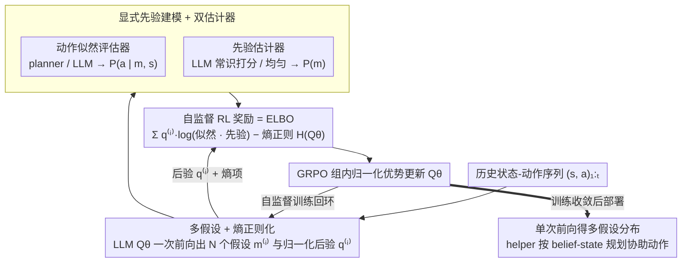

# MindZero: Learning Online Mental Reasoning with Zero Annotations

**会议**: ICML2026  
**arXiv**: [2606.00240](https://arxiv.org/abs/2606.00240)  
**代码**: https://scai.cs.jhu.edu/MindZero  
**领域**: 强化学习 / Theory of Mind / 多模态 LLM 后训练  
**关键词**: 心智推理, GRPO, 自监督 RL, 变分推断, 主动协助

## 一句话总结
MindZero 把贝叶斯逆向规划改写成一个对多模态 LLM 的「自监督 RL」目标——奖励模型生成的心智假设使观察到的人类动作似然最大，再用 GRPO 训练，使小模型在不需要任何心智标注的前提下实现单次前向、快速且鲁棒的在线心智推理。

## 研究背景与动机

**领域现状**：要让 AI 在真实环境里主动协助人，必须有强 Theory of Mind (ToM)——从行为推目标 / 信念。当前路线分三块：(i) 提示工程式 LLM 直接答题；(ii) 模型驱动的贝叶斯逆向规划 (BIP) 显式枚举假设；(iii) 监督学习直接拟合标注。

**现有痛点**：(1) 提示式方法在长上下文和递归推理上系统性翻车；(2) BIP 类方法（如 AutoToM、ThoughtTracing）每步都要在大假设空间里搜索 + 调用 LLM 评估，单次推理动辄数百 TFLOPs，无法实时；(3) 监督学习要在真实家居/网页环境里拿心智标注几乎不可能，规模化无望。

**核心矛盾**：模型驱动的 BIP 鲁棒但慢，LLM 单次前向快但不靠谱；而离线监督所需的「ground-truth 心智状态」在开放场景根本无法获取。这就要求一种新范式：训练阶段保留 BIP 的「用动作似然检验心智假设」的演绎结构，部署阶段把它压缩成 LLM 的单次前向。

**本文目标**：(i) 不靠任何心智标签训练小型多模态 LLM 完成在线、不确定性感知的心智推理；(ii) 让训练后的模型在主动协助任务中既准确又能实时响应。

**切入角度**：BIP 的 ELBO 形式 $\mathbb{E}_{Q_\theta}[\log P(a|m,s) P(m)] + H(Q_\theta)$ 天然只依赖「行为—状态—假设」三元组的似然，不依赖真值 $m^\star$。把这一项当成 RL 奖励，让 LLM 直接通过 GRPO 「内化」BIP 的演绎结构即可。

**核心 idea**：用「解释观察到的人类动作」当 self-supervised 奖励，把贝叶斯逆向规划蒸馏进 LLM 的策略分布里。

## 方法详解

### 整体框架

MindZero 训练一个多模态 LLM $Q_\theta(\cdot \mid s_{1:t}, a_{1:t})$，给定历史状态-动作序列，一次性输出 $N$ 个心智假设 $\mathcal{M}_t = \{m_t^{(1)}, \dots, m_t^{(N)}\}$ 及其归一化后验 $\mathcal{Q}_t = \{q_t^{(1)}, \dots, q_t^{(N)}\}$（$\sum q^{(i)} = 1$）。一个外部「动作似然评估器」（GridWorld 用模型驱动 planner，家居域用 LLM）给出 $P(a_{1:t} \mid m_t^{(i)}, s_{1:t})$，另一个 LLM（或均匀分布）给出先验 $P(m_t^{(i)})$，按公式合成 reward 后扔给 GRPO 更新模型。部署时模型在每个时间步做一次前向就拿到多假设分布，下游 helper 直接用 $P(a^A_t | s_{1:t}, a_{1:t}) = \sum_{m_t} P(a^A_t | s_t, m_t) P(m_t | s_{1:t}, a_{1:t})$ 规划协助动作。整套流程是一个自监督训练回环：模型出假设 → 两个估计器评分 → 合成 ELBO 奖励 → GRPO 更新模型，下面三个关键设计正对应回环里的三个贡献环节。

### 关键设计

**1. 自监督 RL 奖励 = ELBO：零心智标注下也能给 LLM 一个学习信号**

心智推理最大的障碍是开放场景里根本拿不到 ground-truth 心智状态 $m^\star$，监督学习无从下手。MindZero 的破法是把 ToM 当变分推断 $Q_\theta\approx P(m|s,a)$，最大化只依赖"行为—状态—假设"三元组、不依赖真值的 ELBO

$$\mathcal{J}(\theta) = \mathbb{E}_{Q_\theta}\big[\log\big(P(a_{1:t}|m_t,s_{1:t})\cdot P(m_t)\big)\big] + H(Q_\theta).$$

落到 $N$ 个采样假设上就是 $R(\mathcal{M}_t,\mathcal{Q}_t)=\sum_i q_t^{(i)}\log[P(a_{1:t}|m_t^{(i)},s_{1:t})P(m_t^{(i)})] - \sum_i q_t^{(i)}\log q_t^{(i)}$，再用 GRPO 在 group 内做相对优势更新、免去 critic。这一步的巧妙在于：传统 next-token 预测是"正向"拟合 $a|s$，而心智推理必须做"反向"推断 $m|s,a$，二者训练目标完全不同——把 ELBO 写成奖励就把反向推断接进了 RL 后训练管线，且天然不需要 $m^\star$，等于让 LLM 通过 GRPO 直接"内化"贝叶斯逆向规划的演绎结构。

**2. 多假设 + 熵正则化：在证据不足时别急着 commit 到一个错误目标**

早期 BIP 之所以鲁棒，本质是它显式追踪多个假设的后验分布；单点预测在 GridWorld 这种早期完全模糊的任务里会让 helper 在错误方向上提前出手、反而拖慢人类。MindZero 因此在奖励里强制模型一次输出 $N$ 个假设和归一化后验 $\{q_t^{(i)}\}$，并用熵项 $H(Q_\theta)=-\sum_i q_t^{(i)}\log q_t^{(i)}$ 直接惩罚"单点 collapse"。这样下游 helper 面对模糊行为时可以按 $P(a^A|m)\cdot q(m)$ 加权选动作，等观察到更多动作再让某个假设的后验显著上升。消融印证了这层设计的分量——去掉多假设掉 8.8% speedup，去掉熵正则掉 13.9%，熵项是防 collapse 最关键的开关。

**3. 显式先验建模 + 双估计器：堵住 reward hacking 并让框架可跨域迁移**

如果奖励只有似然项，模型会把目标写得极宽（如"拿桌上所有东西"），让任何行为都"合理"、靠 reward hacking 拿满分。MindZero 用 LLM 当先验估计器对每个候选目标的"常识合理性"打 log-prior 分（"把苹果放进洗碗机"会被打极低分），把这条捷径堵死。似然项 $P(a_{1:t}|m_t,s_{1:t})$ 则用领域适配的估计器提供——GridWorld 用 model-based planner（按规划器算最优策略下的动作概率），家居域复用同一个预训练 LLM——两者乘进 ELBO 奖励的 $\log$ 内。把先验和似然解耦成两个估计器，还让框架能低成本迁移到新领域，只需更换 planner 或 prompt。

### 损失函数 / 训练策略

奖励 $R$ 按上式计算，用 GRPO 在 group 内归一化优势后更新 $Q_\theta$，不需要价值网络。Llama-3.2-3B 等不能稳定吐出指定格式的小模型先用 Llama-3.1-8B 自采样数据做 SFT 暖身（仅学格式，不用真值），再进入 RL；这部分是 MindZero 在 3B 模型上提升受限的主要原因。

## 实验关键数据

### 主实验

四个评测：GridWorld QA、GridWorld 主动协助、家居 QA (MMToM-QA)、家居主动协助 (O-WAH)。Speedup 指标衡量 helper 相对「人类独自完成」的提速比。

| 场景 | 基线（同骨干）| MindZero (本文) | 备注 |
|------|----------------|------------------|------|
| GridWorld 主动协助 (Qwen3-VL-4B) | 1.4% speedup | 23.0% speedup | 同 backbone，提升一个数量级 |
| GridWorld 主动协助 (Qwen3-VL-8B) | -0.1% speedup | 24.5% speedup | 8B 基模反而是负 speedup（指令不稳） |
| 家居主动协助 (Qwen3-4B) | 2.3% speedup | 19.1% speedup | 超过 GPT-5.2 的 9.4% 与 Gemini-3-Flash 的 17.7% |
| 家居主动协助 (Llama-3.1-8B) | 1.7% speedup | 17.4% speedup | 用约 1/2 算力胜过 Gemini-3-Flash |
| QA 准确率 (avg.) | 基模 | 2.1–2.5× | MindZero 相对同骨干基模的准确率倍数 |

### 消融实验（Qwen3-4B / 家居主动协助）

| 配置 | Speedup ↑ | TFLOPs ↓ | 说明 |
|------|------------|------------|------|
| MindZero (Full) | 19.1% | 201.2 | 三项设计齐备 |
| w/o 显式先验 | 17.0% | 200.5 | 出现 reward hacking 倾向 |
| w/o 多假设 | 10.3% | 132.6 | 单点预测，过早 commit |
| w/o 熵正则 | 5.2% | 245.1 | 模式坍塌，token 反而变多但表现最差 |

### 关键发现

- **小模型 + MindZero ≥ 大模型 zero-shot**：4B 的 Qwen3-4B 经 MindZero 训练后在家居协助上 19.1% speedup，超过 235B 的 Qwen3-235B-A22B (12.3%) 和 GPT-5.2 (9.4%)；与 Gemini-3-Flash (17.7%) 持平，但算力只有后者的零头。
- **GridWorld 上大模型几乎全 0**：Qwen3-VL-8B、235B、GPT-5.2、Gemini-3-Flash 在 GridWorld 主动协助里 speedup 都 ≤ 1%，因为它们的目标预测每步都在跳，agent 动作来回摆，干脆抓不起方块——MindZero 24.5% 的 speedup 反映了「在线推理稳定性」远比「单步推理质量」更重要。
- **熵正则 > 多假设 > 先验**：从消融的掉点幅度看，防 collapse 的熵项是 MindZero 真正的灵魂，先验项更多是把 reward hacking 堵住的「保险丝」。
- **人类实验交叉验证**：12 名 JHU 受试者使用 MindZero (Qwen3-4B) 助手获得 19.7% 实际 speedup，与 Gemini-3-Flash 的 23.4% 统计上无显著差异 ($p=0.24$)。

## 亮点与洞察

- **把 BIP 重写成 RL 奖励**：核心动作只是「把变分 ELBO 当 reward 喂给 GRPO」，但这一改写让贝叶斯逆向规划第一次能在不需要任何标注的前提下被 LLM「内化」成单次前向，是该领域期待已久的 missing link。
- **「显式假设 + 后验」格式即贡献**：很多用 LLM 做 ToM 的工作让模型隐式做推理，MindZero 强制 schema 输出 $N$ 个 $(m^{(i)}, q^{(i)})$，这让熵正则和多假设防 collapse 都有了直接作用面，也让下游 helper 能做真正的 belief-state planning。
- **可迁移 trick**：「ELBO-as-reward + GRPO」这一范式可以原样搬到其他需要做反向推断的 LLM 后训练任务上，比如代码 bug 反推、对话用户意图推断、机器人故障诊断——只要能写出 $P(\text{evidence}|\text{hypothesis})$ 就能复用。

## 局限与展望

- **未建模递归推理**：现框架只做一阶 ToM（推单个用户的心智），不能推「A 觉得 B 觉得 ...」的高阶心智，多 agent 协作里会受限。
- **输入长度随时间步线性增长**：每一步都要拼 $s_{1:t}, a_{1:t}$ 进 prompt，长视野任务下 token 数会撑爆 context；作者承认这是未来重点改进方向。
- **依赖外部似然评估器**：GridWorld 上 model-based planner 在小图里可以暴力枚举，家居域用 LLM 估似然也不便宜；若评估器本身有偏（如 LLM 不熟某家居物品），整个 RL 会被带歪。Llama-3.2-3B 上的格式 SFT 暖身把低质量分布也一并记住，是个未被解决的「冷启动 + bias」难题。

## 相关工作与启发

- **vs BIP / AutoToM / ThoughtTracing**：BIP 类方法每步显式枚举假设空间 + 多次调用 LLM 评估，鲁棒但慢；MindZero 把这套演绎结构蒸馏进 LLM 权重，部署时一次前向解决，速度提升一个数量级以上。
- **vs 监督学习 ToM (Rabinowitz 2018 等)**：他们需要心智真值标签，只能在受控环境里训；MindZero 把「行为本身」当监督信号，从根上解放数据收集。
- **vs DeepSeek-R1 / GRPO 在数学/代码上的应用**：同样用 GRPO 做后训练，但 MindZero 的奖励不是「正确答案匹配」，而是「假设解释证据的似然」，把 RL 后训练首次系统地推进到「反向推断」任务族。

## 评分
- 新颖性: ⭐⭐⭐⭐⭐ 把 BIP 重写成 self-supervised RL 奖励是个简洁但关键的范式转换。
- 实验充分度: ⭐⭐⭐⭐ 四个评测 + 两个骨干 + 三项消融 + 12 人人类实验，覆盖到位；缺真实开放域大规模评测与高阶心智。
- 写作质量: ⭐⭐⭐⭐ 问题定义、奖励推导与实验设计层次清晰；prior/likelihood 估计器的选型理由可以更细。
- 价值: ⭐⭐⭐⭐⭐ 让 4B 小模型在主动协助上摸到 Gemini-3-Flash 的水平，给开源助手代理 ToM 这一刚需场景画了张可落地的蓝图。

<!-- RELATED:START -->

## 相关论文

- [\[ICML 2026\] Unlocking Zero-Shot Geospatial Reasoning via Indirect Rewards](unlocking_zero-shot_geospatial_reasoning_via_indirect_rewards.md)
- [\[ICLR 2026\] REA-RL: Reflection-Aware Online Reinforcement Learning for Efficient Reasoning](../../ICLR2026/reinforcement_learning/rea-rl_reflection-aware_online_reinforcement_learning_for_efficient_reasoning.md)
- [\[ICLR 2026\] SPIRAL: Self-Play on Zero-Sum Games Incentivizes Reasoning via Multi-Agent Multi-Turn Reinforcement Learning](../../ICLR2026/reinforcement_learning/spiral_self-play_on_zero-sum_games_incentivizes_reasoning_via_multi-agent_multi-.md)
- [\[ICML 2026\] Bilevel Optimization over Saddle Points of Zero-Sum Markov Games](bilevel_optimization_over_saddle_points_of_zero-sum_markov_games.md)
- [\[ICLR 2026\] LongWriter-Zero: Mastering Ultra-Long Text Generation via Reinforcement Learning](../../ICLR2026/reinforcement_learning/longwriter-zero_mastering_ultra-long_text_generation_via_reinforcement_learning.md)

<!-- RELATED:END -->
