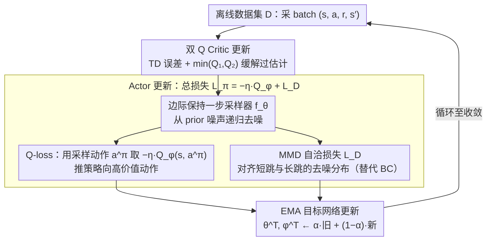

# MoMa QL: 用矩匹配加速扩散/流匹配策略的离线 + 离线-在线 RL

**会议**: ICML 2026  
**arXiv**: [2605.29033](https://arxiv.org/abs/2605.29033)  
**代码**: 暂未公开  
**领域**: 强化学习 / 离线 RL / 扩散策略  
**关键词**: 离线 RL, 扩散策略, 流匹配, 最大平均差异, 随机插值, 一致性模型

## 一句话总结
MoMa QL 用 Maximum Mean Discrepancy 替代标准 BC 损失，把扩散/流匹配策略的多步采样压缩为单步或少步的"边际保持插值"采样器，在 D4RL 上 Gym 平均归一化分 95.5 全面领先 Diffusion-QL（87.9），同时因为采样快得多，offline-to-online 微调时也比一致性 AC、Diffusion-QL 提升更大。

## 研究背景与动机

**领域现状**：离线 RL 要从静态数据集里学一个最优策略，难在 OOD 动作上价值估计不可靠 + 行为分布越来越复杂多模态。GMM、VAE 等表达力有限，于是扩散/流匹配类生成式策略（Diffusion-QL、IDQL、FQL）成为主流，能把任意多模态行为表达得很到位。

**现有痛点**：扩散/流匹配策略的采样是迭代式的——一次推理要跑十几到上百步去噪。对离线 RL 的 actor-critic 训练，每一次 actor 更新都要在线采样动作输入 critic，迭代采样让训练成本爆炸；更要命的是 offline-to-online 阶段在线 rollout 几乎要逐时间步采样，扩散策略在真实环境里被采样延迟卡得动弹不得。

**核心矛盾**：表达力（多步迭代）和计算效率（单步采样）天然矛盾。一致性模型给出一种思路（学一个"任意时刻 → 干净样本"的映射），但只是 distillation，难以在 actor-critic 框架里联合 critic 信号学习。

**本文目标**：找一个采样器 $p^\theta_{s|t}(\mathbf{x}|\mathbf{x}_t)$，既能从扩散轨迹任意时刻 $t$ 一步跳到任意更早时刻 $s$，又能直接被 critic 的 Q 信号优化，并且训练稳定。

**切入角度**：把"采样器要逼近的目标分布"和"扩散过程的中间分布"用 MMD 对齐——MMD 是一种基于 RKHS 的分布距离，特征空间里隐式带所有阶矩，比单阶矩约束（如 BC 的 log-likelihood）更稳，又比 KL/JS 等似然类约束对生成模型友好。

**核心 idea**：把 BRAC 框架里的 BC 损失换成"两个不同中间步 $r<s<t$ 出来的边际分布 $p^{\theta^-}_{s|r}$ 与 $p^\theta_{s|t}$ 之间的 MMD"，让策略学会从任意噪声水平一步去噪到任意更干净的水平，配合 Q 损失同步训练 critic，整个过程像一致性训练 + actor-critic 的合体。

## 方法详解

### 整体框架

构建在 BRAC 之上的双 Q-learning：critic 用经典 TD($\lambda=0$) + double Q，actor 包含两个组件——(1) Q-loss：用学好的采样器从 prior 出发递归生成动作 $\mathbf{a}^\pi$，喂进 critic 取 $-\eta Q$；(2) BC-loss：用 MMD 一致性约束让采样器在不同中间时间步上自洽。采样阶段直接套 DDIM 风格递归：从 $\mathbf{a}_N \sim \mathcal{N}(0,\sigma_d^2 I)$ 出发，每步调用学到的 $f_\theta(t_{i-1}, t_i, \mathbf{a}_{t_i})$ 跳到下一个时间步。整个训练是「采 batch → critic 更新 → actor 更新（双损失共享同一个采样器）→ EMA 目标更新」的循环，少步采样让这个循环跑得起来，也让在线 rollout 不被采样延迟卡死。

### 关键设计

**1. 边际保持随机插值 + 跨时间一步采样器：把扩散从"逐步去噪"改成"任意 $t$ 一步跳到任意更早 $s$"**

传统扩散/流匹配只学 $t\to t-1$ 的单步映射，多步采样代价高，offline-to-online 阶段几乎逐时间步采样会被延迟卡死。MoMa QL 基于 stochastic interpolants 定义边际插值 $q_t(\mathbf{x}_t)=\iint q_t(\mathbf{x}_t|\mathbf{x},\boldsymbol{\varepsilon})q(\mathbf{x})p(\boldsymbol{\varepsilon})d\mathbf{x}d\boldsymbol{\varepsilon}$ 和条件 $q_{s|t}(\mathbf{x}_s|\mathbf{x},\mathbf{x}_t)=\mathcal{N}(I_{s|t}(\mathbf{x},\mathbf{x}_t),\gamma^2_{s|t}I)$，并要求"边际保持"——任意 $s\le t$ 都有 $q_s=\iint q_{s|t}q_t(\mathbf{x}|\mathbf{x}_t)q_t(\mathbf{x}_t)d\mathbf{x}_t d\mathbf{x}$。模型学一个隐式采样器 $p^\theta_{s|t}(\mathbf{x}|\mathbf{x}_t)=\delta(\mathbf{x}-G_\theta(\mathbf{x}_t,s,t))$：给定 $\mathbf{x}_t$ 直接预测一个干净样本 $\tilde{\mathbf{x}}$，再走 DDIM 插值得到 $\tilde{\mathbf{x}}_s$。这等价于学一个一致性模型，但放进 stochastic interpolants 的统一视角后，单步和多步两种推理模式都自然支持——离线训练可走多步保表达力，在线 rollout 切单步加速。

**2. MMD 自洽损失：用最大平均差异替掉 BC 的似然约束，给采样器一个稳定且高阶矩对齐的信号**

BC 用高斯 log-likelihood 只匹配一阶矩，刻画不了离线数据里的多模态行为；而直接匹配 $q_s(\mathbf{x}_s)$ 和 $p^\theta_{s|t}(\mathbf{x}_s)$ 又不稳——$t$ 和 $s$ 相隔太远时 $q_t$ 自身和 $q_s$ 差异大、难估计。作者借鉴 consistency training 引入中间时间 $r$（$s<r<t$），让损失自洽地拉近"短跳"和"长跳"：

$$\mathcal{L}_D(\theta)=\mathbb{E}_{s,r,t}\big[\mathrm{MMD}^2(p^{\theta^-}_{s|r}(\mathbf{x}_s),\,p^\theta_{s|t}(\mathbf{x}_s))\big].$$

用 RBF 核 $k(x,y)=e^{-\|x-y\|^2/(2\sigma^2)}$（characteristic，隐式带所有阶矩）配 Gretton 等的 unbiased estimator 计算，不需要密度估计。这样选有三重好处：高阶矩匹配能精确刻画多模态行为，sample-based 性质天然兼容扩散这类隐式生成模型，而 self-consistency 形式又和一致性模型同源——论文在 Appendix 证明 CM 正是本框架在 $r\to s$ 极限下的特例。

**3. 一致性诱导 + 双 Q 缓解过估计：把"短跳一致"和"Q 估计稳定"两件互相影响的事捆在一起训**

actor 每次更新都要采动作 $\mathbf{a}^\pi$ 喂 critic，若采样要 100 步则单次更新就是 100 次网络前向，本框架靠少步采样把这开销降一两个数量级。critic 用经典 TD3+BC 的双 Q $\mathcal{L}(\phi)=\mathbb{E}[(r+\gamma\min_{i\in\{1,2\}}Q_{\phi^T_i}(\mathbf{s}',\mathbf{a}')-Q_{\phi_i}(\mathbf{s},\mathbf{a}))^2]$ 缓解过估计，其中 $\mathbf{a}'\sim\pi_{\theta^T}(\cdot|\mathbf{s}')$ 由 actor 推理算法采样；actor 的 target $\theta^-$ 是 EMA stop-gradient 的策略，给 MMD 一致性约束提供稳定参考，目标网络按 $\theta^T\leftarrow\alpha\theta^T+(1-\alpha)\theta$ 更新。少步采样让"actor 更新 + critic 更新"能在合理时间内收敛，这正是扩散策略能跑进 offline-to-online 微调的关键。

### 损失函数 / 训练策略

actor 总损失 $\mathcal{L}_\pi(\theta) = -\eta \mathbb{E}[Q_\phi(\mathbf{s}, \mathbf{a}^\pi)] + \mathcal{L}_D(\theta)$，$\mathbf{a}^\pi$ 由算法 2 递归调 $f_\theta(t_{i-1}, t_i, \mathbf{a}_{t_i})$ 生成。$\eta$ 控制 Q 信号 vs MMD 一致性的权衡。critic 是标准双 Q TD。整体训练循环 critic 更新 → actor 更新 → EMA 目标更新，与 BRAC 同步。

## 实验关键数据

### 主实验：D4RL 任务对比

| 任务套件 | BC | Diffusion-BC | Consistency-BC | CQL | IQL | Diffusion-QL | Consistency-AC | **MoMa QL** |
|---------|-----|--------------|-----------------|-----|-----|--------------|-----------------|-------------|
| Gym BC 平均（9 任务） | 51.9 | 76.3 | 69.7 | — | — | — | — | **89.8** |
| Gym 离线 RL（9 任务） | — | — | — | 77.6 | 77.0 | 87.9 | 85.1 | **95.5** |
| Adroit（12 任务） | 48.3 | — | — | — | 53.4 | — | 42.9 | **56.7** |
| Kitchen（3 任务） | — | — | — | 48.2 | 53.3 | 69.0 | 45.3 | **73.1** |

Gym BC 上比 Diffusion-BC（76.3）提升 1.18×，比 vanilla BC（51.9）提升 1.73×；Gym 离线 RL 上比 Diffusion-QL（87.9）提升 1.09×，且在 HalfCheetah 单项领先 14%、Walker2D 领先 8.5%。Adroit 上和 ReBRAC（55.4）持平略胜，door 单项第一（38.5）。

### 离线-在线微调实验（Gym）

| 任务 | 离线分 | 在线分 | 提升 |
|------|-------|-------|------|
| HalfCheetah-m | 72.6 | 83.1 | +10.5 |
| Hopper-m | 104.2 | 104.3 | +0.1 |
| Walker2d-m | 95.6 | 99.1 | +3.5 |
| HalfCheetah-mr | 63.3 | 80.9 | +17.6 |

medium-replay 任务上提升最大（HalfCheetah-mr +28% 相对），印证"采样快 → 在线交互效率高 → 微调更充分"的因果链。

### 关键发现

- **多模态行为捕捉**：在 medium-replay（行为最多模态）数据上 MoMa QL 相对优势最大，walker2d-mr 比最强基线领先 1.26×，halfcheetah-m 领先 1.44×，验证了 MMD 高阶矩匹配对多模态分布的优势。
- **采样效率换在线能力**：Diffusion-QL 在 offline 阶段表现已经很强，但 online 微调因为采样慢经常出现性能退化；MoMa QL 单步采样让在线交互几乎和高斯策略一样快，于是 offline-to-online 能保持"持续上涨"。
- **hopper-me 上的反常**：MoMa QL 拿到 67.9 而 BC 类基线在 100+，说明在已经接近最优行为的数据上，过强的高阶矩匹配反而把 MMD 自洽约束变成噪声拉拽；这是 actor 信号设计的取舍点。
- **判别 vs 生成**：Adroit 上 ReBRAC 在专家数据集略强，但 MoMa QL 在数据质量更杂的设置上更稳，说明它的优势更在"覆盖多模态行为分布"而非"单纯模仿专家"。

## 亮点与洞察

- **MMD 替 BC 是"工具+对象"双向匹配**：MMD 的高阶矩属性恰好对应离线 RL 的多模态行为分布需求，而 sample-based 性质又对应扩散类隐式生成模型；这种"工具天然贴合对象"的匹配让方法的 selling point 不止是性能数字，也是范式上的对应。
- **一致性训练 + actor-critic 的合体**：以前一致性模型主要做无监督加速采样，本文把它纳入 Q-learning 的训练循环，并证明 CM 是本框架的特例，给出了一条"加速生成式策略 = 一致性蒸馏 + RL 信号联合训练"的统一思路。
- **边际保持插值的灵活性**：在统一框架里支持单步/多步采样的切换——离线训练时可以走多步保证表达力，在线 rollout 时切到单步加速；这种"训练精准、推理快"的解耦对真实部署很友好。
- **稳定性来自核函数而非超参调优**：RBF 核的有界性 + MMD 的非负性让 actor 损失天然不会爆炸，相比 KL 类的正/负无穷数值问题更适合 RL 这种 reward 跨数量级波动的场景。

## 局限与展望

- **MMD 的核函数依赖**：实验主要用 RBF + 自适应 bandwidth，但核函数选择对 MMD 性能影响大，不同任务最优核可能不同；论文没有深入讨论核选择策略。
- **Q 信号与 MMD 的权衡难调**：超参 $\eta$ 控制 Q 主导还是 MMD 主导，appendix 显示对结果敏感；hopper-me 上的反常可能就是 $\eta$ 在专家数据上没有自适应缩放的副作用。
- **MMD 估计的方差**：sample-based MMD 在 batch 小的时候方差大，对大动作维度任务（如机器人）可能需要更大 batch 或更复杂的 unbiased 估计；论文实验集中在中等维度。
- **理论收敛是渐近的**：CM 是 $r \to s$ 极限下的特例这一结论在有限步长下还需要更精细的离散化误差分析。

## 相关工作与启发

- **vs Diffusion-QL / IDQL**：他们用完整多步扩散采样，表达力强但训练/在线代价高；本文用 MMD 一致性把采样压到单步或少步，性能反而更好。
- **vs Consistency-AC / FQL**：同样想加速生成式策略——CAC 用 CM distillation，FQL 用流匹配蒸馏，但都把"加速"和"RL 信号"分开；本文把两者放进一个 MMD 自洽损失里联合训练，训练效率和最终性能双优。
- **vs QGPO / EDP / QIPO**：能量引导扩散把 RL 目标当 reward weighting；本文走"显式匹配多步分布"路线，不依赖能量重要性采样，训练更稳定。
- **启发**：对任何需要"多步迭代生成 + 任务信号"的场景（机器人控制、文本生成强化学习、视觉 agent），都可以套这个"边际保持插值 + MMD 一致性 + 任务损失"的三段式。

## 评分

- 新颖性: ⭐⭐⭐⭐ 把 MMD/一致性训练/actor-critic 三件事用 stochastic interpolants 统一起来，是新颖的范式合成，CM 作为特例的证明也有理论贡献。
- 实验充分度: ⭐⭐⭐⭐ D4RL 三大套件 + offline/offline-to-online 全覆盖 + 多家强基线，少 ablation 在核函数和 $\eta$ 上略弱。
- 写作质量: ⭐⭐⭐⭐ 推导清晰，记号体系完整，唯算法 1 与算法 2 之间的"训练-推理"对应关系在主文里压得稍紧，需要看 appendix 才能完全 follow。
- 价值: ⭐⭐⭐⭐⭐ 对扩散类策略的部署痛点（在线 rollout 慢）给出实用解，性能在 D4RL 主榜上全面领先，且方法可迁移到其他生成式 RL 场景。

<!-- RELATED:START -->

## 相关论文

- [\[ICML 2026\] RL-SPH: Learning to Achieve Feasible Solutions for Integer Linear Programs](rl-sph_learning_to_achieve_feasible_solutions_for_integer_linear_programs.md)
- [\[ICML 2026\] MFPO: 用 Few-step MeanFlow Policy 把 MaxEnt RL 跑到接近 Gaussian policy 的速度](mean_flow_policy_optimization.md)
- [\[ICLR 2026\] Sample-efficient and Scalable Exploration in Continuous-Time RL](../../ICLR2026/reinforcement_learning/sample-efficient_and_scalable_exploration_in_continuous-time_rl.md)
- [\[AAAI 2026\] CHDP: Cooperative Hybrid Diffusion Policies for RL in Parametric Environments](../../AAAI2026/reinforcement_learning/chdp_cooperative_hybrid_diffusion_policies_for_reinforcement_learning_in_paramet.md)
- [\[ICLR 2026\] Transitive RL: Value Learning via Divide and Conquer](../../ICLR2026/reinforcement_learning/transitive_rl_value_learning_via_divide_and_conquer.md)

<!-- RELATED:END -->
