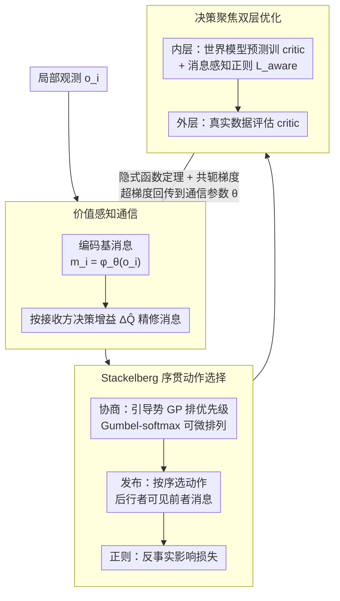

# Multi-Agent Decision-Focused Learning via Value-Aware Sequential Communication

**会议**: ICML 2026  
**arXiv**: [2604.08944](https://arxiv.org/abs/2604.08944)  
**代码**: 无  
**领域**: 强化学习 / 多智能体  
**关键词**: 多智能体通信, 决策聚焦学习, Stackelberg 序贯决策, 双层优化, QMIX

## 一句话总结
SeqComm-DFL 把"多智能体通信"作为预测器、把"联合策略选择"作为下游优化器，用价值感知的消息生成 + Stackelberg 序贯条件 + 隐式微分双层优化把通信学习直接对齐到团队回报，在医院调度和 SMAC 上取得 4-6 倍的累积奖励提升与 >13 个百分点的胜率提高。

## 研究背景与动机

**领域现状**：合作式多智能体强化学习（MARL）主流采用"集中训练、分散执行"范式，以 QMIX、MAPPO、MADDPG 为代表，通过价值分解或 actor-critic 缓解非平稳性与信用分配问题。学习通信方法（CommNet、DIAL、NDQ、SeqComm、MAIC 等）则通过让 agent 互相传消息进一步缓解部分可观测下的协调难题。

**现有痛点**：现有通信协议优化的目标基本是**代理目标**——重建准确率、互信息或简单的 token 预测，而不是真正影响下游决策质量的信息量。结果是带宽被浪费在"信息量大但和动作无关"的特征上，并和模型化 RL 里经典的"目标失配（objective mismatch）"问题如出一辙：世界模型为了拟合所有像素细节而牺牲了价值无关误差的优化。

**核心矛盾**：通信模块的优化信号（重建/互信息）与团队最终关心的目标（累积奖励）在梯度方向上是脱钩的，导致即便 agent 学会了"准确转述自己看到的东西"，也未必能让队友做出更好决策；同时多个 agent 并行选择动作天然存在协调多重均衡问题。

**本文目标**：(1) 让通信模块直接由"下游决策质量"反向监督；(2) 在并行决策的对称性下打破协调歧义；(3) 把决策聚焦学习（DFL）从单 agent + 外生不确定性扩展到多 agent + 内生不确定性（消息会反过来改变其他 agent 的策略）。

**切入角度**：作者把通信视作 Predict-and-Optimize 框架里的"预测器"，把多 agent 策略选择视作"优化器"，自然引出"通过最终任务损失反传到通信模块"的端到端范式；并借用 Stackerlberg leader-follower 结构来打破多智能体动作选择的对称性。

**核心 idea**：用"接收方 Q 值提升 $\Delta Q_j(m_i)$"代替"消息互信息"作为通信训练信号，并按 prosocial guidance potential 排序构建序贯条件决策，最后通过隐式函数定理把双层优化梯度回传到通信参数。

## 方法详解

### 整体框架
SeqComm-DFL 把 Dec-POMDP 下的协作问题切成三个相互耦合的模块：(1) **价值感知通信** —— 每个 agent 把局部观测 $o_i$ 编码成基消息 $m_i^{\text{base}}=\phi_\theta(o_i)$，再用 refinement 网络根据估计的接收方决策增益 $\Delta\hat Q_i$ 把消息精修；(2) **Stackelberg 序贯动作选择** —— 先用 guidance potential 给所有 agent 排优先级 $\pi=\text{argsort}(-\text{GP})$，按顺序逐个选动作 $a_{\pi_k}=\arg\max_a Q_{\pi_k}(o_{\pi_k}, M_{1:\pi_k-1}, a)$，让后行者可以看到前行者已经发出的消息；(3) **决策聚焦的世界模型双层优化** —— 内层用世界模型预测训练 critic，外层在真实环境数据上评估 critic 并通过隐式微分把梯度传回世界模型 + 通信模块。三者由"双层优化的超梯度回传到通信模块"闭合成一个端到端可训的环：通信不再对着重建误差学，而是被最终团队回报反向监督。

### 关键设计

**1. 价值感知消息生成：用"队友决策变好多少"取代"消息转述得多准"当训练信号**

传统通信协议优化的是重建误差或互信息，可一条消息哪怕把观测复述得再完美，只要这些细节改变不了队友的动作就毫无意义——带宽被白白花在"信息量大但和决策无关"的特征上。作者直接把决策价值量化为接收方决策增益 $\Delta Q_j(m_i) = \max_a Q_j(o_j, m_i, a) - \max_a Q_j(o_j, \emptyset, a)$，即"有这条消息"比"没消息"时 $j$ 的最优 Q 高多少，再把它取负当损失 $\mathcal{L}_{\text{VA}}(\theta) = -\frac{1}{B \cdot N(N-1)} \sum_b \sum_i \sum_{j\neq i} \Delta Q_j(m_i^{(b)})$，逼每条消息去最大化其它 agent 的最优 Q。训练初期 critic $Q_w$ 还不可靠，于是先用 Monte Carlo rollouts 估 $\Delta Q_j^{\text{MC}}$，再按 $\Delta\hat Q = (1-\beta_t)\Delta Q^{\text{MC}}+\beta_t \Delta Q_w$ 随 $\beta_t$ 退火平滑切到 critic 估计。这条 loss 并不是拍脑袋凑的：作者从 envelope theorem 证明在最优 critic 处，真任务损失对消息的梯度 $\propto -\sum_{j\neq i} \nabla_{m_i} Q_j$，方向恰好就是 $\Delta Q_j$——也就是说它是从 DFL 自然导出的对偶量，把"哪些信息值得通信"和"信息论上的多少 bit"彻底解耦。

**2. Stackelberg 序贯条件 + Guidance Potential 排序：让"谁先说"成为可学习问题，打破并行决策的协调歧义**

多个 agent 同时挑动作天然有相对过泛化和多重均衡问题——大家都在赌对方会怎么动，容易一起陷进次优均衡。作者改成三阶段的序贯协调。**协商阶段**先给每个 agent 算一个利他的引导势 $\text{GP}_i(s) = \mathbb{E}_{\mathbf{a}^*}[Q_{1:N}(s,\mathbf{a}^*|i^+) - Q_{1:N}(s,\mathbf{a}^*|i^-)]$，衡量"让该 agent 当 leader"对团队总收益的贡献，再用 Gumbel-softmax 把它变成可微的优先级排列 $\pi=\text{argsort}(-\text{GP})$。**发布阶段**按 $\pi$ 顺序逐个选动作 $a_{\pi_k}=\arg\max_a Q_{\pi_k}(o_{\pi_k}, M_{1:\pi_k-1}, a)$，后行者能看到所有更高优先级 agent 已经发出的消息。**正则阶段**再用反事实影响损失 $\mathcal{L}_{\text{inf}} = -\frac{1}{N(N-1)}\sum_i \sum_{j\neq i} D_{\text{KL}}[\pi_j(\cdot|m_i)\,\|\,\pi_j(\cdot|\emptyset)]$ 逼消息真的改变接收方策略，而不只是和它相关。和 SeqComm 用"我有多想行动"的意图排序不同，guidance potential 是利他的：理论上 $\text{GP}_i \propto \sum_{j\neq i} I(M_i; a_j^*|o_j)$，于是"手里握着协调关键私有信息"的 agent 自然被推到 leader 位，让队友基于真正有价值的先验决策，从而进入 Pareto 更优的 Stackelberg 均衡。

**3. 决策聚焦双层世界模型 + 隐式微分：让世界模型为"团队回报最高"而非"下一帧预测最准"而优化**

MARL 里世界模型和 critic 本身就是链式调用，是一个天然的双层结构。作者把它显式写成：外层最小化 $\mathcal{L}_{\text{true}}(w^*(\theta);\theta)$（用真实环境数据评估 critic），内层 $w^*(\theta)=\arg\min_w \mathcal{L}_{\text{model}}(w;\theta) + \lambda_{\text{aware}}\mathcal{L}_{\text{aware}}(w)$ 用模型预测训练 critic，并把通信和世界模型一起塞进同一个外层优化器。这里有个通信特有的失败模式——一旦 critic 学会完全无视消息 $M$，超梯度对通信参数就会消失（"内层冷漠"），所以加了 hinge 形式的消息感知正则 $\mathcal{L}_{\text{aware}}=\max(0, \epsilon_{\text{margin}} - |Q_w(s,a,M)-Q_w(s,a,\mathbf{0})|)$ 强制 critic 在含消息和零消息输入间留出 margin。求外层梯度时不对内层 $K_{\text{inner}}$ 步梯度下降做反传（会消失/爆炸），而是用隐式函数定理在内层不动点处展开

$$\frac{dw^*}{d\theta}=-[\nabla^2_{ww}\mathcal{L}_{\text{model}}]^{-1}\nabla^2_{\theta w}\mathcal{L}_{\text{model}},$$

其中逆 Hessian-向量积 $H^{-1}b$ 用共轭梯度近似 $(H+\lambda I)v^* = b$，每步只要两次 autodiff，复杂度可控。理论上 OMD 已证单 agent 下这种解耦能让 $\|Q^* - \hat Q_{\text{DFL}}\|_\infty \le \epsilon/(1-\gamma)$，比 MLE 的 $\epsilon_R/(1-\gamma)+\gamma\epsilon_P r_{\max}/2(1-\gamma)^2$ 更紧；本文把它扩展到带通信和 QMIX 分解的多 agent 场景，并补上 message apathy 正则这块短板。

### 损失函数 / 训练策略
总外层目标 $\theta \leftarrow \theta - \eta(\frac{d\mathcal{L}_{\text{true}}}{d\theta}+\lambda_{\text{VA}}\nabla\mathcal{L}_{\text{VA}}+\lambda_{\text{inf}}\nabla\mathcal{L}_{\text{inf}})$；内层 $K_{\text{inner}}$ 步 SGD 训练 $w$；目标网络用 Polyak EMA $\bar w \leftarrow \tau_{\text{ema}}\bar w + (1-\tau_{\text{ema}})w$；warmup 阶段 $\beta_t = \min(t/T_w, 1)$ 让 MC-based $\Delta Q$ 平滑过渡到 critic-based；Gumbel-softmax 给优先级排序提供可微探索。理论收敛 $\frac{1}{T}\sum_t \mathbb{E}\|\nabla_\theta \mathcal{L}_{\text{true}}\|^2 \le O(1/\sqrt T)$。

## 实验关键数据

### 主实验
两套环境：自建的医院多专科协作（$N=3$ 专科医生、$\mathcal P=100$ 患者、specialty-gated 隐藏风险），以及 SMAC 经典基准。

| 环境 | 指标 | SeqComm-DFL | 之前 SOTA | 提升 |
|------|------|-------------|-----------|------|
| 医院 Dec-POMDP | 累积奖励 | 4-6× baseline | QMIX/MAPPO/SeqComm | 数倍提升 |
| SMAC | 胜率 | +13pp | QMIX/MAIC | 显著超越 |
| 医院 | 通信价值 $\Delta V$ | 与理论下界 $\frac{L_R}{1-\gamma}\sum\sqrt{2\ln 2\cdot I_i\cdot\text{Var}(a_i^*)}$ 一致 | — | 验证 Thm 5.1 |

### 消融实验

| 配置 | 关键效应 | 说明 |
|------|---------|------|
| Full SeqComm-DFL | 最优 | 全部模块开启 |
| w/o $\mathcal{L}_{\text{VA}}$ | 通信退化为重建 | 消息不再针对决策优化 |
| w/o Stackelberg ordering | 协调多均衡 | 同时决策时陷入次优均衡 |
| w/o $\mathcal{L}_{\text{aware}}$ | 内层冷漠 | critic 忽略消息，超梯度消失 |
| w/o IFT / 直接 BPTT 内层 | 训练发散 | 反传 $K_{\text{inner}}$ 步梯度消失 |

### 关键发现
- 价值感知损失 + message-aware 正则是端到端可训的两条必要条件，缺一会让通信被环境噪声淹没。
- Guidance potential 排序在信息缺口 $\mathcal I_i$ 大的场景下能让"知道最多"的 agent 自然成为 leader，否则等价于 SeqComm 退化为意图排序。
- 收敛率 $O(1/\sqrt T)$ 与隐式微分 + CG 的偏差 $\epsilon_{\text{bias}}=\epsilon_{\text{inner}}+\epsilon_{\text{CG}}$ 紧密相关，CG 迭代数过少会让外层梯度有偏。

## 亮点与洞察
- **把通信变成 DFL 的"预测器"**：作者第一次把多智能体通信明确放进 predict-and-optimize 框架，并用 envelope theorem 证明 $\Delta Q$ 不是启发式而是真损失梯度的对偶量，这种"先理论对偶再写工程 loss"的路径非常优雅。
- **message apathy 正则**：bilevel + 通信特有的失败模式是 critic 学会无视消息，作者用 hinge 形式强制 $Q$ 在 $M$ 和 $\mathbf 0$ 下有 margin，思路可直接迁移到任何"辅助输入容易被忽略"的场景（例如条件扩散里的弱条件、RAG 里的检索结果）。
- **Stackelberg + prosocial 排序**：把"谁先说"作为可学习问题，且优先级排序基于团队收益而非个体偏好，这是和 SeqComm 最本质的差异；Gumbel-softmax 让排列可微，工程上很轻量。

## 局限与展望
- 隐式微分 + CG 在高维 $w$ 下迭代数和阻尼系数 $\lambda$ 都很敏感，论文给的复杂度分析依赖于 $H$ 良性条件，连续控制场景未必满足。
- 序贯决策的 leader-follower 在 agent 数 $N$ 较大时会带来执行延迟，论文实验只到 SMAC 中等规模，对 swarm 级别可扩展性没回答。
- 医院 Dec-POMDP 是作者自建环境，specialty gating 几乎是为方法量身定做的"信息缺口"情形，跨领域真实评测（如交通灯、多车协调）缺失。
- 通信内容仍是连续向量 $m\in\mathbb R^{d_m}$，离散符号 + 带宽预算的实际通信约束没被考虑。

## 相关工作与启发
- **vs SeqComm (Ding 2023)**：同样使用序贯通信，但 SeqComm 用 intention value（"谁最想行动"）排序，本文用 prosocial guidance potential（"谁最能帮队友"）并端到端优化消息内容，把局部贪心扩展为团队最优。
- **vs MAIC (Yuan 2022)**：MAIC 把消息当作 Q 值的 incentive，本文吸收了这个思想做 $\mathcal{L}_{\text{aware}}$，但把 incentive 进一步绑定到决策聚焦的 bilevel 上。
- **vs OMD (Nikishin 2022)**：OMD 解决单 agent 模型化 RL 的 objective mismatch，本文是其多 agent + 内生不确定性 + 通信的扩展，并加入 QMIX 分解使其能 scale。
- **vs DFL (Donti 2017 / Elmachtoub-Grigas)**：经典 DFL 假设预测不会影响下游优化的 ground truth，本文是首个明确处理 endogenous uncertainty（消息会改变其他 agent 的动作分布）的 DFL 工作。

## 评分
- 新颖性: ⭐⭐⭐⭐⭐ 首次把 DFL 扩展到多 agent + 内生不确定 + 通信，三个领域的统一非常漂亮。
- 实验充分度: ⭐⭐⭐⭐ SMAC + 自建医院环境覆盖了对称与非对称信息两类情形，但缺乏更大规模 swarm 与真实工业场景。
- 写作质量: ⭐⭐⭐⭐⭐ 概念 → 理论 → 算法 → 实验的脉络极清晰，定理与工程 loss 一一对应。
- 价值: ⭐⭐⭐⭐ 对学习通信、模型化 MARL、DFL 三个社区都有启发，但隐式微分门槛偏高，工程复现需要不少 trick。

<!-- RELATED:START -->

## 相关论文

- [\[ICML 2026\] LLM-Guided Communication for Cooperative Multi-Agent Reinforcement Learning](llm-guided_communication_for_cooperative_multi-agent_reinforcement_learning.md)
- [\[ICML 2025\] Counterfactual Effect Decomposition in Multi-Agent Sequential Decision Making](../../ICML2025/reinforcement_learning/counterfactual_effect_decomposition_in_multi-agent_sequential_decision_making.md)
- [\[ICML 2026\] Vulnerable Agent Identification in Large-Scale Multi-Agent Reinforcement Learning](vulnerable_agent_identification_in_large-scale_multi-agent_reinforcement_learnin.md)
- [\[ICLR 2026\] Continuous-Time Value Iteration for Multi-Agent Reinforcement Learning](../../ICLR2026/reinforcement_learning/continuous-time_value_iteration_for_multi-agent_reinforcement_learning.md)
- [\[ICML 2026\] Learning Query-Aware Budget-Tier Routing for Runtime Agent Memory](learning_query-aware_budget-tier_routing_for_runtime_agent_memory.md)

<!-- RELATED:END -->
