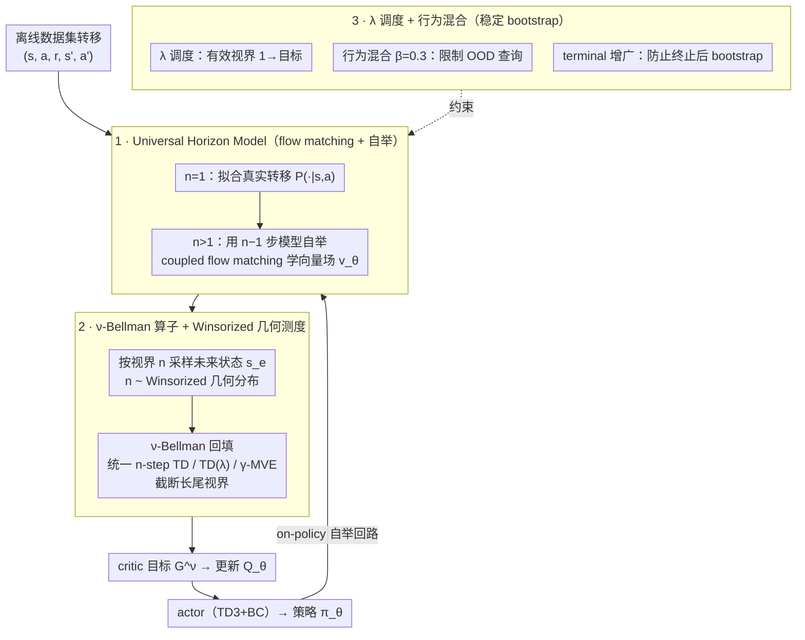

# Offline Reinforcement Learning with Universal Horizon Models

**会议**: ICML 2026  
**arXiv**: [2605.15603](https://arxiv.org/abs/2605.15603)  
**代码**: https://rllab-snu.github.io/projects/UHM/  
**领域**: 离线强化学习 / 模型基RL / 价值学习 / 世界模型  
**关键词**: universal horizon model, geometric horizon model, n-step TD, winsorized geometric, flow matching

## 一句话总结
作者把"几何视界模型 (GHM) 只能采样一个固定折扣分布"这个限制打开，提出能在任意视界 $n$ 上直接采样未来状态的 universal horizon model (UHM)，再用 Winsorized 几何分布把过长视界截断，在 OGBench 100 个任务上比最强基线平均成功率提升约 14%。

## 研究背景与动机

**领域现状**：离线强化学习要从静态数据集里学策略，主流靠 TD 学习；近年发现 $n$-step TD 在长视界任务上能显著降偏，于是 Park 等人的 $n$-step 系列、action chunking、hierarchical policy 都在朝"压缩有效视界"努力。同时模型基离线 RL 用动力学模型生成合成 on-policy 轨迹做 value expansion，理论上能解决"数据外"问题。

**现有痛点**：(1) 单步动力学模型在 offline 下会因反复在自己生成的状态上推断而 compounding error 爆炸；(2) 几何视界模型 GHM 虽然能"一次跳到折扣未来"绕开重复推断，却把所有未来都压成同一个几何分布 $\text{Geom}(1-\tilde\gamma)$，长尾部分极难学准；(3) GHM 也无法告诉你"采的这个状态到底是几步之后"，因此完全无法做 $n$-step TD 或 TD($\lambda$)。

**核心矛盾**：要消除 compounding error 就得"直接跳"，但"直接跳到一个被几何分布固定加权的未来"会丢掉视界粒度；要做 $n$-step TD 又得知道 $n$，二者在 GHM 框架下不可兼得。

**本文目标**：构造一个生成模型，既能"直接采样未来"避免反复推断，又能在采样时显式给定任意视界 $n$，并允许 $n$ 来自任意分布；并基于它给出一个真正可扩展、不会被长尾视界拖崩的 offline value learning 算法。

**切入角度**：作者从一个数学观察出发——GHM 是"$n\sim\text{Geom}(1-\tilde\gamma)$ 的未来分布混合"，单步模型是"$n\sim\delta(1)$"，二者其实是同一个 family $m^\pi(x|s,a,n)$ 在不同 $n$ 上的特例。

**核心 idea**：把 $m^\pi(x|s,a,n)=\Pr(s_n=x\mid s_0=s,a_0=a,\pi)$ 这个 $n$-step 转移测度本身作为生成模型直接学，然后用截断后的"Winsorized 几何分布"做视界采样——既保留 TD($\lambda$) 的形状，又给长尾设了硬上限。

## 方法详解

### 整体框架

UHM 是一个以 $(s,a,n)$ 为条件、用 flow matching 实现的生成模型，输出 $n$ 步后状态的分布 $m^\pi(\cdot|s,a,n)$。训练时通过 bootstrapping 递归学习：1 步对应数据集真实转移 $\mathcal{P}(\cdot|s,a)$；$n>1$ 步用 $n-1$ 步模型自举。配套的 critic 学习用一个 $\nu$-Bellman 算子框架，把 $n$-step TD、TD($\lambda$)、$\gamma$-MVE 统一成 $\nu$ 的不同选择，再用 Winsorized 几何测度作为 $\nu$ 来稳定训练。整个算法（Algorithm 1）以 TD3+BC 为骨架，外加 reward 网络、actor、critic、UHM 向量场 $v_\theta$、目标网络 EMA、behavior mixing 系数 $\beta=0.3$。

### 关键设计

**1. Universal Horizon Model：把视界 $n$ 从隐藏在分布里拎出来当条件**

GHM 的根本问题是把"$n$ 多大"和"那个 $n$ 下未来落在哪"两层不确定性耦合在一起，长尾位置既要建模 $n$ 又要建模落点，难度叠加、还无法做 $n$-step TD。UHM 的破法是直接把 $n$-step 转移测度 $m^\pi(x|s,a,n)=\Pr(s_n=x|s_0=s,a_0=a,\pi)$ 本身当生成目标来学：$n=1$ 时直接拟合数据集转移 $\mathcal{P}(x|s,a)$，$n+1$ 时用 $\mathbb{E}_{s'\sim\mathcal{P},a'\sim\pi}[m^\pi(x|s',a',n)]$ 自举。实现用 coupled flow matching——先用目标网络 $v_{\bar\theta}$ 跑 $N_\text{flow}$ 步 ODE 从噪声 $s_e^0\sim\mathcal{N}(0,I)$ 推出 $n-1$ 步样本 $s_e^1$，再沿条件 OT 路径 $s_e^\tau=(1-\tau)s_e^0+\tau s_e^1$ 在 $\tau\sim\text{Unif}[0,1]$ 上回归 $\|v_\theta(s_e^\tau|s,a,n,\tau)-(s_e^1-s_e^0)\|_2^2$。把 $n$ 当条件之后，模型只需专心建模"$n$ 已知时未来在哪"，训练信号也均匀分摊给所有 $n$，这正是它能在长尾视界上比 GHM 学得准的原因。设 $n=1$ 它退化成单步动力学、让 $n\sim\text{Geom}$ 它退化成 GHM，所以 UHM 是这两者的严格泛化。

**2. $\nu$-Bellman 算子 + Winsorized 几何测度：给 TD($\lambda$) 的长尾设硬上限**

有了能任意指定 $n$ 的模型，还需要一个统一的 backup 来用它。作者定义 $\nu$-Bellman 算子

$$\mathcal{T}^\nu Q(s,a)=\mathbb{E}\Big[R(s,a)+\gamma\sum_{k\ge 1}\big[\xi^\nu(k)R(s_k,a_k)+\nu(k)Q(s_k,a_k)\big]\Big],\quad \xi^\nu(k)=\gamma^{k-1}-\sum_{\kappa=0}^{k-1}\gamma^\kappa\nu(k-\kappa),$$

任何 $\mathbb{N}$ 上的子概率测度 $\nu$ 都让它收敛到 $Q^\pi$——选 $\nu(k)=\gamma^{n-1}\mathbf{1}[k=n]$ 就是 $n$-step TD，选 $\nu(k)=(1-\lambda)(\lambda\gamma)^{k-1}$ 就是 TD($\lambda$)。问题在于原始 TD($\lambda$) 的 $\nu$ 在几何尾上永远非零，采样到极长视界的概率虽小但不可忽略，而 UHM 恰恰在那种视界上预测最不准、会污染 critic target。作者的对策是 Winsorize：$k<k_\text{max}$ 时取 $\nu(k)=(1-\lambda)(\lambda\gamma)^{k-1}$，到 $k_\text{max}$ 时令 $\nu(k_\text{max})=(\lambda\gamma)^{k_\text{max}-1}$ 把尾巴全部堆到上限、超过就清零，对应采样 $n=\min(\text{Geom}(1-\lambda\gamma),k_\text{max})$（$k_\text{max}$ 取 $q$-分位，本文 $q=0.2$）。这样既保留 TD($\lambda$) 的偏差–方差权衡形状，又把"长尾爆炸"那段直接砍掉，且仍满足 $\sum_k\nu(k)\le 1$ 的子概率条件，保住 Proposition 4.1 的收敛证明。

**3. $\lambda$ 调度 + 行为混合：掐断 bootstrap 训练的恶性回路**

bootstrapping 这种"用模型预测训模型"的形态最怕"早期大 $n$ 不准 → critic 学到错 target → policy 漂 → UHM 查询更 OOD"的死循环。作者从时间和状态-动作两个维度各下一把锁。时间维度是 $\lambda$ 调度：用 $\lambda=\frac{r\lambda_f}{1-(1-r)\lambda_f}$（$r$ 是训练进度，$\lambda_f=0.8$，长视界任务 0.9）让有效视界 $1/(1-\lambda\gamma)$ 从 1 线性增长到目标值，于是 $n=1$ 先学准、再逐步学 $n=2,3,\dots$，形成自然 curriculum。状态-动作维度是 behavior mixing：生成 bootstrap target 时用混合策略 $\pi^\text{mix}=(1-\beta)\pi_\theta+\beta\delta(a')$ 采下一动作（$a'$ 来自数据集，$\beta=0.3$），把 UHM 的查询限制在与行为策略 TV 距离有界的状态-动作上，借鉴 Kakade & Langford 的策略约束思路。此外把 terminal indicator 拼进增广状态，让 UHM 显式建模终止态、防止 critic 在终止后还继续 bootstrap——消融显示去掉这一项全任务大幅退化，是个被严重低估的细节。

### 损失函数 / 训练策略

总损失 $L=L^v+L^Q+L^R+L^\pi$。其中 UHM 损失 $L^v=\|v_\theta(s_e^\tau|s,a,n,\tau)-(s_e^1-s_e^0)\|^2$；critic 损失 $L^Q=(Q_\theta(s,a)-G^\nu)^2$，$G^\nu=r+\gamma(w_\xi R_{\text{sg}(\theta)}(s_e^1,a_e)+w_\nu Q_{\bar\theta}(s_e^1,a_e))$；reward 损失 $L^R=(R_\theta(s,a)-r)^2$；actor 用 TD3+BC：$L^\pi=\alpha\|\mu_\theta(s)-a\|_2^2-Q_{\text{sg}(\theta)}(s,\mu_\theta(s))$，actor 探索噪声 $\sigma$、BC 系数 $\alpha$、EMA 衰减 $\eta$。所有 baseline 共享网络架构，1M 梯度步训练，结果取最后三 epoch 平均，5 个随机种子。

## 实验关键数据

### 主实验（OGBench 50 个标准任务，部分代表性环境平均成功率）

| 环境（5 任务/组） | ReBRAC | FQL | MAC | DTD($\lambda$) | GHM | **UHM** |
|------------------|--------|-----|-----|----------------|-----|---------|
| antmaze-large-navigate | 81 | 79 | 18 | 93 | 90 | 89 |
| antmaze-giant-navigate | 26 | 9 | 0 | 52 | 33 | 36 |
| humanoidmaze-medium-navigate | 22 | 58 | 2 | 81 | 90 | **95** |
| humanoidmaze-large-navigate | 2 | 4 | 0 | 27 | 16 | **33** |
| antsoccer-arena-navigate | 0 | 60 | 29 | 0 | 20 | 26 |
| cube-double-play | 12 | 29 | 53 | 4 | 29 | 30 |
| puzzle-3x3-play | 21 | 30 | 20 | 99 | 51 | **99** |
| puzzle-4x4-play | 14 | 17 | 78 | 1 | 13 | 11 |
| **50 任务总平均** | 31 | 44 | 40 | 48 | 55 | **52** |

长视界推理任务（25 个）UHM 平均 22 vs GHM 16 vs DTD($\lambda$) 13；噪声任务（25 个）UHM 平均 39 vs GHM 38 vs DTD($\lambda$) 23。整体作者宣称 100 任务上比"最强基线"高 14%。

### 消融实验

| 配置 | 关键指标 | 说明 |
|------|---------|------|
| Full UHM | 100 任务平均显著最高 | $\lambda$ 调度 + mixing $\beta=0.3$ + winsorize $q=0.2$ + terminal handling |
| w/o $\lambda$ 调度 | antmaze-giant 完全学不会 | 早期大 $n$ bootstrap 崩盘 |
| w/o terminal 增广 | 全任务大幅退化 | terminal 后继续 bootstrap 引爆 critic |
| $\beta=0.0$ vs $0.3$ vs $1.0$ | 平均 0.63 / 0.66 / 0.59 | 任务相关，$0.3$ 是稳健折衷 |
| winsorize $q=10^{-8}$ vs $0.1$ vs $0.2$ | $q=0.1,0.2$ 显著优于近无截断 | 长尾截断必要，最佳 $q$ 任务相关 |
| MBTD($\lambda$)（单步模型 + TD($\lambda$)） | 远低于 UHM | 验证"直接跳到 $n$"比"反复推 $n$ 步"更稳 |
| GHM（同框架但固定几何） | 弱于 UHM | 视界灵活性带来真实增益 |

### 关键发现
- **horizon reduction 是离线 RL 的关键杠杆**：所有用 $n$-step / TD($\lambda$) 的方法（DTD、GHM、UHM）在长视界任务上远胜单步 TD 的 ReBRAC/FQL；这把 Park 等人在 model-free 侧的观察迁移到了 model-based 侧。
- **DTD($\lambda$) 是出乎意料强的 baseline，但只在标准数据上**：在 noisy 数据上 DTD($\lambda$) manipulation 任务全线 <10%，因为它直接用 suboptimal 轨迹算 target；UHM 在 noisy 任务上比 DTD($\lambda$) 高 16pp，验证了"合成 on-policy"在噪声场景的必要性。
- **UHM vs GHM 的差距集中在长视界推理**：长视界 22 vs 16，相对提升 38%；标准任务上反而互有胜负。这说明 UHM 的核心 win 来自"能精细控制 $n$"。
- **训练时间几乎与 GHM 相当**：UHM 单次更新比 GHM 略慢，但远低于 MBTD($\lambda$)（后者需 $n$ 次模型推断），且在长视界任务上稳定在 DTD($\lambda$) 的 1.1× 以内——直接采样架构的算力优势在长任务上越拉越大。
- **terminal 处理被严重低估**：去掉 terminal 增广全任务大幅退化，提示 offline MBRL 社区对"终止态怎么进生成模型"过去不够重视。

## 亮点与洞察
- **把"GHM vs 单步"统一在一个生成模型族里**是漂亮的概念抽象：$n\sim\text{Geom}\Rightarrow$ GHM、$n\sim\delta(1)\Rightarrow$ 单步模型、$n\sim$ 任意 $p_H\Rightarrow$ UHM，从此可以自由选择视界分布做 RL，而不必为每个选择重训一个模型。
- **$\nu$-Bellman 算子是个被忽略的好工具**：它把"什么样的视界加权 backup 收敛到 $Q^\pi$"这件事一次说清楚，未来想搞 anti-geometric、heavy-tail backup、自适应 $\nu$ 都有了理论入口。
- **Winsorize 的工程哲学很值得借鉴**：直接 clip 极小概率长尾这种"统计学家几十年前的招"，在生成模型驱动的 RL 里被重新发现，提示我们大型管线里"小概率事件被模型估错"是真实风险。
- **课程式 $\lambda$ 调度可迁移**：本文的 $\lambda=r\lambda_f/(1-(1-r)\lambda_f)$ 让有效视界线性增长，这种"逐步放宽 bootstrap 难度"的写法可以用到任何 bootstrap 训练的世界模型上。

## 局限与展望
- **作者承认的局限**：UHM 受数据稀疏限制，会在数据支持外做外推；模型容量上单一 MLP/transformer 难以同时建模所有 $n$；纯状态空间，没扩展到 visual observation 与 action chunk。
- **自己发现的局限**：(1) Winsorize 阈值 $q$ 显式任务相关，$q=0.2$ 在 cube-quadruple 表现好但 puzzle-4x6 要 $q=0.1$，自动选 $q$ 是 open；(2) Algorithm 1 把 reward 网络也学，但 reward 的 stop-gradient 与 critic target 的耦合稳定性没消融；(3) 对 humanoidmaze-giant 这种超大场景 DTD($\lambda$) 反超模型基方法，说明 UHM 在高维大尺度环境精度还不够；(4) 用 flow matching ODE 内嵌循环（$N_\text{flow}$ 步）作为 bootstrap target 的一部分，理论上是一个嵌套不动点，是否有梯度偏差作者未细究。
- **改进思路**：(1) 用 hierarchical UHM——粗 $n$ 用一个网、细 $n$ 用另一个；(2) 把 $q$ 做成可学的，根据 critic loss 自适应；(3) 接 action chunking 与 visual world model（如 Dreamer 系列），把"任意视界采样"作为下游 latent dynamics 的一层。

## 相关工作与启发
- **vs GHM (Janner et al., 2020) / Thakoor 2022**: 同样"直接跳到未来"，但 GHM 把 $n$ 隐式藏在几何分布里，长尾难学且无法做 TD($\lambda$)；UHM 把 $n$ 显式化，是 GHM 的严格泛化。
- **vs $\gamma$-MVE**: 本文证明 $\gamma$-MVE 等价于在 on-policy 轨迹上用 $\lambda=\tilde\gamma/\gamma$ 的 TD($\lambda$) target；这把 GHM 与 TD($\lambda$) 在数学上对齐，再用 UHM 把 $\lambda$ 解锁成可选。
- **vs MBTD($\lambda$) / LEQ (Park & Lee 2025)**: 都做 model-based TD($\lambda$)，但用单步动力学反复推 $n$ 步，offline 下 compounding error 严重；UHM 一次直采，更新时间在长视界上几乎是 MBTD($\lambda$) 的几分之一。
- **vs action-chunk dynamics (Zhang 2023; Lin 2025; Park 2026a)**: 那些方法学 $\Pr(s_{t+n}|s_t,a_t,\dots,a_{t+n-1})$，被固定动作序列条件；UHM 学 $\Pr(s_{t+n}|s_t,a_t,\pi)$，由策略诱导，因此能生成真正"on-policy"的未来。
- **vs MOPO / MOBILE**: 它们靠 uncertainty 惩罚 reward 来对抗模型误差，本文则用"直接跳过中间状态 + Winsorize 长尾"治本，效果在 sparse-reward 长视界任务上明显更好。

## 评分
- 新颖性: ⭐⭐⭐⭐ 把 GHM 显式参数化到 $n$ 上是漂亮的小步泛化，并用 $\nu$-Bellman 框架收口，但思想线索清晰可追溯。
- 实验充分度: ⭐⭐⭐⭐⭐ 100 个 OGBench 任务 + 标准/噪声/长视界三类 + 完整消融（调度、$\beta$、$q$、terminal）。
- 写作质量: ⭐⭐⭐⭐ 数学定义与命题严谨，但 Algorithm 1 部分细节（ODE 嵌套、reward stop-gradient）需要细读才看清。
- 价值: ⭐⭐⭐⭐ 对离线 MBRL 是个直接可插拔的改进，且把 GHM/单步/TD($\lambda$) 收到同一框架，理论与实操两端都受益。

## 评分
- 新颖性: 待评
- 实验充分度: 待评
- 写作质量: 待评
- 价值: 待评

<!-- RELATED:START -->

## 相关论文

- [\[ICML 2026\] Long-Horizon Model-Based Offline Reinforcement Learning Without Explicit Conservatism](long-horizon_model-based_offline_reinforcement_learning_without_explicit_conserv.md)
- [\[ICML 2026\] InftyThink+: Effective and Efficient Infinite-Horizon Reasoning via Reinforcement Learning](inftythink_effective_and_efficient_infinite-horizon_reasoning_via_reinforcement_.md)
- [\[ICML 2026\] Offline Reinforcement Learning with Generative Trajectory Policies](offline_reinforcement_learning_with_generative_trajectory_policies.md)
- [\[ICML 2026\] Learning to Bet for Horizon-Aware Anytime-Valid Testing](learning_to_bet_for_horizon-aware_anytime-valid_testing.md)
- [\[ICML 2026\] Trajectory-Level Data Augmentation for Offline Reinforcement Learning](trajectory-level_data_augmentation_for_offline_reinforcement_learning.md)

<!-- RELATED:END -->
