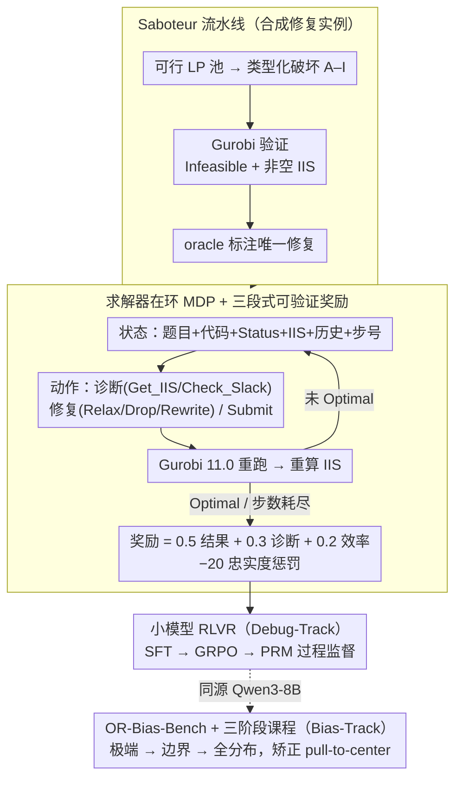

# ORLoopBench: Solver-in-the-Loop Benchmarks for Self-Correction and Behavioral Rationality in Operations Research

**会议**: ICML 2026  
**arXiv**: [2601.21008](https://arxiv.org/abs/2601.21008)  
**代码**: https://github.com/Archer222arc/ORLoopBench  
**领域**: LLM评测 / 自我纠错 / 运筹优化 / 求解器在环 / RLVR  
**关键词**: solver-in-the-loop, IIS反馈, 自我纠错, GRPO, newsvendor偏差

## 一句话总结
作者把"修一个 Infeasible 的运筹模型"形式化成"每改一步都要重跑 Gurobi 拿 IIS 反馈"的求解器在环 MDP，发布了配套基准 ORLoopBench（5362 条 LP/MILP 修复实例 + 库存决策偏差测评），并用 RLVR 把一个 8B 模型训到在 LP 修复上以 95.3% RR@5 反超闭源 API（92.4%）。

## 研究背景与动机

**领域现状**：现有 LLM-for-OR 基准（NL4Opt、OptiBench、MAMO、ORLM 等）几乎只考察"问题描述 → 求解器代码"的一次性翻译，模型写完代码就结束，缺乏与求解器的多轮交互。

**现有痛点**：真实运筹工作中，工程师写完 LP/MILP 第一反应往往是看到 `Status: Infeasible`，然后要靠 Gurobi 给出的不可约不可满足子系统（Irreducible Infeasible Subsystem, IIS）反复定位冲突约束、修改公式。一次性翻译式基准完全跳过了这个调试回路，也就掩盖了 LLM 的真实工程能力。

**核心矛盾**：自我纠错任务里，反馈信号通常是模糊的（编译器报错、单元测试失败），所以 CorrectBench 等工作只能用"软"奇怪指标。而运筹场景具有罕见的三重确定性——求解器输出是 deterministic oracle、IIS 是冲突的最小证书、最优解可数学验证——本应成为研究 self-correction 的理想沙盒，却一直没人系统化。

**本文目标**：(1) 把 infeasible-model 修复形式化成可以训练的 MDP；(2) 提供一个能区分"碰巧修好"和"真正诊断"的基准；(3) 顺带评估 LLM 在下游运维决策（库存）中的行为理性。

**切入角度**：作者抓住 IIS 这个"最小冲突证书"——它不是普通报错，而是一个数学上可被压缩的冲突子集，模型必须围绕它做有目标的修改，而不是盲改试错。

**核心 idea**：把"问题描述 + 当前代码 + Gurobi 状态 + IIS"打包成状态，把"诊断查询 / 修复编辑 / 提交"当作动作，把"是否变 Optimal、是否命中真冲突、用了多少步"组合成奖励，再用 GRPO 在求解器验证下做强化学习——可验证奖励（RLVR）就此自然落到 OR 场景。

## 方法详解

### 整体框架

ORLoopBench 由两个互补部件组成。**OR-Debug-Bench** 是核心：求解器在环 MDP，包含 5362 条 LP/MILP 修复实例，覆盖 LP 错误类型 A–I 与 MILP 8 种错误。**OR-Bias-Bench** 是补充：2000 条 newsvendor 加 300 条 EOQ 的库存决策题，对照闭式最优 $Q^{*}=F^{-1}(\text{CR})$ 与 $Q^{*}=\sqrt{2DK/h}$ 评估"中心拉扯"偏差。两个部件分别对应"上游公式修复"和"下游决策理性"，共用一套以 Qwen3-8B 为底座、SFT + RL 的训练管线。

整条评测回路如下：求解器从代码读出 `Infeasible` 与 IIS → 智能体观测状态（NL 题目 + 当前代码 + Status + IIS + 历史 + 步号）→ 输出动作（诊断 `Get_IIS` / `Check_Slack`、修复 `Relax` / `Drop` / `Rewrite` 或终止 `Submit`）→ Gurobi 11.0 重跑得到下一状态 → 直到 `Optimal` 或步数耗尽（上限 50）。两条 track 同源于 Qwen3-8B：Debug-Track 走「Saboteur 造数据 → MDP 回路 → RLVR 训练」，Bias-Track 走「库存题测偏差 → 三阶段课程矫正」。

### 关键设计

**1. 求解器在环 MDP + 三段式可验证奖励：把多轮修复变成一个奖励完全由 Gurobi 决定的 RL 任务**

自我纠错任务的反馈通常很模糊（编译器报错、单测失败），只能用"软"指标评判；但 OR 场景的求解器是 deterministic oracle、IIS 是冲突的最小证书、最优解可数学验证，正好能把奖励落到客观信号上。ORLoopBench 把奖励写成 $\mathcal{R}=0.5\,R_\text{outcome}+0.3\,R_\text{diagnosis}+0.2\,R_\text{efficiency}$：$R_\text{outcome}=+100$ 若达到 Optimal 否则 $-50$；$R_\text{diagnosis}=\text{DA}\cdot 100$，诊断准确率 $\text{DA}=|\text{diagnosed}\cap \text{IIS}_\text{GT}|/|\text{IIS}_\text{GT}|$；$R_\text{efficiency}=-1$ / 步；再叠一个 $-20$ 的"忠实度惩罚"，专门压制那些为了修到 Optimal 而去改非 IIS 约束的"绕路修复"。这套设计的关键在于把"理解冲突"和"恢复可行"拆开——单看 RR@5 会奖励"瞎改也能蒙对"的行为，而 DA 把诊断质量独立出来、忠实度惩罚把"用副作用掩盖冲突"这类作弊路径直接掐掉，于是奖励真正度量的是模型有没有读懂 IIS。

**2. Saboteur 流水线：自动合成"难且唯一"的 infeasible 修复三元组**

合成数据若太简单会被模型秒杀，若修复不唯一又会让模型用别的合法修复绕过去、破坏 ground truth。ORLoopBench 用 4 阶段管线（pool 取样 → 类型化破坏 → Gurobi 验证 → oracle 标注）保证每个被破坏的 LP 一定 Infeasible、一定有非空 IIS、且 IIS 包含被注入的约束。9 个错误类型按难度分级：B/C 是符号或系数小改（Easy，baseline RR@5 ≥ 85%）；H/I 涉及 IIS 不完整或最优解选择（Medium，70–85%）；A/D/E/F/G 是方向翻转、矛盾约束、级联冲突等硬骨头（Hard，<70%）。难注入的类型配类型专属对策，如 Type A 用基于松弛量选约束把成功率从 30% 提到 95%，Type C 用 4 层 fallback 拿到 72%。再加三种"反 pattern"措施——UUID 化命名、隐藏依赖让 IIS 只显示症状、级联冲突逼出多步推理——让简单的字符串匹配几乎没法 work，模型必须真做诊断。

**3. 小模型 RLVR：GRPO + 过程奖励模型把 8B 推到反超闭源 API**

纯结果奖励对 LP 修复这种短轨迹任务"信号到得太晚"，8B 模型很难学起来。ORLoopBench 先 SFT 696 条来自 GPT-5.2-chat / o4-mini / DeepSeek-R1 的成功轨迹（接受率 55.8%，要求 ≤5 步 + 至少命中半个 GT 冲突），再做 GRPO（$\beta=0$ 去掉 KL、非对称 clip $[0.2,0.28]$、LoRA $r=16,\alpha=32$，4 个 epoch 收敛到 RR@5 ≈ 95.0%）。为缓解奖励稀疏，额外训一个过程奖励模型 PRM 按步分级标注（命中冲突或缩小 IIS 给最高奖励，仅做诊断给小奖励），PRM 在保留集上 AUC-ROC 达 0.94，能再把 DA 提 4.7pp（68.0%→72.7%）。整套训练只花约 8 GPU-hours（2×A100），还能零样本迁移到 MILP——PRM 把"做了对的事"和"最终修对了"解耦，正是 8B 不放大模型就能逼近 frontier API 的关键。

**4. OR-Bias-Bench + 三阶段课程学习：把下游库存决策的系统性偏差变成可训练矫正的对象**

上游修对了公式，不代表下游用得对。OR-Bias-Bench 这条 Bias-Track 专门探测决策理性：2000 条 newsvendor（最优订货量有闭式解 $Q^{*}=\mu+\sigma\Phi^{-1}(\text{CR})$）加 300 条 EOQ（$Q^{*}=\sqrt{2DK/h}$），闭式解让 ground truth 完全无歧义。已有工作（AIM-Bench）发现所有 LLM 都有"pull-to-center"偏差——临界比 $\text{CR}>0.5$ 时少订、$\text{CR}<0.5$ 时多订，且不随模型变大消失。本文的贡献是证明这种偏差**可被训练顺序矫正**：三阶段课程先在极端 CR（0.1/0.9）教模型"该往哪个方向调"，再在边界区（0.15–0.25、0.75–0.85）精校调整幅度，最后在 [0.2,0.8] 全分布上巩固。关键洞察在"先方向后幅度"的顺序——直接在全分布上训，模型会把偏差当噪声平均掉；而先用极端样本把方向学死、再细化幅度，OOD 偏差反而从 20.0% 降到 10.4%，是所有训练方案里唯一一个在 OOD 上偏差比 ID 还低（−9.6% drift）的。

### 损失函数 / 训练策略

两条 track 同源于 Qwen3-8B、各自独立训练：Debug-Track = SFT（696 条教师轨迹）+ GRPO（可选 PRM 过程监督），Bias-Track = SFT（500 条理性响应）+ 三阶段课程学习（细节见关键设计 3、4）。两轨推理统一用 SGLang（TP=2, concurrency=16），全程在 2×A100 上完成。

## 实验关键数据

### 主实验

26 模型大盘评测（LP 测试集 450 例，每个错误类型 A–I 各 50 例）：

| 模型 | RR | RR@5 | DA | 平均步数 |
|------|----|------|----|---------|
| Qwen3-8B-GRPO（本文） | 100% | **95.3%** | **62.4%** | **2.25** |
| Qwen3-8B-Curriculum | 100% | 94.0% | 61.7% | 2.22 |
| Qwen3-8B-SFT | 99.8% | 93.1% | 60.8% | 2.34 |
| Claude Sonnet 4.6（最强 API） | — | 92.4% | — | — |
| o4-mini | 97.8% | 86.2% | 47.8% | 3.15 |
| claude-sonnet-4 | 100% | 86.2% | 50.1% | 3.71 |
| gpt-5.2-chat | 99.8% | 81.8% | 40.9% | 3.72 |
| DeepSeek-R1 | 99.1% | 56.7% | 34.5% | 5.08 |

MILP 迁移（10 域 × 8 错误类型 × 5 次重复）：LP 训练的模型零样本 78.8% RR@5，MILP 专项再训到 87.1%，对比 Claude Sonnet 4.6 的 71.0% 多出 16.1pp。

### 消融实验

| 配置 | 关键指标 | 说明 |
|------|---------|------|
| SFT only | RR@5 93.1% / DA 60.8% | 仅模仿教师轨迹 |
| + GRPO（结果奖励） | RR@5 95.3% / DA 62.4% | 主流配置 |
| + PRM 过程监督 | DA 72.7%（+4.7pp） | 步级奖励显著拉升诊断质量 |
| + 课程学习（Bias-Track） | OOD bias 10.4%（-9.6%） | 唯一在 OOD 上 bias 还降的训练方案 |

### 关键发现
- **8B 反超闭源**：在 LP 修复上 Qwen3-8B-GRPO 比当时最强的 Claude Sonnet 4.6 高 2.9pp（RR@5），同时把 DA 从 47.8% 拉到 62.4%、步数从 3.15 砍到 2.25，说明"求解器可验证奖励"在数学结构化任务上对小模型异常友好。
- **代码重写有"语义漂移"**：OptiMUS 风格的整模型重生成在 MILP 上 GPT-5.4 有 90% 跑到 Optimal，但只有 28.2% 保住了原目标函数；Claude Sonnet 4.6 是 85% / 22.4%。约束级修复因为只动 IIS 内约束，目标函数天然不漂。
- **诊断风格反转**：训练后模型呈"诊断一次、精准修复"模式，每集仅 1.3 次诊断动作（API 是 2.1 次），但修复命中率显著更高——这是从"试错"切换到"系统消除"的行为级证据。
- **行为偏差具有方向性**：所有 LLM 在 newsvendor 上都表现出"pull-to-center"——当 $\text{CR}>0.5$ 时少订、$\text{CR}<0.5$ 时多订；课程学习是唯一一个在 OOD 上反而把 bias 拉低（-9.6%）的方案，提示"先学极端再学边界"的训练顺序对治偏差很关键。

## 亮点与洞察
- **把求解器变成 oracle 不是新词，新在让它进 reward**：以往求解器只用来"评分"，本文把每一步动作都触发求解器重跑，奖励直接来自求解器状态变化，于是 RLVR 在 OR 上不需要任何人工裁判，可以无限扩样。
- **DA 与 RR@5 解耦是基准设计上的小聪明**：高 RR@5 + 低 DA 的模型一眼就能识别——"修对了但不知道为啥"，对工程落地特别有诊断价值，这种二维指标值得在其他 self-correction benchmark 复制。
- **PRM AUC-ROC 0.94 这个数字**：意味着用结果奖励生成的步级标签本身就足够干净，过程监督在结构化任务里可能比在数学竞赛/代码上更好做。
- **OR-Bias-Bench 这条 line**：把行为经济学里的 newsvendor "pull-to-center" 偏差迁移到 LLM 评测，是非常直观的"系统性偏差探针"，且闭式解让 ground truth 完全无歧义，未来可推广到 EOQ、报童变体、定价等一系列教科书问题。

## 局限与展望
- **作者承认的局限**：训练成本上 8B + LoRA 已经够便宜，但 SGLang TP=2 仍需 2×A100，部署门槛对学校实验室仍偏高；MILP 的 87.1% 距离实际生产还有差距。
- **自己发现的局限**：评测全部基于 Gurobi 11.0，IIS 算法与求解器版本耦合较深，换 CPLEX/HiGHS 时 IIS 可能不同，DA 的定义需要重新校准；OR-Bias-Bench 只覆盖 newsvendor 与 EOQ 两个最经典模型，离真正的多产品 / 多周期库存还远；saboteur 流水线虽然保证 ground truth 唯一，但 9 类错误的覆盖度对真实 OR 代码 bug 分布并未做统计校验。
- **改进思路**：(1) 把 IIS 替换为 solver-agnostic 的"任意 infeasibility certificate"接口，让 benchmark 解耦求解器；(2) 把目标函数漂移度作为一阶指标内嵌到代码重生成的评测中，而不是事后单算；(3) 用合成偏差 + 真实零售数据混合，给 OR-Bias-Bench 加上 OOD 真实分布层。

## 相关工作与启发
- **vs CorrectBench (Tie et al., 2025)**: 都研究 LLM 自我纠错，但 CorrectBench 用通用编程 + 软测试，反馈含糊；本文用 Gurobi IIS 的确定性证书做反馈，使得"是否真的诊断对了"可被精确量化。
- **vs SWE-bench (Jimenez et al., 2024)**: SWE-bench 用单元测试做 oracle，每条 issue 是黑盒过/不过；ORLoopBench 把 oracle 拆到每一步，每一步都能给可读的 IIS 反馈，更贴近 step-level RL。
- **vs ORLM (Huang et al., 2025a) / OptiBench**: 前作只评"NL→公式"一次性翻译，没有循环；本文把同样的题目升级为"修一个已经写错的代码"，更接近真实运筹工程师的日常。
- **vs AIM-Bench (Zhao et al., 2025)**: AIM-Bench 首次报告 LLM 库存"pull-to-center"偏差，本文用三阶段课程证明这种偏差是可训练矫正的，并给出 OOD 下 bias 反向下降的训练配方。

## 评分
- 新颖性: ⭐⭐⭐⭐ 把 IIS 作为 RLVR 信号源的视角清晰且首次系统化，但"solver-in-the-loop"概念在 SWE-bench 时代已现雏形。
- 实验充分度: ⭐⭐⭐⭐⭐ 26 个模型、双部件、MILP 迁移、bias OOD、PRM、curriculum 全套消融到位。
- 写作质量: ⭐⭐⭐⭐ Table 体系和 reward 公式呈现都很干净，部分实验细节被压到附录略影响阅读连贯。
- 价值: ⭐⭐⭐⭐⭐ 基准 + 训练管线一并放出，且证明 8B 可反超闭源，对 OR/数学结构化任务的小模型 RLVR 是直接可复用的 recipe。

## 评分
- 新颖性: 待评
- 实验充分度: 待评
- 写作质量: 待评
- 价值: 待评

<!-- RELATED:START -->

## 相关论文

- [\[ICML 2026\] Dr. Tulu: Reinforcement Learning with Evolving Rubrics for Deep Research](dr_tulu_reinforcement_learning_with_evolving_rubrics_for_deep_research.md)
- [\[NeurIPS 2025\] ReSearch: Learning to Reason with Search for LLMs via Reinforcement Learning](../../NeurIPS2025/reinforcement_learning/research_learning_to_reason_with_search_for_llms_via_reinforcement_learning.md)
- [\[ICML 2026\] D$^2$Evo: Dual Difficulty-Aware Self-Evolution for Data-Efficient Reinforcement Learning](d2evo_dual_difficulty-aware_self-evolution_for_data-efficient_reinforcement_lear.md)
- [\[ICML 2026\] Making Expert Reasoning Learnable with Self-Distillation](making_expert_reasoning_learnable_with_self-distillation.md)
- [\[ICLR 2026\] Self-Harmony: Learning to Harmonize Self-Supervision and Self-Play in Test-Time Reinforcement Learning](../../ICLR2026/reinforcement_learning/self-harmony_learning_to_harmonize_self-supervision_and_self-play_in_test-time_r.md)

<!-- RELATED:END -->
