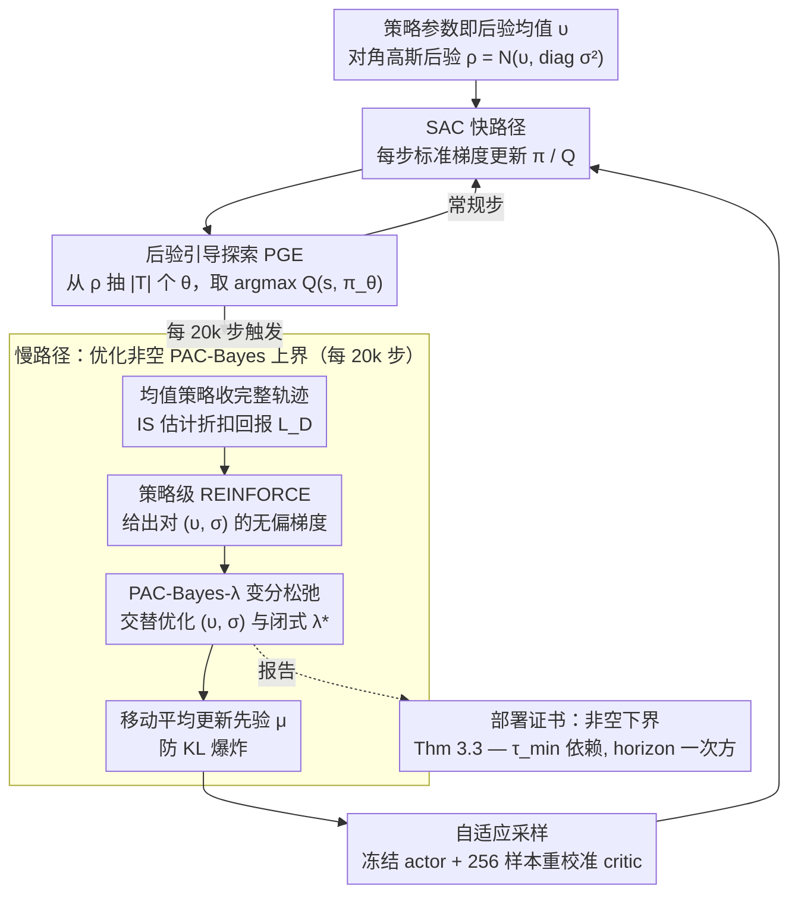

# PAC-Bayesian Reinforcement Learning Trains Generalizable Policies

**会议**: ICML2026  
**arXiv**: [2510.10544](https://arxiv.org/abs/2510.10544)  
**代码**: 无  
**领域**: 强化学习 / 泛化理论 / PAC-Bayes  
**关键词**: PAC-Bayes 上界, 混合时间, Soft Actor-Critic, 部署证书, 后验引导探索  

## 一句话总结
本文给出第一个**显式依赖马尔可夫链混合时间**且对长 horizon $1/(1-\gamma)$ 依赖只到一次方的 PAC-Bayesian RL 泛化上界，并把它作为活的训练目标内嵌进 SAC，得到 PB-SAC 算法——在 MuJoCo 连续控制任务上同时给出非空 (non-vacuous) 部署证书与具竞争力的性能。

## 研究背景与动机

**领域现状**：强化学习要部署到安全攸关场景需要"形式化的泛化保证"——训练得到的策略在未见轨迹上表现仍然好。PAC-Bayes 框架在监督学习里已经能给出非空 (non-vacuous) 的高置信度证书（Pérez-Ortiz 2021），并且证书本身可以反过来作为训练目标。但 RL 直接套 PAC-Bayes 会遇到致命问题：轨迹数据是**时间相关**的——$S_{t+1}$ 由 $(S_t, A_t)$ 决定，破坏经典 PAC 上界依赖的 i.i.d. 假设。

**现有痛点**：(1) Seldin et al. (2011, 2012) 用 martingale 方法处理序列依赖很优雅，但 RL 数据本身并不天然构成 martingale，需要人为构造（如 Bellman 残差）。(2) Fard et al. (2011) 早期把 PAC-Bayes 用于 RL 但通过 Bellman 误差中转，最终 sample complexity 缩放成 $\mathcal{O}((1-\gamma)^{-4})$，在 $\gamma=0.99$ 这种现代深度 RL 设置下数值上完全空 (vacuous)。(3) Tasdighi et al. (2025) 等近期工作要么继承这个差的 horizon 依赖，要么把 PAC-Bayes 仅作为正则项（如 PBAC 的 deep exploration、Zhang 2025 的 lifelong learning），完全放弃了"作为可计算证书"的初衷。

**核心矛盾**：要让 PAC-Bayes 证书在现代深度 RL 里有用，必须同时解决三件事——(a) 序列依赖的浓度不等式选择；(b) 关于 horizon $1/(1-\gamma)$ 的指数空洞问题；(c) PAC-Bayes 目标非凸 + 周期性后验更新会摧毁 critic 的稳定性。三者只解决一件都不够，文献里之前没人同时拿下。

**本文目标**：(1) 推出一个显式带 $\tau_{\min}$（混合时间）依赖、horizon 依赖只到 $\mathcal{O}((1-\gamma)^{-1})$ 的 PAC-Bayes RL 上界；(2) 让它在 MuJoCo 上数值非空；(3) 设计 PB-SAC 算法把这个上界作为 alive 的优化目标稳定训练。

**切入角度**：作者放弃 Bellman 残差的两步导出，直接对**折扣回报本身**做有界差分（bounded-differences）分析；然后用 Paulin (2018) 把 McDiarmid 不等式扩展到马尔可夫链的结果——后者天然为"满足 bounded-difference 的马尔可夫函数"提供 explicit constants 的浓度，正好套上来。

**核心 idea**：直接对折扣回报的 bounded-differences condition 推 transition-level 灵敏度 $c_{(h,j)} = \gamma^{h-1}R_{\max}/T$，得到 $\|c\|_2^2 = R_{\max}^2(1-\gamma^{2H})/(T(1-\gamma^2))$；再用马尔可夫链 McDiarmid 的浓度配合标准 PAC-Bayes change-of-measure，得到只含 $\tau_{\min} \cdot \|c\|_2^2$ 的清爽证书。

## 方法详解

### 整体框架
工作分两层：

1. **理论层（Section 3）**：建立 PAC-Bayes RL 主定理 (Theorem 3.3)，给出 $\mathbb{E}_{\theta\sim\rho}[L(\theta)] \le \mathbb{E}_{\theta\sim\rho}[\hat{L}_D(\theta)] + \sqrt{\frac{R_{\max}^2(1-\gamma^{2H})}{T(1-\gamma^2)}\tau_{\min}(\mathrm{KL}(\rho\|\mu) + \ln\sqrt{2}/\delta)}$ 的形式，其中 $L(\theta) = -\mathbb{E}_{\xi\sim M}[\frac{\pi_\theta(\xi)}{\pi_b(\xi)}G(\xi)]$ 是用 importance sampling 写成的离策略真实损失。这里 horizon 依赖只到 $1/(1-\gamma^2)$（一次方等价），$\tau_{\min}$ 是策略诱导马尔可夫链的混合时间。
2. **算法层（Section 4）**：构建 PB-SAC（PAC-Bayes Soft Actor-Critic），维护一个对角高斯后验 $\rho(\theta) = \mathcal{N}(\upsilon, \mathrm{diag}(\sigma^2))$，策略参数始终等于后验均值 $\upsilon$。标准 SAC 梯度更新负责"快路径"每步训练；PAC-Bayes 目标每 20k 步触发一次"慢路径"更新后验。慢路径用四个机制（后验引导探索 PGE / 策略级 REINFORCE / PAC-Bayes-$\lambda$ 变分松弛 / 自适应采样）把第一层的理论上界从"事后报告的数字"变成训练中可优化的 alive 目标，并稳定下来。

下面这张图给出 PB-SAC 的整体流（理论层提供被优化的上界与最终证书，算法层是围绕它的快慢双路径循环）：

### 关键设计

**1. transition-level 有界差分 + Paulin 浓度：把 horizon 依赖从四次方砍到一次方**

第一件要解决的事是序列依赖让经典 PAC 上界失效。作者不走 Fard et al. (2011) 那条"先把 value error 转成 Bellman error 再用 i.i.d. 浓度"的老路（正是那一步把 horizon 依赖推到 $(1-\gamma)^{-4}$），而是直接对折扣回报本身做有界差分分析。对固定参数 $\theta$、两组只差一个 transition 的 trajectory 集 $D,\bar D$，证明

$$|\hat{L}_D(\theta) - \hat{L}_{\bar{D}}(\theta)| \le \sum_{h',j'} c_{(h',j')}\,\mathbb{1}[\xi_{h'}^{(j')} \neq \bar{\xi}_{h'}^{(j')}],\qquad c_{(h,j)} = \gamma^{h-1} R_{\max}/T.$$

系数 $c_{(h,j)}$ 直接把"靠近开头的 transition 影响大、靠后的指数衰减"写进了公式。然后套 Paulin (2018) 的马尔可夫链 McDiarmid——满足这种有界差分的统计量在 Markov 链上的偏差仍受 $\tau_{\min}\cdot\|c\|_2^2$ 控制。关键收益在求和：$\sum_h \gamma^{2h}$ 收敛成 $(1-\gamma^2)^{-1}$，horizon 依赖一下砍掉两个 $1/(1-\gamma)$。这正是 $\gamma=0.99$ 时上界从 $10^8$ 量级缩到 $10^2$ 量级、从"数值上等于无穷"变成"非空可读"的临界一步。

**2. 后验引导探索（PGE）：用后验不确定性替代无方向的随机探索**

SAC 默认靠熵正则 / $\epsilon$-greedy 加随机扰动探索，随机性没有方向、稀疏奖励下效率低。既然 PB-SAC 已经维护了一个策略参数的后验 $\rho$，作者就让探索"听后验的话"：每个探索步从 $\rho$ 抽 $|\mathcal{T}|$ 个候选参数 $\theta_i$，在冻结的 critic 上各做一次前向，取 $\arg\max_{\theta_i\in\mathcal{T}} Q(s,\pi_{\theta_i}(s))$——只要 $\mathcal{O}(|\mathcal{T}|)$ 次 critic 估值，不需要在参数空间里连续搜索，完全可计算。妙处在于后验标准差 $\sigma$ 自动平衡探索与利用：$\sigma$ 大时候选发散、探索更激进，$\sigma$ 小时候选挤在均值附近、退回利用当前 mean policy。于是探索由不确定性量化驱动而非任意随机，这也是它在稀疏奖励任务上反超 PBAC 的根源。

**3. 策略级 REINFORCE：让 PAC-Bayes 期望梯度变成可采样估计**

要把上界当训练目标优化，绕不开 $\nabla_{(\upsilon,\sigma)}\mathbb{E}_{\theta\sim\rho}[\hat{L}_D(\theta)]$，但采样发生在梯度算子内部、无法直接求导。作者用两阶段绕开：先用**当前均值策略**收集 fresh 完整轨迹（必须是完整轨迹、不能从 replay buffer 打乱采样，否则破坏 Theorem 3.3 要求的 intra-trajectory 依赖结构），从 $\rho$ 抽若干 $\theta$ 用 importance sampling 在这些轨迹上估折扣回报 $\hat{L}_D(\theta)$；再把 log-likelihood trick（REINFORCE, Williams 1992）用在**策略参数 $\theta$ 层面而非动作 $a$ 层面**，得到

$$\nabla_{(\upsilon,\sigma)}\mathbb{E}_{\theta\sim\rho}[\hat{L}_D(\theta)] = \mathbb{E}_{\theta\sim\rho}\big[\nabla_{(\upsilon,\sigma)}\log P_{\upsilon,\sigma}(\theta)\cdot\hat{L}_D(\theta)\big].$$

这个无偏可采样估计把 PAC-Bayes 训练成本压到与标准 actor-critic 同量级，是把 alive 目标真正训起来的前提；普通深度 PAC-Bayes 文献里很少见这种 policy-level 用法。

**4. PAC-Bayes-$\lambda$ 变分松弛 + 交替优化：把平方根非凸目标拆成可稳定优化的凸子问题**

有了梯度还不够——证书形如 $\hat{L}_D + \sqrt{\text{KL 项}}$，平方根复合让它非凸，直接梯度下降会发散或退化到 $\rho\to\mu$。作者借恒等式 $\sqrt{x} = \inf_{\lambda>0}(\frac{x}{2\lambda}+\frac{\lambda}{2})$ 引入辅助参数 $\lambda$，把目标重写成

$$\mathcal{J}(\rho,\lambda) = \mathbb{E}_{\theta\sim\rho}[\hat{L}_D(\theta)] + \frac{\|c\|_2\,\tau_{\min}}{2\lambda}\big(\mathrm{KL}(\rho\|\mu)+\ln\tfrac{\sqrt{2}}{\delta}\big) + \frac{\lambda}{2}.$$

这个目标对后验 $\rho$ 凸（KL 凸 + 期望线性），对 $\lambda$ 有闭式最优 $\lambda^* = \sqrt{\|c\|_2\,\tau_{\min}(\mathrm{KL}+\ln\sqrt{2}/\delta)}$，于是交替优化：固定 $\lambda$ 用策略级 REINFORCE 给出的梯度更新 $(\upsilon,\sigma)$，再固定 $(\upsilon,\sigma)$ 闭式解 $\lambda^*$；优化完把 $\rho^*$ 代回原上界报告证书。这个 trick Thiemann et al. (2017) 在 PAC-Bayes-$\mathrm{kl}$ 多数投票里用过，本文是首次搬到 RL，正是它把非凸目标的训练发散和"$\rho\to\mu$ 退化"这两个失败模式消掉。

**5. 自适应采样：消除 actor-critic 失配，让证书"活"在训练里而不崩坏性能**

最后一道坎是工程上的：每次 PAC-Bayes 后验更新都会让后验均值大幅平移，critic 突然对不上新策略分布，性能出现锯齿震荡（Figure 8a 的 sawtooth——每次更新后急跌再慢爬）。直觉上应该"小步慢走"避免扰动 SAC，但作者反向操作：常规训练只采 1 个后验样本（均值策略）保持高效，而**紧接在**每次 PAC-Bayes 更新后立刻冻结 actor、把采样数临时拉到 256，让 critic 在新后验的整片分布上做高频估值重校准，稳定后再恢复 1 样本继续。这套"一次跨大步 + 紧接着 256 样本重校准"的反直觉设计，才是把理论从 paper trick 落地成 deployable 算法的桥梁。

### 损失函数 / 训练策略
SAC 主路径正常做 $\pi$ 和 $Q$ 的更新（熵正则 + 双 critic）；PB-SAC 在每 20k 步触发一次 PAC-Bayes-$\lambda$ 更新：(a) 用当前 mean policy 收集**完整** trajectory（不能用 replay buffer 打乱，以保持 Theorem 3.3 要求的 intra-trajectory 依赖）；(b) 从 $\rho$ 抽多个 $\theta$，用 importance sampling 在这些轨迹上估值 $\hat{L}_D(\theta)$；(c) 用策略级 REINFORCE 估计得到 $\mathbb{E}_{\theta\sim\rho}[\hat{L}_D(\theta)]$ 的无偏梯度，配合 PAC-Bayes-$\lambda$ 交替优化更新后验。先验 $\mu$ 用 moving-average 朝当前 $\rho$ 衰减更新以防 KL 爆炸。混合时间 $\tau_{\min}$ 用 reward / state-feature 的自相关衰减估计，取多源最大值以防低估（低估会导致 overconfident bound）。

## 实验关键数据

### 主实验：MuJoCo 连续控制对比（1M 环境步）

| 任务 | PB-SAC（本文） | SAC baseline | PBAC (Tasdighi 2025) | PAC-Bayes 证书 |
|------|----------------|--------------|----------------------|----------------|
| HalfCheetah-v5 | ≈10–11k 回报 | ≈10–11k 回报 | 显著落后 | 100k 步内变非空，随训练收紧 |
| Ant-v5 | ≈5–6k 回报 | ≈4–5k 回报 | 显著落后 | 1M 步内仍提供有意义下界 |
| Hopper-v5 | 与 SAC 持平 | baseline | 落后 | 类似收紧曲线（Figure 5） |
| Walker2d-v5 | 与 SAC 持平 | baseline | 落后 | 类似收紧曲线 |
| Ant-v5 (very delayed, sparse) | **超过 SAC + PBAC** | baseline | 设计针对，但弱于 PB-SAC | App G.1 证明 PGE 在 sparse-reward 真正发力 |

核心讯息：dense-reward 任务上 PB-SAC ≈ SAC（没有为加证书付性能税），sparse-reward 上反超 PBAC（PBAC 的强项就是稀疏奖励探索）。证书随训练单调收紧，性能波动时证书也合理放宽 → 收紧。

### 消融：核心组件的必要性

| 配置 | 现象 | 说明 |
|------|------|------|
| Full PB-SAC | 平滑学习 + 收紧证书 | 完整模型 |
| w/o 自适应采样 | 出现明显 "sawtooth"，每次 PAC-Bayes 更新后掉点 | critic 失配，恢复慢；Figure 8a |
| w/o 后验引导探索（PGE） | sparse-reward 任务退化到 SAC 水平 | 探索失去 uncertainty 指引 |
| w/o moving-average 先验更新 | KL 爆炸，性能反被拉回先验 | 早期阶段后验偏移过快 |
| 固定 $\tau_{\min}=1$（i.i.d. bound） | 上界最紧但理论上不再有效 | 等价于 McDiarmid i.i.d. 版 |
| 固定 $\tau_{\min}=1000$（保守） | 上界宽松但训练仍能收敛 | 验证"高估比低估更安全"的实践哲学 |

### 关键发现
- horizon 依赖从 $(1-\gamma)^{-4}$ 降到 $(1-\gamma)^{-1}$ 不是装饰，是从"$\gamma=0.99$ 下数值上等于无穷"变成"$\gamma=0.99$ 下数值可读"的临界性质——这是本文在实践层面能拿出非空证书的核心。
- 自适应采样的发现非常实用：传统观点认为 PAC-Bayes 后验更新要"小步慢走"才不会扰动 SAC，但本文反向操作——一次跨大步 + 紧接着用 256 样本帮 critic 重新校准，反而比小步走稳定得多。这是 critic-in-the-loop 算法的反直觉设计。
- 混合时间高估比低估安全：实验发现 $\tau_{\min}$ 取 1 到 1000 对最终性能影响有限，但低估会导致 bound 不再有效；这给了实践者一个清晰的工程方针——"宁可保守"。

## 亮点与洞察
- **alive bound 范式**：本文最大的方法论贡献不是任何单一定理，而是把 PAC-Bayes 上界从"训练后报告一个数字"提升为"训练中作为可优化目标"，并配以四件套（变分松弛 + 后验引导探索 + 自适应采样 + 移动平均先验）确保 alive 优化稳定。这个范式可以无痛迁移到其它需要"训练即认证"的领域（如安全 RL、医疗 RL）。
- **依赖结构的物理化**：用 $\tau_{\min}$ 而不是抽象的 $\alpha/\beta$-mixing 系数，让上界的"哪个量在惩罚我"直接对应到 MDP 物理特性——agent 在状态空间里转得快（小 $\tau_{\min}$），数据有效样本数就接近 i.i.d.；转得慢，每条轨迹贡献的独立信息变少。这种物理化让从业者第一次能直观回答"我的数据值多少证书"。
- **policy-level REINFORCE trick**：把 log-likelihood trick 用在策略参数 $\theta$ 而非动作 $a$ 层面，让 PAC-Bayes 期望梯度变成可采样估计——这是把 PAC-Bayes 训练成本压到与标准 actor-critic 一个量级的关键技巧，普通深度 PAC-Bayes 文献里很少见这种应用。

## 局限与展望
- **作者承认的局限**：(1) 混合时间低估会导致 overconfident bound，目前用"取多源自相关最大值 + 单调递增"两条防御，但仍非完全可靠；(2) Gaussian 后验数学方便但不尊重深度网络参数空间的几何结构，可能限制证书的最终紧度；(3) 重要性权重 clipping 引入悲观偏置，证书仍然形式有效但更保守。
- **自己发现的局限**：实验只覆盖 4 个 MuJoCo 任务，没有图像输入（Atari、DMC pixel）或离散动作大状态空间的对比；PB-SAC 的开销主要来自周期性多样本 (256) critic recalibration，wall-clock 成本未与 SAC 详细对比；理论假设 $\tau_{\min} < +\infty$，对非遍历策略（如确定性 absorbing state）需要额外处理。
- **改进方向**：(1) 用归一化流或 Stein 变分等更灵活后验代替对角高斯；(2) 用 pseudo-spectral gap（Karagulyan & Alquier 2025）代替 $\tau_{\min}$ 估计，在可估计的子领域里有望进一步收紧；(3) 把 alive bound 思想推广到 model-based RL（同时认证 dynamics model 和 policy）。

## 相关工作与启发
- **vs Fard et al. (2011) / Tasdighi et al. (2025)**：他们通过 Bellman 残差导出，horizon 依赖 $(1-\gamma)^{-4}$ 数值空洞；本文直接用回报的有界差分 + Paulin 浓度，horizon 依赖砍到 $(1-\gamma)^{-1}$，是从理论好看到数值可用的本质跃迁。
- **vs Seldin et al. (2011, 2012)**：他们用 martingale 路径优雅但 RL 不天然有 martingale 结构；本文用 Markov 链 McDiarmid 更贴近 RL 数据本性，且产生 explicit constant 便于数值化。
- **vs PBAC (Tasdighi 2025)**：PBAC 把 PAC-Bayes 仅作为 deep exploration 的正则（多目标：diversity + coherence + propagation），需要 ensemble of critics、设计复杂；本文聚焦"alive 证书"，单一目标 + 单 critic，结构简单且 dense-reward 性能更好，sparse-reward 也不输。
- **vs Zhang et al. (2025) lifelong PAC-Bayes**：他们把 PAC-Bayes 用作 lifelong learning 的 prior 正则；本文相反——把它升级回原本目标（证书）并使之 alive，是 PAC-Bayes RL 文献的"回归初心"之作。

## 评分
- 新颖性: ⭐⭐⭐⭐⭐ 第一次同时拿下"显式 $\tau_{\min}$ 依赖 + $(1-\gamma)^{-1}$ horizon + 在现代深度 RL 上非空 + 作为 alive 训练目标"，每一条单看都有人做过，组合到一起是真正的开创性。
- 实验充分度: ⭐⭐⭐⭐ MuJoCo 4 任务 + sparse-reward 验证 + 完整消融 + 混合时间敏感性，对一个 theory-driven 论文已经很充分；缺失图像输入和大规模任务。
- 写作质量: ⭐⭐⭐⭐⭐ Section 3 把理论改进的三个 angle（horizon / mixing time / 可证性）拆得清楚，Section 4 用"挑战 → 解决方案"的结构把四个工程技巧的必要性逐一说服，Section 5 实验与理论 angle 一一对应。
- 价值: ⭐⭐⭐⭐⭐ "alive PAC-Bayes" 范式对安全 RL / 医疗 RL / 部署证书需求强的场景是直接可用的工具，理论上的 $\tau_{\min}$ + bounded-difference 路径也为后续马尔可夫数据的 PAC-Bayes 工作铺了模板。

<!-- RELATED:START -->

## 相关论文

- [\[ICML 2026\] Offline Reinforcement Learning with Generative Trajectory Policies](offline_reinforcement_learning_with_generative_trajectory_policies.md)
- [\[ICML 2026\] Chebyshev Policies and the Mountain Car Problem: Reinforcement Learning for Low-Dimensional Control Tasks](chebyshev_policies_and_the_mountain_car_problem_reinforcement_learning_for_low-d.md)
- [\[ICML 2026\] Learning Unmasking Policies for Diffusion Language Models](learning_unmasking_policies_for_diffusion_language_models.md)
- [\[AAAI 2026\] Explaining Decentralized Multi-Agent Reinforcement Learning Policies](../../AAAI2026/reinforcement_learning/explaining_decentralized_multi-agent_reinforcement_learning_policies.md)
- [\[ICLR 2026\] Learning to Play Multi-Follower Bayesian Stackelberg Games](../../ICLR2026/reinforcement_learning/learning_to_play_multi-follower_bayesian_stackelberg_games.md)

<!-- RELATED:END -->
