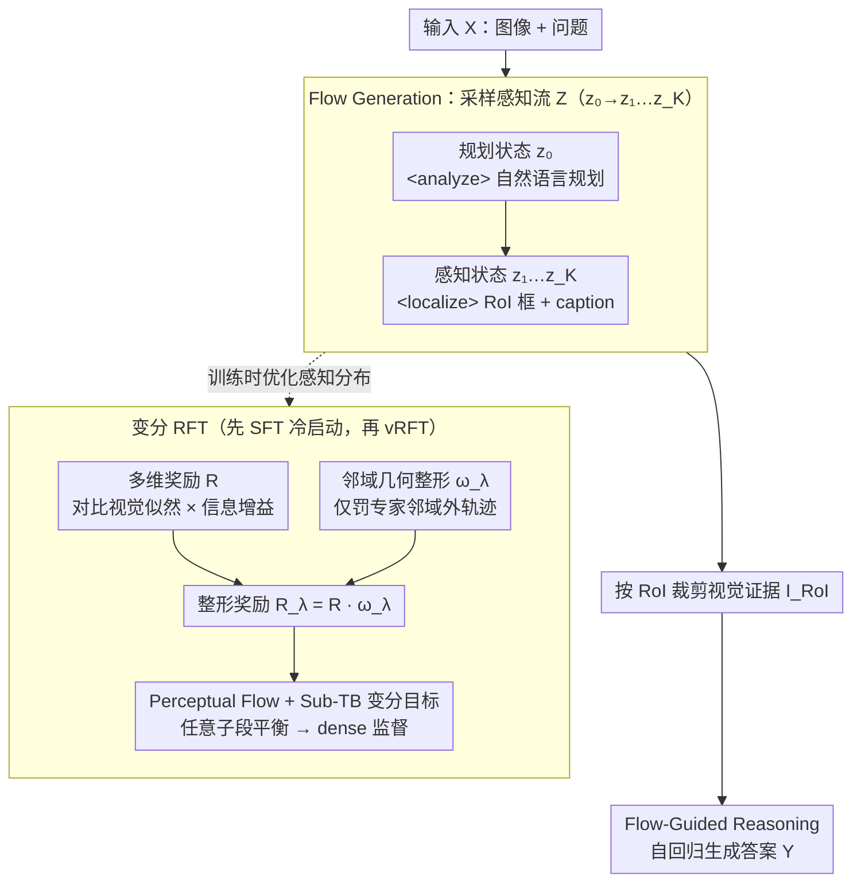

# Perceptual Flow Network for Visually Grounded Reasoning

**会议**: ICML 2026  
**arXiv**: [2605.02730](https://arxiv.org/abs/2605.02730)  
**代码**: 无  
**领域**: 多模态VLM / 强化学习 / 视觉推理  
**关键词**: 视觉接地推理, GFlowNet, Sub-TB, 变分强化学习, LVLM 幻觉

## 一句话总结
摒弃"用视觉专家的精确框做硬监督"的传统 RLVR 路线，PFlowNet 把感知行为本身建模为一段结构化的 Perceptual Flow 潜变量，用变分分布 $p_\theta(Z|X)$ 近似面向推理的理想后验，并用 Sub-TB 变分 RL + 多维奖励 + 邻域几何整形 (Vicinal Geometric Shaping) 训练，使得 8B 的 Qwen3-VL 在 V* Bench 拿到 90.6%、MME-RealWorld-lite 67.0% 的新 SOTA。

## 研究背景与动机

**领域现状**：为了缓解 LVLM 的语言偏置和幻觉，最近一类方法（look-twice、VGR、grounded thinking 等）通过 RLVR 把视觉专家（如 GroundingDINO）的几何先验蒸馏给 LVLM，让模型在推理过程中"先框出关键区域、再回答"。

**现有痛点**：作者用 Qwen2.5-VL 在 V* 上做了一个非常关键的探针实验——以专家标注框为中心做各向同性扩展，得到不同 IoU 的几何先验，然后只把对应裁剪喂给 LVLM 看回答正确率。结果反直觉：最精确的专家框反而不是最好的推理证据，存在一个 sweet spot。原因是视觉专家本为目标检测设计，追求几何精度而忽略"推理需要的上下文"，过紧的框形成"管视效应 (tunnel vision)"，去掉了完成任务必需的周边线索。

**核心矛盾**：现有 VGR 把"专家几何精度"等同于"推理证据质量"，强迫 LVLM 严格对齐专家框；而真正对推理最有用的"黄金证据"是 instance-specific 的，启发式扩展也无法精准命中。这是一个用错误目标做对齐的根本错位。

**本文目标**：(1) 形式化 VGR 为对潜在视觉轨迹 $Z$ 的分布建模问题；(2) 构造一族可学习的感知轨迹表示，让训练目标解耦"几何精度"和"推理效用"；(3) 用变分 RL 在保留几何可靠性的同时鼓励朝"推理友好"的感知行为探索。

**切入角度**：与其用专家框做硬约束，不如把推理轨迹 $Z$ 视为隐变量，由模型自参数化的变分分布 $p_\theta(Z|X)$ 去逼近"理想 VGR 后验" $P_V(Z|X,Y)$；后者只要求 $Z$ 落在以黄金证据 $G$ 为中心的 $\sigma$ 邻域 $\mathcal{S}_V$ 内即可。专家框 $E$ 仅作为"邻域参考"出现，不再是硬目标。

**核心 idea**：把感知做成一个 Perceptual Flow（planning state + 一连串 grounded perceptual states），用 Sub-Trajectory Balance 这种 GFlowNet 风格的变分目标做 dense 监督，并设计"多维奖励 + 仅在专家邻域外才生效的几何整形 $\omega_\lambda$"来实现"够探索但不越界"。

## 方法详解

### 整体框架
PFlowNet 把 LVLM 的工作流分成两个解耦阶段：(i) **Flow Generation**：模型从 $p_\theta(Z|X)$ 采样一条 Perceptual Flow $Z = (z_0 \to z_1 \to \dots \to z_K)$，其中 $z_0$ 是 `<analyze>...</analyze>` 包裹的规划状态，$z_{\ge 1} = \langle r_k, c_k\rangle$ 由 `<localize>...</localize>` 包裹，每个状态都包含一个 RoI 框（相对坐标 0–1000）和一个描述性 caption；(ii) **Flow-Guided Reasoning**：模型基于 $Z$ 及其裁剪出来的视觉证据 $I_{RoI}$ 通过自回归生成最终答案 $Y$，整体联合分布因子化为 $p_\theta(Y, Z|X) = p_\theta(Z|X) p_\theta(Y|Z, \langle X, I_{RoI}\rangle)$。训练分两步：先用 SFT 在合成的 perceptual flow 数据 $(X, Z_s)$ 上做冷启动，再用变分 RFT 在 $(X, Y, E)$ 上优化 $p_\theta(Z|X)$，让它更接近 $P_V$。

### 关键设计

**1. Perceptual Flow + Sub-TB 变分目标：把"看哪里、看到什么"结构化成可逐段打分的轨迹**

PPO 类目标只在 episode 末尾给一个稀疏奖励，感知这种多步行为下梯度方差很大。PFlowNet 先把感知行为离散化：定义 Perceptual Flow $Z = (z_0, z_1, \dots, z_K)$，规划状态 $z_0$ 是 `<analyze>` 包裹的自然语言，感知状态 $z_k=\langle r_k, c_k\rangle$ 是 `<localize>` 包裹的 RoI 框 + caption，用特殊 token 显式分割。有了这个结构，就能把 GFlowNet 的 Sub-Trajectory Balance 引进来——要求任意子段 $z_{i:j}$ 满足 $\mathcal{F}(z_i)\,\mathcal{T}_F(z_{i:j}) = \mathcal{F}(z_j)\,\mathcal{T}_B(z_{j:i})$，由此推出 vRFT 目标 $\mathcal{L}_{vRFT}(\theta)$（Eq. 2），用 log 比值的平方和作损失。好处有三层：显式结构让奖励能定义在每个子轨迹上；Sub-TB 的"任意子段都需平衡"提供了比 PPO 密集得多的约束、训练更稳；解耦感知与推理后能单独优化 $p_\theta(Z|X)$ 而不污染 LLM 的推理参数。

**2. 多维奖励（Contrastive Visual + Information Gain）：让奖励同时盯住"看得准"和"对答案有用"**

如果奖励只盯几何 IoU，模型很容易 reward hacking——框得准但 caption 写得很通用，或 caption 漂亮却框得离题。PFlowNet 的奖励把两件事拆成独立约束：

$$R(z_{0:k}\top) = \left(\prod_{i=1}^k \frac{p_\phi^+(z_i)}{p_\phi^-(z_i)}\right) p_\phi(Y \mid z_{0:k}\top, X).$$

对比项里 $p_\phi^+(z_i)=p_\phi(c_i\mid I_{r_i})$ 是裁剪区域内 caption 的视觉似然、$p_\phi^-(z_i)=p_\phi(c_i\mid I\setminus I_{r_i})$ 是补集区域的似然，$p_\phi$ 是与策略共享初始化的冻结奖励模型。一个漂亮的洞察是：这个对比项在轨迹期望下等价于 reverse-KL 蒸馏，$\mathbb{E}[\sum\log(p_\phi^+/p_\phi^-)]=\sum[D_{KL}(q_\theta^i\|p_\phi(\cdot|I\setminus I_{r_i})) - D_{KL}(q_\theta^i\|p_\phi(\cdot|I_{r_i}))]$，即鼓励 caption 紧贴裁剪区域的特权信息、远离补集噪声。后面的信息增益项 $p_\phi(Y|z_{0:k}\top, X)$ 则确保选中的轨迹对最终答案真有贡献。两项一起把"视觉接地"和"推理有用"绑成必须同时满足的条件，自然堵死了 hacking 的两条捷径。

**3. Vicinal Geometric Shaping（邻域几何整形）：把专家框从"硬目标"降级为"安全栏"**

探针实验已经表明专家最精确的框反而不是最好的推理证据（过紧会形成管视效应），所以不能强迫模型 100% 模仿专家，但也不能完全放任探索越界。PFlowNet 的做法是只在专家邻域外才惩罚：先用对称的 Chamfer-IoU 距离 $d_{IoU}(A,B)=1-0.5(IoU_{A\to B}+IoU_{B\to A})$ 以专家 RoI 集 $E$ 为中心定义 $\varepsilon$-邻域 $\mathcal{B}_\varepsilon(E)=\{z_{0:k}\mid d_{IoU}(r_{1:k},E)\le\varepsilon\}$，再用整形权重 $\omega_\lambda(z_{0:k},E)=\exp(-\lambda\,\mathbb{I}(z_{0:k}\notin\mathcal{B}_\varepsilon(E)))$ 只对落在邻域外的轨迹施加强度 $\lambda$ 的惩罚，邻域内则任由奖励 $R$ 自主决定。最终整形奖励 $R_\lambda=R\cdot\omega_\lambda$ 进 Sub-TB 的 $\mathcal{F}$。理论上这个设计两头都自洽：Theorem 3.1 给出 TV 距离上界，$\lambda\to 0$ 退化为标准 MLE（丢失几何约束）、$\lambda\to\infty$ 退化为 expert-guided RLVR（被专家偏差锁死）；Theorem 3.4 进一步证明存在 $\lambda^\star$ 使界严格小于二者下界 $\min\{1-s_V, 1-q\}$，即在理想假设下严格优于这两种基线。"专家是参考、不是目标"这句设计哲学由此落到了可证明的改进上。

### 损失函数 / 训练策略
**数据管线**：用 Gemini-3-flash / GPT-4o 作为教师，先对专家 RoI 做随机扩展生成合成 flow $Z_s$，再用 verifier 在"无 $Z_s$"和"有 $Z_s$"两种条件下采样回答，按 pass@k 分流：$k=1$ 太简单丢弃，$k>1$ 但 $2\le k_{w/Z_s}\le 16$ 进 RFT 集，$k_{w/o Z_s} > 16$ 且 $k_{w/Z_s} = 1$ 进 cold-start 集。**冷启动**：标准 SFT，最小化 $p_\theta(Z|X)$ 与 $Z_s$ 的交叉熵。**vRFT**：用上面三大设计组合训练，对 $L$ 条采样轨迹做并行化 Sub-TB 计算（每条 trajectory 的 sub-prefix 共用奖励缓存）。

## 实验关键数据

### 主实验
基础模型 Qwen3-VL 8B，覆盖 V* Bench (复杂视觉搜索)、TreeBench (perception + reasoning 树状评测)、MME-RealWorld-Lite (OCR/遥感/图表/监控/自动驾驶) 等基准。

| 数据集 | 指标 | PFlowNet | 之前 SOTA / 基线 | 提升 |
|---|---|---|---|---|
| V* Bench | Overall Acc | **90.6%** | Qwen3-VL 8B 77.5% | +13.1% vs 基础模型，新 SOTA |
| TreeBench | Overall Acc | Qwen3-VL+13.1% / +10.4% | Qwen3-VL 8B | +10.4 vs base |
| MME-RealWorld-Lite | Overall Acc | **67.0%** | 各类基线在 43–52% 区间 | +21% vs Qwen3-VL 8B |
| TreeBench (Attributes) | Acc | 64.69 (示例) | 多数 50–60 | 明显领先 |

注：表 2 中列出的 InternVL3-78B / Qwen2.5-VL-72B 等大模型在 TreeBench/MME-RealWorld-Lite 上仅 46.4% / 42.2%，PFlowNet 用 8B 显著超过 70B 量级基线，说明性能源自训练范式而非参数堆叠。

### 消融实验

| 配置 | 关键指标 | 说明 |
|---|---|---|
| Full PFlowNet ($\lambda^\star, \varepsilon^\star$) | TV 界最紧 / SOTA 性能 | 完整三大组件 |
| $\lambda \to 0$ | $D_{TV} \to 1 - s_V$ | 退化为 MLE，几何先验完全丢失 |
| $\lambda \to \infty$ | $D_{TV} \to 1 - q$ | 退化为 expert-guided RLVR，被专家偏差锁死 |
| $\varepsilon \to 0$ | 邻域收缩为点，$q \to 0$ | 奖励信号失效，界变松 |
| 增大 $\varepsilon$（保持 $\mathcal{B}_\varepsilon \subseteq \mathcal{S}_V$） | $q \uparrow$，界单调收紧 | 在有效域内越宽越好 |
| $\varepsilon > \sigma$ | 邻域跨出 $\mathcal{S}_V$ | 几何指导被稀释、性能反降 |

### 关键发现
- 探针实验直接反驳"专家最精确"的常识：精确专家框的回答 acc 反而比 IoU 中等的扩展框低，验证了"管视效应"。
- Theorem 3.1–3.4 给出"严格优于 MLE 与 expert-guided RLVR"的可证明改进，限制条件是 $\mathcal{B}_\varepsilon \subseteq \mathcal{S}_V$（邻域不能越出有效域）。
- 性能-效率折衷优异：8B 模型超过 78B 级基线，说明 perceptual flow 的结构化分解 + 变分 RL 极大提升了样本效率。
- 测试时 scaling 性质良好：在更大 sampling 预算下持续提升，反映 $p_\theta(Z|X)$ 学到的是真正可探索的分布而非单点。

## 亮点与洞察
- 把 VGR 重新形式化为"潜变量后验逼近"是这篇论文的最大概念升级——把 RLVR 的"几何对齐"框架替换为"分布逼近"框架后，原来无解的"专家偏置"问题就变成了可调的 $\lambda$/$\varepsilon$ 超参问题。
- Sub-TB 提供 dense 监督的同时保持 GFlowNet 的探索性，对长链感知行为特别合适；将 GFlowNet 思想从分子生成迁移到 LVLM 推理是一个新颖且自然的桥接。
- 多维奖励的对比项 $p_\phi^+/p_\phi^-$ 等价于 reverse-KL 蒸馏的洞察非常漂亮，把"看框内 / 看框外"的 caption 似然差直接变成 KL 项的差，物理意义和优化语义双重清晰。
- Vicinal Geometric Shaping 的设计哲学（"专家是参考、不是目标"）可迁移到任何需要平衡 expert prior 和探索的 RLHF 场景，比如代码 Agent 的 tool calling、机器人策略蒸馏等。

## 局限与展望
- 理论假设较强（Assumption 1/2、$d_{eff}$-regularity 等），实际 LVLM 的复杂分布是否满足并不确定；界只是 idealized 上限。
- Perceptual Flow 当前只支持"框 + caption"二元状态，对需要更细粒度（如 mask、点云、视频帧）的感知行为还需扩展。
- 数据管线依赖强教师模型 (Gemini-3-flash / GPT-4o) 合成 flow，对开源复现是显式门槛；冷启动数据质量直接影响最终性能。
- $\lambda$ 和 $\varepsilon$ 仍是固定超参，没有自适应调度；Theorem 也只证存在最优 $\lambda^\star$，没给出取法。
- 多维奖励要求维护一个奖励模型 $p_\phi$（与策略同初始化但冻结），训练阶段显存成本翻倍。

## 相关工作与启发
- **vs Look-Twice / VGR / TraceVL**：这些工作以 GroundingDINO 等专家几何为硬奖励，受专家偏置限制；PFlowNet 把专家退化为邻域参考、用变分目标自学最优感知。
- **vs DeepSeek-R1 (RLVR 范式)**：R1 把 RLVR 用在数学/代码可验证奖励上；PFlowNet 把 RLVR 推广到"感知行为不可直接 verify"的场景，用对比似然 + 信息增益代替 ground-truth 奖励。
- **vs GFlowNets (Sub-TB)**：原始 GFN 用于离散组合对象生成；本文是首批把 Sub-TB 引入 LVLM 多模态推理的工作之一。
- **vs Vicinal Risk Minimization**：从经典 VRM 借来"邻域整形"思想，但作用对象从输入空间换成轨迹空间，提供了新的 RL 正则化原语。

## 评分
- 新颖性: ⭐⭐⭐⭐⭐ 把 VGR 重新形式化、引入 GFlowNet Sub-TB、设计邻域几何整形，整体框架自洽且开了新范式。
- 实验充分度: ⭐⭐⭐⭐ V* / TreeBench / MME-RealWorld-Lite 全面评估，对照大模型基线；不过 ablation 细节较多放附录。
- 写作质量: ⭐⭐⭐⭐ 理论与方法结构清晰，"探针实验 → 形式化 → Sub-TB → 奖励 → 几何整形" 一以贯之。
- 价值: ⭐⭐⭐⭐⭐ 对未来的 grounded-reasoning LVLM 是范式级影响，邻域整形和多维奖励都有强可迁移性。

<!-- RELATED:START -->

## 相关论文

- [\[CVPR 2026\] See It, Say It, Sorted: An Iterative Training-Free Framework for Visually-Grounded Multimodal Reasoning in LVLMs](../../CVPR2026/reinforcement_learning/see_it_say_it_sorted_an_iterative_training-free_framework_for_visually-grounded_.md)
- [\[ACL 2026\] Visually-Guided Policy Optimization for Multimodal Reasoning](../../ACL2026/reinforcement_learning/visually-guided_policy_optimization_for_multimodal_reasoning.md)
- [\[ICML 2026\] Flow-Equivariant World Models: Memory for Partially Observed Dynamic Environments](flow_equivariant_world_models_memory_for_partially_observed_dynamic_environments.md)
- [\[ICML 2026\] Plug-and-Play Benchmarking of Reinforcement Learning Algorithms for Large-Scale Flow Control](plug-and-play_benchmarking_of_reinforcement_learning_algorithms_for_large-scale_.md)
- [\[ICML 2026\] The Shape of Reasoning: Topological Analysis of Reasoning Traces in Large Language Models](the_shape_of_reasoning_topological_analysis_of_reasoning_traces_in_large_languag.md)

<!-- RELATED:END -->
