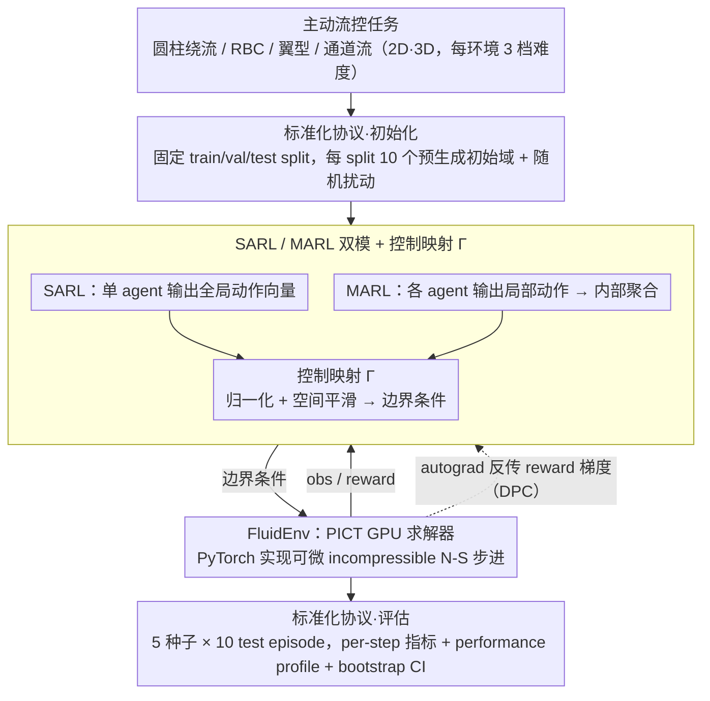

# Plug-and-Play Benchmarking of Reinforcement Learning Algorithms for Large-Scale Flow Control

**会议**: ICML 2026  
**arXiv**: [2601.15015](https://arxiv.org/abs/2601.15015)  
**代码**: https://github.com/safe-autonomous-systems/fluidgym  
**领域**: 强化学习 / 基准测试 / 主动流控 / 可微仿真  
**关键词**: 主动流控, RL 基准, 可微仿真, 多智能体 RL, GPU CFD

## 一句话总结
本文提出 FluidGym——首个完全用 PyTorch 实现、无外部 CFD 求解器依赖、端到端可微、原生支持多智能体与 3D 流场的 RL 主动流控基准，用 PPO/SAC/TD-MPC/DPC 在 13 个 2D/3D 环境上跑出 25k+ GPU 小时的标准化结果。

## 研究背景与动机
**领域现状**：RL 已在多个主动流控（AFC）任务上展现潜力，如气动减阻、传热增强、Tokamak 等离子体稳定。但社区采用的环境、传感器布置、奖励定义、超参数差异巨大，导致结果难以横向对比；75% 以上 AFC 文献都默认用 PPO，更新的连续控制方法（SAC、TD-MPC、DPC）几乎没被系统评估过。

**现有痛点**：现有 AFC 基准（DRLinFluids、drlFoam、DRLFluent、Gym-preCICE、Beacon、HydroGym）都被以下问题之一卡住：(i) 依赖 OpenFOAM/Fluent/FEniCS 等外部 CFD 求解器，安装链脆弱，需要 CFD 专家；(ii) 不可微，无法用 DPC 等梯度方法；(iii) 缺多智能体 API；(iv) 多数只覆盖 2D 案例。Beacon 是少有的纯 Python 方案但只做 2D 单智能体且不可微；HydroGym 覆盖 3D 但每个环境绑死不同求解器后端，落差很大。

**核心矛盾**：AFC 的物理任务天生是大动作空间、空间分布执行器（数百到上千个 jet 或 heater），最自然的建模就是 MARL + 3D + 梯度可传播；但既有基准的工程栈把这三个属性割裂开。研究者要么放弃可微性、要么放弃 3D、要么放弃 MARL，没有"全都要"的选项。

**本文目标**：建一个 (1) 纯 PyTorch、pip 即装即用，(2) 全可微，(3) 原生 SARL+MARL 双模式，(4) 覆盖 2D/3D 且每个环境提供 3 档难度的统一基准，配套标准 train/val/test 协议与多算法基线。

**切入角度**：基于团队自研的 GPU 加速 PICT 求解器（在 PyTorch 里实现 incompressible Navier-Stokes 的 GPU 算子），把 CFD 求解器和 RL 接口装进一个 Python 包，让 autograd 直接穿过 CFD 步进。

**核心 idea**：用一个 PyTorch-native 的 GPU CFD 求解器替换"外挂 CFD + Python wrapper"的传统胶水栈，从根本上消除可微性和 MARL 集成上的工程债务。

## 方法详解

### 整体框架
FluidGym 把 PICT GPU 求解器封装成 `FluidEnv` 抽象层，向上同时暴露 Gymnasium（SARL）、PettingZoo（MARL）、Stable-Baselines3、TorchRL 等 RL 接口，向下复用 PyTorch autograd。同一物理任务可以同时跑三种交互模式：单智能体（全局观测 + 全局动作）、多智能体（局部观测 + 局部动作，由 mapping function $\Gamma$ 聚合并平滑到边界条件）、梯度法（autograd 穿过整段 rollout，直接对 policy 参数求 reward 梯度）。环境支持多 GPU 并行 rollout，整套实验跑了 25k+ GPU 小时。

环境家族包含 4 类基础物理 + 13 个具体配置：圆柱绕流（CylinderRot2D / CylinderJet2D / CylinderJet3D）、瑞利-贝纳尔对流（RBC2D / RBC2D-wide / RBC3D / RBC3D-wide）、翼型绕流（Airfoil2D / Airfoil3D）、湍流通道流（TCFSmall3D / TCFLarge3D × both/bottom）。每个环境提供 3 档难度（按 Reynolds 数或 Rayleigh 数调），最大动作维度达 4096（TCFLarge3D），最大观测维度近 90 万（RBC3D-wide）。

### 关键设计

**1. PyTorch-native 可微 CFD 栈：用一个 Python 包同时撑起步进、自动微分和 RL 训练**

既有 AFC 基准的工程债主要来自"外挂 CFD 求解器 + Python wrapper"的胶水栈——安装链脆弱、还把可微性堵死。FluidGym 的底层求解器 PICT 是团队自研的 GPU 加速 incompressible Navier-Stokes 求解器，所有算子都用 PyTorch CUDA kernel 实现，于是每一步流场更新都能被 autograd 追踪。`FluidEnv.step(a)` 不只返回标准 `(obs, reward, done)`，还允许梯度从 reward 一路反传到动作 $a$ 乃至 policy 参数 $\theta$，这正是支持 DPC（Differentiable Predictive Control）的关键——CylinderJet2D-easy 上 DPC 的训练速度因此比 PPO 快约 1 个数量级、比 SAC 快约 2 个数量级。对比之下 Beacon 是 Python-only 但不可微，HydroGym 部分基于 JAX 可微但每个环境绑死不同后端，都做不到"纯 Python + 全可微 + 全场景统一"；把求解器直接写进 PyTorch 是唯一同时满足三者的路径，代价是要自己维护一套 GPU CFD kernel。

**2. SARL/MARL 双模 + 控制映射 $\Gamma$：同一个物理任务不改环境就能单/多智能体互换**

AFC 真实场景是空间分布执行器（数百到上千个 jet 或 heater），动作维度一爆炸（TCFLarge3D 达 4096 维）SARL 就不可行，而 MARL 的平移等变性又天然契合空间均匀边界——可既有基准要么只支持 SARL、要么 MARL 是 hack 出来的。FluidGym 把双模做成一等公民：SARL 模式下 agent 输出全局动作向量 $\vec{a}_t$ 直接送入环境；MARL 模式下每个 agent $i$ 只输出局部动作 $\vec{a}_t^i$、只看局部观测 $\vec{o}_{t+1}^i$，环境内部用控制映射函数 $\Gamma$（常见是 normalization + 空间平滑）把局部动作聚合成全局边界条件。例如 RBC2D 的 12 个加热器，SARL 用一个 policy 输出 12 维向量，MARL 把同一个共享 policy 部署到 12 个 agent 上各管一个加热器，两者跑同一个 `FluidEnv`、只是交互层不同。Reward 由本地与全局指标加权组合，如 RBC 的 $r_t=\mathrm{Nu}_{\mathrm{ref}}-\mathrm{Nu}_{\mathrm{instant}}$，其中 $\mathrm{Nu}_{\mathrm{instant}}=\sqrt{\mathrm{Ra}\cdot\mathrm{Pr}}\langle u_y T\rangle_V$。这样两类方法就能在同一环境上直接对比。

**3. 标准化训练/评估协议：把现有 AFC 文献的不可比性一次性消掉**

现有 AFC 结果难横向对比，根源是初始条件、种子数、episode 长度各家不同——很多论文只跑单种子、只跟 uncontrolled baseline 比、test 还复用 train 初始条件，这些做法被 Henderson 2018、Agarwal 2021 反复指出会夸大方差与差异。FluidGym 给每个环境固定 3 个 split（train/val/test），每个 split 含 10 个预生成随机初始域、首次使用时自动下载缓存；`env.reset()` 在选中初始域上叠加随机扰动和随机 rollout 步数，并用种子保证可复现。每个算法跑 5 个随机种子 × 10 个 test episode，性能用 Agarwal 2021 的 performance profiles 报告、置信区间由 2k 次 stratified bootstrap 估计，所有指标按 per-step 而非 cumulative 上报、避免被 episode 长度污染。这套统一协议本身就是 benchmark 价值的一半。

### 训练策略
PPO/SAC 使用 Stable-Baselines3 默认超参，MARL 变体（MA-PPO/MA-SAC）采用共享 policy。DPC 仅在 CylinderJet2D 和 RBC2D 上演示，因为 3D 环境的 rollout backprop 太重。所有实验在单个 NVIDIA A100 上运行，per-step 步进时间从 RBC3D 的 1.17 秒到 Airfoil3D 的 52.89 秒不等。

## 实验关键数据

### 主实验：环境概览
| 环境前缀 | 控制目标 | #传感器 | #执行器 | SARL | MARL | 步进时间 (s) |
|----------|----------|---------|---------|------|------|--------------|
| CylinderJet2D | 减阻 | 302 | 1 | ✓ | × | 2.01 |
| CylinderJet3D | 减阻 | 4832 | 8 | ✓ | ✓ | 9.52 |
| RBC2D | 传热增强 | 768 | 12 | ✓ | ✓ | 1.92 |
| RBC3D | 传热增强 | 221184 | 64 | × | ✓ | 1.17 |
| RBC3D-wide | 传热增强 | 884736 | 256 | × | ✓ | 1.71 |
| Airfoil3D | 升阻比 | 2508 | 12 | ✓ | ✓ | 52.89 |
| TCFLarge3D-both | 减阻 | 4096 | 4096 | × | ✓ | 0.56 |

覆盖动作维度从 1 到 4096，观测维度跨 3 个数量级。

### 算法对比与 transfer
| 配置 | 关键发现 |
|------|----------|
| PPO vs SAC（SARL） | SAC 在所有难度上 normalized 测试得分均最高，PPO 收敛慢；这与 75% 文献默认 PPO 的做法相反 |
| MA-PPO vs MA-SAC | 两者 performance profile 相近，MA-SAC 略高但置信区间重叠；MA-PPO 在 TCF 系列上反超 |
| DPC vs PPO/SAC（CylinderJet2D-easy） | DPC 训练速度比 PPO 快约 10×、比 SAC 快约 100×；最终减阻 ≈7.2%（SAC 约 8%） |
| 2D→3D transfer（CylinderJet） | easy 难度上 transferred policy 超过 3D 原生训练；hard 难度上也达到最高减阻 |
| 小→大 TCF 域 transfer | 小域 MARL policy 在大域上接近 opposition control 基线，显著超过直接在大域训练的 policy |
| 训练 wall-clock | DPC 比 RL 慢 1.5–2×（多一次 backward through env），TD-MPC 最快 |

### 关键发现
- **挑战 PPO 的默认地位**：长期被 AFC 社区默认的 PPO 在 FluidGym 上被 SAC 全面超越，凸显此前缺乏统一基准带来的算法选型偏差。
- **可微性能换工程**：DPC 用 reward 梯度直通获得 1–2 个数量级训练加速，代价是每步要多一次 backward CFD，wall-clock 时间反而比 RL 高 1.5–2×；这是"sample efficiency vs 单步开销"的清晰 trade-off。
- **MARL 自发协作**：RBC3D-easy 上 MA-PPO 学到的加热模式形成两个稳定对流卷，与 Vasanth 2024 的发现一致，说明 RL 可以学到空间不变的协作策略而无需显式 coordination 机制。
- **transfer 比想象稳健**：2D→3D 直接迁移 + 小域→大域迁移都拿到与原生训练相当甚至更好的结果，说明 AFC 任务的物理相似性给 transfer 留了很大空间。

## 亮点与洞察
- **把 CFD 求解器写进 PyTorch 的工程豪赌**：自研 PICT GPU 求解器是高投入决策，但这是同时拿到"可微 + 单 Python 栈 + GPU 加速"的唯一路径；这一栈选择反向定义了 benchmark 的能力边界，给社区树立了"benchmark 配套求解器自研"的新范式。
- **performance profile 而非平均分数**：用 Agarwal 2021 的 performance profile + IQM + bootstrap CI 报告结果，直接回应了 AFC 社区只跑单种子或只比平均分的常见弊病；这是 RL 严谨评估实践向应用领域的可贵迁移。
- **可迁移 trick**：MARL + 共享 policy + 空间平移等变 → 训练用小域、部署用大域，节省成倍 CFD 计算。这一思路可推广到任何空间均匀边界的物理控制任务（声学、电磁、传热）。
- **基准设计的"plug-and-play"哲学**：一行 `pip install` + Gym 兼容 API 把 CFD 这种高门槛领域的入门成本降到机器学习研究者可接受的水平，是该领域少见的对"非 CFD 专家友好"的认真投入。

## 局限与展望
- 作者明确承认：(i) 出于 CFD 算力成本，每算法只跑 5 个种子，统计稳健性有限；(ii) 需要 CUDA GPU，CPU-only 路径未支持；(iii) DPC 只在 2D 上演示，3D 可微 rollout 还没实验；(iv) 基线只用 SB3 默认超参，不代表算法上限。
- 隐藏限制：13 个环境都基于 incompressible Navier-Stokes，没有覆盖可压缩流、磁流体、燃烧、相变等更复杂物理；想用这个基准评估面向 fusion 或航空发动机的方法还要扩展。
- 改进方向：作者点出未来要加 MHD 物理、增加种子数、把可微 RL（differentiable RL）做进来与 DPC 横向比较；这些都已经写进 future work，社区可以接力。
- 评估的盲点：transfer 实验只做了 2D↔3D 和 small↔large，但没做 Reynolds 数跨越或物理参数 OOD 的 transfer，而后者才是真实部署最常见的场景。

## 相关工作与启发
- **vs HydroGym（Lagemann 2025）**：HydroGym 支持 3D 和 MARL 但每个环境绑死不同求解器（FEniCS 2D + m-AIA 3D + 部分 JAX 可微），用户要装多个后端；FluidGym 用单一 PICT/PyTorch 栈统一所有环境，安装链短得多。
- **vs Beacon（Viquerat 2024）**：Beacon 是 Python-only 但只 2D + 单智能体 + 不可微；FluidGym 把这三个维度全打开。
- **vs DRLinFluids / drlFoam / Gym-preCICE**：这些都依赖 OpenFOAM 等外部 CFD，安装与耦合代码维护成本高；FluidGym 通过把求解器内嵌彻底回避了这一问题。
- **vs PDE control 类基准（Bhan 2024, Zhang 2024）**：那些聚焦低维 PDE 和非流体系统，本基准专注高维湍流场，是不同小生境。

## 评分
- 新颖性: ⭐⭐⭐⭐ 自研 PyTorch CFD 求解器是少见的工程贡献，方法论本身（standardized benchmark）较成熟。
- 实验充分度: ⭐⭐⭐⭐ 25k+ GPU 小时、13 环境 × 多算法 × 5 种子 × 10 episode，规模可观；缺点是种子数和 DPC 覆盖偏少。
- 写作质量: ⭐⭐⭐⭐ 论证清晰、表格信息密度高，benchmark 设计原则与限制都明确写出来。
- 价值: ⭐⭐⭐⭐⭐ 对 RL-for-AFC 这个交叉小社区是"先有 benchmark 后有进展"的关键一步，且工程上达到 pip install 即用，社区推动效应显著。

<!-- RELATED:START -->

## 相关论文

- [\[ICML 2026\] Vulnerable Agent Identification in Large-Scale Multi-Agent Reinforcement Learning](vulnerable_agent_identification_in_large-scale_multi-agent_reinforcement_learnin.md)
- [\[ICLR 2026\] VerifyBench: Benchmarking Reference-based Reward Systems for Large Language Models](../../ICLR2026/reinforcement_learning/verifybench_benchmarking_reference-based_reward_systems_for_large_language_model.md)
- [\[ICML 2025\] Benchmarking Quantum Reinforcement Learning](../../ICML2025/reinforcement_learning/benchmarking_quantum_reinforcement_learning.md)
- [\[ICML 2026\] Perceptual Flow Network for Visually Grounded Reasoning](perceptual_flow_network_for_visually_grounded_reasoning.md)
- [\[ICML 2026\] Adaptive Bandit Algorithms for Contextual Matching Markets](adaptive_bandit_algorithms_for_contextual_matching_markets.md)

<!-- RELATED:END -->
