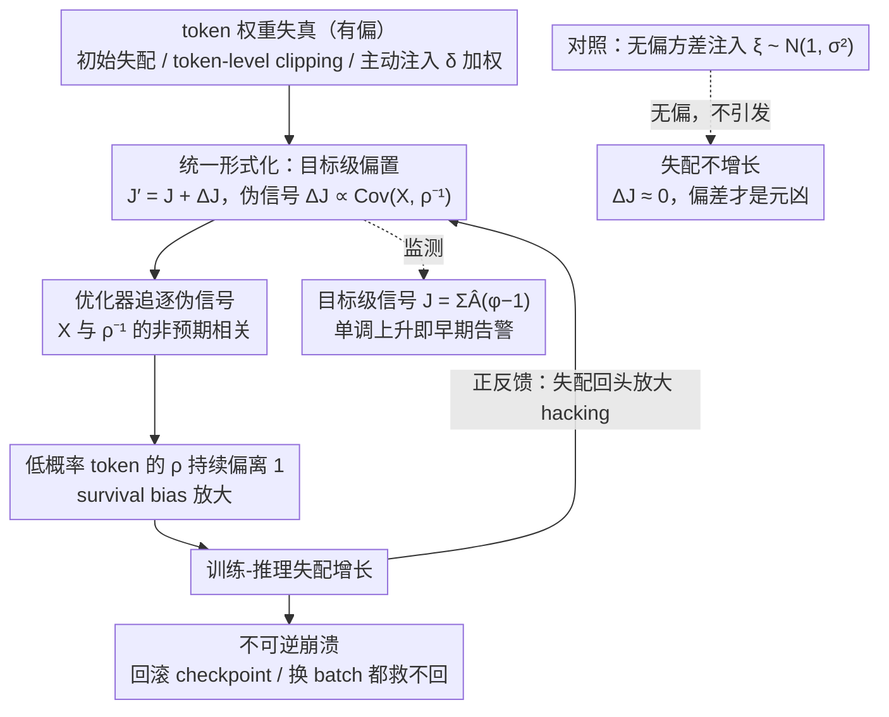

# Probing RLVR Training Instability through the Lens of Objective-Level Hacking

**会议**: ICML 2026  
**arXiv**: [2602.01103](https://arxiv.org/abs/2602.01103)  
**代码**: 无  
**领域**: LLM 对齐 / RLHF / 强化学习训练稳定性 / MoE  
**关键词**: RLVR, GRPO, MoE, 训练-推理失配, 客观级 hacking

## 一句话总结
作者提出"objective-level hacking"框架,把 MoE 大模型在 RLVR 中训练-推理差异越训越大的现象归因为 token 级权重失真在优化目标里引入的有偏伪信号,并在 30B MoE 上通过四组实验验证"偏差(不是方差)才是元凶"。

## 研究背景与动机

**领域现状**:RLVR(可验证奖励强化学习,代表算法 GRPO/DAPO/GSPO)已经成为 OpenAI o1、DeepSeek-R1 等推理模型背后的核心后训练范式,在数学/代码/Agent 上展现出比 SFT 更强的泛化和长期收益。

**现有痛点**:特别是 MoE 架构下,RLVR 训练频繁出现"训着训着崩了"——validation 反向下跌,token 熵塌缩,gradient norm 异常。一个最让人困惑的伴生现象是 *训练-推理失配 (training-inference discrepancy)* 持续增长:同一份权重在 vLLM 推理与 Megatron 训练下输出 token 概率越来越不一致,即使每步都同步参数。

**核心矛盾**:这本应是个"基础设施数值精度差异"的瞬态噪声,为什么会随训练单调增长、最终引发不可逆崩溃?现有补丁(TIS、各种 clip 变体、GSPO 序列级 clip)能缓解但没人讲清楚机制。

**本文目标**:回答两个具体问题——(1) 为什么训练-推理失配会累积增长而非保持常数?(2) 哪些常见技术(initial discrepancy、token-level clipping、自定义 token 加权)在不知不觉中往优化目标里塞入了有偏信号?

**切入角度**:把"reward hacking"概念从 verifier 提到 *优化目标层面*——任何 token 级权重的微调都等价于在原 GRPO 目标外加了一个 $\Delta\mathcal J(\theta)$ 项,如果这一项与某个伪信号(如 $\rho_{i,t}^{-1}$)正相关,优化就会朝着拉大 discrepancy 的方向走,形成正反馈。

**核心 idea**:用一个统一的公式 $\mathcal J_{\text{dist}}=\mathcal J + \Delta_{\text{dist}}\mathcal J$ 描述各类"token-level 权重失真"对优化目标的隐式偏置,并通过主动注入实验证明 *偏差才是关键*,方差性噪声不会触发崩溃。

## 方法详解

### 整体框架
全文围绕一条因果链展开:任何"token 级权重失真"(初始失配的数值噪声、token-level clipping、人为注入的加权)都会在 GRPO/GSPO 的优化目标上额外叠加一个偏置项 $\Delta\mathcal J(\theta)$,这个偏置是个伪信号,优化器去追它就会把低概率 token 的训练-推理失配越拉越大,失配反过来又放大伪信号,形成正反馈直至不可逆崩溃。论文先在**理论端**把各类失真统一写成 $\mathcal J_{\text{dist}}=\mathcal J(\theta)+\Delta_{\text{dist}}\mathcal J(\theta)$ 的同一种形式,再在**实验端**(Qwen3-30B-A3B MoE,verl + vLLM + Megatron,DAPO-Math-17k)用初始失配/TIS、clip 强度扫描、主动注入、无偏方差对照四组实验,逐步坐实"偏差(而非方差)⇒ 失配增长 ⇒ 崩溃"这条因果链。下图是这条链的全貌——三个关键设计分别对应"统一形式化(偏置怎么来)""主动注入(怎么证明是它)""信号监测 + 正反馈环(为什么不可逆)":

### 关键设计

**1. 目标级 hacking 的统一形式化:把异源"训练事故"都还原成同一个偏置项。** RLVR 里数值误差、token-level clipping、各种自定义加权看起来来源毫不相干,缺一个统一解释,也就无从对症。论文从理想的 GRPO 目标 $\mathcal J(\theta)=\mathbb E_{\text{train}}[\sum_{i,t} X_{i,t}(\theta)]$ 出发(其中 $X_{i,t}=r_{i,t}\hat A_{i,t}/(G|o_i|)$),注意到 rollout 实际是从 $\pi_{\text{infer}}$ 而非 $\pi_{\text{train}}$ 采样,于是真实目标变成 $\mathcal J'(\theta)=\mathcal J(\theta)+\Delta\mathcal J(\theta)$;一阶推导给出这个偏置项 $\Delta\mathcal J(\theta)\simeq \sum_{i,t}\text{Cov}_{\text{train}}(X_{i,t},\rho_{i,t}^{-1})$,其中 $\rho_{i,t}=\pi_{\text{train}}/\pi_{\text{infer}}$ 度量训练-推理失配。同理,token-level clip 等价于乘上一个 $\phi_{i,t}\in\{0,1\}$ 的硬权重,偏置项写成 $\Delta_{\text{clip}}\mathcal J=\mathbb E_{\text{train}}[\sum X_{i,t}(\phi_{i,t}-1)]$。两者归并成统一式 $\mathcal J_{\text{dist}}=\mathcal J+\Delta_{\text{dist}}\mathcal J$。一旦看清这些事故都是在"给某些 token 偷偷换权",就能用同一套注入实验去检验它们,这正是后两个设计的前提。

**2. 主动注入实验作为因果探针:把伪信号做成可"开关"的变量。** Clip 强度和失配同步增长,顶多算相关,不能证明谁导致谁。论文挑了序列级算法 GSPO 当底座——它本身不会引发失配增长,是个干净的对照基线——然后人为对低概率 token($\pi_{\text{train}}<\pi_{\text{low}}=0.1$)乘上权重 $\varphi_{i,t}=\delta$、其余保持 1,扫 $\delta\in\{1.2,2,3\}$,等价于显式往目标里塞一个有偏的 $\Delta_{\text{inj}}\mathcal J=\mathbb E_{\text{train}}[\sum Y_{i,t}(\varphi_{i,t}-1)]$。配套还做了两个对照:一是把低概率 token 的权重反向调低,同样引发失配增长,说明根因是"失真"本身而非加权方向;二是注入无偏方差噪声 $\xi_{i,t}\sim\mathcal N(1,\sigma^2)$,推导出 $\Delta\mathcal J_{\text{var}}\simeq 0$(因 $\xi-1$ 与 $Y_{i,t}$ 独立)。这样就能"开关"伪信号:仅 20% 加权($\delta=1.2$)就立刻引爆失配,无偏方差却完全无效——一次干净的双向因果实验,把"偏差才是元凶、方差不是"钉死。

**3. 目标级信号监测 + 正反馈环:给出可监控的早期告警,并解释崩溃为何不可逆。** Hacking 本是个抽象概念,工程上既看不见也防不住,而且崩溃后回滚 checkpoint、换数据 batch 都救不回来,这个不可逆性也一直没解释。论文定义代理量 $J=\sum_{i,t}\hat A_{i,t}(\varphi_{i,t}-1)$ 实时画在训练曲线上,当 $J$ 与 step 的 Pearson 相关系数显著大于 0,就说明伪信号正在被持续优化(Fig. 6 实测到了这种单调上升)。机制上,低概率 token 的 $\rho_{i,t}$ 在训练中持续向下偏离 1(survival bias 使然),这种偏离又进一步放大 $\Delta\mathcal J$ 的有效强度,于是"失配 ⇄ hacking"互相喂养形成正反馈,一旦启动就停不下来——这正是崩溃不可逆的根源。$J$ 因此成了工业 RLVR 可直接落到训练日志里的早期告警:它一单调上升就停训,不必等 validation 跌完才发现。

### 损失函数 / 训练策略
不引入新的 loss,只对现有 GRPO/GSPO 做"加权目标"的写法变换。所有实验在 4 节点 × 8 A100 上跑,每步 128 problem × 16 response,4 次参数更新,response 长度 8K;GRPO clip 默认 0.2,GSPO 序列级 clip 3e-4/4e-4。

## 实验关键数据

### 主实验

不同稳定化策略下的 discrepancy 与 validation 行为(基于 Figure 2、4、5 的定性结论整理):

| 配置 | discrepancy 增长 | validation | 备注 |
|---|---|---|---|
| GRPO + token clip (vanilla) | 显著上升 | 反向下跌 | 标准 RLVR,稳定性差 |
| + TIS 校正 | 明显减缓 | 提升 | 只改优化目标,不动 infra |
| Token clip strong (ε=0.2) | 最快 | 最早崩溃 | 强 clip = 强偏置 |
| Token clip weak (ε=0.28) | 较慢 | 较好 | 弱 clip 反而稳一些 |
| GSPO (sequence clip) | 不增长 | 稳定 | 无 token 级偏置 |
| GSPO + 注入 $\delta=1.2$ | 触发增长 | 退化 | 仅 20% 加权即可引爆 |
| GSPO + 方差注入 $\xi\sim\mathcal N(1,\sigma^2)$ | 不增长 | 稳定 | 偏差才是元凶,方差不是 |

### 消融实验

| 探究问题 | 设计 | 关键观察 |
|---|---|---|
| Clip 强度 vs. discrepancy | 右 clip ∈{0.2, 0.24, 0.28} | clip 越强 discrepancy 增长越快 |
| 偏差 vs. 方差 | 有偏 vs. 无偏 token 加权 | 无偏方差不引发增长(Eq. (22) 解释) |
| 降低低概率 token 权重 | 与提高对称的扰动 | 同样引发 discrepancy 增长,说明根因是"失真"而非"加权方向" |

### 关键发现
- "感觉应该让训练稳定"的 token-level clip 在 MoE 上反而加速 discrepancy 增长,因为它本质是一种 token 加权失真,在统一框架下完全等价于人为注入伪信号。
- discrepancy 增长是一个 *正反馈* 过程:hacking 让低概率 token 的 $\rho$ 持续偏离 1,而偏离又进一步放大 hacking 的有效强度,所以模型一旦崩溃换 batch / 回滚 checkpoint 都救不回。
- 序列级算法(GSPO)在 MoE 上稳定不是因为"clip 更松",而是因为它在结构上避免了 token 级权重失真,这给未来 MoE-specific RL 算法设计提供了具体准则:*永远不要往目标里塞依赖 token 概率的有偏权重*。

## 亮点与洞察
- 把"reward hacking"的概念水平迁移到"objective hacking",首次把训练-推理失配这种"基础设施 bug"解释成"算法层有偏目标"的产物,提供了真正可重复的机制解释。
- 主动注入实验设计极漂亮:用 GSPO 当稳定底座,显式开/关 $\delta$ 与 $\sigma$,等价于做了一次干净的双向因果实验。
- 给工业 RLVR 一个 *可监控* 的早期信号 $J=\sum \hat A_{i,t}(\varphi_{i,t}-1)$,而不是只能事后看 validation 崩了再回滚。

## 局限与展望
- 实验只在 Qwen3-30B-A3B 一个 MoE 上完成,稠密模型与其他 MoE 路由策略下结论强度未知。
- 框架解释了"什么会引发崩溃",但还没给出"怎么自动消偏";潜在方向是把 importance sampling 校正与 token 加权失真的双方都纳入统一目标修复。
- A100 数值精度比 H100 低,作者承认这放大了 initial discrepancy;在更高精度硬件上 hacking 的触发阈值可能不同。

## 相关工作与启发
- **vs DAPO / Dr.GRPO 等 GRPO 变体**:它们从经验出发改 clip / advantage / 长度归一化,本文给出了一个能解释"为什么这些改有效"的统一公式 $\mathcal J=\mathcal J+\Delta\mathcal J$。
- **vs GSPO (Zheng 2025)**:GSPO 是工程层面发现"序列 clip 更稳",本文用 objective-level hacking 给出了机制解释,把它的优点从"试出来的"变成"理论上必然的"。
- **vs TIS (Yao 2025)**:TIS 直接对目标做 importance sampling 修正,本文把它定位为"在 $\Delta\mathcal J$ 这一层做的对症下药",并展示了 TIS 并不能完全消除 MoE 下的 discrepancy。

## 评分
- 新颖性: ⭐⭐⭐⭐ 提出 objective-level hacking 概念并给出统一公式,首次解释 MoE RLVR 崩溃机制。
- 实验充分度: ⭐⭐⭐⭐ 30B MoE 上做了对照、强度扫描、主动注入、偏差/方差解耦四组实验。
- 写作质量: ⭐⭐⭐⭐ 推导清晰,正反馈环描述直观。
- 价值: ⭐⭐⭐⭐ 给 RLVR 算法设计提供具体准则,并给出可监控的工程信号。

<!-- RELATED:START -->

## 相关论文

- [\[ICML 2026\] Single-Rollout Hidden-State Dynamics for Training-Free RLVR Data Selection](single-rollout_hidden-state_dynamics_for_training-free_rlvr_data_selection.md)
- [\[ICLR 2026\] Exploration vs Exploitation: Rethinking RLVR through Clipping, Entropy, and Spurious Reward](../../ICLR2026/reinforcement_learning/exploration_vs_exploitation_rethinking_rlvr_through_clipping_entropy_and_spuriou.md)
- [\[ICML 2025\] A Theoretical Study of (Hyper) Self-Attention through the Lens of Interactions: Representation, Training, Generalization](../../ICML2025/reinforcement_learning/a_theoretical_study_of_hyper_self-attention_through_the_lens_of_interactions_rep.md)
- [\[ICML 2026\] How Reasoning Evolves from Post-Training Data: An Empirical Study Using Chess](how_reasoning_evolves_from_post-training_data_an_empirical_study_using_chess.md)
- [\[ICML 2026\] Trajectory-Level Data Augmentation for Offline Reinforcement Learning](trajectory-level_data_augmentation_for_offline_reinforcement_learning.md)

<!-- RELATED:END -->
