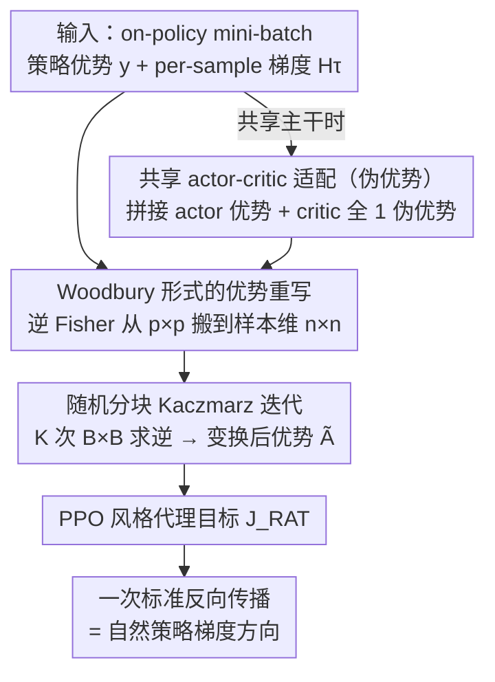

# Randomized Advantage Transformation (RAT): Computing Natural Policy Gradients via Direct Backpropagation

**会议**: ICML2026  
**arXiv**: [2605.18591](https://arxiv.org/abs/2605.18591)  
**代码**: https://github.com/agent-lab/ICML2026-RAT  
**领域**: 强化学习  
**关键词**: 自然策略梯度, Woodbury 公式, Kaczmarz 迭代, 优势变换, on-policy RL  

## 一句话总结
通过 Woodbury 恒等式把 Tikhonov 正则化的自然策略梯度改写为"带有变换后优势的普通策略梯度"，再用随机分块 Kaczmarz 迭代在 mini-batch 上求解这个优势变换，从而完全绕开 Fisher 矩阵的显式构造、共轭梯度内循环以及 KFAC 那类架构相关的曲率近似——只用一次标准反向传播就能拿到自然策略梯度，并在 MuJoCo 与 Procgen 上匹配或超过 TRPO/ACKTR/KFAC 的表现。

## 研究背景与动机

**领域现状**：自然策略梯度（NPG）通过把普通策略梯度 $\nabla^{\text{PG}}_{\bm{\theta}} J$ 左乘 Fisher 矩阵的逆 $\bm{F}^{-1}$，获得参数化不变的更新方向，是 TRPO、ACKTR、Natural Actor-Critic 乃至 PPO 风格更新的理论根基。理论分析也表明这种"几何修正"能显著改善收敛性质。

**现有痛点**：然而 Fisher 矩阵 $\bm{F}\in\mathbb{R}^{p\times p}$ 的规模与参数量 $p$ 同阶（深度策略动辄百万维），显式构造和求逆都不现实。主流绕路有两条：

- **Hessian-Free + CG**（如 TRPO）：把求逆变成 Fisher-vector product，再用共轭梯度迭代求解；每步要做几十次 CG 内循环，开销大，对共享 actor-critic 网络又难以套用。
- **结构化近似**（如 KFAC）：假定 Fisher 可分解为逐层 Kronecker 积，速度快了但精度让步且强依赖梯度的独立性假设，换个架构就要重新推导。

**核心矛盾**：NPG 的好处来自"用 Fisher 重整梯度方向"，但所有现有实现都要么花大量时间精确求 $\bm{F}^{-1}\bm{g}$，要么牺牲精度换得依赖架构的近似。能不能彻底跳过对 Fisher 的显式操作，仅靠"普通的反向传播"就把自然梯度算出来？

**本文目标**：(1) 找到一种重写方式，让 NPG 在形式上退化为普通策略梯度；(2) 给这种重写一个可扩展的有限样本估计算法；(3) 提供收敛性保证并在大规模基准上验证。

**切入角度**：作者注意到一个被前人零散提及的事实——Tikhonov 正则化的 NPG 等价于一个加权最小二乘问题，而通过 Woodbury 公式 $(\bm{I}+\bm{U}\bm{V})^{-1}\bm{U}=\bm{U}(\bm{I}+\bm{V}\bm{U})^{-1}$，逆矩阵可以从"参数维 $p\times p$"挪到"样本维 $n\times n$"。在批量 RL 设定下 $B\ll p$，把求逆从参数空间转到样本空间立刻打开了新的求解通道。

**核心 idea**：把 $\bm{F}^{-1}$ 完全"吸收"进对优势函数 $A_\pi(s,a)$ 的变换里——NPG 写成 $\bm{H}^\top\bm{\Sigma}\tilde{\bm{y}}$，与普通 PG 唯一的差别就是优势 $\tilde{\bm{y}}=(\lambda\bm{I}_n+\bm{H}\bm{H}^\top\bm{\Sigma})^{-1}\bm{y}$；再用随机分块 Kaczmarz 在 on-policy mini-batch 上迭代逼近这个变换。

## 方法详解

### 整体框架

把 $n=|\mathcal{S}||\mathcal{A}|$ 记作"样本空间维度"，$p=|\bm{\theta}|$ 记作"参数维度"，$\bm{H}\in\mathbb{R}^{n\times p}$ 的行为 $\partial_{\bm{\theta}}\log\pi$，$\bm{y}\in\mathbb{R}^n$ 是优势向量，$\bm{\Sigma}$ 是 $d_\pi(s)\pi(a|s)$ 的对角加权矩阵。整个 pipeline 走三步：

1. **重写**：Tikhonov 正则化 NPG $\nabla^{\text{T-NPG}}=(\lambda\bm{I}_p+\bm{H}^\top\bm{\Sigma}\bm{H})^{-1}\bm{H}^\top\bm{\Sigma}\bm{y}$ 通过 Woodbury 两次变形后等价于 $\bm{H}^\top\bm{\Sigma}\tilde{\bm{y}}$，其中 $\tilde{\bm{y}}=(\lambda\bm{I}_n+\bm{H}\bm{H}^\top\bm{\Sigma})^{-1}\bm{y}$——逆矩阵从 $p\times p$ 缩到 $n\times n$。
2. **近似**：因为 $n$ 在连续动作空间下仍然很大，把 $\bm{\Sigma}$ 的加权用 Monte Carlo 采样去近似，把求 $\tilde{\bm{y}}$ 改写成 $\min_{\bm{g}}\|\bm{y}-\bm{H}\bm{g}\|_{\bm{\Sigma}}^2+\lambda\|\bm{g}\|_2^2$ 的正则化最小二乘。
3. **求解**：用随机分块 Kaczmarz 迭代——每步取一个 mini-batch $\tau_j$，做一次 $B\times B$ 求逆，迭代 $K$ 次后把得到的 $\tilde{A}_j(s,a)$ 塞进一个 PPO 风格的代理目标 $J_{\text{RAT}}(\bm{\theta})=\mathbb{E}[\frac{\pi(a|s;\bm{\theta})}{\pi_{\text{old}}(a|s)}\tilde{A}_j(s,a)]$，对它做一次标准反向传播就拿到自然策略梯度方向。共享主干网络时，再额外引入一个 critic 端的伪优势把 actor、critic 拼进同一次迭代。

### 关键设计

**1. Woodbury 形式的优势重写：把"逆 Fisher × 梯度"改写成"普通梯度 × 变换后优势"**

所有改进 NPG 效率的工作都卡在同一处——怎么对 $p\times p$（参数百万维）的 Fisher 求逆。RAT 的破局点是对 $(\lambda\bm{I}_p+\bm{H}^\top\bm{\Sigma}\bm{H})^{-1}\bm{H}^\top\bm{\Sigma}$ 反复套两次 Woodbury 恒等式 $(\bm{I}+\bm{U}\bm{V})^{-1}\bm{U}=\bm{U}(\bm{I}+\bm{V}\bm{U})^{-1}$，把逆矩阵从参数维搬到样本维：

$$\nabla^{\text{T-NPG}}_{\bm{\theta}} J=\bm{H}^\top\bm{\Sigma}\,(\lambda\bm{I}_n+\bm{H}\bm{H}^\top\bm{\Sigma})^{-1}\bm{y}.$$

这个式子可以原样读成"普通策略梯度，只是优势从 $A_\pi$ 换成了 $\bar{A}_\pi=[(\lambda\bm{I}_n+\bm{H}\bm{H}^\top\bm{\Sigma})^{-1}\bm{y}]_{(s,a)}$"。它有效的关键在于两点：求逆从 $p\times p$ 缩到 $n\times n$，只要 batch 比参数小代价立刻可控；而且所有曲率信息都被压进"优势"这一个标量里，下游优化器、损失结构完全不用动，天然兼容所有以 advantage 为接口的算法（PPO、A2C、GAE）。

**2. 随机分块 Kaczmarz 迭代：把一次 $n\times n$ 求逆切成 $K$ 次 $B\times B$ 求逆**

连续动作下 $n=|\mathcal S||\mathcal A|$ 仍然很大，于是把求 $\tilde{\bm y}$ 写成正则化最小二乘 $\min_{\bm g}\|\bm y-\bm H\bm g\|_{\bm\Sigma}^2+\lambda\|\bm g\|_2^2$，再用随机分块 Kaczmarz 在 on-policy mini-batch 上迭代逼近。每次随机取一个 mini-batch $\tau_j$ 做正则化投影，proximal 子问题有闭式解

$$\bm{g}_j=\bm{g}_{j-1}+\bm{H}_{\tau_j}^\top\big[(\lambda\bm{I}+\bm{H}_{\tau_j}\bm{H}_{\tau_j}^\top)^{-1}(\bm{y}_{\tau_j}-\bm{H}_{\tau_j}\bm{g}_{j-1})\big],$$

括号里的 $B\times B$ 求逆就是"随机化优势变换"$\tilde A_j$（实现上用 `torch.linalg.solve` 而非显式求逆求稳，$\bm H_\tau$ 用 PyTorch per-sample gradients 取，$\bm H\bm H^\top$ 其实就是 NTK、可进一步用 Nyström 压到次线性）。为什么非要加 Tikhonov 写成 proximal 形式？因为经典 Kaczmarz 的硬约束投影在 RL 这种 batch 噪声大、$\bm H_\tau$ 经常秩亏的场景下不稳定；proximal 形式既保证 $(\lambda\bm I+\bm H_\tau\bm H_\tau^\top)$ 始终可逆，又让每步只偏离 $\bm g_{j-1}$ 一点点、把曲率信息逐渐"渗透"进 $\bm g$。和 SPRING 那类带动量的 Kaczmarz 不同，RAT 不跨 rollout 累积 $\bm g_j$，而是在单次 on-policy 数据内部反复 refine，避免 stale gradient。

**3. 架构无关的共享 actor-critic 适配（伪优势）：让共享主干网络"免费"成立**

KFAC、Guzmán-Cordero 这类方法默认每个 head 各算各的曲率再手工合并，一旦 actor 与 critic 共享主干就难以处理。既然第一项设计已经把 NPG 退化成普通 PG 形式，共享主干、共享损失就成了自然的事：仿照 ACKTR 把 critic 当作以预测均值为参数的 Gaussian 似然，再额外引入一个 critic 端的"伪优势"（如全 1 向量），把 actor 优势 $\bm y^\pi$ 与 critic 伪优势 $\bm y^V$ 拼起来送进同一次 RAT 迭代，得到一个共享代理损失。梯度由 autograd 自动处理，不必手工区分哪些参数属于 actor、哪些属于 critic 再加权合并；配合 $\ell_2$ 梯度裁剪 $\alpha_j=\min(\eta,\nu/\|\bm g_j\|_2)$ 保证训练稳定。这正是 RAT 在共享网络场景里碾压需要手动拆 Fisher 的 KFAC 的原因。

### 损失函数 / 训练策略

总目标是 $J_{\text{RAT}}(\bm{\theta})=\mathbb{E}_{(s,a)\sim\mathcal{D}_k}\!\left[\frac{\pi(a|s;\bm{\theta})}{\pi_{\text{old}}(a|s)}\tilde{A}_j(s,a)\right]$，与 PPO 共享重要性采样比的写法。每个 on-policy rollout 内做 $K$ 次内层 Kaczmarz 迭代刷新 $\tilde{A}_j$，每次都对应一次标准反向传播。Tikhonov 系数 $\lambda$ 既保证 batch 内 $(\lambda\bm{I}+\bm{H}_\tau\bm{H}_\tau^\top)$ 可逆，又控制收敛速度——理论上 $\lambda$ 越小、$\mu=\lambda_{\min}(\mathbb{E}[\bm{P}_\tau])$ 越大、收敛越快。

理论上有两条结果：在"优势完全 compatible"假设下，$\mathbb{E}\|\bm{g}_j-\bm{g}^*\|_2^2\le(1-\mu)^j\|\bm{g}_0-\bm{g}^*\|_2^2$（线性收敛 Theorem 1）；带噪声时多出一个 $\eta^2/\mu$ 误差地板（Theorem 2），这也是为什么实践中要做梯度范数裁剪。

## 实验关键数据

### 主实验

MuJoCo 连续控制（separate actor-critic 网络），最终回报 mean ± stderr（5 seeds，1250 epochs ≈ 10M steps），对比 PPO、TRPO/FVP+CG、KFAC、Sophia 等方法。下表挑选共享 actor-critic 场景里的关键数据：

| 任务 | 状态×动作 | RAT (本文) | ACKTR | PPO | Sophia |
|------|-----------|-----------|-------|------|--------|
| Swimmer | 8×2 | **271.6 ± 36.3** | 59.1 ± 13.0 | 191.3 ± 32.7 | 57.9 ± 5.9 |
| HalfCheetah | 17×6 | **4629.2 ± 287.4** | 3630.9 ± 282.6 | 4146.0 ± 107.5 | 899.5 ± 113.2 |
| Ant | 105×8 | **2926.6 ± 353.1** | 23.4 ± 3.2 | 1373.9 ± 26.0 | -7.0 ± 1.4 |
| Humanoid | 376×17 | **5382.7 ± 117.3** | 2571.7 ± 838.7 | 5357.9 ± 150.9 | 669.4 ± 56.2 |
| HumanoidStandup | 376×17 | **146529.7 ± 2317.6** | 127928.5 ± 5433.7 | 130014.2 ± 6463.7 | 111212.6 ± 13449.9 |

在高维 Procgen（ResNet 策略、8 个离散控制任务）上 RAT 也"在全部任务"达到或超过 baselines。低维 Gaussian 高斯参数估计的可视化里，RAT 估计的梯度方向几乎与解析的自然梯度重合，而 vanilla PG 与等高线垂直、明显偏离最优。

### 消融实验（每步 wallclock，单位 ms）

| 方法（HalfCheetah / Ant / Humanoid） | Separate 模式 | Shared 模式 | 说明 |
|--------|---------------|--------------|------|
| RAT (本文) | 9.83 / 10.04 / 18.17 | 11.53 / 11.66 / 19.85 | 比 FVP+CG 快约 2×，且支持共享主干 |
| FVP+CG (TRPO) | 19.86 / 19.95 / 19.81 | 不适用 | CG 内循环开销大 |
| KFAC / ACKTR | 5.60 / 5.61 / 6.57 | 6.92 / 6.85 / 7.87 | 快但精度依赖架构假设 |
| Sophia (diag Fisher) | 3.92 / 3.98 / 5.71 | 5.97 / 6.03 / 7.58 | 最快但回报最差 |
| PPO（vanilla） | 3.12 / 3.18 / 3.22 | 3.70 / 3.70 / 3.72 | 速度上限参考 |

### 关键发现

- **精度与开销平衡**：RAT 单步时间约为 FVP+CG 的一半、约 KFAC 的 2 倍，但回报上同时压过两者；Sophia 这种纯 diagonal 近似最快但在 Ant/Humanoid 上回报崩盘，说明完全丢掉非对角曲率信息是不可接受的。
- **大动作空间收益最显著**：Ant（105×8）和 Humanoid（376×17）这类高维场景里，ACKTR 等 baseline 经常学不动或大幅退步，RAT 仍然稳定提升，印证 Theorem 1 中 $\mu$ 主导收敛速度的分析——RAT 不依赖任何架构假设，矩阵越病态它的优势越明显。
- **共享 actor-critic 是杀手锏**：KFAC 在共享网络下要手工拆 Fisher，本文用伪优势就让共享场景"免费"成立，且在所有任务上都不弱于 separate 配置。

## 亮点与洞察

- **"逆矩阵搬家"是真正的关键洞察**：所有改进 NPG 效率的工作都在改善"怎么求 $\bm{F}^{-1}$"，本文却用 Woodbury 把求逆从参数维搬到样本维——这一步既是数学技巧，也是一种思维框架转换：曲率信息不一定要存在矩阵里，可以存在"被变换后的标量优势"里，从而和现有所有以"优势"为接口的算法（PPO、A2C、GAE）天然兼容。
- **把曲率藏进优势的"工程友好性"被严重低估**：现代 RL 框架（Stable-Baselines、CleanRL、PufferLib）几乎都围绕"算一个 advantage → 走一次 backprop"组织代码，KFAC 需要修改优化器、TRPO 需要嵌入 CG 内循环、ACKTR 要手写共享拆分；RAT 唯一要改的就是优势计算这一函数，几乎可以零侵入接到任何 PPO 实现上。
- **Per-sample gradient × NTK 视角的复用空间**：作者明确指出 $\bm{H}\bm{H}^\top$ 就是 NTK，意味着所有 NTK 近似（Random Features、Nyström、稀疏化）都能直接降低 RAT 的内层求逆开销。这为后续把 RAT 推到 LLM 级别 actor-critic 训练（如 RLHF）留下了清晰的优化通道。

## 局限与展望

- **样本维与参数维的相对关系**：方法假设 $B\ll p$ 才有效率优势；如果未来出现极小参数策略加上巨大 batch，反而会让 $B\times B$ 求逆成为瓶颈。
- **off-policy 与 replay buffer 适配尚未讨论**：随机分块 Kaczmarz 的收敛分析依赖 on-policy 数据分布 $d_\pi(s,a)$，扩展到 SAC、IMPALA 等 off-policy / asynchronous 算法时如何重新加权 $\bm{\Sigma}$ 与控制采样偏差是开放问题。
- **理论假设的现实性**：Theorem 1 假设 $\bm{H}$ 满秩（$p\ll n$），但大型策略加上有限 batch 时这条件经常不满足；论文用 Theorem 2 的"误差地板"做了部分回应，但实际中 $\eta^2/\mu$ 量级如何控制还需要更精细的分析（与梯度裁剪阈值 $\nu$ 的关系尤其值得展开）。
- **可改进方向**：(1) 把内层 Kaczmarz 替换成 SVRG/SARAH 类方差缩减方法；(2) 让 $\lambda$ 自适应于 batch 内 Fisher 谱；(3) 与 SPRING 的动量变体融合，可能进一步加速 ill-conditioned 任务的收敛。

## 相关工作与启发

- **vs FVP+CG (TRPO, Schulman 2015)**：两者都不显式构造 Fisher，但 FVP 求逆走"参数空间内 CG"，每步几十次内循环；RAT 求逆走"样本空间内 Kaczmarz"，每步只需一次 $B\times B$ 求逆 + 一次反向传播，且天然支持共享 actor-critic。
- **vs KFAC / ACKTR (Wu 2017)**：KFAC 依赖逐层 Kronecker 分解，强假设梯度统计独立、对架构敏感；RAT 不对 $\bm{F}$ 做任何结构假设，迁移到 Transformer 策略、CNN 策略只需改 per-sample gradient 实现。
- **vs Guzmán-Cordero et al. 2025**：同样用 Woodbury 改写 NPG，但 Guzmán-Cordero 直接近似 Fisher 逆并需要手工合并 actor/critic 梯度；RAT 把 Woodbury 后的求解交给随机化迭代器，并通过伪优势把共享网络的曲率合并交给 autograd，工程上更干净。
- **vs SPRING (Goldshlager 2024)**：都用 Kaczmarz，但 SPRING 是带动量的、每个 batch 只更新一步、跨 rollout 累积 $\bm{g}$；RAT 在单次 rollout 内多步迭代且不带动量，避免 stale gradient，对 on-policy RL 更友好。

## 评分
- 新颖性: ⭐⭐⭐⭐⭐ Woodbury × 随机化 Kaczmarz × 优势变换的组合方式之前没人这样用，且直接把"自然梯度"退化成"普通梯度形式"，思路非常干净。
- 实验充分度: ⭐⭐⭐⭐ MuJoCo + Procgen + 低维高斯，覆盖了连续/离散/可视化三类场景；但缺乏 LLM 级别 RLHF 的验证。
- 写作质量: ⭐⭐⭐⭐⭐ 推导一步一步交代清楚、收敛性给了两条定理、与 KFAC/FVP+CG/SPRING 的关系都明确说明，读完即可复现。
- 价值: ⭐⭐⭐⭐⭐ 直接给出了"几乎零侵入接入现有 PPO 代码"的自然梯度方案，工程意义明确，且为大规模 RL/RLHF 中重新捡起自然梯度打开了通道。

<!-- RELATED:START -->

## 相关论文

- [\[AAAI 2026\] DiffOP: Reinforcement Learning of Optimization-Based Control Policies via Implicit Policy Gradients](../../AAAI2026/reinforcement_learning/diffop_reinforcement_learning_of_optimization-based_control_policies_via_implici.md)
- [\[ICLR 2026\] Learning to Orchestrate Agents in Natural Language with the Conductor](../../ICLR2026/reinforcement_learning/learning_to_orchestrate_agents_in_natural_language_with_the_conductor.md)
- [\[ICML 2026\] RL4RLA: Teaching ML to Discover Randomized Linear Algebra Algorithms Through Curriculum Design and Graph-Based Search](rl4rla_teaching_ml_to_discover_randomized_linear_algebra_algorithms_through_curr.md)
- [\[CVPR 2026\] Talk2Move: Reinforcement Learning for Text-Instructed Object-Level Geometric Transformation in Scenes](../../CVPR2026/reinforcement_learning/talk2move_reinforcement_learning_for_text-instructed_object-level_geometric_tran.md)
- [\[ACL 2026\] Free Energy-Driven Reinforcement Learning with Adaptive Advantage Shaping for Unsupervised Reasoning in LLMs](../../ACL2026/reinforcement_learning/free_energy-driven_reinforcement_learning_with_adaptive_advantage_shaping_for_un.md)

<!-- RELATED:END -->
