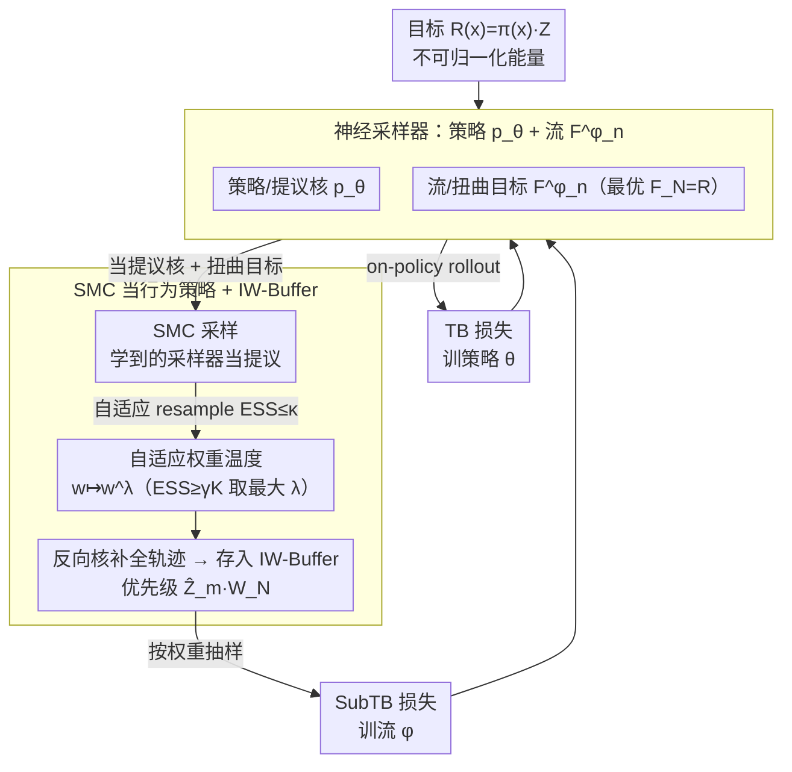

# Reinforced Sequential Monte Carlo for Amortised Sampling

**会议**: ICML 2026  
**arXiv**: [2510.11711](https://arxiv.org/abs/2510.11711)  
**代码**: https://github.com/hyeok9855/ReinforcedSMC (有)  
**领域**: 强化学习 / 概率推理 / 扩散模型 / 神经采样器  
**关键词**: 摊销采样、SMC、MaxEnt RL、GFlowNet、重要性加权回放

## 一句话总结
本文把分层变分推断、MaxEnt 强化学习与序列蒙特卡洛/退火重要性采样统一到一个框架下，让学到的策略与流函数同时充当 SMC 的提议核与扭曲目标，再反过来用 SMC 产生的近目标样本作为离策略行为策略训练神经采样器，并配合自适应权重温度和重要性加权经验回放，在多模目标与 alanine dipeptide 玻尔兹曼分布上同时改善了模式覆盖与训练稳定性。

## 研究背景与动机

**领域现状**：从非归一化能量函数 $R(x)=\pi(x)\cdot Z$ 采样目标分布是 Bayesian 推断、分子构象采样等场景的基础。一支主流路线是经典蒙特卡洛——MCMC（HMC、Langevin）、自适应重要性采样、SMC——它们具备"anytime"性质：粒子越多越接近真实分布。另一支是用神经网络（自回归模型、扩散模型）做"摊销采样"：训练时一次性把能量函数拟合进网络，推理时一次 forward 就出样本。

**现有痛点**：摊销采样器训练时常用反向 KL（即 reverse-KL）目标，存在严重的 mode-seeking 倾向，在多模目标上模式塌缩；如果用 on-policy 数据训练，没看过的模式永远学不到。而经典 SMC 虽能"无偏"接近目标，但推理慢，且粒子简并问题（少数粒子吃掉绝大部分权重）会让有效样本数 $\widehat{\mathrm{ESS}}$ 急速衰减。两类方法各有缺陷又彼此互补，但缺乏一个能让它们互相借力的统一接口。

**核心矛盾**：摊销采样器学不到没见过的模式，但已经学了的部分能给好的提议；SMC 能探索新区域，但需要好的提议核才高效。直接把两者堆叠（学一个采样器再用 MCMC 修一下）并不能形成训练循环——学习仍然只在采样器自己的轨迹上做。

**本文目标**：(i) 在数学层面把 HVI、MaxEnt RL 与 SMC/AIS 三者写在同一组记号下，让神经采样器的策略 $\overrightarrow p_\theta$ 与流函数 $F^\phi_n$ 自然对应 SMC 的提议核与中间目标；(ii) 设计一个互补循环——SMC 用学到的采样器做提议，反过来 SMC 的加权样本作为离策略行为策略训练采样器；(iii) 解决联合训练的方差与稳定性问题。

**切入角度**：GFlowNet 的 trajectory balance/subtrajectory balance 损失允许任意 full-support 行为策略训练而无需重要性修正，这正是把"SMC 的输出当训练数据"接进去的关键接口。

**核心 idea**：把 TB/SubTB 损失写出来，会发现它恰好等于 AIS 对数权重的二阶矩；最优时策略 = 提议核、流 = 中间目标，二者刚好满足细节平衡。这把"训练采样器"与"做 SMC"变成同一件事的两面。

## 方法详解

### 整体框架
把目标 $\pi(x)=R(x)/Z$ 的采样写成 $N$ 步分层模型 $\overrightarrow p_\theta(x_{0:N})=\overrightarrow p_0(x_0)\prod_{n}\overrightarrow p_\theta(x_{n+1}\mid x_n)$，反向核 $\overleftarrow p(x_n\mid x_{n+1})$ 固定。把它视为一个确定性 MDP：状态 $(n,x_n)$，动作就是下一变量取值，奖励 $r((n,x_n),x_{n+1})=\log \overleftarrow p(x_n\mid x_{n+1})$，终态奖励 $\log R(x)$；MaxEnt 目标 (6) 等价于 $\mathrm{KL}(\overrightarrow p_\theta(x_{0:N})\|\pi(x)\overleftarrow p(x_{0:N-1}\mid x))$ 最小化。

整个训练循环（Fig. 1）由四个对象与两个数据流组成：

1. **策略/提议** $\overrightarrow p_\theta$ 与**流/扭曲目标** $F^\phi_n$，最优时 $F^\phi_N(x)=R(x)$；
2. **on-policy 流**：从 $\overrightarrow p_\theta$ 直接 rollout 轨迹用 TB 训策略；
3. **off-policy 流**：用当前 $\overrightarrow p_\theta$ 与 $F^\phi_n$ 跑 SMC 得到 $(x_N,w_N)$，再 backward 采样 $\overleftarrow p(\cdot\mid x_N)$ 拿到完整轨迹，进 IW-Buffer，用 SubTB 训流；
4. **重要性加权经验回放**：把多个批次的 SMC 输出按批级归一化常数估计 $\widehat Z_m$ 与批内自归一权重 $W^{m,k}_N$ 乘起来作为采样概率。

### 关键设计

**1. TB/SubTB 损失 = AIS 对数权重的二阶矩：让"训采样器"和"跑 SMC"变成同一件事**

要让神经采样器和 SMC 互相借力，先得有一个公共接口把两者写在同一组记号下。本文的核心发现是：trajectory balance 损失 $\mathcal L^{\theta,\phi}_{\mathrm{TB}}(x_{0:N})=\big[\log\frac{F^\phi_0(x_0)\prod_n \overrightarrow p_\theta(x_{n+1}\mid x_n)}{R(x_N)\prod_n \overleftarrow p(x_n\mid x_{n+1})}\big]^2$，方括号里恰好就是 AIS 对数重要性权重减去 $\log Z_\theta$，subtrajectory balance 则在子段 $[m,n]$ 上做同样的二阶矩。这条等式一旦成立，"流 $F^\phi_n$"自动对应 SMC 的扭曲目标、"策略 $\overrightarrow p_\theta$"对应提议核：当 SubTB 在长度 1 子段上降到零，细节平衡 $\pi_n(x_n)\overrightarrow p(x_{n+1}\mid x_n)=\pi_{n+1}(x_{n+1})\overleftarrow p(x_n\mid x_{n+1})$ 自动满足，SMC 权重在每一步都保持均匀、根本不用 resample。作者经实验确认最稳的分工是"策略 $\theta$ 只用 TB、流 $\phi$ 只用 SubTB"（详 G.2），其它组合都会让两个目标互相干扰；这样分工既互不打架，又把 SMC 的几何退火、扭曲目标、提议核一次性绑进了神经网络参数。

**2. SMC 当行为策略 + 重要性加权经验回放（IW-Buffer）：用统计学版优先级把过去的探索成果复用起来**

摊销采样器学不到没见过的模式，但 SMC 能探索新区域——问题是怎么把 SMC 的输出喂回去训练采样器。这里的难点不是 TD 误差大小，而是"样本来自不同的提议分布"。本文的行为策略取 on-policy（$\overrightarrow p_\theta$ 直接 rollout）与 off-policy（用 SMC 出的 $x_N$ 反向重建轨迹）的混合，关键在 buffer 里每条样本的优先级怎么定。对第 $m$ 批历史样本，给每条赋权 $\widehat Z_m\cdot W^{m,k}_N$：批级权 $\widehat Z_m$ 是该批对归一化常数 $Z$ 的粒子估计——on-policy 批 $\widehat Z_m=\frac{1}{K}\sum_k w^{m,k}_N$，有 resample 的 SMC 批则按 $\widehat Z_m=\prod_j\big(\sum_k W^{m,k}_{r_{j-1}}\prod_i \widetilde w^{m,k}_i\big)$ 累积；批内权 $W^{m,k}_N$ 是自归一化权。抽样时按 $\widehat Z_m W^{m,k}_N$ 比例从 buffer 取 $x_N$，再用 $\overleftarrow p(x_{1:N-1}\mid x_N)$ 反向补全整条轨迹送进训练。这相当于把传统 prioritised replay 里的 TD 误差换成"对归一化常数的粒子估计"——一种原理上正确的统计学优先级，且 $MK\to\infty$ 时 buffer 仍弱收敛到目标。相比 Langevin local search 这类依赖目标梯度的离策略源，SMC 在 gradient-free 设置下照样能跑，还能借学到的流函数做扭曲。

**3. 自适应权重温度（adaptive importance weight tempering）：让训练早期别被几条样本主宰梯度**

训练早期 $\overrightarrow p_\theta$ 远没满足细节平衡，权重方差会爆炸，少数样本吃掉绝大部分权重、毁掉梯度；硬截断（clipping）虽常用但偏差不可控。本文在归一化前对权重做 $w\mapsto w^\lambda$ 变换（$\lambda\in[0,1]$），但不固定 $\lambda$ 而是自适应——在保证有效样本数不低于阈值的前提下取最大的 $\lambda$：

$$\lambda^\ast=\max\{\lambda\in[0,1]:\widehat{\mathrm{ESS}}(w^\lambda_{1:K})\ge\gamma K\},\quad \widehat{\mathrm{ESS}}=\frac{(\sum_k w^k)^2}{\sum_k (w^k)^2}.$$

因为 $\widehat{\mathrm{ESS}}(w^\lambda)$ 关于 $\lambda$ 单调递减，二分搜索即可，几乎零开销；再配合 $\widehat{\mathrm{ESS}}\le\kappa$ 时才触发 resample 的自适应 resampling 一起用。这套机制让 $\lambda$ 随训练自动从 0 涨到 1（最后理论上回归无偏 AIS），正好对应"训练越靠后越接近最优、越可以信任权重"的直觉——前期用较高偏差换低方差让训练能跑下去，后期自动收回偏差。

### 损失函数 / 训练策略
策略仅用 TB（公式 8），流仅用 SubTB（公式 7），其它组合（双 TB、双 SubTB、混合）经 G.2 验证都不稳。扩散采样器用 Langevin parameterisation 与温度退火-correction 形式（详附录 E）。每个训练 step：(a) 从 $\overrightarrow p_\theta$ 跑 on-policy 轨迹算 TB；(b) 从 IW-Buffer 按权重抽 $x_N$，用 $\overleftarrow p(\cdot\mid x_N)$ 反向补全轨迹算 TB+SubTB；(c) 若启用 SMC 行为策略，跑一次 SMC 把新的 $(x_N,w_N)$ 加入 buffer。

## 实验关键数据

主实验在扩散采样器上做，覆盖 gradient-free 与 gradient-based 两个设置；另在 alanine dipeptide 玻尔兹曼分布与离散空间各做了一组（附录）。5 次独立运行报告均值±标准差。

### 主实验

| 目标 | 指标 | TB（on-policy 基线） | + IW-Buf | TB/SubTB + SMC | + SMC + IW-Buf |
|------|------|----------------------|----------|----------------|----------------|
| GMM40 ($d=2$) | EUBO ↓ | 273.10 | 0.88 | 1.06 | **0.89** |
| GMM40 ($d=2$) | Sinkhorn ↓ | 607.31 | 6.50 | 39.99 | **6.46** |
| GMM40 ($d=5$) | EUBO ↓ | 3156.7 | 1183.3 | 30.1 | **2.3** |
| GMM40 ($d=5$) | Sinkhorn ↓ | 3110.2 | 2813.9 | 330.9 | **83.3** |
| Funnel ($d=10$, gradient-free) | EUBO ↓ | 8.33 | 1.53 | 41.54 | **3.64** |
| ManyWell ($d=32$) | Sinkhorn ↓ | 29.57 | 22.97 | 21.91 | **22.97** |
| Robot4 ($d=10$, gradient-based) | Sinkhorn ↓ | 1.72 | 1.27 | 64.48 | **0.39** |
| GMM40 ($d=50$) | Sinkhorn ↓ | 3903.95 | 4284.49 | × | **3579.17** |
| ManyWell ($d=64$) | MMD ↓ | 0.243 | 0.058 | 0.138 | **0.043** |

### 消融实验

| 配置 | 在多模目标上的表现 | 说明 |
|------|--------------------|------|
| TB only（on-policy） | Sinkhorn $607$、EUBO $273$（GMM40 d=2） | 反向 KL 的 mode-seeking，严重模式塌缩 |
| + IW-Buf | Sinkhorn $6.50$、EUBO $0.88$ | 历史样本帮助找回错过的模式 |
| TB/SubTB + SMC（无 buffer） | Sinkhorn $39.99$ | SMC 探索强但每步样本浪费 |
| + IW-Buf | Sinkhorn $6.46$ | 同时拿到 SMC 的探索与回放的复用 |
| 仅 TB 训流 / 仅 SubTB 训策略（G.2） | 不稳或更差 | 验证"策略只用 TB、流只用 SubTB"分工最优 |
| 固定 $\lambda$ vs 自适应 $\lambda^\ast$ | 固定偏差高、梯度方差大 | 自适应温度按 $\widehat{\mathrm{ESS}}\ge\gamma K$ 自动平衡偏差与方差 |
| Robot4 ($d=10$)：DDS / TB | DDS Sinkhorn 训飞、TB $1.72$ | 显示纯 on-policy 在更复杂控制目标上的脆弱性 |

### 关键发现
- **SMC 与 IW-Buffer 联用是关键**：单纯加 SMC 行为策略时（如 Robot4 上 Sinkhorn $64.48$，GMM40 $d=50$ 直接训飞），SMC 探索带来的高方差反而毁掉训练；加上 IW-Buffer 之后所有指标几乎都到最佳（Sinkhorn $0.39$）。说明"探索"与"样本复用"必须同时做。
- **on-policy 训练 → mode collapse**：纯 on-policy 的 DDS、LV、TB 在 GMM40-$d=2$ 上 EUBO 都在数百量级，意味着大部分模式根本没被覆盖；这与反向 KL 期望梯度是 mode-seeking 的理论预测吻合。
- **gradient-free 设置下尤其重要**：当目标只能查询 $\log R(x)$、查不到梯度时（许多分子模拟场景），传统 Langevin local search 失效；本文方法在 ManyWell ($d=32$) 等 gradient-free 目标上仍把 Sinkhorn 从 $29.57$ 压到 $22.97$。
- **维度扩展性**：GMM40 从 $d=2$ 到 $d=5,50$、Funnel 到 $d=10$、ManyWell 到 $d=64$，方法相对基线的优势随维度增大而拉大，例如 ManyWell-$d=64$ MMD 从 $0.243$ 降到 $0.043$（5.6×）。

## 亮点与洞察
- **三个领域的统一记号**：把 HVI、MaxEnt RL、SMC/AIS 用同一组 $\overrightarrow p_\theta/\overleftarrow p/F^\phi_n$ 写出来后，TB 损失自然变成 AIS log-weight 的二阶矩，最优解自动满足细节平衡——这种结构发现让"训采样器"和"跑 SMC"成为同一件事的不同侧面，理论上极清爽。
- **行为策略的统计学优先级**：用归一化常数估计 $\widehat Z_m$ 而不是 TD 误差做 buffer 优先级，是对传统 prioritised replay 的非平凡升级，且和 IS 文献里的层级 IS 直接接通（Martino et al. 2018a）。
- **自适应 $\lambda^\ast$ 的偏差—方差自动调节**：把 ESS 阈值变成训练旋钮，前期允许较激进的温度（高偏差换低方差以让训练能跑下去），后期自动回归无偏 AIS，符合"采样器从坏到好"的训练曲线。

## 局限与展望
- 训练成本高：每步要做 SMC + buffer 重抽 + on-policy rollout 三件事，相对纯 TB 至少 2–3 倍 wall-clock 开销；论文未给出详细 wall-clock 表，对实际部署门槛存疑。
- 离散空间结果只在附录展开，正文几乎只在扩散采样器上验证；prepend/append 模型类的离散场景（NLP 类目标）覆盖较薄，需要更大规模实验。
- 自适应 $\lambda^\ast$ 与自适应 resampling 的阈值 $\gamma,\kappa$ 仍是手动设置；如何让它们也变成可学参数（或与目标联合优化）是自然方向。
- 与扩散采样器的最新 few-step 工作（Berner et al. 2026）的兼容性论文仅在脚注提及；如果能与 1–4 步扩散结合，推理效率会有质的提升。

## 相关工作与启发
- **vs SCLD（Chen et al. 2025）**：SCLD 同样把 Langevin/MCMC 与受控采样结合，但不把 SMC 输出作为离策略训练数据；本文显式证明 TB 等于 AIS 对数权重二阶矩，把循环训练做成原理上紧的方案。
- **vs Sendera et al. 2024（Langevin 引导的 GFlowNet 训练）**：他们用 Langevin local search 作为离策略源，本文用 SMC，优势在 gradient-free 设置下仍可用，且能借助学到的流函数做扭曲目标。
- **vs Wu et al. 2025（concurrent）**：Wu 等人也把"未训练完的扩散采样器"当 SMC 提议，但没有反过来把 SMC 样本用于训练；本文是双向循环。
- **vs DDS/PIS/LV**：这些纯 on-policy 的扩散采样方法在多模目标上几乎全员 mode collapse，本文用同样的扩散骨架但换成 TB + SMC + IW-Buf，差距巨大（GMM40-$d=5$ EUBO 从数千降到 $2.3$）。

## 评分
- 新颖性: ⭐⭐⭐⭐⭐ 首次把 HVI/MaxEnt RL/SMC 统一在一个损失上，并设计 SMC ↔ 采样器双向训练循环。
- 实验充分度: ⭐⭐⭐⭐ 覆盖 gradient-free/gradient-based、连续/离散、合成多模/分子构象、多种维度，对比基线全。
- 写作质量: ⭐⭐⭐⭐ 公式记号统一、对照清晰，三领域接口讲得透彻。
- 价值: ⭐⭐⭐⭐⭐ 给 amortised sampling 提供了一个能持续从 MC 文献吸取算法（如温度退火、自适应 IS）的统一接口，工程与理论都可复用。

<!-- RELATED:START -->

## 相关论文

- [\[NeurIPS 2025\] Sequential Monte Carlo for Policy Optimization in Continuous POMDPs](../../NeurIPS2025/reinforcement_learning/sequential_monte_carlo_for_policy_optimization_in_continuous_pomdps.md)
- [\[ICLR 2026\] RuleReasoner: Reinforced Rule-based Reasoning via Domain-aware Dynamic Sampling](../../ICLR2026/reinforcement_learning/rulereasoner_reinforced_rule-based_reasoning_via_domain-aware_dynamic_sampling.md)
- [\[NeurIPS 2025\] Feel-Good Thompson Sampling for Contextual Bandits: a Markov Chain Monte Carlo Showdown](../../NeurIPS2025/reinforcement_learning/feel-good_thompson_sampling_for_contextual_bandits_a_markov_chain_monte_carlo_sh.md)
- [\[ICML 2026\] Multi-Agent Decision-Focused Learning via Value-Aware Sequential Communication](multi-agent_decision-focused_learning_via_value-aware_sequential_communication.md)
- [\[ICLR 2026\] BA-MCTS: Bayes Adaptive Monte Carlo Tree Search for Offline Model-based RL](../../ICLR2026/reinforcement_learning/bayes_adaptive_monte_carlo_tree_search_for_offline_model-based_reinforcement_lea.md)

<!-- RELATED:END -->
