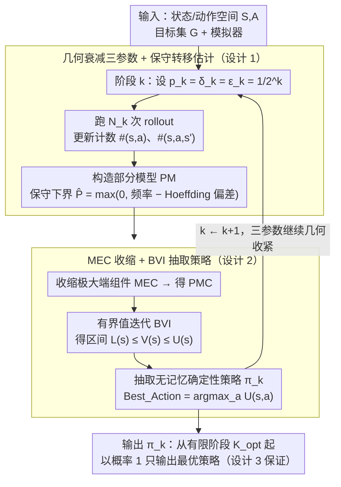

# Reinforcement Learning for Reachability: Guaranteeing Asymptotic Optimality

**会议**: ICML 2026  
**arXiv**: [2605.24740](https://arxiv.org/abs/2605.24740)  
**代码**: https://github.com/amoghp214/asymptotic-ltl-reachability (有)  
**领域**: 强化学习 / 形式化方法 / PAC 学习 / 时序逻辑  
**关键词**: 可达性规约、PAC 学习、渐近最优、有界值迭代、Bounded Value Iteration

## 一句话总结
本文针对未知 MDP 上的可达性规约学习问题，提出一个分阶段细化 PAC 参数的直接学习算法，证明以概率 1 存在有限阶段 $K_{\mathsf{opt}}$，此后只输出最优策略，并用内在 MDP 参数显式刻画该阶段，在量化验证基准上经验地证实最优策略可在极少阶段（中位数 $k=2$）内出现。

## 研究背景与动机

**领域现状**：经典 RL 处理基于奖励的折扣回报目标已有完整理论（$Q$ 学习的渐近收敛、$E^3$/RMAX 的 PAC 界）；而近些年大量工作把目标从奖励推广到 LTL/$\omega$-regular 形式化规约，以表达安全性、活性等复杂时序行为。可达性是这一类规约的核心原语：所有 $\omega$-regular 规约都可归约为可达性问题。

**现有痛点**：对一般 LTL 规约，PAC 学习已被证明不可行（Yang 2022；Alur 2022），除非引入内部 MDP 参数（最小转移概率 $p_{\min}$、混合时间、期望距离等）；这些量在 RL 设置里恰恰未知。另一方面，渐近收敛的工作几乎只有 Le et al. 2024 一篇，其做法是把 LTL 转成极限平均奖励再用一组折扣因子 $\gamma\to 1$ 求解，收敛只能用"外部参数"（折扣因子）刻画，与原 MDP 的结构脱钩，因而无法回答"什么时候最优策略会出现"这种实用问题。

**核心矛盾**：要么用 PAC 但需要事先知道 $p_{\min}$ 等参数（不现实），要么用渐近收敛但只是奖励化简的副产品，缺乏收敛动力学洞察。这两类方法都不能在原 MDP 参数下直接刻画"何时进入最优策略阶段"。

**本文目标**：给出一个直接面向可达性规约、不做奖励转化、收敛阶段能用 MDP 内在量显式表达的学习算法，且要在标准基准上看到这个阶段确实早早出现。

**切入角度**：作者注意到一个关键事实——$p_{\min}$ 虽然未知，但可以"分阶段猜测并逐步精化"。把每个阶段的 PAC 条件（$p_k$、$\delta_k$、$\varepsilon_k$）都按 $1/2^k$ 几何衰减，那么从某个 $K_{\mathsf{PAC}}$ 起 $p_k\le p_{\min}$ 永远成立，再配合可数项 $\sum\delta_k<\infty$ 与 Borel–Cantelli 引理，就能把"分阶段 PAC"升级成"以概率 1 渐近最优"。

**核心 idea**：用分阶段细化的 PAC 子程序逼近一个未知的 $p_{\min}$，让近似容差 $\varepsilon_k$ 最终低于最优—次优策略的值差 $\varepsilon_{\mathsf{diff}}$，从而把 $\varepsilon_k$-最优自动升级为"严格最优"。

## 方法详解

### 整体框架
算法 Asymptotic（Algorithm 1）按阶段 $k=1,2,3,\dots$ 运行。第 $k$ 阶段设定三个参数 $p_k=\delta_k=\varepsilon_k=1/2^k$（猜测的最小转移概率、置信误差、近似容差），然后：

1. 用模拟器跑 $N_k$ 次 rollout，更新转移计数 $\#(s,a)$ 与 $\#(s,a,s')$，构造部分模型 $PM$；
2. 在 $PM$ 上检测并收缩极大端组件（MEC），得到 $PMC$；
3. 在 $PMC$ 上跑有界值迭代 BVI，得到值的下界 $L(s)$ 与上界 $U(s)$；
4. 从 $L,U$ 抽取一个无记忆确定性策略 $\pi_k$ 作为该阶段输出。

输入只是 MDP 的状态/动作空间 $S,A$ 与目标集 $G$，外加一个模拟器；$p_{\min}$、$K_{\mathsf{opt}}$、$K_{\mathsf{PAC}}$ 都不作为输入，仅用于证明分析。

### 关键设计

**1. 几何衰减的三参数 + 保守转移估计：把未知的 $p_{\min}$ 用单调下探序列消化掉**

PAC 公式里硬性需要最小转移概率 $p_{\min}$，但它在 RL 里完全未知。本文的做法不是去找一个无需 $p_{\min}$ 的 PAC，而是承认需要、然后逐阶段精化逼近它：第 $k$ 阶段同时令 $p_k=\delta_k=\varepsilon_k=1/2^k$ 一起几何收紧。转移估计取保守下界——对频率 $\frac{\#(s,a,s')}{\#(s,a)}$ 用 Hoeffding 偏差 $c=\sqrt{\frac{\ln(\delta_P/2)}{-2\cdot\#(s,a)}}$ 减一刀，得 $\hat P(s,a,s')=\max\{0,\frac{\#(s,a,s')}{\#(s,a)}-c\}$，三类误差 $\delta_{TP}+\delta_{EC}+\delta_{N_k}=\delta_k$ 摊到每阶段。$1/2^k$ 单调下探一定会在有限步内压到真 $p_{\min}$ 下方，而 $\sum_k 1/2^k$ 可数，正好契合后面用 Borel–Cantelli 把"大概率正确"升级成"几乎处处正确"。

**2. 基于 MEC 收缩 + BVI 的最优策略抽取：在部分模型 + 下估计上得到可信值区间**

只有部分模型和保守 $\hat P$ 的情况下，要可证地抽出策略。本文用有界值迭代 BVI：更新式 $L(s,a)=\sum_{s'}\hat P(s,a,s')L(s')$ 与 $U(s,a)=\sum_{s'}\hat P(s,a,s')U(s')+(1-\sum_{s'}\hat P(s,a,s'))$ 把"未观察到的概率质量"全塞进 $U$，保证 $L(s)\le V(s)\le U(s)$；对每个极大端组件 MEC 收缩成一个超状态（不含目标的设 $L=U=0$、含目标的设 $L=U=1$），避免值迭代在 EC 上振荡不收敛；策略从 $\mathsf{Best\_Action}(s)=\arg\max_a U(s,a)$ 抽取，MEC 内部再递归用 $\mathsf{Best\_Exit\_Action}$。这里不能简单 Q-learning，因为折扣化会把"$\gamma^k$ 到达目标"和真正的可达概率混淆（Alur 2022 证明两者间不存在保最优规约）；BVI + MEC 收缩是直接面向可达概率、可证收敛的算法，配合保守 $\hat P$ 给出的可信区间正是后面证明的脚手架。

**3. 三阶段证明链路：把"每阶段 PAC"升级成"从某阶段起以概率 1 只输出最优策略"**

光有每阶段的 PAC 还不够，目标是几乎处处最优。证明分三步串起来：Theorem 3.1 用 Ashok 2019 的 PAC 引理证明从 $K_{\mathsf{PAC}}$ 起 $\Pr[\pi_k\in\Pi_{\mathsf{opt}}^{\varepsilon_k}]\ge 1-\delta_k$；Theorem 3.2 注意到无记忆确定性策略只有有限多个，于是最优与次优值差 $\varepsilon_{\mathsf{diff}}>0$，当 $\varepsilon_k\le\varepsilon_{\mathsf{diff}}$ 时 $\varepsilon_k$-最优必然就是严格最优，给出阶段 $K_{\mathsf{opt}}$；Theorem 3.3 用 $\sum_k\delta_k\le K_{\mathsf{opt}}+1$ 加 Borel–Cantelli，得到"非最优事件只出现有限次"以概率 1 成立。Theorem 4.1 再把 $\varepsilon_{\mathsf{diff}}$ 用转移复杂度 $D$（所有概率分母的最小公倍数）显式下界为 $(2D)^{-2|A||S|}\cdot 2^{-2|S|}$，证明 $K_{\mathsf{opt}}$ 只依赖 MDP 内在结构。这正是与 Le et al. 2024 拉开差距的地方——他们只能证值收敛 $J(\pi_n)\to J^*$，本文证的是"策略本身从某点起以概率 1 都是最优策略"，强度高一档、且阶段完全用 MDP 自身的量表达。

### 损失函数 / 训练策略
无显式损失函数（非梯度方法）。每阶段在 $PMC$ 上跑 $2^k\cdot|S|$ 次 BVI 更新作为收敛预算；模拟时以概率 $1-\mu$ 用上一阶段的最优策略、以概率 $\mu$ 随机探索，$\mu\in(0,1]$ 任选；端组件检测用 $\delta_C$-confident 策略，要求"留在 EC 内的状态—动作对"被抽样次数 $n\ge\ln\delta_C/\ln(1-p_k)$，避免低概率出边被漏掉。

## 实验关键数据

实现公开在 GitHub，跑在 Quantitative Verification Benchmark Set 的 9 个标准 MDP 上，每个 benchmark 10 次独立运行，单核 CPU、1 GB 内存、2.4 GHz，36 小时上限。

### 主实验

| 指标 | 收敛阶段（中位数 $k$） | 收敛阶段（均值 $k$） | 备注 |
|------|------|------|------|
| 策略准确率（$\Pi_{\mathsf{opt}}$ 出现） | 2 | 2.3 | 9 个 benchmark 平均 |
| 值上界 $U(s_0)$ 收敛到 1.0 | $\sim 16$ | — | Dining Philosophers |
| 值下界 $L(s_0)$ 收敛到 1.0 | $\sim 16$ | — | Dining Philosophers |
| 跨试验标准差 | 低 | — | 收敛对随机性鲁棒 |

### 消融实验

| 配置 | 关键现象 | 说明 |
|------|---------|------|
| 完整算法 | 策略 $k=2$ 即收敛、值界 $k\sim 16$ 才收敛 | 理论 $K_{\mathsf{opt}}$ 与实际策略涌现匹配 |
| 仅看值界（不看策略） | 显著滞后于策略收敛 | 说明实际 $\varepsilon_{\mathsf{diff}}$ 远大于最坏情况下界 |
| 理论 $N_k$ vs 工程 $N_k$ | 收敛 profile 相似 | 工程实现中的截断与剪枝不破坏渐近性质 |
| 零可达目标（如 Zeroconf）| 策略准确率 0 | 是正确行为：最优可达概率本就是 0 |

### 关键发现
- **策略远远早于值界收敛**：理论上 $K_{\mathsf{opt}}$ 由最坏情况下的 $\varepsilon_{\mathsf{diff}}$ 决定，但实际 MDP 上的有效"策略值差"远比 $(2D)^{-2|A||S|}$ 这种最坏界宽松，因此最优策略在 $k=2$ 阶段就稳定下来，而值上下界还在缓慢收紧。这意味着，如果只关心"找到最优策略"而非"得到紧的值估计"，算法实际开销远低于理论分析所示。
- **几何衰减的鲁棒性**：$p_k=1/2^k$ 这个朴素几何序列在所有 benchmark 上都迅速越过真实 $p_{\min}$，没有需要按问题调参的地方，与混合时间或 $L_1$ 距离等更精细的参数化相比，工程门槛低得多。
- **可达性 ⇒ LTL**：因为 LTL 到可达性的归约（Sickert 2016；Baier–Katoen 2008）是 well-established 的，任何可达性的渐近算法立刻 lift 成 LTL 的渐近算法，本文等于给整个 $\omega$-regular 学习提供了基础结构。

## 亮点与洞察
- **把"参数未知"变成"参数被逐步精化"**：这是把 PAC 不可行性绕开的核心技巧——不是寻找无需 $p_{\min}$ 的 PAC，而是承认它确实需要，但用单调下探序列 + 几何衰减失败概率 + Borel–Cantelli 一并把"事先未知"消化掉。这套思路可以直接迁移到任何"理论需要某个内部参数、但实际可以保守下探"的设置。
- **强于渐近的收敛保证**：传统渐近只说 $J(\pi_n)\to J^*$，意味着允许无穷多次输出非最优策略；本文给出"从某有限阶段起几乎处处都是最优策略"，质上不同。这种"事件有限发生"型保证在安全关键应用（例如机器人在线学习）里有直接意义。
- **$\varepsilon_{\mathsf{diff}}$ 的代数刻画**：用转移复杂度 $D$ 和矩阵 $\det F(\mathrm{Id}-\mathbf A)$ 的整数性给出 $\varepsilon_{\mathsf{diff}}\ge (2D)^{-2|A||S|}\cdot 2^{-2|S|}$ 这个下界，用 Cramer 法则把策略值差和 MDP 概率分母的整数结构挂钩。这个证明范式对任何"有限策略空间 + 有理转移概率"的设置都适用。

## 局限与展望
- 算法是 **model-based**：要显式维护部分模型 $PM$ 与计数器 $\#(s,a,s')$，状态空间一旦巨大就吃内存；作者明确把"model-free 拓展"列为未来工作的关键路径。
- 仅证 **无记忆确定性策略**：对一般可达性这是最优类，但若把方法推到非马尔可夫奖励或带记忆策略的场景（部分 LTL 扩展），$\varepsilon_{\mathsf{diff}}>0$ 的有限性论证就需要重做。
- $K_{\mathsf{opt}}$ 的理论上界 $(2D)^{-2|A||S|}\cdot 2^{-2|S|}$ 看起来恐怖，与实验中 $k=2.3$ 的现实差距巨大，意味着证明仍很松；如何用 problem-specific 结构得到更紧的 $\varepsilon_{\mathsf{diff}}$ 是后续值得做的方向。
- 评测局限在 9 个 quantitative verification benchmark，状态规模相对小；在大规模工业级 MDP 上的扩展性未做测试。

## 相关工作与启发
- **vs Le et al. 2024（LTL→limit-average 奖励）**：他们把 LTL 转成极限平均奖励，再用一串折扣因子逼近，最终给出值收敛 $J(\pi_n)\to J^*$。问题是收敛只能用折扣序列描述、与原 MDP 结构脱钩，且实际无实现。本文不做奖励转化、直接面向可达性，并把收敛阶段绑定到 $\varepsilon_{\mathsf{diff}}$ 这样的内在量。
- **vs Ashok et al. 2019（已知 $p_{\min}$ 的 PAC）**：本文的每阶段子程序就是借用他们的 PAC 引理，区别在于本文承认 $p_{\min}$ 未知并构造分阶段精化把它消化掉。
- **vs Alur et al. 2022（不可归约定理）**：Alur 等人证明可达性目标不能保最优地归约成折扣奖励，这恰恰说明为什么不能套标准 RL；本文给出绕过这一不可能性的直接学习路径。
- **vs Majumdar et al. 2025（regret-free LTL）**：regret-free 是比渐近更弱的保证（即使 zero failure 也允许无穷多非最优策略），本文的"$\Pi_{\mathsf{opt}}$ 之外只出现有限次"严格更强。

## 评分
- 新颖性: ⭐⭐⭐⭐⭐ 首次给出可达性 RL 中"以概率 1 只输出最优策略"的有限阶段刻画，且阶段用内在 MDP 参数显式表达。
- 实验充分度: ⭐⭐⭐ 在 9 个标准 quantitative verification benchmark 上验证，规模适中；缺大规模或连续 MDP 的扩展验证。
- 写作质量: ⭐⭐⭐⭐ 定理链路（3.1→3.2→3.3→4.1）层层递进，把直觉与形式化分离得清楚。
- 价值: ⭐⭐⭐⭐ 给 LTL/$\omega$-regular RL 提供了可用的基础原语；分阶段精化未知参数的范式可以广泛复用。

<!-- RELATED:START -->

## 相关论文

- [\[NeurIPS 2025\] On the Global Optimality of Policy Gradient Methods in General Utility Reinforcement Learning](../../NeurIPS2025/reinforcement_learning/on_the_global_optimality_of_policy_gradient_methods_in_general_utility_reinforce.md)
- [\[NeurIPS 2025\] Learning in Stackelberg Mean Field Games: A Non-Asymptotic Analysis](../../NeurIPS2025/reinforcement_learning/learning_in_stackelberg_mean_field_games_a_non-asymptotic_analysis.md)
- [\[ICML 2025\] Action-Dependent Optimality-Preserving Reward Shaping (ADOPS)](../../ICML2025/reinforcement_learning/action-dependent_optimality-preserving_reward_shaping.md)
- [\[ICML 2026\] Safe In-Context Reinforcement Learning](safe_in-context_reinforcement_learning.md)
- [\[ICML 2026\] Distributional Inverse Reinforcement Learning](distributional_inverse_reinforcement_learning.md)

<!-- RELATED:END -->
