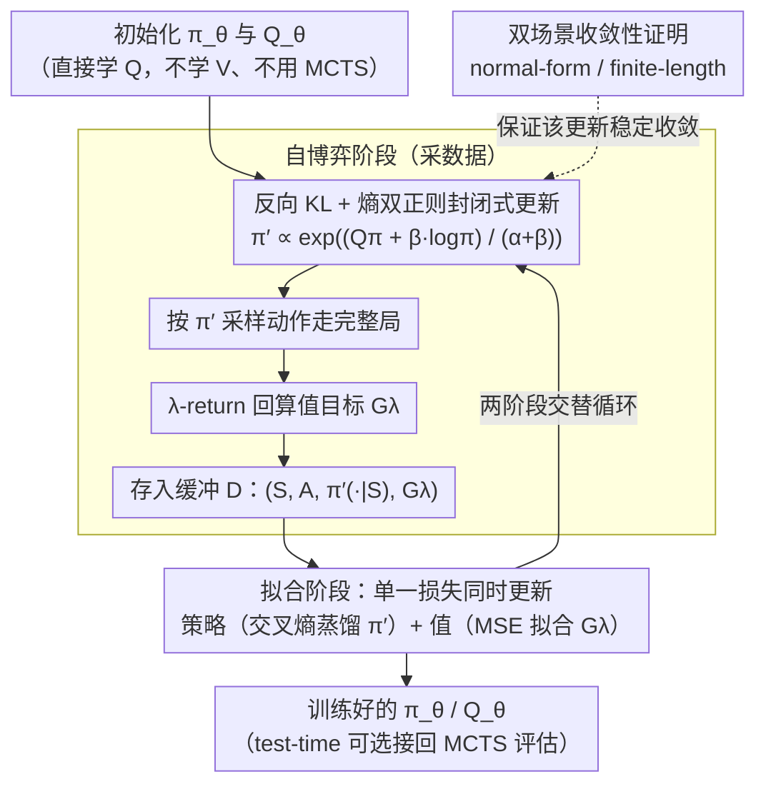

# Revisiting Regularized Policy Optimization for Stable and Efficient Reinforcement Learning in Two-Player Games

**会议**: ICML 2026  
**arXiv**: [2602.10894](https://arxiv.org/abs/2602.10894)  
**代码**: 待确认  
**领域**: 强化学习 / 自博弈 / 棋类  
**关键词**: 正则化策略优化, 反向KL, 熵正则, λ-return, 无搜索AlphaZero  

## 一句话总结
KLENT 把 reverse-KL 正则（控制策略更新幅度）+ 熵正则（维持探索）+ λ-return（平衡偏差方差）这三件成熟"老零件"重新组合到自博弈 model-free RL 里，在 5 个棋类上达到比 Gumbel AlphaZero 高 4 倍训练效率，并给出 normal-form 与 finite-length 两种场景下的收敛性证明。

## 研究背景与动机
**领域现状**：棋类两人零和博弈基本被 AlphaZero 系（AlphaZero / MuZero / Gumbel AlphaZero / TRPO-AlphaZero 等）"网络 + MCTS"范式统治；它们靠 look-ahead 搜索生成强 policy target，但训练成本高到 AlphaZero 收敛需要 10+ GPU-年，复现门槛极高。

**现有痛点**：Muesli、Gumbel AlphaZero 等只是"缩短/降深 MCTS"，搜索这个最贵的组件依然在；另一边纯 model-free 方法（PPO、DQN）在自博弈里早被认定"训练不稳"，几乎没人系统地放回棋类上比拼。

**核心矛盾**：搜索带来稳定性但极贵，去掉搜索就不稳——根源在自博弈是非平稳问题（对手在变）且测试期对手分布会偏移（test-time distribution shift），如果策略更新太猛就崩，如果探索不够就过拟合到自己。

**本文目标**：(i) 设计一个完全不靠 MCTS 的 model-free 自博弈算法；(ii) 给出可证明的稳定性保证，回答"reverse-KL + 熵"为什么能稳；(iii) 实验上证明在多类棋上能比搜索方法更高效。

**切入角度**：作者抓住 Grill et al. (2020) 的洞察——AlphaZero 本质就是在隐式解一个带 KL 正则的策略优化问题——并把这个等价性反过来用：既然 KL 正则是 AlphaZero 稳的本质，那直接显式做 KL 正则化策略优化（再加熵正则解决 distribution shift），就能砍掉 MCTS 这层昂贵的"近似求解器"。

**核心 idea**：把"自博弈 = 一个反向-KL + 熵正则的封闭式策略改进"看成基础，再用神经网络拟合策略和 $Q$ 函数，配合 λ-return 控制值学习方差，得到一个无搜索但稳定的 self-play model-free 算法 KLENT。

## 方法详解

### 整体框架
KLENT 同时参数化策略 $\pi_\theta(a|s)$ 和动作值函数 $Q_\theta(s,a)$（与 AlphaZero 只学 $V(s)$、靠 MCTS 估 $Q$ 形成鲜明对比）。训练在两个阶段间循环：(i) **自博弈阶段（self-play）**：用网络算出封闭式的正则化最优策略 $\pi'$（见下方公式 3），按 $\pi'$ 采样动作走完整局，回算每步的 λ-return 当值目标，把 $(S_t, A_t, \{\pi'(a|S_t)\}_a, G_t^\lambda)$ 存入缓冲 $\mathcal{D}$；(ii) **拟合阶段（fitting）**：用 $\mathcal{D}$ 上的单一损失同时更新策略（交叉熵蒸馏向 $\pi'$）和值函数（MSE 拟合 $G^\lambda$），再回到自博弈阶段。整套训练里**完全没有 MCTS**——MCTS 仅在 test-time 才可选地接回来做评估；而这套两阶段更新之所以能稳定收敛，靠的是关键设计 3 给出的双场景收敛性证明。

### 关键设计

**1. 反向 KL + 熵双正则的封闭式策略更新：用两个正则项分别治住"非平稳"和"分布偏移"，并直接给出 closed-form $\pi'$**

自博弈不稳的两个核心痛点是对手在变（非平稳）和测试期对手分布偏移，KLENT 用两个正则项各管一个。它在每个状态 $s$ 解 $\max_{\pi'} \mathbb{E}_{A\sim\pi'}[Q^\pi(s,A)] - \beta D_{\text{KL}}(\pi'(\cdot|s)\|\pi(\cdot|s)) + \alpha H(\pi'(\cdot|s))$：reverse-KL 把 $\pi'$ 钉在当前 $\pi$ 附近做 gradual update（对抗"对手在变"），熵正则把概率质量铺开（对抗"test-time 没见过的对手"）。靠棋类动作空间有限，解析解为 $\pi'(a|s)=\frac{1}{Z(s)}\exp\big(\frac{Q^\pi(s,a)+\beta\log\pi(a|s)}{\alpha+\beta}\big)$（$Z(s)$ 是归一化常数），策略网络通过最小化交叉熵 $-\sum_a \pi'(a|s)\log\pi_\theta(a|s)$ 蒸馏向它。选 reverse-KL 是因为它 mode-seeking（相比 forward-KL 的 mean-seeking），更适合"找到当前对手的最佳应对"；熵正则确保 $\pi'$ 不塌成 deterministic，避免自博弈陷入循环或过拟合到自己。

**2. λ-return 作为 $Q$ 学习目标：在稀疏 ±1 终局奖励下平衡值估计的偏差与方差**

自博弈里轨迹长、奖励只在终局给，AlphaZero 系常用的 Monte Carlo return（$\lambda=1$）方差爆炸，TD(0)（$\lambda=0$）又因 bootstrap 加策略漂移而偏差大。KLENT 改用 $G^\lambda$ 形式的 λ-return 当 $Q_\theta$ 的拟合目标，作者还在 9x9 Go 上专门做 bias-variance 实验，确认存在一个中间 $\lambda$ 同时压低平方偏差和方差之和。最终损失 $L(\theta)=\mathbb{E}_{\mathcal{D}}\big[-\sum_a \pi'(a|S)\log\pi_\theta(a|S) + (Q_\theta(S,A)-G^\lambda)^2\big]$，跨 5 个棋全部用 $\lambda=e^{-1/8}$。λ-return 是几十年前 Sutton 给的标准解法，但在 AlphaZero 范式下被边缘化，作者把它拉回来当效率关键——消融里 $\lambda=0$ 和 $\lambda=1$ 两端都掉点，说明它是必需配件而非可有可无的 trick。

**3. 双场景的收敛性证明：从理论上回答"为什么这套组合能稳"**

作者明说贡献不在新组件，而在这套组合在两人零和博弈下的新理论刻画，所以收敛证明是把"老药新用"提升为 ICML 贡献的关键。一是 normal-form 两人零和博弈下，证明上述更新在 $\alpha(\alpha+2\beta) > \|R\|_2^2/4$ 时局部线性收敛到唯一不动点（证法是分析 update operator 在不动点处 Jacobian 谱半径 < 1），这比 Sokota et al. 2022 的条件 $\alpha\beta > \|R\|_2^2$ 覆盖更广的 $(\alpha,\beta)$ 区域。二是有限长度博弈下（存在 $T_{\max}$ 使每局必终），证明 KLENT 收敛到熵正则化最优策略 $\pi(a|s)=\frac{1}{Z(s)}\exp(Q^\pi(s,a)/\alpha)$（证法是从终态向后归纳、沿反向 DAG 传播稳定性回根节点），当 $\alpha\to 0$ 这个均衡就逼近原博弈的 Nash 均衡。

### 损失函数 / 训练策略
跨 5 棋共用超参 $(\alpha,\beta,\lambda)=(0.03, 0.1, e^{-1/8})$；6-block ResNet（19×19 Go 用 20-block）；横坐标统一采用"simulator evaluations"以公平比较模型与基线在同等仿真预算下的效率；test-time 评估用 reactive policy（不开 MCTS）以排除搜索带来的混淆。

## 实验关键数据

### 主实验
基线：AlphaZero (AZ)、TRPO-AlphaZero、Gumbel AlphaZero (Gumbel AZ)、DQN、PPO；5 个棋：Animal Shogi、Gardner Chess、9x9 Go、Hex、Othello。Table 2 给出训练 800M simulator evaluations 后、test-time 都开 800-rollout MCTS 时对锚定 baseline 的胜率：

| 棋类 | AZ | Gumbel AZ | **KLENT** |
|------|----|-----------|-----------|
| Animal Shogi | 31±2% | 67±5% | 63±4% |
| Gardner Chess | 64±3% | 70±1% | **81±1%** |
| 9x9 Go | 7±2% | 37±2% | **89±1%** |
| Hex | 8±5% | 47±5% | **98±1%** |
| Othello | 51±2% | 47±3% | **55±6%** |
| **平均** | 32.2% | 53.6% | **77.2%** |

效率层面，五棋平均 KLENT 达到 50% 胜率只需 ~75M simulator evaluations，Gumbel AlphaZero 需要 ~300M——**4× 训练效率**。在分支因子大的棋（9x9 Go 42.3、Hex 90.6）上 KLENT 优势最大；在分支小的（Animal Shogi 7.5、Gardner Chess 9.5）上与搜索基线打平。19x19 Go（20-block ResNet）上 KLENT 与 AlphaZero 仍有竞争力。

### 消融实验
| 变体 | 改动 | 结果 |
|------|------|------|
| **KLENT (full)** | 三件套全开 | 5 棋一致最优 |
| KL Only ($\alpha=0$) | 砍掉熵正则 | Animal Shogi 上 win rate 升到 75% 后**回跌**；策略熵迅速归零 → 失去探索 |
| ENT Only ($\beta=0$) | 砍掉 KL 正则 | $D_{\text{KL}}(\pi'\|\pi)$ 大幅上升 → 策略剧烈跳动；9x9 Go 上下降明显 |
| 1-Step KLENT ($\lambda=0$) | TD(0) | 9x9 Go / Hex 显著掉点 |
| Monte Carlo KLENT ($\lambda=1$) | MC return | 同样在 9x9 Go / Hex 掉点 |

### 关键发现
- 砍掉熵正则后策略熵在 Animal Shogi 上几乎归零、出现"先涨后跌"的不稳定曲线——直接打脸"自博弈不需要显式探索"的常见做法。
- 砍掉 KL 正则后 $D_{\text{KL}}(\pi'\|\pi)$ 失控，验证了 reverse-KL 在"对手不停在变"的非平稳设置里维持 gradual update 的不可替代性。
- $\lambda$ 双端实验（0 与 1 都掉点）说明 λ-return 不是"AlphaZero 风格 MC return 加点 trick"，而是 self-play model-free 高效学习的必需配件。
- 与"分支因子越大、KLENT 优势越大"高度一致——分支大时 MCTS 每决策的仿真预算被打散，去掉搜索的 KLENT 反而省力。

## 亮点与洞察
- "AlphaZero 的本质是 KL 正则化策略优化"被 Grill et al. (2020) 点破后，绝大多数人沿用它解释 AlphaZero；KLENT 反过来把这个观察落地成"显式做 KL 正则就能砍掉 MCTS"，是把一个被低估的理论洞察兑现成工程胜利的典型案例。
- 论文坦言"我们的贡献不在新组件"，但用收敛性证明（normal-form 比已有结果覆盖更广 $(\alpha,\beta)$ 区域、finite-length 用 backward induction 给出 entropy-regularized equilibrium 收敛）把"老药"包装成可发表贡献，方法论上对组合-已有-技术-类工作有借鉴价值。
- 直接同时学 $\pi$ 和 $Q$、用 $\pi'$ 蒸馏更新 $\pi$ 的做法，本质上是 MPO 的两人博弈版；对 robotics 圈而言，KLENT 反向说明 MPO 那条线在棋类同样适用。

## 局限与展望
- 实验聚焦"效率"，没有比谁的渐进性能更高；当算力可以无限堆时 AlphaZero 类是否还更强仍是开问题。
- 收敛性证明分两套场景给出：normal-form 是 local linear convergence，finite-length 假设了游戏长度有界（且暗含可达状态图无环）；现实复杂规则下（如可能重复局面的扩展型博弈）严格性需要进一步论证。
- 对完全/不完全信息的边界没碰——Hex/Othello 都是完全信息，扩展到 imperfect-info（Poker / Diplomacy）时 KL 正则强度要不要随回合调？文中未讨论。
- 超参 $(\alpha,\beta,\lambda)$ 在 5 棋共用同一组就够用，但 19x19 Go 这种长程问题是否需要按棋调参，论文没系统扫。

## 相关工作与启发
- **vs AlphaZero / Gumbel AlphaZero**: 它们都把 MCTS 当"近似策略改进算子"用，KLENT 直接解出封闭式 $\pi'$ 取代之；这等价于把 AlphaZero 里隐式的 KL 正则显式化。
- **vs MPO (Abdolmaleki 2018)**: MPO 也用 reverse-KL 做正则化策略优化，KLENT 可以看成 MPO 的两人零和棋类变体，关键差别是把熵正则项一并保留并给出博弈论收敛性证明。
- **vs SAC / Soft Q-Learning**: 那条线只有熵正则（$\beta=0$），对单 agent OK，但 KLENT 的 ENT Only 消融说明：自博弈下必须同时上 KL 正则才能稳。
- **vs Muesli / TRPO-AlphaZero**: 这类工作走"减小搜索"路线，KLENT 走的是"零搜索极限"，可以被看成那条路线的逻辑终点。

## 评分
- 新颖性: ⭐⭐⭐ 算法零件全是已有的，新的是组合方式 + 两套博弈场景下的收敛性证明 + "零搜索"的工程贯彻。
- 实验充分度: ⭐⭐⭐⭐⭐ 5 棋 + 19x19 Go + 三件套各自消融 + test-time MCTS 公平对比 + 理论与数值实验联动验证。
- 写作质量: ⭐⭐⭐⭐⭐ 自觉地把"贡献不在新组件"写明白，把理论和实证分轨呈现，正则项与失效模式一一对应，读者很容易抓主线。
- 价值: ⭐⭐⭐⭐ 给"棋类自博弈必须 MCTS"这个共识祛魅，对算力受限实验室是直接可用的方法。

<!-- RELATED:START -->

## 相关论文

- [\[ICML 2026\] Global Policy-Space Response Oracles for Two-Player Zero-Sum Games](global_policy-space_response_oracles_for_two-player_zero-sum_games.md)
- [\[ICML 2026\] Convergence of Two-Timescale Markovian Stochastic Approximations with Applications in Reinforcement Learning](convergence_of_two-timescale_markovian_stochastic_approximations_with_applicatio.md)
- [\[ICML 2026\] Learning to Route Languages for Multilingual Policy Optimization](learning_to_route_languages_for_multilingual_policy_optimization.md)
- [\[ICML 2026\] CPMöbius: Iterative Coach–Player Reasoning for Data-Free Reinforcement Learning](cpmobius_iterative_coach-player_reasoning_for_data-free_reinforcement_learning.md)
- [\[ICML 2026\] Metis: Learning to Jailbreak LLMs via Self-Evolving Metacognitive Policy Optimization](metis_learning_to_jailbreak_llms_via_self-evolving_metacognitive_policy_optimiza.md)

<!-- RELATED:END -->
