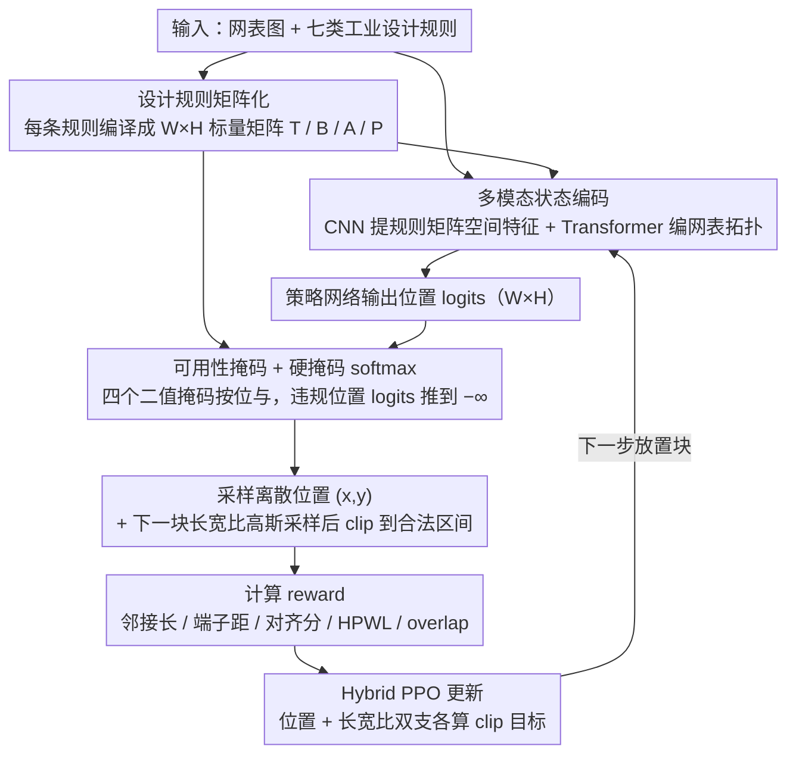

# RulePlanner: All-in-One Reinforcement Learner for Unifying Design Rules in 3D Floorplanning

**会议**: ICML 2026  
**arXiv**: [2601.22476](https://arxiv.org/abs/2601.22476)  
**代码**: https://github.com/Thinklab-SJTU/EDA-AI  
**领域**: 强化学习 / 芯片设计 / 组合优化  
**关键词**: 3D Floorplanning, 设计规则, 动作空间约束, 掩码 RL, Hybrid PPO  

## 一句话总结
本文把 3D 芯片 floorplanning 中七类工业设计规则统一塞进一个 actor-critic RL 框架：核心是把每条规则编译成一张 $W\times H$ 的"邻接矩阵掩码"，在策略 softmax 之前用大负数把违规位置直接屏蔽掉，再加上离散位置 + 连续长宽比的混合动作空间和 Transformer 编码的网表特征，让单一智能体首次能同时满足边界、分组、跨层对齐、非重叠等七条规则，并对未见电路有零样本迁移能力。

## 研究背景与动机

**领域现状**：在先进工艺节点（如 5 nm）下，floorplanning 不再是"摆方块"——它要为每个功能模块确定坐标 $(x_i,y_i)$、所在层 $z_i$、宽高 $(w_i,h_i)$，并同时满足一长串硬件设计规则：边界约束（某些块必须贴某个端子）、分组约束（一组块必须物理相邻形成电压岛）、跨层对齐、预放置、非重叠、轮廓、形状等。现有解法分三派：解析法（NTUplace、DREAMPlace 式梯度下降）、启发式（B*-tree、SA）、以及 RL 法（GraphPlace、MaskPlace、FlexPlanner）。

**现有痛点**：作者在表 1 里把代表性方法逐条对照，发现没有任何一类方法能"全勾"——解析法依赖目标可微，但规则违反惩罚天然非可微；启发式靠人工设计代价项，复杂规则就崩；RL 类大多只在 reward 里加惩罚项，把硬约束当软约束训，最后还得让工程师手动后处理来抹掉违规，劳动密集。

**核心矛盾**：把规则塞进 reward 等于"事后惩罚"，而不是"事前禁止"。在 $W\times H$ 量级的离散位置空间里，绝大部分采样动作都是违规的，靠 reward 信号慢慢学很难收敛；更糟的是规则之间会相互冲突（边界 vs 分组、对齐 vs 非重叠），单一权重的奖励几乎不可能把所有规则同时压到 0 违规。

**本文目标**：让 RL 智能体在采样动作的那一刻就只看得到合法位置，并且这套"过滤"机制必须对**任意条规则**都可扩展。

**切入角度**：作者观察到所有空间型设计规则都可以重写成"对每个候选位置 $(x,y)$ 输出一个标量"——比如边界规则就是"块在 $(x,y)$ 时离指定端子有多远"，分组规则就是"块在 $(x,y)$ 时和组内伙伴的接触边长有多长"。这天然就是一张 $W\times H$ 的矩阵，可以并行算、可以阈值化、可以按 AND 组合。

**核心 idea**：把每条规则编译成一张矩阵掩码 → 按位与得到一张总的"可用性掩码" $\bm M$ → 在策略 logits 上加 $(\bm M-1)\odot 10^8$ 做硬掩码 softmax，从而把硬约束"压"进动作空间本身；同时把规则的连续度量（距离、对齐分）作为 reward 一并优化软目标。

## 方法详解

### 整体框架

RulePlanner 把 3D floorplanning 建模成 episodic MDP：每一步选一个待放置块 $b_t$，状态 $s_t$ 包含若干 $W\times H$ 规则矩阵、画布图像和网表图 $(\bm G,\bm E)$；动作 $a_t=(x_t,y_t,\mathrm{AR}_{t+1})$ 是混合型——离散 2D 坐标 + 给**下一块**的连续长宽比（先给下一块的形状，是因为下一步状态要用 $(w_{t+1},h_{t+1})$ 来重算所有规则矩阵）。流程是：rule matrices + 网表图 → CNN/Transformer 编码 → 策略网络出 logits → 用可用性掩码屏蔽违规位置 → 采样位置 → 把长宽比从高斯采出来再 clip 到 $[\mathrm{AR}_\min,\mathrm{AR}_\max]$ → 计算 reward → Hybrid PPO 更新。

### 关键设计

**1. 设计规则的矩阵化表示：把每条规则写成一张 $W\times H$ 标量矩阵，规则之间能模块化拼装**

以前的方法每加一条规则就得改一遍代码，或者把规则统统塞进 reward 里当软约束，根子在于没有统一的规则表示。RulePlanner 的做法是给每条空间型规则定义一个"位置 → 标量"的可量化指标，于是它天然就是一张 $W\times H$ 的矩阵。边界规则用块-端子的曼哈顿距离 $d(b_i,t_j)=\min_{seg\in Segs(b_i)} d_m(seg,t_j)$（块四条边到端子取最小）构成邻接端子矩阵 $\bm T_{xy}=d(b,t)$；分组规则用块-块共享边长 $l(b_i,b_j)$（同侧才有，否则为 0）构成邻接块矩阵 $\bm B_{xy}=l(b_i,b_j)$；跨层对齐借 FlexPlanner 的对齐分矩阵 $\bm A$；非重叠/越界编码成位置掩码 $\bm P\in\{0,1\}^{W\times H}$。规则之间的组合也统一成算子：一个块要对齐多个端子时用 $\bm T^{(i)}_{xy}=\max_j \bm T^{(ij)}_{xy}$（全满足）或 $\min$（满足之一），多个块组电压岛时用 $\bm B^{(i)}_{xy}=\sum_j \bm B^{(ij)}_{xy}$。所有矩阵都用 GPU meshgrid 并行算。这样一来加新规则只需写一个"位置 → 标量"的函数就能挂进框架，扩展性是整套方法最大的卖点。

**2. 可用性掩码 + 硬掩码 softmax：在采样之前就抹掉违规位置，把硬约束变成 0 概率而非负 reward**

在 $W\times H$ 的离散位置空间里合法位置常常只占 1%，让 RL 靠 reward 慢慢学"哪里不能放"既低效又收不齐七条规则，所以 RulePlanner 干脆把违规位置在采样前就关掉。它先把四张矩阵各设阈值二值化——$\bar{\bm T}_{xy}=\mathbb{1}[\bm T_{xy}\le \bar t]$（端子够近）、$\bar{\bm B}_{xy}=\mathbb{1}[\bm B_{xy}\ge \bar b]$（接触边够长）、$\bar{\bm A}_{xy}=\mathbb{1}[\bm A_{xy}\ge \bar a]$（对齐分够高）、$\bar{\bm P}=\bm P$（基础合法性）——再按元素与得到总掩码 $\bm M=\bar{\bm T}\odot \bar{\bm B}\odot \bar{\bm A}\odot \bar{\bm P}$，最后 $\bar p_\theta=\mathrm{softmax}(p_\theta+(\bm M-1)\odot 10^8)$ 把违规位置的 logits 直接推到 $-\infty$。连续长宽比也照此处理：策略输出 $\mu_\theta\in[-1,1]$（tanh）+ $\sigma_\theta$，采 $z\sim\mathcal{N}(\mu_\theta,\sigma_\theta^2)$ 后仿射 $\bar z=\frac{z+1}{2}(\mathrm{AR}_\max-\mathrm{AR}_\min)+\mathrm{AR}_\min$ 再 clip，保证形状规则始终满足。把规则编进动作空间后，agent 的探索预算全花在合法子集上，训练时间和违规率都直接降一个数量级；相比 IPO/Lagrangian 这类要调乘子的方法，硬掩码不需任何超参且天然 0 违规。

**3. 多模态状态编码 + Hybrid PPO：让单一策略同时吃下空间规则矩阵和网表拓扑，并对离散位置 + 连续长宽比联合优化**

网表的拓扑信息（哪些模块要走线连）和规则矩阵的空间信息天然是两种模态，靠单一 CNN 或单一 GNN 都会丢一边。RulePlanner 把所有规则矩阵 + canvas 图像 + wire mask 沿通道拼起来用 CNN 提空间特征 $\bm y_v$；网表 $(\bm G,\bm E)$ 用 Transformer 编码，节点特征 $\bm g_j=[x_j,y_j,z_j,w_j,h_j,a_j,p_j]$ 经 FC + 正弦位置编码注入放置顺序 $\bm o$，自注意力的 mask 取自 $1-\bm E$ 强制只在拓扑邻居间传消息，再取局部 $\bm e_{local}=\mathrm{FC}(\bm H_2[\mathrm{idx}])$ 和全局 $\bm e_{global}=\mathrm{FC}(\mathrm{AvgPool}(\bm H_2))$ 拼 $\bm y_v$ 送进策略/价值头。训练用 Hybrid PPO，给位置和长宽比两个动作分量各算一项 clip 目标 $L(\theta)=\sum_{k=1}^2 \lambda_k\,\hat{\mathbb{E}}_t[\min(r_t^{(k)}\hat A_t,\bar r_t^{(k)}\hat A_t)]$（$r_t^{(k)}$ 是两支策略各自的概率比、$\hat A_t$ 用 GAE），critic 优化 $L(\phi)=\lambda_\phi\hat{\mathbb{E}}_t[(G_t-V_\phi(s_t))^2]$，reward 把块-块邻接长、块-端子距离、对齐分、HPWL、overlap 五项加权后做自适应归一化。让两支动作各享自己的 clip 信号，避免连续的长宽比梯度把离散位置策略带偏。

### 损失函数 / 训练策略

策略目标按位置/长宽比两支加权求和后做 PPO clip，critic 学 GAE 的 $G_t$；reward 用自适应归一化把不同量纲的几何指标拉到同一尺度，再按规则重要性加权，从而既保证硬约束（被掩码挡住）也优化软目标（HPWL、overlap）。

## 实验关键数据

### 主实验

在公开 3D floorplanning 基准上，以解析法 NTUplace、启发式 B*-3D-SA / WireMask-BBO、以及四类 RL 基线（GraphPlace、DeepPlace、MaskPlace、FlexPlanner）为对比，RulePlanner 是表 1 中**唯一**七条规则（a-g）全部勾上的方法。

| 方法 | 类型 | (a)边界 | (b)分组 | (c)跨层对齐 | (d)预放置 | (e)非重叠 | (f)轮廓 | (g)形状 |
|------|------|---------|---------|-------------|-----------|-----------|---------|---------|
| Analytical (Huang 2023) | 解析 | ✗ | ✗ | ✗ | ✓ | ✗ | ✓ | ✓ |
| B*-3D-SA | 启发式 | ✗ | ✗ | ✗ | ✗ | ✓ | ✗ | ✗ |
| WireMask-BBO | 启发式 | ✗ | ✗ | ✗ | ✓ | ✓ | ✓ | ✗ |
| GraphPlace | RL | ✗ | ✗ | ✗ | ✓ | ✗ | ✓ | ✗ |
| MaskPlace | RL | ✗ | ✗ | ✗ | ✓ | ✓ | ✓ | ✗ |
| FlexPlanner | RL | ✗ | ✗ | ✓ | ✓ | ✓ | ✓ | ✓ |
| **RulePlanner (本文)** | RL | **✓** | **✓** | **✓** | **✓** | **✓** | **✓** | **✓** |

在 HPWL、违规率、运行时间等综合指标上，RulePlanner 也优于此前最强的 RL 基线 FlexPlanner，并且在未见电路上表现出零样本迁移能力。

### 消融实验

| 配置 | 规则满足情况 | HPWL / Overlap | 说明 |
|------|--------------|----------------|------|
| Full RulePlanner | 七条规则全满足 | 最低 | 矩阵掩码 + Hybrid PPO + Transformer 编码全开 |
| w/o 邻接掩码（规则塞 reward） | 边界 / 分组频繁违规 | 显著恶化 | 退化为 MaskPlace 风格，硬约束变软 |
| w/o 网表 Transformer（只用 CNN） | 规则满足，但 HPWL 升高 | 走线变差 | 缺拓扑信号导致连线模块放散 |
| w/o 长宽比 clip（只在 reward 里罚） | 形状规则违规 | 不稳定 | 软约束训不出形状边界 |

### 关键发现

- **掩码 > reward 惩罚**：消去邻接掩码后，原本被掩码屏蔽的违规位置又被策略采样到，迫使后处理介入；这条直接验证了"硬约束硬编码"的必要性。
- **拓扑信号显著影响走线**：去掉 Transformer 后规则仍能满足（因为是掩码强保的），但 HPWL 明显变差，说明 Transformer 注入的网表邻接关系是模型学"哪两块该靠近"的关键。
- **零样本可迁移**：在未见电路上不需要再训练即可保证硬约束满足（因为掩码对任意电路都成立），软目标上也维持竞争力——这是基于规则矩阵的 RL 相对启发式方法的本质优势。

## 亮点与洞察
- 把"空间型硬约束"统一抽象成"$W\times H$ 矩阵 + 阈值二值化 + 按位与"，是一个非常简洁的接口：以后想加一条新规则，只要写一个"位置 → 标量"的函数，就能无缝挂进框架，不用改训练循环。这种"约束即矩阵"的思路也能搬到 PCB 布线、机器人路径规划等同样有 2D 几何约束的任务。
- "把硬约束塞进 softmax 的负无穷里"是一个非常工程友好的 trick：相比 IPO/Lagrangian 等需要调拉格朗日乘子的复杂方法，硬掩码不需要任何超参，且天然保证 0 违规——这正是工业 EDA 流程最看重的。
- 把"给下一块的长宽比"作为当前动作的一部分，是少见但很关键的细节：因为下一步状态需要 $(w_{t+1},h_{t+1})$ 才能算所有规则矩阵，否则会陷入"先有鸡还是先有蛋"的循环。这种"提前一步决定形状"的小设计在序列化决策任务里很值得借鉴。

## 局限与展望
- 整个框架的"硬掩码"思路假设所有规则都能被写成"位置 → 标量"的形式；对于涉及时序、信号完整性、热分布等**非空间**约束的规则，矩阵化表示就不直接适用，需要专门设计编码方式。
- 阈值 $\bar t,\bar b,\bar a$ 是手工选的超参，对不同工艺节点或不同电路规模可能要重调；论文没系统讨论阈值敏感性。
- 一次放一个块的序列化决策对大型电路（成百上千块）来说步数膨胀很快，episode 长度直接决定训练成本；和 DREAMPlace 这种一次性梯度优化相比，RulePlanner 在追求规则满足率的同时牺牲了部分速度。
- 多电压岛、复杂分组结构下，掩码合并的 $\sum$ 与 $\max$ 算子需要按规则手动选；自动化选合并算子是个开放问题。

## 相关工作与启发
- **vs MaskPlace (Lai et al., 2022)**：MaskPlace 首次把"用掩码挡掉非法位置"引入 floorplanning RL，但只处理了非重叠/轮廓两类规则；RulePlanner 把同样的思路推广到七条工业规则，且加入网表 Transformer 编码——可以看作 MaskPlace 的"All-in-One"扩展。
- **vs FlexPlanner (Zhong et al., 2024)**：FlexPlanner 是此前唯一能处理跨层对齐和形状约束的 RL 方法，但边界、分组规则仍靠 reward；RulePlanner 把这两条也并到矩阵掩码体系里，因此成为表 1 中第一个"七勾"的方法。
- **vs 解析方法（DREAMPlace、Huang 2023）**：解析法依赖目标可微而无法处理非可微规则；RulePlanner 用 RL + 掩码绕开可微性，从而能精确满足硬约束，但代价是失去解析法的快速大规模优化优势——两者在大型设计里其实是互补关系。
- **启发**：把"复杂硬约束统一为可组合矩阵 + 硬掩码 softmax"的思路可以迁移到 PCB 布局、机器人栅格规划、网格化调度等所有"在大离散空间里满足多条空间型规则"的任务；"每条规则只需写一个位置 → 标量函数"的接口设计，也是规则可扩展系统的范本。

## 评分
- 新颖性: ⭐⭐⭐⭐ 首次把七条工业 floorplanning 规则统一进矩阵掩码框架，且可扩展接口设计清晰
- 实验充分度: ⭐⭐⭐⭐ 与七类基线对比 + 规则满足表 + 跨电路迁移实验
- 写作质量: ⭐⭐⭐⭐ 规则定义、矩阵推导、掩码合并算子讲得很清楚，表 1 一眼看出贡献
- 价值: ⭐⭐⭐⭐ 对工业 EDA 流程有直接价值，"约束即矩阵 + 硬掩码 softmax"的方法论可推广

<!-- RELATED:START -->

## 相关论文

- [\[ICLR 2026\] One Model for All Tasks: Leveraging Efficient World Models in Multi-Task Planning](../../ICLR2026/reinforcement_learning/one_model_for_all_tasks_leveraging_efficient_world_models_in_multi-task_planning.md)
- [\[NeurIPS 2025\] CORE: Constraint-Aware One-Step Reinforcement Learning for Simulation-Guided Neural Network Accelerator Design](../../NeurIPS2025/reinforcement_learning/core_constraint-aware_one-step_reinforcement_learning_for_simulation-guided_neur.md)
- [\[CVPR 2026\] PanoEnv: Exploring 3D Spatial Intelligence in Panoramic Environments with Reinforcement Learning](../../CVPR2026/reinforcement_learning/panoenv_exploring_3d_spatial_intelligence_in_panoramic_environments_with_reinfor.md)
- [\[ICML 2026\] One Bias After Another: Mechanistic Reward Shaping and Persistent Biases in Language Reward Models](one_bias_after_another_mechanistic_reward_shaping_and_persistent_biases_in_langu.md)
- [\[ICML 2026\] RL4RLA: Teaching ML to Discover Randomized Linear Algebra Algorithms Through Curriculum Design and Graph-Based Search](rl4rla_teaching_ml_to_discover_randomized_linear_algebra_algorithms_through_curr.md)

<!-- RELATED:END -->
