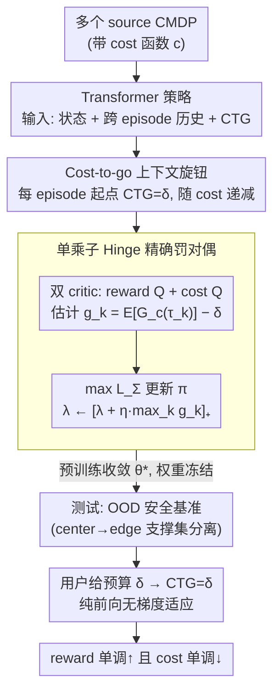

# Safe In-Context Reinforcement Learning

**会议**: ICML 2026  
**arXiv**: [2509.25582](https://arxiv.org/abs/2509.25582)  
**代码**: 暂未公开  
**领域**: 强化学习 / 安全RL / In-context Learning  
**关键词**: 安全RL, In-context RL, CMDP, exact penalty, cost-to-go

## 一句话总结
本文首次把"安全约束"引入 in-context 强化学习（ICRL），提出 SCARED：在预训练阶段用一个**单乘子 + 取正号 hinge** 的精确罚 Lagrangian 让 Transformer 策略学会在测试时**不更新任何参数**地依靠 cost-to-go 上下文做 CMDP 适应，在 OOD 网格 / MuJoCo / Velocity 基准上 reward 单调上升、cost 单调下降，并能随用户给的预算 $\delta$ 在保守与激进之间平滑切换。

## 研究背景与动机
**领域现状**：In-context RL（ICRL）是近两年从 GPT-style sequence model 借来的新范式——把多个任务的交互轨迹拼成长 context 喂给 Transformer / SSM 预训练，测试时遇到新任务**只前向、不反传**，靠不断变长的 history 让网络"在 forward pass 里隐式跑一个 RL 算法"。代表作 AD、DPT、AMAGO、Headless-AD 都在 DarkRoom、Mujoco 上展示了惊艳的零样本适应能力。

**现有痛点**：所有现有 ICRL 工作只关心 reward maximization，**完全没考虑 cost / safety**。但 ICRL 真正诱人的场景（embodied AI、机器人、自动驾驶）恰恰是必须满足硬安全约束的——而且安全要求不是"训练好以后部署时安全"，而是**在 test-time 边探索边学习的整个过程里都安全**，这是 ICRL 比标准 RL 更难的地方。

**核心矛盾**：现有路线没有现成方案——(1) 普通 ICRL 没有 cost 通道；(2) safe meta-RL（MAML+penalty、SafeMeta）依赖测试时的梯度更新，丢掉了 ICRL "纯前向适应"的核心卖点，而且只能拿历史做参数微调，无法捕捉每个 episode 的精细 cost 信号；(3) 若直接套 CMDP 的标准对偶法，给每个 episode 配一个 Lagrange 乘子 $\lambda_k$，会要求预训练时就固定测试 episode 数 $K$、并且后期的 $\lambda_k$ 更新频次远低于前期，优化极不稳定。

**本文目标**：(i) 形式化 safe ICRL 问题：在 CMDP 框架下、不更新参数地满足每个 test episode 的 cost 约束；(ii) 设计一个**单乘子且稳定**的对偶算法；(iii) 构造真正的 OOD 安全基准（不是 chessboard 式插值），证明算法能外推。

**切入角度**：(1) 把 cost-to-go $G_{c,t}(\tau)\!=\!\sum_{i=t+1}^{T} C_i$ 作为**显式上下文输入**喂给策略，让策略在 test time 通过条件这个标量来自动调节激进/保守程度——这是 RTG/CTG 这套 decision-transformer trick 在 safe RL 上的延伸。(2) 把"逐 episode 罚"塌缩为"对最坏 episode 罚"，用一个 hinge 取正号的 surrogate $L_\Sigma$ 和**精确罚**理论保证当 $\lambda \ge \|\lambda^\star\|_\infty$ 时 fixed point 与原问题 optimal 一致。

**核心 idea**：用 **exact-penalty dual + 单乘子 hinge 罚 + CTG 条件 Transformer** 把 CMDP 的安全约束塞进 ICRL 预训练，使得测试时仅靠改变输入的 CTG 数值（不动权重）就能在不同安全预算之间滑动。

## 方法详解

### 整体框架
SCARED 在预训练阶段沿用 reinforcement pretraining 路线（即每一步用标准 online RL loss 优化 $\pi_\theta$，类似 AMAGO/DDPG-style 的 ICRL），在此之上加三层东西：
1. **CMDP 化的环境采样**：每个 source MDP 都带 cost 函数 $c$；策略的输入除了状态、历史 $H_t^k$ 外，多加一个标量 cost-to-go $G_{c,t}(\tau_k)$，每个 episode 开始时设为预算 $\delta$，随实际产生的 cost 递减。
2. **actor-critic 双 critic**：reward Q 函数 $Q_{\theta_v}$ 与 cost Q 函数 $Q_{\theta_c}^c$ 各自用 TD-target 训练；actor 同时最大化 $Q_{\theta_v}$ 并在 episode 超预算时被 cost Q penalty。
3. **单乘子 exact-penalty 对偶迭代**：用 $L_\Sigma(\pi,\lambda)=\mathbb{E}_\pi[\sum_k G(\tau_k)] - \lambda \sum_k [g_k(\pi)]_+$（$g_k(\pi)=\mathbb{E}_\pi[G_c(\tau_k)] - \delta$）作为 surrogate，迭代 $\pi_{t+1}\in\arg\max L_\Sigma(\pi,\lambda_t),\ \lambda_{t+1}=[\lambda_t+\eta\max_k g_k(\pi_{t+1})]_+$。

测试时把模型扔到一个新 CMDP（goal/obstacle 分布严重 OOD），用户指定预算 $\delta$，策略每个 episode 开始把 CTG 初始化为 $\delta$，**不做任何梯度更新**地跑下去，靠 context 内的 (state, action, reward, cost, CTG) 序列让 transformer 自己"在 forward pass 里跑安全 RL"。

### 关键设计

**1. Cost-to-go 作为可控上下文标量：把"用户预算 $\delta$"变成测试时可直接拨的旋钮**

SafeAD 那套必须同时给 RTG 和 CTG 才能控制 reward/cost trade-off，而 RTG 给错了会陷进不可行域。SCARED 把策略写成 $\pi_\theta(\cdot|S_t^k,H_t^k,G_{c,t}(\tau_k))$，在输入里显式塞一个剩余预算标量——每个 episode 起点 $G_{c,0}=\delta$，随实际产生的 cost 递减。预训练时 $\delta$ 在一个区间内均匀采样（SafeDarkRoom $[1,10]$、SafeDarkMujoco $[10,50]$、SafeVelocity $[0,5]$），逼网络学会"看到不同 CTG 就给出不同保守程度的动作"。这个单旋钮天然单调：高 CTG 鼓励冒险拿高 reward、低 CTG 强制保守，把"用户和策略协商安全预算"这件事压缩成一个标量，测试时不动权重、只改这个数就能在保守/激进之间平滑切换。

**2. 单乘子 + Hinge 取正号的 surrogate Lagrangian：用一个乘子管住所有 episode 又不误伤已达标的**

标准 CMDP 对偶 $\max_\pi \min_\lambda L(\pi,\lambda)=\mathbb{E}_\pi[\sum_k G(\tau_k)] - \sum_k \lambda_k(\mathbb{E}_\pi[G_c(\tau_k)] - \delta)$ 要给每个 episode 配一个乘子 $\lambda_k$，既要求预训练时固定测试 episode 数 $K$，后期 $\lambda_k$ 更新频次又远低于前期，优化极不稳定。作者把"逐 episode 罚"塌缩成"对最坏 episode 罚"：

$$L_\Sigma(\pi,\lambda)=\mathbb{E}_\pi\Big[\sum_k G(\tau_k)\Big] - \lambda\sum_k [g_k(\pi)]_+,\quad g_k(\pi)=\mathbb{E}_\pi[G_c(\tau_k)]-\delta,$$

hinge $[x]_+=\max(x,0)$ 只罚真正超预算的 episode，乘子按 $\lambda\leftarrow[\lambda+\eta\max_k g_k(\pi)]_+$ 跟踪最坏 episode。Theorem 1 证明当 $\lambda\ge\|\lambda^\star\|_\infty$ 时该迭代的 fixed point 和原 CMDP 的最优可行策略集合完全相等（exact penalty），方法因此得名 SCARED。三件事各有用处：单乘子让预训练不必预设 $K$，hinge 防止 over-penalize，exact-penalty 又不像 squared penalty 那样有偏、让对偶最优和原问题严格对齐。

**3. 真正外推的 OOD 安全基准（center→edge 分布漂移）：把评测从"棋盘式插值"升级成支撑集分离**

以往 DarkRoom 系列的 OOD 只是"训练时这些格子有目标、测试时换另一些格子"，本质是插值，证明不了 in-context 安全适应。作者构造一个数学可证 OOD 的协议：训练阶段 obstacle/goal 在格子 $(i,j)$ 上以 $P_{\text{train}}((i,j))\propto e^{-\alpha d((i,j),c)}$ 向地图中心 $c$ 聚拢，测试阶段切成 $P_{\text{test}}((i,j))\propto e^{+\alpha d((i,j),c)}$ 向边缘聚拢。Proposition 1 给出 $\lim_{\alpha\to\infty} d_{TV}(P_{\text{train}},P_{\text{test}})=1$、$D_{KL}\to\infty$，即两个分布的支撑集几乎不重叠；再配 SafeVelocity（HalfCheetah/Ant）的 unseen velocity 区间，覆盖 structural OOD + unseen ID 两类泛化。只有在这种支撑集强行分离的设置下，"测试时还能持续 reduce cost"才真正算得上 in-context safe adaptation。

### 损失函数 / 训练策略
- 基础 RL loss 沿 Grigsby et al. (2024a) 的 DDPG-style ICRL；reward critic、cost critic 各用 TD-target 训练。
- 上层加 $L_\Sigma$ 对应的 actor 梯度：$\nabla_\theta \mathbb{E}_\pi[\sum_k G(\tau_k)] - \lambda \nabla_\theta \sum_k [g_k(\pi)]_+$，cost critic 估计 $g_k$。
- $\lambda$ 按 $\lambda_{t+1}=[\lambda_t+\eta \max_k g_k(\pi_{t+1})]_+$ 缓慢更新，$\eta$ 设小一些。
- 预训练时 $\delta$ 在前面给出的区间内均匀采样，把 CTG 作为额外输入；context 用长 transformer 编码完整跨 episode 历史。

## 实验关键数据

### 主实验：5 个 safe 环境跨 episode 自适应

| 环境 | 类型 | SCARED return ↑ | SCARED cost ↓ | Safe AD | SafeMeta | MAML+penalty |
|------|------|---|---|---|---|---|
| SafeDarkRoom (9×9, 25 obstacles) | OOD 网格 | 50 episode 内单调升至 ~0.6 | 单调降至 ~1 | 升慢、cost 减弱 | 不降 cost | 失败 |
| SafetyPoint (SafeDarkMujoco) | OOD 连续控制 | 上升至 ~0.6 | 下降至 ~2 | return 升但 cost **不降** | 不降 | 失败 |
| SafetyCar (SafeDarkMujoco) | OOD 连续控制 | 上升至 ~0.8–1.0 | 下降 | 适应失败 | 不降 | 失败 |
| SafetyHalfCheetah (Velocity) | unseen ID | return ~200 | cost 持续低 | return 降、cost 升 | return 较高但 cost 不降 | 失败 |
| SafetyAnt (Velocity) | unseen ID | return ~200 | cost 持续低 | return 降、cost 升 | return 较高但 cost 不降 | 失败 |

> 横轴是 episode index $k$（$k=0..50$ 等），所有方法都不更新参数（meta-RL 例外）。SCARED 是唯一一类同时 reward 单调↑ 且 cost 单调↓ 的方法。

### 消融 / 关键发现

| 配置 | 行为 | 说明 |
|------|------|------|
| SCARED 完整版 | reward↑ cost↓，且 cost ≤ 用户 $\delta$ | 单乘子 + exact penalty 稳定收敛 |
| 多乘子（每 episode 一个 $\lambda_k$） | 后期 $\lambda_k$ 更新频次低 → 优化震荡 | Figure 5(c) 反例，证明单乘子的必要性 |
| Safe AD（noise variant，Zisman 2024 风格） | 仅在最优轨迹上加噪 → 缺行为多样性 | OOD 适应失败（Appendix D） |
| 改 CTG 数值（测试时调 $\delta$） | $\delta$↑ → 更激进、return↑ cost↑；$\delta$↓ → 保守、return↓ cost↓ | 证明纯前向就能 trade-off |

### 关键发现
- **Safe AD 在简单环境（SafeDarkRoom）能跟，但环境一复杂（SafeDarkMujoco / SafetyAnt）就 return 上去了 cost 不下来**——说明把 cost 当成 conditioning 而非把 cost 嵌入 RL 训练目标是有 ceiling 的。
- **SafeMeta / MAML+penalty 即便允许测试时反传梯度也降不下 cost**——证明"只有 cross-episode in-context history 才足以在线调控 safety"，参数 adaptation 不够。
- **SCARED 把 CTG 当旋钮**：同一组权重，用户给 $\delta=1$ 和 $\delta=10$ 跑出来的策略行为差异巨大且单调，是 deployment-friendly 的关键。

## 亮点与洞察
- **第一次把 safety 引入 ICRL 范式**：之前所有 ICRL 论文都假设 reward-only，这篇直接把缺失的 cost 通道补齐，方法上又证明了"单乘子 hinge"这种简单做法在理论上就是 exact-penalty，比常见的 squared penalty / per-episode 多乘子优雅很多。
- **CTG 作为唯一旋钮**：和 SafeAD 必须配对 RTG/CTG（且配错会进不可行域）相比，SCARED 把这事降到一维标量，这个工程上的简化非常重要——deploy 时人类只用调 $\delta$。
- **Center→edge 的 OOD 协议**：这个评测设计本身就是这个方向往前走的一块好砖，可以被后续 ICRL safety / generalization 工作直接复用，证明你不是在做插值。
- **可迁移设计**：(i) 单乘子 exact-penalty 对偶可以即插即用到任何 actor-critic 类 safe RL（不限 ICRL）替代常见的 PD-Lagrangian；(ii) "把约束相关的 budget 标量作为可控输入"这种思路也可以扩展到 multi-constraint、preference-conditioned RL、anytime fairness 等场景。

## 局限与展望
- **没有测试时的硬安全保证**：方法是统计意义上"测试 episode cost 越来越低"，并非 anytime safe；CTG 用尽以后行为约束如何在 forward pass 内继续生效仍是开放问题。
- **预训练成本仍高**：online reinforcement pretraining 需要跨大量 source CMDP 跑 transformer + 双 critic，paper 给的 Appendix C 说明环境步数很大，比 AD 这种 offline 蒸馏路线昂贵。
- **CMDP 假设单一标量 cost**：实际机器人多个 hazard（碰撞 / 倾覆 / 能耗）通常是多约束，本文乘子单一，扩到 multi-cost 还需重新推导 exact penalty 形式。
- **基准仍偏低维**：SafeDarkRoom 是 9×9 grid、SafeDarkMujoco 也是简化场景，要真正搬到机器人 sim2real 还需要视觉输入和更长 horizon 的验证。
- **没有公开代码**：可复现性受限，理论 + 实证细节虽全但社区采用阻力会比 AMAGO / Headless-AD 之类大。

## 相关工作与启发
- **vs Algorithm Distillation / AMAGO / Headless-AD**：他们做无 cost 的 ICRL（只 reward），本文加 cost 通道 + CTG 输入；本文优势是首次解决 safety，劣势是必须在线 RL 预训练而非 offline 蒸馏。
- **vs SafeAD（Algorithm Distillation for Safe RL）**：他们靠从 PPO-Lagrangian 收集的轨迹做行为克隆 + RTG/CTG 双旋钮，本文用 online RL pretraining + 单 CTG 旋钮；优势是 SafeAD 在复杂连续控制中 cost 不降而 SCARED 降，因为蒸馏受限于演示算法的上限。
- **vs SafeMeta / MAML-with-penalty**：他们靠 test-time 梯度更新做 safe adaptation，本文纯前向无更新；优势是部署友好、不需要 test-time 反传基础设施，并能在 SafeDarkMujoco 类视觉受限场景超过梯度法。
- **vs 标准 PD-Lagrangian / Reward-Constrained Policy Optimization**：经典做法是逐约束维护乘子并用 squared penalty，本文用单乘子 + hinge 的 exact-penalty 形式，理论上给 fixed point 和 primal-optimal 等价的双向证明（Theorem 1）。
- **启发**：把"用户安全预算"作为模型的显式标量输入是一个被严重低估的接口；如果配合 RL pretraining 让模型学会"看到不同 budget 就给出不同行为"，可以把很多需要 test-time tuning 的安全策略压缩成一个推理 pass，非常适合做 embodied agent 的 SDK 风格安全接口。

## 评分
- 新颖性: ⭐⭐⭐⭐⭐ 首次形式化并解决 safe ICRL，理论与算法都是 clean 的"first work"。
- 实验充分度: ⭐⭐⭐⭐ 覆盖 5 个环境 + OOD + unseen ID + budget 扫描，但缺真实机器人和视觉输入。
- 写作质量: ⭐⭐⭐⭐ 问题动机与对偶推导讲得清楚，Theorem 1 与 OOD 度量都给得干净。
- 价值: ⭐⭐⭐⭐⭐ 给 ICRL 走向 embodied/safety-critical 部署补上了一块关键拼图，single-knob CTG 接口对工业界很友好。

<!-- RELATED:START -->

## 相关论文

- [\[ICML 2026\] Safe Reinforcement Learning with Preference-Based Constraint Inference](safe_reinforcement_learning_with_preference-based_constraint_inference.md)
- [\[ICLR 2026\] LongRLVR: Long-Context Reinforcement Learning Requires Verifiable Context Rewards](../../ICLR2026/reinforcement_learning/longrlvr_long-context_reinforcement_learning_requires_verifiable_context_rewards.md)
- [\[ICML 2026\] Safety Generalization Under Distribution Shift in Safe Reinforcement Learning: A Diabetes Testbed](safety_generalization_under_distribution_shift_in_safe_reinforcement_learning_a_.md)
- [\[NeurIPS 2025\] Towards Provable Emergence of In-Context Reinforcement Learning](../../NeurIPS2025/reinforcement_learning/towards_provable_emergence_of_in-context_reinforcement_learning.md)
- [\[ICLR 2026\] Scalable In-Context Q-Learning](../../ICLR2026/reinforcement_learning/scalable_in-context_q-learning.md)

<!-- RELATED:END -->
