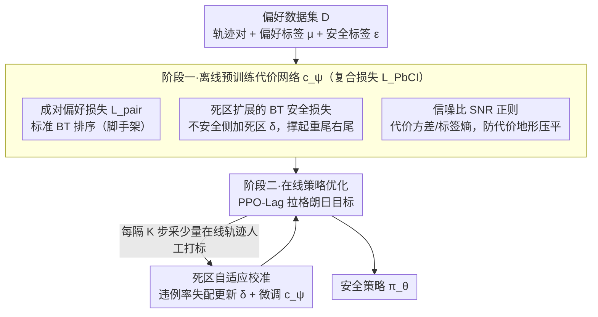

# Safe Reinforcement Learning with Preference-Based Constraint Inference

**会议**: ICML 2026  
**arXiv**: [2603.23565](https://arxiv.org/abs/2603.23565)  
**代码**: 无  
**领域**: 强化学习 / 安全 RL / 偏好学习  
**关键词**: Safe RL, 偏好学习, Bradley-Terry, 死区损失, 信噪比正则  

## 一句话总结
本文提出 PbCRL，用一个带"死区"的扩展 Bradley-Terry 偏好模型从轨迹比较中学安全约束，再叠加一个信噪比正则避免代价函数被压平，最后用两阶段（离线预训练 + 在线少量标注微调）训练打通 Safe RL 的完整流水线，在 Safety Gymnasium、自动驾驶与语言模型对齐三类任务上既显著降代价、又保住奖励。

## 研究背景与动机

**领域现状**：Safe RL 通常被形式化成约束 MDP（CMDP），目标是最大化累积奖励 $\mathcal{J}^R(\pi)$，同时让累积代价的期望 $\mathcal{J}^C(\pi)=\mathbb{E}_\pi[\sum_t \gamma^t c(s_t,a_t)]$ 不超过阈值 $d$。问题在于：现实里的安全约束既复杂、又主观、还往往写不出显式公式（"什么算危险的变道"几乎只能由人判断），所以必须从数据里**反推**约束。

**现有痛点**：从专家示范反推约束（IRL / CBF / 鲁棒优化）需要大量稠密、高质量演示，成本极高；改用更便宜的**偏好数据**（人只需对两条轨迹做二元比较）听起来很美，但现有偏好型方法大多直接套 Bradley-Terry（BT）模型，把约束推理简化成"哪条轨迹更安全"的排序问题。

**核心矛盾**：作者指出 BT 模型在 Safe RL 里其实有两个不易察觉的硬伤。第一，BT 学的是**相对排序**，对绝对值和分布形状无能为力——而真实代价分布天然是**重尾**的（一次碰撞往往引发一连串后续事故，导致 $C(\tau)$ 长尾），BT 推出的近似对称分布会**系统性低估**期望代价，从而把不安全策略错判成安全；第二，几乎所有现有工作只关心代价模型的预测精度，忽视它会不会"压平"代价地形从而拖累后续策略学习。

**本文目标**：给偏好驱动的约束推理同时打两个补丁——让推出的代价分布形状对得上真实重尾，且保留足够的代价方差喂给策略梯度。

**切入角度**：作者注意到，只要在 BT 安全损失里给"不安全"那一侧加一个**死区** $\delta>0$，就能让梯度永远把不安全轨迹的预测代价推得更远，进而**理论上**保证学出的分布右尾更重；与此同时，把"代价方差 / 偏好标签熵"作为信噪比加进损失，可以显式鼓励代价输出具备区分度。

**核心 idea**：在标准 BT 安全损失上加"死区 + 信噪比"双正则，再配合两阶段（离线预训练 + 在线微调死区 $\delta$）训练，让约束推理既对齐真实安全语义，又给策略优化提供有信号的代价梯度。

## 方法详解

### 整体框架

PbCRL 把 CMDP 中未知代价函数 $c(s,a)$ 与阈值 $d$ 一并学出来，并把阈值平移到 0：约束写作 $\mathcal{J}^{\hat C}(\pi)=\mathbb{E}_\pi[\sum_t\gamma^t\hat c(s_t,a_t)]\le 0$。整套训练分两阶段：

1. **离线预训练阶段**：用预先收集好的偏好数据集 $\mathcal{D}=\{(\tau_1,\tau_2,\mu_1,\mu_2,\epsilon_1,\epsilon_2)\}$（其中 $\mu$ 是成对偏好标签，$\epsilon$ 是"是否安全"二值标签）训练代价网络 $c_\psi(s,a)$，损失为 $\mathcal{L}_{PbCI}=\mathcal{L}_{pair}+\mathcal{L}_{safe}^{DZ}+\mathcal{L}_{SNR}$。
2. **在线策略优化阶段**：把学好的 $c_\psi$ 当成 CMDP 的代价函数，用拉格朗日乘子法做 PPO-Lag 风格的策略更新；每隔 $K$ 步采少量在线轨迹由人打标，既继续微调代价网络，又自适应更新死区参数 $\delta$。

### 关键设计

**1. 死区扩展的 BT 安全损失：给"不安全"一侧加一个最小推力，把推出的代价分布右尾撑起来**

纯偏好损失只学相对排序，永远把对称分布学不成重尾，于是会系统性低估期望代价、把不安全策略错判成安全。PbCRL 把"轨迹是否安全"看作和一条虚拟阈值轨迹 $\tau_{th}$（真实代价等于 $d$、估计代价等于 0）的成对比较 $\hat{\mathbb{P}}(\tau\succ\tau_{th})=\sigma(-\hat C(\tau))$；标准安全损失只要求不安全轨迹满足 $\hat C(\tau)>0$，死区版进一步要求 $\hat C(\tau)>\delta$，写成 $\mathcal{L}_{safe}^{DZ}=-\mathbb{E}_\mathcal{D}\big[\epsilon\log\sigma(-\hat C(\tau))+(1-\epsilon)\log\sigma(\hat C(\tau)-\delta)\big]$。作者给了三步链式证明把这个工程小改动坐实：Lemma 3.1 显示对任意不安全轨迹死区损失的梯度都严格更负（$\nabla_{\hat C}\mathcal{L}_{safe}^{DZ}<\nabla_{\hat C}\mathcal{L}_{safe}<0$）；Theorem 3.2 用归纳法把这个微观梯度优势推到多步、得到 $\hat C_t^{DZ}(\tau)>\hat C_t(\tau)$；Corollary 3.3 再把实例级偏移翻成分布级尾部支配 $\mathbb{P}(\hat C^{DZ}\ge z)>\mathbb{P}(\hat C\ge z)$，正式说明死区把分布右尾"撑起来了"。这相当于用最小代价把"分布形状"写进了损失，而不是只调整排序。

**2. 信噪比（SNR）正则：让代价网络保留足够的方差，别把代价地形压平**

策略梯度对代价的"地形高低差"敏感，如果代价网络把所有代价拟合到一个狭窄区间里，地形一平、策略几乎无法被驱动。PbCRL 在每个 batch 上把"代价方差"当信号、把"偏好标签熵"当噪声，写成 $\mathcal{L}_{SNR}=-\zeta\,\mathrm{Var}(\hat C(\tau))/\mathcal{H}(p(\mu))$，最小化它即鼓励较大的 $\mathrm{Var}(\hat C(\tau))$，同时在标签更杂乱（熵高、信息少）的 batch 上自动放松约束。分子分母分别建模信号与噪声，让正则强度随数据噪声水平自适应，比单纯加一项方差惩罚更稳。

**3. 两阶段训练 + 死区自适应校准：把昂贵的在线标注挪到离线，再用违例率把分布漂移压在一个标量上**

完全在线标注昂贵到不可行，全离线又会因离线数据与当前策略分布不一致而漂移。PbCRL 阶段一在固定 $\delta$ 下用整库 $\mathcal{D}$ 跑 $\mathcal{L}_{PbCI}$；阶段二走 PPO-Lag 风格的拉格朗日目标 $\mathcal{L}(\psi,\theta,\lambda)=-[\mathcal{J}^R(\pi_\theta)-\lambda\mathcal{J}^{C_\psi}(\pi_\theta)]$，每隔 $K$ 步抓一小批在线轨迹 $\mathcal{B}$ 让人打标，用违例率失配 $\mathcal{L}_\delta=\|\hat{\mathbb{P}}_{vio}-\mathbb{P}_{vio}\|^2$ 对 $\delta$ 做梯度下降——预测违例率比经验高就调低 $\delta$、反之调高。作者还在标准多时间尺度随机近似条件下给出 $(\psi,\theta,\lambda)$ 几乎处处收敛到局部最优的保证（Theorem 5.2）。妙处在于：违例率是个不依赖真实代价的代理量，恰好把"分布漂移"问题压缩到 $\delta$ 这一个标量参数上去校准。

### 损失函数 / 训练策略

总损失为 $\mathcal{L}_{PbCI}=\mathcal{L}_{pair}+\mathcal{L}_{safe}^{DZ}+\mathcal{L}_{SNR}$，其中 $\mathcal{L}_{pair}$ 是标准 BT 成对交叉熵；策略侧用 PPO-Lag 优化拉格朗日目标，学习率满足 $lr_\lambda=o(lr_\theta)=o(lr_\psi)$ 的三时标分离条件以保证收敛。

## 实验关键数据

### 主实验

在 Safety Gymnasium 上以 PPO-Lag（用真值代价的 oracle 上界）和两类偏好型基线 RLSF、PPO-BT 为对比，PbCRL 在保持接近 oracle 回报的同时把代价压在阈值附近。

| 任务（阈值） | 指标 | PPO-Lag (Oracle) | PbCRL (本文) | RLSF | PPO-BT |
|--------------|------|------------------|--------------|------|--------|
| HalfCheetah (5) | Return | $2619\pm124$ | $\mathbf{2367\pm138}$ | $2084\pm126$ | $2494\pm195$ |
| HalfCheetah (5) | Cost | $4.82\pm0.91$ | $\mathbf{4.66\pm1.03}$ | $3.26\pm0.78$ | （越界） |

### 消融实验

通过逐一关掉死区与 SNR 正则，可以看到两个分量分别对应"安全侧"和"策略侧"的收益。

| 配置 | 代价是否守界 | 回报水平 | 说明 |
|------|--------------|----------|------|
| Full PbCRL | 守 | 接近 oracle | 死区 + SNR + 两阶段全部开启 |
| w/o 死区 | 系统性越界 | 偏高 | 退化成标准 BT，期望代价被低估，策略偏激进 |
| w/o SNR | 守 | 显著下降 | 代价地形被压平，策略梯度信号弱、收敛慢 |
| w/o 在线校准 $\delta$ | 间歇越界 | 中等 | 离线 $\delta$ 与在线轨迹分布不匹配 |

### 关键发现

- **死区主治"安全"，SNR 主治"性能"**：消去死区时代价显著越界（验证了 BT 低估期望的理论分析），消去 SNR 时回报掉得最多（验证了"平坦代价地形伤策略"的论点）。
- **离线 + 在线两阶段显著省标注**：相比全在线偏好基线，PbCRL 把绝大部分标注挪到离线阶段，在线阶段只需一小批轨迹做 $\delta$ 校准。
- **跨域可迁移**：除机器人控制外，作者还在自动驾驶与语言模型对齐场景报告了同向收益，说明"偏好驱动 + 重尾对齐 + 信号保形"的组合不是 Safety Gymnasium 专用配方。

## 亮点与洞察
- 把"BT 模型推不出重尾"这件事**严格证明**出来（Lemma → Theorem → Corollary 三步），而不是只靠图示直觉——这让"加死区"这种看似工程的小改动有了原理支撑。
- 用"代价方差 / 偏好标签熵"这种朴素的 SNR 写法把"代价网络对策略学习的影响"显式建进损失，比单纯方差惩罚更稳，也给了一个评估代价模型质量的新视角。
- 把"违例率失配"当作不依赖真值的代理信号去**自适应调节死区参数 $\delta$**，是一个很轻量、却恰好压住分布漂移的设计，思路可以迁移到其他需要"在线校准超参"的偏好学习场景。

## 局限与展望
- 死区参数 $\delta$ 的"理想值"严重依赖真实代价分布的尾部形态，作者主要靠违例率代理来校准；若违例事件稀疏（如安全余量很大的工业系统），代理信号方差会很大，校准可能不稳定。
- 论文假设可以拿到带二元安全标签 $\epsilon$ 的偏好数据，但很多偏好数据集只有相对比较、没有绝对的安全/不安全判断，此时 $\mathcal{L}_{safe}^{DZ}$ 的目标项不可用。
- 收敛证明依赖标准的三时标分离假设和 Lipschitz 条件，对深层非线性代价网络在实践中是否严格成立仍开放。
- 当前的拉格朗日策略优化只能给出局部最优，对多约束、多阶段任务（如分层安全约束）需要更复杂的拉格朗日结构。

## 相关工作与启发
- **vs RLSF (Reddy Chirra et al., 2024)**：RLSF 用标准 BT 学**二值**代价并要求段级反馈；本文证明这种设置必然低估期望代价，于是用死区把分布形状显式撑起来——RLSF 在 HalfCheetah 上代价确实被压得过低，说明它"看起来安全"是因为代价模型自欺。
- **vs Safe RLHF / PPO-BT (Dai et al., 2024)**：Safe RLHF 把 BT 思路从语言模型搬到约束学习，但同样停留在排序层面；PbCRL 在偏好损失之外补上"安全损失 + 信噪比"两项，等于在 BT 框架内最小侵入地修复了"分布形状"和"信号强度"两个独立问题。
- **vs PPO-Lag (Ray et al., 2019)**：PPO-Lag 假设真值代价已知，是性能上界；PbCRL 的目标就是把偏好数据下的策略尽量逼近这个上界，实验里 HalfCheetah 等任务的回报差距已经收窄到几个百分点。
- **启发**：把"分布形状"作为偏好学习的一等公民来设计损失（而不是默认 BT 的对称假设），以及把"代价模型对策略梯度的影响"作为约束推理的评估维度，都可以推广到 RLHF、奖励建模、风险敏感强化学习等更广义的从偏好/反馈学函数的任务里。

## 评分
- 新颖性: ⭐⭐⭐⭐ 把 BT 模型在 Safe RL 里的两个理论缺陷讲清楚并给出最小侵入的修补
- 实验充分度: ⭐⭐⭐⭐ 覆盖 Safety Gymnasium、自动驾驶、LLM 对齐三类任务并配完整消融
- 写作质量: ⭐⭐⭐⭐ 逻辑链清晰、定理与算法对应明确、图 1 的三分布对比直观
- 价值: ⭐⭐⭐⭐ 给"从偏好学约束"这一脉提供了可迁移的损失模板与收敛保证

<!-- RELATED:START -->

## 相关论文

- [\[ICML 2026\] Safe In-Context Reinforcement Learning](safe_in-context_reinforcement_learning.md)
- [\[ICML 2026\] From Reward-Free Representations to Preferences: Rethinking Offline Preference-Based Reinforcement Learning](from_reward-free_representations_to_preferences_rethinking_offline_preference-ba.md)
- [\[ICML 2026\] Safety Generalization Under Distribution Shift in Safe Reinforcement Learning: A Diabetes Testbed](safety_generalization_under_distribution_shift_in_safe_reinforcement_learning_a_.md)
- [\[ICLR 2026\] Chain-of-Context Learning: Dynamic Constraint Understanding for Multi-Task VRPs](../../ICLR2026/reinforcement_learning/chain-of-context_learning_dynamic_constraint_understanding_for_multi-task_vrps.md)
- [\[ICLR 2026\] Safe Continuous-time Multi-Agent Reinforcement Learning via Epigraph Form](../../ICLR2026/reinforcement_learning/safe_continuous-time_multi-agent_reinforcement_learning_via_epigraph_form.md)

<!-- RELATED:END -->
