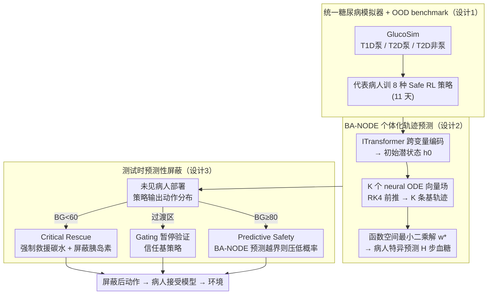

# Safety Generalization Under Distribution Shift in Safe Reinforcement Learning: A Diabetes Testbed

**会议**: ICML 2026  
**arXiv**: [2601.21094](https://arxiv.org/abs/2601.21094)  
**代码**: GlucoSim + GlucoAlg (GitHub, safe-autonomy-lab)  
**领域**: 强化学习 / 安全 RL  
**关键词**: 安全强化学习, 分布偏移, 测试时屏蔽, 神经 ODE, 糖尿病决策  

## 一句话总结
作者在 UVA-Padova 物理模型基础上搭了一个统一的 T1D/T2D 糖尿病模拟器，发现 8 种主流 Safe RL 算法虽然在训练病人上能满足安全约束，但部署到未见病人时 Time-in-Range 普遍掉 8–13%，于是提出用 Basis-Adaptive Neural ODE 预测血糖轨迹、再用预测性屏蔽 (predictive shielding) 在测试时过滤危险动作，让 PPO-Lag / CPO 等基线在 OOD 病人上重新拿回 13–14% TIR。

## 研究背景与动机

**领域现状**：Safe RL 把控制问题建成 CMDP，用 Lagrangian、信任域 (CPO)、投影 (PCPO) 等手段在训练时强制满足 cumulative cost 约束。这类算法在固定动力学下能给出"期望意义"的安全保证，糖尿病管理是被反复研究的安全关键应用。

**现有痛点**：所有 Safe RL 的保证都是"分布相关"的——训练时学到的安全边界跟训练时见到的物理参数绑定。但真实部署里，胰岛素敏感度、吸收率、代谢率因人而异，根本没法在训练集里穷举。已有 RL 糖尿病工作 (fox2020deep / zhu2023offline) 默认训练与测试动力学匹配，且大多只研究 T1D，对人口多样性下的安全鲁棒性没系统评估。

**核心矛盾**：训练时的"满足约束"和部署时的"持续安全"在分布偏移下是两件事——尤其在医疗里偏移是潜在的、结构性的（看不到的代谢参数），不是机器人那样可观察的几何参数；伦理上又禁止线上试错重训。

**本文目标**：(i) 量化主流 Safe RL 的"safety generalization gap"；(ii) 给一个不需要重训、算法无关的测试时机制把这个 gap 补回来；(iii) 给一个支持 T1D/T2D + 泵/非泵的统一临床模拟器作为可复用 testbed。

**切入角度**：把测试时屏蔽 (shielding) 这套传统上依赖形式逻辑或已知动力学的方法，改造成"用学到的动力学预测器 + 概率界"驱动，并显式把"训练时约束"与"部署时验证"解耦。

**核心 idea**：用一个能针对个体患者做函数空间适配的连续时间动力学预测器 (BA-NODE)，在每一步预测候选动作 H 步后的血糖轨迹，屏蔽掉那些被预测会越界的动作；屏蔽阈值比临床失效阈值更紧、紧出的余量正好是预测器误差界。

## 方法详解

### 整体框架
这篇要解决的是"Safe RL 训练时满足约束、部署到未见病人却悄悄越界"这个 OOD 安全缺口。系统分三层：先用统一糖尿病模拟器 GlucoSim（基于 UVA-Padova 物理模型扩展，覆盖 T1D 泵 / T2D 泵 / T2D 非泵三种临床场景）训出标准 Safe RL 策略，每步给 agent 一个 14 维 CGM/IOB/餐食历史观测、agent 输出离散的 bolus + 餐食推荐，经"病人接受模型"过滤后落地；再用一个个体化动力学预测器 BA-NODE 学会预测未来 H 步血糖轨迹；最后在测试时把任意预训练策略的动作分布过一道预测性屏蔽，把被预测会越界的动作概率压下去。训练阶段每种条件只拿一个代表病人 (Child#01 / Adolescent#01 / Adult#01) 训 11 天，部署阶段在 9 位未见病人上做 77 天 zero-shot 评估——分布偏移就发生在训练病人和部署病人之间。

### 关键设计

**1. 统一糖尿病模拟器 + OOD 安全 benchmark：让"训练合规、部署失败"自然涌现**

直接控制连续 basal 是不现实的临床假设，而已有 RL 糖尿病工作又默认训练-测试动力学匹配、且大多只研究 T1D，根本测不出人口异质性下的安全鲁棒性。GlucoSim 把 T1D/T2D + 泵/非泵收编进同一个 MDP 接口，刻画的是"治疗决策支持"而非"直接连续控制"：物理层基于 UVA-Padova，T2D 额外用 Hovorka 分泌动力学 + Dalla Man 转运模型的混合公式建模胰岛素抵抗。MDP 层的 reward 用两小时预测窗口算 risk delta，把胰岛素堆积、反跳高血糖这类延迟效应纳进即时奖励，cost 再叠一个"频繁干预"惩罚贴近临床实践。安全好坏用 Kovatchev 不对称 Risk Index 量化，$r_t = 10\,f(G_t)^2$、$f(G) = 1.509\,(\ln(G)^{1.084} - 5.381)$，这个不对称变换让低血糖被比高血糖更重地罚——契合临床上低血糖更致命的事实。评估时显式切两类偏移：参数泛化（换到 Patient #02–#10 测）与时长泛化（训 11 天、测 77 天）。模拟器逼真到这个程度，才能让"训练合规、部署失败"这个现象自己冒出来，当 testbed 用。

**2. Basis-Adaptive Neural ODE (BA-NODE)：病人潜变量看不见，也要零样本适配到个体**

胰岛素敏感度、吸收率这些病人潜变量根本无法观测，可它们恰恰决定了血糖怎么演化——预测器必须只靠少量上下文窗口就零样本认出"这是哪种病人"。BA-NODE 把原始 Function Encoder 那套"静态函数基"换成"动态基轨迹"，让函数空间适配天然支持时间序列，靠三个模块串起来。先是 ITransformer 把每个生理变量当 token 做跨变量 self-attention，得到 per-variate summary 后投影成初始潜状态 $h_0$；接着 $K$ 个并行 neural ODE 向量场 $\{f_{\theta_k}\}$ 用 RK4 各自前推一步、得到 $K$ 条候选潜轨迹，经共享线性投影 $W_{\mathrm{proj}} \in \mathbb{R}^{K \times 1}$ 合成单条潜轨迹（ODE 集成同时撑住"足够表达力"和"单条相干轨迹"两个要求）；最后把这 $K$ 条 rollout 当作"基轨迹" $\{G_k(\cdot)\}$，对每个病人收集 $N$ 个上下文窗口，解一个正则最小二乘

$$w^\star = \arg\min_w \|\tilde G w - \tilde y_{\text{ctx}}\|_2^2 + \lambda \|w\|_2^2$$

就拿到该病人特异的权重 $w^\star$，最终预测 $\hat y_{T+P} = y_T + \sum_{i=1}^{P} (G(x_{\text{pred}}) w^\star)_i$。妙在适配只是解一个最小二乘、不需要在病人身上做在线梯度更新，正好契合临床"禁止试错"的约束。

**3. 测试时预测性屏蔽 (Predictive Shielding)：算法无关的运行时安全包装器**

训练时约束在 OOD 下必然失效，又不能重训，那就只能在测试时补救。屏蔽把策略动作分布做一次重整

$$\pi_{\text{shielded}}(a|s) = \mathrm{Softmax}\big(\log \pi_\theta(a|s) + M(s,a)\big),$$

惩罚项 $M$ 把危险动作的概率压低但**不归零**（保留探索容错），由三类规则叠加：当 $BG_t < G_{\text{rescue}} = 60\,\text{mg/dL}$ 触发 **Critical Rescue**，强制 15g 救援碳水并屏蔽所有胰岛素动作；当 $BG_t \geq G_{\text{shield}}^\downarrow = 80\,\text{mg/dL}$ 触发 **Predictive Safety**，对 top-$k$ bolus 候选 × 所有离散餐食组合逐一调 BA-NODE 预测 H 步轨迹，对预测最低点 $m(a) < G_{\text{shield}}^\downarrow$ 或最高点 $M(a) > G_{\text{shield}}^\uparrow$ 的动作打惩罚；而在过渡区 $[G_{\text{rescue}}, G_{\text{shield}}^\downarrow)$ 用 **Gating** 暂停预测验证，免得对小噪声反复救援。比单步规则强的地方在于它看的是 H 步外的轨迹，能预防"胰岛素堆积"这种延迟风险。更关键的是它配了一条**概率安全界**：在一侧 $(\varepsilon, \alpha)$-reliable 假设下，只要把屏蔽阈值设成 $G_{\text{shield}}^\downarrow = G_{\text{fail}}^\downarrow + \varepsilon$，就能保证 $\Pr(\min_\tau BG_\tau(a) \geq G_{\text{fail}}^\downarrow) \geq 1 - \alpha$——等于把预测器误差 $\varepsilon$ 以加性方式换算成了安全 margin，阈值不是拍脑袋设的。

### 一个完整示例：高血糖时一步怎么被屏蔽
某未见病人此刻 $BG_t = 180\,\text{mg/dL}$（高于 $G_{\text{shield}}^\downarrow=80$），进入 Predictive Safety 分支。基策略原本想给一针偏大的 bolus 把血糖压下来，屏蔽器先取 top-$k$ 个 bolus 候选、配上各离散餐食组合，逐个喂给 BA-NODE：BA-NODE 用这个病人最近 $N$ 个窗口解出的 $w^\star$ 把通用基轨迹适配成"这位病人"的预测，rollout 出未来 24 步（120 分钟）血糖。其中那针大 bolus 被预测会在两小时后把血糖打到 $m(a)=55 < 80$（典型的胰岛素堆积→反跳低血糖），于是它的 $M$ 被压低、$\mathrm{Softmax}$ 后概率塌掉；而一个温和剂量被预测全程落在区间内，概率被保留。最终落地的是温和那针——单步规则只看当前 180 会觉得"该多给"，预测性屏蔽因为看到了 H 步外的低谷才避开了短视决策。

### 损失函数 / 训练策略
8 种 Safe RL baseline（PPO-Lag、TRPO-Lag、CPO、RCPO、FOCOPS、PCPO、CRPO、CUP）各自按原文超参在每个 cohort × 每个代表病人上训，再加一个规则基 shield (RBS) 作对照。BA-NODE 在每 cohort 的 15 天预训练策略轨迹上训，留 5 天评估，预测窗口最长到 120 分钟 (24 步)。评估只用临床指标 (TIR、CV、Risk Index)，避开和训练 reward/cost 同源的循环验证。

## 实验关键数据

### 主实验

**Safety Generalization Gap (无屏蔽)**：训练病人 (ID) vs 未见病人 (OOD)，覆盖 8 算法，节选：

| 算法 | TIR ID (%) ↑ | TIR OOD (%) ↑ | ΔTIR | ΔRisk |
|---|---|---|---|---|
| CPO | 87.28 | 76.73 | -10.55 | +1.62 |
| CUP | 89.36 | 77.70 | -11.66 | +2.61 |
| FOCOPS | 88.08 | 75.42 | -12.66 | +2.77 |
| PPO-Lag | 85.29 | 75.20 | -10.09 | +2.16 |
| TRPO-Lag | 82.79 | 74.43 | -8.37 | +1.79 |

8 个算法里有 7 个在 OOD 上 TIR 跌 ≥ 8%、Risk Index 涨 ≥ 1.6，验证了 safety generalization gap 是结构性的而非个别算法缺陷。

**BA-NODE 预测精度 (24 步 = 120 分钟)**：

| 模型 | MAE ↓ | FDE ↓ | RMSE ↓ |
|---|---|---|---|
| ITransformer | 4.11 | 5.39 | 7.25 |
| NODE | 3.18 | 4.11 | 5.10 |
| **BA-NODE** | **2.82** | **3.63** | **4.42** |

BA-NODE 在所有指标上同时降均值与方差，证明函数空间适配让多步预测更稳。

### 消融实验

**T1D 屏蔽前后 (节选)**：

| 算法 | TIR (%) | ΔTIR | Risk Index | ΔRisk | CV (%) | ΔCV |
|---|---|---|---|---|---|---|
| CPO | 85.50 | +4.70 | 3.44 | -1.51 | 25.40 | -2.56 |
| FOCOPS | 82.63 | +3.07 | 4.53 | -0.97 | 29.63 | -4.26 |
| PPO-Lag | 85.59 | +8.05 | 3.96 | -1.79 | 29.18 | -3.21 |
| RCPO | 86.45 | +6.90 | 3.34 | -2.26 | 26.22 | -3.92 |

**T2D 屏蔽收益更大**：CPO ΔTIR +13.54%、ΔCV −6.68%；PPO-Lag ΔTIR +14.15%、ΔCV −5.5%。72 个设置 (8 算法 × 3 糖尿病类型 × 3 年龄段) 上预测性屏蔽稳定优于规则基 RBS，例外是 PCPO 这种基策略本身就差 (TIR < 40%) 的情况——因为屏蔽只能调整动作分布、无法把概率质量从烂策略里搬出来。

### 关键发现
- **训练时合规 ≠ 部署时安全**：所有训练时 Risk Index < 5、TIR > 80% 的策略到 OOD 上几乎都跌过线，说明 CMDP 框架的期望意义安全保证在分布偏移下没什么用。
- **测试时预测屏蔽 > 规则屏蔽**：RBS 经常因为"高血糖给胰岛素 → 低血糖给碳水 → 高血糖"这种正反馈反而加剧 CV，而预测性屏蔽因为能看 H 步外的轨迹避免了短视决策。
- **基策略下界很重要**：屏蔽的有效性受限于基策略概率质量分布——基策略已经把所有概率都压在危险动作上时，shield 也只能保留次坏选择，不能凭空造出好动作。
- **(ε,α) 概率界让"理论可信"和"工程可调"统一**：临床医生只需选定一个可接受 α，再让模型评估自己的 ε 误差界，就能直接换算出该用多紧的屏蔽阈值。

## 亮点与洞察
- **把"动力学预测精度"折成"安全 margin"**是这篇最巧妙的设计：屏蔽阈值不是拍脑袋设的，而是直接 $G_{\text{shield}}^\downarrow = G_{\text{fail}}^\downarrow + \varepsilon$，让预测误差以加性方式吃进安全余量，给出了 $1 - \alpha$ 的高概率界，可解释、可工程化。
- **函数空间适配 + ODE 集成**比"对每个病人各训一个 NODE"实际得多——只解一个最小二乘就能零样本拿到病人特定权重，部署侧不需要在线梯度更新，正好契合临床"禁止在病人身上试错"的约束。
- **算法无关的 wrapper 思路可迁移**：任何高风险控制场景（药物剂量调整、电力调度、自动驾驶慢速控制）只要能离线训一个轨迹预测器，都能把这种"预测候选轨迹→屏蔽不达标动作"的范式套上去，关键是阈值要按预测器误差界推。
- **CV 指标的引入**很有临床嗅觉：TIR 衡量"多少时间在区间内"但容忍剧烈震荡，CV 衡量轨迹平滑度；只看 TIR 容易被规则 shield 的振荡刷分骗到，加 CV 一起看才能识别出预测性屏蔽真正在"温和地"保住安全。

## 局限与展望
- 患者特异性权重 $w^\star$ 假设上下文窗口已"足够代表"该病人，对新患者前几小时的冷启动鲁棒性如何论文没系统验证。
- 测试时屏蔽只是"过滤动作"而非"重训策略"，长期看可能掩盖基策略本身就有的缺陷，导致部署一段时间后策略行为飘到屏蔽边界附近。
- 当前 $\varepsilon$ 是预测器在 IID 校准集上估的，分布偏移本身又会让 $\varepsilon$ 变大，论文没把"预测器误差也会跟着 OOD 漂移"这个二阶效应建进概率界。
- 仅在糖尿病一类问题上验证，能否泛化到自动驾驶、电网这类同样有"延迟反馈 + 不可逆失效"的领域仍待考察。

## 相关工作与启发
- **vs 传统 shielding (alshiekh2018safe)**：他们依赖形式逻辑或已知动力学计算"安全动作集"，本文把可微分动力学预测器塞进 shield，让蒙特卡洛式的轨迹预测替代形式验证，适配未知动力学场景。
- **vs adaptive conformal prediction shielding (sheng2024)**：那一类工作给运行时屏蔽加可调置信带，但形式保证不延伸到分布偏移；本文显式把屏蔽阈值与失效阈值之间的余量绑定到预测误差界，专门面向 OOD。
- **vs Safe Meta-RL (khattar2023a / xu2025efficient)**：Meta-RL 通过在新任务上参数微调来适配，但微调本身需要交互、可能违反安全；本文走"测试时验证 + 零参数更新"路线，完全规避了临床场景里的伦理障碍。
- **vs 现有糖尿病 RL (fox2020deep / zhu2023offline)**：以往工作假设训练-测试动力学匹配且偏重 T1D，本文同时覆盖 T1D/T2D + 泵/非泵并显式造分布偏移，更接近实际临床异质性。

## 评分
- 新颖性: ⭐⭐⭐⭐ 把函数空间适配 + 概率屏蔽合到一起处理分布偏移下的 Safe RL，是非平凡组合。
- 实验充分度: ⭐⭐⭐⭐⭐ 8 算法 × 3 糖尿病类型 × 3 年龄段共 72 个设置全跑了。
- 写作质量: ⭐⭐⭐⭐ 概率界给得严谨，但 BA-NODE 三模块的串联在正文里略简，需翻附录。
- 价值: ⭐⭐⭐⭐ 给安全关键 RL 立了"训练时合规 + 测试时验证"的工程范式，OOD safety benchmark 也具备复用性。

<!-- RELATED:START -->

## 相关论文

- [\[AAAI 2026\] Partial Action Replacement: Tackling Distribution Shift in Offline MARL](../../AAAI2026/reinforcement_learning/partial_action_replacement_tackling_distribution_shift_in_offline_marl.md)
- [\[ICML 2026\] Safe In-Context Reinforcement Learning](safe_in-context_reinforcement_learning.md)
- [\[ICML 2026\] Safe Reinforcement Learning with Preference-Based Constraint Inference](safe_reinforcement_learning_with_preference-based_constraint_inference.md)
- [\[ICML 2026\] DARTS: Distribution-Aware Active Rollout Trajectory Shaping for Accelerating LLM Reinforcement Learning](darts_distribution-aware_active_rollout_trajectory_shaping_for_accelerating_llm_.md)
- [\[ICML 2026\] Learning to Search and Searching to Learn for Generalization in Planning](learning_to_search_and_searching_to_learn_for_generalization_in_planning.md)

<!-- RELATED:END -->
