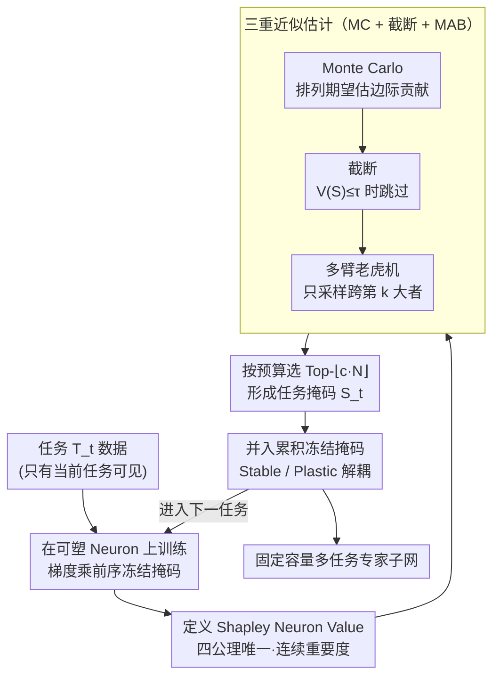

# Shapley Neuron Values for Continual Learning: Which Neurons Matter Most?

**会议**: ICML 2026  
**arXiv**: [2605.15877](https://arxiv.org/abs/2605.15877)  
**代码**: GitHub（论文正文标注有 "GitHub Code" 链接，URL 待补）  
**领域**: 可解释性 / 持续学习 / Shapley Value 神经元归因  
**关键词**: 持续学习、Shapley 值、神经元重要度、灾难性遗忘、Buffer-Free

## 一句话总结
作者把合作博弈论里的 Shapley 值搬到卷积神经网络的"滤波器"级别，用 Monte Carlo + 截断 + 多臂老虎机三重近似估计每个 Neuron 的连续重要度排名，然后冻结 Top-$r\%$ 的"专家"Neuron、留下其余继续可塑训练，从而在不存储样本、不扩展架构的前提下把 ImageNet-1k 上类增量学习的精度比第二名 buffer-free 方法再提升 $+2.88\%$、任务增量提升 $+6.46\%$。

## 研究背景与动机

**领域现状**：持续学习（CL）社区主流分三类：基于正则化（EWC、SI、LwF）、基于回放（iCaRL、DER++、PODNet、GEM）、基于动态架构（PNN、DyTox、MEMO）。其中回放类性能最强但需要存样本（违背"只用当前任务数据"的严格定义且踩 GDPR 红线），动态架构类参数无界增长，正则化类虽 buffer-free 但在任务高度异质时崩盘。

**现有痛点**：现有 buffer-free 方法的核心缺陷是**不知道哪些 Neuron 真正重要**：WSN 等"Winning Subnetwork"流派用 $\{0,1\}$ 的二值打分，在紧缺容量预算下无法区分"边缘 Top-$k$"和"绝对 Top-$k$"；NFL+ 只是渐进冻结参数，没有 principled 的重要度度量。

**核心矛盾**：稳定性（保留旧任务知识）与可塑性（学习新任务）的 trade-off 在固定容量下变成"哪些 Neuron 该冻、哪些该留"的硬选择题，而现代过参数化网络的容量虽充裕，但缺一个公平、连续、有理论支撑的归因机制。

**本文目标**：在不存样本、不扩架构的前提下，构造一个能给每个 Neuron 打**连续实值**重要度的 principled 度量，使得 Top-$k$ 选择能在多种 sparsity 预算 $c$ 下都稳定有效。

**切入角度**：注意到合作博弈里的 Shapley 值是**唯一**同时满足 Efficiency / Null Contribution / Symmetry / Linearity 四公理的分配方案，把"Neuron 当 player、模型精度当 payoff"映射过去即可继承全部公平性保证；剩下只是怎么在指数级子集空间里高效估计的工程问题。

**核心 idea**：以"Shapley Neuron Value"重定义 Neuron 重要度，再用 MC + 截断 + MAB 把指数复杂度降到可承受，逐任务累积冻结掩码，从而在固定容量内分配多任务专家子网。

## 方法详解

### 整体框架
设网络共 $L$ 层、第 $l$ 层有 $C_l$ 个滤波器，则 Neuron 总数 $N = \sum_{l=1}^L C_l$，集合 $\mathcal{M} = \{m_i\}_{i=1}^N$。任务序列 $\{T_t\}_{t=1}^T$ 按顺序到来，只能访问当前任务的数据 $\mathcal{D}_t$。每个任务 $t$：

1. 在前序累积冻结掩码 $\mathbf{B}_{t-1} = \bigcup_{i<t} S_i$ 之外的"可塑"Neuron 上正常训练若干 epoch。
2. 训练完后用验证集估计每个 Neuron 的 Shapley 值 $\hat{\phi}_i$。
3. 选 Top-$\lfloor c\cdot N\rfloor$ 个 Neuron 形成本任务的二值掩码 $S_t$，并入累积冻结集 $\mathbf{B}_t$。
4. 存下任务头 $h_t$，进入下一任务。

参数更新规则把梯度直接乘冻结掩码 $\mathbf{M}_{t-1}$：

$\theta \leftarrow \theta - \eta\Big(\frac{\partial \mathcal{L}}{\partial \theta}\odot \mathbf{M}_{t-1}\Big)$

其中 $(\mathbf{M}_{t-1})_j = 0$ 当且仅当 $\theta_j$ 属于已被冻结的 Neuron。

### 关键设计

**1. Shapley Neuron Value 公理化定义：给每个 Neuron 一个连续实值的"公平"重要度**

以往的 buffer-free 方法不知道哪些 Neuron 真正重要——WSN 这类只给 $\{0,1\}$ 二值打分，在小预算 $c$（如 $c=0.03$）下根本分不清"边缘 Top-$k$"和"绝对 Top-$k$"。作者注意到合作博弈里的 Shapley 值是唯一同时满足 Efficiency / Null Contribution / Symmetry / Linearity 四公理的分配方案，于是把"Neuron 当 player、模型精度当 payoff"映射过去，继承全部公平性保证。一个关键实现细节是 mask 一个 Neuron 时不置零、而是把它的输出替换成均值响应——这样既阻断了信息流又保留了下游层输入的统计量，避免置零引发的级联崩溃。设 $V(\mathcal S)$ 为只保留子集 $\mathcal S$、其余替换为均值后的精度，则

$$\phi_i = \sum_{\mathcal{S}\subseteq \mathcal{M}\setminus\{i\}} \frac{|\mathcal{S}|!(|\mathcal{M}|-|\mathcal{S}|-1)!}{|\mathcal{M}|!}\bigl[V(\mathcal{S}\cup\{i\}) - V(\mathcal{S})\bigr]$$

就是那个唯一满足四公理的分配。连续值排名能在多个 $c$ 下都给出可解释的 Top-$k$，还能和公理对齐——Null Contribution 自动剔除恒不贡献的死 Neuron，Symmetry 保证对称 Neuron 同等对待。

**2. 三重近似估计算法（MC + 截断 + MAB）：把 $O(N!)$ 压到 ResNet-18 上能跑**

精确 Shapley 是指数复杂度，在 ResNet-18（$N$ 上千）上根本算不动，作者叠了三层近似。第一层 Monte Carlo：把 $\phi_i$ 改写成排列期望 $\phi_i=\mathbb{E}_{\pi\sim\Pi}[V(\mathcal S_i^\pi\cup\{i\})-V(\mathcal S_i^\pi)]$，对随机排列采样估计边际贡献。第二层截断：当排列前缀太小、$V(\mathcal S_i^\pi)\le\tau$ 时跳过该 Neuron 的边际计算（模型基本失能时边际无意义），实测省了接近一个数量级。第三层多臂老虎机：注意到下游真正要的只是"可靠区分 Top-$k$"，所以只对置信区间仍跨越当前第 $k$ 大值的 Neuron 继续采样——形式上 $\delta_i=z_\alpha\cdot\sigma_i/\sqrt{n_i}$，当集合 $\mathcal A\leftarrow\{i:|\hat\phi_i-\phi^{(k)}|<\delta_i\}$ 为空时收敛。这一层最巧——它把"估准所有 $\phi_i$"换成"找 Top-$k$"，与下游"按预算选 Top-$k$"的真实需求严丝合缝，本质是把估计目标和决策目标对齐的 best-arm identification，这种思路可直接迁移到任何只用 Top-$k$ 结果的归因场景（SHAP/LIME 等）。

**3. 累积冻结掩码与 Stable–Plastic 解耦：把灾难性遗忘从"尽量小"压到"严格 0"**

有了可靠的重要度排名，剩下的就是怎么在固定容量里分配多任务子网。作者在 Neuron 级维护一个累积二值掩码 $\mathbf B_{t-1}\in\{0,1\}^N$，再展开到参数级 $\mathbf M_{t-1}$（凡属于已冻结 Neuron 的权重都置 0），训练时梯度直接 $\theta\leftarrow\theta-\eta(\frac{\partial\mathcal L}{\partial\theta}\odot\mathbf M_{t-1})$。每个任务选 Top-$\lfloor c\cdot N\rfloor$ 个 Neuron 认领、并入冻结集，$c$ 通常设为 $1/T$ 或更小。相比 WSN 的"软 mask + 重训"或正则化方法的软约束，这种硬冻结提供了零 backward transfer 的强保证（实测 BWT $\approx 0.00$）——因为被前序任务认领的 Neuron 权重根本不动，旧知识从结构上就保住了，灾难性遗忘被压到严格 0。

### 损失函数 / 训练策略
使用标准交叉熵 + Adam，He 初始化的 ResNet-18，CIFAR-100/Tiny-ImageNet 训练 200 epoch、ImageNet-1k 训练 100 epoch，均用 early stopping；超参在第 1 个任务的验证集上 grid search 后**冻结**，后续任务从不重调（GTEP 协议）。

## 实验关键数据

### 主实验

| 数据集 | 场景 | 任务数 | SNV (ours) | 第 2 名 buffer-free | 提升 |
|--------|------|--------|------------|---------------------|------|
| ImageNet-1k | CIL | 10 | $\mathbf{41.30\%}$ | NFL+ $38.42\%$ | $+2.88$ |
| ImageNet-1k | CIL | 20 | $\mathbf{34.20\%}$ | NFL+ $31.50\%$ | $+2.70$ |
| ImageNet-1k | CIL | 50 | $\mathbf{25.60\%}$ | NFL+ $22.40\%$ | $+3.20$ |
| ImageNet-1k | TIL | 10 | $\mathbf{57.82\%}$ | NFL+ $51.36\%$ | $+6.46$ |
| ImageNet-1k | TIL | 20 | $\mathbf{50.45\%}$ | NFL+ $45.80\%$ | $+4.65$ |
| ImageNet-1k | TIL | 50 | $\mathbf{40.18\%}$ | NFL+ $37.20\%$ | $+2.98$ |

SNV 在 CIL/10 上甚至超过存了 20,000 个 exemplar 的 memory-based 方法 DyTox（$40.15\%$），证明 principled Neuron 选择可补偿回放缓冲的缺失。

### 消融实验

| 配置 (TIL, CIFAR-100, 10 tasks) | ACC | BWT | PS | 说明 |
|--------------------------------|-----|-----|-----|------|
| SNV, $c=0.03$ | $71.74$ | $0.00$ | $0.52$ | 极紧预算仍领先 WSN $(59.65)$ |
| SNV, $c=0.05$ | $74.52$ | $0.00$ | $0.54$ | |
| SNV, $c=0.1$ | $76.19$ | $0.00$ | $\mathbf{0.62}$ | PS 最优 |
| SNV, $c=0.3$ | $77.89$ | $0.00$ | $0.58$ | |
| SNV, $c=0.5$ | $\mathbf{79.76}$ | $0.00$ | $0.60$ | ACC 最优 |
| WSN, $c=0.5$ | $64.00$ | $0.00$ | $0.66$ | 二值打分上限明显低 |
| NFL+ (no $c$ 参) | $70.68$ | $-0.35$ | $\mathbf{0.65}$ | BWT 非零 |
| EWC | $36.47$ | $-54.13$ | $0.37$ | 正则化在 1000 类下严重崩溃 |

### 关键发现
- **零 backward transfer 是结构性结果而非偶然**：所有 SNV 配置 BWT 均严格为 $0.00$，因为冻结是硬约束；NFL+ 与 EWC 的 BWT 显著为负，说明它们的"软冻结/软约束"在长任务序列下保不住旧知识。
- **小预算 $c$ 下 SNV 优势最大**：当 $c=0.03$ 时 SNV $71.74$ vs WSN $59.65$（$+12\%$），印证"连续打分在紧预算下排序更准"的直觉；预算放宽到 $c=0.5$ 时差距收敛但 SNV 仍领先 $15\%$。
- **剪枝悬崖揭示参数利用效率**：SNV 在 CIFAR-100 上可承受 $30\%$ 剪枝才性能崩塌，NFL+ 在 $20$–$30\%$ 之间已崩，EWC/LwF 则在 $0$–$80\%$ 全程缓慢下滑——后者其实暴露"训练后参数大量冗余"，前者的剪枝悬崖反而是"每个 Neuron 都被用到"的健康信号。
- **memory-based 在 ImageNet-1k 上有结构性优势但被 SNV 追平**：DyTox 凭 20k exemplar 在 1000 类上确实领先大多 buffer-free 方法，但 SNV 不存样本就把它打平甚至反超，作者借此指出"小回放缓冲方法应被归为顺序学习而非严格 CL"。

## 亮点与洞察
- **均值响应替代置零**：mask 时把 Neuron 输出换成在验证集上的均值激活而非 $0$，避免下游层输入分布崩塌，使得 $V(\mathcal{S})$ 的边际差才真有信号——这个小细节是后续 MC 估计稳定的关键。
- **MAB 与决策目标对齐**：传统 Neuron Shapley 估计追求"所有 $\phi_i$ 都准"，而本文只追求"Top-$k$ 准"，把统计目标重写为 best-arm identification，这种"按真实使用方式重新形式化估计目标"的思路可直接迁移到 SHAP/LIME 等任何只用 Top-$k$ 结果的归因场景。
- **GTEP 超参冻结协议**：超参只在第 1 个任务调，后续任务永远不调——这避免了持续学习领域常见的"用全任务 grid search 出超参再报 ACC"的隐性 cheating，让结果可信度大幅提升。
- **诚实地谈"memory-based vs buffer-free 比较的不公平"**：作者明确指出"固定 buffer size 横比并不公平"，提议把"小回放缓冲"和"严格 CL"作为两种问题分开讨论——这种态度对 CL benchmarking 社区是重要警钟。

## 局限与展望
- 仅在卷积网络的"滤波器"粒度做 Shapley 估计：放到 Transformer/Attention head 粒度时，head 间的强协同会让 marginal contribution 噪声暴增，MAB 收敛性需重新设计。
- MC + MAB 仍有非平凡开销：每个任务训练完都要跑大量前向 pass 来估 $\phi_i$，论文未公布相对训练时间的 wall-clock overhead，工程化部署还需要量化。
- 固定容量假设是上限也是下限：当任务数 $T \to \infty$ 时 $c = 1/T \to 0$，预算挤压会先于精度暴跌而出现"无可塑 Neuron 可分配"的死锁；作者只在最多 50 任务上验证。
- 仅在视觉 CIL/TIL 上做实验：在 NLP 持续学习（如 sequence labeling 任务流）上是否仍有同样优势缺乏直接证据。

## 相关工作与启发
- **vs WSN（Winning SubNetwork）**：WSN 用二值 $\{0,1\}$ 选 Neuron，本文用连续 $\phi_i$ 选 Neuron——在小 $c$ 下 SNV 领先 $12\%$ 直接证明"连续比二值更值"。
- **vs NFL+（No Forgetting Learning）**：NFL+ 是渐进冻结的纯启发式，无 principled 重要度度量；本文用 Shapley 公理化框架给出唯一正确分配，性能在 ImageNet-1k CIL/TIL 全部 6 个设置上稳定胜出 $+2.7$ 到 $+6.5$。
- **vs EWC / SI / LwF**：这类正则化方法用对角 Fisher 等粗糙近似，无法捕捉 1000 类下参数的复杂耦合（实测 EWC 在 ImageNet CIL/10 上仅 $7.53\%$）；SNV 用子集级 marginal 才能反映 Neuron 间的真实组合贡献。
- **vs Neuron Shapley（Ghorbani 等）**：本文继承其 MC+截断 框架，但加入 MAB 把"估全部"换为"找 Top-$k$"，并首次把 Neuron Shapley 用于持续学习的冻结选择——这一组合是本文相对原始 Neuron Shapley 工作的两个差异点。
- 启发：把"价值函数 $V$ 替换为'类别公平性度量'"，就能用同一框架做公平性归因；替换为"鲁棒性指标"则能定位对抗脆弱 Neuron——SNV 框架本身是任务无关的 Neuron 重要度估计器。

## 评分
- 新颖性: ⭐⭐⭐⭐ — Shapley + Neuron 不算首次，但"用 MAB 把目标从估全部换成找 Top-$k$ + 嵌入持续学习冻结流程"的组合是新的。
- 实验充分度: ⭐⭐⭐⭐ — 三个数据集 $\times$ CIL/TIL $\times$ 10/20/50 任务 $\times$ 多 baseline 系统比较，剪枝/PS/BWT 多角度分析齐备；可惜没贴 wall-clock。
- 写作质量: ⭐⭐⭐⭐ — 公理 → 唯一性 → 估计算法的链条干净，但伪代码与公式中"Neuron"大小写不一致、部分变量缺定义，影响阅读流畅度。
- 价值: ⭐⭐⭐⭐ — 给 buffer-free CL 提供了一个 principled、可解释、可控预算的新基线，且 Neuron 重要度框架可迁移到压缩/剪枝/公平性等多个下游任务。

<!-- RELATED:START -->

## 相关论文

- [\[ICML 2026\] Position: Deployed Reinforcement Learning should be Continual](position_deployed_reinforcement_learning_should_be_continual.md)
- [\[NeurIPS 2025\] Temporal-Difference Variational Continual Learning](../../NeurIPS2025/reinforcement_learning/temporal-difference_variational_continual_learning.md)
- [\[NeurIPS 2025\] Approximating Shapley Explanations in Reinforcement Learning](../../NeurIPS2025/reinforcement_learning/approximating_shapley_explanations_in_reinforcement_learning.md)
- [\[ACL 2026\] Savoir: Learning Social Savoir-Faire via Shapley-based Reward Attribution](../../ACL2026/reinforcement_learning/savoir_learning_social_savoir-faire_via_shapley-based_reward_attribution.md)
- [\[CVPR 2026\] Resolving the Stability-Plasticity Dilemma in Reinforcement Learning via Complementary Continual Critics](../../CVPR2026/reinforcement_learning/resolving_the_stability-plasticity_dilemma_in_reinforcement_learning_via_complem.md)

<!-- RELATED:END -->
