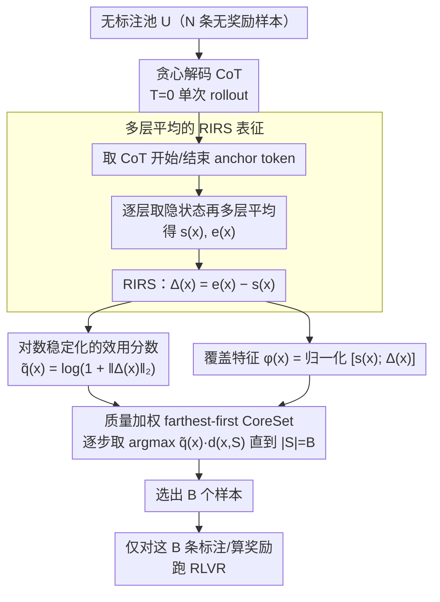

# Single-Rollout Hidden-State Dynamics for Training-Free RLVR Data Selection

**会议**: ICML 2026  
**arXiv**: [2605.28631](https://arxiv.org/abs/2605.28631)  
**代码**: https://github.com/JianghaoWu/SHIFT  
**领域**: 强化学习 / LLM 推理 / 数据选择  
**关键词**: RLVR, 数据选择, 隐状态动力学, CoreSet, 训练无关  

## 一句话总结
SHIFT 用一次贪心解码下的"开始 token → 结束 token"隐状态差 $\Delta(x)=\mathbf{e}(x)-\mathbf{s}(x)$ 同时充当 RLVR 样本的效用代理和多样性特征，再用质量加权的最远优先 CoreSet 在大规模无标注池里挑出极少量样本，全过程不训练、不需要奖励或答案。

## 研究背景与动机

**领域现状**：RLVR（带可验证奖励的强化学习）能让 LLM 推理能力暴涨，并且具备极端的样本效率——文献已显示一两个精心挑出的样本可以逼近用上千样本 RL 后的性能。代表方法（如 Wang et al. 2025c）通过"在小型 RL 训练里看每个样本的训练集准确率方差（Historical Variance Score, HVS）"来挑高价值样本。

**现有痛点**：这类基于训练时信号的选择必须先在大候选池上跑（代理）微调或 RL，并要求可验证奖励，等价于需要 ground truth 答案。这在医学推理等专业领域上既贵又不可行。经典主动学习的不确定性/梯度准则同样依赖训练时反馈，而预训练阶段的难度/PPL 代理与 RLVR 的奖励驱动效用之间相关性弱。

**核心矛盾**：RLVR 样本效用是奖励驱动的，但在选样阶段我们既没有奖励也没有标签，更不希望先做训练；现有主动学习信号都建立在"做过训练或拿到标签"之上。

**本文目标**：在 pre-RL 阶段、面向大规模无标注池、且不评估奖励的前提下，选出 $|S|=B$ 个最有希望的训练样本。

**切入角度**：理论侧 Dherin et al. 2025 把 transformer 自注意力 + MLP 的 context 效应等价为对 MLP 第一层的秩-1 隐式权重更新，并给出 $\|\Delta W(Y)\|_F \le \frac{\|W\|_2}{\|A(C\setminus Y,x)\|_2}\,\|\Delta A(Y)\|_2$ 的上界——这暗示"context 引起的表征变化"可以代理"模型内部学习量"。经验侧 Liang et al. 2025 已经证实 CoT 前后隐状态差能编码推理过程的非平凡结构。

**核心 idea**：用一次确定性 CoT rollout 中开始 / 结束 anchor 的多层平均隐状态之差作为样本效用代理 $q(x)=\|\Delta(x)\|_2$，并在 $[\mathbf{s}(x);\Delta(x)]$ 的归一化空间里做质量加权 farthest-first 选择。

## 方法详解

### 整体框架
对无标注池 $\mathcal{U}=\{x_i\}_{i=1}^{N}$ 中的每条样本：(1) 用基座 LLM $f_\theta$ 在固定推理 prompt 下做 $T=0$ 贪心解码生成一条 CoT；(2) 取 CoT 开始与结束 token（若模型支持 `<think>`/`</think>` 则取定界符）为 anchor，多层平均得到 $\mathbf{s}(x), \mathbf{e}(x)\in\mathbb{R}^D$；(3) 计算 RIRS $\Delta(x)=\mathbf{e}(x)-\mathbf{s}(x)$；(4) 用 $\tilde q(x)$ 与 $\phi(x)$ 喂入质量加权 farthest-first CoreSet 选出 $B$ 个样本；(5) 只为这 $B$ 个样本标注/计算奖励，跑 RLVR。整个选样过程"一次推理、零训练、零标签"。

### 关键设计

**1. 多层平均的 RIRS 表征：用一个向量浓缩"这条样本让模型内部走了多远"**

选样阶段既没有奖励也没有标签，需要一个不训练就能拿到的效用代理。SHIFT 对每层 $\ell$ 取 anchor token 的隐状态 $\mathbf{h}^{(\ell)}_{t_s}(x)$、$\mathbf{h}^{(\ell)}_{t_e}(x)$，沿层求均值得到 $\mathbf{s}(x)$、$\mathbf{e}(x)$，再定义 $\Delta(x)=\mathbf{e}(x)-\mathbf{s}(x)$ 为"推理诱导的表征漂移"。理论上借 Dherin et al. 的秩-1 隐式权重视角，把 $\|\Delta(x)\|_2$ 解释为一条 rollout 上累积 context-induced 变化的轨迹级、层聚合的可观测代理（作者明确说这是动机而非严格推导）。它的好处是只需一次推理就能拿到，远比"R=32 次随机采样算自一致熵"或"跑 RL 看奖励"便宜；多层平均也比单层 anchor 稳定，避免某一层异常带偏。

**2. 对数稳定化的效用分数：把 RIRS 范数压成尺度可比的代理**

不同长度、不同领域样本的 $\|\Delta\|_2$ 量级差异很大，直接拿来用会被极端值主导。SHIFT 先算 $q(x)=\|\Delta(x)\|_2$，再做单调对数压缩 $\tilde q(x)=\log(1+q(x))$——保持排序的同时把尺度压住，让它后面能和多样性距离 $d(x,S)$ 在乘法里量纲可比。高 $\tilde q$ 意味着这条样本让模型内部走得更远，被假设为对 RLVR 更有学习价值。

**3. 质量加权 farthest-first CoreSet：单次贪心里同时兼顾效用和覆盖**

高 $\tilde q$ 的样本常常扎堆（比如某一类难题），纯 top-K 会浪费预算选一堆同质样本；纯 farthest-first 又会拣到无意义的离群点。SHIFT 把两者乘起来：先构造 $\ell_2$ 归一化的覆盖特征 $\phi(x)=[\mathbf{s}(x);\Delta(x)]/\|[\mathbf{s}(x);\Delta(x)]\|_2 \in \mathbb{R}^{2D}$（既含 CoT 起点上下文、又含推理动力学），初始化 $S\leftarrow\{\arg\max_x \tilde q(x)\}$，随后每步取 $x^\star=\arg\max_{x\in\mathcal{U}\setminus S}\, \tilde q(x)\cdot d(x,S)$，其中 $d(x,S)=\min_{x'\in S}\|\phi(x)-\phi(x')\|_2$，反复直到 $|S|=B$。乘法形式强制效用和覆盖必须同时成立才会被选中，且只需一次 $O(NB)$ 贪心扫描，能扩展到上万规模的池子。

### 损失函数 / 训练策略
SHIFT 本身不训练任何参数——选样阶段只有一次贪心推理 + CoreSet 贪心。RLVR 阶段对所有方法用同一套训练预算与超参，只换"选哪些样本"的规则；MedQA 用 Qwen3-1.7B，MATH-500 用 Qwen2.5-Math-1.5B，均从公开 checkpoint 起步。

## 实验关键数据

### 主实验
| 数据集 | 选样预算 | 评估 | 全量 RLVR 参考 | Random | 最佳基线 | SHIFT |
|--------|----------|------|------------------|--------|----------|-------|
| MATH-500（in-domain） | 2%（7/350） | Pass@1 | 66.00 | 53.73 | 见正文（Cluster 44.67 / CoreSet 47.33） | 与全量差距最小、显著超越 Cluster/CoreSet |
| AMC（OOD 数学迁移） | 2% | Pass@1 | 33.73 | 25.78 | 25.30（Cluster） | 文中报告稳定优于训练无关基线 |
| MedQA | 0.1–0.2% | 选样后 RLVR 准确率 | — | — | — | SHIFT 在多个超低预算下一致最优 |

> 复现细节：MATH-500 把 500 题切成 350 选样池 + 150 测试；MedQA 用 10.2K 训练集作选样池、1.27K 测试集评估，并迁移到 MedMCQA、PubMedQA、MedXpertQA(U/R) 检验跨集泛化。基线包含 KMeans-Center (Cluster)、Farthest-First (CoreSet)、Q-PPL（题面困惑度）、SC-Entropy（32 次随机解码答案熵）、CoT 相似度、A-PPL（生成答案困惑度）。

### 消融实验
| 配置 | 关键作用 | 说明 |
|------|----------|------|
| Full SHIFT | RIRS 质量 + RIRS 覆盖 | 论文报告的最佳版本 |
| 仅效用 top-K（无 farthest-first） | 去掉覆盖项 | 容易选到同质化样本，掉点 |
| 仅 farthest-first（去掉 $\tilde q$ 权重） | 去掉效用项 | 退化为通用 CoreSet，被离群点主导 |
| 句嵌入空间 CoreSet（baseline 对照） | 不用 RIRS 而用 MiniLM-L6-v2 | 不能捕捉推理时计算，显著弱于 SHIFT |
| 单 rollout vs 多 rollout 自一致 | 选样代价 | 单次贪心 RIRS 即可，无需 R=32 次随机采样 |

### 关键发现
- "RIRS 范数"与"输入/输出长度"等表面统计量解耦：作者专门做相关性分析，确认 $\tilde q$ 的增益不能被简单长度因素解释，支持它是"推理诱导内部更新"的真实代理。
- 把 $\Delta(x)$ 既当效用又拼进覆盖特征 $\phi(x)$ 才是关键：仅当效用、不当特征，或者只当特征不当权重，都会显著掉点；二者互补。
- 在 MedQA 这种几乎无奖励可用的领域，SHIFT 把"标注 + 奖励评估"成本压缩到所选 $B$ 条之内，让 RLVR 真正成为低资源可用的对齐范式，而不仅是"有钱有 ground truth 的人的玩具"。
- 跨集迁移（MedQA 训练 → MedMCQA、PubMedQA、MedXpertQA-U/R 评估）上 SHIFT 的优势保持稳定，说明所选样本不只过拟合到 in-domain 测试集，而是真的让 RLVR 学到了可迁移的推理结构。
- 同样基于 $[\mathbf{s}(x);\Delta(x)]$ 特征做单纯 CoreSet 也比句嵌入 CoreSet 强，说明 RIRS 增益既来自质量信号也来自更贴合推理的特征空间。

## 亮点与洞察
- 用"一次推理就能看到的轨迹级残差"取代"必须先训练才能看到的奖励/梯度信号"，是从 in-context implicit weight update 视角对样本价值的全新刻画——把 Dherin 2025 的理论端口接到了非常实用的选样问题上。
- 算法极简：$O(N)$ 推理 + $O(NB)$ CoreSet，没有学习率，没有调参，没有奖励模型；这种"提示一致、Anchor 明确、可即插即用"的设计很容易迁移到任何带 `<think>`/`</think>` 的推理模型。
- 把效用和多样性写成乘法 $\tilde q\cdot d$ 而不是加法，是个值得借鉴的工程细节：避免量纲调权，并强制"非空"——只有两边都非零才能进入候选。

## 局限与展望
- 理论与方法之间存在 gap：上界 (5) 是单块、单 query 位置的陈述，而 $\Delta(x)$ 是跨层、跨整条 rollout 的聚合；作者已坦承这是"动机而非推导"，未来需要更紧致的连接。
- 评估模型偏小（1.5B、1.7B），且预算极低；当池子或模型放大、奖励变得稠密时，RIRS 的"高 norm = 高价值"假设是否仍然单调成立尚需更多证据。
- Anchor 取决于 CoT 定界符或人为约定的开始/结束位置；若模型不输出明确 CoT 段或解码不稳定，$\Delta(x)$ 的语义会被噪声稀释。

## 相关工作与启发
- **vs Wang et al. 2025c（HVS）**：HVS 必须先跑 RL 看每个样本的训练集准确率方差，需要奖励/标签；SHIFT 在 pre-RL、零标签下用一次推理替代，定位完全互补。
- **vs 经典主动学习（CoreSet、Cluster、Entropy）**：传统方法的不确定性/距离信号来自静态输入嵌入或训练损失，捕捉不到推理时计算；SHIFT 显示把特征空间换成"推理动力学"能在同一 CoreSet 框架下大幅升级。
- **vs Liang et al. 2025 的隐状态轨迹分析**：他们用类似的 start-end delta 解释推理结构，SHIFT 把这种诊断信号转化为选样准则，是一次很直接的"分析→落地"映射。

## 评分
- 新颖性: ⭐⭐⭐⭐ 把 in-context implicit update 的理论桥接到 RLVR 数据选择，视角新颖。
- 实验充分度: ⭐⭐⭐ 数学与医学双场景 + 多基线 + 消融较完整，但模型规模与预算偏窄。
- 写作质量: ⭐⭐⭐⭐ 问题设定、理论动机、算法、消融逻辑链条清晰。
- 价值: ⭐⭐⭐⭐ 给低资源专业领域上 RLVR 提供了真正可用的零标签选样配方。

<!-- RELATED:START -->

## 相关论文

- [\[ICML 2026\] Probing RLVR Training Instability through the Lens of Objective-Level Hacking](probing_rlvr_training_instability_through_the_lens_of_objective-level_hacking.md)
- [\[ICML 2026\] EchoRL: Reinforcement Learning via Rollout Echoing](echorl_reinforcement_learning_via_rollout_echoing.md)
- [\[ACL 2026\] LearnAlign: Data Selection for LLM Reinforcement Learning with Improved Gradient Alignment](../../ACL2026/reinforcement_learning/learnalign_data_selection_for_llm_reinforcement_learning_with_improved_gradient_.md)
- [\[ICML 2026\] CPMöbius: Iterative Coach–Player Reasoning for Data-Free Reinforcement Learning](cpmobius_iterative_coach-player_reasoning_for_data-free_reinforcement_learning.md)
- [\[ICML 2026\] How Reasoning Evolves from Post-Training Data: An Empirical Study Using Chess](how_reasoning_evolves_from_post-training_data_an_empirical_study_using_chess.md)

<!-- RELATED:END -->
