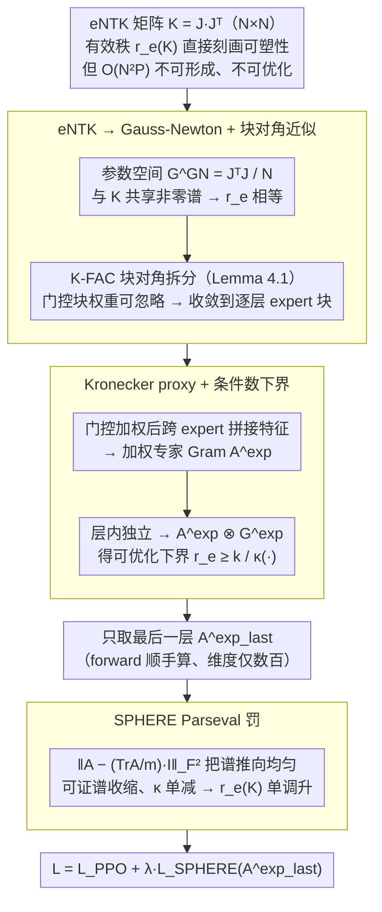

# SPHERE: Mitigating the Loss of Spectral Plasticity in Mixture-of-Experts for Deep Reinforcement Learning

**会议**: ICML 2026  
**arXiv**: [2605.04712](https://arxiv.org/abs/2605.04712)  
**代码**: 论文未公开  
**领域**: 强化学习 / Mixture-of-Experts / 持续学习  
**关键词**: 可塑性丢失, MoE 策略, NTK 谱, 有效秩, Parseval 正则

## 一句话总结
本文把 MoE 策略在持续强化学习中的可塑性丢失形式化为 empirical NTK 矩阵谱熵有效秩的下降，再用 Gauss-Newton 与 Kronecker 分解把它降维到一个只依赖"专家特征 Gram 矩阵"的可计算 proxy，最后用一个一行的 Parseval 罚（SPHERE）拉高这个 proxy，在 MetaWorld 和 HumanoidBench 持续 RL 设置下把任务成功率分别提升 133% 和 50%。

## 研究背景与动机

**领域现状**：MoE 架构已经从 LLM 进入到深度强化学习（DRL）——多任务机械臂、人形、四足、大规模在线 RL 都用稀疏路由的 expert 来扩容策略容量（Top-$K$ MoE、Dense-MoE、DS-MoE）。同时持续 RL（CRL）场景里 agent 要按序学多个任务，这是 MoE 容量优势最该发挥的舞台。

**现有痛点**：经验上 MoE 策略在 CRL 中性能反而会显著退化——Willi et al. 2024 报告了"任务后期成功率塌陷"。这是 plasticity loss（可塑性丢失）的典型表现：训练越久，从新数据里学新技能的能力越弱。文献里已有针对 dense 网络的解释（dormant neurons、representation 谱塌陷、Hessian 谱塌陷），但 MoE 这种 sparse、分支结构下 plasticity loss 的具体形式与对策几乎是空白。

**核心矛盾**：直接刻画 plasticity 的工具——eNTK 矩阵 $\mathbf{K} = \mathbf{J}\mathbf{J}^\top \in \mathbb{R}^{N \times N}$——在 MoE 上是个庞然大物。形成 $\mathbf{K}$ 要 $O(N^2 P)$ 时间和 $O(NP + N^2)$ 内存，$P$ 含全部 expert 参数，根本没法直接监控、更没法当 loss 优化。所以要么 plasticity loss 不可观测，要么不可优化，必须找一个"既能反映 MoE plasticity 又能 backprop"的代理量。

**本文目标**：(1) 给出 MoE 策略 plasticity loss 的形式化定义；(2) 把不可解的全 eNTK 有效秩降到可微的小矩阵 proxy；(3) 设计能对 proxy 做谱收缩的正则项；(4) 在主流 CRL benchmark 上验证。

**切入角度**：从函数空间的梯度下降公式 $\Delta f = -\eta \mathbf{K} \nabla_f L$ 出发，$\mathbf{K}$ 的特征谱直接决定"梯度能往哪些方向走"。当谱塌缩（少数特征值远大于其他），$\mathbf{K}$ 就成了一个对梯度的强先验，把 update 锁在少数主方向上——这就是 plasticity 的本质。所以"高 plasticity = 谱各向同性"，自然用谱熵有效秩 $r_e(\mathbf{K}) = \exp(-\sum p_i \log p_i)$（$p_i = \sigma_i / \sum_j \sigma_j$）量化。

**核心 idea**：把 $r_e(\mathbf{K})$ 用块对角近似（Gauss-Newton + 层内独立性 + Kronecker 分解，借用 K-FAC 的思路）打到"最后一层专家加权特征 Gram 矩阵 $\mathbf{A}^{\mathrm{exp}}_{\mathrm{last}}$"，然后用一个把 $\mathbf{A}^{\mathrm{exp}}_{\mathrm{last}}$ 推向 $\frac{\mathrm{Tr}}{m}\mathbf{I}$ 的 Frobenius 罚来"谱收缩"，可证明严格提升 $r_e(\mathbf{K})$。

## 方法详解

### 整体框架

输入是一个 Top-$K$ MoE actor 在 PPO 训练管线中的 forward 输出；输出是一项加进 PPO loss 的可微正则项。整个 derivation 是一串"逐层下行的代理"：$r_e(\mathbf{K}) \to r_e(G^{\mathrm{GN}}) \to$ 块对角近似 $\to$ 各层 expert 块 $r_e(\mathbf{G}^{\mathrm{GN},\mathrm{exp}}_\ell) \to$ Kronecker proxy 的条件数下界 $\frac{k_\ell}{\kappa(\mathbf{A}^{\mathrm{exp}}_{\ell-1} \otimes \mathbf{G}^{\mathrm{exp}}_\ell)} \to$ 只对 $\mathbf{A}^{\mathrm{exp}}_{\mathrm{last}}$（最后一层、权重最重的 expert block）做谱收缩。最终的 loss 长这样：$\mathcal{L} = \mathcal{L}_{\mathrm{PPO}} + \lambda^e \cdot \|\mathbf{A}^{\mathrm{exp}}_{\mathrm{last}} - \tfrac{\mathrm{Tr}(\mathbf{A}^{\mathrm{exp}}_{\mathrm{last}})}{m}\mathbf{I}_m\|_F^2$。

下面这张图把这条"从不可计算的全局量逐步降到一行可微罚"的归约链画出来，三个虚线分组正对应后面的三个关键设计：

### 关键设计

**1. 从 eNTK 到 Gauss-Newton + 块对角近似：把"不可形成的全局矩阵"降成"逐层 expert 块"**

痛点在前面已经讲清楚——直接监控 $\mathbf{K} \in \mathbb{R}^{N \times N}$ 要 $O(N^2 P)$ 算力，根本没法当 loss。第一步先把战场从 $N \times N$ 的样本空间搬到参数空间：利用 $\mathbf{J}\mathbf{J}^\top$ 与 $\mathbf{J}^\top \mathbf{J}$ 共享非零谱这一事实，得到 $r_e(\mathbf{K}) = r_e(G^{\mathrm{GN}})$，其中 $G^{\mathrm{GN}} = \tfrac{1}{N}\mathbf{J}^\top \mathbf{J} \in \mathbb{R}^{P \times P}$。接着借 K-FAC 标准的块对角近似（忽略跨层、跨门控-专家的交叉块），把它拆成

$$G^{\mathrm{GN}} \approx \bigoplus_\ell \mathbf{G}^{\mathrm{GN},\mathrm{g}}_\ell \oplus \bigoplus_\ell \mathbf{G}^{\mathrm{GN},\mathrm{exp}}_\ell.$$

关键的一步是 Lemma 4.1：块对角矩阵的有效秩可以精确分解为 $r_e(M) = \exp\big(H(\alpha) + \sum_b \alpha_b \log r_e(M_b)\big)$，权重 $\alpha_b = \|M_b\|_*/\sum_m \|M_m\|_*$。由于门控参数远少于专家参数（$P^g \ll P^{\mathrm{exp}}$），门控块的权重可忽略、当固定项处理，于是问题彻底收敛到"每层 expert 块的秩"。这一步用的全是严格等式/不等式而非启发式，正是后面能写成定理的地基。

**2. Kronecker proxy + 条件数下界：把秩问题落到 forward 就能拿到的低维 Gram 矩阵**

每个 expert 层块 $\mathbf{G}^{\mathrm{GN},\mathrm{exp}}_\ell$ 还是太大，第二步在层内独立性近似下沿 K-FAC 思路把它因子化成两个小 Gram 的 Kronecker 积。具体做法是把每个 expert 在样本 $x_i$ 上的输入 $a^{\mathrm{exp}}_{e,\ell-1}(x_i)$ 用 Top-$K$ 门控权重 $h^{(K)}_{i,e}$ 加权，再**跨 expert 拼接**成一条长向量

$$a_{\ell-1}(x_i) = \big[h^{(K)}_{i,1}\, a^{\mathrm{exp}}_{1,\ell-1}{}^\top \,\big|\, \dots \,\big|\, h^{(K)}_{i,E}\, a^{\mathrm{exp}}_{E,\ell-1}{}^\top\big]^\top,$$

堆叠后得到加权专家特征 Gram $\mathbf{A}^{\mathrm{exp}}_{\ell-1} = \tfrac{1}{N}\Phi_{\ell-1}^\top \Phi_{\ell-1}$，反传梯度 Gram $\mathbf{G}^{\mathrm{exp}}_\ell$ 同理构造。因为 Kronecker 积的特征值是两个因子特征值的乘积、条件数也相乘，于是有可优化下界 $r_e(\mathbf{G}^{\mathrm{GN},\mathrm{exp}}_\ell) \ge k_\ell / \kappa(\mathbf{A}^{\mathrm{exp}}_{\ell-1} \otimes \mathbf{G}^{\mathrm{exp}}_\ell)$。这步之所以有效，是因为 $\mathbf{A}^{\mathrm{exp}}_{\ell-1}$ 维度只有几百（$\sum_e d^{\mathrm{exp}}_{e,\ell-1}$），forward pass 顺手就能算出来、不必反传。而"跨 expert 拼接而非分 expert 单算"是 MoE 特定的精巧之处：拼接后 Gram 的 off-diagonal 块直接编码了专家之间的相关，相当于隐式阻止多个 expert 的特征塌陷到同一方向。

**3. SPHERE Parseval 罚 + 谱收缩证明：一项可证明把 $r_e(\mathbf{K})$ 单调推高的正则**

有了可微的 proxy，最后只差一项能让它的条件数往下走的 loss。作者定义 $\mathcal{L}_{\mathrm{SPHERE}}(\mathbf{A}) = \|\mathbf{A} - \tfrac{\mathrm{Tr}(\mathbf{A})}{m}\mathbf{I}_m\|_F^2$，把它展开等于 $\|\mathbf{A}\|_F^2 - \tfrac{\mathrm{Tr}(\mathbf{A})^2}{m}$，对 $\mathbf{A}$ 求梯度做一步 SGD 后可证：当 $\eta \le \tfrac{1}{2}$ 时每个特征值都按 $\lambda_i \to (1-\beta)\lambda_i + \beta \bar\lambda$ 朝均值收缩——这正是 spectral contraction 的定义，于是 $\kappa(\mathbf{A})$ 单调下降。再借 Kronecker 单调性引理（$\kappa(A_{t+1} \otimes B) \le \kappa(A_t \otimes B)$）传到 Kronecker proxy，最后通过块对角分解一路传回 $r_e(\mathbf{K})$，让"加这一项 → 有效秩单增"成为定理而不是经验观察。实操上只对 actor 最后一层专家施加这个罚（深层 representation 最易塌陷），不碰需要额外反传的梯度 Gram。选 Parseval 这种 push-to-identity 形式，正因为它恰好满足谱收缩的充分条件，让整条不等式链闭合。

### 损失函数 / 训练策略

$\mathcal{L} = \mathcal{L}_{\mathrm{PPO}} + \lambda^e \cdot \mathcal{L}_{\mathrm{SPHERE}}(\mathbf{A}^{\mathrm{exp}}_{\mathrm{last}})$。每次梯度更新都用 forward 输出现算 $\mathbf{A}^{\mathrm{exp}}_{\mathrm{last}}$。Top-$K$ MoE 用 $E = 10$ 个 expert、$K = 2$；MetaWorld 每任务训 $10^6$ env steps，HumanoidBench 每任务训 $10^7$ env steps。

## 实验关键数据

### 主实验

| Benchmark | 方法 | 设置 | 平均成功率 | 备注 |
|-----------|------|------|-----------|------|
| MetaWorld CW10 | Top-$K$ MoE | CRL | baseline | 持续 RL 退化严重 |
| MetaWorld CW10 | + SPHERE | CRL | **+133%** | RL-CRL gap 缩小 52% |
| HumanoidBench H1 | Top-$K$ MoE | RL | baseline | 单任务内部也降 |
| HumanoidBench H1 | + SPHERE | RL | **+36%** | 长 horizon ($10^7$ steps) 内 drift 明显 |
| HumanoidBench H1 | Top-$K$ MoE | CRL | baseline | – |
| HumanoidBench H1 | + SPHERE | CRL | **+50%** | – |

### 消融实验

| 配置 | HumanoidBench CRL 平均成功率 | 说明 |
|------|---------------------------|------|
| w/o SPHERE | $0.36 \pm 0.08$ | 不加正则 baseline |
| **w/ SPHERE** | $\mathbf{0.54 \pm 0.12}$ | 完整方法 |
| 所有 hidden expert 层都加 | $0.42 \pm 0.07$ | 过约束浅层表示学习 |
| Per-expert loss sum（去掉跨 expert 拼接） | $0.40 \pm 0.08$ | 验证跨 expert 相关项重要 |
| 对 $\mathbf{G}^{\mathrm{exp}}_{\mathrm{last}}$ 而非 $\mathbf{A}^{\mathrm{exp}}_{\mathrm{last}}$ 正则 | $0.43 \pm 0.09$ | 特征 Gram 增益占主导 |

### 关键发现

- **MoE 比 dense PPO 更需要 plasticity 干预**：图 3 显示 PPO/Top-$K$/Dense-MoE/DS-MoE 在 CRL 下 $r_e(\mathbf{K})$ 都会下降，但 MoE 类下降更剧烈，呼应"门控稀疏放大了表示塌陷"的直觉。
- **跨 expert 拼接是关键设计**：分 expert 单独正则提升微弱（0.40），拼接后联合正则得 0.54，证明 expert 之间的相关结构（off-diagonal Gram 块）才是 plasticity 流失的主要渠道。
- **$r_e(\mathbf{A}^{\mathrm{exp}}_{\mathrm{last}})$ 与 $r_e(\mathbf{K})$ Pearson 相关 0.846**：作为 proxy 的有效性被独立检验，不只是理论上的下界关系。
- **MetaWorld vs HumanoidBench 收益结构不同**：前者主要在 CRL 受益（任务切换驱动 plasticity loss），后者 RL 单任务内就受益（$10^7$ steps 长 horizon 让分布持续 drift 成为内生 plasticity loss 来源）——这暴露了 plasticity loss 不只是"任务切换"问题，长 horizon 单任务也会发生。

## 亮点与洞察

- 把"plasticity loss"这个 fuzzy 的现象给到一个有数学定义、可优化、可证明优化方向的代理量——这是这篇 paper 最大的贡献。整条"$r_e(\mathbf{K}) \to G^{\mathrm{GN}} \to$ 块对角 $\to$ Kronecker proxy $\to$ Parseval 罚"链条几乎每一步都引经据典（K-FAC、谱熵秩、Marshall majorization），formalization 做得很到位。
- "用门控加权后再跨 expert 拼接"是 MoE 特定的精巧设计——它把 Top-$K$ 稀疏路由的稀疏性直接 baked 进 Gram 矩阵，不像把 expert 当独立模块那样割裂，反而显式约束 expert 之间共享一个"分散但一致"的表示空间。
- HumanoidBench 上 RL 单任务都能 +36%，说明 plasticity loss 不仅是"持续学习"问题，长 horizon 单任务的分布 drift（on-policy 数据持续变化）就够触发了——这个结论可能推动整个 long-horizon RL 的训练范式重新审视。
- 整个理论推导对 dense MoE、DS-MoE 都成立，所以 SPHERE 这套 proxy 可以推广到 LLM-as-policy 这种最近热门的设定。

## 局限与展望

- 块对角近似 + Kronecker 层内独立性近似都是 K-FAC 经典假设，作者只在 appendix 给了实证验证，没有给非渐近误差界——如果 expert 之间真的强耦合（如 shared expert），proxy 可能失真。
- 只在连续控制 MoE 策略上做了实验，没碰离散动作或 LLM-as-policy；后者的 expert 数量与维度比 robotics 大几个数量级，feature Gram 的内存/计算可能成为瓶颈。
- $\lambda^e$ 是固定超参，没探索 task-adaptive 或 schedule。CRL 早期可能不需要这么强的谱约束，后期才需要。
- 只正则最后一层，但"哪一层最该正则"的选择是经验性的（深层 representation 最易塌陷）。在更深 / 多层 expert 架构上是否仍只用最后一层？

## 相关工作与启发

- **vs LayerNorm (Juliani & Ash 2024)**：经验上 LN 能缓解 plasticity loss，但只是稳定 forward 数值，不显式作用于 NTK 谱。SPHERE 直接对 plasticity 量优化，可证明优化方向。
- **vs Parseval Regularization (Chung et al. 2024)**：原始 PW 把权重矩阵正则到正交，作用在参数空间。SPHERE 把 Parseval 思想搬到 expert feature Gram，作用在表示空间，且专门为 MoE 的 cross-expert 结构做了适配。
- **vs Spectral Normalization (Miyato et al. 2018; Bjorck et al. 2021)**：SN 只控制最大奇异值；SPHERE 保持的是"全谱均匀性"，对 isotropic NTK 谱目标更直接。
- **vs CBP (Dohare et al. 2024)**：CBP 是定期重新初始化部分神经元（结构性扰动），与 SPHERE 的平滑梯度正则是互补思路，未来可组合。

## 评分
- 新颖性: ⭐⭐⭐⭐⭐ 首次给 MoE plasticity loss 一个 NTK-based 的形式化定义和可优化代理；推导链整洁。
- 实验充分度: ⭐⭐⭐⭐ MetaWorld + HumanoidBench 双 benchmark，RL/CRL 两套协议，5 个 baseline + 4 个消融，覆盖较全；但没测 LLM-MoE。
- 写作质量: ⭐⭐⭐⭐ 数学公式密集但 derivation 清晰，每个 Proposition 都给了证明位置；动机-理论-算法-实验线条流畅。
- 价值: ⭐⭐⭐⭐ 对 MoE-DRL 这个新兴方向给出了第一个原理性的稳定化方案，可推广到大模型 MoE 微调。

<!-- RELATED:START -->

## 相关论文

- [\[ICML 2025\] Mitigating Plasticity Loss in Continual Reinforcement Learning by Reducing Churn](../../ICML2025/reinforcement_learning/mitigating_plasticity_loss_in_continual_reinforcement_learning_by_reducing_churn.md)
- [\[ICML 2026\] Dr. Tulu: Reinforcement Learning with Evolving Rubrics for Deep Research](dr_tulu_reinforcement_learning_with_evolving_rubrics_for_deep_research.md)
- [\[ICML 2026\] Safe In-Context Reinforcement Learning](safe_in-context_reinforcement_learning.md)
- [\[ICML 2026\] EchoRL: Reinforcement Learning via Rollout Echoing](echorl_reinforcement_learning_via_rollout_echoing.md)
- [\[ICML 2026\] Safe Reinforcement Learning with Preference-Based Constraint Inference](safe_reinforcement_learning_with_preference-based_constraint_inference.md)

<!-- RELATED:END -->
