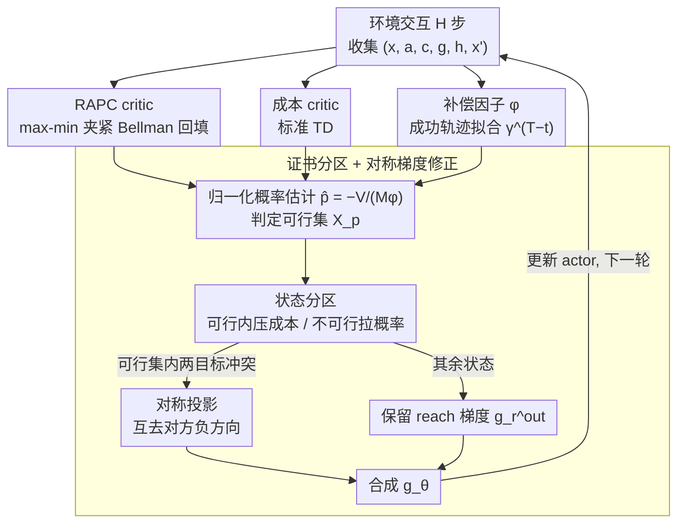

# Stochastic Minimum-Cost Reach-Avoid Reinforcement Learning

**会议**: ICML 2026  
**arXiv**: [2605.11975](https://arxiv.org/abs/2605.11975)  
**代码**: 无  
**领域**: 强化学习 / 安全 RL / Reach-Avoid 控制  
**关键词**: reach-avoid, 概率证书, Bellman 收缩, 补偿因子, 梯度修正

## 一句话总结
本文提出 Reach-Avoid Probability Certificate (RAPC), 用一个 max-min-夹紧的 Bellman 收缩算子让值函数下界 reach-avoid 概率, 配合一个对抗 $\gamma^T$ 衰减的 "补偿因子"作归一化, 再用对称梯度投影联合优化 "成本"与 "reach-avoid 概率"两个冲突目标, 在 MuJoCo 上同时拿到比 RC-PPO / RESPO / CPPO 更低的累积成本和更高的 reach 成功率。

## 研究背景与动机

**领域现状**: 安全 RL 把 reach-avoid (到达目标 + 避开危险) 当作核心模式; 主流做法包括 CMDP (Achiam, Sauté, CPPO)、reward shaping、HJ reachability、barrier function 等。大量真实场景 (AGV 路径, 自动驾驶) 同时要 "概率 $\ge p$ 满足 reach-avoid"且 "期望成本最小"——即 stochastic minimum-cost reach-avoid 问题。

**现有痛点**: 三类方法各有硬伤——(1) CMDP 把 reach 用稀疏 reward / shaping 隐式编码, 失去 reach-avoid 的语义, 调权重难, 容易陷入 infeasible; (2) chance-constrained / CVaR 方法刻画 "累积回报"的尾风险, 不刻画 "是否满足时序 reach-avoid 规约", 不对题; (3) HJ-based 的 RC-PPO (So 2024) 直接面向最小成本 reach-avoid, 但**只支持确定性环境**, 无法处理 stochastic 噪声。

**核心矛盾**: 现有理论里 "概率 reach-avoid 约束"与 "期望累积成本最小化"两个目标**结构不兼容**——前者要算事件的概率分布, 后者要算回报期望, CMDP 框架硬把它们都塞进同一个 expectation 里, 必然失真。

**本文目标**: (a) 定义一种证书 (RAPC), 给出 "$P(\mathbf{RA})\ge p$"的下界, 并能用 Bellman 学习; (b) 设计目标函数, 使可行集内最小化成本、不可行集内最大化 reach 概率; (c) 给出收敛性证明且能在 stochastic 环境跑通。

**切入角度**: 把 reach-avoid 概率证书做成 Bellman 算子的不动点——通过 $g, h$ 两个 shaping 函数 (Eq. 1) 把 "到达目标"和 "进入危险"编码进边界, 再用 max-min 夹紧让算子成为 $\gamma$-收缩。

**核心 idea**: 用 "max-min-clamped"Bellman 算子 $B^\pi[V]=\max\{h,\min\{g,\gamma\mathbb E V'\}\}$ 的唯一不动点 $V_{g,h}^\pi$ 给出 $\mathbb P_\pi(\mathbf{RA}_x)\ge-V_{g,h}^\pi(x)/M$ 的证书; 再引入补偿因子 $\phi_\gamma^\pi(x)=\mathbb E[\gamma^T\mid\mathbf{RA}_x]$ 校正 "长视野 → 估计过保守"问题; 最后用对称梯度修正同时优化成本 + 概率。

## 方法详解

### 整体框架
RAPCPO (Algorithm 1) 是 actor-critic 框架, 主循环每步: (1) 跑 horizon $H$ 步交互, 收集 $(x_t,a_t,c_t,g(x_t),h(x_t),x_{t+1})$ 进 buffer; (2) 用 Eq. 17 训 RAPC critic $Q_{g,h}(x,a;\eta)$; (3) 用 TD 训成本 critic $Q_c(x,a;\kappa)$; (4) 用成功 reach-avoid 轨迹的 $y_t=\gamma^{T-t}$ 训补偿因子 $\phi_\gamma(x;\xi)$; (5) 计算 critic-induced 可行集 $\mathcal X_p^{\pi_{\theta_l}}$ 并构造分区目标; (6) 用对称投影梯度更新 actor; (7) 重复直到收敛。

### 关键设计

**1. Reach-Avoid 概率证书 (RAPC) 与 max-min 夹紧 (clamped) Bellman 算子: 把"满足规约的概率"变成可学习的不动点**

真实 reach-avoid 概率 $\mathbb P_\pi(\mathbf{RA}_x)$ 没有 Bellman 递推、无法直接学, 这是把 reach-avoid 塞进 RL 的第一道坎。本文先用两个 shaping 函数把 reach/avoid 编码进边界: $g(x)<0$ (取 $-M$) on 目标集 $\mathcal T$、$g(x)>0$ on 非目标态; $h(x)=M$ on 危险集 $\mathcal F$、否则 $-M$。在此之上定义算子 $B^\pi[V](x)=\max\{h(x),\min\{g(x),\gamma\mathbb E_{a\sim\pi,x'}[V(x')]\}\}$ (Eq. 9), Lemma 4.4 证明它是 $\gamma$-收缩、有唯一不动点 $V_{g,h}^\pi$。沿一条成功 reach-avoid 轨迹 (hit time $T$、终态落在 $\mathcal T$), 算子退化为线性递推 $V(x_t)=\gamma V(x_{t+1})$, 边界 $V(x_T)=-M$, 于是 $V(x_0)=-\gamma^T M$; Theorem 4.5 由此给出证书 $\mathbb P_\pi(\mathbf{RA}_x)\ge-V_{g,h}^\pi(x)/M$——值函数成了 reach-avoid 概率的严格下界。真正的巧思在 $g(x)$ 的正值: 若像以往 fixed-$\gamma$ Bellman (Xue 2026, Eq. 8) 那样目标外信号全 0, reward 极稀疏、agent 会退化成原地不动; 而 $g(x)>0$ 在每个非目标态都提供 dense 信号、又不破坏概率语义, 这正是它能在 stochastic MuJoCo 上跑通的根本 (表 2: enhanced Bellman 在 HalfCheetah reach 率 0.80 vs fixed-$\gamma$ 0.44)。

**2. 补偿因子 $\phi_\gamma^\pi(x)$: 抵消 $\gamma^T$ 衰减, 让证书不再过保守**

上面的下界 $V_{g,h}^\pi=-\gamma^T M$ 里藏着一个 $\gamma^T$ 因子: hit time $T$ 越长, $V$ 被压得越小, 于是"真概率很高的长视野任务"会被误判成不可行, 算法又退化成"原地不动"。本文从近似分解 $V_{g,h}^\pi(x)\approx\mathbb E_\pi[-M\gamma^T\mid\mathbf{RA}_x]\,\mathbb P_\pi(\mathbf{RA}_x)=-M\phi_\gamma^\pi(x)\mathbb P_\pi(\mathbf{RA}_x)$ (Eq. 11) 出发, 把那个 $\gamma^T$ 的条件期望单独拎成补偿因子 $\phi_\gamma^\pi(x)=\mathbb E[\gamma^T\mid\mathbf{RA}_x]$, 反推出归一化的概率估计 $\hat p_\pi(x)=-V_{g,h}^\pi(x)/(M\phi_\gamma^\pi(x))$ (Eq. 13)。$\phi$ 用神经网络 $\phi_\gamma(x;\xi)$ 拟合, 训练数据只取成功 reach-avoid rollout、label 为 $y_t=\gamma^{T-t}$, MSE 优化 (Eq. 19); 当前轨迹没成功就跳过更新。有了 $\phi$ 做归一化, 可行集判定才准——消融 (Fig 6) 显示去掉 $\phi$ 后 HalfCheetah 额外成本暴涨、reach 率下滑, 说明它不是数值小修, 而是"长视野估计偏差"的本质修复。

**3. 证书诱导的状态分区与对称梯度修正: 让"压成本"和"拉概率"两个目标不打架**

有了归一化概率估计, 就能用当前 critic 构造 surrogate 可行集 $\mathcal X_p^{\pi_{\theta_l}}=\{x:V_{g,h}^{\pi_{\theta_l}}(x)\le-pM\phi(x),\,\phi(x)\ge 0\}$ (Eq. 15), 并据此分区: 可行状态上重点压成本、不可行状态上重点拉 reach 概率。难点在于可行集内两个目标常冲突——直接把成本梯度和概率梯度相加, 会互相抵消、训练不稳。为此先算三个梯度分量: 可行/不可行集上的 reach 概率梯度 $g_r^{in},g_r^{out}$ (概率项用 $-V_{g,h}/\phi$ 替代) 与可行集上的成本梯度 $g_c^{in}$; 当 $\langle g_r^{in},g_c^{in}\rangle<0$ 判定为冲突时, 做对称投影 $\tilde g_r^{in}=g_r^{in}-\frac{\langle g_r^{in},g_c^{in}\rangle}{\|g_c^{in}\|^2}g_c^{in}$ ($g_c^{in}$ 同样对称处理, Eq. 21), 各自去掉对方的负方向后合成 $g_{mix}=\tilde g_r^{in}+\tilde g_c^{in}$, 最终 $g_\theta=g_r^{out}+g_{mix}$ (Eq. 23)。这是 PCGrad 风格的二目标投影: 两个目标都只在"不伤害对方的子空间"里前进, 收敛更稳, 且论文观察到它通常会让最终 reach 概率超过阈值 $p$ (一项 nice property)。

### 损失函数 / 训练策略
- **RAPC critic loss** (Eq. 17): $\mathcal J_{Q_{g,h}}(\eta)=\frac12\mathbb E[(Q_{g,h}(x,a;\eta)-\hat Q_{g,h}(x,a))^2]$, target 是 max-min-clamped Bellman backup (Eq. 18)。
- **Cost critic loss**: 标准 TD。
- **$\phi$ loss**: MSE 到 $\gamma^{T-t}$, 仅在成功轨迹更新。
- **Actor**: 用 Eq. 23 的复合梯度, 实际实现基于 PPO; 论文设 $p=0.5$。
- **收敛性**: 在标准 step-size 与有界参数条件下, 在 differential inclusion 意义下几乎必然收敛到 surrogate 目标的广义稳定点 (Appendix B.2)。

## 实验关键数据

### 主实验

**Deterministic reach-avoid (相同迭代预算)** Table 1:

| Method | PointGoal reach | FixedWing reach |
|---|---|---|
| RC-PPO | 62.29% | 73.98% |
| **RAPCPO (ours)** | **78.49%** | **88.67%** |

Fig 2 进一步显示 RAPCPO 在两个环境的累积成本都低于 RESPO / CPPO / Sauté / PPO$_\beta$。

**Stochastic reach-avoid (10% 高斯动作噪声, Safety Hopper / HalfCheetah)** Fig 5: RAPCPO 在两环境都同时拿到**最低成本 + 最高 reach rate**, baseline 中 Sauté / CPPO 的 CVaR 约束过保守, RC-PPO 在 stochastic 下不稳。

### 消融实验

**Bellman 形式对比 (Table 2, 同迭代预算)**: 是否用 enhanced Bellman 公式 (Eq. 9) 替代 fixed-$\gamma$ Bellman (Eq. 8)。

| Method | Safety HalfCheetah | Safety Hopper | PointGoal | FixedWing |
|---|---|---|---|---|
| Fixed-$\gamma$ Bellman | 0.44 | 0.32 | 0.45 | 0.47 |
| **Enhanced Bellman** | **0.80** | **0.94** | **0.78** | **0.88** |

**补偿因子 $\phi$ 消融 (Fig 6)**: 去掉 $\phi$ 后, 累积成本显著上升 (FrozenLake 上估计严重过保守), reach 率也掉, 验证 $\phi$ 是 RAPCPO 的关键。

**$p$ 超参 (Fig 7, Safety Hopper)**: $p=0$ 时 reach 信号太弱, agent 摆烂; $p\in[0.1,0.7]$ 是甜点; $p\ge 0.8$ 因 stochastic 噪声反而把成本拉爆。

### 关键发现
- max-min-clamped Bellman 算子是 "既保证概率语义、又给 dense reward"的关键设计, 它把 reach-avoid 与 cost 解耦, 让两个 critic 可独立稳定训练。
- 补偿因子 $\phi$ 看似只是数值修正, 实际是 "long-horizon reach-avoid 估计偏差"的本质修复, 没有它整套算法 reach 率会显著下降。
- 对称梯度投影是这类 "双 critic + 双目标"算法的通用 trick, 在很多 Safe RL 上都能用。
- 把 reach 阈值 $p$ 调高未必更好——stochastic 环境下 $p$ 太大会逼迫 policy 选保守长路径, 反而成本爆炸, 这是工程上很有用的洞察。

## 亮点与洞察
- **理论结构清晰**: 算子收缩 → 不动点 → 概率证书 → 补偿因子 → 可行集 → 投影梯度, 每一步都对应一个工程痛点, 没有冗余设计。
- **dense 信号是关键**: $g(x)$ 在非目标态可以取非零正值, 这一改动看似小, 却把 Bellman 学习从 "几乎稀疏"变成 "几乎稠密", 是真正能跑通 stochastic MuJoCo 的根本原因。
- 把 reach-avoid 概率写成 Bellman 不动点的想法, 启发我们对其它 temporal logic 规约 (LTL until, response) 也可以构造类似算子, 这条路在形式化 RL 方向有很大延展空间。
- 双梯度对称投影也可以套到 "多任务 RL"、"对齐 RL"等场景, 是一个轻量、效果稳的工程包。

## 局限与展望
- Theorem 4.5 只给出充分条件, 不是充分必要; 即 $V_{g,h}^\pi(x)<0$ 不一定能覆盖所有真正满足 reach-avoid 的状态, 可能漏判可行点。
- $\phi$ 仅用成功轨迹训, 训练前期成功率极低时 $\phi$ 严重欠拟合, 反而扭曲可行集判定, 论文没有特别讨论冷启动稳定性。
- 实验只在 5 个 MuJoCo + FrozenLake 上做, 没有真正的高维 visuomotor / 自动驾驶基准; 模拟噪声只是简单 Gaussian, 真实部署中模型不确定性更复杂。
- $\mathcal X$ 前向不变 (Forward Invariant) 假设强, 边界外行为没有定义, 真实机器人物理边界往往会被跨过去。
- $p$ 是手调的, 对不同任务最优值不同, 缺少自适应机制。

## 相关工作与启发
- **vs RC-PPO (So 2024)**: RC-PPO 用 HJ reachability 解决最小成本 reach-avoid, 但仅 deterministic; RAPCPO 用 Bellman 证书 + 补偿因子推到 stochastic, 在确定性环境也更稳 (Table 1 reach 率高 16-15 个点)。
- **vs CMDP (CPPO / Sauté / RESPO)**: CMDP 用累积成本约束 surrogate, 与 reach-avoid 语义不齐; RAPCPO 直接优化 reach-avoid 概率, ablation 显示在 state-wise cost 设定下 CMDP 太保守。
- **vs CVaR / chance-constrained**: 它们刻画 return 的尾风险, 不是事件概率, 与 "必须 $\ge p$ 满足规约"目标不对题。
- **vs Barrier / CBF (Ames 2019, Xue 2026)**: 二者给形式化保证但只保证规约满足、不优化成本; RAPCPO 在概率证书框架下兼顾性能与安全。

## 评分
- 新颖性: ⭐⭐⭐⭐⭐ max-min-clamped Bellman + 补偿因子 + 对称投影三件套, 每一件都在解决一个具体痛点, 组合性原创性强。
- 实验充分度: ⭐⭐⭐ MuJoCo + FrozenLake 范围合理, 但缺少真实机器人 / 自动驾驶基准。
- 写作质量: ⭐⭐⭐⭐ 故事线和符号都清楚, 算子设计动机解释得很好。
- 价值: ⭐⭐⭐⭐ 给 stochastic reach-avoid 提供了第一个稳定可训练 baseline, 对安全 RL 社区直接可复用。

<!-- RELATED:START -->

## 相关论文

- [\[ICLR 2026\] Solving Parameter-Robust Avoid Problems with Unknown Feasibility using Reinforcement Learning](../../ICLR2026/reinforcement_learning/solving_parameter-robust_avoid_problems_with_unknown_feasibility_using_reinforce.md)
- [\[ICML 2026\] Convergence of Two-Timescale Markovian Stochastic Approximations with Applications in Reinforcement Learning](convergence_of_two-timescale_markovian_stochastic_approximations_with_applicatio.md)
- [\[NeurIPS 2025\] Robust Adversarial Reinforcement Learning in Stochastic Games via Sequence Modeling](../../NeurIPS2025/reinforcement_learning/robust_adversarial_reinforcement_learning_in_stochastic_games_via_sequence_model.md)
- [\[AAAI 2026\] DeepProofLog: Efficient Proving in Deep Stochastic Logic Programs](../../AAAI2026/reinforcement_learning/deepprooflog_efficient_proving_in_deep_stochastic_logic_programs.md)
- [\[AAAI 2026\] Good-for-MDP State Reduction for Stochastic LTL Planning](../../AAAI2026/reinforcement_learning/good-for-mdp_state_reduction_for_stochastic_ltl_planning.md)

<!-- RELATED:END -->
