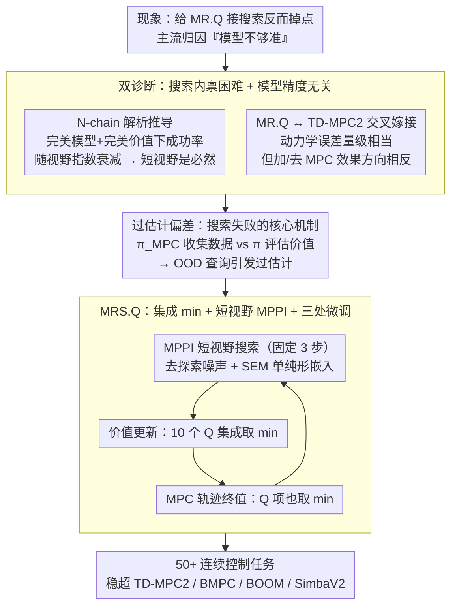

# The Surprising Difficulty of Search in Model-Based Reinforcement Learning

**会议**: ICML 2026  
**arXiv**: [2601.21306](https://arxiv.org/abs/2601.21306)  
**代码**: https://github.com/facebookresearch/MRSQ  
**领域**: 强化学习 / Model-Based RL / Planning  
**关键词**: 模型预测控制, 价值过估计, 集成最小值, 模型为表示, 搜索

## 一句话总结
作者反直觉地指出 model-based RL 中搜索失败的根因不是模型不准，而是 MPC 行为策略与价值函数训练策略不一致引发的过估计偏差，并提出在 10 个价值函数集成上"取最小"的 MRS.Q 算法，在 50+ 个连续控制任务上稳定超过 TD-MPC2、BMPC、BOOM、SimbaV2 等 SOTA。

## 研究背景与动机
**领域现状**：MBRL 的卖点是"学一个动力学模型 → 想象未来 → 规划"，TD-MPC2 用 MPPI 短视野搜索 + 价值函数引导成为公认强 baseline；与此同时，纯 model-free 的代表 MR.Q 把模型只当表示学习的辅助目标，没接搜索，照样打出 SOTA 水平。社区主流诊断 MBRL 不行的故事是"动力学预测一步步累积误差，搜得越远越烂"，因此大量工作砸在更准的模型、不确定性建模、长视野预测上。

**现有痛点**：(a) 用更准的模型做更长视野搜索常常并不带来性能提升；(b) 把 MPC 直接加到 MR.Q 上反而把 MR.Q 的强 baseline 拖垮；(c) 现有"搜索辅助"工作（TD-M(PC)²、BMPC、BOOM）把策略约束去 imitate 搜索动作，但搜索动作本身在训练中漂移很快，约束目标不稳定。这三件事说明"模型更准 → 搜索更好"这一隐含假设根本站不住。

**核心矛盾**：搜索的行为策略 $\pi_{\text{MPC}}$ 和价值函数训练时假设的目标策略 $\pi$ 不一致 —— 价值函数被用 $\pi$ 评估、却被 $\pi_{\text{MPC}}$ 收集数据查询，于是查询点落在训练分布外，引发 offline-RL 一样的过估计偏差（Fujimoto 2019）。模型再准也救不了这个 mismatch。

**本文目标**：分解为三个子问题 —— (i) 即使动力学和价值完美，搜索本身还有没有内禀困难？(ii) 模型精度真的能预测搜索是否带来收益吗？(iii) 如果不是模型精度，到底是什么决定了搜索成败？

**切入角度**：作者借 MR.Q 和 TD-MPC2 架构高度相似的事实（损失、状态嵌入、价值函数都类似）做交叉嫁接实验 —— 给 MR.Q 加 MPC、给 TD-MPC2 去 MPC，分离"是否搜索"和"模型质量"两个变量，从而干净地定位真正起作用的因素。

**核心 idea**：把视野固定到 3 步压住搜索空间膨胀，然后用 10 个价值函数集成的最小值在"算 target"和"MPC 算 final value"两处都做悲观估计，从源头压住搜索引入的过估计；最终算法叫 MRS.Q (Model-based Representations for Search and Q-learning)。

## 方法详解

### 整体框架
论文先做两段诊断，再给一个算法。诊断段：(1) 在 N-chain 这个有解析解的玩具 MDP 上证明，即使动力学和价值完美，均匀随机搜索找到非零回报轨迹的概率为 $1-(1-\frac{1}{A^n})^m$，视野 $n$ 一长就指数衰减；(2) 把 MR.Q 与 TD-MPC2 在 17 个 DMC/Gym 任务上对比"动力学误差 + unroll 误差"和"加/去 MPC 的性能差"，证明误差量级相当但 MPC 效果方向相反。这两段诊断推翻"模型不准"假设、正面把矛头指向价值过估计；算法段：MRS.Q 在 MR.Q 上做最小改动 —— 加 MPPI 短视野搜索、把价值函数 ensemble 从 2 加到 10 并且全 ensemble 取 min（且把 min 同时用到价值 target 和 MPC 轨迹终值）、加 SEM 单纯形嵌入、去掉额外探索噪声、把终止预测损失权重从 0.1 提到 1。

### 关键设计

**1. 搜索内禀困难 + 模型精度无关性的双诊断：把"搜索为什么失败"从"模型不够准"扭到"搜索机制本身 + 价值学习耦合"**

社区主流故事是"动力学预测一步步累积误差，搜得越远越烂"，作者用两段诊断把这个假设推翻。理论侧：N-chain 这个有解析解的玩具 MDP 上，唯一一条非零回报轨迹要求每步都选 $a_0$，随机采 $m$ 条长度 $n$ 的轨迹成功率是 $1-(1-A^{-n})^m$；$A=10, m=1000$ 时 $n=3$ 还有 0.63、$n=10$ 已掉到 $10^{-7}$——这是"完美模型 + 完美价值"下的纯组合困难，靠"更准"消除不了，也顺手说明了为什么短视野是必然选择而非工程妥协。实证侧：把 MR.Q 编码器最后一层换成 SEM 让两方法嵌入尺度可比，再算 dynamics MSE（按 $\gamma^t$ 加权三步）和 unroll error，结果 MR.Q + MPC 的 dynamics error 量级与 TD-MPC2 一致（$\sim 10^{-5}$）甚至更低，但 MPC 给 TD-MPC2 加分、给 MR.Q 几乎全面减分（DMC 上 cheetah-run −173、humanoid-stand −757；Gym 上 HalfCheetah −8395、Humanoid −5693）。两边一对照，模型精度压根不是搜索成败的决定因素。

**2. 过估计偏差作为搜索失败的核心机制：把诊断指向一个明确、可测、可治的量**

既然不是模型精度，那到底是什么？作者指向价值函数在 MPC 行为下的过估计。价值更新 $Q(s,a)\approx r+\gamma Q(s',\pi(s'))$ 用学习策略 $\pi$ 评估，但数据由 MPC 行为策略 $\pi_{\text{MPC}}$ 收集，于是查询点 $a\sim\pi_{\text{MPC}}$ 落在 $\pi$ 的分布外，引发 offline-RL 同款的过估计。论文测量 $|Q_{\text{learned}}-\hat{G}_{\text{behavior}}|/\hat{G}_{\text{behavior}}$（学习 Q 与真实折扣回报的百分误差），发现 MR.Q+MPC 在 17 个任务里几乎清一色正向过估计，且过估计幅度与 MPC 性能下降强相关；TD-MPC2 过估计整体较低，但在它表现差的任务（dog-stand, Gym Ant/Hopper/Humanoid/Walker2d）仍偏高。这把抽象的 distribution shift 具象成一张 17 任务过估计矩阵 + 性能变化符号对照，让"治过估计 = 治搜索"的因果链被实证而非比喻支撑。

**3. MRS.Q：10 价值函数集成 min + 短视野 MPPI + 三处微调，把搜索"安全地"接上来**

治法就是悲观估计。MRS.Q 在 MR.Q 骨架上对 ensemble 里 10 个 $Q_i$ 同时取最小，更新公式 $Q(s,a)\approx r+\gamma\min_{i\in\{1,...,10\}} Q_i(s',\pi(s'))$；关键是这个 min 不只用在 target 上，还用在 MPC 评估轨迹最终价值 $V(\tau)=\sum_{t=0}^{N-1}\gamma^t R(\tilde{z}_t,a_t)+\gamma^N \min_i Q_i(\tilde{z}_N,\pi(\tilde{z}_N))$ 的 $Q$ 项上，避免搜索偏好被高估的轨迹——这与 TD-MPC2 仅在 $N=5$ 中随机抽 2 个取 min（update 时）和 mean（MPC 时）有本质区别。其余配套都服务于"让搜索不被过估计带偏"：MPPI 短视野固定 3 步匹配 N-chain 分析；去掉 $\mathcal{N}(0,0.2^2)$ 探索噪声（MPC 本身已引入足够动作扰动，Figure 4 显示其选动作方差远大于策略网络）；加 SEM (Simplicial Embedding) 把潜表示投到概率单纯形上稳定多步 rollout、动力学损失权重 1→20 与 TD-MPC2 对齐；终止预测损失权重 0.1→1。作者特意不去 imitate 搜索（TD-M(PC)²、BMPC、BOOM 的路径），因为搜索动作训练中会快速漂移（Figure 4 显示 MPC 动作均方变化是策略网络的 3-5 倍），约束策略追这个不稳定靶子只会噪化训练；直接压低过估计才是从根因解决。

### 损失函数 / 训练策略
继承 MR.Q 的 $\mathcal{L}(z_s,W_p,W_r) = \mathcal{L}_{\text{Dyn}}(z_{sa}^\top W_p - z_{s'}) + \mathcal{L}_{\text{Reward}}(z_{sa}^\top W_r - r)$（模型仅作表示学习目标），价值学习用 $\mathcal{L}_{\text{Value}}(r+\gamma\min_{i=1..10}Q_i(z_{s'a'})-Q(z_{sa}))$；MPPI 用 TD-MPC2 的默认超参与采样规模；其余超参全沿用 MR.Q 默认值。全部 50+ 任务用同一组超参跑 1M 步 × 10 seed。

## 实验关键数据

### 主实验：4 个 benchmark 1M 步聚合性能（10 seed，95% CI）

| 算法 | MPC | Gym (TD3-norm) | DMC | HB (No Hand) | HB (Hand) |
|---|---|---|---|---|---|
| MR.Q | × | 1.46 [1.41, 1.52] | 0.84 [0.83, 0.84] | 0.48 [0.46, 0.49] | 0.31 [0.29, 0.32] |
| MR.Q + MPC | ✓ | 0.67 [0.55, 0.88] | 0.65 [0.63, 0.68] | 0.46 [0.45, 0.48] | 0.38 [0.37, 0.39] |
| TD-MPC2 | ✓ | 0.41 [0.27, 0.57] | 0.78 [0.77, 0.80] | 0.58 [0.56, 0.60] | 0.22 [0.19, 0.25] |
| TD-M(PC)² | ✓ | 0.62 | 0.76 | 0.51 | 0.44 |
| BMPC | ✓ | 0.54 | 0.86 | 0.40 | 0.38 |
| BOOM | ✓ | 0.61 | 0.83 | 0.55 | 0.23 |
| SimbaV2 | × | 1.44 | 0.84 | 0.38 | 0.18 |
| **MRS.Q (本文)** | ✓ | **1.54 [1.46, 1.60]** | 0.81 [0.79, 0.82] | **0.59 [0.58, 0.60]** | **0.58 [0.57, 0.58]** |

MRS.Q 在 4 个 benchmark 中拿下 3 个第一，HB-Hand 上 0.58 是次优 0.44 的 1.3 倍。

### 消融实验：相对完整 MRS.Q 的性能变化（10 seed）

| 配置 | Gym | DMC | HB (No Hand) | HB (Hand) | 说明 |
|---|---|---|---|---|---|
| 2 个价值函数 | −0.63 | −0.04 | −0.18 | −0.40 | 默认 ensemble 数量不够压过估计 |
| 5 个价值函数 | −0.37 | 0.00 | −0.02 | −0.13 | 接近最优但 Gym 仍掉 |
| 20 个价值函数 | −0.05 | −0.03 | +0.03 | +0.03 | 收益饱和，计算翻倍不划算 |
| 加回探索噪声 | −0.13 | −0.02 | −0.02 | −0.02 | MPC 本身已有动作扰动，再加噪反而干扰 |
| 去掉 SEM | −0.28 | −0.04 | +0.06 | +0.10 | SEM 主要保的是 Gym/DMC 多步稳定性 |
| Min 改为 ensemble 抽 2 取 min | −0.49 | +0.01 | −0.05 | −0.19 | 验证全 ensemble min 才是关键 |
| Min 不用于 MPC 评估 | −0.33 | −0.02 | −0.04 | −0.19 | 只 target 取 min 不够，必须 MPC final value 也用 |
| 把 Min(10) 移植回 TD-MPC2 | +0.07 | +0.03 | +0.02 | +0.11 | 这个 trick 对 TD-MPC2 也涨点，进一步证明过估计是普遍问题 |

### 关键发现
- ensemble size 收益在 ≈10 饱和，治过估计的 marginal benefit 是有上限的；2 个明显不够，20 个收益微小但代价翻倍。
- "MPC final value 也取 min"这一点的 ablation 最有意思 —— 单纯 target 取 min 会掉 0.19~0.33，说明 MPC 在轨迹排序时会主动偏好"被高估的潜在好轨迹"，搜索本身就是一个 maximization-bias amplifier。
- 把 Min(10) 嫁回 TD-MPC2 仍涨点（HB-Hand +0.11），意味着这不是 MR.Q 特异的修正，而是一类通用的"搜索-价值耦合"治理方案。
- Figure 4 显示 MPC 选动作的 step-to-step 方差是策略网络的 3-5 倍 —— 这是为什么 TD-M(PC)²/BMPC/BOOM 强行让 $\pi$ 去 imitate $\pi_{\text{MPC}}$ 不稳定的根本原因。

## 亮点与洞察
- **范式翻转**：长期被忽视的"搜索引入分布偏移"被定量化、可视化、可治化，作者把 MBRL 社区从"刷模型精度"扭到"治价值估计"，是少见的范式级贡献。
- **极简改动 + SOTA**：核心 trick 只是 ensemble 从 2→10 + 全 ensemble 取 min + min 用到 MPC final value 上，其余几乎不动，工程门槛极低，可作为后续 MBRL 工作的强 baseline。
- **N-chain 玩具论证**：用一个有解析解的环境讲清楚"为什么短视野是必然" —— 这种"先证不可能、再退一步设计"的写法值得学。
- **"模型只做表示"vs"模型用来搜索"的关系被重新调和**：MR.Q 提出"模型仅做表示"，MRS.Q 表明"模型既做表示也能做搜索 —— 只要把价值函数管好"，把这两条路线统一在同一个架构下。

## 局限与展望
- 集成 10 个 Q 函数训练计算开销显著，论文未深入讨论显存/吞吐影响，对资源受限场景不友好。
- 主要在连续控制 + 短视野（3 步）设置上验证，长视野规划、离散动作（如 MuZero 类）、棋类等场景的可迁移性未测。
- min-of-ensemble 是经验性悲观估计，没有形式化的过估计界保证；何时会过度悲观（pessimistic underestimation）反过来掉点尚无理论刻画。
- 论文聚焦"行为策略 vs 目标策略"的过估计，但相关工作（Lin 2025）还指出"策略网络 vs MPC"的二级过估计；两类是否可统一处理是顺手的 follow-up。

## 相关工作与启发
- **vs TD-MPC2 (Hansen 2024)**：架构高度相似（latent world model + MPPI + value），但 TD-MPC2 用 $N=5$ 随机抽 2 取 min，本文用 $N=10$ 全 ensemble 取 min 且应用到 MPC final value 上，性能差距证明"ensemble 大小 + 取 min 位置"是关键设计点。
- **vs TD-M(PC)² / BMPC / BOOM**：他们走"约束策略 imitate 搜索动作"路径，本文走"压价值函数过估计"路径；Figure 4 说明前者的目标在训练中漂移过快、噪声大；MRS.Q 在 4 个 benchmark 上全面超过这三个工作。
- **vs MR.Q (Fujimoto 2025)**：MR.Q 主张"模型只做表示、不做搜索"；本文证明搜索能复活，但代价是必须主动治理搜索引入的过估计。两者形成"模型作为表示 ↔ 模型作为搜索引擎"的连续谱。
- **vs Min-of-N (Fujimoto 2018, An 2021)**：经典 TD3/REDQ 用 Min(2)/Min(N) 对抗一般 over-estimation；本文把这一 trick 重新场景化为"专治搜索 OOD"，并验证 10 已足够。

## 评分
- 新颖性: ⭐⭐⭐⭐⭐ 把 MBRL 搜索失败的根因从"模型不准"重新定位到"价值过估计"，是一次有说服力的诊断翻转。
- 实验充分度: ⭐⭐⭐⭐⭐ 50+ 任务 × 10 seed × 4 benchmark × 7 baseline × 7 项消融，并配 N-chain 解析推导和 17 任务过估计矩阵，证据链完整。
- 写作质量: ⭐⭐⭐⭐ 故事线非常清晰（诊断 → 机制 → 算法 → 验证），表格充分；少数图（Figure 3 的过估计矩阵）信息密度极高需要细看。
- 价值: ⭐⭐⭐⭐⭐ MRS.Q 是新的 MBRL 强 baseline，且 Min(10) 嫁接给 TD-MPC2 也涨点，对整个 MBRL 社区都有立刻可用的工程价值。

<!-- RELATED:START -->

## 相关论文

- [\[ICML 2026\] D$^2$Evo: Dual Difficulty-Aware Self-Evolution for Data-Efficient Reinforcement Learning](d2evo_dual_difficulty-aware_self-evolution_for_data-efficient_reinforcement_lear.md)
- [\[ICML 2026\] Learning to Search and Searching to Learn for Generalization in Planning](learning_to_search_and_searching_to_learn_for_generalization_in_planning.md)
- [\[ICML 2026\] Coupled Variational Reinforcement Learning for Language Model General Reasoning](coupled_variational_reinforcement_learning_for_language_model_general_reasoning.md)
- [\[ICML 2026\] Long-Horizon Model-Based Offline Reinforcement Learning Without Explicit Conservatism](long-horizon_model-based_offline_reinforcement_learning_without_explicit_conserv.md)
- [\[NeurIPS 2025\] EvoLM: In Search of Lost Language Model Training Dynamics](../../NeurIPS2025/reinforcement_learning/evolm_in_search_of_lost_language_model_training_dynamics.md)

<!-- RELATED:END -->
