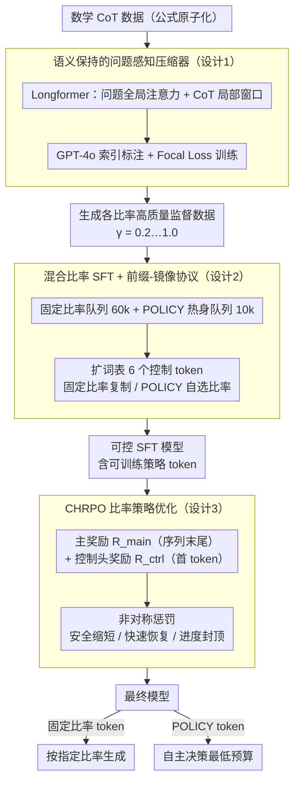

# Extra-CoT：极端压缩比下的思维链压缩框架

**会议**: ICML2026  
**arXiv**: [2602.08324](https://arxiv.org/abs/2602.08324)  
**代码**: https://github.com/Mwie1024/Extra-CoT  
**领域**: LLM推理  
**关键词**: 思维链压缩, CoT效率, 强化学习, 推理加速, token预算控制  

## 一句话总结
Extra-CoT 提出一个三阶段框架（语义保持压缩器 → 混合比率SFT → 层次化奖励RL），在极端压缩比（保留仅20%的token）下仍能维持推理精度，在MATH-500上实现73%的token缩减同时精度提升0.6%。

## 研究背景与动机

**领域现状**：大语言推理模型（如OpenAI o1、DeepSeek-R1）通过生成逐步的思维链（CoT）显著提升了推理能力，但伴随着巨大的token开销——模型容易"过度思考"，即使对简单问题也生成冗余推理路径。

**现有痛点**：现有的可控CoT压缩方法（如TokenSkip、CTS）在中低压缩比（保留50-60% token）下尚可工作，但在高压缩比（保留20-30% token）下性能急剧崩溃。根本原因是它们依赖通用的token重要性评估器（如LLMLingua-2），无法在极端压缩下保留稀疏但关键的推理步骤，导致语义完整性和逻辑忠实性的致命损失。

**核心矛盾**：CoT的完整性和推理准确率直接相关，但极端压缩必然丢失大量token。现有方法无法做到"语义保持的极端压缩"——通用压缩器会破碎数学公式、打断推理链条，且模型不遵守极低比率指令（"控制崩溃"）。

**本文目标**：实现极端压缩比（$\gamma = 0.2$，即仅保留20% token）下的高精度推理。

**切入角度**：问题的根源在于三个层面：(1) 压缩监督数据质量差——通用压缩器会打碎公式；(2) 模型不信任低比率训练数据导致不遵守指令；(3) 缺乏显式激励让模型主动选择低预算。

**核心 idea**：用三阶段流水线逐层解决——先用专门的问题感知压缩器生成高质量监督数据，再通过混合比率SFT教会模型遵守各种压缩指令，最后用层次化奖励RL优化模型自主选择极低预算。

## 方法详解

### 整体框架
Extra-CoT 包含三个串行阶段：(a) 训练一个语义保持的CoT压缩器，生成各个压缩比下的高质量训练数据；(b) 对推理LLM进行混合比率SFT，教会它遵循不同的压缩预算指令（如 $\langle\text{COMP\_40}\rangle$），同时引入策略token（$\langle\text{COMP\_POLICY}\rangle$）作为RL阶段的可训练机制；(c) 使用CHRPO（约束与层次化比率策略优化）对策略token进行RL优化，显式激励模型在保持精度的前提下选择最低预算。推理时，输入固定比率token则按指定比率生成，输入POLICY token则由模型自主决策。

### 关键设计

**1. 语义保持的问题感知压缩器：先把监督数据做对，公式不碎、推理链不断**

极端压缩失败的源头是监督数据质量差——通用压缩器（LLMLingua-2）会把数学公式打碎、产生语义断裂，模型自然学不会、也不信任低比率指令。Extra-CoT 专门训一个压缩器：以 Longformer 为骨干，对问题 token 启用全局注意力（question-aware）、对 CoT token 用滑动窗口局部注意力；监督标签由 GPT-4o 按索引标注方式生成——只返回需保留的 span 索引集合 $R \subseteq \{1,\dots,m\}$，避开公式渲染差异带来的噪声。最关键的一招是"公式原子化"：先把所有 LaTeX 实体和数学表达式合并成不可分割的单元，确保压缩器不会拆碎符号推理组件。训练用类别加权的 Focal Loss $\mathcal{L}_{\text{Focal}} = -\mathbb{E}_{i}[\alpha_{y_i}(1-p_{i,y_i})^{\lambda}\log p_{i,y_i}]$。问题感知 + 公式原子化保住了数学完整性，从根上切断"低质量监督 → 模型不遵守指令"的级联。

**2. 混合比率 SFT + 前缀-镜像协议：教模型听懂各种压缩预算并学会自主选择**

直接在单一极端比率上 SFT 会崩，所以要先建立"压缩梯度"的鲁棒认知。Extra-CoT 扩充词表引入 6 个控制 token（$\langle\text{COMP\_20}\rangle$ 到 $\langle\text{COMP\_POLICY}\rangle$），并设计"前缀-镜像协议"：固定比率模式下模型复制输入的控制 token，POLICY 模式下模型先自主预测一个比率 token 再生成推理。训练数据分两个队列——固定比率队列（60k 样本，5 个比率各 12k）让模型学会在多种压缩比下可控生成，POLICY 热身队列（10k 样本，由启发式难度选择模型决定目标比率）为后续 RL 预置一个可训练的决策机制。多比率训练是关键：见过完整压缩梯度的模型才不会在极端比率下失控。

**3. CHRPO：用层次化奖励 + 非对称惩罚把比率选择推到极低预算又不掉精度**

比率选择发生在序列第一个 token，而精度信号在序列末尾，单一奖励下这个决策离结果信号太远、梯度被稀释，策略只好规避风险、不敢压。CHRPO 拆成两级奖励：主奖励 $\mathcal{R}_{\text{main}}$ 施加在序列末尾所有 token，含精度奖励、Huber 型预算校准、比率优化模式和推理完整性约束；控制头奖励 $\mathcal{R}_{\text{ctrl}}$ 只施加在第一个 token，直接塑造比率选择策略、给它即时反馈缩短信用传播距离。非对称惩罚再加三重保障：安全缩短（$\lambda_{\text{under}}^{\text{err}} > \lambda_{\text{over}}^{\text{err}}$，压过头失败比留太长失败罚得更重）、快速恢复（难题时偏好上调预算而非死守低预算）、进度封顶（$\kappa$ 限制成功压缩的奖励上限，避免不稳定跳跃）。整体逻辑是"不确定时安全退回、有把握时才敢压到底"。

## 实验关键数据

### 主实验

| 方法 | 数据集 | 目标比率 | ActRatio | Token数↓ | Acc↑ |
|------|--------|---------|----------|---------|------|
| Base Model (Qwen3-1.7B) | MATH-500 | - | - | 1675 | 64.2 |
| TokenSkip | MATH-500 | 0.2 | 0.39 | 660 | 23.4 |
| Extra-CoT (SFT) | MATH-500 | 0.2 | 0.29 | 481 | 47.8 |
| Extra-CoT (CHRPO) | MATH-500 | POLICY | 0.27 | 452 | **64.8** |
| Thinkless (DeGRPO) | MATH-500 | - | 0.53 | 888 | 63.6 |
| TokenSkip | GSM8K | 0.2 | 0.30 | 273 | 59.1 |
| Extra-CoT (SFT) | GSM8K | 0.2 | 0.34 | 303 | 80.2 |
| Extra-CoT (CHRPO) | GSM8K | POLICY | 0.24 | 210 | **85.8** |

### 消融实验（CHRPO奖励组件，Qwen3-1.7B）

| 配置 | GSM8K Token↓ | GSM8K Acc↑ | MATH-500 Token↓ | MATH-500 Acc↑ |
|------|-------------|-----------|----------------|--------------|
| w/o $\mathcal{R}_{\text{mode+ctrl}}$ | 324 | 85.7 | 604 | 60.0 |
| w/o $\mathcal{R}_{\text{ctrl}}$ | 258 | 82.1 | 568 | 59.6 |
| Full CHRPO | **210** | **85.8** | **452** | **64.8** |

### 关键发现
- 在极端压缩比0.2下，Extra-CoT在MATH-500上比TokenSkip高出**+24.4**个精度点（47.8 vs 23.4），证明高质量压缩监督的决定性作用
- CHRPO策略在MATH-500上以0.27的ActRatio达到64.8%精度，优于Thinkless（0.53 ActRatio / 63.6%精度），用不到一半的token达到更高精度
- 去掉 $\mathcal{R}_{\text{mode}}$ 后token数从210激增到324，说明mode奖励是驱动策略走向极低预算的核心引擎
- 端到端延迟：Extra-CoT在GSM8K上实现3.24×加速，MATH-500上2.35×加速

## 亮点与洞察
- **公式原子化标注**是一个非常巧妙的设计：不让压缩器看到公式的内部token，而是把整个LaTeX表达式当作不可分割的单元。这避免了通用压缩器最致命的失败模式——公式碎片化。这个思路可迁移到任何涉及结构化文本压缩的场景（代码压缩、SQL压缩等）
- **层次化奖励的时序分离**解决了RL中一个普遍问题：当关键决策（选比率）发生在序列开头，而结果信号（精度）在结尾时，信用分配极其困难。CHRPO在第一个token上施加独立的即时奖励，有效缩短了信用传播距离
- 非对称惩罚设计（缩短失败 > 过长失败）体现了"安全第一"的工程直觉——让策略在不确定时选择保守，而非冒险压缩

## 局限与展望
- 压缩器训练依赖GPT-4o进行索引标注，数据生成成本较高
- 实验主要在数学推理任务上验证，对代码生成、逻辑推理等其他推理类型的泛化性尚未充分探索
- 固定的5级离散比率网格（0.2/0.4/0.6/0.8/1.0）可能限制了策略的灵活性，连续比率控制值得探索

## 相关工作与启发
- TokenSkip（Xia et al., 2025）：使用LLMLingua-2作为压缩器的先驱工作，但在极端比率下性能崩溃
- Thinkless（Fang et al., 2025）：通过DeGRPO解耦模式选择和答案生成，但调节推理长度而非内容
- COCONUT（Hao et al., 2024）：在潜在空间进行推理压缩，但存在灾难性遗忘

<!-- RELATED:START -->

## 相关论文

- [\[ICML 2026\] ASAP: Exploiting the Satisficing Generalization Edge in Neural Combinatorial Optimization](asap_exploiting_the_satisficing_generalization_edge_in_neural_combinatorial_opti.md)
- [\[ICML 2026\] MindZero: Learning Online Mental Reasoning with Zero Annotations](mindzero_learning_online_mental_reasoning_with_zero_annotations.md)
- [\[ICML 2026\] Can Large Language Models Generalize Procedures Across Representations?](can_large_language_models_generalize_procedures_across_representations.md)
- [\[ICML 2026\] Beyond the Proxy: Trajectory-Distilled Guidance for Offline GFlowNet Training](beyond_the_proxy_trajectory-distilled_guidance_for_offline_gflownet_training.md)
- [\[ICML 2026\] Randomized Advantage Transformation (RAT): Computing Natural Policy Gradients via Direct Backpropagation](randomized_advantage_transformation_rat_computing_natural_policy_gradients_via_d.md)

<!-- RELATED:END -->
