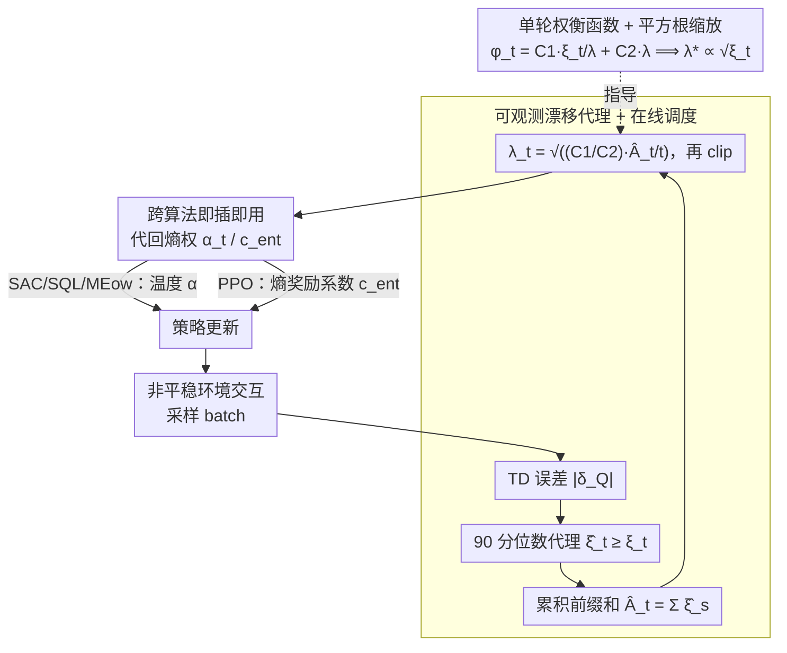

# Tracking Drift: Variation-Aware Entropy Scheduling for Non-Stationary Reinforcement Learning

**会议**: ICML 2026  
**arXiv**: [2601.19624](https://arxiv.org/abs/2601.19624)  
**代码**: 待确认  
**领域**: 强化学习 / 非平稳学习  
**关键词**: 非平稳强化学习, 熵调度, 变差预算, 探索-利用权衡, 自适应

## 一句话总结
AES 把最大熵 RL 的探索强度调度问题投影到在线凸优化的动态遗憾框架，导出"熵权应与环境漂移幅度的平方根成正比"的硬理论结果，再用 TD 误差分位数作为可观测漂移代理实现完全在线的算法不可知熵调度——在 SAC / PPO / SQL / MEow 四种框架 + 12 个任务上，激变恢复时间普遍减半。

## 研究背景与动机

**领域现状**：现代最大熵 RL（SAC 等）通过熵系数显式控制探索-利用平衡，但实践中熵系数通常固定或仅对平稳环境调优。真实场景里环境不断变化——机器人遇不同物理条件、自动驾驶适应交通模式、推荐系统跟踪偏好漂移。

**现有痛点**：固定熵系数同时招致两个问题——（1）稳定期过度探索浪费样本；（2）变化后探索不足减慢恢复。既有非平稳 RL：变点检测引入额外复杂度难集成；滑窗缺乏原理指导；元学习虽能加速适应但没明确刻画"环境变差速率 → 最优熵值"的映射。

**核心矛盾**：环境变化明显需要提高探索强度，但"提高多少"缺乏理论答案。现有方法基本是启发式或环境相关的。

**本文目标**：给出原则性的、显式依赖环境变差程度的熵调度策略，在非平稳 MDP 下自动调节。

**切入角度**：从在线凸优化的动态遗憾视角看，最优解（漂移比较器）随时间变化时，学习器面临"追踪漂移 vs 保持稳定"的一维权衡。把熵控制问题转化为这个权衡，可以解出熵权与漂移速率的函数关系。

**核心 idea**：从动态遗憾推出单轮损失 $\varphi_t(\lambda) = C_1 \xi_t / \lambda + C_2 \lambda$（$\xi_t$ 为漂移幅度），最小化得 $\lambda_t^* \propto \sqrt{\xi_t}$ 的**平方根缩放**规则；再用可观测漂移代理（TD 误差分位数）替换不可观的 $\xi_t$，得到完全在线的自适应熵调度。

## 方法详解

### 整体框架
AES 三层：

1. **理论层**：从非平稳 OCO 推动态遗憾界，证明熵权应与漂移幅度的平方根成正比。
2. **在线层**：用可观测漂移代理替换未知的最优比较器漂移，得到完全在线的调度规则 $\lambda_t = \sqrt{(C_1 / C_2) \cdot \widehat{A}_t / t}$，$\widehat{A}_t$ 是累积漂移代理。
3. **实现层**：把调度后的熵系数 $\alpha_t$ 或 $c_{\text{ent}, t}$ 插入 SAC / PPO / SQL / MEow，作为即插即用的探索控制层，不改算法核心结构。

### 关键设计

**1. 单轮权衡函数 + 平方根缩放：给"探索该加多少"一个硬公式**

固定熵系数失败的根源是没人回答"环境变了到底该把探索提高多少"。作者通过动态镜像下降引理分析非平稳 OCO，把熵权 $\lambda$ 的单轮贡献写成

$$\varphi_t(\lambda) = C_1\,\xi_t/\lambda + C_2\,\lambda,$$

第一项是"追踪成本"——漂移 $\xi_t$ 越大、熵权越小则追踪越慢；第二项是"稳定成本"——熵权越大则不必要的随机性越多。对 $\lambda$ 求导令零得 $\lambda_t^* = \sqrt{(C_1/C_2)\cdot\xi_t}$。这个平方根缩放第一次把探索强度和环境漂移定量绑定，取代了以往清一色的启发式调参，也顺带从"追踪成本 vs 稳定成本"的角度解释了固定熵为什么两头不讨好——漂移期 $\lambda$ 太小追不上、稳定期 $\lambda$ 太大白浪费。

**2. 可观测漂移代理 + 在线调度：用 TD 误差分位数顶替不可观的 $\xi_t$**

$\lambda_t^*\propto\sqrt{\xi_t}$ 漂亮，但 $\xi_t$（最优比较器的漂移）实际观测不到。作者的对策是找一个保守上界代理 $\widehat{\xi}_t\geq\xi_t$（不要求无偏），默认取当前 batch 中 TD 误差绝对值的 90 分位数 $\widehat{\xi}_t = \mathrm{Quantile}_{0.9}(|\delta_Q|)$（PPO 里改用值函数 TD 误差）。这个信号在环境变化时会自然上升——旧价值函数对新环境的预测变得不准，TD 误差随之放大。取前缀和 $\widehat{A}_t = \sum_{s=1}^t \widehat{\xi}_s$，得到完全在线的调度 $\lambda_t = \sqrt{(C_1/C_2)\cdot\widehat{A}_t/t}$，再 clip 到 $[\lambda_{\min},\lambda_{\max}]$ 保数值稳定。选 TD 误差是因为它是 RL 既有、无需额外计算的信号，且作为连续量比离散变点检测更适合应对渐变或周期性漂移。

**3. 跨算法即插即用：一套接口适配温度型和系数型四种框架**

最大熵 RL 各算法的熵权藏在不同位置——SAC / SQL / MEow 用温度 $\alpha$，PPO 用熵奖励系数 $c_{\text{ent}}$。AES 不动算法核心逻辑，只在每个训练步算出漂移代理、经调度规则得到新熵权，再代回算法既有位置（如 SAC actor 损失里的 $\alpha_t\log\pi(a\mid s)$）。之所以做成算法不可知的统一接口，是因为 RL 社区同时存在温度 vs 系数两种正则化写法、off-policy vs on-policy 两类框架，统一接口才能让这套"漂移→熵权"的原理最大化覆盖——实验里 SAC/PPO/SQL/MEow 四种载体恢复时间普遍减半正是这一点的验证。

### 训练策略
非平稳软 MDP 学习目标 $J_t(\pi) = \mathbb{E}[\sum_h \gamma^h (r_t(s_h, a_h) + \mu H(\pi(\cdot \mid s_h)))]$；AES 调整 $\mu$ 或 $\alpha_t$ 控制熵项权重；理论上 $\lambda_t^* \propto \sqrt{\xi_t}$，实际用 $\lambda_t = \sqrt{\widehat{A}_t / t}$（加 clip）。

## 实验关键数据

### 主实验：四种漂移模式下的归一化 AUC

| 任务族 | 模式 | 标准 SAC | SAC + AES | 改善 |
|--------|------|---------|-----------|------|
| Toy (2D) | Steady | 1.00 | 1.13 | +13% |
| Toy (2D) | Abrupt | 0.72 | 0.88 | +22% |
| Toy (2D) | Periodic | 0.81 | 0.94 | +16% |
| Toy (2D) | Mixed | 0.73 | 0.97 | +33% |
| MuJoCo (平均) | Steady | 1.00 | 1.24 | +24% |
| MuJoCo (平均) | Abrupt | 0.67 | 0.87 | +30% |
| MuJoCo (平均) | Periodic | 0.68 | 0.94 | +38% |
| MuJoCo (平均) | Mixed | 0.65 | 0.94 | +45% |
| Isaac Gym (平均) | Periodic | 0.57 | 0.95 | +67% |
| Isaac Gym (平均) | Mixed | 0.51 | 0.79 | +55% |

所有非平稳模式下 SAC + AES 显著优于标准 SAC，尤其 Mixed / Periodic 模式提升最大；Steady 下也不退化反略升 +13%，说明自适应熵调度不会惩罚稳定阶段。

### 消融实验：激变恢复时间（百分比 ↓ 越小越好）

| 任务 | SAC | SAC + AES | PPO | PPO + AES | MEow | MEow + AES |
|------|-----|-----------|-----|-----------|------|-----------|
| Hopper | 12.2 | 6.4 | 12.7 | 6.1 | 6.1 | 4.7 |
| HalfCheetah | 9.6 | 5.1 | 11.8 | 5.1 | 7.7 | 4.4 |
| Walker2d | 10.9 | 5.6 | 12.2 | 5.5 | 9.0 | 4.7 |
| Humanoid | 14.8 | 8.6 | 16.3 | 10.3 | 15.1 | 7.5 |
| **平均** | **13.96** | **7.74** | **12.12** | **8.43** | **11.58** | **6.42** |

激变恢复时间定义为从变化点到性能恢复所需的环境交互步数占总步数百分比。四种算法载体的平均恢复时间都减半（SAC 13.96% → 7.74%，MEow 11.58% → 6.42%）。高维任务（AllegroHand、FrankaCabinet）改善最明显（~17% → ~9%）——符合理论预期：维度越高、漂移越剧，自适应探索的收益越大。

### 关键发现
- 自适应熵调度对所有四类漂移模式都有显著提升，且 Steady 下不退化。
- 跨算法验证 AES 是通用的、算法不可知的控制原理。
- 高维 / 强漂移场景收益最大，验证理论中"权衡狭窄区"的实际存在。

## 亮点与洞察
- **硬理论支撑的探索强度公式**：从动态遗憾导出 $\lambda^* \propto \sqrt{\xi_t}$，是 RL 中少见的、与环境漂移定量绑定的指导。
- **因果机制显式刻画**：通过"追踪成本 vs 稳定成本"框架解释为什么固定熵系数失败——漂移期太小 $\lambda$ 追踪慢、稳定期太大 $\lambda$ 浪费。
- **可迁移系统设计**：即插即用机制使 AES 无缝适配 SAC / PPO / SQL / MEow 四种截然不同的算法。
- **TD 误差作为变化检测信号**：免费、连续、对渐变 / 突变都有响应，比专门设计的变点检测器更鲁棒。

## 局限与展望
- 漂移代理的保守性 / 噪声：TD 误差上分位数可能因优化波动产生虚假信号，多智能体 / 高维下需要更精细校准。
- 理论基于表格 + 完全可观测，深度 RL 函数逼近下的偏差项 $\mathrm{Bias}_t$ 无显式界。
- 默认代理只比较了 TD 90 分位数，没系统比较其他可能代理（策略参数漂移、模型不确定性）。
- 与变点检测、内在奖励、meta-RL 等机制的联合未充分探索。

## 相关工作与启发
- **vs 变点检测**（Alami 2023；Chartouny 2025）：精确定位 vs 连续信号；前者强保证但难集成、后者轻量但模糊。两者可互补组合。
- **vs 内在奖励**（ICM、RND）：好奇心调节"哪些状态被探索"（状态偏好）；AES 调节"全局策略多随机"（整体熵）。目标变化但状态新颖性不必然上升的场景下，AES 更直接。
- **vs Meta-RL**：元学习快速适应能力 + 固定熵正则化；AES 显式把探索强度绑定漂移幅度，分布变化场景下更有针对性。
- **vs 滑窗 / 时间衰减**：早期非平稳 RL 用固定衰减 $\mathcal{O}(t^{-1/2})$，缺乏原理指导；AES 通过在线变差估计动态响应。

## 评分
- 新颖性: ⭐⭐⭐⭐⭐  首次在最大熵 RL 中建立探索强度与环境漂移幅度的定量关系；动态遗憾分析的应用角度新颖。
- 实验充分度: ⭐⭐⭐⭐⭐  4 个算法框架 × 12 个任务 × 4 种漂移模式 × 3 个互补指标，验证全面。
- 写作质量: ⭐⭐⭐⭐  逻辑清晰，理论推导严谨，实验描述详细；技术细节放附录略减主文丰满度。
- 价值: ⭐⭐⭐⭐⭐  非平稳 RL 日益重要但理论不足；本文给出首个原则性的、可实施的探索控制策略，即插即用确保广泛实际应用潜力。

<!-- RELATED:START -->

## 相关论文

- [\[NeurIPS 2025\] Forecasting in Offline Reinforcement Learning for Non-stationary Environments](../../NeurIPS2025/reinforcement_learning/forecasting_in_offline_reinforcement_learning_for_non-stationary_environments.md)
- [\[NeurIPS 2025\] Solving Continuous Mean Field Games: Deep Reinforcement Learning for Non-Stationary Dynamics](../../NeurIPS2025/reinforcement_learning/solving_continuous_mean_field_games_deep_reinforcement_learning_for_non-stationa.md)
- [\[ICML 2026\] D$^2$Evo: Dual Difficulty-Aware Self-Evolution for Data-Efficient Reinforcement Learning](d2evo_dual_difficulty-aware_self-evolution_for_data-efficient_reinforcement_lear.md)
- [\[ICML 2026\] Break the Block: Dynamic-size Reasoning Blocks for Diffusion Large Language Models via Monotonic Entropy Descent with Reinforcement Learning](break_the_block_dynamic-size_reasoning_blocks_for_diffusion_large_language_model.md)
- [\[ICML 2026\] Convergence of Steepest Descent and Adam under Non-Uniform Smoothness](convergence_of_steepest_descent_and_adam_under_non-uniform_smoothness.md)

<!-- RELATED:END -->
