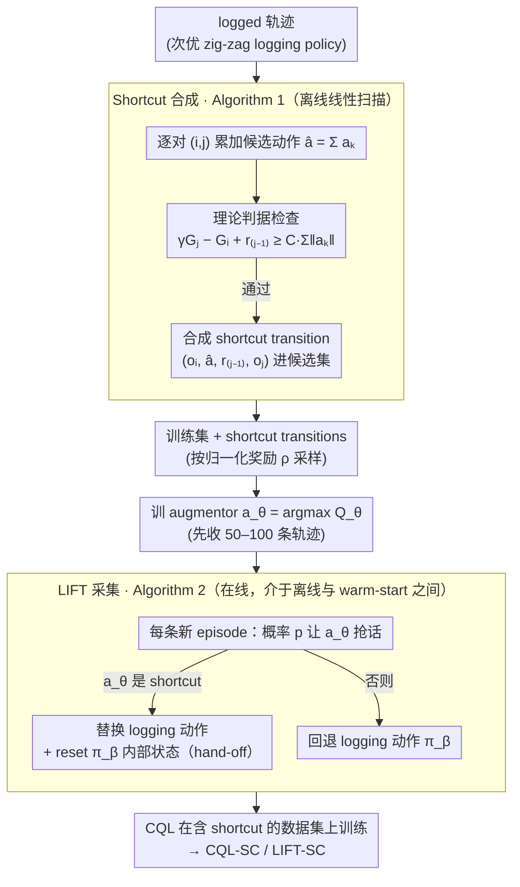

# Trajectory-Level Data Augmentation for Offline Reinforcement Learning

**会议**: ICML 2026  
**arXiv**: [2605.13401](https://arxiv.org/abs/2605.13401)  
**代码**: https://github.com/HS-Kempten/lift  
**领域**: 强化学习 / 离线 RL / 数据增广 / 主动定位  
**关键词**: 离线 RL、轨迹增广、shortcut、CQL、主动定位

## 一句话总结
本文提出 LIFT：在主动定位任务里，利用轨迹几何性质把次优 logging policy 留下的冗余 zig-zag 轨迹"抄近道"成 shortcut，并把这些合成 transition 喂给一个轻量增广器在数据采集期间替换 logging 动作，使离线 CQL 在低维到高维、partial obs 等各种设置下显著超越普通离线 RL 与 warm-start SAC。

## 研究背景与动机
**领域现状**：离线 RL 主流是"保守更新 + 行为正则"（BC 损失、CQL 悲观 critic、IQL 期望分位策略提取），所有这些算法层手段都默认数据集已经"足够好"。但大量证据显示数据集本身的质量（覆盖、专家度、轨迹结构）对最终性能的影响往往超过算法本身的差异。

**现有痛点**：在工业级主动定位场景（光学对准、相机/望远镜装配、机械臂粗定位）里，logging policy 通常是带内部状态的脚本化"坐标走法"——粗→细、维度逐个收敛，可靠但严重次优，会产出大量绕弯路。已有路线要么走纯离线（受限于数据质量），要么走 offline-to-online fine-tuning（需要昂贵的在线交互）。中间地带——"用 logging 时直接改善数据"——基本被忽视。同时硬注入更优动作会触发"hand-off 问题"：脚本被打断后无法恢复，必须 reset 整段。

**核心矛盾**：要在采集期间塞入更优动作，但 (i) 增广器在数据极少时就要给出可靠建议；(ii) 不能破坏 logging policy 后续推进；(iii) 需要对动力学扰动 $f$ 和值函数 $V^\pi$ 同时给出"什么时候 shortcut 真的更优"的理论判据。直接把多步动作相加 $a = \sum a_k$ 既不保证到达 $s_j$，也不保证 $V$ 在 $s_j$ 附近稳定。

**本文目标**：(1) 给出可在已有 logged 轨迹上识别 shortcut 的充分条件；(2) 在数据采集时用这些 shortcut 训练一个 augmentor 替换部分 logging 动作；(3) 验证这种"中间地带"方法相比纯离线 + warm-start RL 是否更数据高效。

**切入角度**：观察到 distance-improving logging policy 在带几何结构的定位任务上有强先验——后状态总比前状态离目标更近，因此从前后状态值差就能推断潜在 shortcut 价值，无需重新执行就能合成 transition。

**核心 idea**：用"距离改善 + LPE（线性位置误差）+ $L_V$-Lipschitz 值函数"三条件给出"$\sum a_k$ 是 $\pi$-shortcut"的可验证不等式，把它实例化成 Algorithm 1 一行行扫 logged 轨迹合成 shortcut transition，再用这些 transition 训练 augmentor 在采集时按概率 $p$ 替换 logging 动作。

## 方法详解

### 整体框架
主动定位被建模为上下文 POMDP：状态 $(s, W) \in \mathcal{P} \times \mathcal{W}$，动作 $a \in \mathcal{A}$，动力学 $s' = f(s, a, W)$，奖励 $R = -\|f(s,a,W) - s_W\|$；典型 $f(s,a,W) = s + W \cdot a$（线性误差）或带非线性扰动的形式。整套流水线分两层：(1) 离线 shortcut 合成（Algorithm 1）从一条 logged 轨迹里找出满足理论条件的 $(o_i, \hat{a}, r_{j-1}, o_j)$ 三元组送入训练集；(2) 在线 LIFT 采集（Algorithm 2）按概率 $p$ 用基于 $Q_\theta$ 的 augmentor $a_\theta(o) = \arg\max_a Q_\theta(o,a)$ 替换 logging 动作，触发替换后立刻 reset logging policy 的内部状态以保证 hand-off。最终 CQL 在含 shortcut transition 的数据集上训练得到 CQL-SC，与 LIFT 联合即为 LIFT-SC。

### 关键设计

**1. Shortcut 的理论判据（Theorem 3.6 + Corollary 3.8）：把"何时抄近道更优"写成可在 logged 数据上检查的不等式**

直接把多步动作相加 $\sum a_k$ 几乎肯定会打偏——既不保证到达 $s_j$，也不保证 $V$ 在 $s_j$ 附近稳定。LIFT 要的是一个能判定"这段累加什么时候真的带来值提升"的条件。它先要求 logging policy 是 distance-improving 的（沿轨迹奖励严格递增），再引入 LPE（线性位置误差）$\|f(s_0,\sum a_i, W)-s_k\|\le L_f\cdot\sum\|a_i\|$ 限制累加偏移，最后要 $V^\pi$ 是 $L_V$-Lipschitz。三条凑齐后就能证明：只要

$$\gamma V^\pi(s_j, W) - V^\pi(s_i, W) - \|s_j - s_W\| \ge (\gamma L_V + 1) L_f \sum_{k=i}^{j-1}\|a_k\|,$$

$\sum a_k$ 就一定是 shortcut（线性动力学 $f(s,a,W)=s+Wa$ 是 $L_f=0$ 的特例，此时任意累加都成立）。这个判据的妙处在于把工程界"明显能走捷径"的直觉变成可计算的式子——它告诉算法去挑"值差大、路径短"的 $(i,j)$ 对，而这正好对应 logged 轨迹里那些 zig-zag 绕弯段，是整篇文章的理论基石。

**2. Algorithm 1：在 logged 轨迹上线性扫一遍把 shortcut 筛出来**

有了判据，就要落成能即插即用的接口。Algorithm 1 对一条带返回 $G_i=V^{\pi_\beta}(s_i,W)=\sum_{k=i}^n\gamma^{k-i}r_k$ 的轨迹，从位置 $i$ 出发遍历 $j>i$，对每个候选 $\hat a=\sum_{k=i}^{j-1}a_k$ 检查 $\gamma G_j - G_i + r_{j-1}\ge C\sum\|a_k\|$——这里 $C$ 把 Theorem 3.6 右端的常数收成一个超参（实验默认 $C=0$，即所有满足值递增的候选都纳入）。通过检查的合成 transition $(o_i,\hat a, r_{j-1}, o_j)$ 进候选集，最后按归一化奖励 $\rho\propto\hat r-\min\hat r$ 抽一个返回。整个扫描是线性时间，可以以"transition picker"的形式直接 plug 进 d3rlpy——这样 CQL 之外的任何 d3rlpy 算法只要换 picker 就能用上 shortcut，用奖励当采样权重则兼顾了多样性和"更接近目标"的偏好。

**3. Algorithm 2：采集时按概率替换 logging 动作，并 reset 解决 hand-off**

光在离线数据上合成还不够，LIFT 想在数据采集阶段就改善分布——介于纯离线和 warm-start RL 之间的中间地带。做法是先用 logging policy 收少量轨迹（50–100 条）训一个 augmentor $a_\theta(o)=\arg\max_a Q_\theta(o,a)$，之后每条新 episode 以概率 $p=0.6$ 让 $a_\theta$ 抢话，定义 $\pi_{\text{aug}}(o)=a_\theta(o)$ 当它是 $\pi_\beta$-shortcut、否则回退 $\pi_\beta(o)$，由 Proposition A.1 保证 $V^{\pi_{\text{aug}}}\ge V^{\pi_\beta}$。最关键的工程细节是 hand-off：脚本化 logging policy 带内部状态（当前 step size、已优化维度），一旦被打断就会在不一致状态下继续乱跑。LIFT 把"augmentor 一接管就 reset $\pi_\beta$ 内部状态"显式写进伪代码，保证脚本能干净地继续推进——这正是 IORL 这类纯探索增广没解决的细节，也是 LIFT 名字的核心含义。

### 损失函数 / 训练策略
不引入新损失，所有训练沿用 CQL（保守 Q 学习）的标准目标；Algorithm 1 的 transition 直接通过 d3rlpy 的 picker 接口注入。$Q_\theta$ 训练用早期收集的小数据集（50-100 条轨迹后训一次 augmentor），随后采集进入主循环。超参 $C=0$、$p=0.6$、单条轨迹增广上限 20。

## 实验关键数据

### 主实验

| 场景 | logging | CQL | CQL-SC | LIFT | LIFT-SC | warm-start SAC |
|---|---|---|---|---|---|---|
| $(\mathcal{O}_{\text{PO}}, f_{\text{blend}})$, $d=5$ | 高度次优 | 一般 | 提升 | 进一步提升 | **最佳** | 落后 |
| 镜头对准 $\mathcal{O}_{\text{LP}}$ (图像) | 同上 | 中 | 较高 | 较高 | **最佳** | 弱于 LIFT-SC |
| Fetch Reach $\mathcal{O}_{\text{Fetch}}$ | 同上 | 中 | 较高 | 较高 | **最佳** | 略弱 |
| 偏振光通道 $\mathcal{O}_{\text{LT}}$ (图像) | 同上 | 弱 | 中 | 中 | **最佳** | 弱 |
| $d=2$ 低维 $\mathcal{O}_{\text{PO}}$ | — | — | — | 平 | 平 | **较好** |

Figure 7 与附录 E 的多组对比中 LIFT-SC 在高维/部分可观测/图像观测下几乎全面领先；diffusion-based 的 GTA、Diffusion-QL 没能稳定胜出。

### 消融实验

| 配置 | 现象 | 解读 |
|---|---|---|
| 加 shortcut（CQL → CQL-SC） | 全场景一致提升 | 单是离线 shortcut 已经能榨出 logged 数据潜力 |
| 加 LIFT 采集（CQL → LIFT） | 比 CQL 好 | 在采集时改善数据分布比纯离线更强 |
| LIFT-SC = LIFT + shortcut | 几乎都最优 | 两步增益叠加 |
| $f_{\text{regrot}}$（违反 contraction 性质） | shortcut 失效 | 验证 Corollary 3.8 的约束确实在物理上必要 |
| $f_{\text{sqrt}}$（违反 LPE） | shortcut 仍有效但优势小 | LPE 是"足够"不是"必要" |
| noise 注入打破 logging 结构 | LIFT-SC 仍优 | 表明并不依赖坐标走法这种结构化脚本 |

### 关键发现
- shortcut 在高维与图像观测下增益最大，正好是普通离线 RL 最脆弱的地方；说明"用任务几何结构扩展数据覆盖"比单纯加更保守的算法正则更有用
- 在违反 contraction 性质的 $f_{\text{regrot}}$ 上 shortcut 直接失败：理论假设并非装饰品，落地时需要检查动力学是否满足 LPE/contraction
- LIFT 的 dataset 指标（按 Schweighofer et al. 2022 评分）显示"高平均回报、低探索"——与 IORL 形成对比，IORL 高探索但 hand-off 差，最终轨迹质量反而低
- TBPTT 风格的"采集时改善数据"比"用更复杂的离线算法"更直接地解决了数据问题；warm-start SAC 在低维上仍占优，说明 LIFT 的优势集中在中高维 + 部分可观测

## 亮点与洞察
- "shortcut = 多步动作累加 + 几何条件"的形式化判据非常优雅，把工程界"明显能走捷径"的直觉变成可计算的不等式；同样思路可以迁移到任何带"距离改善 + 平滑动力学"的任务（机械臂粗定位、无人车泊车、原子力显微镜对针）
- hand-off 设计是真正"接地气"的细节——很多增广/混合方法在论文里漂亮，但脚本化 logging 一被打断就崩；LIFT 把"reset on hand-off"显式写进伪代码，体现了对工业部署的认真理解
- "augmentor 在小数据时就可用"靠的是 shortcut 合成 transition 提供了高质量监督，而不是依赖大量在线交互——这把"中间地带"从概念变成了一条有据可依的实操路线

## 局限与展望
- 理论保证依赖 distance-improving / LPE / $V$ Lipschitz 三件套，在 $f_{\text{regrot}}$ 这类非连续动力学下直接失效；现实里很多机器人任务（接触式装配）就有 discontinuous 动力学
- 评测全部在半实物仿真上，没有在真实光学/机械臂平台跑通；sim-to-real 间隙未被验证
- $C$ 设为 0 等价于"取所有值递增段"，对噪声轨迹可能纳入太多假 shortcut；当 $L_f$ 较大时需要调 $C$，文章承认这是必要但未给自适应方案
- 与 model-based / world-model 的结合是开放方向——shortcut 本质上是简化的局部模型，应该可以与 Dyna-style RL 自然融合
- 仅在 CQL 上验证，IQL/BCQ 等其它离线 RL 是否同样受益尚未系统报告

## 相关工作与启发
- **vs HER（Hindsight Experience Replay）**：都是 transition 增广，但 HER 重写 goal/state 制造稀疏奖励成功例子，本文则压缩动作链生成 shortcut；两者互补，HER 解决"奖励太稀疏"，LIFT 解决"轨迹太冗长"
- **vs IORL（Zhang et al. 2023）**：都是采集期增广，IORL 注入探索动作扩大覆盖，LIFT 反其道而行注入 exploitative shortcut；实验显示 IORL 探索好但 hand-off 差，最终轨迹质量低于 LIFT
- **vs GuDA（Corrado et al. 2024）**：都用专家引导采集，GuDA 依赖人类介入，LIFT 用纯算法（augmentor + shortcut 判据）替代人类，省去了昂贵的标注
- **vs Diffusion 增广（GTA、Diffusion-QL）**：扩散方法生成合成 transition 但与真实动力学一致性弱，本文用几何条件保证合成 transition 在原动力学下也成立，可解释性更强
- **vs warm-start SAC / Ball et al. 2023**：warm-start 需要可观的在线交互预算，LIFT 在固定 trajectory 预算下仍能超越，体现了"做好数据"比"再多在线步数"更经济的思路

## 评分
- 新颖性: ⭐⭐⭐⭐ "在采集时合成 shortcut + reset 友好的 hand-off"在主动定位领域是新颖且系统化的思路
- 实验充分度: ⭐⭐⭐⭐ 覆盖低维直观观测、高维、图像三类观测 + 五种动力学 + 多 baseline，但仅在仿真上做
- 写作质量: ⭐⭐⭐⭐ 理论部分（Definition→Proposition→Theorem→Corollary）结构清晰，Figure 1 概览图与 Algorithm 1/2 配合得当
- 价值: ⭐⭐⭐⭐ 给主动定位类工业场景一套即插即用的 d3rlpy 兼容工具，且把"数据增广 vs 算法正则"的方法学讨论推进了一步

<!-- RELATED:START -->

## 相关论文

- [\[ICML 2026\] Offline Reinforcement Learning with Generative Trajectory Policies](offline_reinforcement_learning_with_generative_trajectory_policies.md)
- [\[ICML 2026\] Beyond the Proxy: Trajectory-Distilled Guidance for Offline GFlowNet Training](beyond_the_proxy_trajectory-distilled_guidance_for_offline_gflownet_training.md)
- [\[ICML 2026\] Offline Reinforcement Learning with Universal Horizon Models](offline_reinforcement_learning_with_universal_horizon_models.md)
- [\[ICML 2026\] DARTS: Distribution-Aware Active Rollout Trajectory Shaping for Accelerating LLM Reinforcement Learning](darts_distribution-aware_active_rollout_trajectory_shaping_for_accelerating_llm_.md)
- [\[NeurIPS 2025\] NoisyRollout: Reinforcing Visual Reasoning with Data Augmentation](../../NeurIPS2025/reinforcement_learning/noisyrollout_reinforcing_visual_reasoning_with_data_augmenta.md)

<!-- RELATED:END -->
