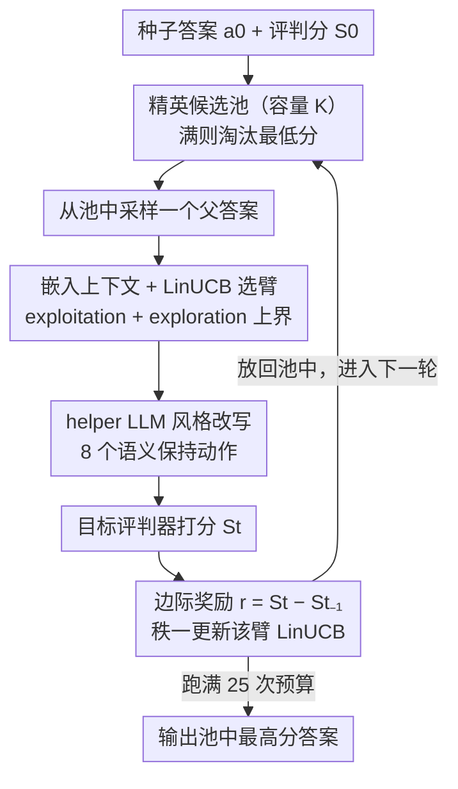

# Turning Bias into Bugs: Bandit-Guided Style Manipulation Attacks on LLM Judges

**会议**: ICML 2026  
**arXiv**: [2605.26156](https://arxiv.org/abs/2605.26156)  
**代码**: https://github.com/xianglinyang/llm-as-a-judge-attack  
**领域**: AI 安全 / LLM 评测 / 对抗攻击  
**关键词**: LLM-as-a-Judge, 风格偏差, 上下文老虎机, LinUCB, 黑盒攻击

## 一句话总结
把 LLM 评判器已知的风格偏好（冗长、列表、emoji 等）当作可被系统性利用的攻击面，作者将攻击建模为上下文老虎机，用 LinUCB 在 25 次查询预算内自适应挑选 8 种语义保持的风格改写动作，对 5 个主流评判器实现 >65% 攻击成功率、+1~2 分（满分 9）的分数膨胀，且绕过 style control 防御。

## 研究背景与动机

**领域现状**：LLM-as-a-Judge 已经成为 chatbot 评测、preference 数据集构建、RLHF 奖励建模、甚至自动同行评审的事实标准（MT-Bench、AlpacaEval、Arena-Hard 等）。这一范式建立在"LLM 评判器是客观可靠的"假设之上。

**现有痛点**：另一条线的研究在不断揭示 LLM 评判器有系统性偏差——偏好自家模型族 (self-preference)、偏好冗长答案、偏好用列表/markdown/emoji 的答案、甚至偏好"写得好但事实错"的回答。但现有工作主要把这些当作"局限性"或"需要校准的副作用"来研究，没人把它们正面武器化。

**核心矛盾**：评判器既已大规模部署在高风险流水线（leaderboard、RLHF、AI 同行评审），又被证实有可被预测的风格偏好——这个组合天然构成可被利用的安全漏洞，但安全社区还没系统刻画这种威胁。已有的攻击工作（BadJudge 后门、通用对抗扰动、null model 等）要么需要训练时介入，要么使用明显的 trigger，容易被防御检测到。

**本文目标**：在严格黑盒、有限预算（25 次查询）下，回答三个问题：(1) 风格偏差能不能被系统性利用来按需操纵分数？(2) 不同评判器的偏差画像是否不同？(3) 攻击能否同时保持语义等价并绕过 style control 防御？

**切入角度**：把"在一组已知风格编辑里选择哪一个能最有效抬高分数"建模为**上下文老虎机**——上下文是 (问题, 当前答案) 的语义嵌入，臂是 8 种风格改写动作，奖励是评判器给出的边际分数提升。这个抽象天然契合"探索新偏差 vs 利用已知偏差"的核心 trade-off，并且天然支持"为每个评判器学一份个性化指纹"。

**核心 idea**：用 LinUCB 在风格动作空间上做自适应选择，把评判器的风格偏好曲线在 25 步内逼近出来，每次只对答案做语义保持的风格改写——攻击因此既隐蔽（看起来就是改了文风）又高效（每个目标模型独立学一份策略）。

## 方法详解

### 整体框架
BITE 维护一个容量为 $K$ 的候选答案池 $\mathcal{P}$，初始化为 $\{(a_0, S_0)\}$，其中 $S_0$ 是评判器对种子答案 $a_0$ 的打分。每个臂（动作）$b \in \mathcal{B}$ 对应一种风格改写（共 8 种，如改 verbosity、改 tone、加列表等）；每个臂维护自己的 LinUCB 参数 $(\mathbf{A}_b, \bm{v}_b)$。每一轮：从池中随机抽一个父答案 → 嵌入成上下文 → LinUCB 选臂 → 用辅助 LLM 执行改写 → 提交给目标评判器拿分 → 算边际奖励 → 更新该臂的 LinUCB 模型 → 把新答案放回池中（满了就淘汰最低分）。整个过程是一条「采样—改写—打分—更新」的在线回环，跑满 25 次查询预算后输出池中最高分答案。

### 关键设计

**1. 上下文老虎机建模 + LinUCB 选臂：在 25 步紧预算里逼近评判器的偏好曲线**

攻击的核心 trade-off 是"试探新偏差 vs 利用已知偏差"，上下文老虎机正好契合。每轮 $t$ 用 pretrained embedding $\phi(q,a_{t-1})=\bm{x}_t\in\mathbb{R}^d$ 编码当前上下文，选臂规则带 UCB 上界

$$b_t = \arg\max_{b\in\mathcal{B}}\Big(\bm{x}_t^\top\hat{\bm\theta}_b + \alpha\sqrt{\bm{x}_t^\top\mathbf{A}_b^{-1}\bm{x}_t}\Big),$$

第一项是 exploitation（当前估计的期望奖励），第二项是 exploration（不确定性奖励），$\alpha$ 控权衡。每个臂独立维护 $\mathbf{A}_b\in\mathbb{R}^{d\times d}$ 和 $\bm{v}_b\in\mathbb{R}^d$，观测 $(\bm{x}_t,r_t)$ 后做秩一更新 $\mathbf{A}_{b_t}\!\leftarrow\!\mathbf{A}_{b_t}+\bm{x}_t\bm{x}_t^\top$、$\bm{v}_{b_t}\!\leftarrow\!\bm{v}_{b_t}+r_t\bm{x}_t$，再重估 $\hat{\bm\theta}_{b_t}\!\leftarrow\!\mathbf{A}_{b_t}^{-1}\bm{v}_{b_t}$。这样设计的好处是：每个评判器有自己独特的"漏洞指纹"——有的吃冗长、有的吃 markdown 列表——上下文老虎机能在零模型参数访问权下，针对每个目标在线学出这份个性化偏好曲线。选线性模型是带显式取舍的：作者承认真实奖励高度非线性（model misspecification），但线性模型样本效率最高，能在 25 步内收敛。

**2. 从偏差文献蒸馏出的 8 个语义保持动作空间：把"无穷语言变换"压成能学得起来的离散臂**

如果动作空间太大，LinUCB 在 25 步内根本探索不完。作者系统梳理 LLM 评判器偏差文献（verbosity bias、列表 bias、markdown bias、tone bias、self-preference 等），从中提炼出 8 种确定有效的风格变换当臂，每个动作通过 helper LLM $\psi$ 实现：给定原答案 $a_{t-1}$ 和动作 $b_t$，产出语义等价但风格改变后的 $a_t=\psi(a_{t-1},b_t)$，改写严格要求保持语义内容不变。关键在于这个动作空间本身就是手工编码的"已知偏差先验"、是一片 hot zone，命中率远高于随机风格扰动——后面消融里 Random Action 仅靠在这 8 个动作里乱选就大幅超过全文重写，正说明动作空间的先验才是攻击成功的主因。

**3. 精英候选池 + 边际奖励信号：像进化算法一样在高分答案上继续叠风格**

如果每轮都从原始 $a_0$ 重启，攻击就浪费了已经爬到的高分。BITE 维护一个大小为 $K$ 的池子，每轮均匀采样一个父答案，奖励取相对父答案的**边际**改进 $r_t=S_t-S_{t-1}$ 而非绝对分数——这让 LinUCB 学到的是"在这个上下文下再加哪种风格能涨一点"，而不是"哪种风格普遍高分"。为什么非用边际奖励？因为绝对分数有天花板效应：种子答案 $S_0$ 往往已接近满分 9，所有动作的绝对奖励都挤在 0 附近，LinUCB 学不到信号；改成边际改进就避开了这个坍缩。池子满了之后淘汰当前最低分而非最早进入的元素，让种群始终保持"高分多样性"，给下一轮选父答案提供更多有用方向。

### 损失函数 / 训练策略
攻击是黑盒在线、无训练阶段。理论侧给出一个关键结果：在模型 misspecification 程度为 $\zeta_T$ 时，BITE 的 pseudo-regret 满足 $R_T = \tilde{O}(dK\sqrt{T} + \zeta_T dKT)$，意味着即使线性模型与真实非线性奖励有 gap，regret 仍以 $\sqrt{T}$ 的统计项 + 线性 $\zeta_T$ 项可控增长。技术贡献是把 Abbasi-Yadkori 的 LinUCB 分析扩展到 multi-arm + misspecified setting。

## 实验关键数据

### 主实验

| 评判器 | Naive 注入 | Fake Completion | PAIR (Jailbreak) | AutoDAN | **BITE (ours)** |
|--------|-----------|-----------------|------------------|---------|-----------------|
| Qwen3-235b | 0.833 | 1.287 | 1.284 | 0.941 | **2.010** |
| DeepSeek-R1 | 1.016 | 1.214 | 1.856 | 1.365 | **1.909** |
| Llama-3.3-70B | 0.763 | 1.080 | 1.233 | 1.166 | **1.347** |
| Gemini-2.5-flash | 0.862 | 1.089 | 1.337 | 1.489 | **1.731** |
| o3-mini | 0.650 | 1.103 | 0.869 | 1.091 | **1.356** |

BITE 在所有 5 个评判器上都以明显优势超过 prompt injection（Naive/Fake Completion/Escape）和 jailbreak（PAIR/TAP/AutoDAN）两类基线。

### 消融实验（MLRBench 自动同行评审场景）

| 评判器 | 初始分 | Iterative Rewrite | Random Action | **BITE (ours)** |
|--------|--------|-------------------|----------------|-----------------|
| DeepSeek-R1-0528 | 5.67 ± 0.97 | 6.84 ± 0.22 | 7.31 ± 0.23 | **7.63 ± 0.29** |
| Gemini-2.5-flash | 5.28 ± 0.66 | 6.59 ± 0.39 | 7.18 ± 0.28 | **7.44 ± 0.40** |
| Llama-3.3-70B | 7.90 ± 0.07 | 8.17 ± 0.24 | 8.34 ± 0.19 | **8.38 ± 0.18** |

Iterative Rewrite 只用单一改写动作；Random Action 用全部动作空间但随机选；BITE 用 LinUCB 自适应选。

### 关键发现
- **动作空间多样性的贡献大于自适应策略**：Random Action 已经显著超过 Iterative Rewrite，说明仅仅"在 8 个偏差动作里乱选"就比"用 LLM 反复全文重写"有效得多——证实了"已知偏差先验"是攻击成功的主因。
- **LinUCB 在多样性之上再加一层增益**：BITE 相对 Random Action 的提升验证了自适应策略本身的价值，尤其在 pairwise 场景下差距更明显。
- **对客观/事实类问题同样有效**：在事实题上 BITE 仍能显著抬分，证实 LLM 评判器对"客观正确性"的判断也会被风格干扰——这是更危险的发现，说明 leaderboard 上的所有题型都不安全。
- **不同评判器的偏好画像不互相迁移**：作者发现每个评判器的"漏洞指纹"是个性化的，攻击不能直接 transfer，这反过来证明了 BITE 这种自适应、按目标个性化学习的必要性。
- **隐蔽性**：>90% 的攻击响应在 LLM 相似度评估下保持与原答案语义等价，能绕过 style control 防御和针对风格操纵的自动检测器。

## 亮点与洞察
- **把"已知偏差当作 prior"是关键设计哲学**：作者没有让 agent 自己从零探索全部语言空间，而是显式编码 8 个文献验证过的偏差作为动作，使 25 步预算足以收敛——这给所有"小样本黑盒攻击"问题提供了一个范式：用先验文献压缩动作空间。
- **边际奖励 + 精英池**：把进化算法的种群思想嫁接到 bandit 上，规避了"绝对分数饱和导致 reward 信号坍缩"的问题，这个 trick 在其它"目标已经接近上界"的优化场景（如对齐高分题、jailbreak 已高拒绝率的模型）都可以套。
- **regret bound 显式追踪 misspecification**：这是一个有实用价值的理论贡献——告诉用户在何种程度的模型错配下攻击仍然 provably 收敛，给攻击的"理论安全感"提供了保证。
- **暴露的范式级缺陷**：论文真正的价值不在于"又一种攻击"，而是把整个 LLM-as-a-Judge 范式的根基——"评判器对风格中立"——证伪了。这对 leaderboard 设计、RLHF 数据清洗、AI 同行评审都有直接的政策含义。

## 局限与展望
- 动作空间是手工编码的 8 个偏差，可以被防御方"反向消毒"：一旦防御方训练评判器对这 8 类风格做归一化，攻击立刻失效；论文没有讨论动作空间被自动扩展或闭环对抗的情况。
- 25 次查询预算是 chatbot 场景的现实假设，但对 RLHF 大规模数据生成来说预算近乎无限，攻击可能变得更强但也更易被流量异常检测发现，这个 trade-off 未被刻画。
- 语义保持依赖另一个 LLM 做相似度评估，存在"裁判 LLM 和评判 LLM 偏差相关"的循环漏洞；理想情况下应该用人评做最终的语义一致性验证。
- 攻击的"不可迁移性"既是亮点也是局限：每对一个新模型都要花完整 25 次预算重学策略，对大规模攻击（同时刷多个 leaderboard）成本不可忽视。
- 防御侧讨论较弱——论文证明了 style control 和现有 detector 都失败，但没给出"应该怎么防"的建设性方案。

## 相关工作与启发
- **vs BadJudge (Tong et al., 2025)**: BadJudge 在训练时植入后门 trigger，本文是纯推理时黑盒；BadJudge 需要供应链投毒，BITE 只需 API 访问，威胁面广得多但单点效力可能略低。
- **vs PAIR / AutoDAN (Jailbreak 类)**: 这些方法靠优化对抗 prefix 让模型输出受限行为，本文不改变输出内容只改风格；jailbreak 的 prefix 容易被安全训练识别，BITE 的风格改写处于评判器"安全 + 指令跟随"训练的盲区。
- **vs 通用对抗扰动 (Shi et al., 2024)**: 通用扰动追求 universality 但 detectability 高，BITE 走相反路线——为每个目标个性化、保持隐蔽，做到 stealth + effectiveness 双高。
- **vs Null Model (Zheng et al., 2025)**: Null Model 用启发式利用评测协议缺陷（如答非所问反而高分），BITE 用学习算法系统性地探索偏差曲线，更通用且能在更难的 benchmark（Arena-Hard）上奏效。

## 评分
- 新颖性: ⭐⭐⭐⭐⭐ 把"已知偏差作为先验" + LinUCB 这一组合放进 LLM judge 安全场景是真正新的视角，不是常见 jailbreak 的变体。
- 实验充分度: ⭐⭐⭐⭐⭐ 跨 5 个评判器 × 两个 benchmark × 两种 grading 模式 × 三类防御，加 MLRBench 同行评审 case study，覆盖面充分。
- 写作质量: ⭐⭐⭐⭐ 三个 RQ 主线清晰，算法图示直观；理论部分对非 bandit 背景读者门槛偏高，但 main result 表述清楚。
- 价值: ⭐⭐⭐⭐⭐ 直接动摇了 LLM-as-a-Judge 范式根基，对 leaderboard、RLHF、AI 同行评审都有政策级影响，是少见的能改变社区实践的工作。

<!-- RELATED:START -->

## 相关论文

- [\[ICML 2026\] LLM-Guided Communication for Cooperative Multi-Agent Reinforcement Learning](llm-guided_communication_for_cooperative_multi-agent_reinforcement_learning.md)
- [\[ICML 2026\] Adaptive Bandit Algorithms for Contextual Matching Markets](adaptive_bandit_algorithms_for_contextual_matching_markets.md)
- [\[ICML 2026\] One Bias After Another: Mechanistic Reward Shaping and Persistent Biases in Language Reward Models](one_bias_after_another_mechanistic_reward_shaping_and_persistent_biases_in_langu.md)
- [\[AAAI 2026\] A Multi-Agent Conversational Bandit Approach to Online Evaluation and Selection of User-Aligned LLM Responses](../../AAAI2026/reinforcement_learning/a_multi-agent_conversational_bandit_approach_to_online_evaluation_and_selection_.md)
- [\[CVPR 2026\] Adversarial Agents: Black-Box Evasion Attacks with Reinforcement Learning](../../CVPR2026/reinforcement_learning/adversarial_agents_black-box_evasion_attacks_with_reinforcement_learning.md)

<!-- RELATED:END -->
