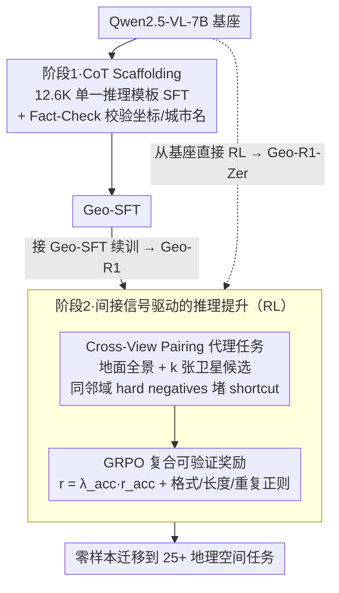

# Unlocking Zero-Shot Geospatial Reasoning via Indirect Rewards

**会议**: ICML 2026  
**arXiv**: [2510.00072](https://arxiv.org/abs/2510.00072)  
**代码**: https://github.com/miniHuiHui/Geo-R1  
**领域**: 强化学习 / 多模态 VLM / 地理空间推理  
**关键词**: 间接奖励、RLVR、跨视图配对、地理空间推理、零样本泛化

## 一句话总结
作者把"地面街景与卫星图能否定位为同一坐标"作为可验证间接奖励，用 GRPO 对 Qwen2.5-VL-7B 做两阶段后训练（CoT scaffolding + RL self-exploring），让模型仅凭 GPS metadata 学到可零样本迁移到 25+ 地理空间任务的通用推理能力。

## 研究背景与动机
**领域现状**：地理空间领域可拍取的影像（卫星 / 无人机 / 街景）几乎无限，但带稠密语义标签的样本极少，主流做法（MAE / 对比学习 / RS-VLM）善于表示与检索，却缺乏对场景的拆解 + 推理能力。最近 R1 类 RL 在数学 / 代码上奏效，但同样的瓶颈仍在：在地理领域我们没有可大规模获得的强直接奖励信号。

**现有痛点**：(1) SFT 受任务分布拖累，模型只学窄域，OOD 崩；(2) 全监督 detection / segmentation / VQA 标注昂贵；(3) 已有 R1 风格工作（如 GLOBE）仍把"地理位置"当唯一直接 reward，缺乏对"为什么能从中诱发推理"的统一原理。

**核心矛盾**：metadata（坐标、时间戳）很容易获得，看似与"复杂视觉推理"无关，但若设计得当，它的可验证性可以作为"代理任务"的奖励基础。

**本文目标**：(1) 证明"间接可验证奖励"足以诱发复杂、可迁移的地理空间推理；(2) 给出理论解释何时间接奖励有效；(3) 构造一个可复现 RLVR 框架并在 25+ 任务上做大规模 OOD 验证。

**切入角度**：把"街景 ↔ 卫星图"的跨视图配对作为代理任务——挑战在于必须借助物体几何、阴影方向、建筑布局等可迁移的几何语义才能完成 match。

**核心 idea**：Cross-View Pairing 提供二值 verifiable reward，配合 hard negatives 把"靠 nuisance 特征作弊"的捷径堵死，迫使模型学到 view-invariant 几何语义 $\Phi$，从而获得通用的零样本地理推理能力。

## 方法详解

### 整体框架
Geo-R1 用 Qwen2.5-VL-7B 作 base，分两阶段后训练：阶段 1 是 Geospatial Thinking Scaffolding，用 CV-Cities 派生的 12.6K 高质量 CoT 数据进行 SFT，给模型注入统一的地理推理模板（看视觉线索 → 跨视图对照证据 → 关联气候带等地理知识 → 给出结论）；阶段 2 是 Reasoning Elevation via Indirect Signals，把训练目标切换到 Cross-View Pairing：给定地面全景 $I_g$ 与 $k$ 张候选卫星图 $\mathcal S=\{I_s^1,\dots,I_s^k\}$（含 1 个正例 + $k-1$ 个邻域 hard negatives），让模型用 CoT 推理后挑出正例。奖励用 GRPO 的 group-relative 形式优化复合 reward $r=\lambda_{\mathrm{acc}}r_{\mathrm{acc}}+\lambda_{\mathrm{fmt}}r_{\mathrm{fmt}}+\lambda_{\mathrm{len}}r_{\mathrm{len}}+\lambda_{\mathrm{rep}}r_{\mathrm{rep}}$。SFT 与 RL 都做全参数微调，8×H100，借助 LLama-Factory + VLM-R1 + vLLM 加速推理。两条产物对应两种入口：从 Geo-SFT 续训得到 Geo-R1，从基座跳过 scaffolding 直接 RL 得到 Geo-R1-Zero。

### 关键设计

**1. CoT Scaffolding：只注入一种推理范式，避免 RL cold-start 又不引入遗忘**

直接从 base 模型上 RL 容易 cold-start 崩塌，但传统 SFT 为保证多样性会灌大量任务、反而破坏后续 RL。Geo-R1 反其道而行——只用 CV-Cities 合成的 12.6K 推理 trace 注入**单一**模板："分析视觉线索 → 跨视图证据印证 → 关联地理常识 → 输出答案"，并引入 Fact-Check Engine 用 metadata 校验坐标 / 城市名等关键实体，保证 scaffold 不学到错事实。这样设计的逻辑是：SFT 阶段只负责把"怎么组织一段地理推理"这个范式灌进去，具体能力让 RL 阶段自己探索，既拿到了 RL warm-up，又把灾难性遗忘降到最低。

**2. Cross-View Pairing + Hard-Negative Bottleneck：用可验证的代理任务逼出 view-invariant 特征**

间接奖励能不能激发推理是本文最被质疑的点，这项核心设计就把这个疑点固化成可证伪定理。作者把图像信息拆成 view-invariant 几何语义 $\Phi(I)$ 和模态特异的 nuisance 因素 $N(I)$，再从同一时空邻域采样 hard negatives，使得 $\mathcal I(Y;N(\mathcal S))=0$——也就是说任何只依赖 nuisance 作弊的策略都只能拿到最大熵 $\mathcal H(Y|\pi_{shortcut})=\log K$（Theorem 3.1），等于瞎猜。于是哪怕只用二值奖励 $r_{acc}\in\{-1,+1\}$，模型要想拿分就必须最大化 $\mathcal I(C;Y|\mathcal S)\Leftrightarrow\mathcal I(C;\Phi(I_s^*))$，即推理链 $C$ 被迫去编码可迁移的几何语义 $\Phi$（物体几何、阴影方向、建筑布局）。hard negatives 在这里不是普通的难例，而是把"靠 nuisance 抄近路"这条路彻底堵死的瓶颈，难度差距 $\Delta\mathcal H=\log K$ 正是 RL 必须跨越的 reasoning margin。

**3. GRPO + 复合可验证奖励：纯 outcome 信号下产出结构合规、长度适中的推理链**

阶段 2 把训练目标切到 Cross-View Pairing，以 verifiable $r_{acc}$ 为主信号，再叠格式正则 $r_{fmt}$、长度正则 $r_{len}$、重复惩罚 $r_{rep}$，复合 reward $r=\lambda_{acc}r_{acc}+\lambda_{fmt}r_{fmt}+\lambda_{len}r_{len}+\lambda_{rep}r_{rep}$，用 GRPO 做 group-relative advantage 归一化稳住长 horizon 更新。关键是全程不在中间步骤引入 process reward，保持"过程自由、结果可验证"的纯 outcome 性——这既廉价（无需 process annotation），又把所有自由度让给模型自己探索；正则项只是防止模型为骗 reward 而生成异常长、重复或无格式的输出。仅靠 binary $\{-1,+1\}$ 的最简奖励就能驱动复杂推理，正说明 process reward 并非必须。

### 损失函数 / 训练策略
阶段 1 标准 SFT 交叉熵 + Fact-Check 后过滤；阶段 2 用 GRPO，从 base 直接 RL 得到 Geo-R1-Zero，从 Geo-SFT 接续 RL 得到 Geo-R1；全参数微调，8×H100；推理用 vLLM 加速；hard negatives 在同一时空邻域采样以确保 nuisance 不可分。

## 实验关键数据

### 主实验

| 基准 / 任务 | 指标 | Qwen2.5-VL-7B (base) | Geo-SFT | Geo-R1-Zero | Geo-R1 |
|-------------|------|---------------------|--------|-------------|--------|
| In-distribution Cross-View Pairing | Accuracy | 19.0% | 23.1% | 78.1% | 82.4% |
| 同上 | Completion length | 204.6 | 1127.6 | 587.4 | 378.8 |
| GeoChain (13 任务 OOD) | Avg accuracy | baseline | — | — | 显著高于 baseline (Fig. 1) |
| IMAGEO-GSS 全球 6152 张 | City / Country Acc | — | — | — | 0.3272 / 0.8146 (vs GeoCLIP 0.1086 / 0.6361) |
| IMAGEO-GSS | Mean / Median Dist (km) | — | — | — | 568.32 / 69.40 (vs GeoCLIP 943.48 / 266.90) |

### 消融实验

| 配置 | 关键观察 | 解读 |
|------|----------|------|
| 仅 SFT (Geo-SFT) | 比 base 只高 4.1%，几乎随机 | 正例 SFT 无法捕捉 indirect signal |
| 仅 RL from base (Geo-R1-Zero) | 78.1%，比 base +59% | indirect reward 自身就能驱动 |
| SFT + RL (Geo-R1) | 82.4%，长度更短更稳 | scaffolding 提供合规推理模板 |
| MP16-Reason (OOD) | 与全监督 GLOBE-7B 几乎打平 (1km Street 17.98 vs 17.99；2500km Continent 93.56 vs 92.52) | 间接奖励效果可媲美直接奖励 |
| RSTeller 卫星地理定位 | 与 o4-mini 同档，超过 base | 跨视图代理任务还能泛化到纯卫星视角 |
| GeoBench-VLM 卫星理解 | 超过 GeoChat / EarthDial 等专家模型 | 推理能力迁移到 fine-grained RS 任务 |

### 关键发现
- 间接 reward 训练自发涌现高层语义概念：MP16-Reason 推理 trace 的 wordcloud 显示 "architecture" / "vegetation" / "climate" / "analyzing" 等概念高频出现，说明模型确实在做物理世界推理而非模式匹配。
- 一个代理任务能解锁广谱能力：仅训练 Cross-View Pairing，却能零样本在 25+ 个完全不同的下游任务（VQA、地理定位、灾难评估、土地利用等）上获得显著提升。
- Geo-R1 在卫星视角任务上同样优于 base，证实 cross-view 任务隐式构建了"地面 → 俯视"的反投影逻辑，使模型成为更通用的航拍解释器。

## 亮点与洞察
- "可验证的间接奖励"这一概念可推广到任何"有海量原始数据 + 稀疏 metadata"的稀有领域（医学影像 + DICOM 元数据、化学结构 + 反应温度等），是 RLVR 的新范式。
- 用 hard-negative bottleneck 严密堵住 shortcut + 用熵差 $\Delta\mathcal H=\log K$ 描述 reasoning margin，是难得的"理论 + 工程"耦合范例。
- 反直觉地强调"SFT 应窄不应宽"：scaffolding SFT 只灌一种推理模板，反而获得最佳 RL warm-up + 最少遗忘。
- 仅用 binary {-1,+1} 的最简 reward 就能驱动复杂推理，说明 process reward 并非必须；这对成本敏感的领域有重要工程价值。

## 局限与展望
- 代理任务依赖"成对的地面 + 卫星图"，其他稀有领域要找到等价的 cross-view structure 并不容易；
- 仅展示 ground/aerial 两视图，未推广到 SAR / LiDAR / 多时相等更复杂模态；
- 7B 单一模型规模，扩展到 30B+ 是否仍保持 outcome-only RL 稳定未验证；
- 与闭源 o3 在 IMAGEO-GSS 仍有差距，作者归因为参数量与 RL 投入差距。

## 相关工作与启发
- **vs GLOBE (Li et al. 2025a)**：GLOBE 用直接的地理定位 reward 在 MP16-Reason 内训练；Geo-R1 全程未见 MP16-Reason 训练集，仅靠 cross-view pairing 间接 reward 即达到几乎同等性能，是直接奖励路线的强势替代。
- **vs GeoCLIP / RFM-YFCC**：传统 retrieval / 表示学习方法擅长 nearest neighbor 定位，但缺乏推理与跨任务迁移能力；Geo-R1 在 IMAGEO-GSS 全面超越。
- **vs GeoReasoner / GeoChat / EarthDial**：这些方法依赖大规模任务特定监督；Geo-R1 用单一代理任务零样本超越，启发我们"任务广度可由代理任务诱导而非穷举监督"。
- **vs DeepSeek-R1 类数学 / 代码 RLVR**：本文证明 RLVR 范式可扩展到 verifiable 但弱相关的代理奖励，给"如何把 R1 迁到稀有领域"提供了第一个明确蓝本。

## 评分
- 新颖性: ⭐⭐⭐⭐⭐ "间接可验证奖励"+ hard-negative bottleneck 是地理空间 RLVR 的崭新范式，且具有跨领域的方法论意义。
- 实验充分度: ⭐⭐⭐⭐⭐ 25+ 下游 OOD 任务 + 多个基准 + 与 GLOBE / GeoCLIP / o3 横向对比，覆盖极广。
- 写作质量: ⭐⭐⭐⭐ 理论 + 工程衔接干净，公式与 Remark 清晰；部分细节须翻附录。
- 价值: ⭐⭐⭐⭐⭐ 给"数据多但标签少"的稀有领域提供可复制的 RLVR 蓝图，对 medical / climate / robotics 等都有直接借鉴价值。

<!-- RELATED:START -->

## 相关论文

- [\[ICML 2025\] Zero-Shot Generalization of Vision-Based RL Without Data Augmentation](../../ICML2025/reinforcement_learning/zero-shot_generalization_of_vision-based_rl_without_data_augmentation.md)
- [\[ICML 2026\] MindZero: Learning Online Mental Reasoning with Zero Annotations](mindzero_learning_online_mental_reasoning_with_zero_annotations.md)
- [\[NeurIPS 2025\] Reasoning Gym: Reasoning Environments for Reinforcement Learning with Verifiable Rewards](../../NeurIPS2025/reinforcement_learning/reasoning_gym_reasoning_environments_for_reinforcement_learning_with_verifiable_.md)
- [\[ICML 2025\] Pessimism Principle Can Be Effective: Towards a Framework for Zero-Shot Transfer RL](../../ICML2025/reinforcement_learning/pessimism_principle_can_be_effective_towards_a_framework_for_zero-shot_transfer_.md)
- [\[NeurIPS 2025\] Dynamics-Aligned Latent Imagination in Contextual World Models for Zero-Shot Generalization](../../NeurIPS2025/reinforcement_learning/dynamics-aligned_latent_imagination_in_contextual_world_models_for_zero-shot_gen.md)

<!-- RELATED:END -->
