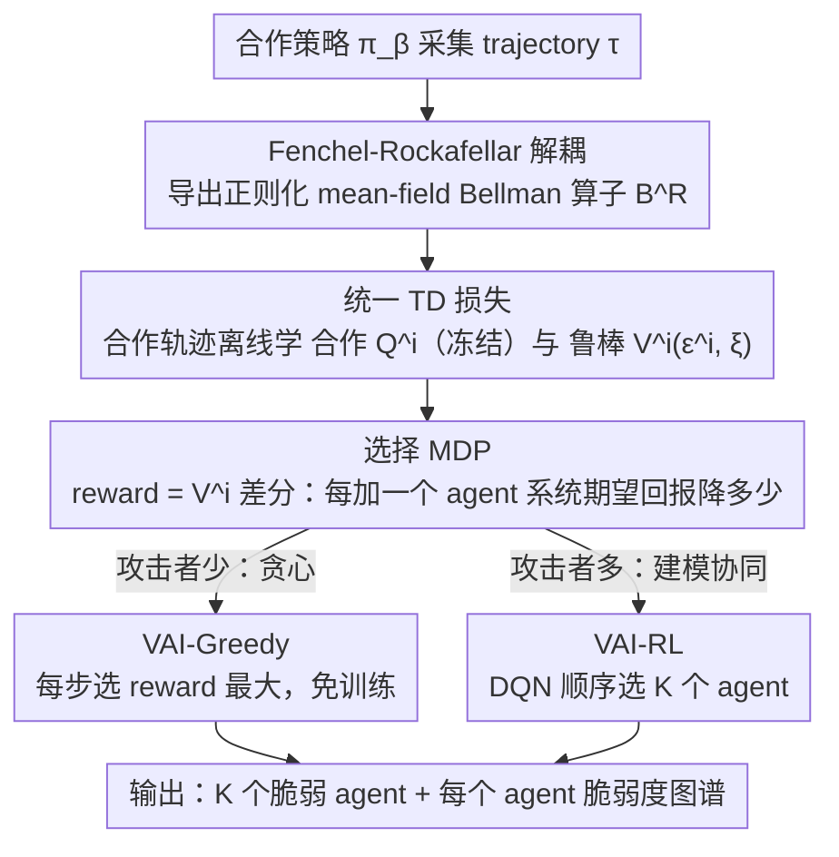

# Vulnerable Agent Identification in Large-Scale Multi-Agent Reinforcement Learning

**会议**: ICML 2026  
**arXiv**: [2509.15103](https://arxiv.org/abs/2509.15103)  
**代码**: https://github.com/Waken-dream/VAI  
**领域**: 强化学习 / 多智能体 / 对抗鲁棒性  
**关键词**: Mean-field MARL, Vulnerable Agent ID, Fenchel-Rockafellar, NP-hard 组合优化, 鲁棒 Bellman

## 一句话总结
本文研究"在 N 个智能体的大规模 MARL 系统中挑出 K 个最脆弱的智能体"这一双层 NP-hard 问题，把它建模为 HAD-MFC（Hierarchical Adversarial Decentralized Mean Field Control），用 Fenchel-Rockafellar 变换把下层最坏对抗策略的训练折叠成一个加正则项的"鲁棒 mean-field Bellman 算子"，再把上层组合选择问题转化为带稠密 reward 的 MDP 用贪心或 RL 求解，证明分解保持最优性，在 18 个任务中 17 个超 baseline。

## 研究背景与动机

**领域现状**：Mean-field MARL（Yang 2018, Subramanian 2022）通过把"其它智能体"用一个 mean-field 分布近似，让 MARL 能扩展到上千个智能体——已用于机器人群控、电网电压控制、出租车调度。然而这些系统在真实部署时，**少数智能体掉线、被攻击或硬件故障**是不可避免的。

**现有痛点**：(1) 现有 MARL 鲁棒性研究多在小规模——10 智能体只有 $\binom{10}{1}=10$ 种攻击场景，1000 智能体却有 $\binom{1000}{100} \approx 10^{139}$ 种，组合爆炸；(2) 影响力最大化（IM）算法假设已知图结构和传播规则，MARL 都没有；(3) 现有 MARL 攻击方法（GMA-FGSM、RTCA）依赖随机选或差分进化，对大规模 mean-field 系统无效。

**核心矛盾**：这是个**双层耦合**问题——上层要从 $N$ 个智能体里挑 $K$ 个（NP-hard 组合优化），下层要为这 $K$ 个智能体训练**最坏情况对抗策略**（mean-field MARL 问题）。两层互相依赖：上层选什么取决于下层能造成多大破坏，下层训什么取决于上层选了谁。直接 bi-level RL 训不收敛、组合枚举不可行。

**本文目标**：(1) 数学上把问题清楚定义为 HAD-MFC 并证明 NP-hardness；(2) 找到一个**不用真训对抗策略**就能估出"被攻击后 reward 会掉多少"的代理；(3) 把组合上层转成稠密 reward 的 MDP，用贪心或 RL 高效求解；(4) 证明这套分解不破坏全局最优。

**切入角度**：观察 1—在 mean-field 近似下，第 i 个智能体被 $\epsilon^i$ 比例扰动 + 团队中 $\xi$ 比例同伴被扰动，其 Bellman 算子的"最坏情况值"可以用 $\ell_p$ 球约束建模；观察 2—Fenchel-Rockafellar 变换能把"内层 min 问题"变成"外层加正则项"，把训练 worst-case adversary 这件难事变成在合作 trajectory 上做一次 TD 学习。

**核心 idea**：把"训 worst-case 对抗策略"压缩成"在合作 trajectory 上学一个含 $\epsilon$ 和 $\xi$ 的鲁棒 V 函数"，然后用这个 V 当 reward 信号驱动一个上层选择 MDP——既算得动、又有最优保留。

## 方法详解

### 整体框架
HAD-MFC 形式化：$\mathcal{G} = \langle \mathcal{N}, \mathcal{S}, \mathcal{A}, \mathcal{P}, R, \mu_0, \nu_0, \gamma\rangle$。每个 agent $i$ 默认走 well-trained 合作策略 $\pi_\beta$，若被选入攻击集 $\mathcal{K}$ 则策略变为 $\hat{\pi}^i = \epsilon^i \pi_\alpha^i + (1-\epsilon^i) \pi_\beta^i$。攻击者目标 $\min_{\mathcal{K}} \min_{\pi_\alpha} J(\pi_\alpha, \pi_\beta)$ 是双层 NP-hard。作者的破局思路是把这个双层耦合**分解成上下两级、各自独立求解**：**下层**用 Fenchel-Rockafellar 把"训 worst-case 对抗策略"折成一个加正则项的"正则化 mean-field Bellman 算子" $\mathcal{B}^R_{\epsilon^i, \xi}$，从而**只用合作 trajectory**就能离线学出合作 $Q^i$（先学好冻结、作 FR 对偶项）与鲁棒值函数 $V^i(s^i, \mu, \epsilon^i, \xi)$（即"被 $\epsilon^i$ 扰动 + 团队 $\xi$ 比例被扰动下的最坏情况回报"），全程不必真训对抗策略；**上层**把"挑 $K$ 个 agent"的组合问题改写成一个 MDP，用 $V^i$ 的差分当稠密 reward，再用贪心（VAI-Greedy）或 DQN（VAI-RL）顺序选 $K$ 个 agent。命题 4.5 证明这套分解保持原 HAD-MFC 的最优解。

### 关键设计

**1. Fenchel-Rockafellar 解耦：把"训 worst-case 对抗策略"折成一个加正则项的鲁棒 Bellman 算子**

直接训 worst-case adversary 要解 $\min_{\pi_\alpha} J(\pi_\alpha, \pi_\beta)$，每换一组攻击集 $\mathcal{K}$ 就得重训，组合爆炸根本跑不完。本文的核心一招是用凸对偶把这个内层 min 消掉。设扰动后策略 $\hat{\pi}^i = \epsilon^i \pi_\alpha^i + (1-\epsilon^i) \pi_\beta^i$、扰动后 mean-field action $\nu(a) = \xi \nu_\alpha(a) + (1-\xi)\nu_\beta(a)$，记 $\hat{\pi}_\alpha^i = \hat{\pi}^i - \pi_\beta^i$ 受 $\|\hat{\pi}_\alpha^i\|_p \le \epsilon^i$ 约束。在鲁棒 Bellman 不等式 $V^i \le \mathcal{B}^{\hat{\pi}} V^i$ 上做 Fenchel-Rockafellar 变换，得到正则化 mean-field Bellman 算子

$$\mathcal{B}^R_{\epsilon^i, \xi} V^i = (\mathcal{B}^{\pi_\beta} V^i) - (\epsilon^i + \xi + \epsilon^i \xi) \|Q^i\|_q,\quad 1/p + 1/q = 1.$$

关键是这是个精确变换（只要不确定性集合凸、proper、下半连续，$\ell_p$ 球都满足），不引入近似，且论文证明它仍是 contraction（命题 4.3）。这样学出来的 $V^i(s^i, \mu, \epsilon^i, \xi)$ 就等价于"agent i 在自己被 $\epsilon^i$ 扰动、团队 $\xi$ 比例被扰动下的最坏情况期望回报"，而整套训练只需合作 trajectory，$\pi_\alpha$ 根本不必存在过。

**2. 统一的 TD 损失：把鲁棒 V 与合作 Q 都在合作 trajectory 上离线学出来**

上面的算子告诉你 $V^i$ 应该等于多少，但还得有个不碰环境的办法把它学出来——这一步要落实"全程只用合作 trajectory、符合黑盒威胁模型"。本文把鲁棒 V 的学习落成一个标准 TD loss：

$$\min \mathbb{E}_{\tau \sim \pi_\beta}\big(V^i(s^i, \mu, \epsilon^i, \xi) - r - \gamma V^i(s'^i, \mu', \epsilon^i, \xi) + (\epsilon^i \xi + \epsilon^i + \xi)\|Q^i(s^i, a^i_\beta, \mu, \nu_\beta)\|_q\big)^2,$$

其中 $\epsilon \sim U[0, 2^{1/p}]$、$\xi \sim \text{Bernoulli}(\xi)$。$Q^i$ 是合作策略下先学好、固定不动的（作为 FR 变换里的对偶项），$V^i$ 是新学的，两者都只吃合作 trajectory、不与环境进一步交互。命题 4.4 给了几何直观：正则项 $\epsilon^i \xi \|Q^i\|_q$ 正是 $\ell_p$ 球内对 Q 的最坏一阶偏差。随机采样 $\epsilon$ 和 $\xi$ 让 V 学到一族不同扰动下的值函数，于是任意 $(\epsilon, \xi)$ 配置都能直接查询——这正好满足"攻击者拿不到 victim 策略参数、只能用合作轨迹"的现实假设。

**3. 上层转成带稠密 reward 的选择 MDP：让 NP-hard 组合选择能用贪心或 RL 跑**

上层要从 $N$ 个 agent 里挑 $K$ 个，$\binom{N}{K}$ 组合是 NP-hard，传统组合优化的 reward 还只在最后给一次、训练极慢。本文把它改写成顺序选择 MDP $\mathcal{M} = \langle \boldsymbol{\mathcal{S}}, \epsilon, \mathcal{N}, \tilde{\mathcal{P}}, \tilde{R}, \gamma\rangle$，每步往攻击集里加一个 agent $\mathcal{K}_k = \mathcal{K}_{k-1} \cup n_k$，并把 reward 定义为"加进这个 agent 后系统期望回报会下降多少"：

$$r_k = \frac{1}{N}\sum_i \big(V^i(s_0^i, \mu_0, \epsilon^i_{k-1}, \xi_{k-1}) - V^i(s_0^i, \mu_0, \epsilon^i_k, \xi_k)\big),$$

其中 $V^i$ 就是上面学到的鲁棒 V。这等价于把"系统损失"铺到每一步、信号稠密，于是可以直接每步贪心选 reward 最大的 agent（VAI-Greedy，无需训练），也可以用 DQN 学长期依赖（VAI-RL）。命题 4.5 证明这个分解保持原 HAD-MFC 的最优解，所以降复杂度不以损失最优性为代价；实验也显示攻击者数量大时 RL 因能建模 agent 间协同而显著超贪心（如 Battle 144 agents、36 attackers 时 RL 比 Greedy 涨约 30%）。

### 损失函数 / 训练策略
合作 Q：先在合作策略 $\pi_\beta$ 下用 MF-Q（Battle）或 MF-AC（Taxi）训出 $Q^i$ 并冻结。鲁棒 V：用上述 TD loss 训 $V^i(\epsilon^i, \xi)$。上层：VAI-Greedy 每步选 reward 最大的 agent，VAI-RL 用 DQN 顺序选 K 个。所有 baseline（Random、DC、Bi-level RL、PIANO、RTCA）共享同样的网络结构与超参，五个随机种子。

## 实验关键数据

### 主实验
三个环境（Battle、Taxi Matching、Vicsek 群体动力学）共 18 个子任务（不同 map 大小 × 攻击者数量），下表节选关键行（Battle ↓ 越低越好攻击越强；Vicsek ↑ 越高表示越靠近目标策略）：

| 环境/规模 | Adv 数 | Random | DC | PIANO | RTCA | VAI-Greedy | VAI-RL |
|----------|-------|--------|-----|-------|------|------------|--------|
| Battle-64 | 32 | -152.89 | -160.51 | -175.24 | -192.78 | -214.40 | **-929.88** |
| Battle-144 | 72 | -1809 | -2014 | -2313 | -2221 | -2579 | **-2837** |
| Taxi-100 | 36 | 884.49 | 867.62 | 793.71 | 860.58 | 770.14 | **652.10** |
| Vicsek-400 | 200 | -295.13 | -313.55 | -290.53 | -287.53 | -256.44 | -275.62 |

VAI-RL 在 Battle-64 + 32 adversaries 上达到 -929.88，比次优 baseline 强 5×（-214 → -929），说明在足够多攻击者下能找到导致**完全崩溃**的脆弱组合。整体 17/18 task 超 baseline。

### 消融实验

| 配置 | 说明 | 效果 |
|------|------|------|
| Random | 随机选 K 个 agent | 弱基线 |
| DC | 度中心性，挑邻居最多的 | 在 rule-based 系统强、MARL 弱（中心 agent 不一定最脆弱） |
| Bi-level RL | 上下层都 RL 端到端训 | 弱于 VAI（无显式 reward 信号） |
| PIANO | GNN + RL 顺序选 | 没考虑 worst-case 对抗 |
| RTCA | 差分进化 | 仅小规模有效 |
| VAI-Greedy | 仅贪心，无 RL | 小攻击者数量下与 RL 接近 |
| VAI-RL | 上层 DQN | 大攻击者数量下显著优于贪心 |

### 关键发现
- **VAI-RL 在攻击者多时比 Greedy 强**：18 个任务中 RL 赢 10 个，且差距集中在攻击者数多的场景（Battle 144 + 72 adversary 时 RL 比 Greedy 多伤 +260）。原因：贪心只看眼前 reward，RL 能建模 agent 间长期协同效应。
- **DC（度中心性）失效**：在 Battle 环境里前线作战的 agent 比中心 crowd 里的 agent 更脆弱，但 DC 倾向选中心 agent，反而效果差。这告诉我们图结构启发式在大规模 MARL 里不可靠。
- **PIANO/Bi-level RL 都不行**：现有学习型 baseline 不能解 worst-case 选择问题，因为它们没显式建模"被选 agent 之后会有 adversarial policy"。
- **能在 rule-based 系统（Vicsek）上跑**：把 rule-based agent 转成 Boltzmann 策略后 Q 函数即可估算，方法扩展到非 MARL 的鲁棒性分析。
- **每个 agent 的脆弱度可解释**：Figure 1 可视化每个 agent 在 $\epsilon=1$ 下的贡献度，给出"哪些位置/角色是关键脆弱点"的直接答案。

## 亮点与洞察
- **Fenchel-Rockafellar 把 RL 问题变成离线学问题**这一招漂亮——它把"必须训对抗策略"这个工程地狱压成"在合作 trajectory 上加个正则项的 TD 学习"，可移植到任何"min-max RL"场景（对抗 RL、鲁棒 MDP、robust SAC）。
- 把 NP-hard 组合优化转成稠密 reward MDP 的套路（每加一个元素，reward = 增益差分）是个通用 trick，可以套到 feature selection、点云下采样、subset DPP 等所有"K-subset"问题上。
- 整套方法**完全黑盒**——不需要 victim 策略参数、不需要环境真实模型，只需要 cooperative trajectory，威胁模型贴近真实攻击者能力。
- 命题 4.4 的几何直观（$\epsilon^i \xi \|Q^i\|_q$ 对应 Q 在 $\ell_p$ 球内最坏一阶偏差）给出了正则项的物理意义，让"为什么这一项就够"有了直观理由。
- "脆弱性可视化"（Figure 1）的副产品价值不小——给系统设计者一个直接的图谱："这些 agent 是关键节点，重点防护它们"，对真实部署的容错设计有指导价值。

## 局限与展望
- $V^i$ 的学习是函数逼近，作者在 Remark 3 中坦言这是唯一的近似来源，但没系统刻画"V 函数误差 → 选 agent 误差"的传播；当 Q 学得差时整套方法会失灵。
- $\epsilon^i = 1$ 是极端攻击假设（完全控制 agent），现实里更常见的是部分扰动；论文虽然在 Appendix D.2 提了其它 $\epsilon$，但没把"防御者怎么用这个工具"做更深入的实战 case。
- 上层 MDP 的 reward 是 V 的差分，**当 V 的误差比差分还大时整个梯度信号失真**；在大规模、稀疏 reward 的环境下可能不稳。
- 实验都在 ≤400 agents 的环境上，对真正的"万级"agent（如全城路网）的扩展性需要进一步验证。
- VAI-RL 用 DQN，离散动作空间天然适配选择 agent 的问题，但若 $K$ 很大、状态空间爆炸，PPO/actor-critic 是否更好没探索。

## 相关工作与启发
- **vs RTCA (Zhou & Liu 2023)**：RTCA 用差分进化在小规模 MARL 选脆弱 agent，VAI 在大规模 mean-field 上做出来；本质区别是 VAI 有理论解耦保证，RTCA 是黑盒搜索。
- **vs Influence Maximization (Kempe et al. 2003)**：IM 假设已知图与传播规则，VAI 完全无图、无规则，靠 V 函数推断；可看作 IM 在"无规则可学"场景下的 RL 版本。
- **vs Bi-level RL (Vezhnevets et al. 2017)**：直接套 bi-level 在我们的问题上不收敛（信号太稀疏），VAI 用 Fenchel-Rockafellar 显式解耦避免了 bi-level 训练。
- **vs PR-MDP (Tessler et al. 2019)**：PR-MDP 把"被扰动比例 $\epsilon$"形式化但不解决组合选择，VAI 是 PR-MDP 在 mean-field + 组合选择联合扩展。
- **vs GMA-FGSM**：那是基于梯度的对抗攻击，VAI 是基于 Q/V 的可解释选择，能给出排序而不只是攻一组。

## 评分
- 新颖性: ⭐⭐⭐⭐⭐ — Fenchel-Rockafellar 把 worst-case RL 折成 cooperative TD 学习是真创新，组合 NP-hard 转 dense reward MDP 也漂亮，命题 4.5 证明无损分解是核心理论贡献。
- 实验充分度: ⭐⭐⭐⭐ — 3 个环境 18 个子任务 + 5 个 baseline + rule-based 系统泛化 + agent-level 可视化，已经很扎实；缺更大规模和不同 $\epsilon$ 的 stress test。
- 写作质量: ⭐⭐⭐⭐ — 命题与证明思路串联清晰；但 Fenchel-Rockafellar 那段对非 RL 背景的读者门槛较高，缺一些 worked example。
- 价值: ⭐⭐⭐⭐⭐ — 大规模 MARL 部署在机器人群、电网、城市交通的鲁棒性评估是真实刚需，这是首个能高效定位脆弱节点的工具，工业价值明显。

<!-- RELATED:START -->

## 相关论文

- [\[ICML 2026\] Interaction-Breaking Adversarial Learning Framework for Robust Multi-Agent Reinforcement Learning](interaction-breaking_adversarial_learning_framework_for_robust_multi-agent_reinf.md)
- [\[ICML 2026\] Plug-and-Play Benchmarking of Reinforcement Learning Algorithms for Large-Scale Flow Control](plug-and-play_benchmarking_of_reinforcement_learning_algorithms_for_large-scale_.md)
- [\[ICML 2026\] Multi-Agent Decision-Focused Learning via Value-Aware Sequential Communication](multi-agent_decision-focused_learning_via_value-aware_sequential_communication.md)
- [\[ICML 2026\] LLM-Guided Communication for Cooperative Multi-Agent Reinforcement Learning](llm-guided_communication_for_cooperative_multi-agent_reinforcement_learning.md)
- [\[AAAI 2026\] Explaining Decentralized Multi-Agent Reinforcement Learning Policies](../../AAAI2026/reinforcement_learning/explaining_decentralized_multi-agent_reinforcement_learning_policies.md)

<!-- RELATED:END -->
