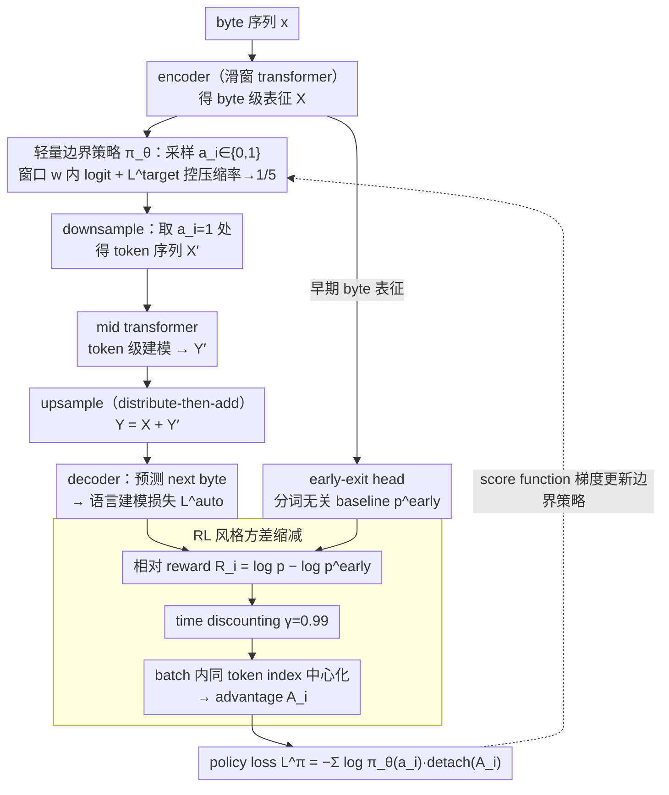

# You Can Learn Tokenization End-to-End with Reinforcement Learning

**会议**: ICML2026  
**arXiv**: [2602.13940](https://arxiv.org/abs/2602.13940)  
**代码**: https://github.com/SamD770/bitter-lesson-tokenization  
**领域**: LLM 预训练 / 端到端 tokenization / byte-level language modeling  
**关键词**: 端到端分词, score function estimator, REINFORCE, autoregressive U-Net, byte-level LLM  

## 一句话总结
本文把 byte-level LLM 中“哪里画 token 边界”建模成离散随机决策，用带 early-exit relative reward、time discounting 和 batch-relative advantage 的 score function estimator 端到端学习 tokenization，在 147M 自然语言模型和 90M 代码模型上优于直通估计器并接近 BPE-guided downsampling。

## 研究背景与动机
**领域现状**：现代 LLM 仍然依赖 tokenizer，把原始文本压缩成常见子串 token。BPE 等方法虽然有效，但属于训练流水线外的硬编码压缩步骤，背后有大量手工规则，例如数字拆分、空白符保留和特殊 token 处理。与此同时，byte-level 和 hierarchical language model 试图把模型输入回到 UTF-8 bytes，再在架构内部做下采样。

**现有痛点**：纯 byte-level 模型序列太长，注意力成本高；固定 stride、空白符、entropy spike 等下采样规则又是启发式，不一定最优。已有端到端学习 token boundary 的方法多用 straight-through estimator，把离散边界当作连续变量近似求梯度，但这种梯度规则缺少直接优化离散边界期望损失的理论保证。

**核心矛盾**：tokenization 本质上是离散压缩决策，而 LLM 训练依赖可微反向传播。若用 score function estimator，可以直接对离散策略的期望损失求梯度，但方差过高；若用 STE，方差较低但目标和理论都更启发式。本文要证明的是：只要把 RL 里的方差缩减技巧用对，score function estimator 可以在真实 LLM 预训练中可用。

**本文目标**：作者希望在 autoregressive U-Net 架构中端到端学习 token 边界，同时满足三个约束：边界策略由 loss 学出来而不是手工规则；byte-level 表征能被 token-level 继续复用；额外训练 compute 低于 BPE-guided tokenization 的 0.1%。

**切入角度**：把每个 byte 位置是否画 token boundary 视为 Bernoulli policy 的动作，next-byte cross-entropy 视为 reward signal。这样整个模型是一个 stochastic computation graph，边界策略可以用 REINFORCE/score function 梯度优化。

**核心 idea**：用 score function estimator 学离散 token boundary，但通过 early-exit baseline、时间折扣和 batch-relative centering 大幅降方差，让模型能从语言建模损失中自然学出接近语义边界的分词策略。

## 方法详解
方法围绕 autoregressive U-Net 展开：模型先在 byte 层编码，再根据采样出的 token boundary 把 byte 表征下采样成 token 表征，中间层在较短序列上做 transformer 计算，最后再上采样回 byte 层预测下一个 byte。本文的贡献在于 token boundary policy 以及它的低方差训练目标。

### 整体框架
给定 byte 序列 $x_1,\ldots,x_N$，encoder 得到 byte-level representations $X$。边界策略 $\pi_\theta$ 在每个位置采样 $a_i\in\{0,1\}$，其中 $a_i=1$ 表示在该 byte 后形成 token boundary。Downsample 操作选择边界处的 byte 表征作为 token-level sequence $X'$，mid transformer 在 token 层建模，再通过 distribute-then-add 的 upsample 把 token-level 信息加回每个 byte 的表示 $Y$，decoder 预测 next bytes。

训练目标是边缘化所有可能 tokenization strategy 后的 next-byte likelihood。由于 $a$ 是离散随机变量，梯度可拆成两部分：常规的 conditional language modeling gradient，以及 policy gradient 项 $\log p_\theta(y|a,x)\nabla_\theta\log\pi_\theta(a|x)$。后者就是本文要降方差的核心。

### 关键设计
**1. score function estimator：直接对离散边界求梯度，而非连续松弛**

token 边界是 0/1 离散动作，无法直接反向传播。已有端到端方法用 straight-through estimator（STE），把离散边界当成连续量、手工设计 surrogate 梯度规则，缺乏直接优化离散问题的理论保证。本文改用 score function estimator：把边界序列 $a$ 看成从策略 $\pi_\theta(a|x)$ 采样的随机变量，优化期望语言建模似然 $\mathbb{E}_{a\sim\pi_\theta}\log p_\theta(y|a,x)$。其梯度拆成两项——给定边界后正常反传的 conditional language modeling gradient，以及 policy gradient 项 $\log p_\theta(y|a,x)\,\nabla_\theta\log\pi_\theta(a|x)$，后者把“这个边界决策让后续 byte 预测变好还是变差”的信号反馈给边界策略。好处是它直接逼近离散问题期望损失的梯度，论文证明在大数据/大算力极限下做梯度下降会收敛到局部最优 tokenization，而 STE 没有这种保证；代价是 policy gradient 方差很高——这正是设计 2 要解决的。

**2. RL 风格方差缩减：让单样本 policy gradient 真正可学**

出于 efficiency 约束，每条序列只采一个 $a$ 做 Monte-Carlo 估计，朴素 REINFORCE 噪声太大学不动，难点是 reward attribution（究竟哪个边界决策对后续 loss 负责）。本文叠三招降方差：① **early-exit relative reward**——用 early-exit head 从早期 byte 表征直接预测 next byte，作为“与分词无关”的难度 baseline，相对 reward $R_i=\log p_\theta(x_i|x_{<i},a_{<i})-\log p^{early}_\theta(x_i|x_{<i})$ 扣掉“这段文本本来就难预测”的部分，只留 tokenization 额外带来的收益；② **time discounting** $\gamma=0.99$——长序列里把远处的 reward 折扣后再累加成 advantage，使序列里相隔较远的 advantage 近似解耦，等价于每条序列给边界策略很多条近独立的训练信号，用一点点偏差换大幅降方差；③ **batch-relative advantage**——由于最终层模型普遍强于 early-exit 模型，$G_i$ 系统性偏正、且该偏置随 token index 增大，于是在一个 batch 的 $B$ 条序列里对同一 token index 的 advantage 做中心化，去掉这个位置相关偏置。最终 policy loss $L^\pi=-\sum_i\log\pi_\theta(a_i|x_{<i},a_{<i})\,detach(A_i)$。三招缺一不可：没有 baseline 和 discounting，单样本梯度根本学不动。

**3. 轻量边界策略与目标压缩率：可忽略的 logit 计算 + 防退化约束**

边界概率是 logit $l_i$ 的 sigmoid。$l_i$ 由 byte 表征 $X_i$ 的线性投影、加上窗口内每个历史边界的条件项构成（预计算 $W_kX_i$ 后做一次 scan），相对整体前向 compute 可忽略；默认窗口 $w=8$，论文还验证 $w=1$（只看 $X_i$ 和前一个边界 $a_{i-1}$）已接近，说明不需要复杂长窗口规则。初始化时缩放 $l^{scaled}_i=l^{raw}_i/D+\sigma^{-1}(\bar{\pi}_{target})$（$D=16$），使 $p_i\approx\bar{\pi}_{target}$。但若不加约束，模型会退化成“每个 byte 都画边界”的昂贵策略，因此加目标率损失 $L^{target}=\bar{l}\cdot detach(\bar{p}-\bar{\pi}_{target})$，对 batch 平均 logit $\bar{l}$ 施加正/负压力，把实际下采样率推向 $\bar{\pi}_{target}=1/5$（实测收敛到 0.204，接近 BPE 的 0.207）。选择在 logit 而非概率上施压，是因为 sigmoid 梯度幅度不均会让直接操作概率不稳定。

### 损失函数 / 训练策略
总损失为 $L=L^{auto}+\lambda_\pi L^\pi+\lambda_{target}L^{target}+\lambda_{early}L^{early}$。其中 $L^{auto}$ 是最终 next-byte cross-entropy，$L^{early}$ 训练 early-exit baseline，$L^\pi$ 是 policy loss，$L^{target}$ 控制平均边界率。实验中 $\lambda_\pi=\lambda_{target}=10^{-2}$，$\lambda_{early}=10^{-1}$，目标下采样率为 $1/5$。

## 实验关键数据

### 主实验
自然语言实验在过滤后的 FineWeb 上训练约 147M 参数模型，并报告 bits-per-byte；代码实验在 CodeParrot 上训练约 90M 参数模型。作者更关注 learned boundary 的质量和低方差指标，而不是小模型 zero-shot accuracy。

| 方法 | PIQA↓ | HellaSwag↓ | ARC-Easy↓ | LAMBADA↓ | FineWeb Test↓ |
|------|-------|------------|-----------|----------|---------------|
| Uniform | 1.660 | 1.306 | 1.974 | 1.926 | 1.376 |
| Dynamic (Nawrot et al.) | 1.737 | 1.340 | 2.011 | 1.956 | 1.372 |
| H-Net (Hwang et al.) | 1.641 | 1.313 | 2.000 | 2.130 | 1.386 |
| BPE guidance | 1.589 | 1.230 | 2.084 | 1.645 | 1.299 |
| Ours (w=1) | 1.561 | 1.199 | 1.987 | 1.584 | 1.280 |
| Ours | 1.557 | 1.212 | 2.016 | 1.737 | 1.297 |

### 消融实验
论文的消融主要围绕边界窗口、BPE-guidance 对照、目标下采样率和代码数据迁移。

| 分析项 | 设置 | 关键结果 | 说明 |
|--------|------|----------|------|
| 边界窗口大小 | Ours w=8 vs Ours w=1 | FineWeb Test 1.297 vs 1.280 | 大窗口不是必要条件，短窗口已足够强 |
| BPE-guidance 对照 | 200k BPE 边界右移避免 lookahead | FineWeb Test 1.299 | 学出的动态策略几乎追平外部 BPE 先验 |
| FLOPs-Validation loss | 147M FineWeb | ours 约 1.279 bits-per-byte，优于 uniform/STEs 曲线 | 更语义化的边界转化为训练 loss 优势 |
| CodeParrot | 90M Python code | ours validation loss 0.568，H-Net 0.769 | 在代码结构上，score-function 边界策略优势更明显 |
| Downsampling rate | 收敛后 $\bar{a}$ | Ours 0.204，BPE guidance 0.207，Uniform/Dynamic 0.200 | 目标率控制较稳，且接近 BPE 压缩率 |

### 关键发现
- 模型能在没有空白符、词法或 BPE 先验的情况下学出 whitespace-like 和语义边界，说明 language modeling loss 本身包含强 tokenization 信号。
- w=1 与 full window 表现接近，意味着边界策略主要依赖当前 byte representation 和最近边界，而不需要复杂长窗口规则。
- BPE guidance 仍然强，但本文方法是唯一一个动态学习策略，在没有外部 BPE 边界的情况下基本恢复 BPE-guided downsampling 的 FineWeb test loss。
- Python code 上的收益更明显：模型学会在 module names 起始处画边界，并避免在重复 Apache License 等低价值区域花太多 test-time compute。

## 亮点与洞察
- 最有价值的是把 tokenization 的离散性正面处理，而不是继续用 surrogate gradient 回避。这个选择让目标定义更自然，也为后续更复杂的 learned tokenizer 提供了干净接口。
- Early-exit relative reward 很巧：它把“这段文本本来就难预测”从 reward 中扣掉，使边界策略关注 tokenization 额外带来的收益。
- 论文的结论对 tokenizer 设计有启发：BPE 的优势可能不只是频率统计，而是提供了合理的语义压缩位置；如果模型能自己学到这些位置，未来 tokenizer 可以更语言无关、更任务自适应。

## 局限与展望
- 实验规模只有 90M-147M，作者也承认很多 autoregressive U-Net 相对 token transformer 的优势可能要到 $>10^{21}$ FLOPs 才显现，因此对 frontier LLM 的结论仍需放大验证。
- 下游 accuracy 在这个规模接近随机，论文改用 bits-per-byte 衡量 continuation likelihood；这更稳定，但不等价于真实任务能力。
- Score function estimator 虽然可用，但仍需要 careful variance reduction 和超参权重；不同数据、模型规模和目标压缩率下是否稳定还需要更多实验。
- 最优 tokenization aspect ratio 如何随模型规模变化仍是开放问题。作者初步发现 20M-40M 规模下 aspect ratio 2 最好，但大模型可能不同。

## 相关工作与启发
- **vs BPE / SuperBPE**: BPE 是训练外的频率压缩规则，SuperBPE 等方法继续优化 tokenizer 工程；本文把边界决策放进模型训练内部，让 tokenizer 随语言建模目标学习。
- **vs byte-level models**: ByT5 等纯 byte 模型避免 tokenizer 偏置，但序列长度太长；autoregressive U-Net 加 learned downsampling 试图兼顾 byte-level 通用性和 token-level 效率。
- **vs straight-through estimator tokenization**: STE 通过连续松弛传梯度，工程上简单但目标近似；score function estimator 直接优化离散策略，代价是必须控制方差。
- **vs RL for routing / MoE**: 本文和 MoE routing 都在学习离散结构选择，但 token boundary 的 credit assignment 横跨长 byte sequence，因此 early baseline 和 discounting 特别关键。

## 评分
- 新颖性: ⭐⭐⭐⭐☆ 用 score function estimator 学 LLM tokenization 并做到可训练，思路干净且有挑战性。
- 实验充分度: ⭐⭐⭐⭐☆ 有自然语言、代码、BPE 对照、窗口消融和压缩率分析；但模型规模仍偏小。
- 写作质量: ⭐⭐⭐⭐☆ 方法推导清楚，RL 方差缩减动机明确；部分图表指标需要熟悉 bits-per-byte 才容易解读。
- 价值: ⭐⭐⭐⭐☆ 对未来 tokenizer-free / learned-tokenizer LLM 很有启发，尤其可能改善多语言和非英语文本处理。

<!-- RELATED:START -->

## 相关论文

- [\[NeurIPS 2025\] Shift Before You Learn: Enabling Low-Rank Representations in Reinforcement Learning](../../NeurIPS2025/reinforcement_learning/shift_before_you_learn_enabling_low-rank_representations_in_reinforcement_learni.md)
- [\[ICML 2026\] Can Large Language Models Generalize Procedures Across Representations?](can_large_language_models_generalize_procedures_across_representations.md)
- [\[ICML 2026\] Learning to Search and Searching to Learn for Generalization in Planning](learning_to_search_and_searching_to_learn_for_generalization_in_planning.md)
- [\[ACL 2026\] Easy Samples Are All You Need: Self-Evolving LLMs via Data-Efficient Reinforcement Learning](../../ACL2026/reinforcement_learning/easy_samples_are_all_you_need_self-evolving_llms_via_data-efficient_reinforcemen.md)
- [\[ICML 2026\] Offline Reinforcement Learning with Generative Trajectory Policies](offline_reinforcement_learning_with_generative_trajectory_policies.md)

<!-- RELATED:END -->
