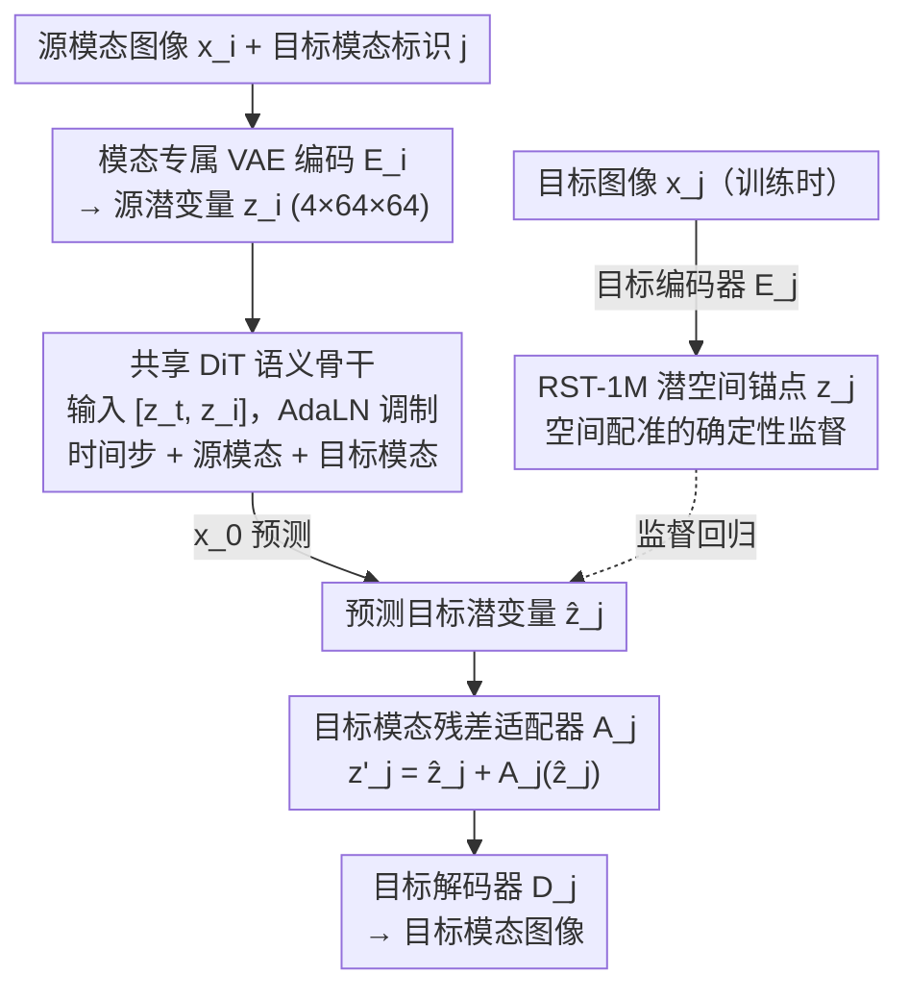

# Any2Any: Unified Arbitrary Modality Translation for Remote Sensing

**会议**: ICML2026  
**arXiv**: [2603.04114](https://arxiv.org/abs/2603.04114)  
**代码**: https://github.com/MiliLab/Any2Any (有)  
**领域**: 遥感 / 多模态生成  
**关键词**: 任意模态翻译、遥感多模态、潜扩散、RST-1M、残差适配器  

## 一句话总结
Any2Any 把遥感中的 RGB、SAR、NIR、MS、PAN 等传感器互译从一堆成对模型改成一个共享潜空间里的统一潜扩散模型，并用百万级 RST-1M 数据集和目标模态残差适配器，在 14 个已见翻译方向和多个未见模态组合上取得更好的保真度与泛化能力。

## 研究背景与动机
**领域现状**：遥感场景越来越依赖多源传感器协同观测。同一地理区域可能同时存在光学 RGB、合成孔径雷达 SAR、近红外 NIR、多光谱 MS、全色 PAN 等模态，它们分别提供纹理、结构、光谱和全天候观测信息。实际应用里，某个区域常常只有部分模态可用，因此用已有模态合成缺失模态，是连续地球观测、灾害监测、城市分析和下游识别任务中的重要问题。

**现有痛点**：主流遥感跨模态翻译方法仍然按方向训练模型，例如 SAR 到 RGB、NIR 到 RGB、RGB 到 PAN 等。这样做在只有一两个模态时尚可接受，但传感器数量增加后，若要支持所有互译方向，就需要约 $O(N^2)$ 个方向专用模型。更麻烦的是，每个方向的模型只在局部数据上学习，无法稳定复用其他模态对中的语义信息，也很难迁移到训练阶段没有成对样本的模态组合。

**核心矛盾**：遥感模态之间既共享同一个地理场景，又受不同物理成像机制约束。RGB、SAR、NIR、MS、PAN 的分辨率、通道数、采样几何和噪声特性都不一样；如果完全共享模型，目标模态的细节分布容易错位；如果完全按方向拆开训练，又丢掉了跨模态共享语义和规模化能力。论文试图在“统一语义映射”和“保留传感器差异”之间找到一个可扩展的折中。

**本文目标**：作者将任务定义为 Any-to-Any 遥感模态翻译，即给定任意源模态和任意目标模态，模型都应能在同一框架内完成翻译。为此，需要同时解决三个子问题：第一，构建足够连通的大规模跨模态监督图；第二，把不同传感器投到可比较的潜表示空间；第三，用共享骨干学习语义映射，同时用轻量模块校正目标模态的系统性偏差。

**切入角度**：作者的观察是，不同传感器虽然观测形式不同，但背后指向的是同一地理语义场景。只要能用空间配准样本提供“潜空间锚点”，就可以把跨模态生成从不稳定的边缘分布匹配，改造成对目标模态潜变量的监督回归。这个角度很适合遥感，因为遥感数据天然强调地理对齐和物理尺度一致性。

**核心 idea**：用模态专属 VAE 建立统一潜空间，再用一个带源/目标模态条件的 DiT 共享骨干预测目标潜变量，最后用目标模态残差适配器做小幅校准，从而把任意遥感模态互译压缩到一个统一模型里。

## 方法详解
Any2Any 的方法可以看成一个“先对齐表征，再共享翻译，再按目标模态修边”的三阶段框架。论文没有直接在像素空间学习所有方向的生成器，而是先让每个模态拥有自己的编码器和解码器，把不同分辨率、不同通道结构的图像投到统一形状的潜表示中。随后，共享 Diffusion Transformer 在这个潜空间中学习从源模态到目标模态的语义映射。由于每个目标模态的 VAE 潜空间仍有自己的分布习惯，模型再引入目标索引的残差适配器，把共享骨干输出的潜变量推回目标解码器更擅长处理的区域。

### 整体框架
输入是一张源模态遥感图像 $x_i$，例如 SAR 或 NIR，以及一个目标模态标识 $j$，例如 RGB 或 MS。模型先用源模态对应的编码器 $E_i$ 得到源潜变量 $z_i$。训练时，目标图像 $x_j$ 也会通过目标编码器 $E_j$ 得到目标潜变量 $z_j$，它被当作监督锚点。扩散骨干接收带噪目标潜变量 $z_t$ 与源潜变量 $z_i$ 的通道拼接，并通过时间步、源模态、目标模态三类嵌入调制 DiT 的 AdaLN 层，直接预测干净目标潜变量 $\hat{z}_j$。最后，目标模态适配器 $A_j$ 对 $\hat{z}_j$ 做残差校准，再交给目标解码器 $D_j$ 重建目标模态图像。

从复杂度上看，传统成对模型需要为每个方向准备独立网络；Any2Any 只保留一套共享语义骨干，加上每个模态一套 VAE 和一个极小的目标适配器。因此新增模态时主要增加模态相关的投影/解码组件，而不是让翻译方向数量呈平方增长。

### 关键设计
1. **RST-1M 潜空间锚点：把模糊生成改成有监督的潜变量回归**

	任意模态翻译最棘手的地方在于，给定一张源图像，“正确”的目标图像并不是某种风格，而是同一地理场景在另一种传感器下的具体成像——如果只用对抗或分布匹配，模型很容易生成“像目标域但地物对不上”的结果。Any2Any 借 RST-1M 数据集绕开了这个模糊性：它汇集 SEN1-2、SEN12MS、CACo、SpaceNet-3、SpaceNet-5 等公开数据，覆盖 RGB、SAR、NIR、MS、PAN 五种模态和七类跨模态配对。对某个源图像 $x_i$，其空间对齐的目标图像 $x_j$ 经目标编码器得到 $z_j=E_j(x_j)$，论文把这个潜变量当成目标分布中的确定性锚点，训练时直接要求预测结果贴近 $z_j$。这样跨模态映射就从“像不像目标域”的边缘分布匹配，变成了对具体场景目标潜表示的回归，地物边界、道路、水体、建筑等语义结构的一致性也因此更稳定——这正是遥感翻译比自然图像风格迁移更看重的东西。

2. **模态专属 VAE 编码 + 共享 DiT 语义映射：把物理差异和语义转换解耦**

	五种传感器的通道数、分辨率、采样几何和噪声特性都不同，若塞进一个像素级生成器，低层物理差异会和高层语义转换互相纠缠。Any2Any 把这两件事拆开：每个模态拥有独立的 VAE 编码器和解码器，负责吸收自己那一套成像统计，并把输入统一编码到 $4 \times 64 \times 64$ 的潜表示（VAE 用重建损失、感知损失和 KL 正则联合训练）；随后冻结 VAE，让一个共享的 Diffusion Transformer（DiT）在这个统一潜空间里学习所有方向的语义映射。DiT 的输入是带噪目标潜变量与源潜变量的通道拼接 $[z_t,z_i]$，条件向量由时间步嵌入、源模态嵌入、目标模态嵌入相加后经 MLP 得到，用来调制每层的 AdaLN。这样模态专属 VAE 专注低层差异、共享 DiT 专注高层地理语义，不同翻译方向得以复用同一套映射能力，新增模态时也只需补一套模态相关组件。

3. **$x_0$ 预测与目标模态残差适配器：稳住结构、再修目标分布偏差**

	标准扩散模型多预测噪声残差，但论文发现，当源/目标传感器差异很大时，噪声预测会让结构边界更不稳定。因此 Any2Any 让 DiT 直接预测干净的目标潜变量 $\hat{z}_j=f_\theta([z_t,z_i],c)$（即 $x_0$ 预测），用结构更稳的目标做监督。但共享骨干要兼顾所有方向，输出难免和某个目标模态 VAE 解码器擅长的潜空间存在系统性错位，于是再接一个目标模态残差适配器（residual adapter）$A_j$ 做小幅校准：$z'_j=\hat{z}_j+A_j(\hat{z}_j)$。适配器是紧凑卷积网络、最后一层零初始化（初始等价于恒等映射），训练时用 stop-gradient 隔离校准损失，避免它反向扰动共享骨干。这样共享骨干保持跨方向泛化、不被单个目标模态的局部分布牵着走，目标模态的细节又不会被多方向平均化抹平。

### 损失函数 / 训练策略
训练分为两个重点阶段。第一阶段训练各模态 VAE，使每个传感器都能在统一潜空间中高质量重建自身输入。VAE 目标可概括为 $L_{VAE}=L_{rec}+\gamma L_{lpips}+\beta L_{KL}$，其中 RGB 使用感知损失权重 $\gamma=1.0$，其他模态论文中设为 $0$，KL 权重为 $10^{-5}$。

第二阶段冻结 VAE，训练共享 DiT 和适配器。扩散骨干使用目标潜变量的 $x_0$ 预测损失 $L_{z0}$，要求输出贴近目标锚点 $z_j$；适配器使用 $L_{calib}=\|\hat{z}_j+A_j(sg(\hat{z}_j))-z_j\|_2^2$ 做潜空间校准。总目标是 $L_{total}=L_{z0}+\lambda L_{calib}$，实验里 $\lambda=1.0$。实现上使用 DiT-S/4、DiT-B/4、DiT-L/4 三种骨干，DiT 训练全局 batch size 为 384，推理时使用 250 步 DDIM 采样。

## 实验关键数据

### 主实验
论文在 RST-1M 测试集上评估 14 个已见翻译方向，指标包括 PSNR、SSIM 和 RMSE。对比方法包括 Pix2Pix、Pix2PixHD、BBDM、ControlNet 和 LBM。需要注意的是，这些对比方法按方向分别训练 14 个模型，而 Any2Any 用一个统一模型覆盖所有训练方向；即便在这个对比设定下，Any2Any-L 仍在大多数指标上领先。

| 翻译方向 | 指标 | Any2Any-L | 最强对比方法 | 提升 / 差异 |
|----------|------|-----------|--------------|-------------|
| SAR → RGB | PSNR / RMSE | 25.20 / 16.85 | BBDM: 19.50 / 31.02 | PSNR +5.70，RMSE 降低 14.17 |
| NIR → RGB | PSNR / RMSE | 27.03 / 13.70 | BBDM: 20.39 / 29.59 | PSNR +6.64，RMSE 降低 15.89 |
| MS → RGB | PSNR / RMSE | 33.22 / 6.45 | BBDM: 26.39 / 12.76 | PSNR +6.83，RMSE 降低 6.31 |
| RGB → PAN | PSNR / RMSE | 33.45 / 9.47 | LBM: 27.02 / 13.30 | PSNR +6.43，RMSE 降低 3.83 |
| MS → NIR | PSNR / RMSE | 29.14 / 10.26 | LBM: 19.00 / 34.33 | PSNR +10.14，RMSE 降低 24.07 |

从这些结果可以看出，Any2Any 的优势不仅出现在一个常见方向上，而是跨 SAR、光学、近红外、多光谱和全色图像都比较稳定。尤其是 MS → NIR、NIR → RGB、MS → RGB 这类带光谱信息转换的任务，统一潜空间似乎能从多方向监督中积累更可迁移的地物结构与光谱关系。

| 模型规模 | SAR→RGB PSNR / RMSE | NIR→RGB PSNR / RMSE | MS→RGB PSNR / RMSE | RGB→PAN PSNR / RMSE | 观察 |
|----------|----------------------|----------------------|---------------------|----------------------|------|
| Any2Any-S | 22.25 / 23.45 | 23.01 / 21.25 | 29.81 / 9.23 | 31.30 / 11.27 | 小模型已经超过多数成对基线 |
| Any2Any-B | 24.35 / 18.42 | 26.02 / 15.27 | 32.35 / 7.07 | 33.03 / 9.87 | 骨干变大后多方向同步提升 |
| Any2Any-L | 25.20 / 16.85 | 27.03 / 13.70 | 33.22 / 6.45 | 33.45 / 9.47 | 最大模型取得最强整体性能 |

这组规模对比说明，Any2Any 并不是只靠数据集规模“堆”出一个固定结果；随着 DiT 骨干从 S 到 B 再到 L，多个方向的 PSNR 上升、RMSE 下降，显示统一框架具有较明确的 scaling behavior。

### 消融实验
消融主要围绕残差适配器、增量训练、多方向训练和全方向统一训练展开。表中数值均在 SAR → RGB 测试上汇报，用来观察新增机制是否会破坏原有方向性能。

| 配置 | 训练方向 / 策略 | PSNR | RMSE | 说明 |
|------|----------------|------|------|------|
| Setting 1 | SAR→RGB，去掉 adapter | 20.68 | 28.51 | 只有共享骨干，缺少目标潜空间校准 |
| Setting 2 | SAR→RGB，加入 adapter | 20.88 | 27.89 | adapter 带来 +0.20 PSNR、-0.62 RMSE |
| Setting 3 | SAR↔RGB，从头训练 | 19.63 | 32.83 | 双方向从头训练反而不稳 |
| Setting 4 | SAR↔RGB，增量训练 | 21.44 | 25.87 | 比从头训练 +1.81 PSNR、-6.96 RMSE |
| Setting 5 | SAR→所有相连模态 | 22.06 | 24.00 | 多方向训练进一步改善 SAR→RGB |
| Setting 6 | 所有相连模态→RGB | 21.36 | 26.32 | 另一种多方向训练也优于单方向 |
| Setting 7 | Any→Any，14 个方向 | 22.25 | 23.45 | 全方向统一训练效果最好 |

### 关键发现
- 残差适配器的绝对增益不算夸张，但方向是稳定的：它用极小参数量修正目标潜空间错位，避免共享 DiT 输出和目标解码器之间产生系统偏差。
- 增量训练比从头训练更好，说明模型先在简单方向上学到的地理结构表征可以迁移到新增方向；这与论文“共享潜空间语义可复用”的核心假设一致。
- 多方向训练没有稀释 SAR→RGB 的性能，反而让该方向更强。这一点很重要，因为统一模型常见风险是多任务互相干扰，而这里更多方向提供了额外监督锚点。
- 零样本实验显示，在 SAR-PAN、PAN-MS、NIR-PAN 等没有成对训练数据的组合上，Any2Any 仍能生成语义合理的结果。这说明模型可能学到了通过连通模态图进行传递的跨模态结构，而不是只记住每条训练边。

## 亮点与洞察
- **把遥感翻译问题重新定义成连通模态图上的统一推理**：论文的贡献不只是提出一个新生成器，而是把任务从成对方向扩展到 Any-to-Any。这个定义更贴近真实多传感器系统，因为真实场景里缺失的是任意模态，而不是固定的某一个方向。
- **RST-1M 的数据设计很关键**：作者没有强行要求五模态完全对齐的样本，而是通过 RGB 等共享模态把多个公开数据源连成图。这个做法务实，也解释了为什么模型能在未见模态组合上有一定泛化：图连通性给了语义传递路径。
- **VAE 与 DiT 的职责划分清楚**：VAE 负责处理传感器物理差异，DiT 负责共享语义映射，adapter 负责目标分布校准。这种分层设计比单纯把模态 ID 塞进一个大生成器更可解释，也更适合新增模态时扩展。
- **消融传递出一个有用经验**：多方向训练在这里不是负担，而是正则化和额外监督来源。对于遥感基础模型来说，跨模态任务可以作为学习地理语义的桥，而不只是缺失模态补全工具。

## 局限与展望
- RST-1M 虽然规模大，但仍主要由公开数据集聚合而来，真实覆盖范围、季节变化、地区分布、传感器型号和成像条件可能存在偏置。模型在未覆盖地区、极端天气、灾害现场或非常规传感器上的稳健性仍需要进一步验证。
- 数据集采用成对数据构建连通图，而不是大规模五模态完全共注册样本。因此所谓 Any-to-Any 泛化更像是在连通图上的传递学习，对完全孤立的新模态或分布差异很大的新卫星，仍然需要额外锚点或适配策略。
- 推理使用 250 步 DDIM，对大范围遥感生产系统来说仍可能偏重。论文强调模型数量从 $O(N^2)$ 降到 $O(1)$，但单次生成的扩散采样成本、全区域批处理效率和部署延迟仍有优化空间。
- 评估以 PSNR、SSIM、RMSE 和视觉样例为主，尚缺少对下游任务的系统验证。例如合成 SAR/RGB 是否能提升分割、检测、变化检测、灾害识别等任务，仍需要更贴近应用的指标。
- 零样本结果主要是定性展示，缺少可量化 ground truth 时很难判断生成模态是否物理可信。未来可以引入物理一致性约束、专家标注或下游任务一致性来评估未见方向。

## 相关工作与启发
- **vs Pix2Pix / Pix2PixHD**: 这类 GAN 图像翻译方法擅长固定成对任务，但需要为每个方向单独训练，且在遥感跨传感器场景中容易出现边界错位或颜色偏移。Any2Any 的优势在于统一潜空间和多方向共享监督，但代价是训练系统更复杂。
- **vs BBDM / LBM 等扩散或桥模型**: 这些方法把图像到图像翻译建模为扩散或桥过程，生成质量更强，但通常仍面向固定域对。Any2Any 借用潜扩散能力，却把核心从“某一对域的生成路径”改成“多模态潜空间中的目标锚点回归”。
- **vs ControlNet / T2I-Adapter 思路**: ControlNet 类方法通过条件分支增强生成可控性，Any2Any 的 residual adapter 也有“轻量校准”的味道。但这里 adapter 不是给文本到图像模型加控制，而是给每个遥感目标模态修正潜空间分布偏差。
- **对遥感基础模型的启发**: 多模态遥感不一定要先追求所有模态完全对齐的大一统数据集。只要模态图足够连通，模型就可能通过共享潜空间获得跨路径迁移能力。这对未来加入高光谱、热红外、LiDAR 或 DEM 等模态很有参考价值。

## 评分
- 新颖性: ⭐⭐⭐⭐⭐ 首次系统形式化遥感 Any-to-Any 模态翻译，并把数据集、统一模型和零样本模态组合放在同一框架下解决。
- 实验充分度: ⭐⭐⭐⭐☆ 14 个已见方向、多个基线、消融和零样本展示较完整，但未见方向仍偏定性，下游任务验证不足。
- 写作质量: ⭐⭐⭐⭐☆ 任务动机、框架拆分和实验结论清楚，表格信息丰富；部分数据集构建和训练细节放在附录，阅读时需要来回对照。
- 价值: ⭐⭐⭐⭐⭐ 对多传感器遥感补全、统一地球观测模型和跨模态数据增强都有直接价值，RST-1M 本身也可能成为后续方法的重要基准。

<!-- RELATED:START -->

## 相关论文

- [\[ICCV 2025\] SkySense V2: A Unified Foundation Model for Multi-Modal Remote Sensing](../../ICCV2025/remote_sensing/skysense_v2_a_unified_foundation_model_for_multi-modal_remote_sensing.md)
- [\[CVPR 2026\] UniGeoSeg: Towards Unified Open-World Segmentation for Geospatial Scenes](../../CVPR2026/remote_sensing/unigeoseg_towards_unified_open-world_segmentation_for_geospatial_scenes.md)
- [\[CVPR 2026\] UniGeoRS: A Unified Benchmark for Tri-view Geo-Localization](../../CVPR2026/remote_sensing/unigeors_a_unified_benchmark_for_tri-view_geo-localization.md)
- [\[CVPR 2026\] Fast Kernel-Space Diffusion for Remote Sensing Pansharpening](../../CVPR2026/remote_sensing/fast_kernel-space_diffusion_for_remote_sensing_pansharpening.md)
- [\[CVPR 2026\] GeoCoT: Towards Reliable Remote Sensing Reasoning with Manifold Perspective](../../CVPR2026/remote_sensing/geocot_towards_reliable_remote_sensing_reasoning_with_manifold_perspective.md)

<!-- RELATED:END -->
