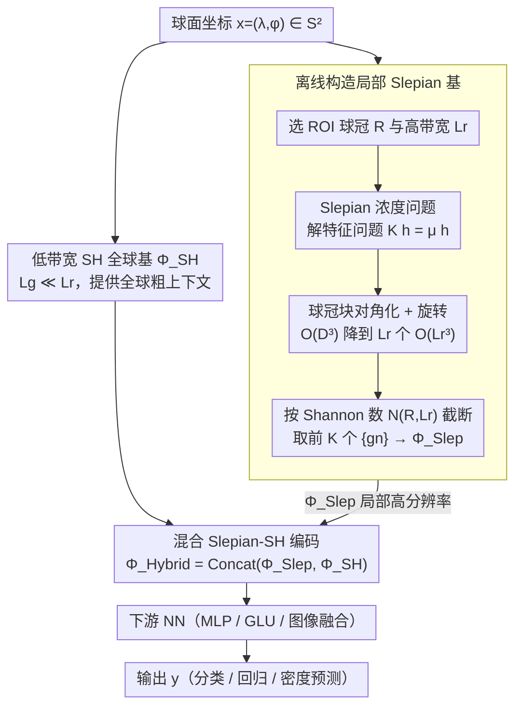

# Localized, High-resolution Geographic Representations with Slepian Functions

**会议**: ICML 2026  
**arXiv**: [2602.00392](https://arxiv.org/abs/2602.00392)  
**代码**: https://github.com/arjunarao619/SlepianPosEnc (有)  
**领域**: 遥感 / 地理表征 / 位置编码  
**关键词**: Slepian 函数, 球面调和, 位置编码, 局部高分辨率, 地理机器学习

## 一句话总结
本文用球面 Slepian 函数构造一种把表征容量集中在感兴趣区域 (ROI) 的地理位置编码器，并提出 Slepian-球面调和混合编码以同时兼顾局部高分辨率与全球粗粒度上下文，在五个分类、回归与图像增强预测任务上稳定超过 SH、Wavelet、RFF 等主流基线。

## 研究背景与动机
**领域现状**：把经纬度 $(\lambda, \phi) \in S^2$ 嵌入到一个连续函数 $\Phi(x)$，再接一个 MLP 用于下游预测，是地理机器学习的标准做法；典型选择包括 grid cell 风格的多尺度正弦编码 (Space2Vec)、Double Fourier Sphere 系列 (SphereC/M)、Random Fourier Features，以及在球面上原生定义的球面调和 (SH)。SatCLIP 用 SH 做大规模预训练，是当前公认的全球通用位置编码器。

**现有痛点**：所有这些编码都把"分辨率预算"均匀摊到整个地球上：要在某个城市级别 ($\sim$几公里) 看清细节，就得把全球分辨率一起提高，特征维度按 $(L+1)^2$ 平方膨胀，内存与计算代价不可承受。更糟糕的是，SH 的关联 Legendre 多项式递推数值不稳定，归一化常数 $N_{\ell m} \sim \ell^{-m}$ 衰减极快，FP32 下 $L \gtrsim 40$ 就会出现非数值，混合精度训练阈值更低，因此 SH 实际能稳定使用的分辨率被卡在约 $20000/40 = 500$ km 的水平，对加州房价、日本都道府县这种几十公里尺度的局部任务远远不够。

**核心矛盾**：球面上的"全球完备性"和"局部高分辨率"之间存在结构性 trade-off。要全球可用就得在球面上铺一个完备正交基，每个基函数都跨越整个球面；要局部高分辨率就只能花费指数级的维度去强行细化。

**本文目标**：(1) 找到一种基函数，使得固定带宽下绝大部分能量集中在用户指定的 ROI；(2) 这种基要能和全球 SH 无缝拼接以保留全球上下文；(3) 在极地不能崩溃 (pole-safe)；(4) 计算上要能扩展到 $L_r \sim 256$ 这种 SH 根本算不动的分辨率。

**切入角度**：信号处理里有一个经典的浓度问题 (Slepian & Pollak, 1961)：在所有带限函数里，哪些把能量最大限度集中在给定区间？把它推到球面 (Simons et al. 2006) 就得到球面 Slepian 函数，已在地球重力场、冰盖质量变化等地球物理任务中用于"局部信号分析"。作者的转变是：与其用 Slepian 去分析观测信号，不如把它当作一个位置编码基，直接学局部表征。

**核心 idea**：把带限 SH 子空间 $\mathcal{H}_{L_r}$ 投影到 ROI 上得到一个浓度矩阵 $K$，取它的前 $K = \lceil N(R,L_r) \rceil$ 个特征向量作为位置编码基，再和一个低带宽 SH 全球基拼接，就能"局部用高分辨率 Slepian，全球用低分辨率 SH"。

## 方法详解
全文的核心是把球面浓度问题改写成一个特征值问题，再用球冠 (spherical cap) 让它在高带限下可计算，最后把局部 Slepian 与全球 SH 拼成混合编码送入 MLP。

### 整体框架
输入是球面坐标 $x = (\lambda, \phi) \in S^2$；编码器 $\Phi(x)$ 给出一个 $D$ 维特征，再经过任意 NN (MLP / GLU / 与图像 embedding 融合的 bottleneck) 输出标签 $y$。本文不改变 NN，只替换 $\Phi$。整个流水线分四步：(A) 选一个或多个 ROI 球冠 $R_c$ 和高带宽 $L_r$，预先解出球冠 Slepian 特征函数 $\{g_n\}$ 并按浓度特征值 $\mu_n$ 排序、按 Shannon 数截断；(B) 再选一个低带宽 $L_g \ll L_r$ 计算全球 SH 基 $\Phi_{\text{SH}}$；(C) 在线推理时把每个 ROI 的 Slepian 评估值与全球 SH 评估值拼接为 $\Phi_{\text{Hybrid}}(x)$；(D) 送入下游 NN 做分类、回归或与图像特征融合。下图中，离线分支（设计 1+2）负责把"区域 + 带宽"解成一组能量集中在 ROI 的局部基，全球 SH 分支提供粗上下文，二者在混合编码处（设计 3）并联：

### 关键设计

**1. Slepian 浓度问题与基的构造：在带限子空间里挑出能量几乎全落在 ROI 内的正交基**

球面编码把"分辨率预算"均匀摊到整个地球，要看清一个城市就得全球一起提分辨率、维度按 $(L+1)^2$ 膨胀。Slepian 的思路是反过来：在带限子空间里挑出"能量最大限度集中在 ROI"的基函数。定义浓度比 $\mu = \int_R |h(x)|^2 ds / \int_{S^2} |h(x)|^2 ds \in [0,1)$，最大化它等价于求一个 $D_{L_r} \times D_{L_r}$ 对称浓度矩阵 $K$ 的特征问题 $K h = \mu h$，其中 $K_{\ell m, \ell' m'} = \int_R Y_\ell^m Y_{\ell'}^{m'} ds$。特征值降序排列会出现"$\mu_n \approx 1$ 后突然掉到 $\mu_n \approx 0$"的硬切转折，转折点正是 Shannon 数 $N(R,L_r) = \mathrm{tr}(K) \approx \frac{\text{area}(R)}{4\pi}(L_r+1)^2$；取前 $K = \lceil N(R,L_r)\rceil$ 个特征函数 $\{g_n\}$ 就得到位置编码 $\Phi_{\text{Slep}}(x) = [g_1(x), \dots, g_K(x)]^\top$。

妙处在于 Shannon 数恰好把"区域 + 带宽"翻译成"该区域能容纳的独立模式数"，是天然的内禀维度上界——稀疏化是内禀的而非人为剪枝的。对斯里兰卡这种 $f_R \approx 1.29 \times 10^{-4}$ 的小区，$L_r = 256$ 下只需 $K \approx 9$ 个 Slepian 模，而对应的全球 SH 需要 $D_{L_r} \approx 6.6\times 10^4$ 维。

**2. 球冠 Slepian 与高带限可计算性：用球冠 + 旋转把大特征问题降阶到能离线算完**

直接在任意 ROI 上算 $L_r = 256$ 的稠密 $K$ 矩阵（$\sim 6.6\times 10^4$ 维）在内存和数值精度上都不可行。作者把 ROI 限成以某点为中心、角半径 $\Theta$ 的球冠：这种轴对称设置下浓度矩阵按阶 $m$ 块对角化，每块尺寸不超过 $L_r$，良好浓度模数有显式公式 $N_\Theta(L_r) = \frac{1-\cos\Theta}{2}(L_r+1)^2$，因此 $\Theta$ 直接控制"局部信息预算"。实现上一次性在标准球心位置算出球冠 Slepian，再通过球面旋转平移到任意目标中心，保留前 $N_\Theta(L_r)$ 个模。

块对角化把 $O(D_{L_r}^3)$ 的代价拆成 $L_r$ 个 $O(L_r^3)$ 的小问题，这正是论文从"理论上 elegant"到"工程上可用"的桥梁——没有它，$L_r$ 根本推不到 256，多 ROI 拼接也得益于此。

**3. 混合 Slepian-SH 编码与极地安全：局部用高分辨率 Slepian、全球用低分辨率 SH，两个尺度并联**

纯 Slepian 在 ROI 外几乎为零，跨域物种分布、全球预训练这类任务需要全球信号；纯 SH 又在数值与分辨率上被卡死。作者把两者并联：$\Phi_{\text{Hybrid}}(x) = \mathrm{Concat}(\Phi_{\text{Slep}}(x), \Phi_{\text{SH}}(x))$，其中 $\Phi_{\text{SH}}$ 用低带宽 $L_g \ll L_r$ 只承担"全球哪里"的粗信息；多 ROI 时把各 $\Phi_{\text{Slep}}^{(c)}$ 并排拼接，因各 Slepian 能量不重叠所以跨区干扰可忽略。极地安全来自一个简单事实：每个 $g_n = \sum_{\ell,m} h_{\ell m}^{(n)} Y_\ell^m$ 是球面调和的有限线性组合，而 $Y_\ell^m$ 在两极解析，故 $g_n$ 在两极也解析；退化到 $R = S^2$ 时浓度矩阵变成单位阵，Slepian 还原成 SH。

这等于把"局部 vs 全球"的结构性 trade-off 拆成两个并联组件各司其职。作者还把同一思路推到时间维：用 DPSS 离散 Slepian 序列做时间编码，时空 Shannon 数 $k_t \approx 2 N_t W$ 控制时间频带预算，得到 $\Phi_{\text{ST}}(x,t) = \mathrm{Concat}(\Phi_{\text{SH}}(x), \Phi_{\text{Time}}(t))$。

### 训练策略
位置编码本身完全非参 (Slepian 基离线预计算)；训练只在下游 NN 内进行。分类/回归用 3 层 MLP + ReLU + dropout 0.1；建筑密度回归用 2 层 bottleneck，将位置编码与冻结的 AlphaEarth/Galileo 图像特征做拼接；物种分布按 SINR 框架做 presence-only 训练，全局采伪负样本，推理时把位置预测当作空间先验对 Xception 输出做逐元素加权。所有任务都用统一的位置编码替换协议比较。

## 实验关键数据

### 主实验
五个任务、十几种基线，下面摘出最关键的两类对比。

| 数据集 | 指标 | 本文 (Hybrid Slepian) | 强基线 SphereC / Theory | 提升 |
|--------|------|----------------------|-------------------------|------|
| California Housing (加州房价回归) | $R^2 \uparrow$ | 显著最优 (见 Table 1) | SphereC 0.53 / SH(L=40) 弱 | 大幅领先稠密 RFF |
| Japan Prefectures (47 类) | Acc $\uparrow$ | 最佳 | Space2Vec 0.84 | 在 2 km 边界硬样本上明显胜出 |
| Arctic MSS (极地海面高度) | $R^2 \uparrow$ | 最佳 | SphereM 0.91 | 同时验证 pole-safe |
| OpenBuildings 密度回归 ×4 区 | 平滑核 $\sigma$ 0–40 km 下 R² | 全部领先 | SH 在 $\sigma$ 小时退化严重 | 高频局部细节由 Slepian 提供 |
| Species (eBird S&T / IUCN) | mAP $\uparrow$ | 最佳 / out-of-cap 仍优 | 纯 Slepian 在 cap 外崩溃 | 混合架构关键性体现 |

### 消融实验
| 配置 | 关键指标 | 说明 |
|------|---------|------|
| Full Hybrid Slepian (L_r=120, L_g=10) | best | 完整模型 |
| Slepian only (无全球 SH) | 显著掉点 | 全球任务/伪负样本场景下 cap 外为零，物种分布 IUCN 直接退化 |
| SH only, 高 L | 数值崩溃或不可训练 | $L \gtrsim 40$ FP32 出 NaN，证明 SH 路径走不通 |
| 高维 Planar RFF | 加州 0.42 / 日本 0.59 | 单纯堆维度不能替代"空间-谱浓度"先验 |
| 不同 NN backbone (MLP / GLU / SIREN) | 排名稳定 | 提升来自编码器本身而非下游网络 |

### 关键发现
- 提升的真正来源是 spatio-spectral concentration，而非高维度：Planar RFF 维度 2000 仍远输 Slepian 9-200 维，说明"把容量放对地方"比"放更多容量"更关键。
- $N(R,L_r)$ 的物理意义被实证：取超过 Shannon 数的 Slepian 模反而带来噪声，前 $K$ 截断恰好对齐区域内禀维度。
- 极地任务上混合编码与纯 SH 旗鼓相当，证明退化到 $R = S^2$ 时确实回到 SH，没有引入新的极地病态。
- 时间维 DPSS 扩展在 ACE 气候模拟上也优于 Fourier 时间编码，提示同一浓度框架可以跨模态复用。

## 亮点与洞察
- 把"地球物理里用了几十年的局部浓度基"翻译成"位置编码"，一个领域的成熟工具直接解决另一个领域的开放问题，代价只是把分析视角倒过来：原来是用 Slepian 分解信号，现在是用 Slepian 表征坐标。
- "区域 → Shannon 数 → 维度"这条链给了一个非常干净的容量分配语义：维度不再是炼丹超参，而是面积乘带宽决定的内禀量；这种"先验告诉你该用多少维"的设计在其他空间数据 (点云、地图、网格) 上都值得借鉴。
- 球冠 + 旋转的工程 trick 把 $O(D^3)$ 降到 $L_r$ 个 $O(L_r^3)$，是论文从"理论上 elegant"到"工程上可用"的桥梁，物种分布的多 cap 拼接也得益于此。

## 局限与展望
- ROI 需要人工指定球冠中心和半径；对全球均匀但局部稀疏的任务 (如随机分布的稀有事件) 不存在显然的 ROI 划分，自适应或可学习的 ROI 选择是自然的下一步。
- 球冠假设简化了几何但牺牲了贴边形状 (如长条状海岸线、复杂行政边界)；做到更一般的 ROI 又会让块对角化失效。
- 混合维度需要分别调 $L_r$ 和 $L_g$，跨任务的最优组合并未给出原则性指导；可以考虑用 Shannon 数 + 任务 prior 自动搜索。
- 时间维 DPSS 只验证了一年 6 小时分辨率的气候数据，更长时间尺度 (年际/十年) 与不规则采样下的表现还需检验。

## 相关工作与启发
- **vs SatCLIP / 纯 SH (Klemmer 2025a)**: 同样球面原生、同样 pole-safe，但本文允许 $L_r$ 推到 256 而不数值崩溃，加州房价等局部任务上明显反超 SatCLIP。
- **vs Spherical Wavelets (Cai & Balestriero 2025)**: Wavelet 基于立体投影，两极退化；Slepian 是 SH 的有限线性组合，自然继承解析性，是更"球面原生"的多分辨率方案。
- **vs Random Fourier Features**: RFF 把容量靠维度堆出来 (论文中 2000 维)，但无法把容量"指向"特定区域；Slepian 用 9 维就在斯里兰卡这种小区匹敌 SH 的几万维。
- **vs Sphere2Vec / Space2Vec (Mai 2020/2023)**: DFS 系列在两极有不连续，且全球均匀分辨率；Slepian 同时解决极地与局部细化两个问题，可视为这条线的自然下一步。

## 评分
- 新颖性: ⭐⭐⭐⭐⭐ 把球面 Slepian 从"信号分析工具"重定位为"位置编码基"，是地理 ML 中少见的从信号处理跨界引入的硬核思路。
- 实验充分度: ⭐⭐⭐⭐ 五任务覆盖回归/分类/极地/图像融合/时空，但球冠以外的复杂 ROI、跨大陆迁移仍是未完成的故事。
- 写作质量: ⭐⭐⭐⭐ Shannon 数与浓度问题写得清晰，公式与图 1/2 的对应关系直观；附录较重，主文的工程细节略简。
- 价值: ⭐⭐⭐⭐⭐ 直接给社区一个开源、即插即用且数学可解释的局部高分辨率编码器，对城市级遥感与生态分布任务都是立刻可用的工具。

<!-- RELATED:START -->

## 相关论文

- [\[NeurIPS 2025\] Cloud4D: Estimating Cloud Properties at a High Spatial and Temporal Resolution](../../NeurIPS2025/remote_sensing/cloud4d_estimating_cloud_properties_at_a_high_spatial_and_temporal_resolution.md)
- [\[ICML 2025\] High-Resolution Live Fuel Moisture Content (LFMC) Maps for Wildfire Risk from Multimodal Earth Observation Data](../../ICML2025/remote_sensing/high-resolution_live_fuel_moisture_content_lfmc_maps_for_wildfire_risk_from_mult.md)
- [\[ICLR 2026\] Measuring the Intrinsic Dimension of Earth Representations](../../ICLR2026/remote_sensing/measuring_the_intrinsic_dimension_of_earth_representations.md)
- [\[ECCV 2024\] Learning Representations of Satellite Images From Metadata Supervision](../../ECCV2024/remote_sensing/learning_representations_of_satellite_images_from_metadata_supervision.md)
- [\[ICCV 2025\] WildSAT: Learning Satellite Image Representations from Wildlife Observations](../../ICCV2025/remote_sensing/wildsat_learning_satellite_image_representations_from_wildlife_observations.md)

<!-- RELATED:END -->
