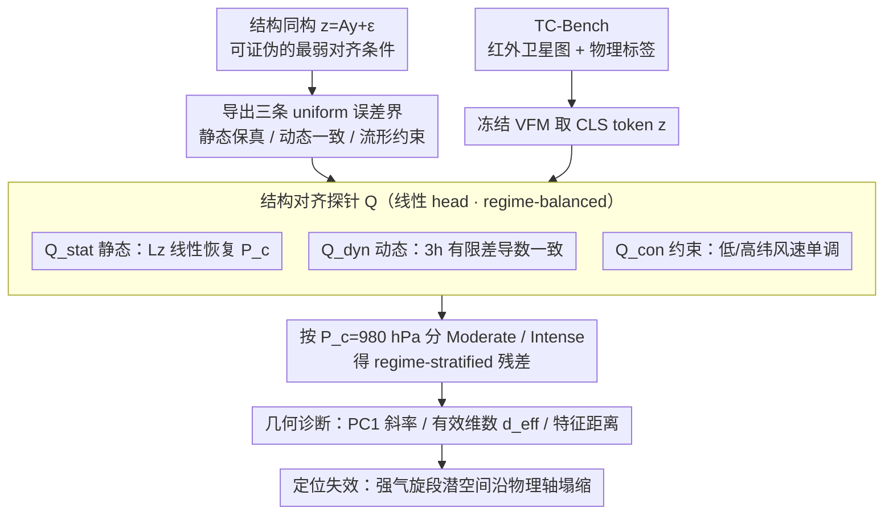

# The Perception-Physics Paradox: Probing Scientific Alignment with TC-Bench

**会议**: ICML 2026  
**arXiv**: [2605.24782](https://arxiv.org/abs/2605.24782)  
**代码**: https://github.com/CausalLearningAI/tc-bench  
**领域**: 遥感 / 视觉基础模型评测 / 表示学习诊断  
**关键词**: 科学对齐, 结构同构, 视觉基础模型, 热带气旋, 探针评估

## 一句话总结
作者指出视觉基础模型 (VFM) 在卫星图像上"看起来"很会预测，但在物理极端区段会沿物理坐标轴塌缩，于是用"结构同构"形式化"科学对齐"概念，并发布全球热带气旋基准 TC-Bench 与一套静态/动态/约束三层线性探针，系统揭露 DINO、CLIP、SigLIP、MAE 等冻结骨干在 $P_c<980$ hPa 强气旋段的表征崩溃。

## 研究背景与动机
**领域现状**：把通用视觉基础模型迁到科学场景（气象、生态、医学）正在成为热潮，业内默认指标是 in-distribution 精度 + 跨域 OOD 精度（例如换地理区、换观测机构），如果 VFM 在 OOD 上仍能预测，就被解读为它"学到了不变的物理结构"。Digital Typhoon 等基准也基本采取这种"平均 case + OOD"的评测范式。

**现有痛点**：热带气旋的样本天然集中在中等强度（$P_c$ 在 1000 hPa 附近），平均误差掩盖了真正高风险的强气旋段；机构间 OOD 主要扰动视觉表观（条带规约、报告习惯），却不扰动物理轴，于是"OOD 看起来很稳"完全可能是"视觉特征稳"而非"物理坐标稳"。换句话说，现有评估对感知鲁棒和物理可用性这两件事不分。

**核心矛盾**：当视觉饱和（强气旋的眼壁形态非常相似）时，视觉差异 → 0，而物理变量（最低中心气压 $P_c$、最大持续风速 $V_m$）仍可显著不同；这构成"感知 ≈ 不变 / 物理 ≠ 不变"的悖论，作者命名为 **Perception–Physics Paradox**。

**本文目标**：分解为两件事：(i) 给"科学对齐"找一个最小可证伪的定义；(ii) 给可测试的诊断协议 + 公平基准，能告诉我们 VFM 何时、何地、为什么塌缩。

**切入角度**：作者借鉴 CRL（causal representation learning）思路但弱化要求 —— 不强求逐坐标可分离，只要求潜空间到物理空间存在唯一线性映射，称为**结构同构 (structural isomorphism)**。这个弱条件正好对应"线性探针能恢复"，工程上可测。

**核心 idea**：用"潜表示在所有 regime 上能被同一个线性解码器映回物理状态空间，且残差一致有界"作为科学对齐的必要条件，再把这一条件层级化为静态保真 / 动态一致 / 流形约束三个线性探针，分别测量代表性 VFM 在强气旋段的失效。

## 方法详解

### 整体框架
管线分四块：(1) 给出"物理系统 $\mathcal{S}$"和"表示 $\mathbf{z}=g(\mathbf{x})$"的形式化定义；(2) 定义结构同构 $\mathbf{z}=\mathbf{A}\mathbf{y}+\epsilon_{\mu}(\mathbf{y})$（线性映射 $\mathbf{A}$ + 有界残差），并证明它必然蕴含三条 population-level 误差界（静态、动态、约束）；(3) 把每条误差界实例化为"受限代理 $h\in\mathcal{H}$"上的一致残差 $V(g)=\inf_h \sup_{\mu} \mathbb{E}[\psi(h(\mathbf{z}),\mathbf{r})]$ — 即结构对齐探针 $\mathcal{Q}$；(4) 在 TC-Bench 上对冻结骨干跑线性探针 + 几何诊断，定位失效模式。输入是 224×224 的红外卫星图，输出是带置信区间的 regime-stratified 探针残差曲线。整张图可以拆成「理论」「数据」两条入边在探针处汇合：理论侧把结构同构推成三条误差界、再实例化成三个探针；数据侧让冻结骨干吐出表示 $\mathbf{z}$；两路在探针汇合后，按强度切片并做几何诊断收口到失效定位。

### 关键设计

**1. 结构同构作为科学对齐的可证伪最弱条件：把"表示能否当物理状态用"收紧成可验证的几何陈述**

"VFM 学没学到物理结构"本来很模糊。作者用结构同构把它收紧：对任意 regime $\mu\in\mathcal{M}$，存在注入线性映射 $\mathbf{A}\in\mathbb{R}^{d\times m}$ 使 $\mathbf{z}=\mathbf{A}\mathbf{y}+\epsilon_{\mu}(\mathbf{y})$，且残差及其雅可比一致有界：$\sup_\mu \mathbb{E}[\|\epsilon_\mu\|]\le\bar{\epsilon}$，$\sup_\mu \mathbb{E}[\|J_{\epsilon_\mu}\|]\le\bar{\delta}$。命题 2.1 由此导出三条 uniform 误差界 —— **静态保真** $\sup_\mu \mathbb{E}\|\mathbf{y}-L\mathbf{z}\|\le\|L\|\bar{\epsilon}$、**动态一致** $\sup_\mu \mathbb{E}\|\dot{\mathbf{y}}-L\dot{\mathbf{z}}\|\le\|L\|\bar{\delta}K$、**流形约束** $\sup_\mu \mathbb{E}\|\mathcal{P}(L\mathbf{z})\|\le\Lambda_{\mathcal{P}}\|L\|\bar{\epsilon}$，其中 $L$ 是同一个左逆解码器，$K$ 是物理向量场上界。定理 2.1 进一步表明这一对齐自动给出 $n$ 步介入回放误差 $\epsilon_{\text{int}}(n)\le\epsilon_{\text{stat}}+\epsilon_{\text{dyn}}(t_n-t^*)$，把表示几何和介入因果一致性挂上钩。

为什么挑这个条件？CRL 通常要求逐坐标可识别，假设强、几乎无法在大规模观测数据上验证；结构同构允许分布式表示，却仍保证唯一性 + 介入一致性，且"线性可恢复"恰好对应工程界最爱的线性探针——这是一个"能上线测量"的最弱必要条件。

**2. 结构对齐探针 $\mathcal{Q}=(\mathcal{Z},\mathcal{R},\mathcal{H},\psi)$ 三件套：把误差界变成具体可跑的测试**

抽象的误差界还得落成"用什么 head、什么数据、什么度量"。作者把三条界各实例化成一个线性探针，并锁死代理函数族为线性以防靠解码器表达力"作弊"：$\mathcal{Q}_{\text{stat}}$ 用 $\xi_{\text{stat}}=\|h(\mathbf{z})-P_c\|/\sigma(P_c)$（归一化到 mean-baseline=1）测物理状态线性可恢复性；$\mathcal{Q}_{\text{dyn}}$ 用 3 小时有限差 $\xi_{\text{dyn}}=\|L\Delta\mathbf{z}_t-\Delta\mathbf{y}_t\|$ 测时间导数一致性；$\mathcal{Q}_{\text{con}}$ 用低纬 vs 高纬带 $\Delta V_m$ 的单调约束（梯度风平衡推出 $f\propto\sin\phi$，故同 $P_c$ 时低纬风速应更高）测物理耦合保持度。所有探针都在 regime-balanced 子集上以同一线性 head 训练，并按 $P_c=980$ hPa 切成 Moderate / Intense。

强制线性 head 的意义是把"信息够不够"从"head 表达力"里剥出来——线性探不出，就说明物理变量根本没被显式编码进一个线性子空间；regime-balanced 切片则排除了样本不均衡这个捷径解释。

**3. TC-Bench + 失效模式几何诊断：给一个全球基准，并把"塌缩"坐实在潜空间几何上**

光有探针还要有公平数据和反驳堵口。作者发布 TC-Bench——首个可复现、版本化、跨全部主要洋盆的全球热带气旋基准（IBTrACS v4r01 + GridSat-B1 红外，1980–2024，3 小时步长，224×224 patch，2601 条清洗后轨迹），并对最强骨干 DINOv3 做潜空间几何剖析：在 $N\ge 500$ 的 $P_c$ bin 内算三项——PCA 的 PC1 与 $P_c$ 的关系、有效维数 $d_{\text{eff}}=(\sum_i\lambda_i)^2/\sum_i\lambda_i^2$、中心化特征对距离均值。三者一旦在 $P_c<980$ hPa 同时下跌，就指认"潜空间沿物理轴塌缩"是失效根因。

为堵住"探针失败到底是真塌缩还是任务本就难"这条反驳，作者还训了一个从零监督的像素级 baseline，证明强气旋段的 $P_c$ 信号物理上确实可恢复，从而把锅扣在 VFM 表征几何而非任务难度上。

### 损失函数 / 训练策略
评估阶段不训练骨干。每个 VFM（DINOv2/v3, CLIP, SigLIP/2, MAE，附录还覆盖 VideoMAE、V-JEPA2、X-CLIP）的 CLS token 作为表示 $\mathbf{z}$，下游只训一个线性 head $h$（最小二乘），按 trajectory-level split 防时空泄漏；附录 E 再用 MLP/Transformer 探针、空间均值池化、像素 baseline、视频骨干等做四套消融，验证现象不依赖探针族或聚合方式。

## 实验关键数据

### 主实验：静态、动态、流形三探针在 Moderate vs Intense 的表现

| 探针 | Moderate ($P_c\ge 980$ hPa) | Intense ($P_c<980$ hPa) | Catastrophic ($P_c<920$ hPa) | 说明 |
|---|---|---|---|---|
| $\mathcal{Q}_{\text{stat}}$ ($\xi_{\text{stat}}$ 中位数) | 稳定低、方差小（远低于 1.0） | 中位数与方差同步上扬，超过 1.0 的灾难性样本增多 | — | 跨 6 个 VFM 家族一致，非模型 specific |
| $\mathcal{Q}_{\text{dyn}}$ ($\xi_{\text{dyn}}$) | 平稳 | 单调上升 | 出现尖峰 | 表示的时间导数偏离物理导数 |
| $\mathcal{Q}_{\text{con}}$ ($\psi_{\text{con}}$) | ≈ 20% | ≈ 55% | — | 低纬/高纬风速排序违背越来越严重 |

### 失效模式分析（消融式）：DINOv3-base 潜空间几何

| 配置 / bin | PC1 vs $P_c$ 斜率 | 有效维数 $d_{\text{eff}}$ | 特征对距离均值 | 说明 |
|---|---|---|---|---|
| Moderate bin（$P_c\ge 980$） | 明显单调 | baseline | baseline | 物理变化沿主成分被解析 |
| Intense bin（$P_c<980$） | 显著压缩 | ↓ 约 60% | 同步下降 | 多个潜方向坍塌到少数主向 |
| 像素级监督 baseline（同 bin） | — | — | — | 误差比冻结 VFM **更低**，证明信号物理上可恢复 |
| 视频骨干 VideoMAE / V-JEPA2 / X-CLIP（附录 E.4） | 同样塌缩 | — | — | 失效不是"只在静态图预训练"才有 |

### 关键发现
- 三探针失效在 6 类骨干（DINOv2/3、CLIP、SigLIP/2、MAE）上同时出现，是结构性问题而不是某个 self-supervision 损失的偏差。
- 非线性 MLP / Transformer 探针在强气旋段的 moderate-to-intense gap 仍然存在（附录 E.2），证明不是线性 head 表达力不够。
- 像素监督模型在 $P_c<980$ hPa 段误差更低 → 信号在数据中，问题在表征几何；这就把"科学对齐失败"和"任务难"剥离。
- 把 OOD 评估从"换机构"扩到"换强度"后，原本看似 OOD 鲁棒的 VFM 全面塌缩 —— 该论文实际上是一个对"OOD ≈ 物理不变"等价的反例报告。

## 亮点与洞察
- **悖论被起了名字**：Perception–Physics Paradox 这个标签简洁，未来其他遥感场景（野火热饱和、医疗影像饱和、流体湍流尺度饱和）都可以直接复用这一框架。
- **形式化收敛到一个可线性测试的弱条件**：以前 CRL 圈"对齐"概念过强（要求 disentanglement），落不到实证；本文把对齐降到"唯一线性 reparam"，刚好对应工程界最爱的线性探针，理论与实证对接漂亮。
- **诊断 → 介入因果**：定理 2.1 把静态 + 动态对齐界自动推出 $n$ 步介入回放误差界，这是从表示几何到 world model 介入一致性的桥梁，可作为"评估 world model 能不能拿去做 do-演算"的标尺。
- **可迁移 trick**：regime-balanced + 强制线性 head + 像素 baseline 三件套，可以原样套到任何"OOD 评估看似 OK 但物理可能塌缩"的科学 ML 子领域。

## 局限与展望
- 作者自陈：只给必要条件，未给充分条件；只覆盖 perception-based world model，不覆盖 emulator-based（如 GenCast、FourCastNet）。
- 反事实推理被显式排除，框架仅保证介入级因果一致性 —— 在科学场景里这是务实选择，但读者要清楚结论的边界。
- 数据物理变量仅取 $P_c$ 与 $V_m$，跨机构风速口径差异导致 $V_m$ 被降级为辅助分析；如果引入更细的物理量（径向风剖面、温度场）可能会暴露更多失效模式。
- TC-Bench 仍是 2D 红外切片，缺多通道（可见光、微波）和三维结构；融合多模态/多视角后探针表现是否改善，是顺手就能做的 follow-up。

## 相关工作与启发
- **vs Digital Typhoon (kitamoto2023digital)**：他们做的是单机构、Tokyo-centric、leaderboard 取向；本文做的是全球多机构、regime-stratified、诊断取向，定位互补但本文揭露了 Digital Typhoon 范式的盲区。
- **vs 经典 CRL (scholkopf2021toward; von2024nonparametric)**：经典 CRL 要求多环境干预 + 元素级可识别，假设强；本文用结构同构给出更弱、可在观测数据上验证的对齐定义，更适合大规模 VFM 时代。
- **vs OOD generalization 文献**：以前默认"OOD 精度好 → 学到了不变结构"，本文给出明确反例 —— 跨机构 OOD 强，但物理轴上仍塌缩；这相当于把 OOD 评估的"沉默失败模式"明确化。

## 评分
- 新颖性: ⭐⭐⭐⭐⭐ 把"科学对齐"形式化成线性可测条件 + 命名 Perception–Physics Paradox，是 VFM-for-science 评测范式的重要一击。
- 实验充分度: ⭐⭐⭐⭐⭐ 6 类骨干 × 3 探针 × regime-stratified + 4 套消融（非线性探针、像素 baseline、空间池化、视频骨干），对反驳路径覆盖很全。
- 写作质量: ⭐⭐⭐⭐ 概念清晰、定理-探针-实验对应整齐；附录的物理背景写得相当好，主文略偏理论，工程读者要靠图表理解。
- 价值: ⭐⭐⭐⭐⭐ TC-Bench + 探针框架可直接复用到其他遥感/科学 ML 场景，是少数同时给概念、定理、数据、代码的工作。

<!-- RELATED:START -->

## 相关论文

- [\[CVPR 2026\] ZoomEarth: Active Perception for Ultra-High-Resolution Geospatial Vision-Language Tasks](../../CVPR2026/remote_sensing/zoomearth_active_perception_for_ultra-high-resolution_geospatial_vision-language.md)
- [\[CVPR 2025\] DiSciPLE: Learning Interpretable Programs for Scientific Visual Discovery](../../CVPR2025/remote_sensing/disciple_learning_interpretable_programs_for_scientific_visual_discovery.md)
- [\[ICML 2025\] Causal Foundation Models: Disentangling Physics from Instrument Properties](../../ICML2025/remote_sensing/causal_foundation_models_disentangling_physics_from_instrument_properties.md)
- [\[ICCV 2025\] Pan-Crafter: Learning Modality-Consistent Alignment for Pan-Sharpening](../../ICCV2025/remote_sensing/pan-crafter_learning_modality-consistent_alignment_for_pan-sharpening.md)
- [\[CVPR 2026\] Cross-modal Fuzzy Alignment Network for Text-Aerial Person Retrieval and A Large-scale Benchmark](../../CVPR2026/remote_sensing/cross-modal_fuzzy_alignment_network_for_text-aerial_person_retrieval_and_a_large.md)

<!-- RELATED:END -->
