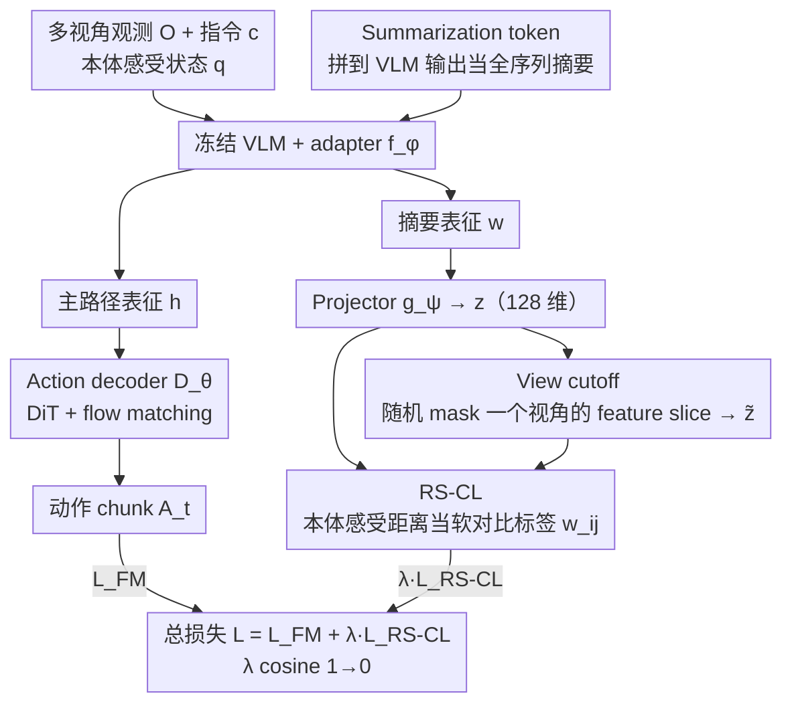

# Contrastive Representation Regularization for Vision-Language-Action Models

**会议**: ICML 2026  
**arXiv**: [2510.01711](https://arxiv.org/abs/2510.01711)  
**代码**: 待确认  
**领域**: 机器人 / VLA / 表征学习  
**关键词**: 视觉语言动作模型, 本体感受对比学习, 表征正则化, view cutoff, GR00T

## 一句话总结
作者发现 VLA 模型里继承自 VLM 的表征被视觉外观主导、对机器人本体状态不敏感，提出 Robot State-aware Contrastive Loss（RS-CL）把本体感受状态之间的欧氏距离当作"软对比标签"重塑表征，并配合"view cutoff"的表征级增广，把 GR00T N1.5 在 RoboCasa-Kitchen 推到 69.7% SOTA，在真实 Franka 拾放任务上把成功率从 45.0% 抬到 58.3%。

## 研究背景与动机
**领域现状**：当前 SOTA 的 VLA 模型（$\pi_0$、GR00T N1.5、$\pi_0$-FAST 等）几乎全都遵循"预训练 VLM + 生成式 action decoder（DiT + flow matching）"的范式，用 action prediction loss 端到端监督。

**现有痛点**：VLM 是在互联网级 visual instruction 数据上预训练的，从没见过低层控制动作或本体感受状态。直接拿冻结 VLM 当条件，下游 VLA 的动作精度上不去；即使联合微调 VLM，表征仍被场景背景、大物体外观主导，对"机器人当前位姿、下一步动作"几乎不敏感（论文 Fig. 2b 的 t-SNE 显示同一任务在不同场景下的轨迹被场景而非任务进度分簇）。

**核心矛盾**：既要保住 VLM 的语义先验，又要让表征对控制信号敏感 —— 但 action prediction loss 是个间接信号，更新 VLM backbone 时梯度被 decoder "稀释"，难以直接重塑表征几何。

**本文目标**：在不引入额外训练阶段、不依赖外部 robotics 数据集的前提下，给标准 VLA pipeline 加一个轻量正则，让 VLM 表征显式对齐机器人本体感受状态。

**切入角度**：作者注意到对比学习的灵魂在于"正负样本怎么定义" —— CLIP 用图文对、TCN 用时序邻居、R3M/VIP 用 reward 邻近。那机器人的"自然相似度信号"是什么？答案是本体感受状态：物理上越接近的姿态，动作分布也越接近，应该被拉近。

**核心 idea**：把本体感受状态间的连续距离作为对比软标签 —— 不再二分正负，而是用 $w_{ij} \propto \exp(-\|\mathbf{q}_i - \mathbf{q}_j\|_2 / \beta)$ 给每对样本一个软权重，单阶段端到端联合训练 action prediction 与 RS-CL。

## 方法详解
RS-CL 把标准 VLA pipeline 多挂一条"对比正则路径"，整套框架只在原 GR00T N1.5 上多了一个 summarization token、一个 2 层 MLP projector 和一个 view cutoff 增广，几乎不改动主路径。

### 整体框架
- 输入：$V$ 个视角的观测 $\mathbf{O}_t^V$、任务指令 $\mathbf{c}$、本体感受状态 $\mathbf{q}$。
- VLM + adapter：冻结 VLM，训练 adapter $f_\phi$，输出 $\mathbf{h} \in \mathbb{R}^{N \times d_{\text{model}}}$。
- Action decoder $D_\theta$：DiT 架构，以 flow-matching 目标拟合下一段 horizon $H$ 的 action chunk $\mathbf{A}_t$。
- 正则路径：在 VLM 输出后拼一个可学习 summarization token $\mathbf{u}$，得到 $\mathbf{w}$，再过 projector $g_\psi$ 拿到 $\mathbf{z}$；对 $\mathbf{z}$ 做 view cutoff 增广得到 $\tilde{\mathbf{z}}$，二者之间施加 RS-CL。
- 训练：端到端，单阶段，$\lambda$ 用 cosine schedule 从 1.0 衰到 0 —— 早期强表征塑形、后期纯动作预测。

### 关键设计

**1. Summarization token $\mathbf{u}$ 摊销 VLM 表征：把长序列压成单 token 再做对比**

VLM 输出是长度为 $N$ 的序列，直接对全部 token 做对比损失既贵又会稀释信号。RS-CL 的做法借鉴 BERT 的 [CLS]：往 VLM 输出后 concat 一个可学习 token $\mathbf{u}$，让 adapter $f_\phi$ 顺手把它当"全序列摘要"产出，$[\mathbf{h}, \mathbf{w}] = f_\phi(\text{VLM}(\mathbf{O}_t^V, \mathbf{c}) \oplus \mathbf{u})$，再过一个 2 层 MLP projector $g_\psi$ 投到 128 维拿到 $\mathbf{z}$。

关键在于两条路完全解耦：$\mathbf{h}$ 走原来给 action decoder 的主路径，$\mathbf{w}$ 走新加的对比路径。projector 是 SimCLR 的标准做法，把对比目标隔在投影空间里，避免它直接污染送进 decoder 的表征。这样整个正则只是在主路径旁边挂了一根轻量的摘要-投影支线。

**2. Robot State-aware Contrastive Loss（RS-CL）：用本体感受距离当软对比标签，把表征从"按外观分簇"扭成"按控制状态分簇"**

VLM 表征的真正病根是被场景背景、大物体外观主导，对机器人当前位姿几乎不敏感。RS-CL 抓住的"自然相似度信号"是本体感受状态——物理上越接近的姿态，动作分布越接近，就该被拉近。但本体感受是连续的，硬切正负对（如 SupCon）需要离散标签，于是改用软权重：在大小为 $B$ 的 batch 里算所有对的 InfoNCE 相似度，每对带一个来自状态距离的权重

$$\mathcal{L}_{\text{RS-CL}} = -\sum_{i,j=1}^{B} w_{ij} \log \frac{e^{\text{sim}(\mathbf{z}_i, \tilde{\mathbf{z}}_j)/\tau}}{\sum_{k=1}^{B} e^{\text{sim}(\mathbf{z}_i, \tilde{\mathbf{z}}_k)/\tau}},\qquad w_{ij} = \frac{e^{-\|\mathbf{q}_i - \mathbf{q}_j\|_2 / \beta}}{\sum_k e^{-\|\mathbf{q}_i - \mathbf{q}_k\|_2 / \beta}}.$$

本体感受 $\mathbf{q}$ 取 end-effector 的 $x,y,z$ + 6D 旋转 + gripper（min-max 归一到 $[-1,1]$；real-robot close-lid 任务改用 7 个关节绝对位置）；$\beta$ 控制"距离→权重"映射的尖锐度，$\tau$ 控制相似度尖锐度。软权重让"几乎同姿态"的样本拉近、"完全相反姿态"的推远，中间平滑过渡，不用人工切阈值，相当于把机器人的物理结构直接嵌进了表征几何。

**3. View cutoff 表征级增广：在特征空间而非输入空间造正样本，省掉 VLM 重复前向**

要做对比就得有正样本，但传统数据级增广（裁剪、抖动）都得让 VLM 再 forward 一次，对 GR00T-N1.5 这种 backbone 算力直接翻倍。RS-CL 顺着 VLA 多视角输入的天然结构走捷径：随机选一个视角索引 $i \in \{1, \dots, V\}$，把 VLM 输出里对应那段 feature slice 直接 mask 掉得到 $\tilde{\mathbf{z}}$，只有 adapter $f_\phi$ 和 projector $g_\psi$ 重过一遍，VLM 前向完全不重复。

把增广从输入空间挪到特征空间不只是省算力——"看不到某个相机"本身就是一个难样本，教模型在视角缺失下保持鲁棒。这一点在 close-lid 任务里得到验证：拿到物体后腕部相机被遮挡，view cutoff 训练出的视角鲁棒性让成功率明显高于 baseline，省算力之外还白赚了部署鲁棒性。

### 损失函数 / 训练策略
总目标 $\mathcal{L} = \mathcal{L}_{\text{FM}} + \lambda \, \mathcal{L}_{\text{RS-CL}}$，其中 flow-matching loss 写作 $\mathcal{L}_{\text{FM}} = \mathbb{E}_s [\|D_\theta(\mathbf{h}, \mathbf{A}_t^s, \mathbf{q}) - (\epsilon - \mathbf{A}_t)\|_2^2]$，$\mathbf{A}_t^s = s \mathbf{A}_t + (1-s) \epsilon$ 是插值动作 chunk。$\lambda$ 初值 1.0、cosine 衰到 0，意味着早期强行重塑表征，后期把火力全部集中在动作精度上。Projector 用 2 层 MLP（hidden 2048，输出 128 维）。仿真实验在 RoboCasa-Kitchen 30/100/300 demos、LIBERO 四个 suite 上做；真实实验用 Franka Research 3 + Robotiq 2F-85 + 两个相机视角，5 个任务（4 拾放 + 1 close-lid）。

## 实验关键数据

### 主实验
| 基准 | 方法 | 成功率 (%) |
|------|------|-----------|
| RoboCasa-Kitchen (300 demos) | GR00T N1.5 baseline | 65.7 |
| RoboCasa-Kitchen | $\pi_0$ | 62.5 |
| RoboCasa-Kitchen | $\pi_0$-FAST | 63.6 |
| RoboCasa-Kitchen | FLARE | 66.4 |
| RoboCasa-Kitchen | GR00T N1.5 + HAMLET | 66.4 |
| **RoboCasa-Kitchen** | **GR00T N1.5 + RS-CL** | **69.7** |
| RoboCasa pick-and-place | baseline | 30.3 |
| RoboCasa pick-and-place | + RS-CL | 41.5 (+11.2) |
| Real robot (5 任务平均) | baseline | 45.0 |
| Real robot | + RS-CL | 58.3 (+13.3) |
| LIBERO Avg | GR00T N1.5 | 95.7 |
| LIBERO Avg | + RS-CL | 96.4 |

LIBERO 上 baseline 已经接近上限（95+），RS-CL 仍能在 Long-horizon suite 把 87.8 抬到 90.4，说明优势主要落在"动作精度真正成为瓶颈"的场景。

### 消融实验
| 配置 | RoboCasa-Kitchen 30 demos SR (%) | FLOPs ($\times 10^{12}$) |
|------|----------------------------------|--------------------------|
| GR00T N1.5 baseline | 48.2 | 2.58 |
| + Multi-view TCN | 50.0 | 7.53 |
| + Single-view TCN | 50.3 | 7.53 |
| **+ RS-CL (ours)** | **53.0** | **2.91** |

TCN（time-contrastive networks）作为最直接的 baseline 表征学习正则只比 baseline 高 1.8–2.1 ACC，但因为要重新 forward 一遍 VLM 构造时序正负对，FLOPs 飙到 7.53（约 3×）；RS-CL 拿到 +4.8 ACC 而 FLOPs 只多 0.33。论文还做了 from-scratch 实验（Fig. 7）覆盖 Qwen2.5-VL-3B/7B + SigLIP2 + GR00T N1.5 四种 backbone，RS-CL 对每一种都带来增益，说明该正则不挑 backbone。

### 关键发现
- 表征瓶颈是"控制相关性"而非"语义丰富度"：Fig. 2b/c 的 t-SNE 直观显示原 VLM 表征按场景外观分簇，RS-CL 训练后按任务进度（机器人当前姿态）分簇。
- 拾放任务收益最大（+11.2）：这类任务对末端位置精度敏感，本体感受对齐直接转化为定位精度；说明 RS-CL 适合作用在"精度瓶颈"任务而非"探索瓶颈"任务。
- view cutoff 不仅是省算力的 trick：close-lid 任务里拿到物体后腕部相机被遮挡，view cutoff 训练出来的视角鲁棒性让完全成功率明显高于 baseline，副产品很可观。
- $\lambda$ cosine 衰减是必要的：早期 $\lambda=1.0$ 用对比信号定型，后期 $\lambda \to 0$ 把全部梯度让给 flow-matching loss 雕动作精度，两阶段在单次训练里完成。
- 真实硬件上 +13.3% 是真金白银：从 45.0 到 58.3 跨过了"prototype → 可演示"的门槛，对推动 VLA 走出仿真有实际意义。

## 亮点与洞察
- 把"机器人物理结构"嵌进表征空间：用本体感受距离做软对比标签，是非常优雅的"先验注入" —— 不需要标人工标签，不需要外部 reward，直接利用 robot 自带的传感器读数；这种思路可以迁移到任何带连续状态的具身任务（自动驾驶可以用车辆位姿、操作臂可以用关节扭矩）。
- view cutoff 是 representation-level augmentation 的好例子：传统数据增广要重 forward 大 backbone，VLA 时代算力是奢侈品，把增广从"输入空间"挪到"特征空间"是一条通用的算力优化路径。
- $\lambda$ cosine 衰减把"表征学习 → 动作精化"两阶段折进单训练：避开了多阶段训练的 schedule 维护成本，工业部署友好。
- 与 TCN 的对比图（+2.7 ACC, $\sim$2.5× 算力节省）非常有说服力：把"为什么不用现成的对比方法"答得明明白白。

## 局限与展望
- 本体感受状态选择仍是经验性的：拾放用 end-effector 位姿、close-lid 用关节位置，没有给出系统的选择规则；如果任务空间和本体感受空间没有强对应（如灵巧手 21+ 自由度），$\|\mathbf{q}_i - \mathbf{q}_j\|_2$ 的均匀加权可能失真。
- 只验证了单臂 6-7 DoF 操作；双臂、移动操作、足式平台尚未测试。
- 与显式 world model / dynamics 预测类目标（如 V-JEPA、Dreamer 系列）的关系未讨论 —— 二者可能互补也可能冲突。
- 软权重 $w_{ij}$ 用欧氏距离，对于旋转部分（6D rotation）严格上应该走流形度量；论文没讨论这一点对训练稳定性的影响。
- 在低数据下 + RS-CL 的方差未给出多 seed；30 demo 拾放 +11.2 的提升是否在不同初始化下稳定，值得后续验证。

## 相关工作与启发
- **vs $\pi_0$ / GR00T N1.5**：原始 VLA 都靠 action prediction loss 反向更新 VLM，作者证明这种信号太弱、太晚；RS-CL 在表征层直接显式监督，单阶段就能涨 4 个点。
- **vs TCN (sermanet 2018)**：TCN 用时序邻居做正负对，需要重 forward + 额外数据挖掘；RS-CL 用本体感受距离，单 forward + 软标签，效果更好算力更省（53.0 vs 50.3，2.91 vs 7.53）。
- **vs R3M / VIP**：那一系工作把表征学习放在 pre-training 阶段（用 EgoNet/Ego4D），需要专门一段离线训练；RS-CL 不引入额外数据、不引入额外阶段，直接在下游 VLA 训练里 piggyback。
- **vs DUST / HAMLET / FLARE**：这些方案分别走"双对比 / 视频策略 / 流模型"路线，提升幅度 1–2 ACC；RS-CL 用最简单的对比正则一次拿到 +4 ACC，说明本体感受这个监督源被严重低估。
- **vs InstructVLA / RoboBrain / Cosmos**：那些方法堆 robotics-specific 预训练数据集，CORE 走相反路线——什么数据都不加，只重塑表征几何，工程成本天差地别。

## 评分
- 新颖性: ⭐⭐⭐⭐ 本体感受距离做软对比的具体形式新颖，但思路上延续 SupCon + R3M 路线。
- 实验充分度: ⭐⭐⭐⭐ 仿真 + 真机 + 4 个 backbone，覆盖广；缺多 seed 方差与失败案例分析。
- 写作质量: ⭐⭐⭐⭐ 动机三段式（VLM 表征瓶颈 → 对比设计选择 → 软标签）讲得很流畅，公式干净。
- 价值: ⭐⭐⭐⭐ 即插即用、算力开销极小、在主流 VLA pipeline 上稳定涨点，工程落地价值高。

<!-- RELATED:START -->

## 相关论文

- [\[CVPR 2026\] Cross-Hand Latent Representation for Vision-Language-Action Models](../../CVPR2026/robotics/cross-hand_latent_representation_for_vision-language-action_models.md)
- [\[ICML 2026\] LangForce: Bayesian Decomposition of Vision-Language-Action Models via Latent Action Queries](langforce_bayesian_decomposition_of_vision_language_action_models_via_latent_act.md)
- [\[ICML 2026\] StableVLA: Towards Robust Vision-Language-Action Models without Extra Data](stablevla_towards_robust_vision-language-action_models_without_extra_data.md)
- [\[ICML 2026\] SpecPrune-VLA: Accelerating Vision-Language-Action Models via Action-Aware Self-Speculative Pruning](specprune-vla_accelerating_vision-language-action_models_via_action-aware_self-s.md)
- [\[ICML 2026\] Neural Implicit Action Fields: From Discrete Waypoints to Continuous Functions for Vision-Language-Action Models](neural_implicit_action_fields_from_discrete_waypoints_to_continuous_functions_fo.md)

<!-- RELATED:END -->
