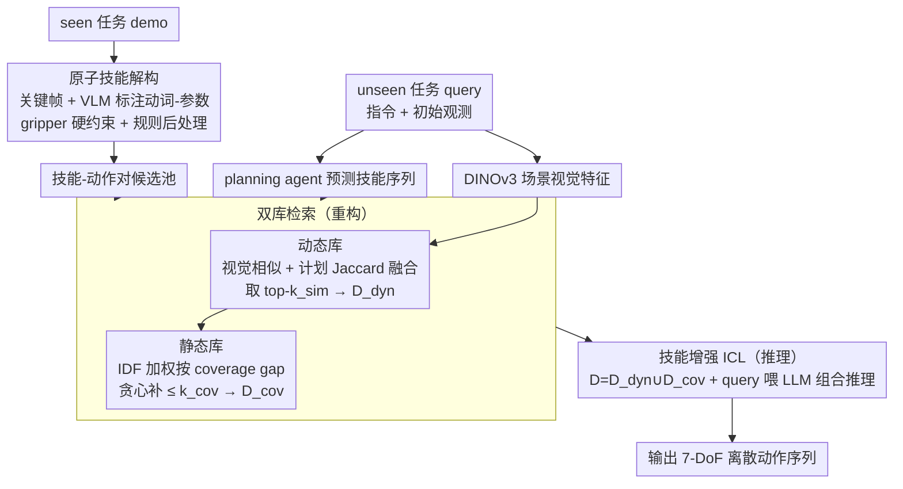

# Decompose and Recompose: Reasoning New Skills from Existing Abilities for Cross-Task Robotic Manipulation

**会议**: ICML 2026  
**arXiv**: [2605.01448](https://arxiv.org/abs/2605.01448)  
**代码**: 无（论文未声明）  
**领域**: 机器人 / 跨任务泛化 / 视觉-语言-动作模型  
**关键词**: 原子技能, in-context learning, 跨任务零样本, 动态/静态 demonstration 双库, 技能覆盖

## 一句话总结
针对"训练任务到全新任务"的零样本机器人操作，作者把 demo 拆成"原子技能-动作对"作为中间表示，再用 dual-library（动态库按视觉/计划相似度检索 + 静态库按 IDF 加权补全缺失技能 token）给 LLM 提供 skill-comprehensive in-context demonstrations，从而把"模仿轨迹"升级为"组合技能推理"。

## 研究背景与动机

**领域现状**：VLA 模型（RT-2、OpenVLA、π0、RDT）通过大规模机器人数据训练实现"在已知任务上抗视觉扰动"。最近 X-ICM 把 in-context learning（ICL）引入机器人跨任务零样本设置，用 dynamics-guided 检索从训练任务的 demo 池里挑相似 demo，喂给 LLM 直接预测动作。

**现有痛点**：(a) X-ICM 必须在特定任务分布上**训练一个**dynamics 检索器，弱化跨域迁移能力；(b) 喂给 LLM 的 demo 只有低层数值动作序列，缺乏"这一步在干什么/为什么/和下一步什么关系"的因果与过程信息；(c) 结果是 LLM 退化为"轨迹模式匹配"——遇到新技能组合时无法推理。

**核心矛盾**："跨任务"要求技能可组合、可推理，但既有 demo 表示只提供低层连续动作，根本不暴露技能结构；同时 demo 检索若只看视觉/动力学相似，可能漏掉解决新任务所需的关键技能模式。

**本文目标**：(1) 把不透明的连续动作序列拆解为"原子技能标签 + 动作"对作为中间表示；(2) 同时保证 demo 集合既"任务相关"又"技能覆盖完整"；(3) 完全 training-free（用通用预训练视觉编码器 + planning agent + LLM）。

**切入角度**：把"跨任务迁移"从"轨迹形状相似"层抬到"可组合技能结构"层——给 LLM 的 in-context demo 必须显式标注 verb-arg 化的原子技能，才能激发组合推理。

**核心 idea**：Decompose（把 demo 拆成原子技能-动作对）+ Recompose（用 dynamic + static 双库为新任务拼出技能齐全的 demo 集）。

## 方法详解

### 整体框架
论文把方法归纳为三大紧耦合组件（其中双库检索内部又分动态/静态两个库），串成一条 training-free pipeline：(1) **原子技能解构（Atomic Skills Collection）**：对每个 seen demo 抽 keyframe + 用 VLM 标 verb-arg 标签 + gripper 约束 + 规则后处理，得技能-动作对 $\{(s_k,a_k)\}$；(2) **双库检索（Dual-Library Retrieval）**：动态库用 DINOv3 编码场景视觉相似度 + planner 预测的技能序列做 Jaccard 相似度（verb 集合 + bigram 链），融合后排序选 top-$k_\mathrm{sim}$ 得 $\mathcal D_\mathrm{dyn}$；静态库再对每个 demo 抽 object-agnostic token (V:verb + B:bigram)，按 IDF 加权补齐 $\mathcal D_\mathrm{dyn}$ 的 coverage gap，得 $\mathcal D_\mathrm{cov}$；(3) **技能增强 ICL（Skill-Augmented ICL）**：把 $\mathcal D=\mathcal D_\mathrm{dyn}\cup\mathcal D_\mathrm{cov}$ 与 query 喂给 LLM 做组合技能推理，输出 7-DoF 离散动作序列。

### 关键设计

**1. Atomic Skills Collection（解构）：把每段 demo 拆成可组合的 skill-action 对**

低层数值动作序列没有语义、无法跨任务复用，LLM 拿到也只能照葫芦画瓢。这一步把每段 demo 转成带标签的原子技能。keyframe 由三条规则提取——gripper 状态变化、joint velocity 阈值、episode 终止；每段用 VLM 标成 $\mathrm{Verb}[\mathrm{obj}]$ 或 $\mathrm{Verb}[\mathrm{obj}_1,\mathrm{obj}_2]$（Verb ∈ {Reach, Move, Grasp, Release, ...}）。关键的工程细节是 gripper 硬约束：open→closed 强制标成 Grasp、closed→open 强制 Release，直接用物理常识把 VLM 的标注错误率压到最低；再加规则后处理强制 (movable, target) 参数顺序、把 open 状态下的关系动作降级为 Move。带上 verb-arg 标签后，LLM 才能把 demo 当"句子片段"来组合，而不是当一段无意义的数字。

**2. Dual-Library Demonstration Retrieval（重构）：同时满足任务相关与技能覆盖**

只按视觉/动力学相似度检索可能漏掉新任务必需的关键技能（比如解"开微波炉→放食物→关门"时，相似 demo 都是"开-放"却漏了"关门"）。所以用两个互补的库。动态库管"任务相关"，ranking score $s_i=\alpha\tilde s_i^\mathrm{vis}+(1-\alpha)s_i^\mathrm{plan}$，视觉相似 $s_i^\mathrm{vis}=\mathbf f^q\cdot \mathbf f_i$ 用 DINOv3 cosine，计划相似 $s_i^\mathrm{plan}=\lambda J(\mathcal V(\hat{\mathcal S}),\mathcal V(\mathcal S_i))+(1-\lambda)J(\mathcal B(\hat{\mathcal S}),\mathcal B(\mathcal S_i))$ 用 verb 集和 verb-bigram 集的 Jaccard。静态库管"技能覆盖"，每个 demo 用 object-agnostic token $\mathcal T(d)=\{\mathrm{V:}v\}\cup\{\mathrm{B:}v_1\to v_2\}$ 描述，token 权重按 IDF $w_t=(\log\frac{N+1}{\mathrm{df}(t)+1}+1)^\beta$，选择 score 是覆盖增益除以长度惩罚 $\sum_{t\in \mathcal T(d)\setminus\mathcal C}w_t / (1+\gamma|\mathcal S_d|)$。推理时先算 coverage gap $\mathcal G=\mathcal T(\hat{\mathcal S})\setminus \cup_{d\in\mathcal D_\mathrm{dyn}}\mathcal T(d)$，再从静态库贪心补 $\le k_\mathrm{cov}$ 个 demo。IDF 让"罕见但关键"的技能（如 Close、Insert）被优先补足，长度惩罚抑制长 demo 占满 context——任务相关性和技能覆盖度是两个正交需求，各用一个库来管。

**3. Skill-Augmented In-Context Learning（推理）：在技能脚手架上做组合推理**

有了语义化的 demo，就能让 LLM 真正做组合而非模式匹配。每个 demo 拼成 (instruction, atomic skill sequence, action sequence) 三元组当 context，LLM 接 query 的 instruction、初始观测（离散化对象坐标 + gripper 状态）和 planner 预测的技能序列，按"decompose query → recompose from existing skills"范式输出 $\{a_1^q,\ldots,a_T^q\}$，每个 $a_t$ 是 3D voxel index + Euler bin + gripper bit。让 LLM 显式看到"上一帧 Reach[knife]、下一帧 Grasp[knife]、再下一帧 Move[knife, board]"这样的因果链条，就能触发"我可以把已知的 Reach+Grasp+Move 组合起来解决新任务"的推理，而不是套着已知轨迹形状硬贴。整条 pipeline 全程用预训练权重（DINOv3 / planner / VLM / LLM）、不更新任何参数，跨域迁移阻力极小。

### 损失函数 / 训练策略
**完全 training-free**：DINOv3、planning agent、VLM、LLM 全部使用预训练权重，不更新任何参数。超参数 $\alpha,\lambda,\beta,\gamma,k_\mathrm{sim},k_\mathrm{cov}$ 按经验选择。

## 实验关键数据

### 主实验（AGNOSTOS benchmark 跨任务零样本，成功率%）

按 paper Table 1 汇总，单个任务 our vs X-ICM 对比（取若干代表性 Level-1/Level-2 任务）：

| 任务 | X-ICM | Ours | Δ |
|---|---|---|---|
| Micro. (open microwave) | 45.3 | **62.7** | +17.4 |
| Seat | 48.0 | **72.0** | +24.0 |
| LampOff | 58.7 | **67.0** | +8.3 |
| LampOn | 50.7 | **52.3** | +1.6 |
| Fridge | 22.7 | **34.7** | +12.0 |
| Knife | **26.7** | 21.3 | -5.4 |
| Phone | **57.3** | 42.7 | -14.6 |
| 多数 Level-2 任务 | 多为 0 | 部分有提升 | 小幅 |

整体结论：在 23 个 unseen 任务（13 Level-1 + 10 Level-2）上，Ours 在多数与典型 ICL 基线 X-ICM 有竞争性或更优表现，特别是涉及多步骤组合（如 Micro., Seat, Fridge）时优势明显。Foundation VLA（OpenVLA、RDT、π0）与 In-Domain 方法（PerAct、RVT、Sigma-Agent）整体被超过。

### 消融实验（基于论文设计推断的关键变体）

| 配置 | 现象 | 解释 |
|---|---|---|
| Full (Dynamic + Static + atomic skill labels) | 最佳 | 三模块协同 |
| 仅 Dynamic 库（无 Static 补齐） | 多步任务掉点 | coverage gap 未被弥补 |
| 仅 Static 库（无 Dynamic 检索） | 任务相关性弱 | demo 与 query 视觉/计划不匹配 |
| 移除原子技能标签（退化为 X-ICM 的纯动作 demo） | 显著下降 | LLM 退化为轨迹模仿，无技能推理 |
| 无 gripper 硬约束的 VLM 标注 | 标注噪声增大 | 物理一致性被破坏 |

### 关键发现
- "原子技能标签 + 动作对"的中间表示是最关键的一跃——只要把这一层暴露给 LLM，跨任务组合推理立刻被激活；没有它，再好的检索也只是更精准的"复制粘贴轨迹"。
- Dynamic + Static 双库的协同优于任一单库，验证了"任务相关性"与"技能覆盖度"是两个正交需求。
- IDF 加权使罕见但关键的 verb（如 Close, Insert）在静态库选择中获得高优先级，对完成 Level-2 多步任务尤为重要。

## 亮点与洞察
- **训练-free 但效果好**：不依赖任何 dynamics 检索器训练，所有组件都是预训练 + 规则，跨域迁移阻力极小。对工业部署是巨大优势。
- **把 ICL 范式正确地"语义化"**：先前 ICL-for-robot 都喂数值动作，本文坚持喂语义 token，是把 LLM 强项（符号组合推理）真正用对的地方。
- **gripper 硬约束 + 规则后处理**这一系列工程细节使 VLM 标注落地，是值得复用的标注-LLM 协作范式。
- **object-agnostic verb token + IDF 选 demo**是清晰的"少量样本，最大覆盖"信号，可迁移到任何需要 in-context demonstration 选择的领域（不只是机器人）。

## 局限与展望
- 在某些技能简单的任务（Knife, Phone）上反而被 X-ICM 反超——可能是 atomic skill 抽象过细，反而模糊了视觉相似度信号。
- 原子技能词表 $\mathcal V$ 是手工定义的封闭集（Reach/Move/Grasp/Release/...），遇到全新动作类型（如 pour、wipe）时需要扩展，缺乏自动发现机制。
- planner 预测错误会同时污染动态库的 plan-similarity 与静态库的 coverage gap——上游脆弱性未明确量化。
- 7-DoF 动作离散化粒度（voxel + Euler bin）较粗，对高精度操作（穿线、拧螺丝）可能不够。
- 真实环境实验只在论文末提及，未给完整数值表，sim-to-real 差距未深入讨论。

## 相关工作与启发
- **vs X-ICM (Zhou et al. 2025)**: 同走 ICL for cross-task，但 X-ICM 需训练 dynamics 检索器且只喂动作；本文 training-free 且喂 skill-action 对，是直系升级。
- **vs RoboPrompt / KAT / InCoRo / Instant Policy**: 这些都聚焦 within-task；本文是 cross-task zero-shot。
- **vs VoxPoser / MOKA / COPA / ReKep**: modular VLA 方案，依赖大量任务特定 prompt engineering；本文只需统一的 atomic-skill schema。
- **vs 端到端 VLA（OpenVLA, π0, RDT, LLARVA, HPT）**: 这些靠数据规模硬扛 cross-task，但 AGNOSTOS 显示效果有限；本文用 ICL + skill abstraction 提供互补思路。

## 评分
- 新颖性: ⭐⭐⭐⭐ Atomic skill 中间表示 + dual-library 双信号是新颖且具说服力的组合，给 cross-task ICL 一个清晰范式。
- 实验充分度: ⭐⭐⭐ AGNOSTOS 23 任务 + 真实环境验证；但消融与失败案例分析略浅，sim-to-real 不够细。
- 写作质量: ⭐⭐⭐⭐ Figure 1/2/3 把概念讲清楚；公式简洁；Table 1 排版稍密但完整。
- 价值: ⭐⭐⭐⭐ 给 robot manipulation 社区一个 training-free 的强基线，且 atomic-skill abstraction 思路可外推至 agent / 工作流自动化等领域。

<!-- RELATED:START -->

## 相关论文

- [\[ICML 2026\] TapSampling: Inference-Time Sampling with a Task-Progress-Understanding Verifier for Robotic Manipulation](tapsampling_inference-time_sampling_with_a_task-progress-understanding_verifier_.md)
- [\[CVPR 2026\] GeCo-SRT: Geometry-aware Continual Adaptation for Robotic Cross-Task Sim-to-Real Transfer](../../CVPR2026/robotics/gecosrt_geometryaware_continual_adaptation_for_rob.md)
- [\[CVPR 2026\] Action-Sketcher: From Reasoning to Action via Visual Sketches for Robotic Manipulation](../../CVPR2026/robotics/action-sketcher_from_reasoning_to_action_via_visual_sketches_for_robotic_manipul.md)
- [\[CVPR 2026\] Learning to See and Act: Task-Aware Virtual View Exploration for Robotic Manipulation](../../CVPR2026/robotics/learning_to_see_and_act_task-aware_virtual_view_exploration_for_robotic_manipula.md)
- [\[ICML 2026\] BEAR: Dissecting Embodied Abilities in Multimodal Language Models through Skill-level Evaluation and Diagnosis](dissecting_embodied_abilities_in_multimodal_language_models_through_skill-level_.md)

<!-- RELATED:END -->
