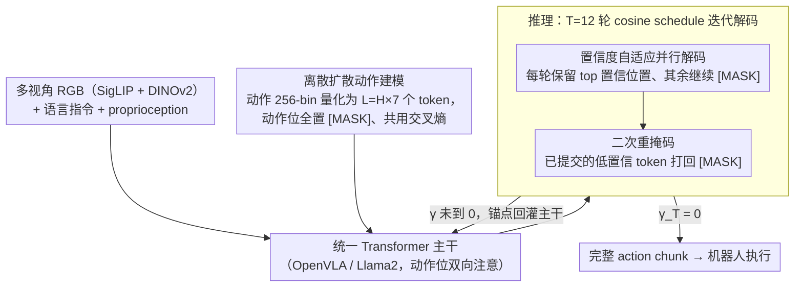

# Discrete Diffusion VLA: Bringing Discrete Diffusion to Action Decoding in Vision-Language-Action Policies

**会议**: ICML 2026  
**arXiv**: [2508.20072](https://arxiv.org/abs/2508.20072)  
**代码**: 待确认  
**领域**: 机器人 / 具身智能 / VLA  
**关键词**: VLA, 离散扩散, 动作解码, 自回归替代, 视觉语言保留

## 一句话总结
本文把 VLA 的动作解码从自回归（AR）或外挂连续扩散头改成"在统一 Transformer 内部对离散动作 token 做掩码扩散"，配合按置信度自适应排序的并行解码和二次重掩码纠错，在 LIBERO 上达到 96.4% 平均成功率、SimplerEnv-Fractal 64.1% 总均分，且在 OOD 语言/视觉扰动下退化仅 0.8% / 20.4%，显著优于连续扩散和并行解码 baseline，同时保留了预训练 VLM 的多模态先验。

## 研究背景与动机

**领域现状**：现代 VLA 把大型 VLM 主干拼上一个"动作生成头"映射为机器人动作，主流走两条路：(1) AR 路线（OpenVLA、π0-FAST）把动作离散成 token，按 GPT 风格从左到右逐位生成；(2) 外挂连续扩散/流匹配头（π0、SmolVLA），把 VLM 输出的潜变量送进独立 diffusion 头吐连续轨迹。Transfusion 等工作尝试把扩散塞进同一架构，但仍然带着扩散专属训练目标。

**现有痛点**：AR 因强制左到右导致复合误差、推理低效（每个 token 一次 forward）且无法利用同 chunk 后续 token 信息；连续扩散虽建模能力强，但梯度信号和 VLM 主干的 LM 目标冲突，训练复杂，更关键的是会侵蚀 VLM 的预训练视觉-语言能力，让模型过度依赖视觉、对语言扰动鲁棒性下降。

**核心矛盾**：动作生成需要并行 + 可纠错 + 高精度，VLM 主干需要保留多模态先验 + 一致的优化目标——但 AR 牺牲了并行性、连续扩散牺牲了目标一致性，没人同时拿到。

**本文目标**：把动作生成统一回 VLM 主干内部，沿用同一套交叉熵目标，同时获得并行解码 + 任意顺序 + 可纠错三件套。

**切入角度**：作者注意到近期离散扩散（D3PM、MaskGIT、LLaDA、MMaDA）已经在图像和语言上证明：用"掩码-反掩码"的 token 级生成可以做出与 AR 抗衡的质量，并且天然兼容 LM 的交叉熵目标。如果把动作 chunk 也离散成 token，是不是就能把这套机制直接搬到 VLA 上？

**核心 idea**：在 VLM 主干内部把动作 token 当作"被掩盖的语言 token"来做掩码扩散，并设计自适应置信度调度 + 二次重掩码，让易到难地生成动作并允许纠错，从而在不引入新损失/新模块的前提下统一感知、指令理解和动作解码。

## 方法详解

### 整体框架
模型输入：多视角 RGB（一个第三人称头部相机 + 可选两个腕部相机，分别经 SigLIP 和 DINOv2 编码）+ 语言指令 + 可选 proprioception。所有视觉/语言 token 与"被掩盖的动作 token"一起喂给统一 Transformer（Prismatic-7B / Llama2 主干，源自 OpenVLA），主干对动作位置使用双向注意力。推理时，所有动作位置初始化为 [MASK]，按 cosine schedule 迭代 T=12 轮"反掩码 + 二次重掩码"，最终得到一整段 chunk 的动作。

### 关键设计

**1. 统一主干内的离散扩散动作建模：把动作 token 当"被掩盖的语言 token"，和 VLM 共用一套交叉熵目标**

AR 牺牲了并行性、外挂连续扩散又会用独立的训练目标稀释 VLM 先验。本文的破解是把动作生成嵌回 VLM 主干、沿用 LM 已熟悉的 cross-entropy。具体先把每个控制维度按 1%-99% 分位数做 256-bin 量化（gripper 单独二值化），单时间步 7 个 token（3 平移+3 旋转+1 夹爪），$H$ 个时间步拼成 $L=H\times 7$ 的 chunk；前向加噪是 Markov 链 $\mathbf{Q}_t \mathbf{e}_{a_{t,i}} = (1-\beta_t)\mathbf{e}_{a_{t,i}} + \beta_t \mathbf{e}_M$，每个 token 独立按 $\beta_t$ 被替换成 [MASK]。训练坍缩成单步掩码预测，采 mask ratio $\gamma_t$、在 $\gamma_t L$ 个位置打 [MASK]，最小化掩码位置的交叉熵

$$\mathcal{L}_{CE} = -\sum_{i \in \mathcal{M}_{\gamma_t}} \log p_\theta(a_{0,i} \mid \tilde{\mathbf{a}}_t, \mathbf{c}),$$

视觉和语言 token 只参与注意、不算 loss。共用 token 空间和损失意味着动作 head 不冲淡预训练先验；而离散扩散训练时遍历"指数多种 infilling 任务"，换来了推理时的任意顺序解码能力——这正是 AR 缺的灵活度。

**2. 按置信度的自适应并行解码：每轮先生易、后生难，让锚点帮难位置消歧**

OpenVLA-OFT 那种"一刀切全位置同时 argmax"的 BERT 式并行解码没有迭代精修能力。本文从 $\mathbf{a}_1=\mathrm{M}^L$（全 mask）出发，按 cosine schedule 单调递减 $\gamma_{t+1}<\gamma_t$；每步用 Max Confidence $s_{t,i}=\max_k p_\theta(k\mid \mathbf{a}_t,\mathbf{c})$ 或 Confidence Gap 给每个掩码位置打分，保留 top $(1-\gamma_{t+1})L$ 个位置做温度退火的 Gumbel-Max 采样，其余继续 [MASK]，直到 $\gamma_T=0$。

这样形成"先确定高置信锚点 → 锚点回灌主干 → 帮难位置消除歧义"的结构性优势；和 AR 比又避免被左到右顺序锁死，可利用 chunk 后段 token 已暴露的统计信息。可视化显示模型确实学会了"先定 gripper 状态再细化平移/旋转"这类可解释的解码顺序。

**3. 二次重掩码（Secondary Re-Masking）：给反向过程开一个自纠错的口子**

纯单调揭示（committed 就不能反悔）有个隐患——某个位置错得早、错得贴近 chunk 中段，错误会被后续 token 的注意力放大。二次重掩码在按 $\gamma_{t+1}$ 选完保留集 $\mathcal{K}_t$ 后，再对已提交 token 做一次阈值检查：若置信度 $s_{t,i}$ 低于随步数单调升高的阈值 $\eta_t^{\mathrm{abs}}$，就把它打回 [MASK]，即 $\mathcal{R}_t^{\mathrm{abs}} = \{ i \in \mathcal{K}_t : s_{t,i} < \eta_t^{\mathrm{abs}} \}$，进入下一轮重新生成。

整套机制与 Bayes 反向核保持一致，只在采样规则上加了一层一致性约束。它相当于给"易到难"的揭示过程补一个 self-correction 通道，从经验上压住了误差累积，计算开销可忽略。

### 损失函数 / 训练策略
单一损失：掩码位置上的硬标签 cross-entropy（一阶段端到端，无辅助目标）。从 OpenVLA backbone 初始化，图像 resize 到 $224 \times 224$；LIBERO 每个 suite 单独训一个 policy 并过滤失败 episode，SimplerEnv 在 Fractal 与 BridgeData-V2 上分别微调；chunk size 取 8（LIBERO/Fractal）或 3（Bridge）；推理 $T = 12$ 轮 cosine schedule。所有参数（VLM 主干 + 动作投影头）一起更新。

## 实验关键数据

### 主实验

| 数据集 / 指标 | 本文 | OpenVLA-OFT (L1) 连续 SOTA | OpenVLA-OFT (Discrete) | π0-FAST | OpenVLA | 差距 |
|---------------|------|----------------------------|------------------------|---------|---------|------|
| LIBERO 平均成功率 | **96.4%** | 97.1% | 95.5% | 85.5% | 76.5% | -0.7% vs 连续 SOTA / +0.9% vs 离散 SOTA |
| LIBERO-Long | **92.2%** | 94.5% | 92.0% | 60.2% | 53.7% | 离散方法最佳 |
| SimplerEnv-Fractal Visual Matching | **71.2%** | – | – | 61.9% | 27.7% | 全部方法 SOTA |
| SimplerEnv-Fractal 总均分 | **64.1%** | – | – | 60.5% | 33.8% | 全部方法 SOTA |
| SimplerEnv-Bridge 总均分 | **54.2%** | – | – | – | 7.8% | +14.7 vs π0、+6.4 vs π0-FAST |
| 真机 Cobot Magic（9.69 Hz）| 优于 baselines | – | – | – | – | 两个 tabletop 任务 |

### 消融实验（LIBERO-Goal OOD，500 rollouts / suite）

| 方法 | Original | Lang Aug | Vision Aug |
|------|----------|----------|------------|
| OpenVLA-OFT (Discrete, 并行解码) | 95.6% | 87.6% (↓8.0%) | 73.0% (↓22.6%) |
| OpenVLA-OFT (Diffusion, 连续扩散) | 96.0% | 93.6% (↓2.4%) | 67.0% (↓29.0%) |
| OpenVLA-OFT (L1) | 97.9% | 94.7% (↓3.2%) | 74.7% (↓23.2%) |
| **Discrete Diffusion VLA** | 96.8% | **96.0% (↓0.8%)** | **76.4% (↓20.4%)** |

LIBERO-Spatial OOD 同样呈现"绝对值最佳 + 退化最小"的趋势（vision 退化仅 ↓0.8%，对照连续扩散 ↓5.8%）。

### 关键发现
- 离散扩散范式的 OOD 鲁棒性显著领先：语言增强下退化 0.8% vs 并行解码的 8.0%，视觉增强下退化 20.4% vs 连续扩散的 29.0%，验证了"同一交叉熵目标 + 同一 token 空间"对 VLM 先验的保护效果。
- 在 ID 上虽然落后连续 SOTA（OpenVLA-OFT L1）0.7%，但这 0.7% 主要来自分箱量化的天花板；在 SimplerEnv 上反超所有连续/离散方法，说明在跨域、跨机器人时离散扩散的工程通用性占优。
- 二次重掩码、cosine schedule、$T=12$ 推理轮是当前最优组合；可视化显示模型确实学会了"先确定 gripper 状态再细化平移/旋转"这类可解释的解码顺序，从经验上佐证了"adaptive 而非固定顺序"的价值。

## 亮点与洞察
- "把动作 token 当作语言 token 用掩码扩散生成"这一思路打通了 VLA 训练-推理的目标一致性问题，是少见的把 NLP 侧最新进展（mask diffusion / LLaDA）干净迁回机器人侧的工作，省掉了连续扩散那套独立调度和损失。
- 自适应解码顺序 + 二次重掩码这套组合在 VLA 之外也很有迁移价值：任何"chunk-wise 离散输出 + 高精度需求"的任务（如代码生成、化学/分子序列、多机器人调度）都能直接复用这套思路。
- 用"OOD 退化幅度"作为"VLM 先验保留度"的代理指标非常聪明，把"语言能力保不保得住"从主观印象变成可量化的对比表，给后续 VLA 工作提供了一个标准化的鲁棒性度量。

## 局限与展望
- 256-bin 量化天花板在 LIBERO 上让本文落后 L1 回归 0.7%，对超精细操作（如插孔、拧螺丝）可能更明显；可以探索动态分箱或残差细化补偿量化误差。
- 二次重掩码阈值 $\eta_t^{\mathrm{abs}}$ 与温度 $\tau_t$ 的调度都是手工 schedule，没做端到端学习；如果交给可学习的 schedule 网络，可能在不同任务/平台上更稳。
- 推理需要 12 轮 forward，在 9.69 Hz 的真机控制频率已足够，但对更高频任务（接触式力控、抓飞物）需要进一步压缩 T 或做缓存复用。
- 仅在 7B 主干上验证，是否能在更小（适合边缘部署）或更大（百亿级）尺度同样保留先验仍待观察。

## 相关工作与启发
- **vs OpenVLA / π0-FAST（AR 离散）**: 同样用离散 token 但本文用双向注意 + 并行扩散解码替换 AR，既消除左到右复合误差又加速推理；本文 LIBERO 平均比 π0-FAST 高 10.9 个点，证明 AR 不是离散动作 token 的必然范式。
- **vs π0 / OpenVLA-OFT (Diffusion)（外挂连续扩散）**: 连续扩散建模平滑轨迹有优势但要带独立 head 和目标，VLM 先验被冲淡；本文在 ID 几乎追平、在 OOD（特别是语言扰动）大幅领先，验证了"统一目标"在 VLA 上的实际价值。
- **vs OpenVLA-OFT (Discrete, 并行解码)**: 它一次性 argmax 全部 token，缺乏迭代 refine；本文用置信度调度 + 二次重掩码做"先易后难 + 自纠错"，是对它最直接的升级路径，LIBERO 平均 +0.9%、Goal OOD Lang 退化从 8.0% 压到 0.8%。
- **vs MaskGIT / LLaDA / MMaDA（离散扩散主线）**: 本文把这条线扩到动作模态，并证明"action chunk + cosine schedule + adaptive order"这套配方在机器人控制上同样 work，给"统一离散扩散基座 + 多模态生成"的远景增加了一块拼图。

## 评分
- 新颖性: ⭐⭐⭐⭐ 第一次把离散扩散完整搬进 VLA，自适应解码 + 二次重掩码组合工程上很扎实
- 实验充分度: ⭐⭐⭐⭐⭐ LIBERO 全 suite + SimplerEnv 双机器人 + 真机 Cobot Magic + OOD 语言/视觉扰动 + 完整 baseline 矩阵
- 写作质量: ⭐⭐⭐⭐ 公式推导清晰，从 D3PM 形式化讲到工程实现连贯；个别表格混排略乱
- 价值: ⭐⭐⭐⭐⭐ 给"统一 VLM 主干内做动作生成"这条线提供了强 baseline，OOD 鲁棒性的提升对真实机器人部署意义直接

<!-- RELATED:START -->

## 相关论文

- [\[ICML 2026\] Neural Implicit Action Fields: From Discrete Waypoints to Continuous Functions for Vision-Language-Action Models](neural_implicit_action_fields_from_discrete_waypoints_to_continuous_functions_fo.md)
- [\[ICML 2026\] Dual-Stream Diffusion for World-Model Augmented Vision-Language-Action Model](dual-stream_diffusion_for_world-model_augmented_vision-language-action_model.md)
- [\[ICML 2026\] Latent Reasoning VLA: Latent Thinking and Prediction for Vision-Language-Action Models](latent_reasoning_vla_latent_thinking_and_prediction_for_vision-language-action_m.md)
- [\[ICML 2026\] Lagrangian Perturbation Diffusion Steering: Latent Reinforcement Learning for Generative Policies](lagrangian_perturbation_diffusion_steering_latent_reinforcement_learning_for_gen.md)
- [\[ICML 2026\] LangForce: Bayesian Decomposition of Vision-Language-Action Models via Latent Action Queries](langforce_bayesian_decomposition_of_vision_language_action_models_via_latent_act.md)

<!-- RELATED:END -->
