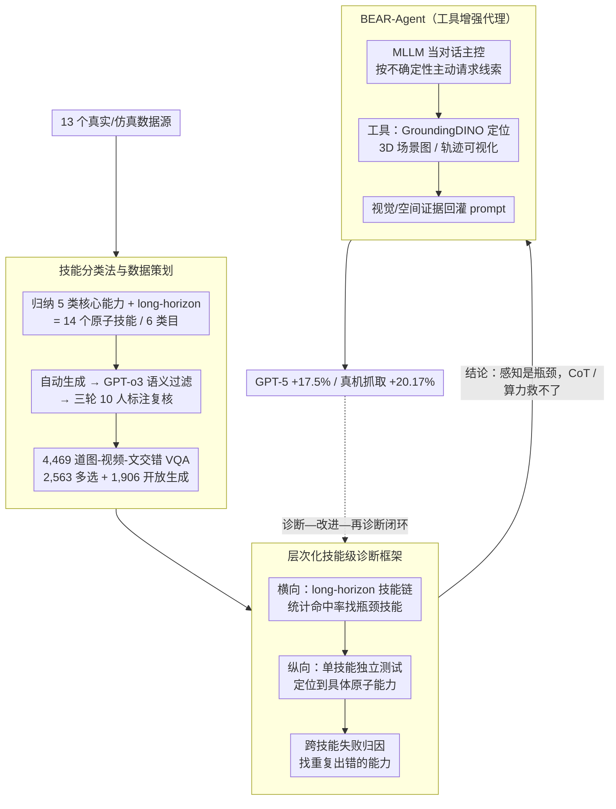

# BEAR: Dissecting Embodied Abilities in Multimodal Language Models through Skill-level Evaluation and Diagnosis

**会议**: ICML 2026  
**arXiv**: [2510.08759](https://arxiv.org/abs/2510.08759)  
**代码**: https://bear-official66.github.io/ (有，项目主页+评测数据)  
**领域**: 多模态VLM / 具身智能 / 评测基准  
**关键词**: 具身评测, MLLM诊断, 技能级评估, 工具增强Agent, 长程任务

## 一句话总结
BEAR 把具身任务拆成 14 个原子技能、构建 4,469 道图-视频-文交错的 VQA，对 20 个 MLLM 做技能级横纵向诊断，发现感知能力（而非推理）是真正瓶颈，并据此用 GroundingDINO、3D 场景图、轨迹可视化等外部视觉/空间工具拼出 BEAR-Agent，让 GPT-5 在该基准上相对提升 17.5%、在真实机器人抓取上提升 20.17%。

## 研究背景与动机

**领域现状**：MLLM 越来越多被当作具身智能体（embodied agent）部署在仿真和真实机器人上，从感知到规划一条龙输出动作。现有具身评测基准（EmbodiedBench、Embodied-Agent-Interface、ALFRED 等）大多以"任务整体成功率"作为唯一信号，要么聚焦单一子域（指向、空间），要么按高层模块（goal interpretation / subgoal decomposition）切。

**现有痛点**：任务级评测把"感知失误"和"规划失误"混在一个二元成功标签里，模型答对答错都看不出"在哪一步、为什么"挂掉，因此对模型改进几乎没有可操作性。把任务按模块切的方案虽然给出阶段成功率，但模块边界依然太粗，没法定位到具体的"感知/推理"原子能力。

**核心矛盾**：评测粒度（task-level）和改进所需要的粒度（capability-level）之间存在天然错位——只有把失败归因到底层原子能力，才能告诉研究者"该补感知"还是"该补推理"。

**本文目标**：(1) 在原子技能层面评测；(2) 把失败可解释地归因到具体能力；(3) 把诊断结论直接转化成可落地的改进手段。

**切入角度**：作者从认知科学和 BEHAVIOR-1K/ALFRED 的家庭活动轨迹归纳出具身任务执行的五条"主线"——任务规划、空间推理、bounding box 粗定位、pointing 精交互、trajectory 运动——再加一个 long-horizon 把它们串起来。这样每一步都对应一个"原子技能"，既覆盖人类执行任务的认知链路，又能在仿真 episode 上被自动校验。

**核心 idea**：把"具身评测"从"任务成功率"重写为"14 个原子技能 × 横纵向诊断"，再用诊断结论反推出"给 MLLM 外挂视觉/空间工具"这一改进路径，并把改进同样按技能验证回基准上，形成"诊断—改进—再诊断"闭环。

## 方法详解

### 整体框架
BEAR 由三部分组成：(1) 14 技能 / 6 类目的评测数据集，4,469 道图-视频-文交错 VQA，分别来自 13 个真实/仿真数据源；(2) 层次化诊断框架，包含"横向 long-horizon 找瓶颈技能 + 纵向独立技能精细评估 + 跨技能失败归因"三层；(3) 基于诊断结论的 BEAR-Agent，把 MLLM 当对话主控，外挂一组 Python 工具按需调用，把额外视觉/空间线索回灌进 prompt。三部分串成"数据策划→技能级诊断→工具增强→回基准再诊断"的闭环。

### 关键设计

**1. 技能分类法与数据策划：把任意具身任务拆成 14 个原子技能**

单一数据源只能覆盖一种能力，而且容易和模型预训练分布泄漏，导致模型靠刷某种题型蒙混过关。BEAR 先从认知科学和 BEHAVIOR-1K/ALFRED 的家庭活动轨迹归纳出 5 类核心能力——pointing（GEN/SPA/PRT 三种粒度）、bounding box（GEN/SPA/PRT）、trajectory（gripper/人手/物体）、task planning（TPR/NAP）、spatial reasoning（LOC/PTH/DIR）——再加一类把它们串起来的 long-horizon，共 14 个原子技能。取数据时按类目"对症下药"：pointing 走 OpenImages、trajectory 走 Open-X-Embodiment、long-horizon 从 AI2-THOR 收集 35 个 episode 并人工切成技能链，前后共用 13 个真实/仿真数据源。自动生成后用 GPT-o3 做语义过滤，再经至少三轮 10 人标注复核，最终保留 2,563 道多选 + 1,906 道开放生成。多源 + 多模态（图/视频/交错）能逼模型走真实的"感知—推理"路径，而不是在某一种风格的题上刷分。

**2. 层次化技能级诊断框架：把失败从"任务挂了"精确归因到"哪个原子能力挂了"**

任务级评测把感知失误和规划失误混进一个 0/1 标签，答错也看不出在哪一步、为什么挂，对改进几乎没有可操作性。BEAR 用三层把锅准确扣到能力上：**横向**用 long-horizon 类目，让 35 个 episode 按 5 类核心技能链式展开（如"放苹果到水槽"= 规划→寻找→规划路径→相对方向→视觉感知→轨迹放置），统计每一步命中率找出瓶颈技能；**纵向**用单技能题独立测试，把失败定位到具体原子能力；最后做**跨技能失败归因**，统计哪类能力在多种上下文里重复出错。横向告诉你"长程任务里 spatial reasoning 总挂"，纵向再分出"是 path planning 还是 relative direction 在挂"，跨技能归因再追问"是不是所有涉及深度的题都出问题"，三层叠起来就把诊断粒度从任务推到了能力。

**3. BEAR-Agent：把诊断结论变成可调用的工具增强代理**

诊断指出 CoT 和 test-time compute scaling 的增益普遍 <10%，说明问题不在"想得不够"而在"看得不到位"——既然瓶颈是感知，就该直接补视觉/空间证据，而不是堆推理算力。BEAR-Agent 把工具实现成模块化 Python 函数：GroundingDINO 做物体定位、3D 场景图模块给出物体间空间关系、轨迹可视化模块把动作画在图上让模型"读图"理解运动。MLLM 当对话主控，在多轮交互里根据当前不确定性主动请求"我想看 3D 场景图 / 我要 bbox / 我要轨迹可视化"，工具结果以图像或文本回灌进下一轮 prompt。这套设计不改 MLLM 权重，可即插即用到任何会话式 MLLM 上，既打在感知这个七寸上，又把诊断结论从"benchmark 上的发现"扩成"实际可落地的方案"。

### 损失函数 / 训练策略
BEAR 本身是评测+Agent 框架，不涉及模型重新训练；BEAR-Agent 也无需微调主干，仅基于上下文工具调用。评测协议沿用 VLMEvalKit 默认设置，按模型类型选择 Merged（多帧拼一张图）或 Sequential（逐帧）输入；pointing/spatial/planning/long-horizon 用 success rate，bounding box 用 IoU；long-horizon 一个 episode 内全步骤都对才算成功。

## 实验关键数据

### 主实验
在 BEAR 上共评测 20 个代表性 MLLM（含 GPT-5、Gemini-2.5-Pro、Claude-4-Sonnet、InternVL3、Qwen2.5-VL 等），并设 BEAR-mini（每技能 40 题）评估 5 位人类志愿者作为参考。

| 模型 | 类型 | Pointing-GEN | Spatial-LOC | Long-horizon | 总均分 |
|------|------|--------------|-------------|--------------|--------|
| Human | 人类 | 95.50 | 94.50 | 92.50 | 89.40 |
| GPT-5 | 闭源 | 70.00 | – | – | 52.2 |
| Gemini-2.5-Pro | 闭源 | 55.00 | – | – | – |
| Claude-4-Sonnet | 闭源 | 39.12 | 46.25 | – | – |
| InternVL3-8B | 开源 | 52.65 | 50.16 | 8.57 | 33.32 |
| Qwen2.5-VL-32B | 开源 | 27.35 | 47.23 | 20.00 | 28.33 |
| Random | 基线 | – | – | 25 | – |

闭源模型平均 39.2%，比开源高 13.4 个点；最强的 GPT-5 也只有 52.2%，距离人类 89.40% 还有 37 个点的差距。

### 消融实验
| 配置 | 关键指标 | 说明 |
|------|---------|------|
| GPT-5 baseline | 52.2% | 直接评测 |
| GPT-5 + CoT prompt | 增益 <10% | 思维链普遍只带轻微提升 |
| GPT-5 + test-time scaling | 增益 <10% | 推理时算力加大同样收效甚微 |
| GPT-5 + BEAR-Agent | 61.3% (+9.12 abs, +17.5% rel) | 工具增强是唯一带来大幅提升的路径 |
| 真实机器人抓取 + BEAR-Agent | +20.17% | 在 Cobot Magic 平台 tabletop manipulation 验证 |

### 关键发现
- 感知能力（pointing、bbox、trajectory）是绝大多数失败的根源，即便是"看起来重推理"的 task planning 和 spatial reasoning 也大量栽在感知层；说明现有 MLLM 不是不会推理，而是看不准。
- 空间-时间建模在跨技能归因里反复出问题，特别是 trajectory reasoning（人手 / gripper / 物体）三类都偏弱，CoT 和算力扩展几乎压不下去这类错误。
- BEAR-Agent 增益主要来自 "补线索" 而非 "补推理"，与诊断结论形成闭环；工具增强还能直接迁移到仿真和真实机器人，说明 BEAR 的诊断结论不仅在静态评测上有效，也指导实际部署。

## 亮点与洞察
- 用"原子技能 × 三层诊断"的方式把具身评测从 0/1 标签升级成可解释的能力雷达，给出了"评测—归因—改进"的可执行范式，是这类 benchmark 之前缺的一环。
- 诊断结论（"感知是瓶颈、CoT 救不了"）反直觉但有数据支撑，直接证伪了"再加点思维链就能涨"的常见预设，给后续具身 MLLM 工作指了一个相对清晰的方向：与其堆推理算力，不如补视觉/空间工具。
- "BEAR-Agent 用现成工具拼装"这种零训练改造路径可复用到任何评测瓶颈研究上：先用细粒度评测找出能力短板，再针对性外挂工具，最后用同一基准量化提升，闭环非常工程友好。

## 局限与展望
- 14 技能虽然覆盖广，但仍是"作者归纳的认知链路"，对于双臂协作、力/触觉、社交导航等更复杂的具身能力支持不足；real-robot 验证局限在 tabletop manipulation。
- BEAR-Agent 的工具列表（GroundingDINO、3D 场景图、轨迹可视化）依然偏静态视觉，对动态环境或在线感知不一定足够；工具调度策略主要靠 MLLM 自身判断，没有显式的工具规划损失。
- 数据策划用 GPT-o3 自动语义过滤虽然加了三轮人工复核，但具身视频题的歧义性较高，OOD 泛化和题面偏置仍需后续审计。

## 相关工作与启发
- **vs EmbodiedBench / Embodied-Agent-Interface**: 它们做任务级或高层模块级评测，给出阶段成功率但仍粗到难以归因；BEAR 切到原子技能并补全跨技能失败归因，把诊断粒度推进到能力层。
- **vs 单一域基准（pointing/spatial）**: 这些工作只测一种能力，模型可以靠局部 trick 刷分；BEAR 用 14 技能横向覆盖 + long-horizon 串联，强迫模型在统一框架内暴露全部短板。
- **vs OpenVLA / RT-2 等具身策略**: 后者关注"如何让模型做动作"，BEAR 关注"模型在哪一步看不懂世界"，两条线互补——BEAR 的诊断结论可直接指导 VLA 类工作的训练数据补强。

## 评分
- 新颖性: ⭐⭐⭐⭐ 把"原子技能 × 三层诊断 × 工具增强 Agent"组合成闭环，benchmark 工作里少见的"诊断驱动改进"思路
- 实验充分度: ⭐⭐⭐⭐⭐ 20 模型 × 14 技能 × 仿真+真实机器人验证，覆盖面和工作量都很扎实
- 写作质量: ⭐⭐⭐⭐ 结构清晰，诊断逻辑层次分明；个别公式/表格排版略冗长
- 价值: ⭐⭐⭐⭐⭐ 给具身 MLLM 提供了首个可操作的诊断基准与改进范式，结论（感知是瓶颈、CoT 救不了）对后续研究方向有直接指导意义

<!-- RELATED:START -->

## 相关论文

- [\[ICML 2026\] Embodied Interpretability: Linking Causal Understanding to Generalization in Vision-Language-Action Models](embodied_interpretability_linking_causal_understanding_to_generalization_in_visi.md)
- [\[ICML 2026\] Embodied Task Planning via Graph-Informed Action Generation with Large Language Models](embodied_task_planning_via_graph-informed_action_generation_with_large_language_.md)
- [\[ICML 2026\] Decompose and Recompose: Reasoning New Skills from Existing Abilities for Cross-Task Robotic Manipulation](decompose_and_recompose_reasoning_new_skills_from_existing_abilities_for_cross-t.md)
- [\[CVPR 2026\] HiF-VLA: Hindsight, Insight and Foresight through Motion Representation for Vision-Language-Action Models](../../CVPR2026/robotics/hif-vla_hindsight_insight_and_foresight_through_motion_representation_for_vision.md)
- [\[ICML 2026\] Contrastive Representation Regularization for Vision-Language-Action Models](contrastive_representation_regularization_for_vision-language-action_models.md)

<!-- RELATED:END -->
