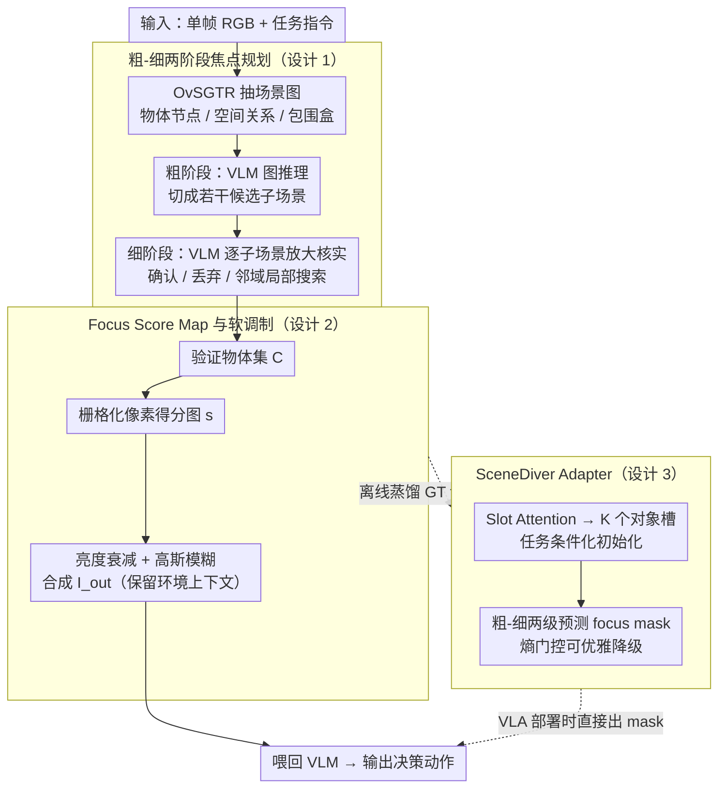

# Dive into the Scene: Breaking the Perceptual Bottleneck in Vision-Language Decision Making via Focus Plan Generation

**会议**: ICML 2026  
**arXiv**: [2606.04046](https://arxiv.org/abs/2606.04046)  
**代码**: https://future-item.github.io/SceneDiver (有)  
**领域**: 具身智能 / 机器人 / 多模态VLM  
**关键词**: VLM、VLA、视觉焦点规划、场景图、物体幻觉

## 一句话总结
SceneDiver 通过"先建场景图做粗粒度子场景分解、再让 VLM 以智能体方式逐子场景验证"的两阶段焦点规划，把任务相关物体过滤出来再喂回 VLM 做决策，并用 Slot Attention 适配器把这套显式推理蒸馏进 VLA，从而同时缓解高层规划与反应式控制中的视觉幻觉。

## 研究背景与动机
**领域现状**：具身决策任务通常拆成两条链路——以 VLM 作高层任务规划器、以 VLA 作端到端反应式控制器。前者擅长长程拆解但实时性差，后者实时性好但缺乏深思熟虑的推理。

**现有痛点**：两条链路共享同一个"感知瓶颈"——在杂乱场景里 VLM/VLA 既会幻视出不存在的物体，也会漏检、错绑属性或数错同类实例数量。Figure 1 给出两个典型失败：问"几个绿色物体"时注意力跑到背景；问"机械臂抓到的物体颜色"时注意力被旁边黄色块吸走。

**核心矛盾**：直觉上"一步聚焦"（用 SoM、Multi-Res、VCD 这类既有视觉聚焦法直接圈出关键物体）应当能解，但实测无效——在复杂场景里要可靠聚焦本身就需要先理解整个场景的拓扑关系，单步定位无法把任务相关物体从背景同色干扰物里剥出来。

**本文目标**：(1) 让 VLM 在做决策前自主生成"焦点计划"，把视觉输入压成只剩任务相关区域；(2) 把这种慢思考能力蒸馏进 VLA，让反应式策略也能受益且保持在线推理效率。

**切入角度**：作者把"聚焦"看成一个可被 VLM 自己规划的多步过程，借助场景图作为结构化先验来引导从粗到细的子场景分解；并把决策直接建模成"图像调制"——保留关键区域的高频与亮度、柔化背景，而不是硬裁切丢信息。

**核心 idea**：用 coarse-to-fine 的焦点规划替代一步聚焦，并把规划结果以"像素级 focus map + 软调制"的方式还回给 VLM/VLA，把"看清楚再决策"嵌进感知-行动闭环。

## 方法详解
SceneDiver 由三个串联组件构成：粗粒度场景图推理 → 细粒度子场景验证 → 焦点调制图像生成；外加一个把上述显式过程压缩成端到端模块的 VLA 适配器。

### 整体框架
输入是一帧 RGB 图与任务指令。先用 OvSGTR 抽出包含物体节点 `<ref>`、空间关系 `<pred>` 和包围盒 `<box>` 的场景图，文本化后塞给 VLM。VLM 据此做图推理，把整张图拆成若干候选子场景；随后 VLM 以智能体方式逐子场景"放大检查"，决定确认、丢弃或局部搜索，最终得到验证物体集 $\mathcal{C}$。再把 $\mathcal{C}$ 栅格化成像素级 Focus Score Map $s$，对图像做"亮度衰减+高斯模糊"的软调制，得到 $I_{out}$ 再喂回 VLM 出动作。VLA 部署时则跳过显式两阶段，由蒸馏出来的适配器直接预测 mask。

### 关键设计

**1. 粗-细两阶段焦点规划：先用场景图做全局分区，再以智能体方式逐子场景核实物体**

直觉上"一步聚焦"（SoM、Multi-Res、VCD 直接圈关键物体）应该能解感知瓶颈，但实测无效——复杂场景里要可靠聚焦本身就得先理解整张图的拓扑关系，单步定位剥不开同色干扰物。SceneDiver 把"哪里值得看"拆成两步：粗阶段以场景图为推理脚手架，VLM 输出结构化中间态（用 `<ref>` 标节点、`<box>` 标坐标），把全局场景切成若干局部子场景；细阶段对每个子场景做受限视野的"语义放大"——候选物体落在窗口内就确认，证据模糊就再缩小视野，缺失就在邻域局部搜索。

关键设计哲学是 VLM 始终是"事实唯一来源"，场景图只是可被驳回的导览：遇到图-像不一致时 VLM 可以挑空间相邻节点、丢弃或保留模糊候选，从而避免 OvSGTR 的检测误差直接传到下游决策。这样"识别 → 理解 → 分析"形成可迭代的认知循环，而不是把一切押在单次定位上。

**2. Focus Score Map 与软图像调制：把验证后的物体框翻译成柔化注意力，而非硬裁切**

得到验证物体集 $\mathcal{C}$ 后，怎么把它喂回 VLM？硬裁切（SoM 类）会抹掉机器人定位、避障所需的环境上下文。SceneDiver 改成可微的软调制：先生成像素级得分 $s_{u,v}=\mathbb{I}[\exists k\in\mathcal{C}:(u,v)\in b_k]$，引入可视下限 $\beta$ 防背景全黑、先做亮度衰减 $I_{dim}=I\odot(\beta+(1-\beta)s)$，再用 Gaussian blur 处理并按得分插值合成

$$I_{out}=s\odot I_{dim}+(1-s)\odot\mathcal{B}_\sigma(I_{dim}).$$

目标区域保留高亮度与高频细节，背景被同时调暗与模糊。本质是"压制干扰"而非"丢弃信息"，对失败回滚更友好，且可微像素操作能无缝接到任何 VLM 的输入端，迁移成本低。

**3. SceneDiver Adapter：用 Slot Attention 把显式两阶段推理蒸馏成 VLA 端到端模块**

迭代图遍历对 VLA 太重，在线推理跑不动，于是要把慢思考压成轻量模块。适配器接在跨模态投影器之后，用 Slot Attention 把视觉特征 $F\in\mathbb{R}^{L\times D}$ 投到 $K$ 个对象槽 $S\in\mathbb{R}^{K\times D_s}$，并用任务 token 池化出的 $v_{task}$ 条件化槽初始化 $S_{init}\sim\mathcal{N}(\mu(v_{task})+\delta,\sigma_{global})$，避免随机初始化把槽分给无关纹理。Mask 预测走粗-细两级：粗级用槽语义+槽质量+任务上下文打分 $r_k$，细级再用注意力图 $A\in\mathbb{R}^{K\times L}$ 把槽语义反传给 patch，得 $M_{pred}=\sigma(\sum_k r_k\cdot A_{k,:}+\alpha\cdot\Delta_{patch})$，$\alpha$ 初始接近 0 让网络先靠槽级预测、再渐进引入空间修正。

之所以选 Slot Attention，是因为对象槽天然对应"图节点"、mask 预测天然对应"两阶段推理结果"——训练用 Hungarian 匹配把槽对齐到场景图物体（Structure Loss + Mask Loss 双监督），学到的就是"如何输出 focus map"而非"如何模仿轨迹"。部署时再加一个基于熵的动态门控：patch 不确定性超阈值就跳过 mask、直接送原图给 VLA，做到困难场景优雅降级，避免错误 mask 反污染策略。

### 损失函数 / 训练策略
适配器训练采用两组监督：Structure Loss 让槽匹配到场景图节点，Mask Loss 让预测 mask 接近粗-细两阶段产生的 GT focus map。部署时加一个基于熵的动态门控：当 patch 不确定性超阈值就跳过 mask、直接把原始观测送入 VLA，做到"困难场景优雅降级"，避免错误 mask 反过来污染策略。

## 实验关键数据

### 主实验
机器人操作（MuJoCo 30 个场景，5 种子，30 步内组装 base plate 上的目标 brick）：

| 模型 | Base SR (%) | + SceneDiver Focus (%) | 绝对提升 |
|------|------|------|------|
| Qwen2.5-VL-7B-AWQ | 14.7 | 28.7 | +14.0 |
| Qwen2.5-VL-32B-AWQ | 21.3 | 31.3 | +10.0 |
| gpt-4o-mini | 28.7 | 34.0 | +5.3 |
| gemini-2.5-flash | 38.7 | 46.7 | +8.0 |

房间导航（Base / CS 常识 / CI 复杂指令 / VA 视觉外观四档干扰，5 种子）：

| 方法 (Qwen2.5-VL-7B) | Base | CS | CI | VA |
|------|------|------|------|------|
| Base Model | 32.7 | 30.7 | 32.0 | 27.3 |
| SoM | 30.0 | 31.3 | 31.3 | 29.3 |
| Multi-Res | 29.3 | 32.7 | 34.0 | 29.3 |
| VCD | 34.7 | 32.0 | 32.7 | 33.3 |
| SceneDiver | **44.0** | **36.0** | **37.3** | **35.3** |

在 LIBERO-Plus（OpenVLA-OFT 基座）上 SceneDiver adapter 把鲁棒性成功率最多拉高 9.6%，额外推理开销仅 2.64%。

### 消融实验
| 配置 | 关键现象 | 说明 |
|------|------|------|
| 完整 SceneDiver | 14.7→28.7 (7B) | 粗+细+调制三件套 |
| 只用 coarse 阶段 | 提升受限 | 子场景无验证，错节点会污染决策 |
| 只用 fine 阶段（无场景图） | 接近一步聚焦 | 缺全局拓扑，无法系统拆分干扰物 |
| 注入噪声场景图（压力测试） | 仍优于 base | 因为 VLM 被允许丢弃/替换图中节点 |
| 关掉 adapter 的熵门控 | 模糊场景下出错 | 错误 mask 反向污染 VLA |

### 关键发现
- 收益主要来自"先做拓扑分区再局部验证"——这与 Sec. 4 的失败分析一致：单纯 SoM/Multi-Res/VCD 在带干扰物场景里基本零增益甚至倒退（Qwen2.5-VL-7B 的 Base 32.7 → SoM 30.0），而 SceneDiver 把 Base 拉到 44.0。
- 开源模型受益最大：Qwen2.5-VL-7B 操作任务 SR 几乎翻倍，因为这类模型本身视觉幻觉最严重；闭源大模型增量较小（gpt-4o-mini 仅 +5.3）但仍正向。
- 软调制比硬裁切重要：保留亮度下限 $\beta$ 防止机器人丢失环境定位线索，是导航任务比操作任务对调制参数更敏感的原因。
- 适配器把开销控制在 2.64%，但只能在 mask 置信高时启用，否则要走熵门控回落，否则反而拖垮 VLA。

## 亮点与洞察
- "VLM 是事实唯一来源、场景图只是导览"这条设计哲学很关键：它把场景图当成"可被驳回的提议"而不是"必须服从的真值"，避免了 OvSGTR 误差直接传播到下游决策。
- 软调制 $I_{out}=s\odot I_{dim}+(1-s)\odot\mathcal{B}_\sigma(I_{dim})$ 把"注意力先验"以可微像素操作而非裁切实现，可以无缝替换到任何 VLM 的输入端，迁移成本低。
- Slot Attention + 任务条件初始化的写法把"对象槽 ↔ 场景图节点"的对应关系学得更稳，可以借鉴到任何需要把视觉 token 压缩成可解释对象表征的下游任务。
- 熵门控让蒸馏后的 VLA 有"知道自己不知道"的能力，避免错误 mask 把端到端策略带跑偏——很值得迁移到所有靠辅助预测器的 VLA 框架。

## 局限与展望
- 强依赖外部场景图模型 OvSGTR 的检测质量，作者虽做了噪声场景图鲁棒性测试，但在完全没有训练过的物体类别（开放词汇极端 case）下仍可能整段坍塌。
- 两阶段焦点规划在 VLM 端的推理代价并不便宜，论文也是因为这一点才不得不蒸馏出 adapter；如果是闭源 API 的 VLM，每步多轮 prompt 的成本会很显眼。
- 适配器目前只在 OpenVLA-OFT 验证，对不同范式（如 diffusion policy、π0）能否同样有效未知。
- 软调制对参数 $\beta,\sigma$ 比较敏感，论文是经验设定的全局值，能否在线根据场景自适应是一个明显延伸方向。

## 相关工作与启发
- **vs SoM / Multi-Res / VCD**: 三者都是"一步聚焦"路线，要么只标注、要么多分辨率裁切、要么对比解码；本文证明它们在带干扰物的具身决策里基本零增益，根因是缺全局拓扑理解。
- **vs Brohan 等 (RT/SayCan) 高层规划**: 这条路线把 VLM 用作动作序列规划器；SceneDiver 不替代规划，而是把"看清楚"塞在规划之前，与其互补。
- **vs Nguyen 2025 / Terra 等 3D 场景图机器人**: 他们用 3D scene graph 作环境表征供机器人长期记忆与可达性推理；SceneDiver 只用 2D scene graph 做单帧焦点规划，目标在感知瓶颈而非环境建模。
- **启发**: 把"显式多步推理 → 蒸馏成轻量端到端模块"这条流水线可以套用到很多"VLM 慢思考 / VLA 快反应"的场景，例如 VLN、自动驾驶感知增强、家务机器人多目标抓取等。

## 评分
- 新颖性: ⭐⭐⭐⭐ 把场景图作为可驳回先验、用软调制替代硬裁切、再用 Slot Attention 蒸馏到 VLA 这套组合在具身决策中并不常见。
- 实验充分度: ⭐⭐⭐⭐ 覆盖操作、导航、LIBERO-Plus 鲁棒性三类任务，开闭源模型并验，并做了噪声场景图压力测试。
- 写作质量: ⭐⭐⭐⭐ 故事线清晰，公式记号统一；个别失败案例展示偏少。
- 价值: ⭐⭐⭐⭐ 给"VLM-as-planner、VLA-as-executor"范式提供了可即插即用的感知前处理工具，对开源小模型增益尤其明显。

<!-- RELATED:START -->

## 相关论文

- [\[ICML 2026\] PSG-Nav: Probabilistic Scene Graph Navigation via Multiverse Decision Making](psg-nav_probabilistic_scene_graph_navigation_via_multiverse_decision_making.md)
- [\[ICLR 2026\] MemoryVLA: Perceptual-Cognitive Memory in Vision-Language-Action Models for Robotic Manipulation](../../ICLR2026/robotics/memoryvla_perceptual-cognitive_memory_in_vision-language-action_models_for_robot.md)
- [\[ICML 2026\] Spatial Memory for Out-of-Vision Manipulation in Vision-Language-Action](spatial_memory_for_out-of-vision_manipulation_in_vision-language-action.md)
- [\[CVPR 2025\] Decision SpikeFormer: Spike-Driven Transformer for Decision Making](../../CVPR2025/robotics/decision_spikeformer_spike-driven_transformer_for_decision_making.md)
- [\[ICML 2026\] From Abstraction to Instantiation: Learning Behavioral Representation for Vision-Language-Action Model](from_abstraction_to_instantiation_learning_behavioral_representation_for_vision-.md)

<!-- RELATED:END -->
