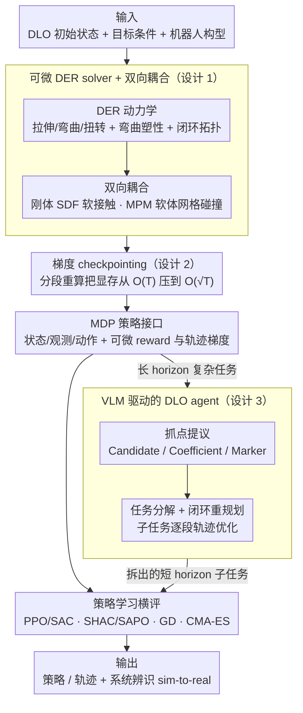

# DLO-Lab: Benchmarking Deformable Linear Object Manipulations with Differentiable Physics

**会议**: ICML 2026  
**arXiv**: [2606.04206](https://arxiv.org/abs/2606.04206)  
**代码**: 项目主页 https://dlo-lab-26.github.io/  
**领域**: 机器人  
**关键词**: 可变形线性物体、可微仿真、机器人 benchmark、Discrete Elastic Rods、grasp 提议  

## 一句话总结
DLO-Lab 在 Genesis 平台上用 Taichi 自研了一套以离散弹性杆（DER）为内核、支持双向耦合 + 弯曲塑性 + 闭环拓扑的可微仿真器，配套 10 个 rope/cable/橡皮筋 benchmark 任务和一个用 VLM 做"抓点提议 + 任务分解"的专门 agent，把 PPO/SAC/SHAC/SAPO/CMA-ES/GD 各路策略学习算法摆到统一擂台上 PK，并通过系统辨识做了真机 sim-to-real 验证。

## 研究背景与动机
**领域现状**：可变形线性物体（DLO，比如绳、电缆、橡皮筋）操作是机器人长期难题，过去工作要么把单一任务（拆结、绕线、塑形）专门 hard-code，要么靠真机数据训练，规模上不去且不通用。

**现有痛点**：现有 DLO 仿真器各有缺口——基于神经网络的（Bi-LSTM、GNN、DEFORM）有可微性但物理保真度差；基于 PBD 的（XPBD、SoftGym）速度快但弹性势能建得粗；基于 DER 物理模型的（Elastica、C-IPC、IMC）保真度高但不可微，无法做 gradient-based policy 优化；基于 MPM/Spring-Mass 的可微方案（DaXBench、PhysTwin）虽然可导，却在与刚体/软体的耦合或闭环拓扑上吃力。结果是没有任何一个平台同时提供"弹性势能 + 弯曲塑性 + 闭环拓扑 + 双向耦合 + 可微性"这五个对真实 DLO 操作必备的特性。

**核心矛盾**：物理保真（DER/有限元）与可微 + 与其他材质耦合（自动微分 + MPM/SDF 双向接触）之间的工程矛盾——前者倾向隐式时间步与硬约束求解器，后者要求显式时间步和可导接触模型。

**本文目标**：(1) 搭一套同时具备五大特性的 DLO 可微仿真器；(2) 设计能体现 DLO 独有难点（拓扑约束、抓点敏感、长 horizon）的 benchmark 任务集；(3) 给出一个能用 VLM 物理常识自动选抓点 + 拆分子任务的"DLO 专用 agent"，让长 horizon 复杂任务也能被现成 RL/优化算法解决；(4) 把 MFRL / FO-MBRL / 轨迹优化 / 进化算法放在同一 benchmark 上做横评，给后续研究找 baseline。

**切入角度**：以 Genesis 物理引擎为底，用 Taichi 做自动微分；DLO 自身用 DER 表达（中线顶点 + 适配正交标架），与刚体走 SDF 软耦合，与 MPM 软体走 Eulerian 网格双向碰撞；显式梯度检查点把"任意长 horizon"也变可微。VLM 负责给端到端策略难啃的"抓哪里、分几步"提供物理先验。

**核心 idea**：用一个"可微 DER 内核 + 双向耦合 + 梯度 checkpoint + VLM agent"的组合，把 DLO 操作这个高度结构化的难题首次系统化 benchmark 化。

## 方法详解
DLO-Lab 整体分成三层：底层物理仿真器（Section 3）、中层 benchmark 任务套件（Section 4.1-4.2）、上层 DLO agent（Section 4.3）。

### 整体框架
**输入**：每个任务的初始 DLO 状态（中线顶点 + 标架）、目标条件（如 S 形 / 套住环 / 绕过柱子）、机器人臂构型 + 末端夹爪。

**仿真核心**：自研 DLO solver 跑 DER 动力学；与 Genesis 自带的刚体 solver（SDF）和 MPM solver（流体/弹塑体）做双向耦合；全程用 Taichi autodiff 算梯度，跨时间步靠 gradient checkpointing 续命。

**策略接口**：MDP 标准接口，状态 $\mathbf{S}=(\mathbf{x},\dot{\mathbf{x}},\mathbf{r},\mathbf{M},\dot{\mathbf{M}})$ 包含全部 DLO 顶点位姿 + 静止配置 + 机器人关节状态，观测取 $(\mathbf{x},\dot{\mathbf{x}})\in\mathbb{R}^{N_v\times 6}$ 与末端位姿/关节配置，动作是 Cartesian 末端目标位姿（IK 反解到关节）。

**输出**：可微的 reward、可导的轨迹梯度 $\partial r/\partial a_{0:T}$，供 GD/SHAC/SAPO 用；同时支持纯采样型 RL（PPO/SAC）和黑盒优化（CMA-ES）。

### 关键设计

**1. 基于 DER 的可微 DLO solver + 双向耦合：把高保真物理和可微/可耦合两组互斥需求装进同一个 solver**

这是整个平台的物理底座，也是过去没人做成的地方——DER 实现（C-IPC、IMC）物理最准却靠隐式求解器、不可微，而可微方案（MPM/spring-mass）又在耦合和闭环拓扑上吃力。DLO-Lab 把 DLO 表示为中线顶点 $\mathbf{x}=\{\mathbf{x}_i\in\mathbb{R}^3\}$ + 每段边的 adapted 正交标架，势能由拉伸 $U_s$、弯曲 $U_b$、扭转 $U_t$ 三项构成，对状态求导后用 symplectic Euler 显式推进；弯曲塑性靠屈服阈值 $\sigma_y$ + 蠕变率 $r_c$ 调整 rest curvature 实现，闭环拓扑直接在中线首尾相接。耦合也是双向的：与刚体走 SDF 软接触，DLO 采样点查刚体 SDF、渗透深度 $d(\mathbf{p})=r(\mathbf{p})-\mathrm{SDF}(\mathbf{p})$ 经软指数因子 $f_i=\min(\exp(d/\epsilon_s),1)$ 做 impulse-based 摩擦响应，并把等大反作用力打回刚体保动量守恒；与 MPM 软体则在 Eulerian 网格循环里检测节点与 DLO 顶点/边碰撞，按相对速度+法向+质量比算 repulsive impulse 同步施加两侧。

关键突破是把物理上最尊重 DLO "细长杆"几何的 DER 离散化做成显式时间步、跑在 Taichi autodiff 上——首次让 DER 既保真又可微，还能跟刚体/流体玩到一起。

**2. 梯度 checkpointing：让"上千步全可微"在有限显存下成立**

DLO 任务里拆结、绕柱、编字母动辄上千 simulation step，标准 autodiff 要保存所有中间状态、$\mathcal{O}(T)$ 显存会立刻爆炸，first-order policy 优化（GD/SHAC）根本用不上完整轨迹梯度。DLO-Lab 参考 FluidLab 把轨迹拆段，前向时每段尾部把 state 缓存到 CPU、丢掉中间 GPU 计算图；反向时按逆序遍历 checkpoints，每段重新前向重建局部计算图再做该段 backward，把显存从 $\mathcal{O}(T)$ 压到 $\mathcal{O}(\sqrt{T})$（段长取 $\sim\sqrt{T}$ 最优），显存消耗与仿真步数解耦。

这本质是拿 1× 多次前向算力换 $\sqrt{T}$ 显存节约，对策略优化场景代价完全可接受，正是它让 first-order MBRL 能真在长 horizon DLO 任务上跑起来。

**3. VLM 驱动的 DLO agent：把"抓哪里、分几步"这种端到端策略学不会的结构化先验外包给 VLM**

DLO 操作有两个对纯 RL 致命的难点：抓错点会让任务变成 kinematically infeasible（拆结时抓错股就解不开），长 horizon 任务的奖励又稀疏到 PPO/SAC 根本探索不到。DLO agent 把这两块外包给 VLM。抓点提议设计三种 prompting 模式——Candidate（沿 DLO 采样候选点画图让 VLM 选优）、Coefficient（给两端让 VLM 输出 $[0,1]$ 归一化位置）、Marker（让 VLM 在渲染图上点像素坐标），实测 Candidate 最可靠。任务分解则让 VLM 先吐一个初始 plan（含每个子任务的 reward 函数与 horizon），逐子任务跑可微轨迹优化，每段执行完渲染轨迹再交回 VLM 评估是否完成、是否重规划，形成闭环。

这等于把世界模型的语义层和优化器的数值层分工合作——VLM 只负责符号化、需要物理常识的"哪里抓、何时换抓点"，避开它在低维数值精度上的弱点，把长 horizon、强拓扑约束的任务降维成多个短 horizon 子任务交给现成优化器啃。

### 损失函数 / 训练策略
- 仿真器本身可微，所有 reward 函数都做成可导（接触平滑、SDF 距离平滑等技巧），既支持纯采样 RL 也支持 first-order 优化。
- 平台同时跑 PPO、SAC（MFRL）、SHAC、SAPO（FO-MBRL，用 Taichi 算的解析梯度做 actor 优化）、GD（直接对 action sequence 做轨迹梯度下降）、CMA-ES（无梯度进化策略）。
- 真机迁移时用同一个可微仿真器做系统辨识：把仿真 rope 投影到图像得到二值 mask，与真机视频提取的 mask 算像素级差异，梯度回传到材料参数（拉伸/弯曲刚度），自动校准物理参数。

## 实验关键数据

### 主实验
8 个 fixed-horizon 任务（Coiling、Gathering、Lifting、Separation、Slingshot、Unknotting、Wiring-post、Wrapping）+ 2 个 long-horizon 任务（Letter Art、Wiring-ring）。每个 fixed-horizon 任务跑 3 个种子取最大 episodic return ± 标准差，long-horizon 任务用 DLO agent 评估。

| 任务 | PPO | SAC | SHAC | SAPO | GD | CMA-ES |
|------|-----|-----|------|------|-----|--------|
| Coiling | 9.40 | 8.28 | 11.55 | **11.57** | 11.59 | **11.73** |
| Gathering | 39.76 | 40.76 | 40.48 | 40.29 | 39.84 | **47.84** |
| Lifting | 247.38 | 250.29 | 214.24 | 204.54 | **255.55** | **335.59** |
| Separation | 114.31 | **134.71** | 96.29 | 105.27 | 115.52 | 84.86 |
| Slingshot | 6.90 | 7.23 | 6.90 | 6.90 | 6.90 | **11.07** |
| Unknotting | 3.29 | 2.95 | 45.88 | **46.30** | 3.44 | **57.21** |
| Wiring-post | 62.17 | 62.07 | 36.42 | 36.13 | 36.40 | **64.31** |
| Wrapping | 131.08 | 161.85 | 129.90 | 144.36 | 139.98 | **162.68** |

CMA-ES 在 6/8 任务上拿到最佳，FO-MBRL（SHAC/SAPO）在拓扑性强的 Unknotting 上把 PPO/SAC 从 3 直接拉到 46（接近 CMA-ES 的 57），证明可微梯度在接触密集任务上的决定性作用；GD 在 reward 平滑的 Coiling/Separation 上接近 CMA-ES，但在 Unknotting/Wiring-post 上掉进局部最优。

### 消融实验
| 配置 | 关键发现 | 说明 |
|------|----------|------|
| MFRL (PPO/SAC) vs 轨迹优化 | 轨迹优化样本效率显著更高 | RL 学闭环 policy 多了一层"探索 + 网络拟合"开销，DLO 这种稀疏奖励 + 高维顶点状态最吃亏 |
| FO-MBRL vs MFRL（Unknotting） | 46 vs 3 | 解析梯度让 SHAC/SAPO 能在接触切换处依然定位优化方向，PPO/SAC 完全卡在零梯度 |
| CMA-ES vs GD（Lifting/Slingshot） | CMA-ES 大幅领先 | DLO 未接触刚体时梯度为 0，GD 无热启动会失效；CMA-ES 无梯度依赖，能并行采样跳出 |
| Grasp proposal: Candidate / Coefficient / Marker | Candidate 最稳 | 直接挑离散候选最匹配 VLM 的图文推理能力，Coefficient/Marker 模式数值精度容易偏 |
| 任务分解 on long-horizon (Letter Art, Wiring-ring) | 闭环重规划显著提升成功率 | 单 phase 优化解决不了"必须先弯成 D，再换抓点弯成 L"的串行依赖 |
| 系统辨识 + 真机迁移 | 可微 sim 直接梯度优化 rope 参数 | Open-loop 直接 zero-shot 部署成功；closed-loop Wiring-ring 12 trials 中 7 次成功（≈58%） |

### 关键发现
- **可微性给 FO-MBRL 装上"接触穿透器"**：在 Unknotting 这种纯靠拓扑变化的任务上，解析梯度让 SHAC/SAPO 性能跳到 MFRL 的 15 倍，但前提是梯度有意义；一旦 reward 依赖未发生的接触（Lifting/Slingshot 中物体未被绳触到时），梯度变零，CMA-ES 反超。
- **闭环 policy 比开环轨迹优化更难学**：相同 sample budget 下 PPO/SAC 远输 CMA-ES——并不是 RL 算法不行，而是"既学策略又抗探索 + 闭环鲁棒性"这件事本身更难。结论是 DLO 领域以后做研究要分清楚 baseline 是开环还是闭环。
- **CMA-ES 的鲁棒性来自两点**：(1) 不依赖局部梯度，绕开零梯度死区；(2) 大规模并行采样，能在 DLO 这种非光滑 reward landscape 上跳出局部最优。差分仿真不是"取代采样"，而是要根据任务的梯度可用性选用。
- **VLM Candidate 模式 + 任务分解组合拳**让 Letter Art / Wiring-ring 这种 multi-stage 拓扑任务可解，否则纯端到端 RL 几乎不可能在合理 sample budget 内做出来。
- **Sim-to-real 真做出来了**：系统辨识把模拟绳 stiffness 反向求参数，闭环 Wiring-ring 真机 58% 成功率，开环 Gathering / Wiring-post 也能直接 zero-shot 部署。这是过去 DLO 仿真平台普遍欠缺的真机闭环验证。

## 亮点与洞察
- **"DER + 自动微分 + 双向耦合 + checkpoint"四件套组合首次齐活**：以前每个仿真器只占一两个特性（见 Table 1），DLO-Lab 一次性收齐五个，从此 DLO benchmark 有了"参考实现"。
- **可微 sim 用于系统辨识比用于策略更有杀伤力**：与其纠结梯度能不能解出最优策略，不如老老实实让梯度去标定真机物理参数，再把仿真训得的开环/闭环 policy 零样本部署——这条路看起来比"end-to-end differentiable policy"更稳。
- **VLM 给经典优化补结构化先验**：本文把 VLM 当 grasp planner 和 task decomposer 用，不让它直接输出 action，而是输出"在哪里、分几段"这种语义/拓扑标签——这是 VLM 在机器人控制里很务实的用法，避开了 VLM 在低维数值精度上的弱点。
- **横评得出的方法选择箴言**：reward 平滑 + 接触少 → GD；接触密集 + 梯度可达 → SHAC/SAPO；接触稀疏 / 非光滑 / 拓扑 → CMA-ES；通用闭环策略 → 必须比单任务多 10× sample。

## 局限与展望
- DER 仍然是杆型物体的离散化，对极细的电缆、极柔软的绳带可能要更细的离散度，仿真步长会变小，性能瓶颈在 Taichi 内核 + 显存。
- 双向耦合目前只覆盖刚体（SDF）和 MPM 软体/流体，对纺织品（厚布）、颗粒物（沙子）等其他可形变材质的耦合还要补。
- VLM agent 依赖外部 API（论文未明说哪一款），可靠性受 prompt 工程和模型版本影响；Candidate 模式比 Coefficient/Marker 稳，但仍未做"agent 自我纠错的失败案例分析"。
- 真机 Wiring-ring 58% 成功率与仿真还有 gap；闭环 sim-to-real 仅在一个任务上验证，缺乏对 perception/物理参数同时漂移的鲁棒性测试。
- benchmark 任务全部基于桌面 / 单臂 / 双臂 + parallel gripper，更复杂的灵巧手 / 双手协调 / 移动平台尚未纳入。

## 相关工作与启发
- **vs DaXBench (Chen et al., 2023)**：DaXBench 用 MPM 表示一切可变形物体，DLO 也被当成体积小颗粒；DLO-Lab 用 DER 直接尊重 DLO 的"线状几何"，参数维度低、物理保真高，且补齐了与 MPM 软体的耦合，相当于把 MPM 当作"其他材质"耦合进来而不是当主角。
- **vs PhysTwin (Jiang et al., 2025)**：PhysTwin 用 spring-mass 系统做可微复建，缺乏弯曲塑性和拓扑约束；DLO-Lab 的 DER 内核能精确捕捉刚性铜线、橡皮筋这种带塑性形变 + 闭环拓扑的物体。
- **vs C-IPC / IMC**：那些 DER 实现物理最准，但用隐式求解 + 不可微，无法做 first-order policy 优化；DLO-Lab 用显式 symplectic Euler + Taichi autodiff，是物理保真度与可微性之间的良好折衷。
- **vs SoftGym / XPBD**：PBD 系列速度快但精度差、缺乏闭环拓扑；DLO-Lab 用 PBD 仅做摩擦接触子模块，主体动力学交给 DER，扬长避短。
- **vs DEFORM (Chen et al., 2024)**：DEFORM 用神经网络近似 DER 动力学，自动可微但物理外推性能差；DLO-Lab 直接用解析 DER + autodiff，避免训练数据带来的泛化风险。

## 评分
- 新颖性: ⭐⭐⭐⭐ 把 DER + 双向耦合 + 可微 + checkpoint + VLM agent 五件套拼起来是有原创工程价值的，但单独看每个组件都有先驱。
- 实验充分度: ⭐⭐⭐⭐⭐ 6 种算法 × 10 个任务的完整横评 + 3 种 grasp prompt 模式消融 + 真机 open/closed-loop 部署，benchmark 论文该有的都齐了。
- 写作质量: ⭐⭐⭐⭐ 结构清晰，Table 1 一张图把和现有 simulator 的差异讲透；附录工作量大但正文已自洽。
- 价值: ⭐⭐⭐⭐⭐ 直接给 DLO 操作研究提供"统一基础设施 + baseline 横评 + sim-to-real recipe"，未来该方向投稿基本绕不开它。

<!-- RELATED:START -->

## 相关论文

- [\[ICML 2026\] RoboMME: Benchmarking and Understanding Memory for Robotic Generalist Policies](robomme_benchmarking_and_understanding_memory_for_robotic_generalist_policies.md)
- [\[AAAI 2026\] Distributionally Robust Online Markov Game with Linear Function Approximation](../../AAAI2026/robotics/distributionally_robust_online_markov_game_with_linear_function_approximation.md)
- [\[ICML 2026\] Plan in Sandbox, Navigate in Open Worlds: Learning Physics-Grounded Abstracted Experience for Embodied Navigation](plan_in_sandbox_navigate_in_open_worlds_learning_physics-grounded_abstracted_exp.md)
- [\[ACL 2025\] Vulnerability of LLMs to Vertically Aligned Text Manipulations](../../ACL2025/robotics/vulnerability_of_llms_to_vertically_aligned_text_manipulations.md)
- [\[CVPR 2026\] AGENTSAFE: Benchmarking the Safety of Embodied Agents on Hazardous Instructions](../../CVPR2026/robotics/agentsafe_benchmarking_the_safety_of_embodied_agents_on_hazardous_instructions.md)

<!-- RELATED:END -->
