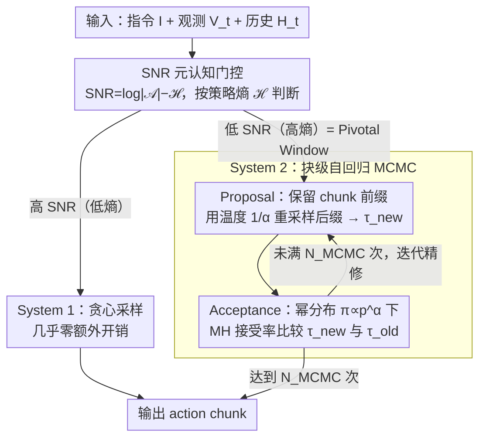

# Drift is a Sampling Error: SNR-Aware Power Distributions for Long-Horizon Robotic Planning

**会议**: ICML 2026  
**arXiv**: [2605.09537](https://arxiv.org/abs/2605.09537)  
**代码**: 无  
**领域**: 机器人 / VLA / 推理时计算  
**关键词**: Vision-Language-Action, 长程规划, 指令漂移, 幂分布采样, MCMC, 元认知控制

## 一句话总结
本文提出 CAPS：把"指令漂移"重新解释为系统性采样误差，用 SNR（=$\log|\mathcal{A}|-\mathcal{H}$）作为元认知开关，仅在高熵"Pivotal Window"触发基于幂分布 $\pi\propto p^\alpha$ 的 Metropolis-Hastings 迭代精修，在 RoboTwin、Simpler-WindowX、Libero-long 上 training-free 超越 OpenVLA 和 TACO。

## 研究背景与动机

**领域现状**：VLA 模型（OpenVLA、$\pi_0$、$\pi_{0.5}$ 等）在短程任务上表现优秀，但在长程操作（双臂协作、多步骤摆放）中频繁失败。常见失败模式称为 Instruction Drift——任务推进时，背景噪声和无关物体逐渐稀释初始指令的 attention 权重，机器人执行"局部合理但全局错误"的动作。

**现有痛点**：（1）Chain-of-Thought 这类 prompt engineering 无法打破开环生成的单向性；（2）TACO 的"generate-verify"范式靠并行采样 + reranker 选优，但单条轨迹一旦没被采到就无法 iteratively refine；（3）Tree-of-Thoughts、RoboMonkey 等全局搜索方法用固定高算力 budget，不适配机器人的实时闭环约束。

**核心矛盾**：连续控制空间下，单步贪心采样（低温采样）容易陷入"Negative Pivotal Window"——局部概率高但物理上不可逆地切断了通往全局成功的路径；而在离散符号推理中行得通的暴力枚举搜索（ToT 等），在高维连续动作流形上又不可行（**Topological Mismatch**）。

**本文目标**：（1）从采样理论角度重新定义漂移问题；（2）设计一个 training-free 的推理时计算框架，能在不重训的情况下提升长程鲁棒性；（3）只在必要时投入额外计算，保持实时性。

**切入角度**：信号检测理论——把指令漂移看作"有效信号衰减到噪声水平"的过程。在统计物理里，从幂分布 $\pi(\tau)\propto p_\theta(\tau)^\alpha, \alpha\ge 1$ 采样等价于隐式做未来 lookahead；Karan & Du 2026 已经在符号推理里证明这一点，本文把它迁移到连续动作流形。

**核心 idea**：构造"快/慢双过程"——System 1 在高 SNR 时贪心执行；System 2 在 SNR 跌破阈值时启动基于幂分布的 MCMC 迭代精修，把推理时间动态地换成长程一致性。

## 方法详解

### 整体框架
CAPS 在每个决策步运行如下流程：
1. **元认知门控**：基于策略熵 $\mathcal{H}(\pi_\theta(\cdot|H_t))$ 判断当前是否处于 Pivotal Window；
2. **若低熵（高 SNR）**：直接贪心采样动作（System 1，几乎零额外开销）；
3. **若高熵（低 SNR）**：进入 System 2 迭代——
    - **Proposal**：保留当前 action chunk 前缀，用 $p_\theta$ 以温度 $1/\alpha$ 重采样后缀，得到 candidate $\tau_{new}$；
    - **Acceptance**：用幂分布下的 MH 接受率比较 $\tau_{new}$ 与 $\tau_{old}$；
    - 迭代 $N_{MCMC}$ 次，输出最终 action chunk。

所有计算都在推理时进行，不更新任何参数，完全 plug-in。

### 关键设计

**1. 幂分布采样：把全局轨迹概率锐化，等价于隐式 lookahead**

单步贪心采样的毛病是容易掉进 Negative Pivotal Window——局部概率高、却不可逆地切断了通往全局成功的路。CAPS 的解法是不再从原始分布 $p_\theta(\tau|I,H_t)$ 采样，而是从锐化后的幂分布 $\pi(\tau)\propto p_\theta(\tau|I,H_t)^\alpha$（$\alpha\ge 1$）采样。$\alpha>1$ 让概率峰更尖（rich get richer），把那些"局部还行但全局会崩"的轨迹压下去。妙处在于 MCMC 在 $\pi$ 上采样根本不用直接算 $\pi$，只需要似然比 $(p_\theta(\tau_{new})/p_\theta(\tau_{old}))^\alpha$。理论上 Theorem 3.1 证明理想 lookahead 下有效 horizon 满足 $T_{eff}(\text{CAPS})/T_{eff}(\text{Base})\approx \epsilon^{1-\alpha}$（$\epsilon$ 是单步漂移率），$\alpha=2,\epsilon=0.1$ 时给出 10× horizon 提升；Theorem 3.2 进一步给出有限 MCMC 步数下的渐近下界，诚实承认了 $O(\rho^N)$ 的 sampling bias。这正是把"漂移"从建模问题重新框定为采样问题的核心。

**2. SNR-based 元认知门控：只在该精修的时刻投入算力**

对每一步都跑昂贵的全局搜索既不实时也没必要——漂移只在特定窗口高发。CAPS 把"何时启动 System 2"建模成资源约束下的最优控制。它定义 contextual SNR 为策略相对均匀分布的 KL：

$$\text{SNR}_t=D_{KL}(\pi_\theta\|\mathcal{U}_{\text{unif}})=\log|\mathcal{A}|-\mathcal{H}(\pi_\theta(\cdot|H_t))$$

由于 SNR 与策略 Shannon 熵严格线性负相关，直接用 $\mathcal{H}>\gamma$ 当高效代理判据就行。求解 $\mathcal{L}(\pi)=\mathbb{E}[\text{Error}]+\lambda\cdot\mathcal{C}(\pi)$ 得到 hard-threshold switching：高熵触发 CAPS 的迭代精修、低熵走 greedy。从信息几何看，高熵时刻正对应概率流形上的"分岔点"，也就是漂移最易发生的 Pivotal Window，把算力精准砸在这里。

**3. 块级自回归 MCMC（Block-based Autoregressive MCMC）：用局部 chunk 接受逼近全局轨迹目标**

直接在整条轨迹上跑 MCMC 计算不可行，CAPS 退到 chunk 级别做 Metropolis-Hastings。Proposal $q(\tau_{new}|\tau_{old})$ 显式定义为"保留当前 action chunk 的 prefix，用温度 $1/\alpha$ 重采样 suffix"，接受率为

$$A=\min\Big(1,\ \big(p_\theta(\tau_{new})/p_\theta(\tau_{old})\big)^\alpha \cdot \frac{q(\tau_{old}|\tau_{new})}{q(\tau_{new}|\tau_{old})}\Big)$$

每个 chunk 内部跑 $N_{MCMC}$ 轮 propose+accept，只在 chunk 边界真正输出动作。为什么局部修正还能保持全局一致？因为做接受判断时基础模型 $p_\theta$ 已经隐式编码了长程先验，所以"局部接受 + 全局打分"的折衷既绕开了全轨迹 MCMC 的计算墙，又借到了底座模型的长程一致性。整套流程纯推理时进行、不更新任何参数，对任何底座 VLA 都即插即用。

### 损失函数 / 训练策略
- 无训练，完全推理时 plug-in；底座 VLA 用 $\pi_0$ / $\pi_{0.5}$ / OpenVLA。
- 关键超参：$\alpha$（锐化系数，典型 2–4）、$\gamma$（熵阈值）、$N_{MCMC}$（迭代次数，trade-off 推理延迟）、chunk size。
- 硬件：4× A100；候选数 50（与 TACO 同档对比）。
- Autoregressive VLA（$\pi_{0.5}$）采样温度设 1。

## 实验关键数据

### 主实验

RoboTwin 1.0 平均成功率：

| 方法 | 平均 SR | Dual Bottles Hard | Mug Hanging Easy |
|------|--------|-------------------|------------------|
| $\pi_0$ | 32.2 | 48.0 | 7.0 |
| $\pi_0$ + TACO | 41.3 | 52.0 | 12.0 |
| **CAPS** | **47.4** | **61.0** | **21.0** |

Simpler-WindowX OOD generalization：

| 任务 | $\pi_0$ | TACO | **CAPS** | SpatialVLA |
|------|--------|-------|------|-------------|
| Spoon on Towel | 36 | 52 | **57** | 16.7 |
| Carrot on Plate | 42 | 52 | **61** | 25.0 |
| Stack Cubes | 34 | 30 | **37** | 29.2 |
| Eggplant in Basket | 80 | 88 | 87 | 100.0 |
| **Avg** | 48 | 55.5 | **60.5** | 42.7 |

RoboTwin 2.0（$\pi_{0.5}$ 基线，34 个任务平均）：

| 方法 | Avg SR |
|------|--------|
| RDT | 34.6 |
| $\pi_{0.5}$ | 59.3 |
| $\pi_{0.5}$ + TACO | 64.0 |
| **$\pi_{0.5}$ + CAPS** | **66.2** |

Libero-long 上 $\pi_{0.5}$ + CAPS 在 5/6 子任务上达到 98–100%，OpenVLA 仅 36–70%。

### 消融实验

| 配置 | RoboTwin 1.0 Avg |
|------|-----------------|
| $\pi_0$ 基线（System 1 only） | 32.2 |
| TACO（并行 sampling + rerank） | 41.3 |
| **CAPS Full**（双过程 + MCMC + 幂分布） | **47.4** |

论文附录还做了 $\alpha$ 与 $N_{MCMC}$ 敏感性分析（M、O），但主表显示 CAPS 比 TACO 在相同候选预算下高 6.1pp，说明 active iterative refinement 强于 passive screening。

### 关键发现
- **drift 是采样问题而非建模问题**：底座 VLA 不变、只换采样策略就能涨 15pp，验证了"drift = sampling error"假设。
- **dual-process 比并行采样更高效**：CAPS 仅在高熵窗口（Pivotal Window）触发 System 2，平均算力开销远低于 TACO 的全局并行 + rerank。
- **horizon extension 与理论吻合**：Theorem 3.1/3.2 预测 $\alpha=2$ 时 10× horizon 提升；实验中长程任务（Mug Hanging Easy 7→21、Blocks Ranking Size 36→46）增益最显著。
- **OOD 鲁棒性**：Carrot on Plate +19pp 显示 SNR 门控在视觉噪声（低 SNR）下触发更积极的 MCMC，能 escape 局部最优。

## 亮点与洞察
- **重新框定问题**：把工程性的"漂移"现象升格为采样理论问题，给出 $T_{eff}\propto \epsilon^{1-\alpha}$ 的解析关系，是少见的从理论到实证都自洽的 robotics 工作。
- **熵 = SNR 的桥**：用 $\text{SNR}_t=\log|\mathcal{A}|-\mathcal{H}$ 把"信号检测"和"策略不确定性"统一起来，提供了一个零开销的 metacognitive trigger。
- **MCMC 在连续控制中的妙用**：用基础模型 $p_\theta$ 作 proposal（温度 $1/\alpha$ 重采样后缀）+ 幂分布作 target，避免了 Tree-of-Thoughts 类方法的固定算力 budget 问题。
- **训练免费**：纯推理时 plug-in，对任何底座 VLA 都适用，工程落地友好。

## 局限与展望
- $\gamma$ 是固定阈值，作者在附录 F 给了 derivation 但未做自适应；不同任务的熵分布差异很大，可能需要 per-task tuning。
- 双臂任务上单臂 drift 仍是瓶颈（Block Handover 67/100、Handover Block 38/100），说明 chunk-based MCMC 对协同性约束建模有限。
- $N_{MCMC}$ 增加直接增加 wall-clock，实时控制场景需在精度-延迟之间细调；论文未给完整 latency profile。
- Theorem 3.1/3.2 假设单步漂移率 $\epsilon$ 恒定，但实际 $\epsilon$ 与场景复杂度强相关，理论收益可能被高估。
- 所有实验都在仿真，真实机器人上的 sim2real gap 未评估。

## 相关工作与启发
- **vs. TACO (Yang et al. 2025)**: TACO 把推理当 contextual bandit，靠 reranker 选最好的候选；CAPS 用 MCMC 做主动迭代精修，候选集质量差时仍能收敛。
- **vs. Tree-of-Thoughts (Yao et al. 2023)**: ToT 用固定算力做全局搜索，CAPS 用 SNR 门控按需触发，更适合实时控制。
- **vs. RoboMonkey (Kwok et al. 2025)**: RoboMonkey 训了专门的 verifier，CAPS 完全 training-free。
- **vs. Karan & Du 2026 (符号推理 power sampling)**: 把符号域的幂分布理论迁移到连续动作流形，证明同一数学框架在两种 modality 下都有效。

## 评分
- 新颖性: ⭐⭐⭐⭐ "drift = sampling error"重定义 + SNR-gated MCMC 的组合在 VLA 领域确实是新视角
- 实验充分度: ⭐⭐⭐⭐ 三个 benchmark × 多基线 × 训练免费对比扎实，但缺真实机器人和 latency profile
- 写作质量: ⭐⭐⭐⭐ 理论（Theorem 3.1/3.2）与算法（双过程伪代码）配合较好，但部分章节啰嗦
- 价值: ⭐⭐⭐⭐ 给现有 VLA 模型提供了一条 training-free 的长程性能提升路径，工程上立即可用

<!-- RELATED:START -->

## 相关论文

- [\[ICML 2026\] HDFlow: Hierarchical Diffusion-Flow Planning for Long-horizon Tasks](hdflow_hierarchical_diffusion-flow_planning_for_long-horizon_tasks.md)
- [\[ICML 2025\] Closed-loop Long-horizon Robotic Planning via Equilibrium Sequence Modeling](../../ICML2025/robotics/closed-loop_long-horizon_robotic_planning_via_equilibrium_sequence_modeling.md)
- [\[CVPR 2026\] PALM: Progress-Aware Policy Learning via Affordance Reasoning for Long-Horizon Robotic Manipulation](../../CVPR2026/robotics/palm_progress-aware_policy_learning_via_affordance_reasoning_for_long-horizon_ro.md)
- [\[ICML 2026\] TapSampling: Inference-Time Sampling with a Task-Progress-Understanding Verifier for Robotic Manipulation](tapsampling_inference-time_sampling_with_a_task-progress-understanding_verifier_.md)
- [\[AAAI 2026\] ManiLong-Shot: Interaction-Aware One-Shot Imitation Learning for Long-Horizon Manipulation](../../AAAI2026/robotics/manilong-shot_interaction-aware_one-shot_imitation_learning_for_long-horizon_man.md)

<!-- RELATED:END -->
